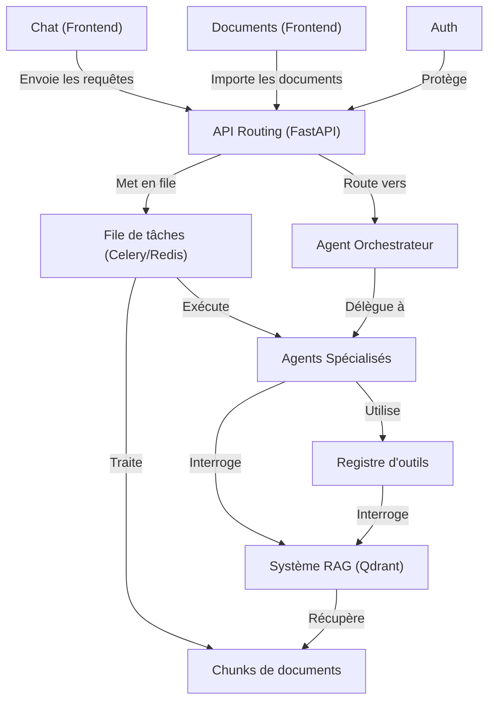

# RegulAIte

> **Système multi-agents d'analyse GRC (Gouvernance, Risques & Conformité)** — ancré dans vos propres documents.

*[Read in English](README.md)*

---

## C'est quoi RegulAIte ?

RegulAIte est un assistant GRC open-source développé par des étudiants de l'[OteriaCyberSchool](https://www.oteria.fr). Il permet aux organisations d'importer leurs documents internes (politiques, normes, contrats) et de les interroger via une IA conversationnelle — alimentée par une architecture multi-agents et un pipeline RAG (Retrieval-Augmented Generation).

Plutôt que de s'appuyer sur les connaissances génériques d'un LLM, RegulAIte répond aux questions de conformité **uniquement sur la base de vos documents**, rendant les réponses traçables et auditables.

---

## Fonctionnalités

- **Orchestration multi-agents** — un Orchestrateur délègue les tâches à des agents spécialisés (analyse de conformité, gap analysis, évaluation des risques, gouvernance)
- **Pipeline RAG** — les documents sont découpés, vectorisés et stockés dans une base vectorielle (Qdrant) pour une récupération précise
- **Gestion documentaire** — import et parsing de PDF, Word et autres formats via l'API Unstructured
- **File de tâches asynchrone** — les tâches longues sont gérées par Celery + Redis pour garder l'interface réactive
- **Authentification** — gestion des utilisateurs et des organisations intégrée
- **Support bilingue** — traitement des requêtes en français et en anglais

---

## Architecture



---

## Stack technique

| Couche | Technologie |
|---|---|
| Frontend | React |
| Backend | Python / FastAPI |
| Base vectorielle | Qdrant |
| Base relationnelle | MariaDB |
| File de tâches | Celery + Redis |
| Parsing documentaire | Unstructured |
| Conteneurisation | Docker Compose |

---

## Démarrage rapide

### Prérequis

- [Docker](https://docs.docker.com/get-docker/) et Docker Compose
- Une clé API LLM (OpenAI, Anthropic, ou compatible)

### Lancer le projet

```bash
git clone git@github.com:HXLLO/RegulAIte.git
cd RegulAIte

# Copier et configurer les variables d'environnement
cp backend/.env.example backend/.env
# Renseigner vos clés API et identifiants dans backend/.env

docker compose up --build
```

| Service | URL |
|---|---|
| Frontend | http://localhost:3000 |
| API Backend | http://localhost:8000 |
| Documentation API | http://localhost:8000/docs |
| Monitoring Celery | http://localhost:5555 |
| Dashboard Qdrant | http://localhost:6333/dashboard |

---

## Structure du projet

```
RegulAIte/
├── backend/
│   ├── agent_framework/     # Agents, orchestrateur, outils, RAG
│   ├── api/                 # Routes FastAPI
│   ├── queuing_sys/         # Workers Celery
│   └── config/              # Configurations des services
├── front-end/               # Application React
├── database-backups/        # Snapshots Qdrant
├── docs/                    # Documentation technique
└── docker-compose.yml
```

---

## Documentation technique

La documentation détaillée est disponible dans [`/docs`](docs/) :

- [Logging des agents](docs/AGENT_LOGGING.md)
- [Architecture base de données](docs/database_architecture.md)
- [RAG & expansion de requêtes](docs/QUERY_EXPANSION_README.md)
- [Système de backup](docs/BACKUP_SYSTEM_USAGE.md)
- [Et plus...](docs/)

---

## Équipe

Développé par des étudiants de l'[OteriaCyberSchool](https://www.oteria.fr) — école d'ingénierie en cybersécurité.

---

## Licence

[MIT](LICENSE)
