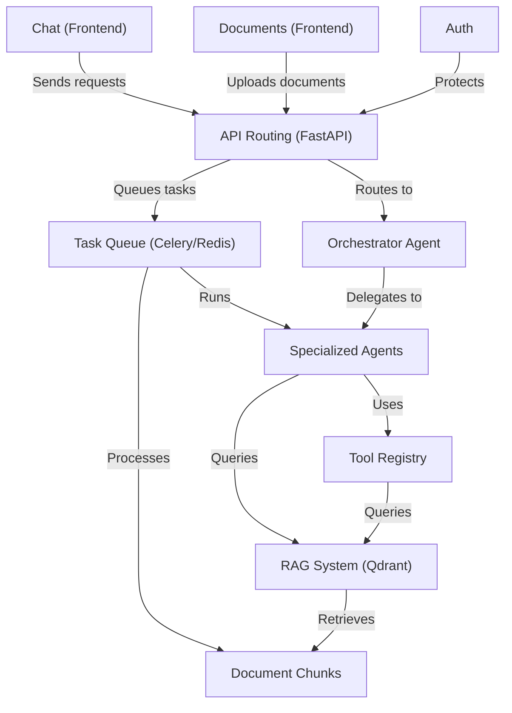

# RegulAIte

> **Multi-agent AI system for Governance, Risk & Compliance (GRC) analysis** — grounded in your own documents.

*[Lire en français](README.fr.md)*

---

## What is RegulAIte?

RegulAIte is an open-source GRC assistant built by students from [OteriaCyberSchool](https://www.oteria.fr). It lets organizations upload their internal documents (policies, standards, contracts) and query them through a conversational AI — powered by a multi-agent architecture and a RAG (Retrieval-Augmented Generation) pipeline.

Instead of relying on generic AI knowledge, RegulAIte answers compliance questions based **only on your documents**, making responses traceable and auditable.

---

## Features

- **Multi-agent orchestration** — an Orchestrator delegates tasks to specialized agents (compliance analysis, gap analysis, risk assessment, governance)
- **RAG pipeline** — documents are chunked, embedded, and stored in a vector database (Qdrant) for precise retrieval
- **Document management** — upload and parse PDF, Word, and other formats via the Unstructured API
- **Async task queue** — long-running agent tasks handled by Celery + Redis, keeping the UI responsive
- **Authentication** — user and organization management built-in
- **Bilingual support** — French and English query handling

---

## Architecture



---

## Tech Stack

| Layer | Technology |
|---|---|
| Frontend | React |
| Backend | Python / FastAPI |
| Vector DB | Qdrant |
| Relational DB | MariaDB |
| Task queue | Celery + Redis |
| Document parsing | Unstructured |
| Containerization | Docker Compose |

---

## Getting Started

### Prerequisites

- [Docker](https://docs.docker.com/get-docker/) and Docker Compose
- An LLM API key (OpenAI, Anthropic, or compatible)

### Run

```bash
git clone git@github.com:HXLLO/RegulAIte.git
cd RegulAIte

# Copy and configure environment variables
cp backend/.env.example backend/.env
# Edit backend/.env with your API keys and credentials

docker compose up --build
```

| Service | URL |
|---|---|
| Frontend | http://localhost:3000 |
| Backend API | http://localhost:8000 |
| API docs | http://localhost:8000/docs |
| Celery monitor | http://localhost:5555 |
| Qdrant dashboard | http://localhost:6333/dashboard |

---

## Project Structure

```
RegulAIte/
├── backend/
│   ├── agent_framework/     # Agents, orchestrator, tools, RAG
│   ├── api/                 # FastAPI routes
│   ├── queuing_sys/         # Celery workers
│   └── config/              # Service configurations
├── front-end/               # React application
├── database-backups/        # Qdrant snapshots
├── docs/                    # Technical documentation
└── docker-compose.yml
```

---

## Documentation

Detailed technical documentation is available in [`/docs`](docs/):

- [Agent logging](docs/AGENT_LOGGING.md)
- [Database architecture](docs/database_architecture.md)
- [RAG & query expansion](docs/QUERY_EXPANSION_README.md)
- [Backup system](docs/BACKUP_SYSTEM_USAGE.md)
- [And more...](docs/)

---

## Team

Built by students at [OteriaCyberSchool](https://www.oteria.fr) — French cybersecurity engineering school.

---

## License

[MIT](LICENSE)
