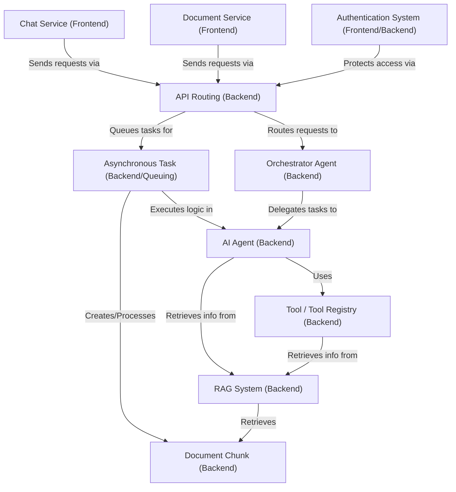
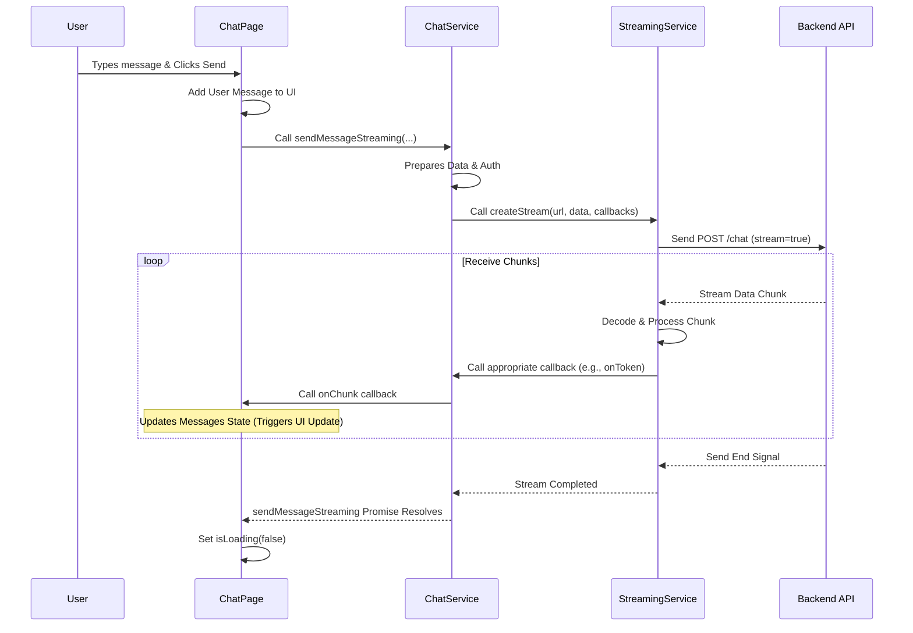
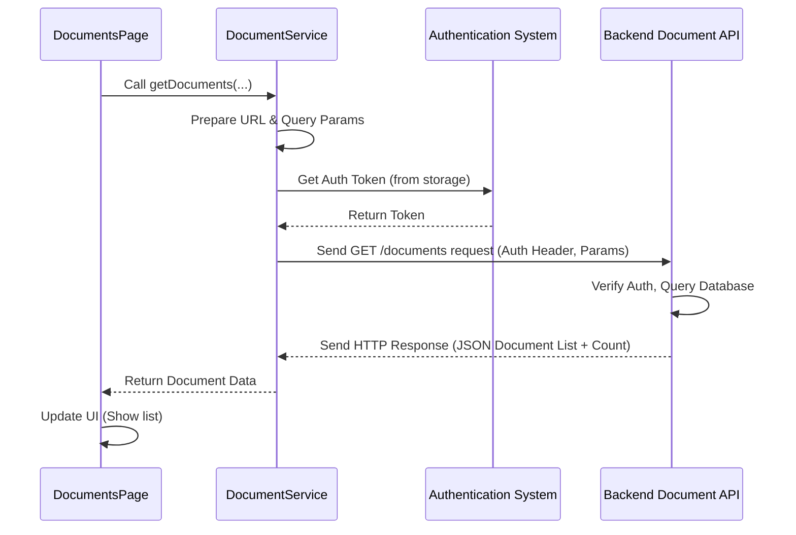
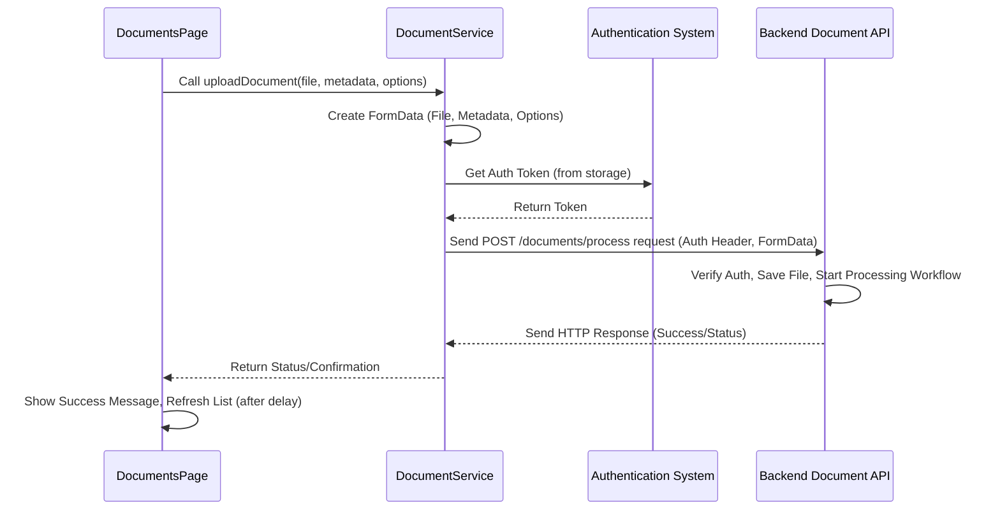
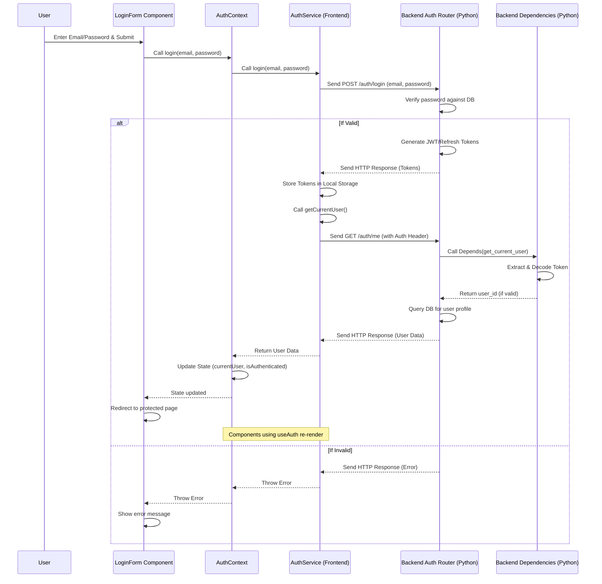
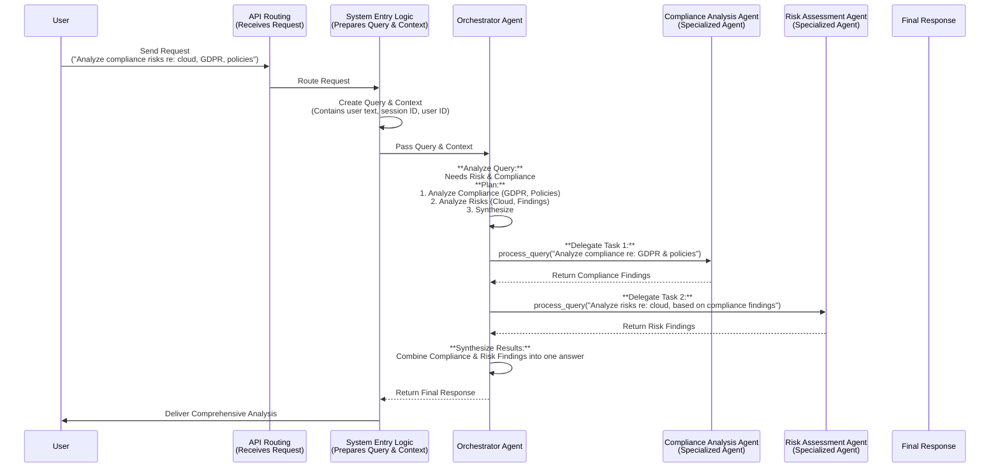
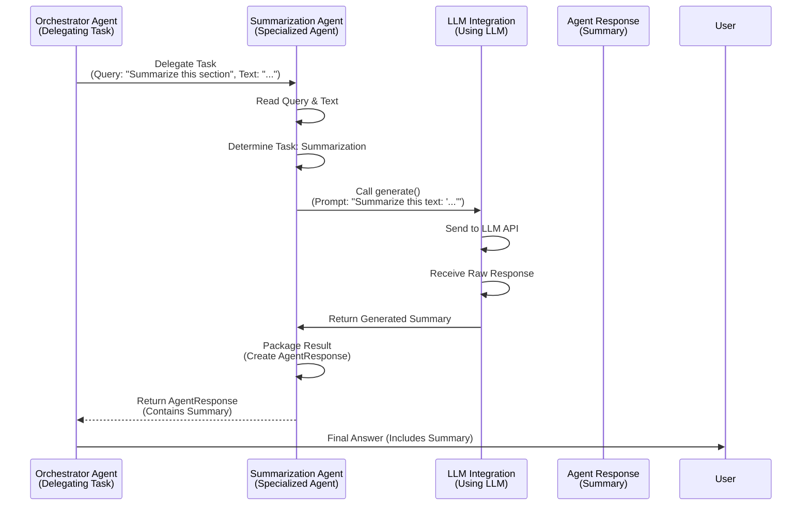
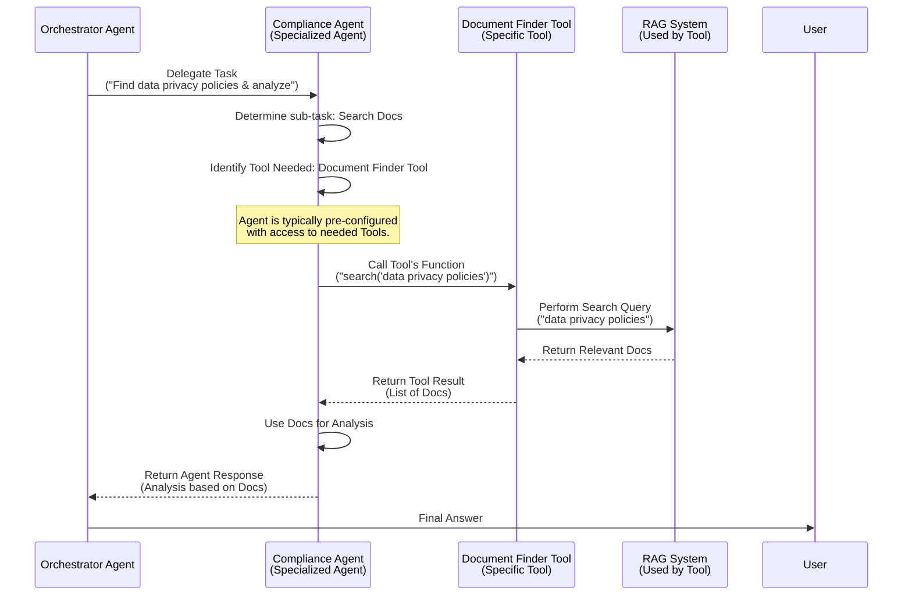
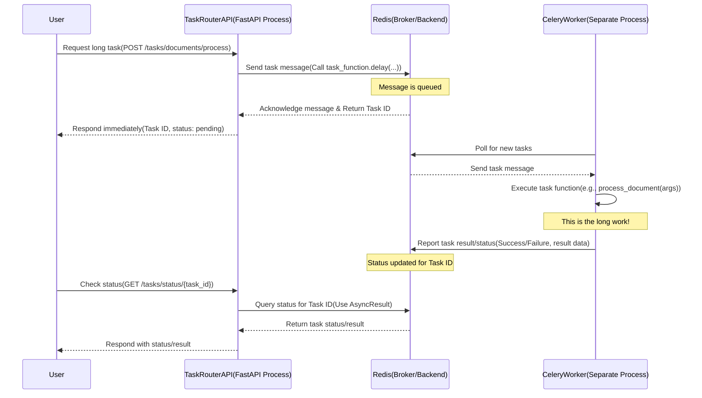

# Tutorial: regulaite

RegulAIte is a multi-agent AI system designed for **Governance, Risk, and Compliance (GRC) analysis**
grounded in *your specific documents*. An **Orchestrator Agent** manages complex requests by delegating
to specialized **AI Agents**. These agents leverage **Tools** and a **RAG System** to find relevant
**Document Chunks** from uploaded data. Incoming user requests are managed by **API Routing** and
require **Authentication**. Time-consuming processes like document handling and agent execution run
as **Asynchronous Tasks**. The system is accessed via frontend services like **Chat** and **Document Management**.


## Visual Overview



## Chapters

1. [Chat Service (Frontend)
](#chapter-1-chat-service-frontend)
2. [Document Service (Frontend)
](#chapter-2-document-service-frontend)
3. [Authentication System (Frontend/Backend)
](#chapter-3-authentication-system-frontend-backend)
4. [API Routing (Backend)
](#chapter-4-api-routing-backend)
5. [Orchestrator Agent (Backend)
](#chapter-5-orchestrator-agent-backend)
6. [AI Agent (Backend)
](#chapter-6-ai-agent-backend)
7. [Tool / Tool Registry (Backend)
](#chapter-7-tool--tool-registry-backend)
8. [RAG System (Backend)
](#chapter-8-rag-system-backend)
9. [Document Chunk (Backend)
](#chapter-9-document-chunk-backend)
10. [Asynchronous Task (Backend/Queuing)
](#chapter-10-asynchronous-task-backend-queuing)

---

# Chapter 1: Chat Service (Frontend)

Welcome to the `regulaite` tutorial! This is the first chapter, and we're diving straight into one of the most exciting parts of the application: talking to the AI!

Before a user can upload documents or manage their organization profile, they often start by asking a question. The core feature that makes this interaction possible is the **Chat Service**.

## Why Do We Need a Chat Service?

Imagine `regulaite` as your expert assistant who knows everything in your documents and understands your company. You want to have a conversation with this assistant. Just like talking to a person, you need a clear way to:

1.  **Tell the assistant your question.**
2.  **Hear (or read) the assistant's answer.**
3.  **Keep the conversation going**, so follow-up questions make sense in context.
4.  **Start new conversations** if you want to talk about something completely different.

Handling all these steps directly inside the visual part of the chat window (the "Chat Interface") would make that code very messy. It would have to worry about:

*   Figuring out the right web address (URL) to send your message to.
*   Making the technical request over the internet.
*   Dealing with receiving the answer, especially if it arrives in pieces (like watching someone type).
*   Keeping track of *which* conversation you're in.

This is where the **Chat Service** comes in. Think of it as the *dedicated messenger* or *communications manager* for the frontend. Its job is to handle all the technical details of talking to the backend specifically for chat conversations. It knows how to package your message, send it, and process the AI's reply, so the visual chat interface code can stay simple and focus only on showing things on the screen.

The main thing we'll learn in this chapter is how the Chat Service helps the frontend **send your questions to the AI and receive its responses to display in the chat window.**

## Key Concepts

Let's break down the important ideas related to the Chat Service:

| Concept              | Description                                                                                                   | Analogy                                                    |
| :------------------- | :------------------------------------------------------------------------------------------------------------ | :--------------------------------------------------------- |
| **Chat Service**     | A part of the frontend code (`chatService.js`) that handles all communication with the backend for chat.      | The messenger delivering your notes to the expert.         |
| **Backend Chat API** | The server-side system that receives chat messages, uses the AI to generate responses, and sends replies back. | The expert's office where they read your note and write back. |
| **Chat Session**     | A single, ongoing conversation. Each session has its own history.                                             | One specific email thread or text message conversation.    |
| **Message**          | A single piece of text in a conversation, either from the user or the AI.                                     | One individual email or text message within the thread.    |
| **Message History**  | The list of all messages sent and received within a specific Chat Session.                                  | The full log of messages in that thread.                   |
| **Streaming**        | A way for the backend to send the AI's response back to the frontend piece by piece as it's generated, not all at once. | Getting the expert's answer dictated to you word by word.  |

The Chat Service is essentially the bridge that connects the visible chat interface (built with React components) to the powerful AI logic running on the backend.

## How to Use the Chat Service

The part of the application that uses the Chat Service the most is the **Chat Page**. This is the screen where you see your conversations. It uses functions provided by the `chatService.js` file to do things like load your past chats, start a new one, and most importantly, send your messages and receive the AI's reply.

Let's look at a simplified example showing how the `ChatPage.js` might use the Chat Service to send your message:

```javascript
// front-end/src/pages/ChatPage.js (Simplified snippet)
import React, { useState } from 'react';
// ... other imports ...
import chatService from '../services/chatService'; // <-- Import the Chat Service

const ChatPage = () => {
  // State to hold the list of messages currently shown in the chat window
  const [messages, setMessages] = useState([]);
  // State to know if the AI is currently generating a response (to disable input)
  const [isLoading, setIsLoading] = useState(false);
  // State to keep track of the unique ID for the current conversation session
  const [activeSessionId, setActiveSessionId] = useState(null);

  // This function is called when the user types a message and clicks send
  const handleSendMessage = async (content) => {
    // Don't send empty messages or if already busy
    if (!content.trim() || isLoading) {
      return;
    }

    setIsLoading(true); // Indicate that we are now processing a message

    // Create a message object for the user's message
    const userMessage = { role: "user", content: content };

    // Add the user's message to the list immediately so it appears instantly
    setMessages(prevMessages => [...prevMessages, userMessage]);

    // Now, call the Chat Service to send the message to the backend
    try {
      // chatService.sendMessageStreaming handles talking to the backend and
      // will call our onChunk function as pieces of the response arrive.
      await chatService.sendMessageStreaming(
        activeSessionId, // Tell the backend which conversation this is for
        content,         // The actual text the user typed
        (chunkData) => { // This is a special function (a "callback")
          // This function is called by chatService *multiple times*
          // as it receives parts of the AI's answer.
          console.log("Received chunk:", chunkData.type, chunkData.content);

          // We need to update the last message in our messages list with the new data
          setMessages(currentMessages => {
             const updatedMessages = [...currentMessages];
             let lastMessage = updatedMessages[updatedMessages.length - 1];

             // Check if the last message is the one we're streaming into
             // (In a real app, this logic is more robust)
             if (lastMessage?.role === "assistant" && lastMessage.isGenerating) {
                if (chunkData.type === 'token' && chunkData.content) {
                    // Append the text chunk to the message content
                    lastMessage.content += chunkData.content;
                }
                // ... handle other chunk types like 'processing', 'end', etc. ...
             } else if (chunkData.type === 'start') {
                // If the last message wasn't the AI one, add a new one to stream into
                 updatedMessages.push({
                     role: "assistant",
                     content: chunkData.content || "",
                     isGenerating: true, // Mark as currently being generated
                     processingState: "Starting...",
                     metadata: { /* ... initial metadata ... */ }
                 });
             }
             // Returning a new array reference triggers React to re-render the list
             return updatedMessages;
           });
        },
        { /* optional settings for the AI, like model */ },
        messages // Pass the current list of messages as conversation history
      );

      console.log('Streaming response completed.');

    } catch (error) {
      // If something went wrong (e.g., network error, backend error)
      console.error('Error sending message or receiving stream:', error);
      // Update the UI to show an error message in the chat
      setMessages(currentMessages => {
         const updatedMessages = [...currentMessages];
         // Find or add an error message to the UI
         updatedMessages.push({ role: "assistant", content: `Error: ${error.message || 'Could not get response.'}` });
         return updatedMessages;
       });

    } finally {
      // Always turn off loading indicator after the process finishes (success or error)
      setIsLoading(false);
       // Mark the last message as no longer generating
       setMessages(currentMessages => {
         const updatedMessages = [...currentMessages];
         const lastMessage = updatedMessages[updatedMessages.length - 1];
          if (lastMessage) {
            lastMessage.isGenerating = false;
          }
         return updatedMessages;
       });
    }
  };

  // ... JSX for the chat page (message list, input box, etc.) ...
  // The MessageInput component would call handleSendMessage when user hits Enter/Send
   return (
        <div>
            {/* This is where the messages state would be displayed */}
            {/* <MessageList messages={messages} /> */}

            {/* This is the input box where the user types */}
            <MessageInput onSendMessage={handleSendMessage} disabled={isLoading} />
        </div>
   );
};

export default ChatPage;
```

**Explanation:**

1.  `import chatService from '../services/chatService';`: This line makes the functions from `chatService.js` available in our `ChatPage` component.
2.  `handleSendMessage`: This is the function that gets called when the user types something and clicks send. It's an `async` function because sending messages over the internet takes time, and we need to `await` the response.
3.  `setMessages(prevMessages => [...prevMessages, userMessage]);`: Before even talking to the backend, we update the `messages` state to show the user their own message immediately. This makes the app feel fast and responsive.
4.  `await chatService.sendMessageStreaming(...)`: This is the core interaction. We call the `sendMessageStreaming` function from the Chat Service.
    *   `activeSessionId`: We pass the ID of the current conversation so the backend knows where this message belongs.
    *   `content`: The actual text the user typed.
    *   `(chunkData) => { ... }`: This is the "callback function". The `chatService` will call *this function* every time it receives a piece of the AI's response. The `chunkData` object contains the piece of information (like a few words of text, or a status update).
    *   `messages`: We pass the entire current `messages` array to the backend so the AI has the full conversation history for context.
5.  Inside the callback (`(chunkData) => { ... }`): This function is responsible for updating the UI *live* as the AI responds. The simplified example shows how it appends the text received (`chunkData.content`) to the last message in the `messages` state. Because `messages` is state, updating it causes the component to re-render, showing the new text appearing in the chat bubble.
6.  `setIsLoading(true)` and `setIsLoading(false)`: These lines turn on/off a loading indicator or disable the input field while the AI is thinking and responding.
7.  `try...catch...finally`: This standard JavaScript structure is used for error handling. If `chatService.sendMessageStreaming` fails, the `catch` block runs, allowing us to show an error to the user. The `finally` block always runs, whether it succeeded or failed, ensuring `isLoading` is turned off.

This example shows how the `ChatPage` component relies entirely on the `chatService` to perform the complex task of sending a message and handling the streaming response, keeping the component's logic focused on managing the visual state of the conversation.

The `ChatPage` also uses other `chatService` functions for managing sessions:

*   `chatService.getChatSessions()`: Called when the page loads to get a list of past conversations to show in a sidebar.
*   `chatService.getSessionMessages(sessionId)`: Called when a user clicks on a past conversation in the sidebar to load and display its message history.
*   `chatService.createSession()`: Called when a user clicks a "New Chat" button to start a fresh conversation thread.
*   `chatService.deleteSession(sessionId)`: Called when a user wants to remove a conversation.

These functions work similarly: the `ChatPage` calls them, they handle the backend communication, and `ChatPage` uses the returned data to update its state and the UI.

## Under the Hood: How it Works

So, what does the `chatService.js` file actually do when `sendMessageStreaming` is called? It acts as the middleman, translating the request from `ChatPage` into something the backend Chat API understands and managing the connection to receive the streaming response.

Here's a simplified step-by-step flow for sending a streaming message:

1.  **`ChatPage` Calls Service:** The `ChatPage` component calls `chatService.sendMessageStreaming(...)`, providing the message content, history, session ID, and the `onChunk` callback function.
2.  **Service Prepares Data:** Inside `chatService.js`, the `sendMessageStreaming` function organizes the data needed by the backend (user message, history, session ID, AI configuration options) into a structured format, usually a JSON object.
3.  **Service Gets Authentication:** It ensures the request includes information to prove who the user is (an authentication token, often retrieved from storage like `localStorage` - we'll learn more about this in a later chapter!). This is crucial for security.
4.  **Service Initiates Connection:** The service doesn't make the streaming connection itself. It **delegates** this complex task to another specialized part of the frontend: the **Streaming Service**. It calls a function on the Streaming Service, passing the backend API URL, the prepared data, and the `onChunk` callback (and other callbacks for events like start, end, error).
5.  **Streaming Service Connects to Backend:** The Streaming Service opens a special connection (often using technologies like Server-Sent Events or WebSockets over HTTP) to the specified backend Chat API endpoint. It sends the initial message data and the authentication token.
6.  **Backend Processes:** The backend receives the request, verifies authentication, processes the message using the AI (potentially incorporating document context or using agents - topics for later chapters!), and starts generating the response.
7.  **Backend Streams Chunks:** As the backend generates pieces of the response, it sends these small data "chunks" back over the open streaming connection, one by one.
8.  **Streaming Service Receives and Parses:** The Streaming Service continuously listens on the connection. When a chunk arrives, it receives the raw data, decodes it, and figures out what type of information it is (e.g., text, processing status, end signal).
9.  **Streaming Service Calls Callbacks:** Based on the type of chunk, the Streaming Service calls the appropriate callback function that was originally provided by `chatService`. If it's a text token, it calls the `onToken` callback; if it's a processing update, it calls `onProcessing`; if it's the end, it calls `onComplete`.
10. **`chatService` Calls `onChunk`:** The callbacks within `chatService.js` (like the one hooked up to `onToken`) then call the *original* `onChunk` callback that `ChatPage` provided, passing the processed chunk data.
11. **`ChatPage` Updates UI:** The `onChunk` function inside `ChatPage` receives the data and updates the component's state (`messages`), causing the chat interface to re-render and show the new piece of information (text appearing, status updating, etc.).
12. **Process Repeats:** Steps 7-11 repeat until the backend finishes sending all chunks.
13. **Stream Ends:** The Streaming Service detects the end of the stream and signals completion. The `await chatService.sendMessageStreaming` promise resolves, allowing the `finally` block in `ChatPage` to run and turn off the loading state.

Here's a simplified sequence diagram showing the flow when a streaming message is sent:



For non-streaming requests, like fetching sessions or messages, the flow is simpler:

1.  `ChatPage` Calls Service (`getChatSessions` or `getSessionMessages`).
2.  `ChatService` Prepares Request (URL, parameters, authentication header) using `axios`.
3.  `ChatService` Makes standard HTTP Request (GET) to Backend API.
4.  Backend Processes Request and Sends standard HTTP Response (JSON data).
5.  `ChatService` Handles Response, processes data if needed.
6.  `ChatService` Returns Data to `ChatPage`.
7.  `ChatPage` Updates UI state with the received data.

## Code Details

Let's look at brief snippets from `front-end/src/services/chatService.js` to see how it implements these interactions.

--- File: front-end/src/services/chatService.js (Simplified) ---

```javascript
import axios from 'axios'; // Used for standard HTTP requests (sessions, etc.)
import authService from './authService'; // Used to get auth info (from another concept)
import streamingService from './streamingService'; // Used for streaming requests

// Determine the backend API URL
const API_URL = process.env.REACT_APP_API_URL || 'http://localhost:8090';

// Create an axios instance that automatically adds the auth token
const api = axios.create({
  baseURL: API_URL,
  headers: { 'Content-Type': 'application/json' },
  timeout: 600000, // Set a generous timeout for chat requests
});

// Add an interceptor to automatically include the Authorization header
// This uses logic related to the authentication system (a later concept!)
api.interceptors.request.use(
  (config) => {
    const token = localStorage.getItem('token'); // Get token from storage
    if (token) {
      config.headers['Authorization'] = `Bearer ${token}`; // Add token to headers
      // Add user ID from auth token payload for backend logging/tracing
      const userData = authService.getCurrentUserData();
      if (userData?.user_id) {
         config.headers['X-User-ID'] = userData.user_id;
      }
    }
    return config;
  },
  (error) => Promise.reject(error)
);


/**
 * Service to handle interactions with the chat API
 */
const chatService = {

  // Function to get chat sessions (standard GET request)
  getChatSessions: async (userId = null, limit = 20, offset = 0) => {
    try {
      console.log(`Service: Fetching sessions for user ${userId || 'current'}`);
      // Use the configured axios instance (auth header added automatically)
      const response = await api.get(`/chat/sessions`, {
         params: { user_id: userId, limit, offset }
      });
      console.log('Service: Sessions fetched', response.data);
      // Return just the array of sessions
      return response.data.sessions || [];
    } catch (error) {
      console.error('Service: Error fetching sessions:', error);
      throw error; // Re-throw for component to handle
    }
  },

   // Function to get messages for a session (standard GET request)
  getSessionMessages: async (sessionId, limit = 50, offset = 0) => {
    try {
      console.log(`Service: Fetching messages for session ${sessionId}`);
      // Use the configured axios instance
      const response = await api.get(`/chat/sessions/${sessionId}/messages`, {
        params: { limit, offset },
      });
       console.log('Service: Messages fetched', response.data);
      return response.data.messages || [];
    } catch (error) {
      console.error('Service: Error fetching messages:', error);
      throw error;
    }
  },

  // Function to send a message using streaming
  sendMessageStreaming: async (sessionId, message, onChunk, options = {}, allMessages = null, requestId = null) => {
    console.log(`Service: Initiating streaming for session ${sessionId}, request ${requestId}`);

    // Prepare the data payload for the backend API call
    const requestData = {
      session_id: sessionId,
      messages: allMessages || [{ role: 'user', content: message }], // Send full history
      // Include optional AI settings from options
      include_context: options.includeContext ?? true, // Default true
      use_agent: true, // Agent is typically enabled in this app's config
      model: options.model || 'gpt-4', // Default model
      temperature: options.temperature ?? 0.7, // Default temperature
      max_tokens: options.max_tokens, // Pass max tokens if provided
      // ... other settings ...
    };

     // Prepare the callback object for the StreamingService
    const callbacks = {
       // Map stream events to calls to the component's onChunk
       onStart: (data) => { console.log('Stream start', data); onChunk({ type: 'start', ...data }); },
       onToken: (data) => { console.log('Stream token', data.content); onChunk({ type: 'token', ...data }); },
       onProcessing: (data) => { console.log('Stream processing', data.state); onChunk({ type: 'processing', ...data }); },
       onComplete: (data) => { console.log('Stream complete', data); onChunk({ type: 'end', ...data }); },
       onError: (error) => { console.error('Stream error', error); onChunk({ type: 'error', message: error.message }); },
       onProgress: (data) => { console.log('Stream progress', data); onChunk({ type: 'processing', state: data.message, step: 'info' }); } // Map progress to processing
    };

    // Prepare options for the StreamingService
    const streamOptions = {
       timeout: options.timeout || 300000, // Use timeout from options or default
       retryOnFailure: true, // Enable retry logic in StreamingService
       headers: { // Add any specific headers needed for this stream request
         'X-Request-ID': requestId || `req_${Date.now()}`, // Include request ID
         'X-Session-ID': sessionId // Include session ID
       }
    };

    // **DELEGATE** the actual streaming connection logic to the StreamingService
    try {
        const result = await streamingService.createStream(
            `${API_URL}/chat`, // The backend endpoint URL
            requestData, // The data to send in the initial POST request
            callbacks, // The set of functions StreamingService will call
            streamOptions // Configuration options for the stream
        );
        console.log('Service: StreamingService reported stream complete:', result);
        // The createStream promise resolves when the stream ends
        return result; // Return any final result from the stream
    } catch (error) {
        console.error('Service: StreamingService encountered an error:', error);
        // Re-throw the error so ChatPage can handle it
        throw error;
    }
  },

  // Function to create a new session (standard POST request)
  createSession: async (userId = null) => {
    try {
      console.log(`Service: Creating new session for user ${userId || 'current'}`);
      // Use the configured axios instance
      const response = await api.post(`/chat/sessions`, {
         user_id: userId || authService.getCurrentUserData()?.user_id // Pass user ID
      });
       console.log('Service: Session created', response.data);
      // Expecting { session_id: "..." } from backend
      return response.data;
    } catch (error) {
      console.error('Service: Error creating session:', error);
      throw error;
    }
  },
  
  // Function to delete a session (standard DELETE request)
  deleteSession: async (sessionId) => {
    try {
      console.log(`Service: Deleting session ${sessionId}`);
      // Use the configured axios instance
      const response = await api.delete(`${API_URL}/chat/sessions/${sessionId}`);
      console.log(`Service: Session ${sessionId} deleted`, response.data);
       // Expecting confirmation, e.g., { messages_deleted: N }
      return response.data;
    } catch (error) {
       console.error(`Service: Error deleting session ${sessionId}:`, error);
      throw error;
    }
  },

   // Utility functions to stop streams, exposed from StreamingService
   stopAllStreams: () => {
     console.log('Service: Calling stopAllStreams on StreamingService');
     streamingService.abortAllStreams();
   },
   stopStream: (streamId) => {
     console.log(`Service: Calling stopStream(${streamId}) on StreamingService`);
     streamingService.abortStream(streamId);
   },
    getStreamingStats: () => {
     // Get basic stats from the streaming service
     return streamingService.getActiveStreamCount();
   },


  // ... other chat-related functions ...
};

export default chatService;
```

**Explanation:**

*   `import axios from 'axios';`: This brings in the library used to make standard HTTP requests (GET, POST, DELETE, etc.).
*   `import streamingService from './streamingService';`: This imports the specific service responsible for the low-level streaming connection.
*   `api = axios.create(...)`: An `axios` instance is configured. This instance includes a crucial **interceptor** (`api.interceptors.request.use`). This interceptor is a piece of code that runs *before* every request made using this `api` instance. Its job is to automatically fetch the authentication token from `localStorage` (where it was saved during login) and add it to the `Authorization` header of the request. This way, the backend can verify that the request is coming from a logged-in user.
*   `getChatSessions`, `getSessionMessages`, `createSession`, `deleteSession`: These functions are examples of standard API calls. They use `api.get`, `api.post`, or `api.delete` to send requests to the backend endpoints (`/chat/sessions`, `/chat/sessions/{sessionId}/messages`). Because they use the `api` instance, the authentication header is added automatically by the interceptor. They return the data received from the backend or throw an error if something goes wrong.
*   `sendMessageStreaming`: This function is different. It prepares the `requestData` but then calls `streamingService.createStream(...)`. It passes the backend URL, the data, and a `callbacks` object. The `callbacks` object maps specific streaming events (like `onStart`, `onToken`, `onProcessing`, `onComplete`, `onError`) to simple functions that call the `onChunk` callback provided by the `ChatPage`. This delegates the complex streaming logic to the `streamingService`.
*   `stopAllStreams`, `stopStream`, `getStreamingStats`: These are simple wrapper functions that just call the corresponding methods on the injected `streamingService`, providing a clean interface for stopping streams from other parts of the app (like a "Stop" button).

This `chatService.js` file centralizes all the logic for talking to the backend's chat features. It uses standard tools (`axios`) for simple requests and delegates the complexity of streaming to another service (`streamingService`), while the `axios` interceptor handles authentication automatically for all requests made through the `api` instance.

## Conclusion

In this chapter, we've introduced the **Chat Service** in `regulaite`. We learned that it's the dedicated part of the frontend that handles all communication with the backend AI for conversations, acting as a messenger. We saw how the `ChatPage` component uses simple function calls provided by `chatService.js` (like `sendMessageStreaming`, `getChatSessions`, `createSession`) to manage the conversation flow and update the UI. Most importantly, we understood how `sendMessageStreaming` works together with a callback function (`onChunk`) to receive and display the AI's response piece by piece as it's generated (streaming). Finally, we took a peek at the `chatService.js` code, seeing how it uses libraries like `axios` for standard API calls and delegates the streaming complexity, while an automatic interceptor handles authentication for every request.

The Chat Service is the core piece that enables the interactive AI conversation experience in `regulaite`. In the following chapters, we'll explore other parts of the system that support this chat functionality and the application as a whole.


# Chapter 2: Document Service (Frontend)

Welcome back! In [Chapter 1: Chat Service (Frontend)](#chapter-1-chat-service-frontend), we learned how `regulaite` handles talking to the AI, managing conversations and displaying responses piece by piece. That's the exciting interaction part!

Now, let's look at the core knowledge that powers those conversations: your documents. Before the AI can answer questions about your regulations, policies, or reports, you need a way to get those documents into the system.

This is where the **Document Service** comes in.

## Why Do We Need a Document Service?

Imagine `regulaite` as your company's specialized knowledge base. The most valuable asset in this base is your collection of documents. To make this knowledge base useful and searchable by the AI, we need a dedicated system to manage these documents on the frontend (the part you interact with).

Handling tasks like picking a file from your computer, sending it over the internet to the server, seeing a list of files already in the system, or deleting old files, all directly from the visual components like a "Documents Page", would make that code very complicated. It would have to worry about:

*   Finding the correct web address (URL) on the backend for uploads, lists, or deletions.
*   Making the technical request (like sending a file, which is different from sending simple text).
*   Handling potential network errors.
*   Keeping track of file details (name, size, upload date, processing status).

This is where the **Document Service** steps in. Think of it as the *dedicated manager* or *specialized handler* for all things related to documents on the frontend. Its job is to encapsulate all the technical details of talking to the backend specifically for document operations. It knows how to package a file for upload, format requests for fetching lists, and handle the communication details, so the visual parts of the application (like the "Documents Page") can stay simple and focus only on displaying information and user controls.

The main thing we'll learn in this chapter is how a frontend component, like the `DocumentsPage`, uses the Document Service to **upload a new document** and **view a list of documents** that are already in the system.

## Key Concepts

Let's break down the important ideas related to the Document Service:

| Concept              | Description                                                                                                                            | Analogy                                                    |
| :------------------- | :------------------------------------------------------------------------------------------------------------------------------------- | :--------------------------------------------------------- |
| **Document Service** | A part of the frontend code (`documentService.js`) that handles all communication with the backend specifically for document tasks. | The specialized clerk at the filing office who handles document intake and requests. |
| **Backend Document API**| The server-side system that receives document files, processes them, stores their metadata, and manages the document collection.   | The backroom of the filing office where documents are stored, sorted, and processed. |
| **Endpoint**         | A specific web address on the backend that performs a particular action (e.g., `/documents` for listing, `/documents/process` for upload).| Different windows or desks at the office, each for a specific task. |
| **API Call**         | Sending a request from the frontend service to a backend endpoint to perform an action (like GET, POST, DELETE).                     | Handing a request form to the clerk.                     |
| **Response**         | The information or confirmation sent back by the backend API after processing a request.                                                 | The clerk handing back the requested file, a receipt, or a status update. |
| **Document Metadata**| Information about a document, like its name, size, type (PDF, DOCX, etc.), upload date, and processing status.                       | The label or index card for a file in the cabinet.       |

The Document Service is the frontend's dedicated layer for interacting with the document features of the backend, providing a clean interface for components.

## How to Use the Document Service

The part of the application that uses the Document Service the most is the **Documents Page**. This is the screen where you can see the list of your uploaded documents and access controls like uploading or deleting. It uses functions provided by the `documentService.js` file to perform these actions.

Let's look at simplified examples showing how the `DocumentsPage.jsx` might use the Document Service:

### 1. Viewing the List of Documents

When you visit the Documents Page, it needs to show you what's already in the system. It does this by asking the Document Service for the list.

```jsx
// front-end/src/pages/DocumentsPage.jsx (Simplified snippet for fetching)
import React, { useState, useEffect } from 'react';
import { Box, Text, Spinner } from '@chakra-ui/react'; // UI components
import { getDocuments } from '../services/documentService'; // <-- Import the function

const DocumentsPage = () => {
  // State to hold the list of documents fetched from the backend
  const [documents, setDocuments] = useState([]);
  // State to indicate if documents are currently being loaded
  const [loading, setLoading] = useState(true);
  // State for pagination or filters (simplified)
  const [pagination, setPagination] = useState({ limit: 10, offset: 0, totalCount: 0 });
  const [filters, setFilters] = useState({});


  // useEffect hook to fetch documents when the component first loads
  // and whenever pagination or filters change.
  useEffect(() => {
    const fetchDocuments = async () => {
      try {
        setLoading(true); // Start loading indicator

        // Call the getDocuments function from the Document Service
        const result = await getDocuments(
          pagination.limit,
          pagination.offset,
          'created', // Sort by date created
          'desc',    // Sort in descending order (newest first)
          filters    // Pass any filters
        );

        // The service returns an object containing the list of documents
        // and the total count. Update the component's state.
        setDocuments(result.documents || []); // Update the documents list
        setPagination(prev => ({ // Update total count for pagination
            ...prev,
            totalCount: result.total_count || 0
        }));

      } catch (error) {
        // If something went wrong (e.g., network error, backend error)
        console.error('Error fetching documents:', error);
        // Update the UI to show an error message
        // (In a real app, you'd use a toast notification)
        setDocuments([]); // Clear list on error
        setPagination(prev => ({ ...prev, totalCount: 0 }));
      } finally {
        // Always turn off loading indicator after the process finishes
        setLoading(false);
      }
    };

    fetchDocuments(); // Call the async function right away
  }, [pagination.offset, filters]); // Re-run this effect if offset or filters change


  // ... JSX for the rest of the page (search input, table, pagination controls) ...

  // Show a loading spinner while fetching
  if (loading) {
    return <Spinner size="xl" />;
  }

  // Simplified rendering of the document list
  return (
    <Box>
      <Text fontSize="xl" mb={4}>Your Documents:</Text>
      {documents.length > 0 ? (
        documents.map(doc => (
          // Display each document's name/title as a simple item
          <Box key={doc.doc_id} p={2} borderBottom="1px solid #eee">
            {doc.name || doc.title} ({doc.file_type?.toUpperCase()})
          </Box>
        ))
      ) : (
        // Message if no documents are found
        <Text>No documents found. Upload one to get started!</Text>
      )}
      {/* Pagination buttons would go here */}
    </Box>
  );
};

export default DocumentsPage;
```

**Explanation:**

1.  `import { getDocuments } from '../services/documentService';`: This line makes the `getDocuments` function from `documentService.js` available in our `DocumentsPage` component.
2.  `useEffect`: This React hook is used to perform actions when the component "mounts" (appears on screen) or when certain values change. Here, it calls `fetchDocuments` when the page loads and whenever the `pagination.offset` or `filters` state changes (allowing for dynamic loading and filtering).
3.  `fetchDocuments`: This `async` function does the work. It's `async` because talking over the internet takes time, and we `await` the result.
4.  `await getDocuments(...)`: This is the core interaction. We call the `getDocuments` function from the Document Service, passing the parameters needed by the backend API (like how many documents to get (`limit`), where to start (`offset`), how to sort, and any filters).
5.  `setDocuments(result.documents || [])` and `setPagination(...)`: Once the service returns the `result` (which contains the `documents` array and `total_count`), we update the component's state. Updating state causes React to re-render the component and show the fetched data.
6.  `loading` state: This state variable is used to show/hide a loading spinner while the data is being fetched.

This example shows how the `DocumentsPage` relies entirely on `getDocuments` from the Document Service to get the document data, keeping its own code focused on displaying the loading state, the list of documents, and handling user interactions like pagination or applying filters (which would trigger a re-fetch).

### 2. Uploading a New Document

When a user wants to add a file to the system, they typically interact with a file input and an upload button on the Documents Page. The component collects the selected file and any extra information (like title or tags) and then uses the Document Service to send it to the backend.

```jsx
// front-end/src/pages/DocumentsPage.jsx (Simplified snippet for uploading)
import React, { useState } from 'react';
import { Box, Button, Input, FormControl, FormLabel, useToast } from '@chakra-ui/react'; // UI components
import { uploadDocument } from '../services/documentService'; // <-- Import the function

const DocumentsPage = () => {
  const toast = useToast(); // For showing messages to the user
  // State to hold the selected file object
  const [file, setFile] = useState(null);
  // State to hold additional metadata the user might enter
  const [metadata, setMetadata] = useState({ title: '', tags: '' });
  // State to indicate if an upload is in progress
  const [uploadLoading, setUploadLoading] = useState(false);

  // Function to handle when the user selects a file
  const handleFileChange = (event) => {
    // event.target.files is a list of files selected
    if (event.target.files && event.target.files[0]) {
      const selectedFile = event.target.files[0];
      setFile(selectedFile); // Store the selected file
      // Optionally pre-fill title from filename
      setMetadata(prev => ({ ...prev, title: selectedFile.name.split('.')[0] }));
    }
  };

  // Function to handle the upload button click
  const handleUpload = async () => {
    // Don't try to upload if no file is selected or already uploading
    if (!file || uploadLoading) {
      if (!file) toast({ title: 'Please select a file', status: 'warning', duration: 3000 });
      return;
    }

    setUploadLoading(true); // Start upload loading indicator

    try {
      // Prepare metadata (e.g., split tags string into an array)
      const metadataToSend = {
        ...metadata,
        tags: metadata.tags ? metadata.tags.split(',').map(tag => tag.trim()).filter(Boolean) : []
      };
      // Prepare optional processing options (simplified)
      const processingOptions = {
          parserType: 'unstructured', // Default parser
          useQueue: true // Process in background queue
      };

      // CALL THE uploadDocument function from the Document Service
      const response = await uploadDocument(
        file, // The selected file object
        metadataToSend, // The metadata entered by the user
        processingOptions // Optional processing settings
      );

      // Handle successful upload response
      console.log('Upload successful:', response);
      toast({
        title: 'Upload successful',
        description: response.message || 'Document is being processed.',
        status: 'success',
        duration: 5000,
        isClosable: true,
      });

      // Clear the form and close the upload modal (if using one)
      setFile(null);
      setMetadata({ title: '', tags: '' });
      // onClose(); // Close modal if this code is inside a modal component

      // After a successful upload, refresh the document list to show the new document
      // Often, backend processing takes a moment, so we might wait a little or poll.
       setTimeout(() => {
           // Trigger a re-fetch of documents. One way is to call fetchDocuments() directly
           // Another is to update a state variable that fetchDocuments depends on (e.g. pagination or filter)
           // Here, we'll assume fetchDocuments() is available or trigger a state update
           console.log("Triggering document list refresh...");
           // Assume fetchDocuments is available or trigger state change...
           // e.g., call fetchDocuments() here OR update a state that triggers the useEffect above
       }, 2000); // Wait 2 seconds before trying to refresh


    } catch (error) {
      // Handle upload errors
      console.error('Upload error:', error);
      toast({
        title: 'Upload failed',
        description: error.message || 'An error occurred during upload.',
        status: 'error',
        duration: 5000,
        isClosable: true,
      });
    } finally {
      // Always turn off upload loading indicator
      setUploadLoading(false);
    }
  };

  // ... JSX for the rest of the page ...

  // Simplified upload form JSX (could be inside a modal)
  return (
    <Box p={4} borderWidth="1px" borderRadius="lg" maxW="md">
       <FormControl mb={4}>
         <FormLabel>Select File</FormLabel>
         <Input type="file" onChange={handleFileChange} p={1} />
         {file && <Text fontSize="sm" mt={1}>Selected: {file.name}</Text>}
       </FormControl>
       <FormControl mb={4}>
         <FormLabel>Title</FormLabel>
         <Input value={metadata.title} onChange={(e) => setMetadata({...metadata, title: e.target.value})} placeholder="Document title" />
       </FormControl>
       {/* ... other metadata inputs like author, category, tags ... */}
       <Button
         colorScheme="purple"
         onClick={handleUpload}
         isLoading={uploadLoading} // Use loading state to disable button and show spinner
         loadingText="Uploading"
         mt={4}
       >
         Upload Document
       </Button>
    </Box>
  );
};

export default DocumentsPage;
```

**Explanation:**

1.  `import { uploadDocument } from '../services/documentService';`: This line imports the `uploadDocument` function.
2.  `useState` hooks: Manage the `file` object selected by the user, any `metadata` they enter, and the `uploadLoading` state.
3.  `handleFileChange`: This function is triggered when the user selects a file. It stores the selected `file` in the component's state.
4.  `handleUpload`: This `async` function is called when the "Upload" button is clicked.
5.  `await uploadDocument(file, metadataToSend, processingOptions)`: This is the core interaction. It calls the `uploadDocument` function from the Document Service, passing the selected `file` and the prepared `metadata` and `processingOptions`.
6.  `toast(...)`: After the service call completes (either successfully or with an error), the component uses `react-hot-toast` to display a notification to the user.
7.  `setUploadLoading(true/false)`: The `uploadLoading` state controls the button's disabled state and whether it shows a loading spinner.
8.  Post-Upload Refresh: After a successful upload, the code includes a `setTimeout` to trigger a refresh of the document list. This is often necessary because the backend might process the document in the background using a queue (a concept we'll see later!), and it won't appear in the list immediately.

These examples demonstrate how the `DocumentsPage` component delegates the complex tasks of fetching data and uploading files to the `documentService`, keeping its own code focused on managing the user interface elements and displaying data and feedback.

## Under the Hood: How it Works

So, what does the `documentService.js` file actually do when `getDocuments` or `uploadDocument` is called? It acts as the dedicated messenger, translating the request from `DocumentsPage` into something the backend API understands and handling the technical details of sending and receiving data, including authentication.

### Fetching Documents Flow

Let's trace the flow when `getDocuments` is called:

1.  **`DocumentsPage` Calls Service:** The `DocumentsPage` component calls `documentService.getDocuments(...)`, providing parameters like `limit`, `offset`, `sortBy`, and `filters`.
2.  **Service Prepares Request:** Inside `documentService.js`, the `getDocuments` function constructs the correct backend API URL (e.g., `/documents`). It takes the function arguments (limit, offset, filters) and formats them as **query parameters** for the URL (e.g., `/documents?limit=10&offset=0&file_type=pdf`).
3.  **Service Adds Authentication:** It includes information to prove who the user is (an authentication token). This token is typically retrieved from `localStorage` where it was stored during login by the [Authentication System (Frontend/Backend)](#chapter-3-authentication-system-frontend-backend). The service adds this token to the `Authorization` header of the request.
4.  **Service Makes API Call:** The service uses a standard library like `axios` to make an HTTP `GET` request to the prepared URL, including the authentication header.
5.  **Backend Processes Request:** The backend receives the `GET /documents` request, verifies the authentication token, understands the query parameters (limit, offset, filters), queries its database (likely filtering and sorting based on the request), counts the total matching documents, and prepares a response containing the list of documents for that page and the total count.
6.  **Backend Sends Response:** The backend sends an HTTP response back to the frontend, typically containing the data in a JSON format.
7.  **Service Handles Response:** The `documentService.js` receives the HTTP response. It checks the status code to see if it was successful (e.g., 200 OK) or if there was an error (e.g., 401 Unauthorized, 500 Internal Server Error). It extracts the JSON data from the response body.
8.  **Service Returns Data/Throws Error:** If successful, the `getDocuments` function returns the extracted document data (the list and total count) to the `DocumentsPage`. If there was an error, it throws an error, which the `DocumentsPage` can catch.

Here's a simplified sequence diagram:



### Uploading Document Flow

Let's trace the flow when `uploadDocument` is called:

1.  **`DocumentsPage` Calls Service:** The `DocumentsPage` component calls `documentService.uploadDocument(file, metadata, options)`, providing the file object, metadata, and processing options.
2.  **Service Prepares Request:** Inside `documentService.js`, the `uploadDocument` function prepares the data for sending. For file uploads via HTTP, this typically involves creating a `FormData` object. The file itself is appended to this `FormData`, and any additional text-based data (like metadata and options) is also appended, often converted into JSON strings first.
3.  **Service Adds Authentication:** Similar to fetching, it adds the authentication token from the [Authentication System (Frontend/Backend)](#chapter-3-authentication-system-frontend-backend) to the `Authorization` header.
4.  **Service Makes API Call:** The service uses `axios` to make an HTTP `POST` request to the backend's upload endpoint (e.g., `/documents/process`). It sends the `FormData` object as the request body. `axios` automatically sets the correct `Content-Type` header (`multipart/form-data`) for `FormData`.
5.  **Backend Processes Request:** The backend receives the `POST /documents/process` request, verifies authentication, extracts the file and associated data from the `FormData`. It then initiates the processing workflow: saving the file temporarily, extracting text, potentially running NLP or other analysis, splitting the document into chunks, creating document metadata records, and preparing data for indexing in the vector store (parts of the [RAG System (Backend)](#chapter-8-rag-system-backend)). This processing might happen in the background using a queue ([Asynchronous Task (Backend/Queuing)](#chapter-10-asynchronous-task-backend-queuing)).
6.  **Backend Sends Response:** The backend sends an HTTP response back, typically a success message or an object confirming the file was received and processing has started.
7.  **Service Handles Response:** The `documentService.js` receives the response, checks the status, and extracts data.
8.  **Service Returns Data/Throws Error:** If successful, the `uploadDocument` function returns the confirmation data. If there was an error (e.g., file too large, wrong file type, authentication failure), it throws an error.

Here's a simplified sequence diagram:



## Code Details

Let's look at simplified snippets from `front-end/src/services/documentService.js` to see how it implements these interactions using the `axios` library.

--- File: front-end/src/services/documentService.js (Simplified) ---

```javascript
import axios from 'axios'; // Used for making HTTP requests

// Determine the backend API URL (usually from environment variables)
const API_URL = process.env.REACT_APP_API_URL || 'http://localhost:8090';

// Helper function to get auth header (reusing logic related to Authentication System - Chapter 3)
const getAuthHeader = () => {
  // Get token from where it was stored during login (e.g., localStorage)
  const token = localStorage.getItem('token');
  // Return the Authorization header if token exists, otherwise an empty object
  return token ? { Authorization: `Bearer ${token}` } : {};
};

/**
 * Document Service - Handles all frontend interactions with the backend Document API.
 */
const documentService = {

  // Function to get document list (used by DocumentsPage)
  getDocuments: async (
    limit = 10,
    offset = 0,
    sortBy = 'created',
    sortOrder = 'desc',
    filters = {} // Object like { fileType: 'pdf', search: '...' }
  ) => {
    try {
      // Prepare query parameters from inputs
      const params = {
        limit,
        offset,
        sort_by: sortBy,
        sort_order: sortOrder,
        ...(filters.fileType && { file_type: filters.fileType }), // Add file_type if provided
        ...(filters.category && { category: filters.category }),   // Add category if provided
        ...(filters.language && { language: filters.language }),   // Add language if provided
        ...(filters.search && { search: filters.search }),         // Add search query if provided
      };

      // Make GET request to the /documents endpoint
      const response = await axios.get(`${API_URL}/documents`, {
        headers: getAuthHeader(), // <-- Add authentication header
        params: params, // <-- Add query parameters to the URL
      });

      // Return the data received from the backend (expecting { documents: [...], total_count: N })
      return response.data;
    } catch (error) {
      // Log and re-throw the error for the calling component (DocumentsPage) to handle
      console.error('Service: Error fetching documents:', error.response?.data || error.message);
      throw error.response?.data || error;
    }
  },

  // Function to upload and process a document (used by DocumentsPage)
  uploadDocument: async (
    file, // The selected File object from the input
    metadata = {}, // Document metadata (title, author, etc.)
    options = {} // Processing options (parser type, chunking settings, useQueue, etc.)
  ) => {
    try {
      // Create FormData to send file and other data in a multi-part request
      const formData = new FormData();
      formData.append('file', file); // <-- Append the actual file

      // Append metadata as a JSON string (backend expects this format for complex objects)
      if (metadata) {
        formData.append('metadata', JSON.stringify(metadata));
      }

      // Append processing options as strings or JSON if complex
      formData.append('use_nlp', options.useNlp?.toString() || 'false');
      formData.append('detect_language', options.detectLanguage?.toString() || 'true');
      formData.append('parser_type', options.parserType || 'unstructured');
      formData.append('use_queue', options.useQueue?.toString() || 'false');
      // Append parser settings as JSON string if provided
      if (options.parserSettings) {
         formData.append('parser_settings', JSON.stringify(options.parserSettings));
      }
      // ... append other options ...


      // Make POST request to the /documents/process endpoint
      const response = await axios.post(`${API_URL}/documents/process`, formData, {
        headers: {
          ...getAuthHeader(), // <-- Add authentication header
          // axios automatically sets 'Content-Type': 'multipart/form-data' for FormData
        },
        // You might add an onUploadProgress callback here to show a progress bar in the UI
      });

      // Return the response data (expecting a status/confirmation object)
      return response.data;
    } catch (error) {
       console.error('Service: Upload error:', error.response?.data || error.message);
       throw error.response?.data || error;
    }
  },

  // Function to delete a document (used by DocumentsPage, potentially others)
  deleteDocument: async (docId) => {
    try {
      // Make DELETE request to the specific document endpoint /documents/{docId}
      const response = await axios.delete(`${API_URL}/documents/${docId}`, {
        headers: getAuthHeader(), // <-- Add authentication header
      });
      // Return the response data (expecting a confirmation object)
      return response.data;
    } catch (error) {
       console.error('Service: Error deleting document:', error.response?.data || error.message);
       throw error.response?.data || error;
    }
  },
  
  // Function to get document statistics (used by DocumentsPage)
  getDocumentStats: async () => {
    try {
      // Make GET request to the /documents/stats endpoint
      const response = await axios.get(`${API_URL}/documents/stats`, {
        headers: getAuthHeader(), // <-- Add authentication header
      });
      // Return the statistics data
      return response.data; // Expecting an object like { total_documents: N, ... }
    } catch (error) {
      console.error('Service: Error fetching document stats:', error.response?.data || error.message);
      throw error.response?.data || error;
    }
  },

   // Function to get available parser types (used by DocumentsPage upload modal)
  getParserTypes: async () => {
    try {
      const response = await axios.get(`${API_URL}/documents/parsers`, {
        headers: getAuthHeader(),
      });
      return response.data; // Expecting { parsers: [...] }
    } catch (error) {
      console.error('Service: Error fetching parser types:', error.response?.data || error.message);
       // Provide a default list in case the API fails
       return {
        parsers: [
          { id: 'unstructured', name: 'Unstructured', description: 'Default document parser' },
          { id: 'unstructured_cloud', name: 'Unstructured Cloud', description: 'Cloud-based parser with enhanced capabilities' },
          { id: 'doctly', name: 'Doctly', description: 'Specialized for legal and regulatory documents' },
          { id: 'llamaparse', name: 'LlamaParse', description: 'AI-powered document parser based on LlamaIndex' },
        ]
       };
    }
  },

  // ... other document-related functions like searchDocuments, getDocumentDetails, etc.
};

export default documentService;
```

**Explanation:**

*   `import axios from 'axios';`: This brings in the library used to make standard HTTP requests (GET, POST, DELETE, etc.).
*   `API_URL`: This constant holds the base address of our backend API.
*   `getAuthHeader`: This helper function retrieves the user's token from `localStorage`. This token was saved there by the [Authentication System (Frontend/Backend)](#chapter-3-authentication-system-frontend-backend) during login. It formats the token into the required `Authorization: Bearer ...` header. This function ensures that every request made by the Document Service is authenticated.
*   `getDocuments`: This function takes parameters for pagination and filtering. It constructs a `params` object containing these parameters. When `axios.get` is called with this `params` object, `axios` automatically adds them to the request URL as query string parameters (e.g., `?limit=10&offset=0`). It includes the `Authorization` header obtained from `getAuthHeader()`.
*   `uploadDocument`: This function takes the `file` object, `metadata`, and `options`. It creates a `FormData` object, which is the standard way to send files along with other data in an HTTP request. It appends the file and the metadata/options (often JSON-stringified) to this `FormData`. It makes a `POST` request to `/documents/process` and also includes the `Authorization` header. `axios` automatically handles setting the `Content-Type` to `multipart/form-data` for `FormData`.
*   `deleteDocument`: This function takes the document ID (`docId`) and makes a `DELETE` request to the specific endpoint for that document (`/documents/{docId}`). It also includes the `Authorization` header.
*   `getDocumentStats` and `getParserTypes`: These are other examples of simple `GET` requests to specific endpoints for fetching statistics or configuration data, also including the authentication header.
*   Error Handling (`try...catch...throw`): Each function wraps the API call in a `try...catch` block. If `axios` throws an error (e.g., network issue, non-2xx response from backend), the `catch` block logs the error and then re-throws it. This allows the calling component (`DocumentsPage`) to handle the error gracefully, for example, by showing an error message to the user.

This `documentService.js` file centralizes all the logic for talking to the backend's document features. It uses the `axios` library for making HTTP requests and the `getAuthHeader` helper (reliant on the [Authentication System (Frontend/Backend)](#chapter-3-authentication-system-frontend-backend)) to ensure requests are authenticated. It provides a clean, function-based interface for other parts of the frontend to interact with documents without needing to know the details of the API endpoints or how to format requests.

## Conclusion

In this chapter, we've introduced the **Document Service** in `regulaite`. We learned that it's the dedicated part of the frontend that handles all communication with the backend for managing regulatory documents, acting as a specialized clerk. We saw how the `DocumentsPage` component uses simple function calls provided by `documentService.js` (like `getDocuments` and `uploadDocument`) to display lists of documents and send new files, keeping the component's logic focused on managing the visual state and user interaction. Most importantly, we understood how `documentService.js` uses the `axios` library to make authenticated HTTP requests (GET, POST, DELETE) to specific backend API endpoints (`/documents`, `/documents/process`, `/documents/{docId}`), handling the details of query parameters, `FormData` for files, and adding the necessary authentication header obtained from the [Authentication System (Frontend/Backend)](#chapter-3-authentication-system-frontend-backend).

The Document Service is the core piece that enables you to build and manage the knowledge base that `regulaite`'s AI will use. In the next chapter, we'll take a deeper dive into the [Authentication System (Frontend/Backend)](#chapter-3-authentication-system-frontend-backend) itself, which we've seen is crucial for securing requests made by services like the Document Service and the Chat Service.

# Chapter 3: Authentication System (Frontend/Backend)

Welcome back! In our first two chapters, we started building the user interface and interaction for `regulaite`, exploring the [Chat Service (Frontend)](#chapter-1-chat-service-frontend) for AI conversation and the [Document Service (Frontend)](#chapter-2-document-service-frontend) for managing files. We've seen how frontend components use dedicated services to talk to the backend.

But before a user can start a chat or upload a document, the application needs to know **who they are**. Not everyone should have access to your company's sensitive regulatory documents or chat history. This is where the **Authentication System** comes in.

## Why Do We Need an Authentication System?

Imagine `regulaite` as a secure vault for your GRC knowledge. You need a way to:

1.  **Identify Visitors:** Tell the system who is trying to enter (login).
2.  **Verify Identity:** Prove that you are who you say you are (authentication).
3.  **Control Access:** Ensure only authenticated users can open the vault doors (access protected pages and data).
4.  **Remember Who You Are:** Once inside, the system shouldn't ask for your password every time you want to access a document or send a message. It needs a way to remember your verified identity temporarily.

The Authentication System is the security layer that handles these crucial tasks. It works across both the frontend (managing the user's logged-in state and protecting parts of the UI) and the backend (verifying credentials, issuing temporary passes, and checking those passes for every request to protected data or actions).

The central use case we'll focus on in this chapter is **a user logging into the application and the system confirming their identity and granting them access.**

## Key Concepts

Let's break down the essential ideas that make up the Authentication System:

| Concept                   | Description                                                                                                   | Analogy                                                         |
| :------------------------ | :------------------------------------------------------------------------------------------------------------ | :-------------------------------------------------------------- |
| **User**                  | An individual person with an account in the system.                                                           | A person with a key card to the building.                       |
| **Registration (Sign Up)**| The process of creating a new user account.                                                                   | Getting your first key card made.                               |
| **Login (Authentication)**| The process where a user proves their identity (e.g., with email and password).                               | Swiping your key card at the door scanner.                      |
| **Authorization**         | Determining *what* an authenticated user is allowed to *do* (e.g., Can they delete a document? Can they see admin settings?). | Different key cards grant access to different floors or rooms. |
| **Tokens**                | Digital credentials issued after successful login, acting as a temporary access pass.                        | The green light/unlocking click after scanning your key card.   |
| &bull; *Access Token*     | A short-lived token used to access protected resources for a limited time.                                    | A temporary visitor badge for a day.                            |
| &bull; *Refresh Token*    | A longer-lived token used to get a new access token when the old one expires, without needing to re-login fully. | A master key card that can create new temporary badges.         |
| **Protected Resources**   | Pages, data, or API endpoints that require a valid token to access.                                           | Rooms or areas in the building that require a key card swipe.   |

The Authentication System combines these concepts to create a secure environment where only verified users can interact with the core features of `regulaite`.

## How to Use the Authentication System (Frontend)

On the frontend, components interact with the Authentication System primarily through a React Context and hooks. This allows any component to easily check if a user is logged in, get their information, or trigger login/logout actions.

`regulaite` provides a custom hook, `useAuth`, which gives components access to authentication state and functions.

### Logging In from a Component

The `LoginPage.jsx` component (or more specifically, the `LoginForm.jsx` within it) is where the user enters their email and password. This component uses the `useAuth` hook to call the `login` function when the user submits the form.

Here's a simplified look at how `LoginForm.jsx` might use the hook:

```jsx
// front-end/src/components/auth/LoginForm.jsx (Simplified)
import React, { useState } from 'react';
import { useNavigate } from 'react-router-dom';
// ... other imports for UI components ...
import { useAuth } from '../../contexts/AuthContext'; // <-- Import the authentication hook

const LoginForm = () => {
  const [email, setEmail] = useState('');
  const [password, setPassword] = useState('');
  const [isLoading, setIsLoading] = useState(false);
  const [errorMessage, setErrorMessage] = useState('');

  const { login } = useAuth(); // <-- Get the login function from the hook
  const navigate = useNavigate(); // React Router hook for navigation

  const handleSubmit = async (e) => {
    e.preventDefault(); // Prevent standard form refresh
    setErrorMessage(''); // Clear previous errors
    setIsLoading(true); // Show loading indicator

    try {
      // Call the login function provided by the useAuth hook
      await login(email, password);

      // If login is successful, navigate to the main page (e.g., dashboard)
      navigate('/');
    } catch (error) {
      console.error('Login error:', error);
      // Display an error message from the failed login attempt
      setErrorMessage(error.detail || 'An unexpected error occurred.');
    } finally {
      setIsLoading(false); // Hide loading indicator
    }
  };

  return (
    <form onSubmit={handleSubmit}>
      {/* Input fields for email and password */}
      {/* Error message display */}
      {errorMessage && <Text color="red.500" mt={2}>{errorMessage}</Text>}
      {/* Submit button */}
      <Button type="submit" isLoading={isLoading} disabled={isLoading}>
        Login
      </Button>
    </form>
  );
};

export default LoginForm;
```

**Explanation:**

1.  `import { useAuth } from '../../contexts/AuthContext';`: This line brings in the custom hook.
2.  `const { login } = useAuth();`: This calls the hook and destructures it to get the `login` function.
3.  `handleSubmit`: This `async` function is called when the form is submitted.
4.  `await login(email, password);`: This is the core interaction. It calls the `login` function obtained from `useAuth`, passing the user's entered email and password. This function handles the communication with the backend API.
5.  `navigate('/');`: If the `login` call completes without throwing an error, it means authentication was successful, and the component redirects the user to the homepage.
6.  `catch (error)`: If `login` throws an error (e.g., incorrect credentials, network issue), the `catch` block runs, allowing the component to display an error message to the user.

### Protecting Pages (Routes)

As we saw in [Chapter 2: Application Layout and Routing](#chapter-2-application-layout-and-routing), certain pages (like the Dashboard, Chat, Documents) should only be accessible to logged-in users. The `Layout` component, used to wrap these pages in `App.js`, uses the `useAuth` hook to check the authentication status and redirect the user if they are not logged in.

Here's the relevant part of the `Layout.jsx` component:

```jsx
// front-end/src/components/layout/Layout.jsx (Simplified)
import React from 'react';
import { Navigate } from 'react-router-dom'; // <-- Used for redirection
// ... other imports for UI components and Navbar ...
import { useAuth } from '../../contexts/AuthContext'; // <-- Import the auth hook

const Layout = ({ children }) => {
  const { isAuthenticated, loading } = useAuth(); // <-- Get authentication status and loading state

  // While the authentication status is being checked (e.g., on app startup)
  if (loading) {
    return <div>Loading...</div>; // Show a simple loading indicator
  }

  // If the user is NOT authenticated, redirect them to the login page
  if (!isAuthenticated()) {
    return <Navigate to="/login" replace />; // <-- Redirect to /login
  }

  // If the user IS authenticated, render the layout structure
  return (
    <Flex direction="column" minH="100vh">
      <Navbar /> {/* Render the common navigation bar */}
      <Box as="main" flex="1">
        {children} {/* Render the specific page component (Dashboard, Chat, etc.) */}
      </Box>
    </Flex>
  );
};

export default Layout;
```

**Explanation:**

1.  `const { isAuthenticated, loading } = useAuth();`: The `Layout` component gets the `isAuthenticated` function (which returns true/false) and the `loading` status (to know if the check is still in progress) from the `useAuth` hook.
2.  `if (loading)`: This handles the initial state while the system is determining if the user is already logged in (by checking for existing tokens).
3.  `if (!isAuthenticated())`: If `isAuthenticated()` returns `false`, the component renders a `<Navigate to="/login" replace />`. This tells `react-router-dom` to immediately change the URL to `/login`, effectively redirecting the user away from the protected page.
4.  Otherwise, if `isAuthenticated()` is true and `loading` is false, the component renders its standard layout structure, including the `children` prop, which is the specific page component (like `<DashboardPage />`) that was passed to `Layout` in `App.js`.

This pattern ensures that any route rendered with `<Layout>` is automatically protected, and users who are not logged in are seamlessly redirected to the login page.

### Accessing User Information

Once logged in, various parts of the application might need to display information about the current user (like their name or email). They can also get this from the `useAuth` hook.

```jsx
// front-end/src/components/layout/Navbar.jsx (Simplified User Info)
import React from 'react';
// ... other imports ...
import { useAuth } from '../../contexts/AuthContext'; // <-- Import the auth hook

const Navbar = () => {
  const { currentUser, isAuthenticated, logout } = useAuth(); // <-- Get currentUser object, isAuthenticated, and logout function
  // ... other state and handlers ...

  return (
    <Box as="nav">
      <Flex justify="space-between" align="center">
        {/* ... Left side navigation links (conditionally rendered) ... */}

        <Flex alignItems="center">
          {isAuthenticated() ? (
            // If authenticated, show user info and logout button
            <HStack spacing={4}>
              {/* Display user's name or email from the currentUser object */}
              <Text fontSize="sm">
                Welcome, {currentUser?.full_name || currentUser?.email || 'User'}!
              </Text>
              <Button size="sm" onClick={logout}> {/* Call the logout function from useAuth */}
                Sign Out
              </Button>
            </HStack>
          ) : (
            // If not authenticated, show login/signup buttons
            <HStack spacing={4}>
              <Button size="sm">Log in</Button>
              <Button size="sm">Sign up</Button>
            </HStack>
          )}
        </Flex>
      </Flex>
    </Box>
  );
};

export default Navbar;
```

**Explanation:**

1.  `const { currentUser, isAuthenticated, logout } = useAuth();`: The `Navbar` component gets the `currentUser` object, the `isAuthenticated` function, and the `logout` function from the hook.
2.  `isAuthenticated() ? (...) : (...)`: It conditionally renders different UI based on whether the user is authenticated.
3.  `currentUser?.full_name || currentUser?.email || 'User'`: If `isAuthenticated()` is true, it attempts to display the user's full name or email from the `currentUser` object. The `?.` is optional chaining, safely accessing properties.
4.  `onClick={logout}`: The "Sign Out" button directly calls the `logout` function obtained from `useAuth`. This function handles clearing the user's session.

These examples illustrate how the `useAuth` hook provides a simple, centralized way for frontend components to interact with the Authentication System, managing login, access control, and user information display.

## Under the Hood: How it Works (Frontend & Backend)

The Authentication System involves coordination between the frontend's services and context, and the backend's API endpoints and security dependencies. Let's trace the login process:

1.  **User Enters Credentials (Frontend):** The user types email/password into the `LoginForm`.
2.  **Form Calls Auth Context:** `LoginForm` calls `useAuth().login(email, password)`.
3.  **Auth Context Delegates to Service:** The `login` function within the `AuthContext` (`front-end/src/contexts/AuthContext.js`) doesn't make the API call itself. It calls `authService.login(email, password)` from the `front-end/src/services/authService.js` file.
4.  **Auth Service Calls Backend Login Endpoint:** `authService.login` constructs an HTTP `POST` request to the backend's `/auth/login` endpoint, sending the email and password.
5.  **Backend Receives Login Request (`auth_router.py`):** The backend's FastAPI application receives the `POST /auth/login` request, which is handled by a function in `backend/routers/auth_router.py`.
6.  **Backend Verifies Credentials:** This backend function queries the database (e.g., MariaDB as seen in the backend code snippets) to find the user by email. It then uses a secure method (like `bcrypt` via `pwd_context`) to verify the provided password against the stored password hash.
7.  **Backend Issues Tokens:** If the password is correct, the backend function generates a **JWT access token** and a **refresh token** using a secret key (`JWT_SECRET_KEY`). The access token typically contains basic user information (like `user_id` in the `sub` claim) and an expiration time. The refresh token is usually stored in the database.
8.  **Backend Sends Tokens in Response:** The backend sends an HTTP response back to the `authService` containing the generated access and refresh tokens.
9.  **Auth Service Stores Tokens (`authService.js`):** `authService.login` receives the response. It extracts the access token and refresh token and saves them in the browser's `localStorage`. It might also decode the access token (`jwtDecode`) to quickly get user data and store that too.
10. **Auth Service Fetches User Profile (Optional but used here):** The `AuthContext`'s `login` function, after `authService.login` succeeds, might immediately call `authService.getCurrentUser()` to fetch the full user profile from the backend's `/auth/me` endpoint (which requires the *newly acquired* access token).
11. **Auth Service Sends Authenticated Request (`authService.js` interceptor):** For the `/auth/me` call (and all subsequent calls made using the `api` instance in `authService.js`), the `axios` interceptor automatically checks `localStorage` for the access token and adds it to the `Authorization: Bearer <token>` header before sending the request.
12. **Backend Receives Authenticated Request (`dependencies.py`):** The backend receives the request to a protected endpoint like `/auth/me`. This endpoint requires an authenticated user, declared using FastAPI's dependency injection system (e.g., `Depends(get_current_user)` from `backend/dependencies.py`).
13. **Backend Verifies Token (`dependencies.py`):** The `get_current_user` dependency extracts the token from the `Authorization` header, decodes it using the same secret key used to create it, and verifies its signature and expiration. If valid, it extracts user information (like `user_id`).
14. **Backend Allows Access & Responds (`auth_router.py`):** If the token is valid, the dependency allows the request to proceed to the endpoint handler (`/auth/me`). This handler queries the database using the authenticated `user_id` and returns the user's profile data.
15. **Auth Service Returns User Data:** `authService.getCurrentUser` receives the user profile data and returns it to the `AuthContext`.
16. **Auth Context Updates State:** The `AuthContext` receives the user profile data and updates its `currentUser` state. It also updates its internal authentication status.
17. **Frontend Components Re-render:** Any component using `useAuth` (like `LoginForm`, `Layout`, `Navbar`) sees the context state change and re-renders. `LoginForm` redirects, `Layout` now allows access to its children, and `Navbar` shows the user's name and logout button.

Here's a simplified sequence diagram for the login flow:



## Code Details

Let's look at simplified snippets from the key files involved in this process, covering both frontend and backend parts of the Authentication System.

--- File: front-end/src/contexts/AuthContext.js (Simplified) ---

```javascript
import React, { createContext, useContext, useState, useEffect } from 'react';
import authService from '../services/authService'; // <-- Imports the authentication service

// Create a Context object
const AuthContext = createContext();

// Provider component that wraps the application
export const AuthProvider = ({ children }) => {
  const [currentUser, setCurrentUser] = useState(null); // State to hold logged-in user data
  const [loading, setLoading] = useState(true); // State to indicate if auth status is loading
  const [error, setError] = useState(null); // State for potential errors

  // Effect that runs once on component mount to check if already authenticated
  useEffect(() => {
    const loadUser = async () => {
      // Check if a token exists (basic check via authService)
      if (authService.isAuthenticated()) {
        try {
          // Fetch user profile using the existing token
          const userData = await authService.getCurrentUser();
          setCurrentUser(userData); // Set the user data in state
        } catch (err) {
          console.error('Failed to load user from existing token:', err);
          authService.logout(); // If token is invalid, clear it and log out
        }
      }
      setLoading(false); // Authentication check is complete
    };

    loadUser(); // Execute the check
  }, []); // Empty dependency array means run only once on mount

  // Function to handle user login
  const login = async (email, password) => {
    setLoading(true);
    setError(null);
    try {
      // Delegate the API call to the authService
      await authService.login(email, password);
      // After successful login (tokens stored), fetch the user profile
      const userData = await authService.getCurrentUser();
      setCurrentUser(userData); // Update the user state
      console.log('AuthContext: Login successful, user data set.');
    } catch (err) {
      console.error('AuthContext: Login failed:', err);
      // Set the error message to be displayed by the form
      setError(err.detail || 'Login failed');
      throw err; // Re-throw the error so the calling component (LoginForm) can catch it
    } finally {
      setLoading(false);
    }
  };

  // Function to handle user registration (similar structure, calls authService.register)
  const register = async (userData) => {
      // ... calls authService.register(userData) ...
      // Note: Registration typically doesn't auto-login. User must log in afterward.
      // ... error handling and re-throw ...
  };

  // Function to handle user logout (calls authService.logout)
  const logout = async () => {
      setLoading(true); // Indicate loading while logging out
      try {
          // Delegate the logout action to the authService
          await authService.logout();
          setCurrentUser(null); // Clear user state on frontend
          console.log('AuthContext: Logout successful, user state cleared.');
      } catch (err) {
           console.error('AuthContext: Logout failed:', err);
          // Even if backend logout fails, clear frontend state
      } finally {
          setLoading(false);
      }
  };


  // The value provided by the context to consuming components
  const value = {
    currentUser, // The user data object (or null)
    loading,     // True if checking authentication status
    error,       // Last error message
    register,    // Function to register
    login,       // Function to login
    logout,      // Function to logout
    isAuthenticated: authService.isAuthenticated, // Function to check if authenticated (delegates to service)
  };

  return <AuthContext.Provider value={value}>{children}</AuthContext.Provider>;
};

// Custom hook to easily access the context
export const useAuth = () => {
  const context = useContext(AuthContext);
  if (!context) {
    throw new Error('useAuth must be used within an AuthProvider');
  }
  return context;
};

export default AuthContext; // Export the Context object itself if needed
```

**Explanation:**

*   `AuthContext` is a standard React Context.
*   `AuthProvider` is a component that holds the authentication state (`currentUser`, `loading`, `error`) and provides functions (`login`, `register`, `logout`).
*   The `useEffect` hook checks on startup if a user is already logged in (by calling `authService.isAuthenticated()`). If so, it fetches the user data.
*   The `login`, `register`, and `logout` functions are the public API of the context. They manage the context's state (`loading`, `error`, `currentUser`) and delegate the actual backend communication to the `authService`.
*   `useAuth` is a custom hook that makes it easy for any functional component within the `AuthProvider` to access the `value` provided by the context.

--- File: front-end/src/services/authService.js (Simplified) ---

```javascript
import axios from "axios"; // <-- HTTP client library
import { jwtDecode } from "jwt-decode"; // <-- Helper to decode JWT tokens (client-side only)

// Determine the backend API URL (similar logic used in other services)
const API_URL = process.env.REACT_APP_API_URL || 'http://localhost:8090';

// Create an axios instance. Requests made with this instance will be intercepted.
const api = axios.create({
  baseURL: API_URL,
  headers: { 'Content-Type': 'application/json' },
});

// Add an 'interceptor' that runs BEFORE each request sent by this 'api' instance.
// Its job is to automatically add the Authorization header if a token exists.
api.interceptors.request.use(
  (config) => {
    const token = localStorage.getItem('token'); // Get the token from browser storage
    if (token) {
      // Add the token to the Authorization header in the standard "Bearer" format
      config.headers['Authorization'] = `Bearer ${token}`;

      // Optional: Add user ID to a custom header for backend logging/tracing
      try {
        const userData = authService.getCurrentUserData(); // Get user data (decoded from token)
        if (userData?.user_id) {
           config.headers['X-User-ID'] = userData.user_id;
        }
      } catch(e) { console.warn("Failed to add X-User-ID header:", e); }
    }
    return config; // Return the modified configuration
  },
  (error) => Promise.reject(error) // If request setup fails, reject the promise
);

// Authentication service functions - These talk directly to the backend API.
const authService = {
  // Sends registration data to the backend
  register: async (userData) => {
    try {
      console.log('AuthService: Calling /auth/register');
      const response = await api.post('/auth/register', userData); // POST request using the 'api' instance
      return response.data; // Return backend response
    } catch (error) {
      console.error('AuthService: Registration failed:', error);
      throw error.response?.data || { detail: 'Registration failed' }; // Throw backend error or generic
    }
  },

  // Sends login credentials to the backend
  login: async (email, password) => {
    try {
      console.log('AuthService: Calling /auth/login');
      // Backend expects form data for OAuth2 password flow
      const formData = new URLSearchParams();
      formData.append('username', email); // API uses 'username' for email
      formData.append('password', password);

      // POST request to /auth/login using the 'api' instance
      const response = await api.post('/auth/login', formData, {
        headers: { 'Content-Type': 'application/x-www-form-urlencoded' }, // Specify form data content type
      });

      // If login is successful, store tokens in local storage
      if (response.data.access_token) {
        localStorage.setItem('token', response.data.access_token);
        localStorage.setItem('refreshToken', response.data.refresh_token); // Also store refresh token
        localStorage.setItem('tokenType', response.data.token_type); // Store token type (e.g., 'bearer')

        // Decode the access token and store the payload data (e.g., user_id)
        try {
           const userData = jwtDecode(response.data.access_token);
           localStorage.setItem('userData', JSON.stringify(userData)); // Store decoded payload
        } catch(e) { console.error("AuthService: Failed to decode token payload:", e); }
      }

      return response.data; // Return tokens/response from backend
    } catch (error) {
      console.error('AuthService: Login failed:', error);
      throw error.response?.data || { detail: 'Login failed' }; // Throw backend error or generic
    }
  },

  // Clears tokens from local storage
  logout: async () => {
    try {
      // Optional: Notify backend about logout using refresh token (to invalidate it)
      const refreshToken = localStorage.getItem('refreshToken');
      if (refreshToken) {
          // Use the 'api' instance - the interceptor will add the access token if still valid
          await api.post('/auth/logout', { refresh_token: refreshToken });
      }
    } catch (error) {
        console.warn('AuthService: Backend logout notification failed:', error);
        // Continue clearing local storage even if backend call fails
    } finally {
        // Clear all authentication related data from local storage
        localStorage.removeItem('token');
        localStorage.removeItem('refreshToken');
        localStorage.removeItem('tokenType');
        localStorage.removeItem('userData');
        console.log('AuthService: Local storage cleared.');
    }
  },

  // Fetches the current user's profile from a protected API endpoint
  getCurrentUser: async () => {
    try {
      console.log('AuthService: Calling /auth/me');
      // GET request to /auth/me. The interceptor automatically adds the token.
      const response = await api.get('/auth/me');
      return response.data; // Return user profile data
    } catch (error) {
      console.error('AuthService: Failed to fetch user profile:', error);
      // If this fails (e.g., 401 Unauthorized), the token might be invalid/expired.
      // The AuthContext uses this failure to trigger a logout.
      throw error.response?.data || { detail: 'Failed to get user profile' };
    }
  },

  // Simple check if a token exists in local storage
  isAuthenticated: () => {
    return !!localStorage.getItem('token'); // Returns true if 'token' exists and is not null/empty
  },

   // Gets basic user data from the locally stored decoded token payload
  getCurrentUserData: () => {
    try {
      const userDataString = localStorage.getItem('userData');
      if (userDataString) {
          return JSON.parse(userDataString); // Return parsed data if stored
      }
       // Fallback: If userData wasn't explicitly stored after decoding, try decoding directly
       const token = localStorage.getItem('token');
       if (token) {
           try { return jwtDecode(token); } catch(e) { /* ignore decode error */ }
       }
       return null; // No token or data found
    } catch(e) {
        console.error('AuthService: Error retrieving user data from storage:', e);
        return null;
    }
  },

  // Optional: Function to refresh the access token using the refresh token
  refreshToken: async () => {
     // ... logic using api.post('/auth/refresh') ...
     // ... stores new tokens on success, calls logout on failure ...
  },

  // ... other potentially relevant auth functions ...
};

export default authService; // Export the service instance
```

**Explanation:**

*   `authService` uses `axios` to make HTTP requests to the backend.
*   The `axios.create` call sets the `baseURL`.
*   `api.interceptors.request.use`: This is a key piece of middleware. Before `axios` sends *any* request using the `api` instance, this function runs. It checks `localStorage` for a token and, if found, adds the `Authorization: Bearer <token>` header. This ensures that calls to protected endpoints (like `/auth/me` or those in the Chat/Document services) are automatically authenticated without manually adding the header everywhere.
*   `register` and `login`: These functions send `POST` requests to the respective backend endpoints. `login` specifically handles receiving the tokens and storing them in `localStorage`. It also decodes the access token using `jwtDecode` (a lightweight client-side library) to extract basic user info (like `user_id`, which is often stored in the `sub` claim) and stores this payload data.
*   `logout`: This clears the tokens from `localStorage` and optionally notifies the backend.
*   `getCurrentUser`: This function makes a `GET` request to `/auth/me`. Since it uses the `api` instance, the interceptor automatically adds the token. This endpoint requires authentication, and the backend validates the token.
*   `isAuthenticated`: A simple helper to check if the access token exists locally. This doesn't guarantee the token is *valid* (it might be expired or tampered with), but it's a quick check for the frontend UI. The backend *always* performs the definitive validation.
*   `getCurrentUserData`: Retrieves the decoded user payload from `localStorage` for quick access on the frontend.

--- File: backend/routers/auth_router.py (Simplified Backend Login/Register) ---

```python
from fastapi import APIRouter, HTTPException, Depends, status
from fastapi.security import OAuth2PasswordRequestForm
import os
import jwt
from datetime import datetime, timedelta
from typing import Dict, Any
import mariadb # Assuming MariaDB based on provided code
from passlib.context import CryptContext # For password hashing

# Create a router instance for /auth endpoints
router = APIRouter(prefix="/auth", tags=["Authentication"])

# Password hashing context
pwd_context = CryptContext(schemes=["bcrypt"], deprecated="auto")

# JWT Configuration (Get secret key from environment variables)
SECRET_KEY = os.getenv("JWT_SECRET_KEY", "supersecretkey")
ALGORITHM = "HS256"
ACCESS_TOKEN_EXPIRE_MINUTES = 1440 # 24 hours
REFRESH_TOKEN_EXPIRE_DAYS = 7

# Assume a function to get DB connection exists
def get_db_connection():
    # Simplified: In a real app, this would manage connection pooling
    try:
        conn = mariadb.connect(
            host=os.getenv("MARIADB_HOST"),
            user=os.getenv("MARIADB_USER"),
            password=os.getenv("MARIADB_PASSWORD"),
            database=os.getenv("MARIADB_DATABASE")
        )
        return conn
    except mariadb.Error as e:
        raise HTTPException(status_code=status.HTTP_500_INTERNAL_SERVER_ERROR, detail=f"Database error: {e}")

# Assume functions to interact with the 'users' table exist
def get_user_by_email(email: str):
    conn = get_db_connection()
    cursor = conn.cursor(dictionary=True) # Get rows as dictionaries
    cursor.execute("SELECT * FROM users WHERE email = ?", (email,))
    user = cursor.fetchone()
    cursor.close()
    conn.close()
    return user

# Assume function to get user by ID exists
def get_user_by_id(user_id: str):
     conn = get_db_connection()
     cursor = conn.cursor(dictionary=True)
     cursor.execute("SELECT * FROM users WHERE user_id = ?", (user_id,))
     user = cursor.fetchone()
     cursor.close()
     conn.close()
     return user

# Assume functions to create/verify password hash exist
def verify_password(plain_password, hashed_password):
    return pwd_context.verify(plain_password, hashed_password)

def get_password_hash(password):
    return pwd_context.hash(password)

# Assume functions to create/manage refresh tokens exist
def create_refresh_token(user_id: str):
    # ... simplified: generates uuid, stores in refresh_tokens table with expiry ...
     return "dummy_refresh_token_from_db" # Return the generated token string

# Function to create a JWT Access Token
def create_access_token(data: dict, expires_delta: timedelta = None):
    to_encode = data.copy()
    # Calculate expiration time
    expire = datetime.utcnow() + (expires_delta or timedelta(minutes=ACCESS_TOKEN_EXPIRE_MINUTES))
    to_encode.update({"exp": expire}) # Add expiration claim
    # Encode the payload using the secret key and algorithm
    encoded_jwt = jwt.encode(to_encode, SECRET_KEY, algorithm=ALGORITHM)
    return encoded_jwt

# --- API Endpoints ---

@router.post("/register", status_code=status.HTTP_201_CREATED)
async def register_user(user_data: Dict[str, Any]): # Expecting { email, password, full_name, ... }
    """Registers a new user."""
    conn = get_db_connection()
    cursor = conn.cursor()
    try:
        # 1. Check if email already exists
        existing_user = get_user_by_email(user_data.get("email"))
        if existing_user:
            raise HTTPException(status_code=status.HTTP_400_BAD_REQUEST, detail="Email already registered")

        # 2. Validate password complexity (assuming a validate_password function exists)
        # if not validate_password(user_data.get("password")):
        #     raise HTTPException(...)

        # 3. Hash the password
        hashed_password = get_password_hash(user_data.get("password"))

        # 4. Create a unique user ID (e.g., using uuid)
        user_id = str(uuid.uuid4()) # Requires import uuid

        # 5. Insert new user into the database
        cursor.execute(
            "INSERT INTO users (user_id, email, password_hash, full_name, company) VALUES (?, ?, ?, ?, ?)",
            (user_id, user_data.get("email"), hashed_password, user_data.get("full_name"), user_data.get("company"))
        )
        conn.commit()

        # 6. Return success response (e.g., user ID or confirmation)
        return {"message": "User registered successfully", "user_id": user_id}

    except HTTPException as e:
        if conn: conn.rollback()
        raise e # Re-raise validation/bad request errors
    except Exception as e:
        print(f"Error during registration: {e}") # Log error server-side
        if conn: conn.rollback()
        raise HTTPException(status_code=status.HTTP_500_INTERNAL_SERVER_ERROR, detail="Registration failed")
    finally:
        if conn: conn.close()


@router.post("/login")
async def login(form_data: OAuth2PasswordRequestForm = Depends()):
    """Handles user login and issues access/refresh tokens."""
    # 1. Get user from database by email (form_data.username is the email)
    user = get_user_by_email(form_data.username)

    # 2. Verify user exists and password is correct
    if not user or not verify_password(form_data.password, user["password_hash"]):
        raise HTTPException(
            status_code=status.HTTP_401_UNAUTHORIZED,
            detail="Incorrect email or password",
            headers={"WWW-Authenticate": "Bearer"},
        )

    # 3. Create the JWT access token
    access_token_data = {"sub": user["user_id"]} # 'sub' (subject) is standard claim for user ID
    access_token = create_access_token(data=access_token_data)

    # 4. Create and store a refresh token in the database
    refresh_token = create_refresh_token(user["user_id"])

    # 5. Return the tokens to the frontend
    return {
        "access_token": access_token,
        "refresh_token": refresh_token,
        "token_type": "bearer" # Standard token type
    }

@router.get("/me")
async def get_me(current_user: Dict[str, Any] = Depends(get_current_user)): # <-- Uses the get_current_user dependency
    """Returns information about the current authenticated user."""
    # If we reach here, the token was validated by the dependency
    # 'current_user' dict contains the data extracted by get_current_user
    
    # Fetch full user profile from DB based on the user_id from the token payload
    # (Dependency only gives basic data, fetch full profile for the response)
    user_profile = get_user_by_id(current_user["user_id"])
    
    if not user_profile:
        # This case should be rare if dependency works, but handle robustness
        raise HTTPException(status_code=status.HTTP_404_NOT_FOUND, detail="User profile not found")
        
    # Return the user profile data (exclude password hash!)
    return {
        "user_id": user_profile["user_id"],
        "email": user_profile["email"],
        "full_name": user_profile["full_name"],
        "company": user_profile.get("company"),
        "username": user_profile.get("username"), # Handle optional fields
        "created_at": user_profile["created_at"] # Return datetime object
        # ... include other public profile fields ...
    }

# @router.post("/logout") - Also in this file, handles invalidating refresh tokens
# @router.post("/refresh") - Also in this file, handles issuing new tokens from refresh tokens
```

**Explanation:**

*   This file defines the backend endpoints for authentication (`/auth/register`, `/auth/login`, `/auth/me`).
*   `pwd_context` handles secure password hashing and verification.
*   `SECRET_KEY` is crucial for signing and verifying JWTs. It must be kept secret and match the key used on the frontend *for verification purposes* (though typically JWTs are verified on the backend).
*   `create_access_token` encodes a payload (containing the user's ID and expiration) into a JWT using the secret key.
*   `get_user_by_email` and `get_user_by_id` are assumed functions interacting with the database to retrieve user records.
*   `register_user`: Receives user data, checks for existing email, hashes the password, saves the user to the database, and returns success.
*   `login`: Receives email/password via `OAuth2PasswordRequestForm`, verifies them against the database using `verify_password`. If correct, it calls `create_access_token` and `create_refresh_token` and returns both tokens to the frontend.
*   `get_me`: This endpoint is **protected**. The `Depends(get_current_user)` tells FastAPI to run the `get_current_user` function from `dependencies.py` *before* running the `get_me` function. If `get_current_user` throws an `HTTPException` (e.g., invalid token), the `get_me` function is never called, and FastAPI automatically returns the error response. If successful, `get_current_user` returns the authenticated user's basic info (from the token), which is then available as the `current_user` argument. The handler then fetches the full profile to return.

--- File: backend/dependencies.py (Simplified Backend Token Verification) ---

```python
from fastapi import HTTPException, Depends, status
from fastapi.security import HTTPBearer, HTTPAuthorizationCredentials # <-- For extracting Bearer token
from typing import Dict, Any, Optional
import jwt # <-- For decoding JWT tokens
import os

# JWT configuration (using the same secret key as auth_router)
JWT_SECRET_KEY = os.getenv("JWT_SECRET_KEY", "your-secret-key-here") # MUST match the one in auth_router
JWT_ALGORITHM = "HS256" # MUST match the one in auth_router

# Create HTTP Bearer security scheme - FastAPI uses this to find the 'Authorization: Bearer ...' header
security_scheme = HTTPBearer()

# Dependency function to get the current authenticated user
def get_current_user(credentials: HTTPAuthorizationCredentials = Depends(security_scheme)) -> Dict[str, Any]:
    """
    Extracts, decodes, and validates the JWT token from the Authorization header.
    Returns basic user data from the token payload if valid.
    """
    try:
        # 1. Extract the token string from the credentials object provided by HTTPBearer
        token = credentials.credentials

        # 2. Decode the JWT token
        # This verifies the token's signature using the SECRET_KEY and checks expiration
        payload = jwt.decode(token, JWT_SECRET_KEY, algorithms=[JWT_ALGORITHM])

        # 3. Extract user information from the payload (e.g., 'sub' claim)
        user_id = payload.get("sub")
        username = payload.get("username") # Example: if username is also in payload
        email = payload.get("email")     # Example: if email is also in payload

        # 4. Check if the required user identifier is present
        if user_id is None:
            # If 'sub' is missing, the token is invalid for this purpose
            raise HTTPException(
                status_code=status.HTTP_401_UNAUTHORIZED,
                detail="Invalid token payload",
                headers={"WWW-Authenticate": "Bearer"},
            )

        # 5. Return the extracted user data
        return {
            "user_id": user_id,
            # Include other data if present and needed by dependent endpoints
            "username": username,
            "email": email,
            "is_authenticated": True # Convenient flag
        }

    except jwt.ExpiredSignatureError:
        # Handle expired tokens specifically
         raise HTTPException(
            status_code=status.HTTP_401_UNAUTHORIZED,
            detail="Token has expired",
            headers={"WWW-Authenticate": "Bearer"},
        )
    except jwt.InvalidTokenError as e:
        # Handle all other JWT validation errors (bad signature, wrong algorithm, etc.)
        print(f"JWT decode error: {str(e)}") # Log error server-side
        raise HTTPException(
            status_code=status.HTTP_401_UNAUTHORIZED,
            detail="Could not validate credentials",
            headers={"WWW-Authenticate": "Bearer"},
        )
    except Exception as e:
        # Catch any other unexpected errors during the process
        print(f"Authentication dependency error: {str(e)}") # Log error
        raise HTTPException(
            status_code=status.HTTP_401_UNAUTHORIZED,
            detail="Authentication failed",
            headers={"WWW-Authenticate": "Bearer"},
        )

# Optional dependency to get user if authenticated, otherwise None (for optional authentication)
# def get_current_user_optional(credentials: Optional[HTTPAuthorizationCredentials] = Depends(security_scheme)) -> Optional[Dict[str, Any]]:
    # ... similar logic but returns None instead of raising HTTPException if credentials missing or invalid ...

# Example dependency for Authorization (checking roles/permissions)
# def require_admin(current_user: Dict[str, Any] = Depends(get_current_user)) -> Dict[str, Any]:
#    """Requires the user to be an admin."""
#    # In a real app, you'd look up user roles in the DB or check 'is_admin' in token payload
#    # For simplicity here, assuming a field in the returned dict
#    if not current_user.get("is_admin", False):
#        raise HTTPException(status_code=status.HTTP_403_FORBIDDEN, detail="Admin privileges required")
#    return current_user
```

**Explanation:**

*   This file defines FastAPI *dependencies* that can be injected into endpoint functions.
*   `HTTPBearer()` is a FastAPI security utility that automatically looks for the `Authorization: Bearer <token>` header and extracts the token string.
*   `get_current_user`: This function is the core authentication dependency. It receives the extracted token string via `Depends(security_scheme)`.
*   `jwt.decode(token, JWT_SECRET_KEY, algorithms=[JWT_ALGORITHM])`: This is the critical step where the backend validates the token. It checks if the token's signature is correct (using the `SECRET_KEY`), if it has expired (`ExpiredSignatureError`), and if the algorithm matches. If validation passes, it returns the token's payload (the data that was encoded when the token was created during login).
*   It extracts the `user_id` from the `payload`.
*   If the `user_id` is found and the token is valid, it returns a dictionary containing the user's basic data from the token payload. This dictionary is then passed to the endpoint function (like `get_me`) that used `Depends(get_current_user)`.
*   If token validation fails at any step, it raises an `HTTPException` with a 401 Unauthorized status, preventing access to the protected endpoint.

This backend code demonstrates how `regulaite` receives tokens from the frontend, verifies their authenticity and validity, and uses this verification to protect API endpoints. This is the "Backend" part of the Authentication System concept.

## Conclusion

In this chapter, we explored the crucial **Authentication System** in `regulaite`, covering both frontend and backend aspects. We learned why it's necessary for identifying users, controlling access to resources, and remembering who is logged in using temporary tokens. We saw how frontend components use the `useAuth` hook to easily trigger login/logout, check authentication status for protecting routes, and display user information. We then looked under the hood to understand the step-by-step login flow, including how the frontend `authService` communicates with backend API endpoints (`/auth/register`, `/auth/login`, `/auth/me`) and how the backend uses JWTs and dependencies (`get_current_user`) to verify tokens and protect routes.

Understanding the Authentication System is fundamental to `regulaite`, as it forms the security backbone for almost all interactions with the backend services like the [Chat Service (Frontend)](#chapter-1-chat-service-frontend) and [Document Service (Frontend)](#chapter-2-document-service-frontend) that we've already discussed.

# Chapter 4: API Routing (Backend)

Welcome back to the `regulaite` tutorial! In our journey so far, we've looked at building the user-facing parts for chatting ([Chapter 1: Chat Service (Frontend)](#chapter-1-chat-service-frontend)) and managing documents ([Chapter 2: Document Service (Frontend)](#chapter-2-document-service-frontend)). We also took a dive into the [Authentication System (Frontend/Backend)](#chapter-3-authentication-system-frontend-backend), seeing how `regulaite` knows who you are and protects its features.

These frontend components and systems like authentication rely on sending requests to the backend API. But how does the backend, which offers many different functionalities, know *which* part of its code should handle an incoming request? If a request comes in to upload a document, how does it get directed to the document-saving code? If a request is for sending a chat message, how does it find the chat logic?

This is the job of **API Routing (Backend)**.

## Why Do We Need API Routing?

Imagine `regulaite`'s backend server as a large office building offering many different services: document processing, chat support, user accounts, system configuration, etc. When a request arrives at this building (from your web browser or another application), it needs to go to the correct department and person inside who can handle that specific type of request.

If every incoming request just arrived at a single, central point with no organization, that one point would have to figure out *everything* for *every type* of request, which would be a chaotic mess!

**API Routing** provides the structure and directions. It's the system that acts like the building's directory, map, and receptionist. Its main job is to:

1.  **Define the "addresses":** Set up specific web addresses (URLs) on the server where different services are available.
2.  **Understand the "action":** Figure out what you want to *do* at that address using standard request types (HTTP Methods like GET, POST, DELETE).
3.  **Direct the request:** Match the incoming address and action to the specific function (piece of code) in the backend designed to handle exactly that combination.

This system makes `regulaite`'s backend organized, understandable, and able to handle many different kinds of requests by directing each one to the right specialist code.

## Your Use Case: Accessing Different Backend Features

Let's think about how you interact with `regulaite` and how API Routing makes those interactions possible:

*   When you click a button to **upload a document**: Your browser sends a request specifically for the document service, indicating you want to *add* something.
*   When you click to **view your documents list**: Your browser sends a request for the document service again, but this time indicating you want to *get* information.
*   When you **send a message in the chat**: Your browser sends a request for the chat service, indicating you want to *send* data.
*   When you **log in**: Your browser sends a request for the authentication service, indicating you want to *submit* credentials.

For each of these actions, your browser sends an **HTTP Request** containing a specific **URL** (Uniform Resource Locator, a web address) and an **HTTP Method**. API Routing on the backend reads the URL and the Method to figure out where the request needs to go internally.

| If you want to...               | You interact with endpoint... | Using HTTP method... |
| :------------------------------ | :---------------------------- | :------------------- |
| Get a list of documents         | `/documents`                  | `GET`                |
| Upload a new document           | `/documents`                  | `POST`               |
| Send a chat message             | `/chat`                       | `POST`               |
| Log in                          | `/auth/login`                 | `POST`               |
| Get your user profile           | `/auth/me`                    | `GET`                |

API Routing looks at the combination (like `GET` for `/documents`, `POST` for `/chat`, etc.) and routes the request to the specific Python function that's programmed to handle *exactly* that combination.

## Key Concepts in API Routing

Let's break down the essential ideas:

| Concept         | Description                                                                   | Analogy (Office Building)                                   |
| :-------------- | :---------------------------------------------------------------------------- | :---------------------------------------------------------- |
| **API**         | How different software programs (like your browser and the `regulaite` backend) talk to each other. | The set of rules and procedures for requesting services in the building. |
| **URL**         | A complete web address, like `https://your-regul-aite.com/api/documents`.     | The street address of the building.                       |
| **Endpoint**    | The specific part of the URL path that points to a resource or feature, like `/documents` or `/chat`. | A specific department or service window inside (e.g., "Document Services", "Chat Support"). |
| **HTTP Method** | An action word (GET, POST, PUT, DELETE) telling the server *what* to do at the Endpoint. | Telling the department *what* task you need done (e.g., "I want to **GET** a list", "I need to **POST** this new file", "Please **DELETE** this record"). |
| **Router**      | The system component (in FastAPI, an `APIRouter`) that matches incoming requests (Method + Endpoint) to the correct backend function. | The building directory map and the internal signage/staff directing you to the right service window. |

`regulaite`'s backend is built using **FastAPI**, a modern Python web framework that makes defining these Endpoints and linking them to Python functions very simple and efficient.

## How Routing Works in Practice (Simplified)

Let's see how API Routing directs an incoming request, like getting the list of documents you've uploaded (`GET /documents`):

1.  You interact with the `regulaite` frontend (e.g., click a "View Documents" link).
2.  Your web browser (the "client") sends an HTTP request to the `regulaite` backend server.
3.  This request specifies:
    *   **Method:** `GET` (you want to *get* data).
    *   **Endpoint Path:** `/documents` (you want data *about documents*).
    *   (It also includes the base server address and potentially authentication headers).
4.  The `regulaite` backend (the FastAPI application) receives the `GET /documents` request.
5.  The API Routing system within FastAPI looks at the incoming request's method and path.
6.  It finds a defined **Route** that exactly matches `GET` requests for the `/documents` endpoint.
7.  This Route is configured to call a specific Python function (in `backend/routers/document_router.py`).
8.  The router calls this function, passing it any necessary data from the request (like query parameters for pagination).
9.  The function runs its code (e.g., queries the document database).
10. The function returns data as a response.
11. The FastAPI application sends this response back to your browser, which then displays the document list.

This same pattern applies to every interaction. A `POST` request to `/documents` is routed to a different function (for uploading/processing), a `POST` request to `/chat` goes to the chat function, and a `POST` to `/auth/login` goes to the login function.

## Under the Hood: How RegulAite Organizes Routes with FastAPI

FastAPI encourages organizing your API endpoints into smaller, manageable groups using `APIRouter` instances. This means instead of defining all routes in one huge file, related routes are grouped together.

*   All document-related endpoints (`/documents`, `/documents/search`, `/documents/{id}`) are defined in `backend/routers/document_router.py`.
*   All chat-related endpoints (`/chat`, `/chat/history`) are in `backend/routers/chat_router.py`.
*   All authentication-related endpoints (`/auth/register`, `/auth/login`, `/auth/me`) are in `backend/routers/auth_router.py`.

This modularity keeps the code clean and makes it easier to find and manage endpoints for a specific feature.

Let's look at how an `APIRouter` is created and used (from `backend/routers/document_router.py`):

```python
# File: backend/routers/document_router.py (Simplified)

from fastapi import APIRouter, Depends, HTTPException, File, UploadFile, Form, Query
import logging # Used for logging
# ... other necessary imports for document logic ...

logger = logging.getLogger(__name__) # Logger for this router

# Create a new API router instance
# This router will handle all endpoints starting with "/documents"
router = APIRouter(
    prefix="/documents",  # <-- This sets the base path for ALL routes defined using THIS router instance
    tags=["documents"],   # <-- Helps categorize endpoints in automatic documentation (like Swagger UI)
    responses={404: {"description": "Not found"}}, # <-- Common responses for routes in this group
)

# ... endpoint functions defined below will use this 'router' object ...
```

*Explanation:*
*   `from fastapi import APIRouter, ...` imports the necessary parts of FastAPI.
*   `router = APIRouter(...)` creates a specific router instance.
*   `prefix="/documents"` is important: every endpoint function you define using the `@router.` decorator in this file will automatically have `/documents` added to the beginning of its path. This keeps all document routes nicely grouped under one URL segment.
*   `tags=["documents"]` is useful metadata for tools like FastAPI's automatic API documentation (Swagger UI or ReDoc), categorizing these endpoints under a "documents" section.

Now, let's see how actual endpoint functions are defined using this `router` instance. The `@router.get`, `@router.post`, `@router.delete`, etc., are Python decorators that tell FastAPI to register the function below them as an endpoint.

Here's the simplified `GET /documents` endpoint function from `backend/routers/document_router.py`:

```python
# Inside backend/routers/document_router.py (Simplified Endpoint)

from typing import List, Dict, Any # For type hints
# ... other imports ...

# Assume DocumentListResponse is a Pydantic model defined elsewhere for validation

# Define the endpoint for GET requests.
# The path is "/" or "" relative to the router's prefix "/documents".
# So, these map to the full URL paths "/documents/" and "/documents".
@router.get("/", response_model=Dict[str, Any]) # response_model helps FastAPI validate the output structure
@router.get("", response_model=Dict[str, Any])
async def document_list(
    # Parameters for the function. FastAPI automatically gets these from query parameters (e.g., ?offset=0&limit=100).
    skip: int = Query(0, alias="offset", description="Number of documents to skip"),
    limit: int = Query(100, alias="limit", description="Maximum number of documents to return"),
    # ... potentially other parameters for filtering or sorting ...
    # Add dependency for authentication - see Chapter 3!
    # current_user: dict = Depends(get_current_user)
):
    """
    This function handles GET requests to the /documents endpoint.
    It retrieves and returns a list of documents for the authenticated user.
    """
    logger.info(f"GET /documents requested. Skip: {skip}, Limit: {limit}")

    # --- Placeholder for actual logic to fetch documents ---
    # In a real implementation, this would interact with your document storage (like Qdrant)
    # and filter based on the current_user['user_id'] if authentication is active.
    documents = [
        {"doc_id": "doc-abc", "name": "ExampleDoc1.pdf", "status": "indexed"},
        {"doc_id": "doc-xyz", "name": "ExampleDoc2.docx", "status": "processing"},
    ]
    total_count = 2

    # --- Return the response ---
    # FastAPI will automatically format this dictionary into JSON because of default_response_class or response_model
    return {
        "documents": documents,
        "total_count": total_count,
        "limit": limit,
        "offset": skip
    }
```

*Explanation:*
*   `@router.get("/")` and `@router.get("")` are decorators that attach the `document_list` function to the `router` instance for the `GET` method at the paths `"/documents/"` and `"/documents"`.
*   `async def document_list(...)` is the actual function containing the code logic that runs when this route is matched. It's `async` because interacting with databases or external services takes time and we don't want to block other requests.
*   `skip: int = Query(...)` and `limit: int = Query(...)` show how FastAPI automatically maps query parameters from the URL (like `?offset=0&limit=100`) to function arguments, handling type conversion and default values.
*   The docstring (`"""Docstring"""`) is automatically used by FastAPI for documentation.
*   The function contains the logic to fetch the data and returns it as a Python dictionary. FastAPI converts this to JSON for the HTTP response.
*   (The commented-out `Depends(get_current_user)` is how authentication is added to this route, as discussed in [Chapter 3](#chapter-3-authentication-system-frontend-backend)).

Let's look at the `POST /documents` endpoint for document uploads (also from `backend/routers/document_router.py`):

```python
# Inside backend/routers/document_router.py (Simplified Endpoint)

from fastapi import File, UploadFile, Form # For handling file uploads and form data
from fastapi.responses import JSONResponse # To return a specific JSON response

# Define the endpoint for POST requests at the base path "/documents"
@router.post("", response_class=JSONResponse) # Use response_class to ensure JSON response type
async def process_document(
    # Parameters include the uploaded file and other form fields
    file: UploadFile = File(..., description="The document file to upload"), # FastAPI handles file uploads
    doc_id: str = Form(None, description="Optional unique ID for the document"), # Form data field
    metadata: str = Form(None, description="Optional JSON string of document metadata"), # JSON metadata in form
    # Add dependency for authentication - see Chapter 3!
    # current_user: dict = Depends(get_current_user)
):
    """
    This function handles POST requests to the /documents endpoint for file upload.
    It receives an uploaded file and triggers its processing.
    """
    logger.info(f"POST /documents requested for file: {file.filename}")

    # --- Placeholder for actual logic ---
    # In a real implementation, this would:
    # 1. Save the file temporarily or stream its content.
    # 2. Create a unique doc_id if none provided.
    # 3. Parse the metadata JSON string.
    # 4. Trigger the main document processing pipeline (often asynchronously - see Chapter 8).
    #    This processing involves calling the Document Parser (Chapter 9) and RAG indexing (Chapter 7).
    # 5. Return a confirmation response.
    
    # Example: Create a dummy doc_id and queue task
    new_doc_id = doc_id if doc_id else f"doc_{str(uuid.uuid4())[:8]}" # Requires import uuid

    # --- Simulate queuing a task (see Chapter 8: Asynchronous Tasks) ---
    # from queuing_sys.task_router import queue_document_processing # Placeholder import
    # task_id = queue_document_processing(new_doc_id, file.filename, ...)

    # --- Return an immediate "Accepted" response ---
    # We return 202 Accepted because the processing is likely happening in the background (Chapter 8)
    return JSONResponse(
        status_code=202, # HTTP 202 Accepted
        content={
            "doc_id": new_doc_id,
            # "task_id": task_id, # Include task ID if queuing is implemented
            "status": "accepted",
            "message": "Document upload received. Processing will start shortly."
        }
    )
```

*Explanation:*
*   `@router.post("")` maps the `process_document` function to the `POST /documents` route.
*   `file: UploadFile = File(...)` shows how FastAPI makes it easy to receive uploaded files.
*   `doc_id: str = Form(...)`, `metadata: str = Form(...)` show how FastAPI handles other fields sent as form data alongside the file.
*   The function contains logic to handle the initial reception and typically triggers a longer background task (like document parsing and indexing, concepts from [Chapter 9](#chapter-9-document-chunk-backend) and [Chapter 7](#chapter-7-tool--tool-registry-backend)), as discussed in [Chapter 10](#chapter-10-asynchronous-task-backend-queuing).
*   Returning a `JSONResponse` with `status_code=202` is a standard HTTP way to say "I got your request, it's valid, and I'm processing it (but I'm not done yet)".

Finally, all these individual routers are included in the main FastAPI application instance, typically in a file like `backend/main.py`. This is where the application learns about all the different endpoints defined across the router files.

```python
# Conceptual Code (backend/main.py - Simplified)

from fastapi import FastAPI
from fastapi.middleware.cors import CORSMiddleware # Important for web browsers
import logging # For logging

# Import the specific router instances from their files
from routers.document_router import router as document_router
from routers.chat_router import router as chat_router
from routers.agents_router import router as agents_router
from routers.auth_router import router as auth_router
from routers.config_router import router as config_router
from routers.welcome_router import router as welcome_router
from routers.task_router import router as task_router # Router for asynchronous tasks

# Configure basic logging
logging.basicConfig(level=logging.INFO)
logger = logging.getLogger(__name__)


# Create the main FastAPI application instance
app = FastAPI(
    title="RegulAite API",
    description="API for the RegulAite Governance, Risk, and Compliance platform.",
    version="1.0.0",
    # Other app settings can go here
)

# Configure CORS (Cross-Origin Resource Sharing) - allows frontend on one domain to talk to backend on another
# In production, you would restrict allow_origins to only your frontend domain(s).
app.add_middleware(
    CORSMiddleware,
    allow_origins=["*"],  # WARNING: Allows *any* origin. Restrict this in production!
    allow_credentials=True,
    allow_methods=["*"],  # Allows all HTTP methods
    allow_headers=["*"],  # Allows all headers
)

# *** Include all the specific routers in the main application ***
# This is where the routers' prefixes become the base paths for their endpoints.
logger.info("Including routers...")
app.include_router(document_router) # Endpoints under /documents
app.include_router(chat_router)     # Endpoints under /chat
app.include_router(agents_router)   # Endpoints under /agents
app.include_router(auth_router)     # Endpoints under /auth
app.include_router(config_router)   # Endpoints under /config
app.include_router(welcome_router)  # Endpoints under /welcome
app.include_router(task_router)     # Endpoints under /tasks

# Optional: Define a simple root endpoint for the main application itself
@app.get("/")
async def read_root():
    logger.info("Root endpoint called")
    return {"message": "Welcome to the RegulAite API"}

# The 'app' instance is now configured and ready to be run by a web server (like uvicorn).
# uvicorn main:app --reload # Example command to run
```

*Explanation:*
*   `from fastapi import FastAPI` imports the core application class.
*   `from routers.document_router import router as document_router` imports the specific `router` instance defined in `document_router.py`. We use `as document_router` to give it a convenient name in this file.
*   `app = FastAPI(...)` creates the main application.
*   `app.add_middleware(CORSMiddleware, ...)` adds middleware that handles Cross-Origin Resource Sharing, which is essential for web applications where the frontend and backend run on different addresses.
*   `app.include_router(document_router)` is the key step. It tells the `app` to integrate all the routes defined by the `document_router`. Because `document_router` was created with `prefix="/documents"`, all its endpoints will now be accessible starting with `/documents` (e.g., `/documents/`, `/documents/search`, `/documents/{id}`).
*   This process is repeated for every router (`chat_router`, `agents_router`, etc.), effectively combining all the modular endpoint definitions into a single, unified API application.

This structure ensures that when a request like `POST /documents` arrives, the main `app` sees the `/documents` part and directs it to the `document_router`, which then sees the `POST` method and the empty path `""` and directs it to the `process_document` function.

Here's a simplified diagram illustrating this flow:

```mermaid
graph TD
    UserRequest[User Request <br/> (URL + Method)] --> MainApp(RegulAite FastAPI App)
    MainApp -- Routes based on prefix --> DocumentRouter[APIRouter <br/> prefix: /documents]
    MainApp -- Routes based on prefix --> ChatRouter[APIRouter <br/> prefix: /chat]
    MainApp -- Routes based on prefix --> AgentsRouter[APIRouter <br/> prefix: /agents]
    MainApp -- Routes based on prefix --> AuthRouter[APIRouter <br/> prefix: /auth]
    MainApp -- Routes based on prefix --> OtherRouters[...]

    DocumentRouter -- Matches Method + Path --> DocumentListFn["document_list<br/>(GET / or "")"]
    DocumentRouter -- Matches Method + Path --> ProcessDocumentFn["process_document<br/>(POST / or "")"]
    DocumentRouter -- Matches Method + Path --> DeleteDocumentFn["delete_document<br/>(DELETE /{doc_id})"]

    ChatRouter -- Matches Method + Path --> ChatFn["chat<br/>(POST / or "")"]
    ChatRouter -- Matches Method + Path --> GetHistoryFn["get_session_messages<br/>(GET /sessions/{id}/messages)"]

    AgentsRouter -- Matches Method + Path --> ExecuteOrchestratorFn["execute_orchestrator<br/>(POST /orchestrator/execute)"]

    DocumentListFn -- Calls --> RAGSystem[RAG System]
    ProcessDocumentFn -- Calls --> DocumentParser[Document Parser]
    ChatFn -- Calls --> RAGSystem & AgentSystem[Agent System]
    ExecuteOrchestratorFn -- Calls --> AgentSystem[Agent System]
```

This diagram shows how an incoming request is first sorted by its URL prefix by the main application, sending it to the correct `APIRouter`. That specific router then uses the exact path and the HTTP Method to find the one Python function (like `document_list` or `chat`) responsible for handling that specific request type. These functions then call upon other core RegulAite components ([Document Parser](#chapter-9-document-chunk-backend), [RAG System](#chapter-8-rag-system-backend), [Agent System](#chapter-6-ai-agent-backend)).

## Analogy: The Building's Internal System

Let's use our office building analogy one last time to wrap up API Routing:

*   **The RegulAite Backend Server:** The entire office building.
*   **The RegulAite API:** The official ways visitors can interact with departments inside.
*   **A URL (like `/api/documents`):** The full address, including which specific entrance or floor you should head towards first for document services.
*   **An Endpoint (like `/documents`):** The sign for a specific department inside, like "Document Services Department".
*   **An HTTP Method (like `GET` or `POST`):** What you tell the receptionist at the department counter you need *done* ("I need to **GET** a list", "I need to **POST** this form").
*   **An APIRouter (e.g., `document_router`):** The detailed map, directory, and internal staff within the "Document Services Department" that guide you to the *exact* window or office (the function) that handles your specific request type (one window for lists, another for submissions).
*   **The Specific Function (`document_list` or `process_document`):** The specific service window or desk that handles *exactly* your request, taking your details and doing the work.

API Routing is the system that ensures when you send a `GET` request to `/documents`, you are accurately directed to the `document_list` function, and when you send a `POST` request to `/documents`, you are sent to the `process_document` function. It's the essential backbone that makes all the different features of `regulaite` accessible via its API.

## Conclusion

In this chapter, we've explored the fundamental concept of **API Routing (Backend)** in `regulaite`. We learned that it is the system that defines the web addresses (**URLs** and **Endpoints**) for different features and uses **HTTP Methods** (like GET, POST, DELETE) to direct incoming requests to the specific Python functions designed to handle them. We saw how `regulaite` uses FastAPI's `APIRouter` to organize these endpoints logically by functionality (`/documents`, `/chat`, etc.) and how the main application brings these routers together to form the complete API.

Understanding API Routing is the first step to understanding how you interact with and trigger actions within `regulaite`'s backend. Now that we know *how* a request arrives at the correct starting function, what happens next to actually understand the request's intent and process it, potentially involving multiple steps and different specialized components? That leads us to the core intelligence layer, often orchestrated by agents.

Next, we'll dive into the **Orchestrator Agent**, the "project manager" that takes an incoming request and figures out the best plan to fulfill it.

# Chapter 5: Orchestrator Agent (Backend)

Welcome back to the `regulaite` tutorial! In our previous chapters, we've learned how API Routing ([Chapter 4: API Routing (Backend)](#chapter-4-api-routing-backend)) directs incoming requests and how the system starts to understand user input through Query and Query Context objects ([Chapter 2: Query & Query Context (Backend)](02_document_service__frontend__md)). We also saw how authentication protects these interactions ([Chapter 3: Authentication System (Frontend/Backend)](#chapter-3-authentication-system-frontend-backend)) and how frontend services manage communication ([Chapter 1: Chat Service (Frontend)](#chapter-1-chat-service-frontend), [Chapter 2: Document Service (Frontend)](#chapter-2-document-service-frontend)).

Now, a request has arrived, and we know *what* the user wants (the Query) and all the background details (the Query Context). But what if the request is complex, requiring multiple steps and different kinds of expertise? For example, "Analyze the compliance risks related to our new cloud platform, referencing GDPR and our internal security policies." No single piece of code can do all of that at once!

This is where the **Orchestrator Agent** comes in.

## What Problem Does the Orchestrator Agent Solve?

Think of a complex user request as a big project. This project might involve several different tasks that need specialized skills:

1.  **Understanding the Goal:** What is the user *really* asking for? (Risk analysis? Compliance check? Both?)
2.  **Information Gathering:** Find all relevant documents (GDPR, internal policies, cloud details).
3.  **Specialized Analysis:** Run a dedicated risk assessment process. Run a dedicated compliance check process.
4.  **Combining Results:** Merge the findings from both analyses into a single report.

If the system tried to do all this in one giant function, it would be incredibly complicated and hard to manage. It would need to know about *every* possible type of analysis and *every* tool needed for *every* step.

We need a component whose job is *not* to be an expert in every field, but to be an expert in **managing the process** – breaking down the request, finding the right experts (other agents), assigning them tasks, and bringing everything together.

This is precisely the role of the **Orchestrator Agent**.

## Meet the Orchestrator Agent: The AI's Project Manager

The **Orchestrator Agent** is the central intelligence responsible for taking complex user requests and orchestrating the entire process of fulfilling them. It acts like the **Project Manager** or **Team Coordinator** for the system's other AI components.

Its primary responsibilities are:

*   **Understand Complex Requests:** It receives the user's [Query and Query Context](02_document_service__frontend__md) and figures out what the user wants to achieve, even if it's multi-faceted.
*   **Create a Plan:** Based on its understanding, it designs a step-by-step plan, deciding which specific tasks are needed and which specialized agents are best suited for each task.
*   **Delegate Tasks:** It calls upon the appropriate specialized [AI Agents (Backend)](#chapter-6-ai-agent-backend) to perform the individual steps outlined in the plan.
*   **Manage the Workflow:** It keeps track of the progress, potentially handling dependencies between tasks (e.g., needing search results before analysis).
*   **Synthesize Results:** Once the specialized agents complete their parts, the Orchestrator gathers all the results and combines them into a single, cohesive answer that directly addresses the user's original complex request.

The Orchestrator Agent doesn't necessarily perform the deep analysis itself, but it knows *how* to get the analysis done by coordinating the specialized capabilities of other agents.

| Component             | Analogy                 | Role in RegulAite                                   |
| :-------------------- | :---------------------- | :-------------------------------------------------- |
| **Orchestrator Agent**| Project Manager         | Plans, delegates, manages flow, synthesizes results. |
| **Specialized Agent** | Expert Team Member      | Performs a specific analysis or task (e.g., Risk, Compliance, Document Search). |
| **Tool**              | Specialized Equipment   | Used by Agents to perform specific actions (e.g., searching a database). |

## Your Use Case: Getting a Comprehensive GRC Analysis

Let's trace the flow for our example request: "Analyze the compliance risks related to our new cloud platform, referencing GDPR and our internal security policies."



This diagram shows how the single complex request from the User is handled by the `Orchestrator Agent`. The Orchestrator breaks it down, delegates the specific analysis tasks to the `Compliance Analysis Agent` and the `Risk Assessment Agent`, waits for their results, and then puts everything together into a single answer. The Orchestrator is the conductor, ensuring the different parts work together.

The API endpoint that typically triggers this entire orchestration process is often handled as an [Asynchronous Task (Backend/Queuing)](#chapter-10-asynchronous-task-backend-queuing) because it can take a long time. You'd make a `POST` request to an endpoint like `/agents/orchestrator/execute` (as shown in the router code later) and receive an immediate response with a Task ID, allowing you to check the status later.

## Under the Hood: The Orchestrator's Process

The Orchestrator Agent's logic involves several key steps, often leveraging a powerful LLM (via [LLM Integration (Backend)](#chapter-5-llm-integration-backend)) for complex tasks like analyzing the user's initial intent, identifying gaps, and synthesizing final results.

1.  **Query Analysis & Planning:** The Orchestrator receives the `Query` and `QueryContext`. It uses its internal logic, typically powered by prompting an LLM, to understand the core needs of the user request and identify which specialized agents are required. It then generates a detailed plan outlining the sequence of steps and the specific objective for each agent call.
2.  **Iterative Execution:** The Orchestrator often enters an iterative loop. For each iteration, it executes the steps from its plan, potentially calling multiple specialized agents. It manages the flow of information between these agents, passing relevant context and previous findings as needed.
3.  **Context Gap Identification:** After executing a step or a round of steps, the Orchestrator might assess the results to see if there are still missing pieces of information or if the analysis is incomplete ("context gaps"). It can use the LLM to help identify these gaps by comparing the results against the original query's requirements.
4.  **Query Reformulation (Optional):** If significant gaps are found and more iterations are allowed, the Orchestrator might use the LLM to reformulate the original user query internally. This new query specifically targets the missing information, guiding the next round of execution to gather the necessary context.
5.  **Synthesis:** Once the iterative process is complete (either no gaps remain or a maximum iteration limit is reached), the Orchestrator gathers all the results and information collected across all steps and iterations. It then uses the LLM to synthesize this comprehensive pool of knowledge into the final response text for the user.

## Orchestrator Agent in the Code

The `OrchestratorAgent` class is defined in `backend/agent_framework/orchestrator.py`. It inherits from a base `Agent` class (which we'll discuss in the next chapter). It needs instances of the [LLM Integration (Backend)](#chapter-5-llm-integration-backend) for its analysis and synthesis capabilities, and it needs access to the various specialized agents it will delegate to.

Here's a very simplified look at the structure of the `OrchestratorAgent` class:

```python
# backend/agent_framework/orchestrator.py (Simplified)
import logging
from typing import Dict, List, Optional, Any, Union

from .agent import Agent, AgentResponse, Query # Imports core models
from .integrations.llm_integration import LLMIntegration # Needs LLM
from .agent_logger import AgentLogger # Uses the logger

logger = logging.getLogger(__name__)

# Assume IterationContext class is defined elsewhere and manages iteration state

class OrchestratorAgent(Agent):
    """
    Main orchestrator agent coordinating specialized agents iteratively.
    """
    
    def __init__(self, llm_client: LLMIntegration, log_callback=None):
        # Calls the base Agent constructor
        super().__init__(
            agent_id="orchestrator",
            name="Orchestrateur Principal GRC Itératif" # Name indicates its role
        )
        
        self.llm_client = llm_client # Dependency: The LLM for planning/synthesis
        # This dictionary will be populated by the factory or main app
        self.specialized_agents: Dict[str, Agent] = {} 
        self.agent_logger = None # Initialized per session by process_query
        self.log_callback = log_callback # For streaming logs to UI

        # Holds the system prompt used for the LLM calls for planning
        self.system_prompt = """Tu es l'orchestrateur principal... (Simplified)"""

    def register_agent(self, agent_id: str, agent: Agent):
        """Register a specialized agent with the orchestrator."""
        self.specialized_agents[agent_id] = agent
        logger.info(f"Agent {agent_id} registered in the orchestrator")

    # --- Core Methods ---

    async def process_query(self, query: Union[str, Query]) -> AgentResponse:
        """
        Process a user query and orchestrate specialized agents iteratively.
        """
        # Ensure input is a Query object
        if isinstance(query, str):
            query = Query(query_text=query)

        # Initialize a logger for this specific session
        session_id = query.context.session_id if query.context else None
        self.agent_logger = AgentLogger(session_id=session_id, callback=self.log_callback)

        logger.info(f"Orchestrator - Starting analysis for: {query.query_text}")

        # Initialize iteration context (manages state across iterations)
        iteration_context = IterationContext()

        # Step 1: Initial Analysis & Planning (Uses LLM)
        analysis_result = await self._analyze_request(query.query_text)
        # Log the analysis result using self.agent_logger

        # Step 2: Iteration Loop
        while iteration_context.should_continue_iteration():
            # Log start of iteration
            
            # Execute the planned steps (Calls specialized agents)
            execution_results = await self._execute_plan_with_iteration(
                analysis_result, query, iteration_context
            )
            # Log execution results

            # Identify gaps needing more info (Uses LLM)
            context_gaps = await self._identify_context_gaps(
                query.query_text, analysis_result, execution_results, iteration_context
            )
            # Log context gaps identified

            # Add results and gaps to the iteration context
            iteration_context.add_iteration(
                query.query_text, execution_results, context_gaps
            )

            # If gaps, potentially reformulate query (Uses LLM)
            if context_gaps and iteration_context.should_continue_iteration():
                reformulated_query = await self._reformulate_query(
                    query.query_text, context_gaps, iteration_context
                )
                if reformulated_query:
                    query.query_text = reformulated_query # Update query for next loop
                    # Log query reformulation
                    # Re-analyze with the new query
                    analysis_result = await self._analyze_request(reformulated_query) 
                else:
                    break # Stop if reformulation failed
            else:
                break # Stop if no gaps or max iterations reached

        # Step 3: Final Synthesis (Uses LLM)
        final_response_content = await self._synthesize_iterative_results(
            query.query_text, analysis_result, iteration_context
        )
        # Log final synthesis

        # Get full session summary from the logger
        session_summary = self.agent_logger.get_session_summary()

        # Return the final AgentResponse
        return AgentResponse(
            content=final_response_content,
            # Aggregate tools used & sources found across all agents/iterations
            tools_used=self._aggregate_all_tools(iteration_context), 
            context_used=True,
            sources=self._aggregate_all_sources(iteration_context), 
            metadata={
                "total_iterations": iteration_context.iteration_count,
                "agents_involved": self._get_all_agents_used(iteration_context),
                "iteration_summary": iteration_context.get_iteration_summary(),
                "detailed_logs": session_summary, # Include the full log summary
                # ... other metadata ...
            }
        )
    
    # --- Internal Helper Methods (Simplified) ---

    async def _analyze_request(self, user_query: str) -> Dict[str, Any]:
        """Uses LLM to analyze query and create initial plan."""
        # ... code to prompt LLM with system_prompt and user_query ...
        # ... expects JSON plan back and parses it ...
        print(f"Orchestrator planning for query: {user_query}")
        # Dummy plan for illustration
        return {
             "agents_required": ["compliance_analysis", "risk_assessment"],
             "sequence_execution": [
                  {"etape": 1, "agent": "compliance_analysis", "action": "Analyze compliance gaps"},
                  {"etape": 2, "agent": "risk_assessment", "action": "Analyze risks based on findings", "dependances": [1]}
             ],
             "objectif_final": "Provide a comprehensive analysis"
        }

    async def _execute_plan_with_iteration(self, analysis: Dict[str, Any], original_query: Query, iteration_context: IterationContext) -> Dict[str, Any]:
        """Executes steps from the plan by calling specialized agents."""
        results = {"agent_results": {}, "all_sources": []}
        # ... code to loop through analysis["sequence_execution"] ...
        for step in analysis.get("sequence_execution", []):
            agent_id = step.get("agent")
            if agent_id in self.specialized_agents:
                 agent_instance = self.specialized_agents[agent_id]
                 # Prepare enriched query for specialized agent
                 enriched_query = Query(
                      query_text=original_query.query_text,
                      context=original_query.context, # Pass full context
                      parameters={"specific_objective": step.get("action")} # Add specific instruction
                 )
                 # Call the specialized agent's process_query method
                 agent_response = await agent_instance.process_query(enriched_query)
                 results["agent_results"][agent_id] = agent_response.content # Store result
                 results["all_sources"].extend(agent_response.sources) # Collect sources
                 # Log specialized agent activity using self.agent_logger
            else:
                print(f"Orchestrator: Agent '{agent_id}' not found!")
                results["agent_results"][agent_id] = "Error: Agent not found"
        return results

    async def _identify_context_gaps(self, original_query: str, analysis: Dict[str, Any], execution_results: Dict[str, Any], iteration_context: IterationContext) -> List[str]:
         """Uses LLM to identify missing info based on results vs original query."""
         # ... code to prompt LLM with results and original query ...
         # ... expects JSON list of gaps back ...
         print("Orchestrator checking for gaps...")
         # Dummy gap check: always return empty list to avoid infinite loop in this snippet
         return [] # No gaps found

    async def _reformulate_query(self, original_query: str, context_gaps: List[str], iteration_context: IterationContext) -> Optional[str]:
         """Uses LLM to reformulate query to target gaps."""
         # ... code to prompt LLM with original query and gaps ...
         print("Orchestrator reformulating query...")
         return None # Cannot reformulate in this snippet

    async def _synthesize_iterative_results(self, original_query: str, analysis: Dict[str, Any], iteration_context: IterationContext) -> str:
        """Uses LLM to synthesize all findings into final response."""
        # ... code to prompt LLM with all collected results and sources ...
        print("Orchestrator synthesizing final response...")
        # Dummy synthesis
        return f"Here is the comprehensive analysis for '{original_query}' based on {iteration_context.iteration_count} iterations:\n Compliance Findings: ...\n Risk Findings: ..."

    # --- Helper methods to aggregate data from iteration_context ---
    def _aggregate_all_tools(self, iteration_context: IterationContext) -> List[str]:
        """Collects all tools used by agents across all iterations."""
        used_tools = set()
        # ... loop through iteration_context.previous_results and aggregate tools_used ...
        return list(used_tools)

    def _aggregate_all_sources(self, iteration_context: IterationContext) -> List[Dict[str, Any]]:
        """Collects all sources found by agents across all iterations."""
        all_sources = []
        # ... loop through iteration_context.previous_results and aggregate sources ...
        return all_sources

    def _get_all_agents_used(self, iteration_context: IterationContext) -> List[str]:
        """Collects all unique agent IDs involved across all iterations."""
        agents = set()
        # ... loop through iteration_context.previous_results and collect agent_results keys ...
        return list(agents)

```

*Explanation:*
*   The `OrchestratorAgent` class includes an `__init__` method that takes an `llm_client` (its "thinking brain" dependency) and a `log_callback` (for real-time logging). It also has a `specialized_agents` dictionary which will hold references to the other agents it can call upon.
*   `register_agent` is how other parts of the system (like the [Factory (Backend)](#chapter-10-asynchronous-task-backend-queuing)) provide the Orchestrator with instances of specialized agents, adding them to its `specialized_agents` dictionary.
*   The main `process_query` method is the entry point. It receives a `Query` object (or a string that it converts). It initializes a session-specific `AgentLogger`.
*   It then calls internal methods like `_analyze_request` (for planning), `_execute_plan_with_iteration` (to run the plan by calling other agents), `_identify_context_gaps` (to check results), and `_reformulate_query` (to refine the approach). These internal methods often use the `self.llm_client`.
*   The process runs in a `while` loop, allowing for multiple iterations if needed.
*   Finally, it calls `_synthesize_iterative_results` (using the LLM) to generate the final response from all collected information and returns an `AgentResponse`, including details from the `AgentLogger` in the metadata.

The API endpoint `POST /agents/orchestrator/execute` in `backend/routers/agents_router.py` is responsible for receiving the user's request from the frontend and calling the Orchestrator Agent's `process_query` method. This endpoint uses a helper function (`get_orchestrator`) to get the single, shared instance of the Orchestrator Agent (managed by the [Factory (Backend)](#chapter-10-asynchronous-task-backend-queuing)). This endpoint might be configured to run as an [Asynchronous Task (Backend/Queuing)](#chapter-10-asynchronous-task-backend-queuing) if the process is expected to be long-running.

## Why is the Orchestrator Agent Important?

The Orchestrator Agent is a crucial component for RegulAite's ability to handle real-world GRC analysis for several key reasons:

*   **Handles Complexity:** It allows the system to tackle sophisticated user requests that require combining insights from different domains and multiple steps.
*   **Dynamic Planning:** It doesn't follow a fixed script but can analyze each unique query and context to create a tailored execution plan.
*   **Effective Coordination:** It efficiently directs tasks to the appropriate specialized agents, leveraging their specific expertise.
*   **Robustness:** The iterative approach allows it to refine its understanding and analysis, potentially overcoming initial limitations or ambiguities.
*   **Coherent Output:** It ensures that the final answer is a unified, comprehensive response, even if it was generated by multiple specialized agents working on different parts.
*   **Transparency:** By logging its process and including the summary in the final response metadata, it provides visibility into *how* the answer was reached.

Without the Orchestrator, RegulAite would be a collection of individual tools or simple agents. The Orchestrator brings them together into a powerful, integrated system capable of complex analysis.

## Conclusion

In this chapter, we introduced the **Orchestrator Agent**, the central project manager of the `regulaite` system. We learned that it's responsible for receiving complex user requests, analyzing them (often with the help of an [LLM](#chapter-5-llm-integration-backend)), creating a dynamic plan, delegating tasks to specialized [AI Agents](#chapter-6-ai-agent-backend), managing the execution flow, potentially iterating to gather more information, and finally synthesizing all the findings into a single comprehensive response. It acts as the brain that coordinates the other components to solve multi-faceted problems.

Now that we understand the central coordinator, let's dive deeper into the specialized team members it delegates tasks to: the core **AI Agent** concept.

# Chapter 6: AI Agent (Backend)

Welcome back to the `regulaite` tutorial! In the [previous chapter, Chapter 5: Orchestrator Agent (Backend)](#chapter-5-orchestrator-agent-backend), we learned about the central "project manager" of the system, the Orchestrator Agent, which is responsible for taking complex requests, planning the work, and delegating tasks.

But if the Orchestrator is the project manager, who are the actual skilled team members that perform the specific tasks defined in the plan? Who analyzes the risk, checks the compliance rules, or finds the relevant documents?

This is where the core concept of the **AI Agent (Backend)** comes in.

## What Problem Does the AI Agent Solve?

Imagine a GRC analysis system where the user asks a question like: "Find the paragraph in our Data Retention Policy that mentions GDPR and summarize the requirements."

To handle this, the system needs different kinds of expertise:

1.  **Document Understanding:** Ability to read and process document content.
2.  **Search Capability:** Ability to search efficiently within a large collection of documents.
3.  **Information Extraction:** Ability to find specific keywords or phrases ("GDPR").
4.  **Summarization:** Ability to read a piece of text and condense it into a summary.

Putting all these distinct capabilities into one single, giant block of code would make the system incredibly complex and hard to manage. If you needed to improve the summarization technique, you'd have to dig into that massive code block, risking breaking other parts.

We need a way to break down the system's capabilities into smaller, self-contained units, each specialized in one or a few related tasks.

## Meet the AI Agent: The Specialized Expert

In `regulaite`, an **AI Agent** (often just called an "Agent" within the framework code) is a modular, specialized component designed to perform a specific task or analysis. Think of each Agent as a dedicated expert team member with a particular skill set.

An Agent's core role is to:

*   **Receive Instructions:** It gets a specific task or question, usually in the form of a [Query object](#chapter-1-chat-service-frontend) (which includes the [Query Context](#chapter-1-chat-service-frontend)).
*   **Perform its Specialized Task:** It uses its internal logic and potentially other components like [Tools](#chapter-7-tool--tool-registry-backend), LLM Integration, or [RAG Integration](#chapter-8-rag-system-backend) to execute its specific job (e.g., analyze risk, perform a search, extract information).
*   **Return a Structured Result:** Once the task is complete, it provides its findings back in a standard format, typically an [AgentResponse object](#chapter-1-chat-service-frontend).

While the [Orchestrator Agent](#chapter-5-orchestrator-agent-backend) plans and coordinates, the specialized Agents are the ones who actually do the heavy lifting for individual steps in the overall analysis.

| Concept             | Analogy                     | Role in RegulAite                                   |
| :------------------ | :-------------------------- | :-------------------------------------------------- |
| **Orchestrator**    | Project Manager / Team Lead | Plans, delegates, manages flow, synthesizes results. |
| **Specialized Agent**| Expert Team Member          | Performs a specific, specialized task or analysis.   |

RegulAite uses various specialized agents, which are often organized into [Specialized Modules](#chapter-4-api-routing-backend) (like a "Compliance Analysis Module" containing compliance-focused agents/logic). Examples might include:

*   A "Risk Assessment Agent" that analyzes text or data for potential risks.
*   A "Compliance Agent" that checks documents against regulatory requirements.
*   A "Document Finder Agent" that searches for relevant information in the knowledge base.
*   An "Entity Extractor Agent" that pulls out specific items like controls, assets, or dates.

## Your Use Case: Summarizing a Document Section

Let's trace a simple request handled by a single specialized Agent, perhaps a "Summarization Agent", which is given a specific piece of text to summarize. While the Orchestrator might have first found the document and extracted the relevant section, the Summarization Agent is the component that performs the final step on that text.



This simplified diagram shows how a specialized Agent receives a focused task from the Orchestrator (or another calling component), uses an internal capability (like calling the `LLMIntegration` with a specific prompt), processes the result, and returns its output in a standard `AgentResponse`.

## Under the Hood: The Agent's Structure

All AI Agents in `regulaite` are based on a common structure defined by a base `Agent` class (`backend/agent_framework/agent.py`). Specialized agents inherit from this base class and implement their unique logic.

Let's look at the core components of the base `Agent` class and the standard `AgentResponse` it produces.

First, the base `Agent` class definition (simplified):

```python
# backend/agent_framework/agent.py (simplified base Agent structure)
import logging
from typing import Dict, List, Optional, Any, Union, Callable
from pydantic import BaseModel # Pydantic models are used for Query/Response

# Assume Query and AgentResponse classes are defined above this

logger = logging.getLogger(__name__)

# Base class for iterative capabilities (used by Agent)
class IterativeCapability:
    # ... methods for assessing context, suggesting reformulations, etc. ...
    pass

class Agent(IterativeCapability): # Agent inherits from IterativeCapability
    """
    Core Agent base class.
    Specialized agents inherit from this class.
    """

    def __init__(self, agent_id: str, name: str, tools: Optional[Dict[str, Callable]] = None):
        """
        Initialize the agent with its identity and available tools.
        """
        super().__init__() # Initialize inherited capabilities
        self.agent_id = agent_id # Unique identifier (e.g., "risk_assessment")
        self.name = name # Human-readable name (e.g., "Risk Assessment Agent")
        self.tools = tools or {} # Dictionary of tools available to this agent
        self.logger = logging.getLogger(f"agent.{agent_id}") # Agent-specific logger

        # ... iterative configuration and other base properties ...

    async def process_query(self, query: Union[str, Query]) -> AgentResponse:
        """
        Main method to process a user query or task request.
        Specialized agents override this or internal methods.
        """
        # Ensure query is a Query object
        if isinstance(query, str):
            query = Query(query_text=query)

        self.logger.info(f"Agent {self.agent_id} received query: {query.query_text}")

        # The base class provides default single-pass and iterative processing logic
        # Specialized agents will override these methods (_process_single_query, _process_iterative_query)
        if query.iteration_mode != IterationMode.SINGLE_PASS: # IterationMode enum defined elsewhere in agent.py
             # Default iterative processing (often overridden)
             response = await self._process_iterative_query(query, AgentResponse(content=""))
        else:
             # Default single-pass processing (often overridden)
             response = await self._process_single_query(query, AgentResponse(content=""))

        return response

    # ... Placeholder for internal processing methods (like _process_single_query, _process_iterative_query) ...
    # ... and helper method for executing tools (execute_tool) ...
```

*Explanation:*
*   The `Agent` class is the blueprint. It takes a unique `agent_id`, a `name`, and optionally a dictionary of `tools` it can use during initialization.
*   It inherits `IterativeCapability`, giving it a foundation for handling multi-step or refining tasks internally, although the Orchestrator often manages iteration *between* agents.
*   The `process_query` method is the standard entry point. Any component (like the Orchestrator or another Agent) that wants to use this Agent's capabilities calls `await agent_instance.process_query(some_query)`.
*   The base class includes default implementations of `_process_single_query` and `_process_iterative_query`. Specialized agents *override* these methods to define their unique logic.

Next, let's look at the standard output format, `AgentResponse` (simplified):

```python
# backend/agent_framework/agent.py (simplified AgentResponse structure)
from pydantic import BaseModel, Field
from typing import Dict, List, Optional, Any

class AgentResponse(BaseModel):
    """
    Standard response object returned by agents.
    Includes the result, sources, tools used, and metadata.
    """
    response_id: str = Field(default_factory=lambda: str(uuid.uuid4())) # Unique ID for this response
    content: str = Field(..., description="The main textual response from the agent.") # The answer/finding
    tools_used: List[str] = Field(default_factory=list) # List of tool IDs used by this agent
    context_used: bool = False # Whether the agent used context (like RAG results)
    sources: List[Any] = Field(default_factory=list) # List of sources (e.g., document chunks) used
    confidence: float = 1.0 # Confidence score (0.0 to 1.0)
    thinking: Optional[str] = None # Optional trace of the agent's thought process
    metadata: Dict[str, Any] = Field(default_factory=dict) # Flexible dictionary for extra info

    # ... fields related to iterative responses (context_gaps, requires_iteration, etc.) ...
```

*Explanation:* The `AgentResponse` is the standardized package the Agent puts its results into before returning them. It contains the main `content` (the answer or result), lists `tools_used` and `sources` for transparency, indicates if `context` was utilized, and includes a flexible `metadata` dictionary for any other relevant data the agent wants to communicate about its process or findings. This consistent format makes it easy for the calling component (like the Orchestrator) to understand and process the output from any specialized Agent.

## Creating a Specialized Agent

To make a concrete specialized agent (like the Compliance Analysis Agent or the Risk Assessment Agent mentioned earlier), you create a new Python class that inherits from this base `Agent` class. This new class will:

1.  Define its specific `agent_id` and `name` in its `__init__`.
2.  Accept any specific dependencies it needs (like access to the LLM Integration, [RAG Integration](#chapter-8-rag-system-backend), or specific [Tools](#chapter-7-tool--tool-registry-backend)) as arguments in its `__init__` and store them (e.g., `self.llm_client = llm_client`).
3.  Override the `_process_single_query` (for simple tasks) or `_process_iterative_query` (for more complex, internal iterative tasks) methods with its specialized logic. This logic will analyze the incoming `Query`, use its dependencies/tools as needed, perform its specific analysis (e.g., compare policy text to regulation text), and finally construct and return an `AgentResponse`.

While we won't show the full code for a complex specialized agent here (they can be quite involved!), the key is that they all share the same `Agent` base structure and the `process_query` method as their entry point, and they all return an `AgentResponse`. The [Factory](#chapter-10-asynchronous-task-backend-queuing) is responsible for creating instances of these specialized agent classes and providing them with their required dependencies during system startup.

## Why is the AI Agent Concept Important?

Having a clear concept of the AI Agent as a modular, specialized unit provides significant benefits:

*   **Modularity:** The system is broken into manageable pieces, making development and maintenance easier. Each agent focuses on its area of expertise.
*   **Specialization:** Agents can be highly optimized for their specific tasks (e.g., one agent can be fine-tuned for legal text analysis, another for technical risk assessment).
*   **Reusability:** A single specialized agent or its internal logic/tools can potentially be reused across different types of queries or workflows orchestrated by the Orchestrator.
*   **Maintainability:** Updating or replacing a specific capability means working on just one agent, not a monolithic system.
*   **Collaboration:** The standard `process_query` input and `AgentResponse` output make it easy for different agents (including the Orchestrator) to communicate and pass information to each other, enabling complex multi-agent workflows.

By defining Agents as the specialized workers, `regulaite` builds a flexible, scalable, and maintainable architecture capable of performing diverse and complex GRC analyses by combining the efforts of multiple experts.

## Conclusion

In this chapter, we introduced the fundamental concept of the **AI Agent (Backend)** in `regulaite`. We learned that Agents are the specialized, modular components responsible for performing specific tasks or analyses within the system. They receive requests via the `process_query` method, use their internal logic and dependencies ([Tools](#chapter-7-tool--tool-registry-backend), LLM Integration, [RAG Integration](#chapter-8-rag-system-backend)) to do the work, and return their results in a standard `AgentResponse`. This modular design, coordinated by the [Orchestrator Agent](#chapter-5-orchestrator-agent-backend) and assembled by the [Factory](#chapter-10-asynchronous-task-backend-queuing), is key to `regulaite`'s ability to handle diverse GRC challenges.

Now that we know what Agents are and how they receive and return information, let's take a closer look at the specific utilities and external interactions they often rely on to perform their tasks: the [Tool / Tool Registry](#chapter-7-tool--tool-registry-backend).

# Chapter 7: Tool / Tool Registry (Backend)

Welcome back to the `regulaite` tutorial! In the [previous chapter, Chapter 6: AI Agent (Backend)](#chapter-6-ai-agent-backend), we learned about the AI Agent – the specialized worker responsible for performing specific tasks delegated by the [Orchestrator Agent (Backend)](#chapter-5-orchestrator-agent-backend). We saw how an Agent receives a query and is designed to handle a particular kind of analysis or processing.

But how does an Agent *do* its job if that job involves interacting with systems outside of its own code? For example, if a "Document Finder Agent" needs to search through your organization's document database, how does it perform that search? If a "Compliance Agent" needs to extract specific clauses from a regulation text, how does it get that text and perform the extraction?

This is where the concepts of **Tool** and **Tool Registry** come in.

## What Problem Do Tools and the Tool Registry Solve?

Imagine our AI Agents are highly skilled experts. A Compliance Expert Agent knows *everything* about compliance rules, but it doesn't necessarily know *how* to:

1.  **Search your specific document library.**
2.  **Parse a complex PDF file.**
3.  **Extract key dates or names from text.**
4.  **Look up the latest stock price (if needed for risk).**

If every Agent had to contain the code to talk to the document database, the file parser, the entity extractor, and the stock price API, each Agent would become enormous and incredibly complicated. Updating any one of these underlying capabilities (like changing document databases) would require modifying potentially *every* Agent that uses it.

We need a way to:

*   **Isolate specific capabilities:** Package distinct actions (like "search document," "extract entities") into reusable units.
*   **Provide a standard interface:** Allow Agents to request these actions without knowing the technical details of *how* they are performed.
*   **Manage available capabilities:** Have a central place where the system knows what actions are possible and how to find them.

This is precisely what **Tools** and the **Tool Registry** provide.

## Meet the Tool: The Agent's Gadget

In `regulaite`, a **Tool** is a piece of code that performs a specific, well-defined action or interacts with an external system. Think of a Tool as a specialized gadget that an Agent can pick up and use.

*   A Tool is focused: it does one thing well (e.g., searching, extracting, calculating).
*   It hides complexity: The Agent asks the Tool to "search documents about X," and the Tool handles the technical details of talking to the database.
*   It's reusable: Multiple different Agents can use the same Document Search Tool if they both need to find information.

Examples of potential Tools in `regulaite`:

*   **Document Search Tool:** Finds relevant documents or sections based on a query (often uses [RAG Integration (Backend)](#chapter-8-rag-system-backend) internally).
*   **Entity Extraction Tool:** Pulls out specific types of information (like people, dates, regulations) from text.
*   **Calculator Tool:** Performs mathematical calculations (simple but useful for quantitative analysis).
*   **API Call Tool:** Makes requests to external web APIs.

## Meet the Tool Registry: The Central Toolbox

If Agents have various gadgets they can use, they need a place to find out what's available and get the right one. This is the job of the **Tool Registry**.

The Tool Registry is a central catalog that lists and manages all the Tools available in the system. Think of it as the AI's well-organized toolbox or library of capabilities.

*   It knows *what* Tools exist.
*   It knows *what each Tool does* (its name and description).
*   It knows *how to use each Tool* (what inputs it needs).
*   It's where Tools are registered when the system starts up.

## Your Use Case: An Agent Needs to Search Documents

Let's trace a simple interaction where a **Compliance Agent** needs to find documents related to "data privacy policies" to answer a user's question.



This diagram shows that the `Compliance Agent` receives a task, identifies that it needs to find documents, and calls the `Document Finder Tool` (which uses the `RAG System` to do the actual search). The Tool returns the search results to the Agent, and the Agent uses those results to complete its task. The `Tool Registry`'s role here is typically done during setup – ensuring the `Compliance Agent` *has* access to the `Document Finder Tool` instance.

## Under the Hood: How Tools and the Registry Work

Tools in `regulaite` are often implemented as simple Python functions decorated with a special marker (`@tool`). The `ToolRegistry` scans the code to find these marked functions and registers them. Agents that need to use tools are configured with instances of the tools they require, and they call these instances via a standardized method.

Let's look at the code structure.

First, defining what a Tool's inputs ("parameters") look like for documentation:

```python
# backend/agent_framework/tool_registry.py (Simplified Parameter)
from pydantic import BaseModel
from typing import Optional, Any

class ToolParameter(BaseModel):
    """Parameter definition for a tool."""
    name: str        # Like "query" or "text"
    description: str # What this parameter is for
    type: str        # Like "string", "integer", "boolean"
    required: bool = False # Is this parameter mandatory?
    default: Optional[Any] = None # Default value if not required

# ... other classes ...
```
*Explanation:* The `ToolParameter` model is a simple structure used to describe the inputs a tool function expects.

Next, defining metadata *about* the tool itself:

```python
# backend/agent_framework/tool_registry.py (Simplified Metadata)
from pydantic import BaseModel, Field
from typing import List

class ToolMetadata(BaseModel):
    """Metadata for a tool."""
    id: str          # Unique identifier (e.g., "document_finder")
    name: str        # Human-readable name (e.g., "Document Finder Tool")
    description: str # What the tool does ("Searches documents...")
    parameters: List[ToolParameter] = Field(default_factory=list) # List of inputs
    tags: List[str] = Field(default_factory=list) # Categories (e.g., "search", "document")
    # ... other fields like version, etc.
```
*Explanation:* The `ToolMetadata` model holds descriptive information about a tool, including its ID, name, description, and the list of parameters it accepts. This metadata is used by the Registry and potentially by AI (like the [Orchestrator](#chapter-5-orchestrator-agent-backend) or even an Agent using an LLM) to understand what tools are available.

RegulAIte uses a `@tool` decorator (defined in `tool_registry.py`) to turn a regular asynchronous Python function into a discoverable tool:

```python
# backend/agent_framework/tool_registry.py (Simplified @tool decorator)
from typing import Callable
from functools import wraps

def tool(id: str = None, name: str = None, description: str = None, tags: List[str] = None):
    """
    Decorator to register a function as a tool.
    """
    def decorator(func: Callable):
        # Internally creates a Tool object, extracts metadata from func
        # and overrides with provided decorator args (id, name, etc.)
        tool_instance = Tool(func) # Simplified: Tool class wraps the function

        if id: tool_instance.metadata.id = id
        # ... similar updates for name, description, tags ...

        # Stores this metadata on the function itself
        func._tool_metadata = tool_instance.metadata 

        @wraps(func) # Preserves original function metadata
        def wrapper(*args, **kwargs):
            # When the wrapper is called, it executes the underlying tool_instance logic
            print(f"Tool '{tool_instance.metadata.id}' wrapper called")
            return tool_instance(*args, **kwargs) # Executes the Tool instance

        # Attach metadata to the wrapper too
        wrapper._tool_metadata = tool_instance.metadata
        return wrapper # Returns the decorated function (the wrapper)
    return decorator

# Example usage in backend/agent_framework/tools/document_finder.py (Simplified)
# (This file would import the decorator: from ..tool_registry import tool)

# Apply the decorator to the function
# @tool(id="document_finder", name="Document Search", description="Searches documents...", tags=["search", "rag"])
async def document_finder_tool(
    query: str,       # Corresponds to a ToolParameter
    limit: int = 10,  # Corresponds to another ToolParameter
    **kwargs          # For other potential parameters
) -> Dict[str, Any]:
    """
    The function that actually performs the document search.
    """
    # --- Placeholder for actual implementation ---
    # This would call the RAG Integration (Chapter 8) here
    print(f"Executing actual document_finder_tool function with query: {query}, limit: {limit}")
    # Simulate a result
    return {
        "status": "success",
        "results": [{"id": "doc-abc", "title": "Policy XYZ", "content": "..."}]
    }
# The @tool decorator wraps document_finder_tool, creating a discoverable Tool.
```
*Explanation:* The `@tool(...)` decorator is placed above a standard `async def` function. It tells the system to treat this function as a Tool. The decorator captures information about the function (its name, parameters, docstring) and combines it with any details provided in the decorator arguments (`id`, `name`, `description`, `tags`). It stores this information as `_tool_metadata` on the function object itself and returns a wrapped version of the function. When this wrapped function is called, it executes the original function's logic.

The `ToolRegistry` class is where these tools are managed:

```python
# backend/agent_framework/tool_registry.py (Simplified ToolRegistry)
from typing import Dict, List, Callable, Union, Set
# ... other imports ...

class ToolRegistry:
    """
    Registry for managing tools that can be used by agents.
    """
    def __init__(self):
        """Initialize an empty tool registry."""
        # Dictionary to store tools, keyed by their ID
        self.tools: Dict[str, Union[Tool, Callable]] = {} 
        self.tags: Set[str] = set() # Keep track of unique tags

        # Potential dependency: LLM client for intelligent tool selection (Optional)
        self._llm_client = None 
        # try: ... self._llm_client = get_llm_integration() ... except ...

    def register(self, tool_func: Union[Tool, Callable], **kwargs) -> str:
        """
        Register a tool with the registry. Accepts @tool decorated functions.
        """
        # If the input is a decorated function, extract its metadata
        if not isinstance(tool_func, Tool) and hasattr(tool_func, "_tool_metadata"):
             metadata = tool_func._tool_metadata
             # Store the original function (or the wrapper)
             self.tools[metadata.id] = tool_func
        elif isinstance(tool_func, Tool):
             # If it's already a Tool instance, store it
             metadata = tool_func.metadata
             self.tools[metadata.id] = tool_func
        else:
             # Handle non-decorated functions or raise error
             raise ValueError("Input must be a Tool instance or a function decorated with @tool")

        # Update tags from the tool's metadata
        for tag in metadata.tags:
            self.tags.add(tag)

        print(f"Registered tool: {metadata.id}")
        return metadata.id

    def get_tool(self, tool_id: str) -> Optional[Union[Tool, Callable]]:
        """
        Get a tool by its ID from the registry.
        """
        return self.tools.get(tool_id)

    def list_tools(self) -> List[ToolMetadata]:
        """
        List metadata for all registered tools.
        """
        # Return metadata, handling both Tool instances and decorated functions
        return [
            tool.metadata if isinstance(tool, Tool) else tool._tool_metadata
            for tool in self.tools.values() if hasattr(tool, 'metadata') or hasattr(tool, '_tool_metadata')
        ]

    # ... Methods for discovering tools from packages (discover_tools) ...
    # ... Methods for intelligently selecting tools based on query (select_tools using LLM - see code) ...
```
*Explanation:* The `ToolRegistry` stores tools in its `self.tools` dictionary, keyed by their unique `id`. The `register` method is the main way tools are added. It checks if the input function is a decorated tool, extracts its metadata, and stores the tool. `get_tool` allows retrieving a tool instance by its ID, and `list_tools` provides a list of all registered tool metadata, useful for documentation or dynamic discovery. The `discover_tools` method (not shown in full detail but present in the actual code) is used during system startup to automatically find and register all functions decorated with `@tool` in specified code packages.

How do Agents use these tools? The base `Agent` class provides an `execute_tool` method for this:

```python
# backend/agent_framework/agent.py (Simplified execute_tool method)
from typing import Any

class Agent:
    # ... __init__ (receives and stores tools in self.tools) ...
    # Example: self.tools = {"document_finder": document_finder_tool_instance}

    async def execute_tool(self, tool_id: str, **kwargs) -> Any: # Could return structured ToolResult
        """
        Execute a registered tool that is available to this agent.
        
        Args:
            tool_id: The ID of the tool to execute (e.g., "document_finder").
            **kwargs: Parameters to pass to the tool function (e.g., query="...").
            
        Returns:
            The result of the tool execution.
        """
        # Check if the tool is available to *this* agent instance
        if tool_id not in self.tools:
            print(f"Agent '{self.agent_id}': Tool '{tool_id}' not available.")
            # In a real system, might return an error result instead of raising
            raise ValueError(f"Tool '{tool_id}' not found for agent '{self.agent_id}'")

        # Get the tool instance (which is the decorated function or Tool object)
        tool_instance = self.tools[tool_id]
        print(f"Agent '{self.agent_id}' executing tool '{tool_id}' with kwargs: {kwargs}")

        try:
            # Call the tool function with provided keyword arguments
            # Await because tool functions are typically async
            result = await tool_instance(**kwargs) 
            print(f"Tool '{tool_id}' executed successfully.")
            return result 
        except Exception as e:
            print(f"Agent '{self.agent_id}': Error executing tool '{tool_id}': {str(e)}")
            raise # Re-raise the exception
```
*Explanation:* This snippet from the base `Agent` class shows the `execute_tool` method. When a specialized agent (inheriting from `Agent`) needs a tool, it calls `await self.execute_tool("tool_id", param1=..., param2=...)`. This method looks up the tool by its ID in the agent's own `self.tools` dictionary (which was populated by the [Factory (Backend/Queuing)](#chapter-10-asynchronous-task-backend-queuing) during initialization) and then calls the tool's underlying function, passing the provided arguments. The result is returned to the agent.

Tools are typically placed in the `backend/agent_framework/tools/` directory, and the `__init__.py` file in that directory imports them all to make them discoverable by the `ToolRegistry`'s `discover_tools` method (as seen in the `backend/agent_framework/tools/__init__.py` snippet provided in the context). The [Factory (Backend/Queuing)](#chapter-10-asynchronous-task-backend-queuing) (Chapter 10) is responsible for creating the `ToolRegistry` instance, discovering/registering tools, and then passing the required Tool instances to the Agents that need them during their creation.

## Why are Tools and the Tool Registry Important?

Using Tools and a Tool Registry provides significant benefits for building a flexible and maintainable agent system:

*   **Modularity:** Separates specific capabilities (like searching, parsing) from the Agent's core logic.
*   **Reusability:** The same Tool can be used by multiple different Agents or workflows.
*   **Maintainability:** If the underlying technology for a capability changes (e.g., switching from one vector database to another), only the corresponding Tool needs to be updated, not every Agent that uses it.
*   **Organization:** The Registry provides a clear overview of all available capabilities in the system.
*   **Enables AI Reasoning over Actions:** A sophisticated [Orchestrator Agent (Backend)](#chapter-5-orchestrator-agent-backend) could potentially use an LLM to dynamically select which tools to use based on the user's query and the available tool descriptions provided by the Registry metadata (the `ToolRegistry` class includes `select_tools` methods for this).
*   **Standard Interface:** Provides a consistent way for Agents to invoke any capability.

By defining capabilities as Tools and managing them centrally, `regulaite` builds a system where Agents can leverage a wide array of specific actions and interactions without becoming overly complex themselves.

## Conclusion

In this chapter, we delved into the concepts of the **Tool** and the **Tool Registry** in `regulaite`. We learned that Tools are specific, reusable capabilities or actions that AI Agents use to perform tasks like searching documents or extracting entities. The Tool Registry acts as a central catalog that lists and manages these tools, providing metadata about them and enabling Agents (often configured via the [Factory (Backend/Queuing)](#chapter-10-asynchronous-task-backend-queuing)) to discover and execute these capabilities without needing to know their internal workings. This pattern is essential for creating modular, reusable, and maintainable agent systems.

Now that we've covered how Agents perform actions grounded in specific data, let's take a closer look at the system that enables the AI to retrieve and use content from *your* organization's documents: the [RAG System (Backend)](#chapter-8-rag-system-backend).


# Chapter 8: RAG System (Backend)

Welcome back to the `regulaite` tutorial! In the [previous chapter, Chapter 7: Tool / Tool Registry (Backend)](#chapter-7-tool--tool-registry-backend), we learned how **Tools** equip our specialized [AI Agents (Backend)](#chapter-6-ai-agent-backend) with specific capabilities, like searching for information. But where do these search tools get their knowledge, especially when the agent needs to answer questions about *your* organization's unique documents?

While the [LLM Integration (Backend)](#chapter-5-llm-integration-backend) gives agents a general "brain," it doesn't know the specifics of your company's policies, regulations, or internal reports. To provide answers grounded in *your* reality, the AI needs a way to access and use the information stored in the documents you've added to `regulaite`.

This is where the **RAG System (Backend)** comes in.

## What Problem Does the RAG System Solve?

Imagine `regulaite` is your expert assistant who needs to answer a question about your company's travel policy. Your assistant is smart (thanks to the LLM), but they haven't memorized every document. They need a way to quickly find the relevant parts of the travel policy document to give you an accurate answer.

Trying to feed an entire large document (like a 100-page policy manual) into an AI model every time you ask a question is inefficient and often doesn't work well, as large texts can confuse the AI.

We need a system that can:

1.  Efficiently store the content of your documents after they've been processed.
2.  When a question is asked, quickly find *only* the small sections (paragraphs, sentences) of those documents that are most relevant.
3.  Provide these relevant sections as "context" to the AI, so it can generate an answer using *that specific, grounded information*.

This is exactly what the **RAG System** provides.

## Meet the RAG System: The Smart Librarian

The **RAG System** in `regulaite` is your **"smart librarian"** for your documents. Its job is to process, index, and retrieve information from your uploaded files so that AI agents can provide accurate, document-grounded answers.

"RAG" stands for **Retrieval Augmented Generation**:

*   **Retrieval:** The process of finding relevant information from your documents.
*   **Augmented Generation:** Using that found information to help the AI model generate a better, more informed response.

In `regulaite`, the RAG System is primarily focused on the **Retrieval** part – efficiently finding the most relevant snippets from your documents based on a query. It then provides these snippets as context to the AI model (via the [LLM Integration (Backend)](#chapter-5-llm-integration-backend)), allowing the AI to "read" the relevant parts and generate an answer that is **grounded** in your documents.

| Component             | Analogy                | Role in RegulAite System                                   |
| :-------------------- | :--------------------- | :--------------------------------------------------------- |
| **User Query**        | Your Question          | The question or task you give the system.                  |
| **RAG System**        | Smart Librarian        | Manages the document knowledge base, finds relevant info.  |
| **Retrieved Context** | Relevant paragraphs    | The specific text snippets found by the RAG System.      |
| **AI Agent + LLM**    | Assistant with Brain   | Reads the context, synthesizes an answer to your query.    |

## Your Use Case: Getting a Document-Grounded Answer

Let's trace the core use case: You ask a question about your documents, and an AI agent needs to use the RAG system to find the answer within those documents.

Imagine you ask: "What are the steps for requesting time off in our company policy?"

1.  Your query arrives at the backend, potentially routed by [API Routing (Backend)](#chapter-4-api-routing-backend) and handled by the [Orchestrator Agent (Backend)](#chapter-5-orchestrator-agent-backend) or a specialized [AI Agent (Backend)](#chapter-6-ai-agent-backend).
2.  The agent determines it needs information from your documents. It might use a specific "Document Search" [Tool](#chapter-7-tool--tool-registry-backend).
3.  This [Tool](#chapter-7-tool--tool-registry-backend) calls the **RAG System**.
4.  The **RAG System** takes your question ("steps for requesting time off"), searches its index of your documents, and finds the paragraphs or sections from your policy document that talk about requesting leave.
5.  The **RAG System** returns these relevant paragraphs (the "context") back to the agent/tool.
6.  The agent (often using the [LLM Integration (Backend)](#chapter-5-llm-integration-backend)) combines your original question and the retrieved context and sends it to the AI model.
7.  The AI model reads the provided context and generates a concise answer based on those specific paragraphs.
8.  The agent presents this document-grounded answer to you.

```mermaid
sequenceDiagram
    participant User
    participant Agent<br/>(Orchestrator/Specialized)
    participant SearchTool<br/>(using RAG Integration)
    participant RAGSystem<br/>(HyPE/VectorDB)
    participant LLM

    User->>Agent: Ask Question<br/>("Time off request steps?")
    Agent->>Agent: Decide to search docs
    Agent->>SearchTool: Call search_docs Tool<br/>(Query: "time off steps")
    SearchTool->>RAGSystem: Call retrieve()<br/>(Query: "time off steps")
    Note over RAGSystem: Find relevant doc pieces (chunks)
    RAGSystem-->>SearchTool: Return retrieved chunks<br/>(Context)
    SearchTool-->>Agent: Return Search Results<br/>(with Context)
    Agent->>Agent: Combine Question + Context
    Agent->>LLM: Send Prompt + Context
    LLM-->>Agent: Generate Answer
    Agent-->>User: Provide Grounded Answer
```

This flow shows that the RAG System is essential for getting the specific document information needed to answer questions accurately.

## Key Processes Within the RAG System

The RAG System performs two main types of tasks related to your documents:

1.  **Indexing:** The process of taking your documents (after they are broken into pieces, a [Document Chunk (Backend)](#chapter-9-document-chunk-backend)) and preparing them to be searchable. This involves converting the text into numerical vectors and storing them in a special database. This happens when you upload and process a document.
2.  **Retrieval:** The process of searching through the indexed documents to find the most relevant pieces based on a user's query. This happens when an agent or tool needs document context.

These processes often leverage **vector search**, which uses numerical representations (vectors) of text meaning to find relevant documents, rather than just keywords. This is handled by a [Vector Database (Qdrant) (RAG)](../rag/04_vector_database_qdrant.md) and the [Embeddings Model (RAG)](../rag/05_embeddings_model.md). The specific implementation in `regulaite` (HyPE) adds extra intelligence by indexing hypothetical questions, but the core concept is still about finding relevant text pieces using vector similarity.

## How to Use the RAG System (via Integration Layer)

In `regulaite`, the agent framework and its [Tools](#chapter-7-tool--tool-registry-backend) don't interact directly with the low-level components like the vector database. Instead, they use a dedicated integration layer: the `RAGIntegration` class in `backend/agent_framework/integrations/rag_integration.py`. This class provides a standard interface for accessing the underlying RAG functionality.

When a [Tool](#chapter-7-tool--tool-registry-backend) (like a Document Search Tool) needs to find documents, it obtains an instance of the `RAGIntegration` and calls its `retrieve` method.

Here's a simplified conceptual example showing how a Search Tool might use the `RAGIntegration`:

```python
# Inside a Tool function (simplified)
# This Tool function would be used by an Agent

# Assume the RAG Integration instance is available (passed during Tool setup)
# from agent_framework.integrations.rag_integration import RAGIntegration
# rag_integration: RAGIntegration = ... # Instance provided

async def document_search_tool_function(query: str, limit: int = 5):
    """
    Searches documents using the RAG System.
    """
    print(f"Search Tool: Calling RAG Integration for query: {query}")

    # --- This is the key interaction with the RAG System ---
    # Call the retrieve method on the RAG Integration instance
    retrieval_result = await rag_integration.retrieve(
        query=query,      # The user's query
        top_k=limit       # How many relevant chunks to get
        # Optional: search_filter (e.g., filter by document ID)
    )

    print(f"Search Tool: RAG Integration returned {len(retrieval_result.get('sources', []))} results.")

    # The result from retrieve is a dictionary, potentially including 'sources' list
    # The Tool formats this for its own output structure (see Chapter 7)
    return {
        "status": "success",
        "documents": retrieval_result.get("sources", []), # Return the list of relevant chunks (sources)
        "total_found": len(retrieval_result.get("sources", []))
    }
```

This snippet shows that the `SearchTool` function calls `rag_integration.retrieve()`. It passes the user's `query` and the desired number of results (`top_k`/`limit`). The `rag_integration` object handles all the complexity of performing the search internally and returns a dictionary containing the list of found `sources` (the relevant document chunks).

The `RAGIntegration` class itself is usually managed as a singleton – meaning there's only one instance of it throughout the application, which is created during startup. Other components get this single instance via a helper function `get_rag_integration`.

```python
# Simplified snippet from backend/agent_framework/integrations/rag_integration.py

# Global variable to hold the single instance
_rag_integration = None

def get_rag_integration():
    """
    Get the singleton RAG integration instance. Create it if it doesn't exist.
    This is the function used by Agents/Tools to get the integration instance.
    """
    global _rag_integration

    if _rag_integration is None:
        # Initialize the underlying RAG system/QueryEngine here or pass it in
        # from main initialization. (See main.py for actual initialization)
        from rag.hype_rag import HyPERagSystem # The underlying implementation
        # Assume rag_system and rag_query_engine are initialized elsewhere (like main.py)
        # and passed to an initialization function for this module.
        from main import rag_system, rag_query_engine # Example of dependency injection from main

        print("RAG integration instance not found, initializing...")
        # The RAGIntegration class itself acts as a wrapper around the actual RAG logic
        _rag_integration = RAGIntegration(
            rag_system=rag_system,
            query_engine=rag_query_engine
        )

    return _rag_integration # Return the single, shared instance
```

Any agent or tool needing RAG access calls `get_rag_integration()` to get the single instance and then calls its `retrieve` method.

## Under the Hood: The RAG Integration Wrapper

The `RAGIntegration` class itself (`backend/agent_framework/integrations/rag_integration.py`) is relatively simple. Its main purpose is to provide a consistent interface (`retrieve` method) for the agent framework and to wrap the actual underlying RAG implementation (like the `HyPERagSystem` or a `RAGQueryEngine` instance).

When `RAGIntegration.retrieve()` is called:

1.  It receives the `query` and `top_k` parameters.
2.  It accesses the underlying RAG search object it was initialized with (e.g., `self.rag_system` or `self.query_engine`).
3.  It calls the appropriate search method on that underlying object (e.g., `self.rag_system.retrieve()` or `self.query_engine.retrieve()`). This is where the actual vector search in Qdrant happens ([Information Retrieval (RAG)](../rag/03_information_retrieval.md)).
4.  It receives the raw results from the underlying RAG system.
5.  It processes and formats these raw results into a standard structure (a list of dictionaries, each representing a document chunk/source).
6.  It returns the formatted results (the relevant context) back to the calling [Tool](#chapter-7-tool--tool-registry-backend) or agent.

```mermaid
sequenceDiagram
    participant Agent<br/>(via Tool)
    participant RAGIntegration<br/>(Wrapper)
    participant UnderlyingRAGSystem<br/>(HyPE/QueryEngine)
    participant VectorDatabase

    Agent->>RAGIntegration: Call retrieve(query, top_k)
    RAGIntegration->>UnderlyingRAGSystem: Call retrieve() or search() method
    UnderlyingRAGSystem->>VectorDatabase: Perform Vector Search (Query Vector)
    VectorDatabase-->>UnderlyingRAGSystem: Return raw search results (Points)
    UnderlyingRAGSystem-->>RAGIntegration: Return raw search results (Processed Points)
    Note over RAGIntegration: Process and format results into standard list of sources
    RAGIntegration-->>Agent: Return formatted context (List of Dicts)
```

This diagram shows that `RAGIntegration` is the standard middleware layer that translates requests from the Agent Framework into calls to the core RAG logic and formats the results back.

## Why is the RAG System Important?

The RAG System is fundamental to `regulaite`'s ability to provide relevant and trustworthy answers:

*   **Grounded Responses:** It enables the AI to answer questions based on the specific information in *your* documents, not just its general training data. This is crucial for GRC analysis.
*   **Efficiency:** It quickly retrieves only the *relevant* parts of documents, allowing the AI model to focus on analyzing specific context rather than reading entire large files.
*   **Scalability:** Vector databases like Qdrant can scale to store and search millions or billions of document chunks.
*   **Accuracy:** By providing precise context, RAG significantly improves the factual accuracy of the AI's responses.
*   **Abstraction:** The `RAGIntegration` layer hides the complexity of vector databases, embedding models, and HyPE logic from the agents, allowing agents to simply ask for relevant document context.

It's the critical link that connects the powerful AI models to the specific knowledge contained within your regulatory documents.

## Conclusion

In this chapter, we introduced the **RAG System (Backend)** as the **smart librarian** responsible for managing your document knowledge base in `regulaite`. We learned that it handles **indexing** (preparing documents for search) and **retrieval** (finding relevant document pieces based on queries) using vector search. We saw that the Agent Framework interacts with the RAG System via the `RAGIntegration` layer, which provides a standard `retrieve` method for agents/tools to get relevant document context (the relevant snippets from your documents) to ground their answers. This system is vital for ensuring that AI-generated responses are accurate and based on your specific data.

Now that we understand how the system stores and retrieves document pieces, let's look closer at what those individual pieces are: the **Document Chunk**.


# Chapter 9: Document Chunk (Backend)

Welcome back to the `regulaite` tutorial! In our last chapter, [Chapter 8: RAG System (Backend)](#chapter-8-rag-system-backend), we learned how the system stores and retrieves information from your documents. We saw that the RAG system acts like a smart librarian, finding relevant pieces of documents based on your questions.

But what exactly *are* these pieces that the RAG system retrieves? What is the fundamental unit of information that `regulaite` works with after processing a document?

This brings us to the core concept of the **Document Chunk**.

## What Problem Does the Document Chunk Solve?

Imagine you have a very large document, perhaps a complex regulatory standard or a long internal policy, potentially hundreds of pages long. If you ask an AI system a specific question about this document, like "What are the rules for data access logging mentioned in Article 15?", the AI doesn't need to read and understand the *entire* document every time.

Trying to feed a whole large document (or even a long section) into an AI model for processing is often inefficient, slow, can be expensive (depending on the AI service), and sometimes confusing for the AI model itself, leading to less accurate answers.

Furthermore, when you search for information, you usually want the *specific part* of the document that answers your question, not the entire file.

We need a way to break down these large documents into smaller, more manageable, and meaningful pieces. These pieces should be easy for computers to store, index, search, and for AI models to read as context.

This is where the **Document Chunk** comes in.

## What is a Document Chunk?

A **Document Chunk** is a small, distinct piece of text that is derived from a larger original document after it has been processed by `regulaite`.

Think of it like taking a long document and carefully cutting it into relevant segments, such as individual paragraphs, a short series of related sentences, a table, or a specific list item. Each chunk is designed to be a self-contained piece of information, small enough for efficient handling but large enough to retain meaningful context from its original location in the document.

A Document Chunk is not just the raw text. It's a structured object that contains essential information about that specific piece of text, allowing `regulaite` to use it effectively:

1.  **Text Content:** The actual words and sentences from that part of the document.
2.  **Unique Identifier (`chunk_id`):** A specific ID just for this individual chunk.
3.  **Original Document ID (`doc_id`):** A link back to the full document it came from.
4.  **Metadata:** Extra details about the chunk and its origin, like the original page number, section title, or the filename of the source document.
5.  **Embedding:** A numerical representation (a vector) of the chunk's meaning. This is what allows the RAG system to perform **vector search** and find chunks with similar meaning to your query.

It's like an index card created for a specific paragraph in a library book: the card has the text of the paragraph, notes about which book and page it's from (metadata), and a special code that helps the librarian find other cards about similar topics (the embedding).

## Why Break Documents into Chunks? (Key Benefits)

Breaking documents into chunks is fundamental to how `regulaite` works and provides several crucial benefits:

| Benefit                     | Explanation                                                                                                   |
| :-------------------------- | :------------------------------------------------------------------------------------------------------------ |
| **Improved Search Accuracy**| Instead of searching whole documents, the RAG system finds the most relevant *chunks*. This gives more precise, targeted results directly related to your query. |
| **AI Model Efficiency**     | Large Language Models have limits on the amount of text they can process at once (their "context window"). Chunks are sized to fit within these limits, making it efficient to pass relevant information to the AI. |
| **Grounded AI Responses**   | By providing the AI with only the few, most relevant chunks from your documents, its responses are grounded in *that specific text*, ensuring accuracy and relevance to your organization's data. |
| **Context Preservation**    | Chunks are designed to keep related text together (e.g., a full paragraph). Including metadata like page number ensures you know the origin and context of the retrieved text. |
| **Scalability**             | Working with many small chunks is often easier to scale in a database (especially a vector database) than managing massive, unstructured blocks of text. |

Document Chunks are the fundamental building blocks that `regulaite` indexes, retrieves, and provides to AI models when performing document-based GRC analysis.

## The Key Information in a Document Chunk

The structure of a `DocumentChunk` object in `regulaite` is clearly defined using Pydantic models (a Python library for data validation and serialization). This ensures consistency for all chunks.

Here are the main pieces of information stored in a `DocumentChunk` object:

| Field          | Type          | Description                                                                                                |
| :------------- | :------------ | :--------------------------------------------------------------------------------------------------------- |
| `chunk_id`     | `uuid.UUID`   | A unique identifier for this specific chunk. It's automatically generated when the chunk is created.         |
| `doc_id`       | `str`         | The unique identifier of the original document this chunk came from. Links the chunk back to its source.   |
| `text`         | `str`         | The actual text content extracted for this chunk.                                                          |
| `embedding`    | `List[float]` | The numerical vector representing the semantic meaning of the `text` content. Used by the RAG system for vector search. |
| `metadata`     | `Dict[str, Any]` | A dictionary holding extra details about the chunk and/or the original document (e.g., original filename, section, etc.). |
| `page_num`     | `Optional[int]` | The page number(s) in the original document where this chunk's text was located (if applicable).             |
| `element_type` | `str`         | Describes the nature of the content (e.g., "text", "table", "title"). Helps understand the chunk's role.   |
| `content`      | `str`         | An alias for the `text` field, for compatibility.                                                          |

This structured approach ensures that every piece of text `regulaite` uses from your documents comes with all the necessary context and information for effective use.

## How are Document Chunks Created?

Document Chunks are generated as part of the document processing pipeline in `regulaite`, primarily handled by components like the [Document Parser (Unstructured)](../unstructured_parser/01_document_parser_unstructured.md) (from the `unstructured_parser` package).

The process typically involves:

1.  Receiving a raw document file.
2.  Using a parsing tool (Base Parser, like the Unstructured API) to extract the raw text and identify structural elements (like paragraphs, titles, tables).
3.  Applying a **chunking strategy** ([Chunking Strategies](../unstructured_parser/04_chunking_strategies.md)) to combine or split the extracted text/elements into segments of appropriate size and context.
4.  Gathering or generating relevant **metadata** ([Metadata Handling](../unstructured_parser/03_metadata_handling.md)) about the original document and the specific location/type of the text segment.
5.  Generating a numerical **embedding** for the text content of each segment using an [Embeddings Model (RAG)](../rag/05_embeddings_model.md).
6.  Packaging the text, its unique ID, the original document ID, all collected metadata, and the generated embedding into a `DocumentChunk` object.

These resulting `DocumentChunk` objects are then sent to the [RAG System (Backend)](#chapter-8-rag-system-backend) for indexing, typically by storing them in a [Vector Database (Qdrant) (RAG)](../rag/04_vector_database_qdrant.md), making them searchable.

Let's revisit the example of creating a `DocumentChunk` object conceptually, as seen in the provided `data_enrichment` package context:

```python
# This is a conceptual example showing how a DocumentChunk object is created
import uuid # Need this to generate IDs
from data_enrichment.document_chunk import DocumentChunk # Import the class

# Assume these pieces of information were obtained from parsing and chunking:
doc_id = "your-document-id-abc" # ID of the original document
chunk_text = "This is the text content for a piece of the document."
page_number_from_parser = 3 # Metadata from the parser
extra_metadata = {"section_title": "Introduction", "source_filename": "policy.pdf"}

# Create the metadata dictionary for the chunk
chunk_metadata = {
    "page_number": page_number_from_parser,
    **extra_metadata # Add other gathered metadata here
}

# Generate a dummy embedding for illustration (real embeddings are floats)
dummy_embedding = [0.1] * 384 # A list of 384 zeros

# Create the DocumentChunk object
chunk = DocumentChunk(
    # chunk_id is generated automatically by default
    doc_id=doc_id,           # Link to original doc
    text=chunk_text,         # The text content
    embedding=dummy_embedding, # The vector
    metadata=chunk_metadata, # The collected metadata
    page_num=page_number_from_parser # Often convenient to have page_num at top level
    # element_type would also be set here if known
)

print(f"Created Document Chunk with ID: {chunk.chunk_id}")
print(f"Doc ID: {chunk.doc_id}")
print(f"Text (first 50 chars): {chunk.text[:50]}...")
print(f"Page Num: {chunk.page_num}")
print(f"Metadata: {chunk.metadata}")
print(f"Embedding length: {len(chunk.embedding)}")
```

This example shows that once you have the necessary components (document ID, text, metadata, embedding), creating a `DocumentChunk` object is straightforward using the defined class structure. The `chunk_id` is automatically handled.

## How are Document Chunks Used? (Providing Context for AI)

The primary role of Document Chunks in `regulaite` is to serve as the **relevant context** provided to AI models (via the [LLM Integration (Backend)](#chapter-5-llm-integration-backend)) to help them answer questions grounded in your specific documents.

Here's the typical flow involving Document Chunks when you ask a question:

1.  You ask a question (creating a Query and Query Context).
2.  An AI agent (like the [Orchestrator Agent (Backend)](#chapter-5-orchestrator-agent-backend) or a specialized [AI Agent (Backend)](#chapter-6-ai-agent-backend)) determines it needs information from your documents to answer the query.
3.  The agent uses a document search [Tool / Tool Registry (Backend)](#chapter-7-tool--tool-registry-backend).
4.  This search tool calls the [RAG Integration (Backend)](#chapter-8-rag-system-backend), passing your query.
5.  The [RAG Integration (Backend)](#chapter-8-rag-system-backend) performs a vector search in the [Vector Database (Qdrant) (RAG)](../rag/04_vector_database_qdrant.md) using the query's embedding. It finds the `top_k` most relevant **Document Chunks** (those with embeddings most similar to the query embedding).
6.  These relevant **Document Chunk** objects (containing their text, metadata, etc.) are returned by the [RAG Integration (Backend)](#chapter-8-rag-system-backend) to the search tool, and then to the agent.
7.  The agent takes the `text` content from these retrieved chunks and includes it directly in the prompt it sends to the [LLM Integration (Backend)](#chapter-5-llm-integration-backend). It might also include key metadata (like page numbers) to help the AI or for generating citations.
8.  The AI model (LLM) reads the provided chunk text (the context) along with your original question and generates an answer that is based *specifically* on the information found in those chunks.
9.  The agent receives the AI's answer and presents it to you, often citing the original documents/pages from the chunks' metadata.

```mermaid
sequenceDiagram
    participant User
    participant Agent<br/>(Orchestrator/Specialized)
    participant SearchTool<br/>(Tool)
    participant RAGIntegration<br/>(Backend)
    participant VectorDB<br/>(Stores Chunks)
    participant LLMIntegration<br/>(Backend)
    participant LLM<br/>(AI Model)

    User->>Agent: Ask Question<br/>(Query)
    Agent->>Agent: Decides to search docs
    Agent->>SearchTool: Call search_docs Tool<br/>(Query text)
    SearchTool->>RAGIntegration: Call retrieve()<br/>(Query text)
    RAGIntegration->>RAGIntegration: Gets Query Embedding
    RAGIntegration->>VectorDB: Search for Chunks (using Embeddings)
    VectorDB-->>RAGIntegration: Return relevant Document Chunks<br/>({text, metadata, embedding})
    RAGIntegration-->>SearchTool: Return List of Document Chunks
    SearchTool-->>Agent: Return Search Results (List of Chunks)
    Agent->>Agent: Format Chunks for LLM Prompt<br/>(Extract text, include metadata for context/citation)
    Agent->>LLMIntegration: Call generate_response()<br/>(Original Query + Chunk Text Context)
    LLMIntegration->>LLM: Send Prompt + Context Text
    LLM-->>LLMIntegration: Generated Answer
    LLMIntegration-->>Agent: Return Answer Text
    Agent-->>User: Provide Grounded Answer<br/>(citing sources from Metadata)
```

This flow shows the Document Chunk as the essential piece of information that flows from the document knowledge base to the AI, enabling `regulaite` to provide specific, document-grounded answers.

## Under the Hood: The `DocumentChunk` Pydantic Model

The structure of the `DocumentChunk` object is defined as a Pydantic `BaseModel` in `backend/data_enrichment/document_chunk.py`.

Here's a simplified view of the class structure:

```python
# backend/data_enrichment/document_chunk.py (simplified)

import uuid # Used for generating unique IDs
from typing import Dict, Any, List, Optional
from pydantic import BaseModel, Field # Pydantic library

class DocumentChunk(BaseModel):
    """
    Represents a chunk of a document with metadata and embedding.
    Used for storage, retrieval, and providing context to AI models.
    """
    
    # Core fields defined here with types and descriptions
    chunk_id: uuid.UUID = Field(default_factory=uuid.uuid4, description="Unique identifier for this chunk") # Auto-generated UUID
    doc_id: str = Field(..., description="ID of the source document") # Required string
    text: str = Field(..., description="The actual text content of the chunk") # Required string
    content: str = Field("", description="Alias for text") # String, defaults to empty
    embedding: List[float] = Field(default_factory=list, description="Numerical vector representation of the text") # List of numbers, defaults to empty list
    metadata: Dict[str, Any] = Field(default_factory=dict, description="Flexible dictionary for extra info") # Dictionary, defaults to empty dict
    page_num: Optional[int] = Field(None, description="Page number in the original document (optional)") # Integer or None, defaults to None
    element_type: str = Field("text", description="Type of content (e.g., 'text', 'table')") # String, defaults to "text"

    # Pydantic handles validation and assignment based on these definitions

    # The class also includes an __init__ method for post-validation setup
    # and to_dict/from_dict methods for easy conversion to/from dictionaries.

    def to_dict(self) -> Dict[str, Any]:
        """Convert the chunk to a dictionary (e.g., for database storage)."""
        # Converts UUID to string, handles other types
        return {
            "chunk_id": str(self.chunk_id), # Convert UUID to string
            "doc_id": self.doc_id,
            "text": self.text,
            "content": self.content,
            "metadata": self.metadata,
            "page_num": self.page_num,
            "element_type": self.element_type
            # Note: Embedding might be stored separately or in a vector DB specific format
        }
    
    # @classmethod
    # def from_dict(cls, data: Dict[str, Any]):
        # """Create a chunk object from a dictionary."""
        # Handles converting dictionary data back into a DocumentChunk object,
        # including converting chunk_id string back to UUID.
        # return cls(...)

```

*Explanation:*
*   The class `DocumentChunk` inherits from `BaseModel`, making it a Pydantic model.
*   Each field is defined with its expected data type (`str`, `uuid.UUID`, `List[float]`, `Dict[str, Any]`, `Optional[int]`). Pydantic enforces these types when you create an instance.
*   `Field(...)` allows adding more details like default values (`default_factory=uuid.uuid4` for auto-generating UUIDs, `default_factory=list` for list, `default_factory=dict` for dict) and descriptions.
*   Pydantic's validation ensures that if you try to create a `DocumentChunk` with missing required fields or incorrect types, it will raise an error.
*   The `__init__` method (not shown fully here, but present in the code) runs after Pydantic's default initialization. It includes logic to ensure `text` and `content` are synchronized and that essential IDs (`doc_id`, `chunk_id`) are also copied into the `metadata` dictionary for easier querying.
*   `to_dict` is a standard method to convert the object into a simple dictionary, useful for saving to non-vector databases or sending data over APIs.

This Pydantic definition provides a robust, type-safe, and clear structure for managing every Document Chunk within the system.

## Conclusion

In this chapter, we explored the fundamental concept of the **Document Chunk** in `regulaite`. We learned that it is the small, structured piece of a larger document that serves as the atomic unit for storage, retrieval, and AI context. Each chunk contains the text content, unique identifiers (`chunk_id`, `doc_id`), crucial metadata (like page number), and a numerical `embedding` representing its meaning.

We saw how chunks are created during document processing and how they are used as the essential context provided to AI models via the [RAG System (Backend)](#chapter-8-rag-system-backend) to enable accurate, document-grounded responses. The Pydantic `DocumentChunk` model ensures these pieces are consistently structured.

Understanding Document Chunks is key to understanding how `regulaite` transforms raw documents into a searchable and usable knowledge base for AI.

Next, we'll look at how `regulaite` handles potentially long-running operations, like the document processing that creates these chunks or complex AI analyses, without making the system slow or unresponsive, by using **Asynchronous Tasks**.


# Chapter 10: Asynchronous Task (Backend/Queuing)

Welcome to the final chapter of this introductory tutorial series on RegulAite's core concepts! We've journeyed from how requests first enter the system ([Chapter 4: API Routing (Backend)](#chapter-4-api-routing-backend)), through understanding user input ([Chapter 2: Query & Query Context (Backend)](#chapter-9-document-chunk-backend)), how AI agents plan ([Chapter 5: Orchestrator Agent (Backend)](#chapter-5-orchestrator-agent-backend)) and perform specialized tasks using tools ([Chapter 6: AI Agent (Backend)](#chapter-6-ai-agent-backend), [Chapter 7: Tool / Tool Registry (Backend)](#chapter-7-tool--tool-registry-backend)), how they access document knowledge ([Chapter 8: RAG System (Backend)](#chapter-8-rag-system-backend), [Chapter 9: Document Chunk (Backend)](#chapter-9-document-chunk-backend)), and how documents are initially processed by parsers ([Chapter 9: Base Parser (Backend)](#chapter-9-document-chunk-backend)).

Many of the operations we've discussed, like parsing and indexing a large document or running a complex analysis with multiple AI agent steps, can take a significant amount of time – perhaps tens of seconds, or even minutes. If the part of the application that talks directly to the user (the API) is stuck waiting for these long processes to finish, it can't quickly handle other incoming requests. This makes the whole system feel slow or even unusable for everyone.

This is the problem that **Asynchronous Tasks** solve.

## What Problem Do Asynchronous Tasks Solve? Waiting Too Long

Imagine you're using a web application. You click a button that triggers a process that takes 30 seconds to complete. What happens if the application tries to do that work *immediately* while you wait?

*   The website might freeze, becoming unresponsive.
*   Your web browser might show a spinning wheel or a "page unresponsive" error.
*   If many users try to do something similar at the same time, the application server gets overloaded and might crash or become incredibly slow for everyone.

If the part of the application that talks directly to the user (the API) is stuck waiting for a long process to finish, it can't quickly handle other incoming requests. This makes the whole system feel slow or even unusable for everyone.

This is the problem that **Asynchronous Tasks** solve.

## Meet Asynchronous Tasks: Getting a Ticket Number

**Asynchronous Tasks** are a way for the application to say: "Okay, I got your request for this long job. I've written it down, given it a unique ID, and put it in a special list for my background workers to pick up. I'm not going to wait here for it to finish; I'll let you go about your day, and you can check back later using the ID."

Think of it like going to a service counter where there's a queue:

1.  You tell the receptionist what you need (`User Request`).
2.  The receptionist quickly gives you a ticket number and puts your request form into a tray (`Register Task, Queue Task`).
3.  The receptionist immediately turns to the next person (`API is not blocked`).
4.  Meanwhile, in a back room, workers are picking forms from the tray (`Workers Process Tasks`).
5.  You can look at a screen or ask the receptionist using your ticket number to see if your request is ready (`Check Task Status`).

In RegulAite, asynchronous tasks are used for operations like:

*   Processing and indexing a document.
*   Executing complex AI agent analyses.
*   Bulk operations (like indexing multiple documents).

These tasks don't need an immediate, blocking response. The user can trigger the task and then continue interacting with the application or simply wait a moment and check the status.

## Key Concepts in Asynchronous Tasks (RegulAite's Implementation)

RegulAite uses a robust library called **Celery** to handle asynchronous tasks. Celery works with a message **Broker** (like Redis) to manage the queue and communicates with separate **Worker** processes that execute the tasks.

Here are the core concepts in this system:

| Concept         | Analogy (Service Counter)                     | Role in RegulAite's Async System                     |
| :-------------- | :-------------------------------------------- | :--------------------------------------------------- |
| **Task**        | A specific service request (e.g., process document, run agent). | A Python function marked for background execution.   |
| **Queue**       | The tray/list of requests waiting to be served. | A message queue managed by a **Broker** (Redis).   |
| **Worker**      | The staff member processing requests in the back room. | A separate process running code that picks up tasks from the queue and executes them. |
| **Task ID**     | Your ticket number.                           | A unique identifier for a specific task instance.    |
| **Broker**      | The system managing the tray/order board (where messages wait). | Software (Redis) that receives task messages and holds them for workers. |
| **Backend**     | The system where results/status of processed tickets are recorded. | Software (often Redis) where workers store task results and status updates. |

When you request a long-running operation via the API, RegulAite registers it as a **Task**, sends it as a message to the **Broker** (putting it in a **Queue**), and gives you back the **Task ID**. A **Worker** process constantly monitors the **Broker** for new tasks in the **Queue**, picks one up, runs the actual code associated with the **Task**, and reports the outcome (success/failure, result) back to the **Backend**, linked to the original **Task ID**.

## Your Use Case: Triggering Background Work

Let's look at our primary examples again: processing a document or running an agent task.

When you want to process a document, you send the file to the API endpoint (`POST /tasks/documents/process`). The API receives it and instead of doing the heavy parsing and indexing itself, it queues a task.

Example request (conceptual HTTP POST):

```
POST /tasks/documents/process
... file data and form fields ...
```

The API needs to respond quickly, telling you the task is *accepted* and giving you an ID to track it.

Example immediate response from API:

```json
{
  "task_id": "unique-processing-id-abcde",
  "status": "pending",
  "message": "Document doc_xyz queued for processing",
  "created_at": "2023-10-27T10:30:00Z"
}
```

Similarly, for an agent task (`POST /tasks/agents/execute`):

Example immediate response from API:

```json
{
  "task_id": "unique-agent-id-fghij",
  "status": "pending",
  "message": "QuestionAnswerer agent task queued for execution",
  "created_at": "2023-10-27T10:31:00Z"
}
```

The actual document processing or agent execution logic runs later, in a separate worker process, linked by that `task_id`.

You can then check the status later using the dedicated status endpoint:

```
GET /tasks/status/unique-processing-id-abcde
```

Example response (if still pending):

```json
{
  "task_id": "unique-processing-id-abcde",
  "status": "PENDING",
  "message": "Task is pending execution"
}
```

Example response (if completed):

```json
{
  "task_id": "unique-processing-id-abcde",
  "status": "completed",
  "result": {
      "doc_id": "doc_xyz",
      "indexed": true,
      "vector_count": 50,
      "message": "Processing and indexing complete"
  },
  "completed_at": "2023-10-27T10:31:15Z"
}
```

## How it Works: The Interaction Between Task Router and Celery Worker

RegulAite's asynchronous flow involves separate Python processes for the API (Task Router) and the Celery Workers, communicating via the Broker (Redis).

Here's the simplified interaction flow:



This diagram shows that the API process quickly sends a message to Redis, gets an ID back, and responds to the user. The heavy lifting happens independently in the `CeleryWorker` process, which communicates its progress and results back via Redis.

## Looking at the Code

Let's revisit key snippets from the task router (`queuing_sys/task_router.py`) and worker (`queuing_sys/celery_worker.py`) to illustrate this interaction. Note that in the `main.py` file, the `task_router` from `queuing_sys` is included in the main FastAPI app router.

**1. Task Router Queuing a Task (`queuing_sys/task_router.py`)**

```python
# plugins/regul_aite/backend/queuing_sys/task_router.py (simplified)
# ... imports ...
# Import the task function object from the worker file
from .celery_worker import process_document

@router.post("/documents/process", response_model=TaskResponse)
async def queue_document_processing(
    # ... request parameters ...
):
    """Queue document for processing"""
    try:
        # ... Prepare task arguments (like file_content_b64, etc.) ...

        # --- The crucial step: Queue the task ---
        # Calling .delay() on the imported task function
        task = process_document.delay(
            file_content_b64=file_content_b64,
            file_name=file.filename,
            # ... other arguments ...
        )

        logger.info(f"Queued document processing task: {task.id}")

        # --- Return response immediately with task ID ---
        return TaskResponse(
            task_id=task.id,
            status="pending",
            message=f"Document {doc_id} queued for processing with {parser_type} parser"
        )

    except Exception as e:
        # ... Error handling ...
        pass
```

*Explanation:* The API endpoint function `queue_document_processing` *imports* the task function object `process_document` from the `celery_worker.py` file. Calling `process_document.delay(...)` does *not* execute the `process_document` function in this FastAPI process. Instead, the Celery library intercepts this call, packages the function name (`"process_document"`) and the arguments into a message, and sends that message to the configured Redis broker. It immediately returns a `task` object (an `AsyncResult`) which contains the unique `task.id`. This `task.id` is then returned in the API response.

**2. Celery Worker Defining and Executing a Task (`queuing_sys/celery_worker.py`)**

```python
# plugins/regul_aite/backend/queuing_sys/celery_worker.py (simplified)
# ... Celery app setup (broker/backend config) ...

# --- Define the function that will run as a task ---
# The @app.task decorator registers this function
@app.task(bind=True, name="process_document", max_retries=3)
def process_document(self, file_content_b64: str, file_name: str, doc_id: Optional[str] = None,
                    # ... other task arguments ...
                    ) -> Dict[str, Any]:
    """
    Process a document using the specified parser API and store in Neo4j
    (This function runs INSIDE a Celery worker process)
    """
    logger.info(f"Worker received document processing task: {self.request.id}")
    try:
        # --- This is where the actual long work happens ---
        # Decode file_content_b64, initialize parser, call parser.process_document,
        # initialize RAG system, call rag_system.index_document, etc.
        # (Logic simplified for this example)
        
        processing_result = {"doc_id": doc_id, "indexed": True, "vector_count": 100, ...} # Simplified
        
        logger.info(f"Worker finished document processing task: {self.request.id}")
        
        # --- The return value is stored in the Backend ---
        return processing_result 
        
    except Exception as e:
        logger.error(f"Error in worker processing task {self.request.id}: {str(e)}")
        # If an exception is raised, Celery automatically marks the task as FAILED
        # self.retry(exc=e, countdown=30, max_retries=3) # Example retry logic
        raise # Re-raise exception to signal failure
```

*Explanation:*
*   `@app.task(...)`: This decorator registers the `process_document` function with the Celery application and gives it the name `"process_document"`.
*   This function is defined in the `celery_worker.py` file.
*   This code *only* runs inside a Celery worker process. When a worker picks up a message from Redis with the name `"process_document"`, it deserializes the arguments and calls this specific Python function with those arguments.
*   The body of this function contains all the complex, potentially time-consuming logic (document parsing, database storage, RAG indexing).
*   When the function finishes successfully, its `return` value is automatically stored in the configured Backend (Redis) by Celery, associated with the task's ID. If an exception occurs and is not caught or `self.retry()` is not called, Celery marks the task as failed and stores the exception details.

**3. Task Router Checking Status (`queuing_sys/task_router.py`)**

```python
# plugins/regul_aite/backend/queuing_sys/task_router.py (simplified)
# ... imports ...
from celery.result import AsyncResult # Import tool to check status

@router.get("/status/{task_id}")
async def get_task_status(task_id: str):
    """Get status of a queued task"""
    try:
        # --- Connect to Celery backend to check status ---
        # AsyncResult queries the backend (Redis)
        task_result = AsyncResult(task_id, app=celery_app)

        # --- Determine status and retrieve result/error if finished ---
        if task_result.successful():
            # ... return success details including task_result.result ...
            pass
        elif task_result.failed():
            # ... return failure details including task_result.result (the exception) ...
            pass
        else:
            # Task is pending, started, or other status
            # ... return status using task_result.status ...
            pass

    except Exception as e:
        logger.error(f"Error retrieving task status for {task_id}: {str(e)}")
        raise HTTPException(
            status_code=500,
            detail=f"Error retrieving task status: {str(e)}"
        )
```

*Explanation:*
*   The `get_task_status` function receives the `task_id` from the URL path.
*   `AsyncResult(task_id, app=celery_app)` creates an object that represents the task's state, connected to the same Celery application configuration. This object queries the Backend (Redis) using the `task_id`.
*   `task_result.successful()`, `task_result.failed()`, and `task_result.status` allow the API to check the task's current state *without* connecting directly to the worker process.
*   `task_result.result` retrieves the value that the worker function (`process_document`) `return`ed, or the exception that was raised if it failed.

This three-part system (API queues, Broker holds, Worker executes, Backend stores results) is fundamental to making RegulAite responsive and capable of handling significant workloads.

## Why are Asynchronous Tasks Important?

Using asynchronous tasks is critical for RegulAite because it provides:

*   **Responsiveness:** The main API remains fast and can handle many user requests quickly, even while long background jobs are running. Users get immediate feedback (the task ID).
*   **Scalability:** You can easily increase the processing power by running more Celery worker processes. If the queue gets long, just add more workers, and they'll pick up tasks from the same queue.
*   **Reliability:** Celery provides features like task retries if a worker fails or the task encounters a temporary error, ensuring jobs are more likely to complete successfully.
*   **Decoupling:** The API doesn't need to contain the complex logic for document processing or agent execution. It just needs to know *how to tell Celery* to run that logic. This keeps the codebase modular.
*   **Concurrency:** Multiple tasks can run truly in parallel if you have multiple worker processes.

It's the mechanism that allows RegulAite to handle heavy-duty processing and complex AI analyses without grinding to a halt.

## Conclusion

In this final chapter, we explored the concept of **Asynchronous Tasks** in RegulAite. We learned that they are essential for handling long-running operations like document processing and agent execution without freezing the user-facing application. RegulAite uses Celery with Redis as a Broker and Backend to manage these tasks. We saw how the Task Router API quickly receives requests, registers them as tasks with a unique ID, and queues them using `task_function.delay()`, immediately responding to the user. Meanwhile, separate Celery worker processes pick up these tasks from the queue using the `@app.task` decorated functions, perform the actual work in the background, and report their status and results back via the backend, which the Task Router can then query using the task ID. This asynchronous pattern is fundamental to RegulAite's performance, scalability, and reliability.

You have now completed this introductory tutorial series on the core concepts of `regulaite`. You have a foundational understanding of its architecture, from the API entry points to the background processing of documents and the execution of AI agents.

You have reached the end of this tutorial series. We hope this has provided you with a solid understanding of the key components and workflows within the `regulaite` project!
