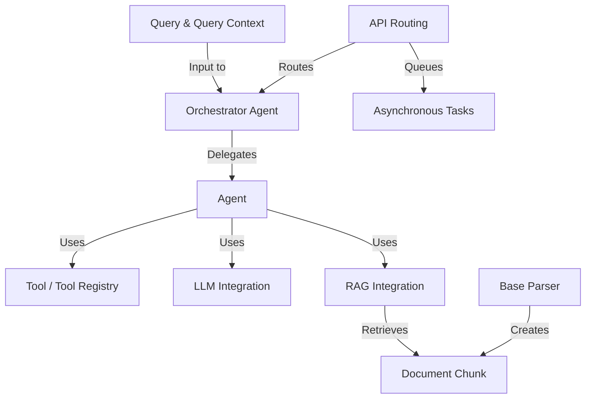
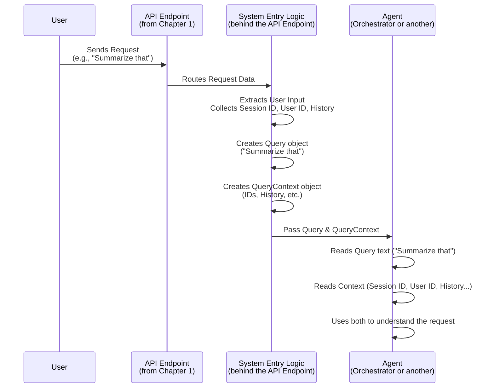
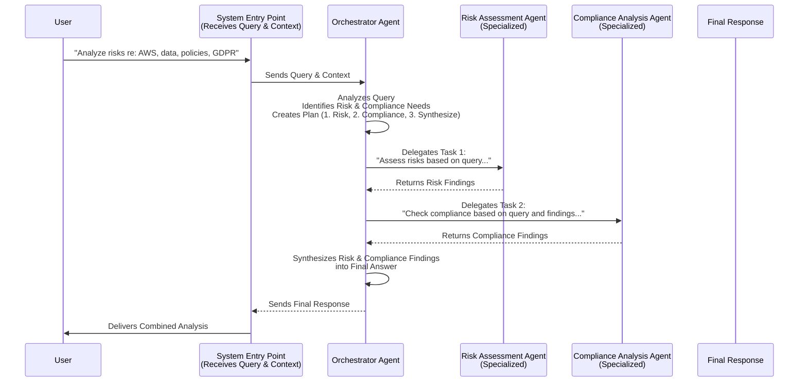
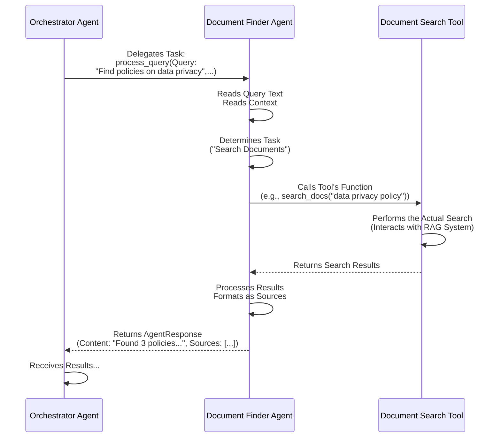
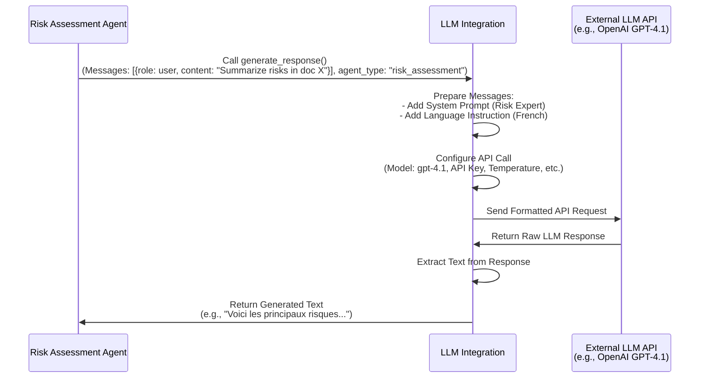
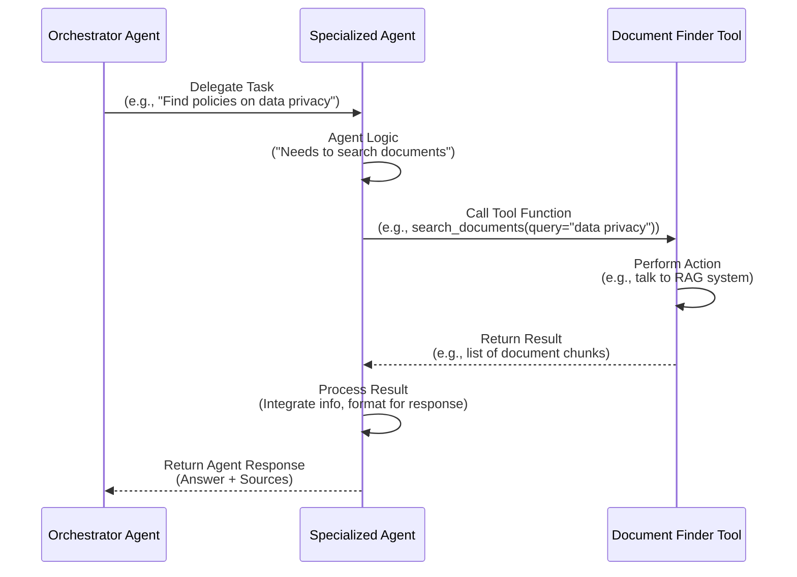
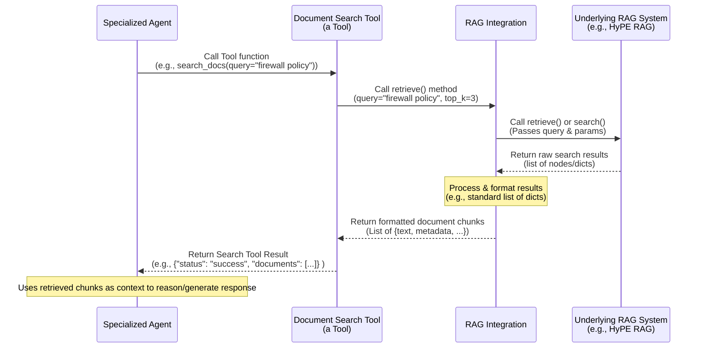
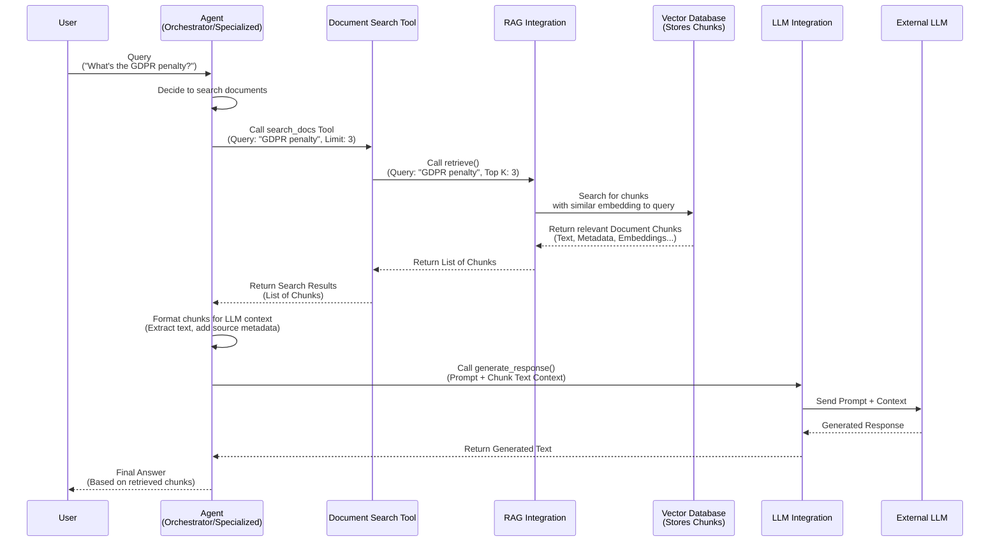

# Tutorial: RegulAIte backend

RegulAIte is a multi-agent AI system designed for **Governance, Risk, and
Compliance (GRC) analysis** using your *specific documents*. It processes
user requests and context (*Query & Query Context*), coordinated by an
*Orchestrator Agent* who delegates tasks to specialized *Agents*. Agents
use *Tools*, integrate with *LLMs* for AI capabilities, and leverage
*RAG Integration* to find relevant *Document Chunks* from your data,
created by *Base Parsers*. *API Routing* makes features accessible, and
*Asynchronous Tasks* handle processing in the background.


## Visual Overview



## Chapters

1. [API Routing
](#chapter-1-api-routing)
2. [Query & Query Context
](#chapter-2-query--query-context)
3. [Orchestrator Agent
](#chapter-3-orchestrator-agent)
4. [Agent
](#chapter-4-agent)
5. [LLM Integration
](#chapter-5-llm-integration)
6. [Tool / Tool Registry
](#chapter-6-tool--tool-registry)
7. [RAG Integration
](#chapter-7-rag-integration)
8. [Document Chunk
](#chapter-8-document-chunk)
9. [Base Parser
](#chapter-9-base-parser)
10. [Asynchronous Tasks
](#chapter-10-asynchronous-tasks)

# Chapter 1: API Routing

Welcome to the very first chapter of the RegulAite tutorial! If you're just starting out with RegulAite, this is the perfect place to begin. We're going to explore a fundamental concept that makes RegulAite work: **API Routing**.

### What is API Routing?

Imagine RegulAite as a bustling city hall offering many different services. There's a department for managing important documents, another for talking to helpful assistants, and specialized offices for complex tasks like risk analysis. When you visit city hall, you need to know the right address and office to go to for the specific service you need. You wouldn't go to the building permits office to ask about your tax records!

**API Routing** is essentially the city hall's directory, street map, and receptionist combined for RegulAite. It's the system that defines:

1.  The different **web addresses** where you can access RegulAite's various features (like document uploads, chat, etc.). These addresses are often called **URLs** or **Endpoints**.
2.  How the system understands **what you want to *do*** at that address (like get information, submit new information, or delete something) using **HTTP Methods** (like GET, POST, DELETE).
3.  How it quickly **directs** your request to the specific piece of code designed to handle that exact address and action.

It’s how RegulAite keeps all its functionalities organized and accessible from outside the system, whether you're using a web browser or another application to interact with it.

### Your Use Case: Accessing Different RegulAite Features

Let's think about how you interact with RegulAite in a simple scenario. You might want to:

*   See a list of documents already in the system.
*   Upload a new regulatory document.
*   Start a chat conversation to ask a question.

Each of these is a distinct action you perform. When you click a button or type a command in the RegulAite interface, your computer sends a message (a **request**) over the internet to the RegulAite server.

This request contains the destination address (the **URL/Endpoint**) and the action you want to take (the **HTTP Method**). API Routing reads this information to figure out where to send your request internally.

| If you want to...               | You interact with endpoint... | Using HTTP method... |
| :------------------------------ | :---------------------------- | :------------------- |
| Get a list of documents         | `/documents`                  | `GET`                |
| Upload a new document           | `/documents`                  | `POST`               |
| Send a chat message             | `/chat`                       | `POST`               |
| Get information about agents    | `/agents/metadata`            | `GET`                |

API Routing looks at the combination of the endpoint and the method (`GET /documents`, `POST /documents`, `POST /chat`, etc.) and routes the request to the correct function that's programmed to handle exactly that combination.

### Key Concepts in API Routing

Let's break down the important terms:

| Concept         | Description                                                    | Analogy (RegulAite City Hall)                                  |
| :-------------- | :------------------------------------------------------------- | :------------------------------------------------------------- |
| **API**         | The way different software programs (like your browser and the RegulAite server) talk to each other. | The set of official ways you can request services at City Hall. |
| **URL**         | A complete web address, like `https://regul-aite.com/api/documents`. | The full street address of the City Hall building.             |
| **Endpoint**    | The part of the URL that specifies a particular resource or function, like `/documents` or `/chat`. | A specific department or service window inside City Hall (e.g., "Document Services", "Chat Help Desk"). |
| **HTTP Method** | An action word that tells the server *what* you want to do with the endpoint (GET, POST, PUT, DELETE, etc.). | Telling the staff at the window *what* task you need done (e.g., "I want to **GET** a list", "I need to **POST** this form", "Please **DELETE** this record"). |
| **Router**      | The part of the application that matches the incoming request's HTTP Method and Endpoint to the right piece of code (a function) to handle it. | The detailed directory map and the system that guides you from the entrance to the correct service window. |

RegulAite's backend is built using a framework called FastAPI, which makes it easy to define these endpoints and methods and connect them to Python functions.

### How Routing Works in Practice (Simplified)

Let's see how API Routing directs a simple request, like getting the list of documents you've uploaded:

1.  You click a button in the RegulAite web interface to view your documents.
2.  Your web browser (the "client") sends an HTTP request to the RegulAite server (the "backend").
3.  This request specifies:
    *   **Method:** `GET` (because you want to *get* information).
    *   **Endpoint:** `/documents` (because you want information *about documents*).
    *   (It also includes the base server address, like `https://regul-aite.com/api`).
4.  The RegulAite backend receives the `GET /documents` request.
5.  The API Routing system looks through its defined routes.
6.  It finds a route that matches `GET` requests for the `/documents` endpoint.
7.  This route is configured to call a specific Python function (let's call it `document_list`).
8.  The router passes the request details to the `document_list` function, which then runs.
9.  The `document_list` function retrieves your document information from storage and sends it back as a response.
10. The RegulAite API system sends this response back to your browser, which displays the list of documents.

This same pattern applies to every interaction. A `POST /documents` request goes to a different function (like `process_document` for uploads), a `POST /chat` request goes to the `chat` function, and so on.

### Under the Hood: How RegulAite Organizes Routes

RegulAite uses FastAPI's `APIRouter` to organize its endpoints. Instead of having one giant list of all possible routes, related endpoints are grouped together in separate files, like all document-related endpoints in `document_router.py`, chat endpoints in `chat_router.py`, etc.

This is good practice for keeping the code organized and manageable.

Here's a look at how an `APIRouter` is typically set up (from `backend/routers/document_router.py`):

```python
# File: backend/routers/document_router.py
from fastapi import APIRouter
# ... other necessary imports ...

# Create a new API router instance
router = APIRouter(
    prefix="/documents",  # <-- Sets a base path for all routes in this file
    tags=["documents"],   # <-- Helps organize documentation (like Swagger UI)
)

# ... endpoint functions defined below will use this router ...
```

*Explanation:*
*   `from fastapi import APIRouter` imports the tool we need.
*   `router = APIRouter(...)` creates the router.
*   `prefix="/documents"` is important. It means every endpoint defined *using this specific `router` instance* will automatically have `/documents` added to the beginning of its path.

Now, let's see how this router is used to define the `GET /documents` endpoint we discussed earlier (simplified):

```python
# Inside backend/routers/document_router.py

# Define the endpoint for GET requests at the base path of this router
@router.get("") # The "" refers to the path *after* the prefix, so /documents + "" = /documents
# You could also use @router.get("/") for /documents/
async def document_list(
    # Parameters for the function, like pagination
    skip: int = Query(0, alias="offset"),
    limit: int = Query(100, alias="limit"),
    # ... potentially other parameters ...
):
    """
    This function handles GET requests to /documents.
    It retrieves and returns a list of documents.
    """
    # Code to fetch documents from your storage (covered in later chapters)
    documents = [...] # Placeholder for the actual list
    total_count = 10 # Placeholder
    
    print(f"Received request to list documents, skipping {skip}, limiting {limit}") # Example log
    
    # Return the list of documents (formatted for the API response)
    return {
        "documents": documents,
        "total_count": total_count,
        "limit": limit,
        "offset": skip
    }
```

*Explanation:*
*   `@router.get("")` is a **decorator**. It tells the `router` object that the function immediately below it (`document_list`) should be called when a `GET` request comes in for the path `""` relative to the router's prefix. Since the prefix is `/documents`, this maps to `GET /documents`.
*   The function `async def document_list(...)` contains the actual logic for handling the request (fetching documents).
*   FastAPI automatically takes query parameters from the URL (like `?offset=0&limit=100`) and passes them to the function arguments (`skip`, `limit`).

Let's see a different method, like `POST /documents` for uploading (simplified from `backend/routers/document_router.py`):

```python
# Inside backend/routers/document_router.py

# Define the endpoint for POST requests at the base path
@router.post("") # This maps to POST /documents
async def process_document(
    # Parameters for the function, including the uploaded file
    file: UploadFile = File(...), # FastAPI handles file uploads
    # ... potentially other parameters from the form or body ...
):
    """
    This function handles POST requests to /documents.
    It receives an uploaded file and queues it for processing.
    """
    print(f"Received file upload request for: {file.filename}") # Example log
    
    # --- Simplified Logic ---
    # In reality, this would save the file temporarily,
    # create initial database records, and queue a background task.
    doc_id = "dummy_doc_id_123" # Placeholder
    task_id = "dummy_task_id_456" # Placeholder
    
    # Note: The actual processing is usually asynchronous (Chapter 8)
    # so this function returns quickly.
    
    # Return confirmation
    return {
        "doc_id": doc_id,
        "task_id": task_id,
        "status": "processing_queued",
        "message": "File uploaded and processing queued."
    }
```

*Explanation:*
*   `@router.post("")` maps `POST /documents` to the `process_document` function.
*   FastAPI automatically handles receiving the uploaded file and making it available as the `file` argument.
*   This function performs initial steps and triggers the main document processing as a separate task, then returns a quick confirmation.

Each router file defines a set of related endpoints. The main application then includes all these routers to make the full API available.

```python
# Conceptual code in main.py (where the application starts)

from fastapi import FastAPI
# Import the routers from their respective files
from routers.document_router import router as document_router
from routers.chat_router import router as chat_router
from routers.agents_router import router as agents_router
# ... import other routers ...

# Create the main FastAPI application instance
app = FastAPI(
    title="RegulAite API",
    version="0.1.0",
    # ... other app settings ...
)

# Include all the individual routers in the main application
# This makes all their defined endpoints accessible
app.include_router(document_router) # Endpoints start with /documents
app.include_router(chat_router)     # Endpoints start with /chat
app.include_router(agents_router)   # Endpoints start with /agents
# ... include other routers ...

# Optional: Define a simple root endpoint
@app.get("/")
async def read_root():
    return {"message": "Welcome to the RegulAite API"}

# The app instance is now ready to receive and route requests
# This 'app' instance is then typically run by a web server like uvicorn
```

*Explanation:*
*   The main application imports the `router` objects from each file.
*   `app.include_router(...)` tells the main application to add all the endpoints defined by that router. The `prefix` defined in the router (`/documents`, `/chat`, etc.) is used as the base path when including them.

This is how an incoming request finds its way from the internet to the specific line of Python code that handles it in RegulAite's backend.

Here's a simplified diagram of this process:

```mermaid
graph TD
    UserRequest[User Request <br/> (URL + Method)] --> MainApp(RegulAite FastAPI App)
    MainApp -- Route based on prefix --> DocumentRouter[APIRouter <br/> /documents]
    MainApp -- Route based on prefix --> ChatRouter[APIRouter <br/> /chat]
    MainApp -- Route based on prefix --> AgentsRouter[APIRouter <br/> /agents]
    MainApp -- Route based on prefix --> OtherRouters[...]

    DocumentRouter -- Route based on method+path --> DocumentListFn["document_list<br/>(GET /documents)"]
    DocumentRouter -- Route based on method+path --> ProcessDocumentFn["process_document<br/>(POST /documents)"]
    DocumentRouter -- Route based on method+path --> DeleteDocumentFn["delete_document<br/>(DELETE /documents/{id})"]

    ChatRouter -- Route based on method+path --> ChatFn["chat<br/>(POST /chat)"]

    AgentsRouter -- Route based on method+path --> ListAgentsFn["list_agent_types<br/>(GET /agents/types)"]
    AgentsRouter -- Route based on method+path --> ExecuteOrchestratorFn["execute_orchestrator<br/>(POST /agents/orchestrator/execute)"]

    DocumentListFn -- Calls --> RAGSystem[RAG System]
    ProcessDocumentFn -- Calls --> DocumentParser[Document Parser]
    ChatFn -- Calls --> RAGSystem
    ChatFn -- Calls --> AgentSystem[Agent System]
    ExecuteOrchestratorFn -- Calls --> AgentSystem
```

This diagram shows how your request first hits the main application, which directs it to the correct `APIRouter` based on the start of the URL (the prefix). The router then uses the exact path and HTTP method to find the specific function that runs the code for that feature. These functions then interact with other core RegulAite components (which you'll learn about in upcoming chapters).

### Analogy: The City Hall Directory & Receptionist

Let's go back to our city hall analogy for a final look at API Routing:

*   **The RegulAite Server:** The entire City Hall building.
*   **The RegulAite API:** The official ways you can interact with the services inside (not just wandering around).
*   **A URL (like `/api/documents`):** The full address, directing you to the specific entrance for city services.
*   **An Endpoint (like `/documents`):** The sign for a specific department inside, like "Document Services".
*   **An HTTP Method (like `GET` or `POST`):** What you tell the receptionist you need to *do* at that department's counter ("I need to **GET** a form", "I want to **POST** this application").
*   **The APIRouter (e.g., `document_router`):** The sign and map for the "Document Services" department, showing you exactly where to go inside that area for different tasks.
*   **The Specific Function (`document_list` or `process_document`):** The specific service window or desk within the "Document Services" department that handles *exactly* your type of request (one window for getting lists, another for submitting new documents).

API Routing is the system that makes sure when you say "I need to **GET** information from the **Document Services** department," you are correctly sent to the `document_list` function, and when you say "I need to **POST** a new document to the **Document Services** department," you are sent to the `process_document` function.

### Conclusion

In this first chapter, we've introduced the fundamental concept of **API Routing** in RegulAite. You learned that it's the system that defines the web addresses (**URLs** or **Endpoints**) for different features and uses **HTTP Methods** (like GET, POST, DELETE) to direct incoming requests to the correct function that handles that specific feature. We saw how RegulAite uses FastAPI's `APIRouter` to organize these endpoints logically by functionality and how the main application brings these routers together.

Understanding API Routing is the first step to understanding how you interact with RegulAite's backend. Now that you know *how* a request gets to the right place, what happens next? Often, the next step involves understanding what information the user is providing or asking about.

Ready to learn about how RegulAite understands the user's input? Let's move on to the next chapter!

# Chapter 2: Query & Query Context

Welcome back to the RegulAite tutorial! In our [first chapter](#chapter-1-api-routing), we explored **API Routing**, learning how your requests find the right "door" and "service window" in the RegulAite backend. Now that your request has arrived at the correct function, the system needs to figure out exactly *what* you want and how to understand it fully.

This brings us to a core concept: understanding the user's input.

### What's the Problem? Understanding the Full Picture

Imagine you're chatting with a helpful assistant. You might ask: "Can you summarize that for me?"

If the assistant only heard "Can you summarize that for me?", it wouldn't know *what* "that" refers to. Does it mean the document you uploaded earlier? The last message it sent? Something else entirely?

To give a helpful answer, the assistant needs more than just the immediate question. It needs context! It needs to know:

*   **Who are you?** (So it can access your documents, remember your preferences, etc.)
*   **What have we talked about just before this?** (To understand "that" or "it").
*   **Are there any other relevant details?** (Like which document is currently open, or what project you're working on).

Simply put, the raw text of your immediate question isn't enough for a smart, context-aware system to understand your true intent and provide an accurate response.

### Meet the Query and Query Context: Your Question, Plus the Background

RegulAite solves this by packaging the user's request into two key pieces of information:

1.  **The Query:** This is the immediate question or command the user gives *right now*. It's the core of the request. For example, if you type "Analyze the risks," the Query is "Analyze the risks."
2.  **The Query Context:** This is all the extra information that helps the system understand the Query fully. It's like attaching a background memo to the question. This can include details like:
    *   A unique ID for your conversation **session**.
    *   Your unique **user ID**.
    *   A history of **previous messages** in this conversation.
    *   Any other relevant **metadata** (like identifiers for specific documents or projects you're currently focused on).

Together, the **Query** and the **Query Context** provide the complete picture the system needs to process your request accurately.

Think of it this way:

| Concept         | Analogy                                      | Example for "Summarize that"           |
| :-------------- | :------------------------------------------- | :------------------------------------- |
| **Query**       | The immediate question you ask.              | "Summarize that."                      |
| **Query Context** | The background information the listener knows. | Knows who you are, the conversation history (e.g., you just discussed "Report_Q3.pdf"). |

Without the Query Context, the system gets "Summarize that." With the Query Context, it gets "Summarize 'that' (which, based on our history, is likely Report_Q3.pdf) for user Sarah (ID: 123) in session XYZ." This is much more actionable!

### How RegulAite Uses Query and Query Context

When an incoming request is received and routed (thanks to Chapter 1!), one of the first things RegulAite does is take the user's raw input and create `Query` and `QueryContext` objects from it. These objects are then passed to the parts of the system responsible for understanding and processing the request, primarily the [Orchestrator Agent](#chapter-3-orchestrator-agent).

Here's a simplified look at this initial step:



This diagram shows how the user's raw input is transformed by the system entry logic (which lives behind the API endpoints) into the structured `Query` and `QueryContext` objects before being handed off to the next stage of processing, like an [Agent](#chapter-3-orchestrator-agent).

### Looking at the Code (Simplified)

RegulAite defines the structure of the `Query` and `QueryContext` using Python classes based on Pydantic. Pydantic helps ensure that these objects are structured correctly and contain the expected types of data.

You can find the definitions for `Query` and `QueryContext` in the `backend/agent_framework/agent.py` file.

Let's look at a simplified version of the `QueryContext` definition:

```python
# backend/agent_framework/agent.py (simplified QueryContext)
from typing import Dict, List, Optional, Any
from pydantic import BaseModel, Field
import uuid # To generate unique IDs
from datetime import datetime # For timestamps

class QueryContext(BaseModel):
    """Context information about a query."""
    session_id: str = Field(default_factory=lambda: str(uuid.uuid4()))
    timestamp: str = Field(default_factory=lambda: datetime.now().isoformat())
    user_id: Optional[str] = None # User ID might be optional
    previous_interactions: Optional[List[Dict[str, Any]]] = None # List of past messages/responses
    metadata: Dict[str, Any] = Field(default_factory=dict) # Flexible place for other data

    # ... (More fields might exist for advanced features like iteration context)
```

*Explanation:*
*   `QueryContext(BaseModel)`: Defines a class `QueryContext` that inherits from Pydantic's `BaseModel`, giving it data validation and structure.
*   `session_id`: A unique string generated automatically (`default_factory`) for each new session. This ties all interactions within a conversation together.
*   `timestamp`: Records when this context was created, useful for tracking. Automatically set to the current time.
*   `user_id`: An optional string to identify the user.
*   `previous_interactions`: An optional list that can hold information about past turns in the conversation (like previous user questions or system answers).
*   `metadata`: A flexible dictionary to store any other relevant background information.

Now, let's look at a simplified version of the `Query` definition:

```python
# backend/agent_framework/agent.py (simplified Query)
from pydantic import BaseModel, Field
from enum import Enum

class IntentType(str, Enum):
    """Types of user query intents."""
    QUESTION = "question"
    COMMAND = "command"
    # ... (Other intent types)
    UNKNOWN = "unknown"

class Query(BaseModel):
    """Incoming user query with metadata."""
    query_text: str = Field(..., description="The raw query text from the user") # The user's words
    intent: IntentType = Field(default=IntentType.UNKNOWN) # What the user wants to do
    context: QueryContext = Field(default_factory=QueryContext) # The background info!
    parameters: Dict[str, Any] = Field(default_factory=dict) # Any specific options in the query

    # ... (More fields might exist for advanced features)

    # (There's also a validator to try and guess the intent if not provided)
```

*Explanation:*
*   `Query(BaseModel)`: Defines the `Query` class structure.
*   `query_text`: The user's immediate input as a string. The `...` means it's required.
*   `intent`: An `Enum` indicating what the user wants to *do* (ask a question, give a command, etc.). This might be automatically determined or set by the system.
*   `context`: **Crucially**, this field holds an instance of our `QueryContext`. This is how the Query is linked to all its background information. `default_factory=QueryContext` means a new, empty context will be created if none is provided.
*   `parameters`: A dictionary to capture any specific options the user included (e.g., `format: json`).

So, every time a user request is processed, the system creates a `Query` object that *contains* its corresponding `QueryContext` object.

You can see this creation process happening in components that receive user input, like the `ChatIntegration` (`backend/agent_framework/integrations/chat_integration.py`). Here's a simplified snippet showing that:

```python
# backend/agent_framework/integrations/chat_integration.py (snippet)
# ... imports ...
from ..agent import Query, AgentResponse, QueryContext # Import our models
# ... (other imports and class definition) ...

    async def process_chat_request(self, request_data: Dict[str, Any], ...) -> Dict[str, Any]:
        # ... (extract user_message and session_id from request_data) ...
        
        # Create the QueryContext using info from the request
        query_context = QueryContext(
            session_id=session_id,
            metadata={"previous_messages": messages[:-1] if len(messages) > 1 else []}
            # (user_id might also be set here if available)
        )
        
        # Create the Query object
        query = Query(
            query_text=user_message,
            context=query_context, # **Link the context here!**
            # (other fields like intent or parameters might be set here)
        )
        
        # Pass the combined Query object to the next processing step (like an agent)
        # agent is an instance of Agent or OrchestratorAgent
        agent_response = await agent.process_query(query) 
        
        # ... (process agent_response and return formatted output) ...
```

*Explanation:* This snippet shows the `ChatIntegration` function receiving `request_data`. It extracts key pieces like `session_id` and the `user_message`. It then explicitly creates a `QueryContext` instance, passing the session ID and potentially other info like previous messages. Finally, it creates the `Query` instance, passing the user's text and, importantly, the `query_context` instance it just created. This resulting `query` object, containing both the immediate request and the background context, is then passed to the `agent.process_query()` method for the main processing logic.

### Why is this important?

Defining and using `Query` and `QueryContext` as structured objects provides several key benefits:

*   **Clarity:** It makes it explicit that user input has two parts: the immediate action and the background state.
*   **Standardization:** All parts of the system that process requests receive information in a consistent format (`Query` objects).
*   **Completeness:** Ensures that necessary background information is always available alongside the immediate request.
*   **Flexibility:** The `metadata` field in `QueryContext` allows adding any extra information needed for a specific interaction or feature.
*   **Enables Complex Behavior:** By carrying the session history and other context, the system can remember previous turns, tailor responses to the user, and handle follow-up questions effectively.

This structure is foundational for building the intelligent, conversational capabilities of RegulAite, especially for complex domain analysis where context is critical.

### Conclusion

In this chapter, we learned that understanding a user's request goes beyond just their immediate words. RegulAite captures this necessary background information alongside the request itself by using the `Query` object (the immediate question/command) and the `QueryContext` object (session ID, user ID, history, metadata). Together, they provide the full picture needed for accurate and context-aware processing. We saw how these are represented as Pydantic models in the code and how they are created from incoming requests.

Now that we know how user requests are packaged, let's look at the central component responsible for receiving these requests and figuring out what needs to be done to answer them: the [Orchestrator Agent](#chapter-3-orchestrator-agent).

# Chapter 3: Orchestrator Agent

Welcome back to the RegulAite tutorial! In our [first chapter](#chapter-1-api-routing), we saw how requests find their way to the right part of the system using **API Routing**. In [Chapter 2: Query & Query Context](#chapter-2-query--query-context), we learned how the user's immediate question and all the necessary background information are packaged together into `Query` and `QueryContext` objects.

Now that a request has arrived and we know *what* the user is asking for, the system needs to figure out *how* to actually fulfill that request, especially if it's complex. This requires planning and coordination.

### What's the Problem? Handling Complex Requests

Imagine you're building an AI system designed to help with GRC (Governance, Risk, and Compliance). A user might ask something like:

"Analyze the potential risks for our company related to using AWS for processing sensitive customer data, considering GDPR requirements and our internal security policies."

This single request is actually quite complex! It involves:

1.  **Understanding the Goal:** The user wants a risk analysis, specifically related to using a cloud provider (AWS) and handling sensitive data.
2.  **Identifying Key Constraints:** The analysis must consider specific regulatory requirements (GDPR) and internal company rules (security policies).
3.  **Gathering Information:** The system needs details about AWS processing, the specific type of sensitive data, the full text of GDPR, and the company's internal policies.
4.  **Performing Analysis:** It needs to apply risk assessment methodology based on the gathered information and context. It also needs to assess compliance against GDPR rules.
5.  **Combining Results:** The findings from both risk assessment and compliance checking need to be merged into a single, coherent answer.

No single simple component can do all of this in one go. It requires coordinating different types of expertise and steps.

### Meet the Orchestrator Agent: The Project Manager

In RegulAite, the **Orchestrator Agent** is the central intelligence responsible for tackling these kinds of complex requests. Think of it as the **Project Lead** or **Team Coordinator** for the entire agent system.

Its primary role is to take a complex `Query` and its `QueryContext` and manage the process of answering it. It doesn't necessarily perform the detailed analysis itself, but it knows *who* should do what and *when*.

Here's what the Orchestrator Agent does:

*   **Understands the Request:** It receives the `Query` and `QueryContext` and figures out the user's main goal and the different types of analysis required (e.g., "This needs Risk *and* Compliance analysis").
*   **Creates a Plan:** Based on its understanding, it designs a step-by-step plan. This plan outlines which specialized tasks need to be done and which specialized agents or tools are best suited for each task.
*   **Delegates Tasks:** It assigns the specific steps or sub-tasks from the plan to the appropriate specialized agents.
*   **Manages the Flow:** It oversees the execution of the plan, making sure information flows correctly between different steps and agents.
*   **Handles Iteration:** For very complex or ambiguous requests, the Orchestrator can manage multiple passes or "iterations" over the problem, refining its approach, gathering more information, and improving the analysis based on intermediate findings.
*   **Synthesizes Results:** Once all the necessary tasks are completed, the Orchestrator gathers the results from all the specialized agents and combines them into a single, final, comprehensive response that directly addresses the user's original request.

In essence, the Orchestrator is the conductor of the orchestra, ensuring all the different instruments (specialized agents) play their parts in harmony to produce the final result.

### How the Orchestrator Works: A Simple Scenario

Let's visualize a simplified version of the complex request scenario we discussed: "Analyze the potential risks... considering GDPR... and our internal policies."



This diagram shows the Orchestrator receiving the request, deciding it needs help from the Risk and Compliance experts, delegating those specific tasks, waiting for their results, and finally combining everything into the answer for the user. The Orchestrator manages the *workflow*.

### The Orchestrator's Core Tasks in Detail

The Orchestrator's process is often powered by an underlying Large Language Model (LLM) which helps with understanding the user's intent and generating structured plans or final summaries.

1.  **Query Analysis & Planning:** The first step is understanding the `Query` and its `QueryContext`. The Orchestrator uses its internal logic, often guided by an LLM, to break down the complex request into smaller, manageable sub-goals. It then identifies which specialized agents (like `risk_assessment`, `compliance_analysis`, `document_finder`) are needed and outlines the sequence of steps they should follow. The LLM might be prompted to output this plan in a structured format like JSON.

    *Simplified Code Idea:*
    ```python
    # Inside OrchestratorAgent class
    async def _analyze_request(self, user_query: str) -> Dict[str, Any]:
        # This method asks the LLM to parse the query and build a plan.
        prompt = f"""
        Analyze this user request in French and create a JSON action plan...
        DEMANDE: "{user_query}"
        Plan format: {{"agents_required": [...], "sequence_execution": [...]}}
        """
        # Call the LLM Integration (See Chapter 6)
        response = await self.llm_client.generate_response(messages=[..., {"role": "user", "content": prompt}])
        # Parse JSON response...
        return parsed_plan
    ```
    *Explanation:* The `_analyze_request` method is central to the Orchestrator's intelligence. It uses the configured LLM client to interpret the user's free-text query and generate a structured plan that the Orchestrator can then follow.

2.  **Execution & Delegation:** Once the plan is generated, the Orchestrator executes it step by step. For each step, it identifies the required specialized agent (based on `agent_id` in the plan). It then prepares a focused version of the request for that specific agent, often creating an "enriched query" that includes necessary context, parameters, and potentially results from previous steps. It then calls the `process_query` method on the designated specialized agent and waits for its `AgentResponse`.

    *Simplified Code Idea:*
    ```python
    # Inside OrchestratorAgent class
    async def _execute_plan_with_iteration(self, analysis_plan: Dict[str, Any], original_query: Query, iteration_context) -> Dict[str, Any]:
        results = {"agent_results": {}, "all_sources": []}
        # Get steps from the analysis plan...
        
        for step in analysis_plan.get("sequence_execution", []):
            agent_id = step.get("agent")
            if agent_id in self.specialized_agents:
                 agent_instance = self.specialized_agents[agent_id]
                 
                 # Prepare enriched query for the specialized agent
                 enriched_query = Query(
                      query_text=original_query.query_text, # Original text for context
                      context=original_query.context,      # Original context
                      parameters={
                          "specific_objective": step.get("action"), # Specific instruction for the agent
                          "previous_findings": iteration_context.knowledge_gained # Pass relevant info from past iterations
                      }
                 )
                 
                 # Call the specialized agent's process_query method (See Chapter 4)
                 agent_response = await agent_instance.process_query(enriched_query)
                 
                 # Store results and sources...
                 results["agent_results"][agent_id] = agent_response.content
                 results["all_sources"].extend(agent_response.sources)
                 
                 # Log the step (See Chapter 9)
                 await self.agent_logger.log_tool_execution( # Using tool_execution type for simplicity here
                     agent_id=agent_id, agent_name=agent_instance.name,
                     tool_id=agent_id, # Using agent_id as tool_id for simplicity
                     tool_params=enriched_query.parameters, result={"content_summary": agent_response.content[:100]},
                     execution_time_ms=...
                 )

            # Handle agent not found...
        return results
    ```
    *Explanation:* This method loops through the planned steps. For each step, it finds the correct specialized agent instance and calls its `process_query` method, providing it with a targeted `Query` object that includes the specific task and relevant context gained so far. It also logs the execution using the `AgentLogger`.

3.  **Iteration & Gap Identification:** After executing a set of steps, the Orchestrator might need to check if the results are sufficient or if there are still "context gaps" – missing pieces of information needed for a complete answer. It can use the LLM to analyze the results and the original query to identify these gaps (`_identify_context_gaps`). If gaps exist and the maximum number of iterations hasn't been reached (`should_continue_iteration`), the Orchestrator can decide to start another iteration, potentially reformulating the original query (`_reformulate_query`) to specifically target the missing information in the next pass. This iterative process is managed by an `IterationContext` object.

    *Simplified Code Idea:*
    ```python
    # Inside OrchestratorAgent process_query method (high-level flow)
    # ... initial analysis ...
    iteration_context = IterationContext() # Tracks iteration state
    
    while iteration_context.should_continue_iteration():
        # Log iteration start (See Chapter 9)
        await self.agent_logger.log_iteration(...)
        
        # Execute steps for the current iteration
        execution_results = await self._execute_plan_with_iteration(
            analysis_result, query, iteration_context
        )
        
        # Identify if more info is needed
        context_gaps = await self._identify_context_gaps(..., execution_results, iteration_context)
        
        # Add results and gaps to context
        iteration_context.add_iteration(query.query_text, execution_results, context_gaps)
        
        # Decide if another iteration is needed based on gaps and max iterations
        if context_gaps and iteration_context.should_continue_iteration():
            # Reformulate query to target gaps
            reformulated_query = await self._reformulate_query(..., context_gaps, iteration_context)
            if reformulated_query:
                query.query_text = reformulated_query # Update query for the next loop
            else:
                break # Cannot reformulate, stop
        else:
            break # No gaps or max iterations reached, stop loop
            
    # ... proceed to final synthesis ...
    ```
    *Explanation:* The `process_query` method includes a `while` loop. It runs a set of execution steps, checks for missing information (`context_gaps`), updates the `iteration_context`, and decides whether to continue based on whether gaps were found and if more iterations are allowed. If it continues, it might update the user's query (`query.query_text`) based on the identified gaps.

4.  **Synthesis:** Once the iterative process is complete (either no more gaps are found or the maximum iterations are reached), the Orchestrator gathers all the findings accumulated across all iterations and from all specialized agents. It then uses the LLM to synthesize this collective knowledge into a single, coherent, and well-structured final answer for the user.

    *Simplified Code Idea:*
    ```python
    # Inside OrchestratorAgent class
    async def _synthesize_iterative_results(self, original_query_text: str, analysis: Dict[str, Any], iteration_context: IterationContext) -> str:
        # This method sends all gathered information to the LLM for final formatting.
        prompt = f"""
        Synthesize all findings from {iteration_context.iteration_count} iterations...
        Original Query: "{original_query_text}"
        Analysis Plan: {analysis}
        Iteration Summary: {iteration_context.get_iteration_summary()}
        All Agent Results: {iteration_context.previous_results}
        Knowledge Gained: {iteration_context.knowledge_gained}
        
        Provide a final, comprehensive answer in French based on this.
        """
        # Call the LLM Integration (See Chapter 6)
        final_answer = await self.llm_client.generate_response(messages=[..., {"role": "user", "content": prompt}])
        return final_answer
    ```
    *Explanation:* `_synthesize_iterative_results` constructs a detailed prompt for the LLM, giving it all the history and results from the `iteration_context`. The LLM's task is then to read through all this and generate the final response text.

### Orchestrator in the Code

The `OrchestratorAgent` class is defined in `backend/agent_framework/orchestrator.py`. It inherits from a base `Agent` class (which we'll cover in the [next chapter](#chapter-4-agent)) and has dependencies on the [LLM Integration](#chapter-5-llm-integration) and a collection of specialized agents.

Here's a simplified look at its structure:

```python
# backend/agent_framework/orchestrator.py (simplified)
import logging
from typing import Dict, List, Optional, Any, Union
import time

from .agent import Agent, AgentResponse, Query, QueryContext # Imports Query/Context/Response models
from .integrations.llm_integration import LLMIntegration # Orchestrator needs the LLM
from .agent_logger import AgentLogger # Orchestrator uses the logger

logger = logging.getLogger(__name__)

# IterationContext class is defined above OrchestratorAgent (see full code)
# It tracks state across iterations (count, gaps, results, etc.)
class IterationContext:
    # ... simplified definition from context ...
    pass


class OrchestratorAgent(Agent):
    """
    Main orchestrator agent coordinating specialized agents iteratively.
    """
    
    def __init__(self, llm_client: LLMIntegration, log_callback=None):
        # Calls the base Agent constructor (Chapter 4)
        super().__init__(
            agent_id="orchestrator",
            name="Orchestrateur Principal GRC Itératif" # Name indicates its role and capability
        )
        
        self.llm_client = llm_client # Dependency: The LLM for planning/synthesis
        self.specialized_agents: Dict[str, Agent] = {} # Dependency: A dictionary to hold its team of experts
        self.agent_logger = None # Will be initialized per session (See Chapter 9)
        self.log_callback = log_callback # For real-time logging to UI (See Chapter 9)
        
        # Holds the system prompt used for the LLM calls
        self.system_prompt = """
        Tu es l'orchestrateur principal... (Simplified)
        """

    def register_agent(self, agent_id: str, agent: Agent):
        """Register a specialized agent with the orchestrator."""
        self.specialized_agents[agent_id] = agent
        logger.info(f"Agent {agent_id} registered in the orchestrator")

    # ... other helper methods ...
```
*Explanation:* The `OrchestratorAgent` class inherits from `Agent`. Its `__init__` method takes required dependencies like the `llm_client` and a `log_callback`. It stores these and initializes an empty dictionary `specialized_agents` where other components (like the [Factory](#chapter-10-asynchronous-tasks)) will register the expert agents it can call. The `register_agent` method is how these specialized agents are added to its team.

The main entry point, `process_query`, shows the high-level flow:

```python
# backend/agent_framework/orchestrator.py (simplified process_query)
# ... imports and class definition ...

    async def process_query(self, query: Union[str, Query]) -> AgentResponse:
        """
        Process a user query and orchestrate specialized agents iteratively.
        """
        # Ensure input is a Query object
        if isinstance(query, str):
            query = Query(query_text=query)

        # Initialize a unique logger instance for this session (See Chapter 9)
        session_id = query.context.session_id if query.context else None
        self.agent_logger = AgentLogger(session_id=session_id, callback=self.log_callback)

        logger.info(f"Orchestrator - Starting iterative analysis for: {query.query_text}")

        start_time = time.time() # For tracking total time

        # Initialize the iteration context
        iteration_context = IterationContext()

        # Step 1: Initial Analysis & Planning
        analysis_result = await self._analyze_request(query.query_text)
        # Log the analysis result (See Chapter 9)
        await self.agent_logger.log_query_analysis(..., analysis_result=analysis_result)

        # Step 2: Iteration Loop
        while iteration_context.should_continue_iteration():
            iteration_num = iteration_context.iteration_count + 1
            
            # Log iteration start (See Chapter 9)
            await self.agent_logger.log_iteration(..., iteration_number=iteration_num, ...)

            # Execute the planned steps for this iteration
            execution_results = await self._execute_plan_with_iteration(
                analysis_result, query, iteration_context
            )
            # Log execution results (See Chapter 9)
            await self.agent_logger.log_activity(..., details=execution_results) # Simplified log call

            # Identify gaps needing more info
            context_gaps = await self._identify_context_gaps(
                query.query_text, analysis_result, execution_results, iteration_context
            )
            # Log gap analysis (See Chapter 9)
            await self.agent_logger.log_decision_making(..., decision_made=f"Identified {len(context_gaps)} gaps", reasoning=context_gaps)

            # Add results and gaps to the iteration context
            iteration_context.add_iteration(
                query.query_text, execution_results, context_gaps
            )

            # If gaps, reformulate query for next iteration and re-analyze
            if context_gaps and iteration_context.should_continue_iteration():
                reformulated_query = await self._reformulate_query(
                    query.query_text, context_gaps, iteration_context
                )
                if reformulated_query:
                    query.query_text = reformulated_query # Update the query object for next loop pass
                    logger.info(f"Query reformulated: {reformulated_query}")
                    # Log reformulation (See Chapter 9)
                    await self.agent_logger.log_activity(..., message="Query reformulated", details={"new_query": reformulated_query})
                    # Re-analyze the reformulated query to get a new plan
                    analysis_result = await self._analyze_request(reformulated_query) 
                    await self.agent_logger.log_query_analysis(..., analysis_result=analysis_result, message="Re-analyzed reformulated query")
                else:
                    break # Stop if reformulation failed
            else:
                break # Stop if no gaps or max iterations reached

        # Step 3: Final Synthesis
        final_response_content = await self._synthesize_iterative_results(
            query.query_text, analysis_result, iteration_context
        )
        
        # Log final synthesis (See Chapter 9)
        await self.agent_logger.log_activity(..., activity_type="synthesis", status="completed", message="Final synthesis done", details={"response_length": len(final_response_content)})

        # Get the full session summary from the logger (See Chapter 9)
        session_summary = self.agent_logger.get_session_summary()
        total_processing_time = (time.time() - start_time) * 1000 # in ms

        # Return the final AgentResponse (See Chapter 4)
        return AgentResponse(
            content=final_response_content,
            tools_used=[], # Orchestrator usually doesn't use tools directly, agents do
            context_used=True, # Orchestrator heavily uses context
            sources=self._aggregate_all_sources(iteration_context), # Collect sources from all agents/iterations
            metadata={
                "total_iterations": iteration_context.iteration_count,
                "agents_involved": self._get_all_agents_used(iteration_context),
                "iteration_summary": iteration_context.get_iteration_summary(),
                "detailed_logs": session_summary, # Include the full log summary
                "total_processing_time_ms": total_processing_time
            }
        )
```
*Explanation:* The `process_query` method is the core loop. It first ensures the input is a `Query` object and initializes a session-specific `AgentLogger`. It then starts the iterative process. Inside the `while` loop, it executes the current plan (`_execute_plan_with_iteration`), checks if more information is needed (`_identify_context_gaps`), updates the `iteration_context`, and potentially reformulates the query and re-analyzes it for the next loop pass. Once the loop finishes, it calls `_synthesize_iterative_results` to generate the final answer based on everything learned. It gathers all the sources used across iterations and returns the final `AgentResponse`, crucially including the detailed session log summary in the metadata.

You can see the Orchestrator Agent being requested and executed via the `/agents/orchestrator/execute` API endpoint in `backend/routers/agents_router.py`:

```python
# backend/routers/agents_router.py (snippet)
# ... imports ...
from fastapi import APIRouter, Depends, HTTPException, Body
from agent_framework.factory import get_agent_instance, initialize_complete_agent_system # Import factory function
from agent_framework.agent import Query, AgentResponse # Import models
import time

router = APIRouter(
    prefix="/agents",
    tags=["agents"],
    # ...
)

# Cache global for the orchestrator instance
_orchestrator_instance = None

async def get_orchestrator():
    """Get the singleton orchestrator instance."""
    global _orchestrator_instance
    
    if _orchestrator_instance is None:
        # If not initialized, call the factory to build the complete system
        try:
            # Need access to the RAG system from main app for initialization
            from main import rag_system # Example of getting external dependency
            
            # Define a callback function to stream logs (e.g., to a WebSocket)
            async def router_log_callback(log_data):
                # This is a dummy callback for the router.
                # A real implementation would stream this via WebSocket
                # or store it somewhere accessible by the frontend.
                print(f"Router Log Callback: {log_data['log_entry']['message']}") 
                # In a real API, you'd use something like:
                # await websocket_manager.send_log(log_data['session_id'], log_data)
            
            _orchestrator_instance = await initialize_complete_agent_system(
                rag_system=rag_system, # Pass RAG system to the factory (See Chapter 10)
                log_callback=router_log_callback # Pass the callback to the factory/orchestrator
            )
            logger.info("Orchestrator initialized via router.")
        except Exception as e:
            logger.error(f"Failed to initialize orchestrator: {e}")
            raise HTTPException(status_code=500, detail=f"Failed to initialize orchestrator: {e}")
            
    return _orchestrator_instance

# ... other router endpoints ...

@router.post("/orchestrator/execute")
async def execute_orchestrator(
    query: str = Body(..., description="Requête à analyser"),
    session_id: Optional[str] = Body(None, description="ID de session optionnel"),
    include_details: bool = Body(True, description="Inclure les détails d'orchestration")
):
    """
    Exécute une requête via l'orchestrateur principal.
    Endpoint spécialisé pour l'orchestration avec plus de détails.
    """
    try:
        # Get the singleton orchestrator instance (creating it if necessary)
        orchestrator = await get_orchestrator()
        
        # Create a Query object
        query_obj = Query(
            query_text=query,
            context=QueryContext(session_id=session_id or "default_session") # Create context with session ID
        )
        
        # Execute the query using the orchestrator's process_query method
        start_time = time.time()
        response = await orchestrator.process_query(query_obj)
        execution_time = time.time() - start_time
        
        # Prepare the response data
        result = {
            "query": query,
            "response": response.content, # The final answer text
            "execution_time": execution_time,
            "sources": response.sources or [], # Sources collected by agents
            "tools_used": response.tools_used or [], # Tools reported by orchestrator/agents
            "context_used": response.context_used # Should be True for orchestrator
        }
        
        # Include detailed logs if requested
        if include_details and response.metadata:
            result["orchestration_details"] = response.metadata # Includes session summary from logger
        
        return result
        
    except Exception as e:
        logger.error(f"Error executing orchestrator: {str(e)}")
        raise HTTPException(
            status_code=500, 
            detail=f"Échec de l'orchestration: {str(e)}"
        )
```
*Explanation:* The `/orchestrator/execute` endpoint in `agents_router.py` is the API entry point for users to interact specifically with the Orchestrator. It calls `get_orchestrator()` (which uses the [Factory](#chapter-10-asynchronous-tasks) function `initialize_complete_agent_system` behind the scenes if it's the first call) to get the ready-to-use Orchestrator instance. It creates a `Query` object from the request body (including the session ID in the `QueryContext`) and passes this `query_obj` to `orchestrator.process_query()`. It then takes the `AgentResponse` from the Orchestrator and formats it for the API response, including the detailed orchestration logs if `include_details` is true.

### Why is the Orchestrator Agent Important?

The Orchestrator Agent is absolutely critical for RegulAite's ability to handle real-world GRC analysis because it provides:

*   **Complex Query Handling:** It can break down and manage sophisticated, multi-faceted user requests that go far beyond simple keyword searches or single-step tasks.
*   **Dynamic Planning:** It can analyze the specific query and context to determine the best approach and the necessary steps, making the system flexible.
*   **Effective Delegation:** It efficiently directs tasks to the most appropriate specialized agents, leveraging their unique expertise.
*   **Robustness through Iteration:** The iterative capability allows it to refine its analysis, gather missing information, and handle ambiguity or incompleteness in the initial data or results.
*   **Coherent Output:** It synthesizes diverse findings from multiple sources and agents into a single, structured, and comprehensive answer for the user.
*   **Transparency:** By integrating with the Agent Logger, it provides a detailed view of the entire process, which is crucial for debugging, auditing, and building user trust.

Without the Orchestrator, RegulAite would be a collection of disconnected specialized tools. The Orchestrator is the brain that brings them together into a powerful, coordinated system capable of deep GRC analysis.

### Conclusion

In this chapter, we learned about the Orchestrator Agent, the central project manager of the RegulAite system. It takes complex user requests ([Query & Query Context](#chapter-2-query--query-context)), analyzes them (often using an [LLM](#chapter-5-llm-integration)), creates a plan, delegates tasks to specialized agents ([Agents](#chapter-4-agent)), manages iterative execution to refine findings, and synthesizes all results into a final response. It acts as the conductor, ensuring that all parts of the system work together harmoniously to solve complex problems, and leverages the Agent Logger to provide transparency into its process.


# Chapter 4: Agent

Welcome back to the RegulAite tutorial! In the [previous chapter](#chapter-3-orchestrator-agent), we met the Orchestrator Agent, the central project manager that takes complex user requests, breaks them down into smaller tasks, and plans how to get them done. But who are the specialized team members the Orchestrator directs to actually *perform* those tasks?

That's where the concept of an **Agent** comes in. Agents are the fundamental building blocks – the specialized workers in the RegulAite system.

### What's the Problem?

Imagine you're building an AI system for GRC (Governance, Risk, and Compliance). Users might ask it to do many different things:

*   "Analyze the security risks of using this new cloud software."
*   "Check if our data retention policy complies with GDPR."
*   "Find all documents related to our incident response plan."
*   "Extract the list of controls from this security framework document."

These are all very specific jobs. A single piece of code couldn't possibly be an expert in all of them. Trying to build one massive "brain" that does everything would be overwhelming, hard to manage, and even harder to improve.

We need a way to divide the work and create smaller, focused components, each skilled in a particular area or type of analysis.

### Meet the Agent: The Specialized Worker

In RegulAite, an **Agent** is exactly that – a specialized worker designed to perform a specific type of analysis or task. Think of each Agent as an expert in a particular domain, ready to handle specific assignments delegated to them, often by the [Orchestrator Agent](#chapter-3-orchestrator-agent).

Here's what defines an Agent:

*   **Specialized:** Each Agent has expertise in a narrow field, like risk assessment, compliance checking, or document searching.
*   **Receives Instructions:** They take a structured request in the form of a [Query object](#chapter-2-query--query-context), which includes the user's immediate question and all the necessary background context.
*   **Uses Tools:** Agents often need to interact with other systems or perform specific actions (like searching a database, calling an LLM, or parsing data). They do this by using [Tools](#chapter-6-tool--tool-registry).
*   **Produces Structured Results:** After doing its job, an Agent provides its findings back in a standard format called an `AgentResponse`.

Essentially, while the [Orchestrator](#chapter-3-orchestrator-agent) decides *what* job needs doing and *who* is the best expert for it, the **Agent** is the expert who receives that specific piece of the job and performs it using their skills and available [Tools](#chapter-6-tool--tool-registry).

| Concept               | Analogy (AI Team)                       | Role                                        |
| :-------------------- | :-------------------------------------- | :------------------------------------------ |
| **Orchestrator Agent**| The Project Manager / Team Lead         | Plans the overall project, delegates tasks. |
| **Agent**             | A Specialized Team Member / Expert      | Receives a specific task, uses expertise/tools to complete it. |
| **Tool**              | A piece of Equipment or Utility         | Used by Agents to perform specific actions (e.g., searching, parsing). |

### How an Agent Processes a Query (Simplified)

Let's look at how a single, specialized Agent might handle a task assigned to it. Imagine the Orchestrator asks a "Document Finder Agent" to "Find relevant policies on data privacy."



This simplified diagram shows that the Orchestrator calls the `process_query` method on the Document Finder Agent. The Agent receives the `Query`, figures out what it needs to do, decides to use its "Document Search Tool," calls that tool, gets results back from the tool, processes those results, and finally sends its findings back to the Orchestrator in an `AgentResponse`.

### Agents in the Code

The core concept of an Agent is defined by the `Agent` base class in `backend/agent_framework/agent.py`. All specialized agents (like the ones inside the [Specialized Modules](#chapter-4-agent)) inherit from this base class.

Let's look at the simplified structure of the base `Agent` class:

```python
# backend/agent_framework/agent.py (simplified)
import logging
from typing import Dict, List, Optional, Any, Union, Callable
# ... imports for Query, AgentResponse, IterativeCapability etc. ...

# IterativeCapability provides methods for assessing gaps, reformulation etc.
class IterativeCapability:
    # ... methods like assess_context_completeness, suggest_query_reformulation ...
    pass 

class Agent(IterativeCapability):
    """
    Core Agent class providing basic structure and execution capabilities.
    Specialized agents inherit from this class.
    """
    
    def __init__(self, agent_id: str, name: str, tools: Optional[Dict[str, Callable]] = None):
        """
        Initialize the agent with its identity and tools.
        """
        super().__init__()  # Initialize iterative capabilities mixin
        self.agent_id = agent_id # Unique identifier (e.g., "risk_assessment")
        self.name = name # Human-readable name (e.g., "Risk Assessment Agent")
        self.tools = tools or {} # Dictionary of tools this agent can use
        self.logger = logging.getLogger(f"agent.{agent_id}") # Logger for this specific agent

    async def process_query(self, query: Union[str, Query]) -> AgentResponse:
        """
        Main method for an agent to process a query.
        This method often calls _process_single_query or _process_iterative_query.
        """
        # Ensure input is a Query object
        if isinstance(query, str):
            query = Query(query_text=query)

        self.logger.info(f"Agent {self.agent_id} processing query: {query.query_text}")

        # This part decides if it's a simple query or requires iterative steps
        # based on query.iteration_mode.
        # Specialized agents typically override _process_single_query or _process_iterative_query.
        if query.iteration_mode != IterationMode.SINGLE_PASS: # IterationMode is an Enum
             response = await self._process_iterative_query(query, ...) # Complex iterative logic
        else:
             response = await self._process_single_query(query, ...) # Simple single-pass logic

        return response

    async def _process_single_query(self, query: Query, response: AgentResponse) -> AgentResponse:
        """
        Basic processing logic for a single-pass query.
        This method is meant to be overridden by specialized agents.
        """
        # Default implementation just acknowledges the query
        response.content = f"Hello! I am {self.name} ({self.agent_id}). I received query: '{query.query_text}'."
        response.context_used = True # Assume context might be useful
        self.logger.warning(f"Agent {self.agent_id} used default _process_single_query. No specialized logic implemented.")
        return response

    async def _process_iterative_query(self, query: Query, response: AgentResponse) -> AgentResponse:
         """Processing logic for iterative queries (often involves LLM calls)."""
         # Basic iterative logic using IterativeCapability methods
         # ... assesses context, suggests reformulation etc. ...
         response.content = f"Iterative mode for agent {self.name}. Current iteration: {query.context.iteration_count}."
         # ... actual iterative logic would be here ...
         return response # Needs to be more sophisticated in reality

    async def execute_tool(self, tool_id: str, **kwargs) -> Any: # Might return a structured ToolResult
        """
        Helper method for the agent to execute one of its registered tools.
        """
        if tool_id not in self.tools:
            self.logger.error(f"Tool '{tool_id}' not available for agent '{self.agent_id}'")
            # In a real scenario, would return a ToolResult with error=True
            raise ValueError(f"Tool '{tool_id}' not found") 

        tool_func = self.tools[tool_id]
        self.logger.info(f"Agent '{self.agent_id}' executing tool '{tool_id}' with params: {kwargs}")

        try:
            # Call the tool function
            result = await tool_func(**kwargs) 
            self.logger.debug(f"Tool '{tool_id}' executed successfully. Result type: {type(result)}")
            return result
        except Exception as e:
            self.logger.error(f"Error during tool execution '{tool_id}': {str(e)}")
            # In a real scenario, wrap exception in ToolResult
            raise # Re-raise or handle gracefully
            
    def format_document_as_source(self, doc: Dict[str, Any]) -> Dict[str, Any]:
        """Helper to format a document dictionary for the AgentResponse sources list."""
        # ... implementation to extract relevant fields like title, chunk_text, doc_id ...
        return {"title": doc.get("title", "Untitled"), "chunk_text": doc.get("chunk_text", "")} # Simplified
        
    def format_documents_as_sources(self, docs: List[Dict[str, Any]]) -> List[Dict[str, Any]]:
        """Helper to format a list of document dictionaries for the AgentResponse sources list."""
        return [self.format_document_as_source(doc) for doc in docs]
```
*Explanation:*
*   The `Agent` class serves as a template. It has basic properties like `agent_id` (a unique code name) and `name` (a friendly label).
*   Crucially, it holds a dictionary `self.tools` containing the specific [Tools](#chapter-6-tool--tool-registry) that this agent is allowed to use.
*   The `process_query` method is the standard entry point. Any component wanting an agent to do work calls this method, passing a [Query object](#chapter-2-query--query-context).
*   `_process_single_query` and `_process_iterative_query` are placeholder methods. Specialized agents *override* these methods to add their unique domain logic (e.g., the logic for performing a risk assessment goes inside the `_process_single_query` or `_process_iterative_query` of the Risk Assessment Agent).
*   `execute_tool` is a helpful method provided by the base class. Specialized agents use `await self.execute_tool("some_tool_id", ...)` to easily call their registered tools without needing to know the tool's internal details. The base method handles looking up the tool and calling its function.
*   `IterativeCapability` is a mixin class that provides methods related to iterative analysis (like checking if more information is needed or suggesting how to reformulate a query). While the base `Agent` includes this, the [Orchestrator Agent](#chapter-3-orchestrator-agent) is the primary driver of *system-level* iteration *between* agents. Specialized agents might use these capabilities for deep analysis *within* their specific task.
*   `format_documents_as_sources` is a utility to help agents prepare the `sources` list for the final response, ensuring transparency.

### The AgentResponse

When an Agent completes its task, it packages its findings into an `AgentResponse` object. This is the standard output format for all agents, making it easy for the [Orchestrator](#chapter-3-orchestrator-agent) or other components to understand the result.

```python
# backend/agent_framework/agent.py (simplified AgentResponse)
from pydantic import BaseModel, Field
from typing import Dict, List, Optional, Any
# ... imports for uuid etc. ...

class AgentResponse(BaseModel):
    """Standard response format from any agent."""
    response_id: str = Field(default_factory=lambda: str(uuid.uuid4())) # Unique ID for this response
    content: str = Field(..., description="The main textual response from the agent.") # The answer or summary
    tools_used: List[str] = Field(default_factory=list) # List of tool_ids used by this agent
    context_used: bool = False # True if the agent used the query context
    sources: List[Any] = Field(default_factory=list) # List of source objects (like documents) used
    confidence: float = 1.0 # Agent's confidence in its response (0.0 to 1.0)
    thinking: Optional[str] = None # Optional field for internal thought process (for debugging/UI)
    metadata: Dict[str, Any] = Field(default_factory=dict) # Flexible field for extra info
    
    # ... fields related to iteration might also be here (requires_iteration, context_gaps) ...
```
*Explanation:*
*   `content`: The main output – this could be the answer to a question, a summary of findings, a list of items, etc.
*   `tools_used`: A list of the IDs of the [Tools](#chapter-6-tool--tool-registry) the agent called while processing the query.
*   `sources`: If the agent retrieved information from documents or other sources (often via a [RAG Integration](#chapter-7-rag-integration) and a search [Tool](#chapter-6-tool--tool-registry)), this list contains details about those sources. This is very important for GRC to show the origin of information.
*   `metadata`: A dictionary for including any other relevant structured data.

### Creating a Specialized Agent (Conceptual)

To create a new specialized agent, you inherit from the base `Agent` class and implement your specific logic by overriding methods.

Here’s a highly simplified conceptual example of a "Risk Assessment Agent":

```python
# backend/agent_framework/modules/risk_assessment_module.py (Conceptual Snippet)
import logging
# ... other necessary imports ...

# Import the base Agent class and models
from ..agent import Agent, AgentResponse, Query 
# Import tools the agent might need
# from ..tools.document_finder import document_finder_tool 
# from ..tools.entity_extractor import entity_extractor_tool

logger = logging.getLogger(__name__)

class RiskAssessmentAgent(Agent):
    """
    Agent specialized in performing risk assessments.
    """
    
    # Often agents need LLM or RAG access, passed during init
    def __init__(self, llm_client, rag_system): 
        # Call the parent Agent constructor
        super().__init__(
            agent_id="risk_assessment", # Unique ID
            name="Risk Assessment Agent", # Human-readable name
            tools={
                # Register the tools this agent will use
                # "document_finder": document_finder_tool, 
                # "entity_extractor": entity_extractor_tool
            }
        )
        self.llm_client = llm_client # Store dependencies
        self.rag_system = rag_system

        # This agent might have specific internal methods
        # self._analyze_risk_statement(...)
        # self._calculate_risk_score(...)
        # ...

    async def _process_single_query(self, query: Query, response: AgentResponse) -> AgentResponse:
        """
        Implement the specific risk assessment logic here.
        This method overrides the basic one in the parent Agent class.
        """
        self.logger.info(f"Risk Agent starting analysis for: {query.query_text}")

        # 1. Use a tool to find relevant risk data (policies, previous reports)
        # Assuming document_finder_tool is registered and available via self.tools
        search_result = await self.execute_tool(
            "document_finder", 
            query=query.query_text + " AND risk assessment", # Enhance query for search tool
            limit=5 
        )

        relevant_docs = search_result # Simplified - tool might return structured result

        # 2. Use the LLM to analyze the retrieved documents in the context of the query
        analysis_prompt = f"""
        Act as a Risk Assessment Expert. Analyze the following documents to identify key risks related to the user's query: "{query.query_text}".
        Documents: {relevant_docs} 
        """
        risk_findings_text = await self.llm_client.generate_response(
             messages=[{"role": "user", "content": analysis_prompt}] # Pass prompt to LLM
        )

        # 3. Use another tool or internal logic to structure the findings
        # Example: Using Entity Extractor tool to pull out risks
        # risk_entities = await self.execute_tool("entity_extractor", text=risk_findings_text, entity_type="risk")

        # 4. Construct the final AgentResponse
        response.content = f"Here are the key risks identified:\n{risk_findings_text}" # Or format structured entities
        response.tools_used.append("document_finder") # Add tools used
        # if "entity_extractor" used: response.tools_used.append("entity_extractor")
        response.context_used = True # Indicate context was used
        response.sources = self.format_documents_as_sources(relevant_docs) # Add sources

        self.logger.info(f"Risk Agent finished analysis.")
        return response

    # _process_iterative_query would implement more complex, multi-step risk analysis...
```
*Explanation:*
*   `RiskAssessmentAgent` inherits from `Agent`.
*   In its `__init__`, it sets its unique ID and name and typically receives dependencies like `llm_client` and `rag_system` (passed by the [Factory](#chapter-10-asynchronous-tasks)). It also registers the specific [Tools](#chapter-6-tool--tool-registry) it needs (like `document_finder`).
*   It overrides `_process_single_query` with its actual logic: Use a tool to find documents, use the LLM to analyze them based on the query, potentially use another tool to structure results, and then build the `AgentResponse`.
*   It uses `self.execute_tool("tool_id", ...)` to call its tools and `self.llm_client.generate_response(...)` to interact with the LLM ([LLM Integration](#chapter-5-llm-integration)).
*   It adds the tools used and the sources found to the `AgentResponse` for transparency.

This shows how a specialized Agent focuses on its domain (Risk Assessment) and uses its available capabilities ([Tools](#chapter-6-tool--tool-registry), [LLM](#chapter-5-llm-integration), [RAG](#chapter-7-rag-integration)) to process a specific task delegated by the [Orchestrator](#chapter-3-orchestrator-agent).

### Why is this Important?

The Agent abstraction is a cornerstone of the RegulAite framework because it provides:

*   **Modularity:** It breaks down the overall system into smaller, independent, and manageable pieces (the Agents).
*   **Specialization:** Each Agent can be highly focused and optimized for its specific task or domain, leading to better performance and accuracy within that area.
*   **Reusability:** The same Agent can be used by the Orchestrator in different scenarios or parts of a complex plan.
*   **Maintainability:** It's easier to update or fix the logic of one specific Agent (like the Compliance Agent) without affecting the rest of the system.
*   **Collaboration:** The standard `process_query` input and `AgentResponse` output format make it easy for different Agents to potentially interact with each other or for the Orchestrator to manage them.

By using Agents, RegulAite can build a flexible and powerful team of experts capable of tackling complex GRC analysis by dividing the work among specialized components.

### Conclusion

In this chapter, we delved into the fundamental concept of the Agent, the specialized worker within the RegulAite framework. We learned that Agents receive [Queries & Query Context](#chapter-2-query--query-context), encapsulate specific domain expertise, use [Tools](#chapter-6-tool--tool-registry) to perform actions, and return results in a standard `AgentResponse` format. This modular design allows the system to divide and conquer complex tasks, making the system scalable, maintainable, and highly specialized.

# Chapter 5: LLM Integration

Welcome back to the RegulAite tutorial! In our journey through the core concepts, we've seen how user requests are understood ([Chapter 1: Query & Query Context](#chapter-2-query--query-context)), how the [Orchestrator Agent](#chapter-3-orchestrator-agent) plans tasks ([Chapter 2](#chapter-3-orchestrator-agent)), how [Specialized Modules](#chapter-4-agent) and [Agents](#chapter-4-agent) act as specialized workers ([Chapters 3 & 4](#chapter-4-agent)), and how they use [Tools](#chapter-6-tool--tool-registry) to perform actions like searching documents ([Chapter 6](#chapter-6-tool--tool-registry)).

Now, think about the core intelligence that allows these agents to understand complex language, analyze text, reason about information, and generate human-like responses. Much of this power comes from Large Language Models (LLMs), like the ones powering systems like ChatGPT.

While Agents are the 'workers' and Tools are their 'gadgets', the LLM is often the underlying 'brain'. But connecting to and using this 'brain' effectively requires careful handling.

## What's the Problem? Talking to the AI Brain

Imagine you're a specialized [Agent](#chapter-4-agent), like the "Risk Assessment Agent". You've received a task and some documents retrieved by the [RAG Integration](#chapter-7-rag-integration). Now you need the AI brain to analyze these documents and identify the risks.

Simply taking the text and sending it raw to an LLM API isn't ideal. To get the best results, you often need to:

*   Know the exact address (API endpoint) and credentials (API key) for the LLM service.
*   Choose the right LLM model for the job (some are better for specific tasks).
*   Add **system instructions** – telling the LLM *how* to behave. For GRC, you might need it to act like a "Security Expert" or "Compliance Auditor".
*   Ensure the response is in the correct **language** (especially important for RegulAite's multi-language support).
*   Structure your input in a way the LLM API expects (e.g., using 'system', 'user', 'assistant' roles).
*   Handle the technical aspects of sending the request and receiving the response.

If every single [Agent](#chapter-4-agent) had to implement all this complex logic for talking to the LLM, the code would become repetitive, hard to manage, and difficult to update if you switch LLM providers or models.

## Meet LLM Integration: The AI Translator

RegulAite solves this by creating a dedicated layer just for talking to LLMs: the **LLM Integration** module.

Think of the LLM Integration as the **system's official translator and communication channel to the AI brain**.

*   It's the **single gateway** for any component in RegulAite that needs to use an LLM.
*   It **hides the technical complexity** of connecting to the LLM provider (managing API keys, endpoints).
*   It **selects the correct LLM model** based on configuration.
*   It **automatically enhances your requests** by adding essential context like:
    *   **Specialized system prompts** (e.g., "Act as a GRC expert...").
    *   **Language instructions** (e.g., "Respond ONLY in French...").
*   It sends the properly formatted request to the LLM and receives the raw response.
*   It provides the clean, generated response back to the component that asked for it.

This centralizes all LLM communication logic, allowing various [Agents](#chapter-4-agent) and [Tools](#chapter-6-tool--tool-registry) to leverage the power of LLMs consistently and effectively for reasoning, analysis, and text generation, without needing to worry about the technical details.

## Key Responsibilities

Here's a look at the core jobs handled by the LLM Integration:

| Responsibility          | Description                                                                                                |
| :---------------------- | :--------------------------------------------------------------------------------------------------------- |
| **API Connection**      | Manages the connection, API keys, and specific endpoints for the chosen LLM provider (like OpenAI).        |
| **Model Selection**     | Uses the configured LLM model for requests.                                                                |
| **Prompt Formatting**   | Structures the input message(s) according to the LLM provider's API requirements (e.g., roles like `system`, `user`). |
| **System Prompting**    | Adds powerful system instructions to the LLM request, guiding its behavior (e.g., defining its persona).      |
| **Language Handling**   | Incorporates instructions to ensure the LLM responds in the desired language, often detected automatically. |
| **Structured Output**   | Provides methods to specifically ask the LLM to generate responses in formats like JSON for easier parsing.  |
| **Error Handling**      | Manages basic errors related to the API connection.                                                        |

## How Agents Use LLM Integration: Calling the Translator

When an [Agent](#chapter-4-agent) or a [Tool](#chapter-6-tool--tool-registry) needs the LLM's help, it doesn't build the API call itself. Instead, it gets an instance of the `LLMIntegration` and calls one of its methods.

Let's imagine our "Risk Assessment Agent" (from Chapter 4) needs to summarize the risks found in some documents using the LLM.



As you can see, the `Risk Assessment Agent` only needs to call the `LLMIntegration`'s `generate_response` method, passing the core request and perhaps a hint about its role (`agent_type`). The `LLMIntegration` handles all the underlying complexity of talking to the external LLM service, ensuring the right instructions and configuration are applied.

## LLM Integration in the Code

The `LLMIntegration` class is found in `backend/agent_framework/integrations/llm_integration.py`. Let's look at some simplified pieces.

First, the initialization sets up the connection and stores prompts:

```python
# backend/agent_framework/integrations/llm_integration.py (simplified init)
import logging
import os
from typing import Dict, List, Optional, Any
# ... imports for OpenAI, etc. ...

logger = logging.getLogger(__name__)

# Check if OpenAI library is installed
try:
    from openai import AsyncOpenAI
    OPENAI_AVAILABLE = True
except ImportError:
    OPENAI_AVAILABLE = False # The system can still work without LLM initially

class LLMIntegration:
    """Handles communication with LLM services."""
    
    def __init__(self, 
                provider: str = "openai", # What LLM provider?
                model: str = "gpt-4.1",    # What specific model?
                api_key: Optional[str] = None, # API key
                max_tokens: int = 4000,    # Max length of response
                temperature: float = 0.2): # Creativity level
        
        self.provider = provider
        self.model = model
        self.max_tokens = max_tokens
        self.temperature = temperature
        
        # Get API key from argument or environment variable
        self.api_key = api_key or os.environ.get("OPENAI_API_KEY")
            
        # Initialize the specific client (like OpenAI's AsyncOpenAI)
        self._client = None
        self._initialize_client() # Method to set up the connection
        
        # Store specific GRC system prompts
        self.system_prompts = {
            "risk_assessment": """Tu es un expert en évaluation des risques...""",
            "compliance_analysis": """Tu es un expert en conformité...""",
            # ... etc. ...
        }
        # Store language instructions
        self.language_instructions = {
             'fr': """IMPORTANT: Vous devez TOUJOURS répondre en français...""",
             'en': """IMPORTANT: Always respond in English...""",
             # ... etc. ...
        }
        
    def _initialize_client(self):
        """Sets up the connection object based on provider."""
        if self.provider == "openai":
            if OPENAI_AVAILABLE and self.api_key:
                self._client = AsyncOpenAI(api_key=self.api_key)
                logger.info(f"Initialized OpenAI client for model {self.model}")
            else:
                logger.warning("OpenAI unavailable or API key missing.")
                self._client = None
        else:
            logger.warning(f"Unsupported LLM provider: {self.provider}")
            self._client = None

    # ... generate, generate_response, analyze_with_structured_output methods ...
```
*Explanation:* The `LLMIntegration` class stores configuration like `provider`, `model`, `api_key`, etc. The `__init__` method sets these up and calls `_initialize_client` to create the actual client object used for making API calls (like `AsyncOpenAI`). It also holds dictionaries for different GRC `system_prompts` and `language_instructions`.

Next, let's look at a simplified version of `generate_response`, which is commonly used by agents:

```python
# backend/agent_framework/integrations/llm_integration.py (simplified generate_response)
    async def generate_response(
        self, 
        messages: List[Dict[str, str]], # The conversation history or user prompt
        agent_type: str = None,         # Hint for which system prompt to use
        **kwargs                        # Additional LLM parameters
    ) -> str:
        """
        Generates a text response using the LLM, adding specialized prompts.
        """
        if self._client is None:
            logger.error("LLM client not initialized.")
            return "Error: LLM service not available." # Friendly error

        try:
            # Prepare messages to send
            processed_messages = list(messages) # Start with the input messages

            # Auto-detect language of the user's latest message (example using detect_language function)
            user_query = processed_messages[-1].get("content", "") if processed_messages else ""
            detected_language = await detect_language(user_query, llm_client=self) # detect_language function is elsewhere

            # Get language instruction based on detected language
            language_instruction = self.language_instructions.get(detected_language, self.language_instructions['en'])
            
            # Get GRC specific system prompt based on agent_type hint
            grc_system_prompt = self.system_prompts.get(agent_type)

            # Combine language and GRC prompts
            full_system_message = language_instruction
            if grc_system_prompt:
                 full_system_message = f"{full_system_message}\n\n{grc_system_prompt}"

            # Add the combined system message at the beginning of the messages list
            # (Ensure only one system message exists - simplified logic here)
            if not any(msg.get("role") == "system" for msg in processed_messages):
                processed_messages.insert(0, {"role": "system", "content": full_system_message})
            # Else: Logic to merge/handle existing system message might be here

            # Prepare configuration parameters (model, temperature, etc.)
            config = {**self.default_config, **kwargs} # Combine defaults and overrides
            config['model'] = self.model # Ensure correct model is used

            logger.info(f"Calling LLM ({self.model}) with {len(processed_messages)} messages.")

            # Call the actual LLM provider's API client
            response = await self._client.chat.completions.create(
                messages=processed_messages,
                **config
            )
            
            # Extract the main text content from the response
            generated_content = response.choices[0].message.content
            
            logger.debug(f"LLM generated response (first 100 chars): {generated_content[:100]}")
            
            return generated_content
            
        except Exception as e:
            logger.error(f"Error during LLM generation: {str(e)}")
            raise # Re-raise the error for the calling agent to handle
```
*Explanation:* The `generate_response` method takes a list of `messages` (like chat history) and an `agent_type` string. It uses the `agent_type` to look up the correct GRC `system_prompt`. It also detects the language and adds a corresponding `language_instruction`. These are combined into a single system message that's prepended to the list of messages sent to the LLM API (`_client.chat.completions.create`). Finally, it extracts the generated text from the API response and returns it.

The `LLMIntegration` also has methods for specific tasks, like `analyze_with_structured_output`, which is useful when an Agent needs the LLM to return data in a specific format, like JSON:

```python
# backend/agent_framework/integrations/llm_integration.py (simplified analyze_with_structured_output)
import json # Needed to work with JSON
    async def analyze_with_structured_output(
        self, 
        prompt: str, 
        schema: Dict[str, Any], # A dictionary representing the desired JSON structure
        agent_type: str = None
    ) -> Dict[str, Any]:
        """
        Generates a response formatted as JSON according to a schema.
        """
        try:
            # Create a prompt that specifically asks for JSON output based on the schema
            structured_prompt = f"""
{prompt}

Respond ONLY in the following JSON format:
{json.dumps(schema, indent=2, ensure_ascii=False)}

Ensure the response is valid and complete JSON.
"""
            
            # Call the general response generation method with the structured prompt
            # Use a lower temperature for more predictable, structured output
            response_text = await self.generate(
                prompt=structured_prompt,
                agent_type=agent_type,
                temperature=0.1 # Less creativity helps with JSON accuracy
            )
            
            # Try to find and parse the JSON content from the response text
            # Sometimes LLMs add extra text before/after the JSON
            json_start = response_text.find("{")
            json_end = response_text.rfind("}") + 1
            
            if json_start == -1 or json_end == 0:
                # If no JSON delimiters found, raise an error
                raise ValueError("No JSON found in LLM response")
                
            # Extract the potential JSON string
            json_content = response_text[json_start:json_end]
            
            # Parse the JSON string into a Python dictionary
            return json.loads(json_content) 
            
        except Exception as e:
            logger.error(f"Error during structured analysis: {str(e)}")
            raise # Propagate the error
```
*Explanation:* This method takes a `prompt` and a `schema` (a Python dictionary that represents the desired JSON structure). It adds instructions to the prompt telling the LLM to respond *only* in JSON matching that schema. It then uses the basic `generate` method (or `generate_response`) to get the text response and attempts to parse it as JSON.

Finally, because you typically want only *one* instance of the LLM Integration throughout your application, a simple function `get_llm_integration` acts as a factory/singleton manager:

```python
# backend/agent_framework/integrations/llm_integration.py (simplified singleton)

# Global variable to hold the single instance
_llm_integration = None

def get_llm_integration(provider: str = "openai", model: str = "gpt-4.1") -> LLMIntegration:
    """
    Get the singleton LLM integration instance. Create it if it doesn't exist.
    
    Args:
        provider: The LLM provider to use (used only for initial creation)
        model: The model to use (used only for initial creation)
        
    Returns:
        The LLM integration instance
    """
    global _llm_integration
    
    # If the instance hasn't been created yet
    if _llm_integration is None:
        # Create the instance using the provided config (only happens once)
        _llm_integration = LLMIntegration(provider=provider, model=model)
        
    # Return the single, shared instance
    return _llm_integration

# get_llm_client is just an alias for get_llm_integration for convenience
get_llm_client = get_llm_integration
```
*Explanation:* Any part of the application that needs to talk to the LLM should call `get_llm_integration()`. The first time it's called, it creates the `LLMIntegration` instance. Subsequent calls just return the same existing instance, ensuring that all components use the same connection and configuration. This function is called by the [Factory](#chapter-10-asynchronous-tasks) ([Chapter 10](#chapter-10-asynchronous-tasks)) when setting up agents that require an LLM connection.

## Why is LLM Integration Important?

The LLM Integration layer is fundamental to RegulAite's architecture because it provides:

*   **Central Hub:** All AI communication goes through one place, making management and updates easy.
*   **Abstraction:** Agents and tools are shielded from complex API details. They just ask the `LLMIntegration` to perform a task.
*   **Consistent Prompting:** Ensures that essential instructions (like GRC persona, language) are consistently added to every relevant LLM call.
*   **Flexibility:** If you want to use a different LLM model or provider, you primarily update the `LLMIntegration` module, not every agent that uses an LLM.
*   **Specialization:** Allows for GRC-specific prompt engineering and handling, tailoring the LLM's behavior to the domain.

It's the necessary translation layer that makes the raw, powerful LLM usable and controllable within the structured world of the RegulAite agent framework, especially for complex domain-specific analysis.

## Conclusion

In this chapter, we explored the LLM Integration module, the dedicated component that manages all communication with external Large Language Models. We learned how it handles API connections, selects models, and adds crucial context like specialized system prompts and language instructions to ensure effective and consistent interaction with the AI brain. This centralization and abstraction are key to building a robust and maintainable agent framework.

While the LLM provides general intelligence, to make it useful for GRC, it needs access to specific domain knowledge and your organization's documents. Next, we'll delve into the [RAG Integration](#chapter-7-rag-integration), which helps the system retrieve relevant information from your knowledge base *before* engaging the LLM.

# Chapter 6: Tool / Tool Registry

Welcome back to the RegulAite tutorial! In our last chapter ([Chapter 5: LLM Integration](#chapter-5-llm-integration)), we learned how RegulAite connects to powerful Large Language Models (LLMs) to give our agents the ability to understand, reason, and generate language. Think of the LLM as the AI's 'brain' for thinking.

But a brain, no matter how smart, can't *do* things in the physical world or interact with external systems all by itself. It can tell you *how* to search a database, but it can't open the database connection and run the query. It can tell you *what* information to look for in a document, but it can't automatically read and parse that document for you.

This is where our next key concept comes in: the **Tool**.

## What's the Problem?

Imagine you're the [Compliance Analysis Agent](#chapter-4-agent) and your task is to find all internal policies related to "data retention." You know *what* you need to find, but you don't inherently know *how* to search through the organization's document library. That requires a specific skill: document searching.

Or maybe you're the [Risk Assessment Agent](#chapter-4-agent) and you've been given a long piece of text. You need to identify all the specific "risks" and "controls" mentioned in that text. You know *what* you're looking for (entities), but you don't have a built-in mechanism to scan text and pull them out reliably. That needs an entity extraction capability.

If every [Agent](#chapter-4-agent) had to build the code for searching databases, parsing documents, calling external APIs, etc., directly into itself, agents would become bloated, complicated, and hard to maintain. If the way you search documents changes, you'd have to update potentially many different agents.

We need a way to provide agents with specific, reusable capabilities that are separate from their core reasoning logic.

## Meet the Tool and the Tool Registry

RegulAite solves this by defining **Tools** and organizing them in a **Tool Registry**.

1.  **Tool:** A **Tool** is a specific, reusable capability or utility that an [Agent](#chapter-4-agent) can use to perform an action. It's like a specialized gadget that an agent can pick up and use to do something concrete.
    *   A Tool has a clear purpose (e.g., search documents, extract data, call a specific API).
    *   It takes inputs (parameters) and provides outputs (results).
    *   It encapsulates the complex logic required to perform its specific task.

    Think of a Tool as a specific wrench, screwdriver, or measuring tape in a toolbox.

2.  **Tool Registry:** The **Tool Registry** is a central catalog that keeps track of *all* the available tools in the RegulAite system. It's like the well-organized toolbox itself, plus a list describing what each tool does.
    *   It knows about every registered Tool, its unique ID, name, description, and what parameters it needs.
    *   [Agents](#chapter-4-agent) (or the system setting up agents) can look up tools in the registry.
    *   It acts as the central point for managing the collection of available capabilities.

Together, the Tool provides the *capability*, and the Tool Registry provides the *discoverability* and *management* of these capabilities.

| Concept         | Analogy               | Role in RegulAite System                                    |
| :-------------- | :-------------------- | :---------------------------------------------------------- |
| **Agent**       | Specialized Worker    | Decides *what* needs doing (often uses a plan).           |
| **Tool**        | Specialized Gadget/Utility | Performs a specific *action* or uses an external system. |
| **Tool Registry** | Catalog / Toolbox     | Lists and manages all available Tools.                      |

## How Agents Use Tools (Simplified Flow)

When an [Agent](#chapter-4-agent) needs to perform a specific action that isn't part of its core reasoning (like searching documents or extracting entities), it calls upon one of its available Tools. The agent doesn't need to know *how* the tool works internally, just *what* it does and *how* to use it (what inputs to give it).

Here's a simplified sequence showing an Agent using a Tool:



In this diagram, the `Specialized Agent` receives a task. Its internal logic determines that it needs to search documents. It then calls the `Document Finder Tool` with the necessary input (`query`). The Tool performs the actual search (which might involve interacting with the [RAG Integration](#chapter-7-rag-integration) behind the scenes) and returns the search results. The agent then uses these results as part of its process to generate a final `AgentResponse`.

Agents typically get access to the specific Tool instances they are allowed to use during their initialization (often handled by the [Factory](#chapter-10-asynchronous-tasks)). The Tool Registry is used by the Factory to discover and manage these tools, or potentially by the AI itself for dynamic tool selection (a more advanced concept).

## Tools in the Code

Let's look at how these concepts are represented in the `regulaite` codebase, primarily in `backend/agent_framework/tool_registry.py` and files within `backend/agent_framework/tools/`.

Tools are essentially Python functions decorated with `@tool`. This decorator automatically turns the function into a Tool object and captures important information about it (its metadata).

Here’s a simplified view of the `@tool` decorator and how it's used:

```python
# backend/agent_framework/tool_registry.py (simplified decorator)
from typing import Callable, List, Dict, Any

# ... imports for ToolParameter, ToolMetadata, Tool classes ...

def tool(id: str = None, name: str = None, description: str = None, tags: List[str] = None):
    """
    Decorator to register a function as a tool.
    """
    def decorator(func: Callable):
        # Create a Tool instance from the function
        tool_instance = Tool(func) 
        
        # Override metadata if provided in decorator args
        if id: tool_instance.metadata.id = id
        if name: tool_instance.metadata.name = name
        if description: tool_instance.metadata.description = description
        if tags: tool_instance.metadata.tags = tags

        # Attach metadata to the original function (for registry discovery)
        func._tool_metadata = tool_instance.metadata

        # Return the Tool instance itself (which is callable)
        return tool_instance # The decorator often returns the Tool instance

    return decorator

# Example usage in backend/agent_framework/tools/document_finder.py (simplified)
# Assuming Tool, ToolParameter, ToolMetadata are defined and imported

# @tool is imported from tool_registry
# from ..tool_registry import tool

@tool(id="document_finder", name="Document Finder Tool", description="Searches for documents.", tags=["search", "rag"])
async def document_finder_tool(
    query: str, # Parameter 1: query
    limit: int = 5 # Parameter 2: limit with default
) -> Dict[str, Any]:
    """
    Performs a document search using the RAG system.
    """
    print(f"Document Finder Tool called with query: '{query}' and limit: {limit}")
    # --- Simplified: In reality, this calls the RAG Integration ---
    # rag_integration = get_rag_integration() 
    # search_results = await rag_integration.retrieve(query=query, top_k=limit)
    
    # Example dummy result:
    return {
        "status": "success",
        "documents": [{"id": "doc-xyz", "title": "Dummy Doc", "score": 0.95}],
        "total_results": 1
    }
```

*Explanation:*
*   The `@tool(...)` line above `async def document_finder_tool(...)` is the decorator.
*   It takes arguments like `id`, `name`, `description`, and `tags` to define the Tool's metadata.
*   The decorator automatically creates a `Tool` instance internally, captures the function (`document_finder_tool`) and its parameters (`query`, `limit`), and stores this information as `ToolMetadata`.
*   When an Agent calls the decorated `document_finder_tool` function, it's actually calling the `Tool` instance's special `__call__` method, which then runs the original function.
*   The function itself (`document_finder_tool`) contains the actual logic for the tool's capability (e.g., talking to the [RAG Integration](#chapter-7-rag-integration)).

The `Tool` class definition itself looks something like this (simplified):

```python
# backend/agent_framework/tool_registry.py (simplified Tool class)
from typing import Callable, List, Optional, Any
from pydantic import BaseModel, Field # Used for metadata models
import inspect # Used to inspect function parameters

class ToolParameter(BaseModel): # Defined above Tool class
    # ... fields like name, description, type, required, default ...
    pass

class ToolMetadata(BaseModel): # Defined above Tool class
    # ... fields like id, name, description, parameters, tags ...
    pass

class Tool:
    """
    Wrapper class for functions registered as tools.
    Holds metadata and allows execution.
    """
    def __init__(self, func: Callable):
        self.func = func # The original Python function
        
        # Auto-generate initial metadata from the function
        self.metadata = ToolMetadata(
            id=getattr(func, '__name__'),
            name=getattr(func, '__name__').replace('_', ' ').title(),
            description=getattr(func, '__doc__', 'No description').strip()
        )
        # --- Simplified: Real code introspects parameters here ---
        # Example of adding a dummy parameter
        # self.metadata.parameters = [ToolParameter(name='query', description='Search query', type='str', required=True)]
        
    async def __call__(self, *args, **kwargs):
        """Allows the Tool instance to be called like a function."""
        if not self.func:
            raise NotImplementedError("Tool function not set")
        
        # Log that the tool is being executed (optional logging logic here)
        # logger.info(f"Executing tool: {self.metadata.id}")
        
        # Call the original function with provided arguments
        # Assumes tool functions are async
        return await self.func(*args, **kwargs)

```
*Explanation:*
*   The `Tool` class wraps the actual function (`self.func`).
*   It stores the `ToolMetadata` (like ID, name, description) which is either auto-generated from the function or provided by the `@tool` decorator.
*   The `__call__` method makes the `Tool` instance callable. When you call `my_tool_instance(...)`, this method runs, which in turn calls the wrapped `self.func`. This is how the decorated function (`document_finder_tool`) works after the decorator applies the `Tool` wrapper.

## The Tool Registry in Code

The `ToolRegistry` manages all these registered `Tool` instances.

```python
# backend/agent_framework/tool_registry.py (simplified ToolRegistry)
import logging
from typing import Dict, List, Optional, Any, Union, Callable, Set

# ... imports for Tool, ToolMetadata, ToolParameter ...

logger = logging.getLogger(__name__)

class ToolRegistry:
    """
    Registry for managing tools that can be used by agents.
    """
    
    def __init__(self):
        """Initialize an empty tool registry."""
        # Dictionary to store tools by their ID
        self.tools: Dict[str, Tool] = {} 
        self.tags: Set[str] = set() # Optional: Store all unique tags
        # Optional: LLM client for intelligent tool selection (advanced)
        self._llm_client = None 

    def register(self, tool_func: Union[Tool, Callable], **kwargs) -> str:
        """
        Register a tool with the registry. Accepts decorated functions.
        """
        # If the input is a decorated function, it will have _tool_metadata
        if hasattr(tool_func, "_tool_metadata"):
            # The @tool decorator already created the Tool instance, just get it
            tool_instance = tool_func # The decorated function IS the Tool instance
            metadata = tool_instance.metadata # Access its metadata
        elif isinstance(tool_func, Tool):
            # If input is already a Tool instance
            tool_instance = tool_func
            metadata = tool_instance.metadata
        else:
            # Handle cases where it's just a function without decorator (less common)
            # You might create a default Tool instance here or raise an error
            raise ValueError("Input must be a Tool instance or a function decorated with @tool")

        tool_id = metadata.id
        if tool_id in self.tools:
            logger.warning(f"Tool ID conflict: {tool_id}. Overwriting existing tool.")

        self.tools[tool_id] = tool_instance # Store the Tool instance by ID

        # Add tags to the registry's set of all tags
        for tag in metadata.tags:
            self.tags.add(tag)

        logger.info(f"Registered tool: {tool_id}")
        return tool_id

    def get_tool(self, tool_id: str) -> Optional[Tool]:
        """
        Get a tool instance by its ID.
        """
        return self.tools.get(tool_id)

    def list_tools(self) -> List[ToolMetadata]:
        """
        List metadata for all registered tools.
        """
        return [tool.metadata for tool in self.tools.values()]

    # ... Methods like discover_tools, select_tools would be here ...
    # discover_tools finds all @tool decorated functions in specified modules
    # select_tools uses LLM to pick best tools for a query (advanced)

```

*Explanation:*
*   The `ToolRegistry` holds the actual `Tool` instances in the `self.tools` dictionary, keyed by their unique `id`.
*   The `register` method is used to add tools to the registry. It smartly handles inputs that are already `Tool` instances or functions decorated with `@tool`.
*   `get_tool` is used to retrieve a specific tool by its ID.
*   `list_tools` provides metadata about all registered tools.
*   The registry often has methods like `discover_tools` (not shown in full detail here but present in the actual code) which scans Python files (like those in `backend/agent_framework/tools/`) for functions decorated with `@tool` and automatically registers them. This happens during the application startup, managed by the [Factory](#chapter-10-asynchronous-tasks).

## Agent Executing a Tool

As seen in the Agent chapter ([Chapter 3: Agent](#chapter-4-agent)), the base `Agent` class provides a helper method, `execute_tool`, for agents to easily call their registered tools. Agents don't typically call the `ToolRegistry` directly to get a tool instance; they are given references to the tools they are allowed to use during their initialization, and they store them in a dictionary (e.g., `self.tools`).

Here's a simplified snippet from the `Agent` base class showing `execute_tool`:

```python
# backend/agent_framework/agent.py (simplified execute_tool method)
import logging
from typing import Dict, List, Optional, Any, Union, Callable

# ... imports for Agent, AgentResponse, Query ...
# from .tool_registry import Tool # Import Tool class if needed for type hint

logger = logging.getLogger(__name__)

class Agent:
    # ... __init__ method where agent_id, name, and tools dictionary are set ...
    # self.tools: Dict[str, Tool] = tools or {} # Stores Tool instances given to this agent

    async def execute_tool(self, tool_id: str, **kwargs) -> Any: # Could return structured ToolResult
        """
        Helper method for the agent to execute one of its registered tools.
        
        Args:
            tool_id: The ID of the tool to execute.
            **kwargs: Parameters to pass to the tool function.
            
        Returns:
            The result of the tool execution.
        
        Raises:
            ValueError: If the tool_id is not available to this agent.
        """
        if tool_id not in self.tools:
            self.logger.error(f"Tool '{tool_id}' is not available to agent '{self.agent_id}'")
            # In a real scenario, you might return a structured error result
            raise ValueError(f"Tool '{tool_id}' not found for agent '{self.agent_id}'") 

        # Get the Tool instance that was given to this agent during setup
        tool_instance = self.tools[tool_id] 
        self.logger.info(f"Agent '{self.agent_id}' executing tool '{tool_id}' with params: {kwargs}")

        try:
            # Call the tool instance (which runs its __call__ method, executing the function)
            # Assumes tool functions are async
            result = await tool_instance(**kwargs) 
            self.logger.info(f"Tool '{tool_id}' executed successfully by {self.agent_id}.")
            # In a real system, this result might be wrapped in a standard ToolResult object
            return result 
        except Exception as e:
            self.logger.error(f"Error during tool execution '{tool_id}' by {self.agent_id}: {str(e)}")
            # Log the error (using Agent Logger if available)
            # await self.agent_logger.log_tool_execution(..., status=FAILED, error=str(e))
            raise # Re-raise the exception for the calling agent logic to handle
```

*Explanation:*
*   The `execute_tool` method is how any specialized agent should call a tool.
*   It takes the `tool_id` and any parameters (`**kwargs`) the tool needs.
*   It looks up the `Tool` instance from the agent's own `self.tools` dictionary (the tools it was given).
*   It then simply calls the `tool_instance(...)` using `await`, passing the parameters.
*   Includes basic error handling and logging.

This makes it very clean for an agent to use a tool, like `await self.execute_tool("document_finder", query="data policy", limit=3)`. The agent doesn't need to know *how* the search works, just that `document_finder` exists and takes `query` and `limit`.

## Why are Tools and the Tool Registry Important?

The Tool and Tool Registry concepts are fundamental to building a flexible and scalable agent framework like RegulAite for several key reasons:

*   **Modularity:** They cleanly separate the "action" logic (in Tools) from the "reasoning" or "planning" logic (in Agents).
*   **Reusability:** The same Tool (like a Document Finder or Entity Extractor) can be used by multiple different [Agents](#chapter-4-agent) ([Specialized Modules](#chapter-4-agent)). You write the search logic once, and every agent that needs to search documents uses that same Tool.
*   **Maintainability:** If the underlying technology for a capability changes (e.g., you switch from one vector database to another for RAG), you only need to update the corresponding Tool's implementation, not every single agent that used that capability.
*   **Discoverability:** The Registry acts as a central place to see what capabilities are available in the system. This is helpful for developers and potentially allows the AI itself to dynamically select tools based on a query (though this is an advanced feature).
*   **Standardization:** The `@tool` decorator and `ToolMetadata` ensure that all tools present a consistent interface to the system.

By providing Agents with a set of clearly defined Tools and managing them centrally, RegulAite can build powerful and complex workflows by composing capabilities from different specialized components.

## Conclusion

In this chapter, we explored the crucial concepts of the Tool and the Tool Registry. We learned that **Tools** are reusable capabilities that agents use to perform specific actions or interact with external systems, keeping the agent's core logic focused. The **Tool Registry** acts as a central catalog for discovering and managing these tools. We saw how functions are turned into Tools using the `@tool` decorator and how agents use the `execute_tool` helper method to call them. This modular approach is essential for building a flexible, maintainable, and scalable agent system like RegulAite.

# Chapter 7: RAG Integration

Welcome back to the RegulAite tutorial! In our last chapter ([Chapter 6: Tool / Tool Registry](#chapter-6-tool--tool-registry)), we learned how **Tools** give our [Agents](#chapter-4-agent) specific capabilities to perform actions, like searching for information. But where do these search tools get the information they need, especially if that information is stored in *your* organization's specific documents?

While [LLM Integration](#chapter-5-llm-integration) connects to the AI's general knowledge brain, Agents need a way to access your private library of documents to provide answers that are grounded in your specific reality, not just general internet knowledge.

## What's the Problem? Accessing Your Private Document Library

Imagine a specialized [Agent](#chapter-4-agent), like the "Compliance Analysis Agent". A user asks it to check if a certain internal process complies with a company policy. The agent understands the request, but it doesn't inherently know the content of your company's internal policies or that specific process document.

It needs a way to:

1.  Receive the relevant part of the user's query (like "internal process for expense reports" and "company policy on travel").
2.  Search *your* vast collection of processed documents for relevant pieces.
3.  Retrieve those relevant pieces (document chunks).
4.  Provide these retrieved pieces back to the agent so it can use them as context.

This process requires bridging the gap between the agent framework (the 'brains' and 'workers') and the document knowledge base (the 'library').

## Meet RAG Integration: The Smart Librarian

RegulAite solves this by introducing the **RAG Integration** layer. This component acts as the dedicated bridge connecting the agent framework and tools to the document knowledge base, which is powered by the [RAG System (HyPE)](rag/02_rag_system_hype.md) and backed by the [Vector Database (Qdrant)](rag/04_vector_database_qdrant.md).

Think of the **RAG Integration** as the **system's smart librarian**. It's the expert intermediary that understands the requests coming from agents and tools and knows how to find the right documents in your library.

Here's what the RAG Integration does:

*   **Receives Requests:** It accepts requests for document retrieval, usually originating from a specialized [Tool](#chapter-6-tool--tool-registry) (like a "Document Search Tool") used by an [Agent](#chapter-4-agent).
*   **Interacts with the Underlying RAG System:** It knows how to communicate with the core [RAG System (HyPE)](rag/02_rag_system_hype.md) (which handles the vector search, HyPE logic, etc.). It translates the request from the agent framework into a format the underlying RAG system understands.
*   **Retrieves Relevant Chunks:** It triggers the [Information Retrieval](rag/03_information_retrieval.md) process via the underlying RAG system to find the most relevant [Document Chunks](#chapter-8-document-chunk) based on the query.
*   **Formats Results:** It takes the raw results received from the underlying RAG system and formats them into a standard structure that the requesting agent or tool can easily understand and use.
*   **Provides Context:** The retrieved and formatted document chunks are then returned as "context" – essential background information that grounds the agent's reasoning and response in your specific documents.

Essentially, the RAG Integration is the standard doorway for the agent framework to access the private document knowledge, ensuring requests are handled consistently and efficiently.

| Component             | Analogy                    | Role in RegulAite                                   |
| :-------------------- | :------------------------- | :-------------------------------------------------- |
| **Agent**             | Expert / Worker            | Needs information to perform analysis or answer.    |
| **Tool (Search)**     | Specific method / Action   | The way the Agent performs a search (e.g., "Ask the Librarian"). |
| **RAG Integration**   | Smart Librarian / Bridge   | Manages access to the document library, understands search requests, interacts with the search system. |
| **Underlying RAG System** | Search Engine / Index    | The complex system (HyPE logic, Vector DB) that *actually* performs the search. |
| **Vector Database**   | Indexed Library Storage    | Where the document vectors and metadata are stored. |
| **Document Chunk**    | Small piece of relevant text | The specific snippet of information retrieved.      |

## How Agents & Tools Use RAG Integration

An [Agent](#chapter-4-agent) itself doesn't directly talk to the `RAGIntegration`. Instead, it uses a specialized [Tool](#chapter-6-tool--tool-registry) that is designed to perform document searches. This Search Tool, in turn, uses the `RAGIntegration` to do the actual retrieval work.

Here's a simplified flow:



As shown, the `RAGIntegration` sits in the middle. The `SearchTool` relies on it to get information from the document store, and the `Specialized Agent` uses the `SearchTool`. This keeps the responsibilities separated:

*   The Agent focuses on its domain logic (risk, compliance, etc.).
*   The Tool focuses on the *mechanism* of searching.
*   The RAG Integration focuses on *connecting* to and *managing* the interaction with the underlying document search system.

## Using the RAG Integration (via a Tool)

As a developer working within an Agent or defining a Tool, you would typically obtain an instance of the `RAGIntegration` and call its `retrieve` method. This instance is usually provided to the Agent or Tool during its setup (by the [Factory](#chapter-10-asynchronous-tasks)).

Let's look at a simplified conceptual snippet of how a `Document Search Tool` function might use the `RAGIntegration`:

```python
# Inside backend/agent_framework/tools/document_search_tool.py (Conceptual Snippet)
# Assuming this function is decorated with @tool
# from ..tool_registry import tool
# from ..integrations.rag_integration import get_rag_integration # Get the singleton instance

# The tool function itself
async def document_finder_tool(
    query: str,
    limit: int = 5,
    # The RAGIntegration instance is usually passed in during setup
    # or retrieved via a global factory/getter
    rag_integration = None # Assume this dependency is available
) -> Dict[str, Any]:
    """
    Searches for relevant documents using the RAG system.
    """
    if rag_integration is None:
        # In reality, this dependency would be properly injected/available
        # For illustration, let's use the getter (though dependency injection is preferred)
        try:
             rag_integration = get_rag_integration() 
        except Exception as e:
             print(f"Error getting RAG integration: {e}")
             return {"status": "error", "message": "Document search system unavailable"}
             
        if rag_integration is None:
             return {"status": "error", "message": "Document search system not initialized"}

    print(f"Document Search Tool called with query: '{query}' (limit: {limit})")

    # --- This is the key call to the RAG Integration ---
    search_results = await rag_integration.retrieve(
        query=query,      # Pass the user's query
        top_k=limit,      # Pass the desired number of results
        # Optional: add filters if the tool supports them
        # search_filter={"metadata.category": "Policy"} 
    )

    print(f"RAG Integration returned {len(search_results)} results.")

    # The RAG Integration is expected to return a list of formatted source documents
    # The tool function now formats this for its own specific output structure
    # (The RAG Integration's formatting ensures consistency BEFORE the tool gets it)
    formatted_sources = [
        {
            "text": doc.get("text", ""),
            "title": doc.get("title", doc.get("filename", "Untitled")),
            "doc_id": doc.get("doc_id", "unknown"),
            "score": doc.get("score", 0.0),
            # Include other relevant metadata from the enriched source
            "page": doc.get("metadata", {}).get("page_number"), 
            "filename": doc.get("filename"),
            "original_filename": doc.get("original_filename"),
        }
        for doc in search_results
    ]

    return {
        "status": "success",
        "documents": formatted_sources,
        "total_results": len(formatted_sources),
        # Maybe include raw search results in metadata for debugging
        "raw_rag_results": search_results 
    }

```
*Explanation:* This simplified conceptual code shows a tool function `document_finder_tool`. It obtains an instance of `rag_integration` (ideally injected, shown here using the getter for illustration). It then calls `rag_integration.retrieve()`, passing the core query and desired number of results. The `rag_integration` is expected to return a list of document dictionaries. The tool then takes this list and formats it into the specific dictionary structure it promises to return (`{"documents": [...]}`).

## Looking at the Code: The `RAGIntegration` Class

The actual `RAGIntegration` class in `backend/agent_framework/integrations/rag_integration.py` acts as the wrapper around the core RAG system (which could be the `HyPERagSystem` or the `RAGQueryEngine` instance).

Here's a simplified look at its `__init__` method:

```python
# backend/agent_framework/integrations/rag_integration.py (simplified init)
import logging
# ... other necessary imports ...
# from rag.hype_rag import HyPERagSystem # Import the underlying RAG system class
# from rag.query_engine import RAGQueryEngine # Or the query engine

logger = logging.getLogger(__name__)

class RAGIntegration:
    """
    Integration with the existing RAG system.
    Provides a bridge between the Agent Framework and the RAG system.
    """

    def __init__(self, query_engine=None, rag_system=None, use_query_expansion=False):
        """
        Initialize the RAG integration.
        
        Args:
            query_engine: An existing RAGQueryEngine instance (preferred)
            rag_system: An existing HyPERagSystem instance (fallback)
            use_query_expansion: Whether query expansion is enabled (handled by HyPE)
        """
        self.query_engine = query_engine # Store the QueryEngine instance if provided
        self.rag_system = rag_system     # Store the HyPERagSystem instance if provided
        self.use_query_expansion = use_query_expansion

        # Note: In the actual code, get_rag_integration() might lazily initialize
        # the underlying HyPERagSystem/QueryEngine if none are provided,
        # potentially auto-discovering configuration or using defaults.
        
        if self.query_engine is None and self.rag_system is None:
             logger.warning("RAG integration initialized without query engine or RAG system")

        # ... setup for query expansion (if enabled) ...

    # ... retrieve, query, _process_retrieval_result, etc. methods ...
```
*Explanation:* The `RAGIntegration` is initialized by receiving instances of the actual RAG search components (`query_engine` or `rag_system`). It stores these instances. This is how it gets access to the underlying search logic. The `use_query_expansion` flag might influence how it calls the underlying system or indicates if the underlying system is configured for HyPE.

The core `retrieve` method is the public interface for tools and agents needing document chunks:

```python
# backend/agent_framework/integrations/rag_integration.py (simplified retrieve)
# ... imports and class definition ...

    async def retrieve(self, query: str, top_k: int = 5, search_filter: Optional[Dict[str, Any]] = None) -> List[Dict[str, Any]]:
        """
        Retrieve relevant documents from the RAG system using the underlying engine.
        
        Args:
            query: The query text.
            top_k: The maximum number of document chunks to retrieve.
            search_filter: Optional filtering criteria (e.g., {"doc_id": "abc"}).
            
        Returns:
            A list of dictionaries, each representing a relevant document chunk.
        """
        # Check if we have an underlying system to work with
        if self.query_engine is None and self.rag_system is None:
            logger.error("Cannot retrieve documents: RAG system not initialized.")
            return [] # Return empty list on error

        try:
            logger.info(f"RAG Integration: Retrieving documents for query: {query}")

            retrieval_results = None
            
            # Prioritize using the QueryEngine if available (it might handle more)
            if self.query_engine is not None:
                # Call the QueryEngine's retrieve method (if it exists and is async)
                if hasattr(self.query_engine, 'retrieve') and isinstance(getattr(self.query_engine, 'retrieve'), types.MethodType) and types.coroutine(self.query_engine.retrieve):
                     retrieval_results = await self.query_engine.retrieve(
                         query_text=query,
                         top_k=top_k,
                         search_filter=search_filter
                     )
                     logger.debug(f"Used QueryEngine.retrieve, received {len(retrieval_results.get('contexts', []))} contexts")
                     # Process results from QueryEngine format
                     return self._process_query_result(retrieval_results).get("sources", [])
                     
                elif hasattr(self.query_engine, 'query') and isinstance(getattr(self.query_engine, 'query'), types.MethodType) and types.coroutine(self.query_engine.query):
                    # Fallback to QueryEngine.query if retrieve isn't available
                    # QueryEngine.query returns summary + context
                    query_result = await self.query_engine.query(
                        query_text=query,
                        top_k=top_k,
                        search_filter=search_filter
                    )
                    logger.debug(f"Used QueryEngine.query, received result type: {type(query_result)}")
                    # Process results from QueryEngine query format
                    return self._process_query_result(query_result).get("sources", [])
                    
                else:
                     logger.warning("QueryEngine does not have retrieve or async query methods. Falling back to HyPE RAG System.")

            # Fallback to using the raw HyPE RAG System if QueryEngine wasn't used/available
            if self.rag_system is not None:
                 # Call the HyPE RAG System's retrieve method
                 retrieval_results = await self.rag_system.retrieve(
                     query=query,
                     top_k=top_k,
                     filters=search_filter # Note: parameter name might differ
                 )
                 logger.debug(f"Used HyPE RAG System.retrieve, received {len(retrieval_results)} raw documents")
                 # The HyPE RAG system's retrieve method already returns a list of docs
                 # We still format it for consistency, though it might not change much
                 return self._process_retrieval_result(retrieval_results).get("sources", [])
            
            # If neither was available/usable
            logger.error("No usable RAG system or query engine found for retrieval.")
            return []

        except Exception as e:
            logger.error(f"Error in RAG Integration retrieval: {str(e)}")
            import traceback
            logger.error(f"Retrieval traceback: {traceback.format_exc()}")
            return [] # Return empty list on error

    # Helper method to process results from the underlying RAG system
    def _process_retrieval_result(self, result: Any) -> Dict[str, Any]:
        """
        Process the raw retrieval result (from HyPE RAG System) into a standard format.
        Assumes HyPE RAG retrieve returns a list of dicts.
        """
        if result is None:
            return {"results": [], "sources": []}

        if isinstance(result, list):
             # Assume result is a list of documents/chunks from HyPE RAG retrieve
             sources = []
             results_text = []
             for doc in result:
                 if isinstance(doc, dict):
                     # Add score if present
                     if "score" in doc:
                         doc["relevance_score"] = doc["score"]
                         doc["match_percentage"] = round(doc["score"] * 100, 1) if doc["score"] is not None else 0
                     
                     # Ensure text and essential metadata are present
                     doc["text"] = doc.get("text", str(doc)) # Use text or string representation
                     doc["content"] = doc["text"] # Alias for consistency
                     doc["chunk_text"] = doc["text"] # Alias for consistency

                     # Ensure title/filename for display
                     doc["title"] = doc.get("title", doc.get("filename", doc.get("original_filename", doc.get("doc_id", "Untitled Document"))))
                     doc["filename"] = doc.get("filename", doc.get("original_filename", doc.get("title", doc.get("doc_id", "Untitled Document"))))
                     
                     # Copy all fields from the raw result
                     sources.append(doc)
                     results_text.append(doc.get("text", ""))
                 else:
                      # Handle non-dict items if necessary, though HyPE RAG returns dicts
                      sources.append({"text": str(doc), "title": "Source", "doc_id": "unknown"})
                      results_text.append(str(doc))
             
             return {
                 "results": results_text,
                 "sources": sources
             }
        elif isinstance(result, dict) and "nodes" in result:
             # Handle LlamaIndex style Node retrieval result format (e.g. from vector_store.retrieve)
             sources = []
             results_text = []
             for node_with_score in result["nodes"]:
                 if hasattr(node_with_score, 'node') and hasattr(node_with_score.node, 'text'):
                     node = node_with_score.node
                     score = node_with_score.score
                     metadata = node.metadata or {}
                     
                     source_data = {
                         "node_id": node.id_,
                         "text": node.text,
                         "content": node.text, # Alias
                         "chunk_text": node.text, # Alias
                         "relevance_score": score,
                         "match_percentage": round(score * 100, 1) if score is not None else 0,
                         "metadata": metadata,
                         # Pull key metadata up for easier access
                         "doc_id": metadata.get("doc_id", "unknown"),
                         "chunk_id": metadata.get("chunk_id", metadata.get("node_id", node.id_)),
                         "chunk_index": metadata.get("chunk_index", 0),
                         "is_question": metadata.get("is_question", False),
                         "matched_via": metadata.get("matched_via", "unknown"), # If HyPE added this
                     }
                     
                     # Ensure title/filename from metadata or default
                     source_data["title"] = metadata.get("title", metadata.get("filename", metadata.get("original_filename", source_data.get("doc_id", "Untitled Document"))))
                     source_data["filename"] = metadata.get("filename", metadata.get("original_filename", source_data.get("title", source_data.get("doc_id", "Untitled Document"))))

                     sources.append(source_data)
                     results_text.append(node.text)

             return {
                 "results": results_text,
                 "sources": sources
             }

        else:
            # Default handling for other formats or errors
            logger.warning(f"Unexpected retrieval result format: {type(result)}")
            return {"results": [str(result)] if result else [], "sources": []}

    # Helper method to process results from the QueryEngine (which might return summary + context)
    def _process_query_result(self, result: Any) -> Dict[str, Any]:
        """
        Process the result from QueryEngine.query() into a standard format.
        QueryEngine.query() returns a dict like {"response": "...", "contexts": [...]}
        """
        if result is None:
            return {"response": "", "results": [], "sources": []}

        if isinstance(result, dict):
            # Expected QueryEngine format
            response_text = result.get("response", "")
            contexts = result.get("contexts", []) # QueryEngine returns 'contexts'
            
            sources = []
            results_text = []
            
            # Process contexts into our standard source format
            for ctx_item in contexts:
                 if isinstance(ctx_item, dict):
                     # Use text and score from QueryEngine format
                     text_content = ctx_item.get("text", "")
                     score = ctx_item.get("score", 0.0)
                     metadata = ctx_item.get("metadata", {})
                     
                     source_data = {
                         "node_id": ctx_item.get("node_id", "unknown"), # Use node_id if available
                         "text": text_content,
                         "content": text_content, # Alias
                         "chunk_text": text_content, # Alias
                         "relevance_score": score,
                         "match_percentage": round(score * 100, 1) if score is not None else 0,
                         "metadata": metadata,
                         # Pull key metadata up from QueryEngine's metadata payload
                         "doc_id": metadata.get("doc_id", ctx_item.get("document_id", "unknown")), # Check both places
                         "chunk_index": metadata.get("chunk_index", 0),
                         # is_question might not be in QueryEngine format, default to False
                         "is_question": metadata.get("is_question", False), 
                     }
                     
                     # Ensure title/filename from metadata or default
                     source_data["title"] = metadata.get("title", metadata.get("filename", metadata.get("original_filename", source_data.get("doc_id", "Untitled Document"))))
                     source_data["filename"] = metadata.get("filename", metadata.get("original_filename", source_data.get("title", source_data.get("doc_id", "Untitled Document"))))
                     source_data["page_number"] = metadata.get("page_number") or metadata.get("page_label") # Common page keys

                     sources.append(source_data)
                     results_text.append(text_content)
                 else:
                     # Handle non-dict context items
                     sources.append({"text": str(ctx_item), "title": "Source", "doc_id": "unknown"})
                     results_text.append(str(ctx_item))

            return {
                "response": response_text,
                "results": results_text,
                "sources": sources
            }
        else:
             # Default handling for unexpected formats
             logger.warning(f"Unexpected QueryEngine result format: {type(result)}")
             return {"response": str(result) if result else "", "results": [], "sources": []}


# --- Singleton Access ---
_rag_integration = None # Global variable to hold the single instance

def initialize_rag_integration(rag_system=None, rag_query_engine=None, use_query_expansion=False):
    """
    Initialize the global RAG integration with explicit underlying systems.
    This function is typically called once during application startup by the Factory.
    """
    global _rag_integration

    if _rag_integration is not None:
        logger.warning("RAG integration already initialized.")
        return _rag_integration

    logger.info(f"Initializing global RAG integration with explicit systems (query_expansion={use_query_expansion})")

    # Create integration with the provided systems
    # The RAGIntegration class will hold onto these instances
    _rag_integration = RAGIntegration(
        query_engine=rag_query_engine,
        rag_system=rag_system,
        use_query_expansion=use_query_expansion
    )

    # If we have a rag_system but no query_engine, add the rag_system
    if rag_system is not None and rag_query_engine is None:
        _rag_integration.rag_system = rag_system
        logger.info("HyPE RAG system instance set in integration.")
        
    if rag_query_engine is not None:
         logger.info("RAG Query Engine instance set in integration.")

    return _rag_integration


def get_rag_integration(rag_system=None, rag_query_engine=None, use_query_expansion=False):
    """
    Get the singleton RAG integration instance. Create it if it doesn't exist.
    This is the function used by Agents/Tools to get the integration instance.
    """
    global _rag_integration

    if _rag_integration is None:
        # Initialize with provided systems or default auto-discovery if none provided
        # The initialize_rag_integration function handles the actual creation
        logger.info("RAG integration not initialized, attempting to initialize now via get_rag_integration.")
        _rag_integration = initialize_rag_integration(rag_system, rag_query_engine, use_query_expansion)
        if _rag_integration.query_engine is None and _rag_integration.rag_system is None:
             logger.error("RAG integration failed to initialize with any underlying system.")
             # Maybe raise an error or handle gracefully depending on requirements
             return None # Indicate failure to initialize

    return _rag_integration # Return the single, shared instance

# Alias for convenience if needed
get_retrieval_system = get_rag_integration

```
*Explanation:*
*   The `RAGIntegration` class stores references to the actual underlying RAG components (`self.query_engine`, `self.rag_system`).
*   The `retrieve` method is the primary entry point. It checks which underlying RAG component is available (`query_engine` or `rag_system`) and calls the appropriate method on that component (e.g., `await self.query_engine.retrieve(...)` or `await self.rag_system.retrieve(...)`).
*   Crucially, it uses helper methods like `_process_query_result` and `_process_retrieval_result` to take the potentially different output formats from the underlying systems and convert them into a consistent list of source dictionaries. This means anything calling `rag_integration.retrieve()` gets results in a predictable format.
*   The `get_rag_integration()` function ensures that there's only one instance of `RAGIntegration` created and used throughout the application (a singleton pattern). This single instance manages the connection to the underlying RAG system. [Agents](#chapter-4-agent) or [Tools](#chapter-6-tool--tool-registry) needing to search documents call this getter function to get the standard `RAGIntegration` instance.

## Why is RAG Integration Important?

The RAG Integration layer is essential for a robust agent framework like RegulAite because it provides:

*   **Abstraction:** It hides the complexity of the underlying RAG system (HyPE, Qdrant, Embeddings, etc.) from the [Agents](#chapter-4-agent) and [Tools](#chapter-6-tool--tool-registry). An agent or tool just needs to know "ask the RAG Integration for documents," not *how* the RAG system performs the search.
*   **Standardization:** It provides a consistent interface (`retrieve` method returning a standard format) for all agents and tools that need document context.
*   **Decoupling:** Agents and tools are not directly tied to a specific implementation of the RAG system. If the underlying RAG technology changes, you primarily update the `RAGIntegration` layer, not every single agent or tool that uses document search.
*   **Centralization:** All requests for document context go through one place, making it easier to manage, monitor, and potentially add cross-cutting concerns like caching or request logging for document lookups.
*   **Grounded Responses:** By providing a clear path for agents to access and use information *from your documents*, it ensures that the AI's responses are based on your specific knowledge base, which is paramount for GRC applications.

It acts as the necessary middle layer, ensuring the smart agents can effectively tap into the specific knowledge contained within your organization's documents.

## Conclusion

In this chapter, we explored the crucial role of **RAG Integration** in RegulAite. We learned that it serves as the bridge connecting the agent framework to the document knowledge base, managed by the underlying [RAG System (HyPE)](rag/02_rag_system_hype.md) and [Vector Database (Qdrant)](rag/04_vector_database_qdrant.md). The RAG Integration's primary function is to receive retrieval requests (often from search [Tools](#chapter-6-tool--tool-registry)), interact with the underlying search system to find relevant [Document Chunks](#chapter-8-document-chunk), and format those chunks into a standard structure that agents can use as context. This layer provides essential abstraction, standardization, and decoupling, ensuring that agents can reliably access and leverage your specific document information.


# Chapter 8: Document Chunk

Welcome back to the RegulAite tutorial! In our last chapter, [Chapter 7: RAG Integration](#chapter-7-rag-integration), we learned how the system accesses your document library to find relevant information. The RAG Integration acts like a smart librarian, retrieving pieces of documents based on a user's query. But what exactly *are* these pieces that are retrieved?

This brings us to one of the most fundamental concepts in RegulAite's document processing pipeline: the **Document Chunk**.

## What Problem Does the Document Chunk Solve?

Imagine you have a massive regulation document, perhaps hundreds of pages long. If you ask an AI system a very specific question about it, like "What is the maximum penalty for violating data residency requirements in Article 5?", you don't want the AI to have to read and understand the entire document every single time. That would be slow, expensive (for LLM processing), and often inaccurate because large texts can overwhelm AI models.

Furthermore, when you search for information, you don't typically want the *entire* document as the result. You want the *specific part* that is most relevant to your question.

Trying to search on, process, or present gigantic blocks of text is inefficient and leads to poorer results. We need to break down large documents into smaller, more manageable pieces that are easier to work with.

## What is a Document Chunk?

A **Document Chunk** is a small, self-contained piece of text that comes from a larger original document after it has been processed. Think of it as taking a long document and cutting it into relevant paragraphs, sections, or other meaningful segments.

Instead of dealing with the whole "book," RegulAite works with these individual "pages" or "index cards" which are the Document Chunks. Each chunk is carefully created during the document processing step to be small enough for AI models to handle easily, yet large enough to contain meaningful context.

A Document Chunk is more than just raw text. It's a structured object designed to hold all the necessary information about that specific piece:

*   Its **text content**.
*   A unique **identifier** (`chunk_id`).
*   A link back to the **original document** (`doc_id`).
*   Important **metadata** (data about the chunk/document), like the original page number, section title, or file name.
*   A numerical **embedding** (a vector) that captures the chunk's meaning, making it searchable.

It's like an index card for a specific paragraph: it includes the text of the paragraph, details about where it came from (document, page), and a numerical summary that lets you find similar paragraphs quickly.

## Why Break Documents into Chunks?

Chunking documents is essential for RegulAite's performance and accuracy:

*   **Improved Search Precision:** Instead of finding entire documents, searches can return the *exact chunks* that are most relevant, providing more targeted results.
*   **AI Model Efficiency:** Large Language Models (LLMs) have limits on how much text they can process at once. Chunks are sized to fit within these limits, making analysis and response generation much more efficient and effective.
*   **Relevant Context for AI:** When an AI needs to answer a question, providing it with only the relevant chunks (retrieved via RAG) gives it the specific context it needs, rather than drowning it in a sea of irrelevant text from the whole document.
*   **Structured Information:** Attaching metadata directly to each chunk preserves crucial information about its origin (like page number or section), which is vital for transparency and accuracy in GRC applications.
*   **Easier Updates:** If a document is updated, often only the changed parts need to be re-chunked and re-indexed, saving processing time.

Document Chunks are the atomic units of knowledge that RegulAite's retrieval and AI systems work with.

## The Key Information in a Document Chunk

The `DocumentChunk` object in RegulAite is defined clearly to ensure consistency. It uses the Pydantic library to structure this data.

Here are the main pieces of information typically stored in a `DocumentChunk`:

| Field           | Description                                                                                                | Example                       |
| :-------------- | :--------------------------------------------------------------------------------------------------------- | :---------------------------- |
| `chunk_id`      | A unique identifier *for this specific chunk*. Automatically generated.                                      | `a1b2c3d4-e5f6-7890-abcd-ef01...` |
| `doc_id`        | The identifier of the original document this chunk came from. Links the chunk back to its source document.   | `"GDPR-Regulation-2016"`      |
| `text`          | The actual text content of this chunk.                                                                     | `"Controllers shall implement appropriate measures..."` |
| `metadata`      | A dictionary holding extra details about the chunk and/or the original document (page number, file name, etc.). | `{"page_num": 10, "section_title": "Article 32", "filename": "GDPR.pdf"}` |
| `page_num`      | The page number in the original document where this chunk was found (if applicable).                         | `10`                          |
| `element_type`  | Describes the nature of the content (e.g., "text", "table", "title", "list_item"). Helps understand the chunk's role. | `"text"`                      |
| `embedding`     | A list of numbers (a vector) that mathematically represents the semantic meaning of the `text` content. Used for vector search. | `[0.15, -0.42, 0.88, ..., 0.03]` |

This structure ensures that every piece of text RegulAite works with comes with its essential identity, origin, context, and a search-friendly numerical representation.

## How are Document Chunks Created?

Document Chunks are created during the initial document processing pipeline. This process is handled by the [Base Parser](#chapter-9-base-parser) (which you'll learn about in the next chapter) and related components within the [Data Enrichment Package](data_enrichment/README.md#chapter-1-data-enrichment-package).

The general steps involve:

1.  Receiving a raw document file.
2.  Extracting the text and potentially identifying structural elements (like titles, paragraphs, tables).
3.  Applying a "chunking strategy" to divide the extracted text into smaller pieces based on defined rules (e.g., splitting by paragraph, section, or a maximum number of characters/tokens).
4.  Using a [Metadata Parser](data_enrichment/README.md#chapter-3-metadata-parser) to extract or generate relevant metadata about the original document and potentially specific metadata for each chunk (like page number).
5.  Generating a numerical `embedding` for each text chunk using an [Embeddings Model](rag/01_embeddings_model.md).
6.  Packaging each piece of text with its unique ID, the original document ID, all relevant metadata, and its embedding into a `DocumentChunk` object.

These resulting `DocumentChunk` objects, complete with text, metadata, and embedding, are then typically stored in a [Vector Database (Qdrant)](rag/04_vector_database_qdrant.md), making them ready for fast and relevant retrieval via the [RAG System (HyPE)](rag/02_rag_system_hype.md) and [RAG Integration](#chapter-7-rag-integration).

## How are Document Chunks Used? (The Main Use Case)

The primary use case for Document Chunks in the agent framework is providing context for AI models.

When a user asks a question (creating a [Query & Query Context](#chapter-2-query--query-context)), the [Orchestrator Agent](#chapter-3-orchestrator-agent) or a [Specialized Agent](#chapter-4-agent) determines that it needs information from the document library. This triggers a call to a document search [Tool](#chapter-6-tool--tool-registry).

The search [Tool](#chapter-6-tool--tool-registry) then uses the [RAG Integration](#chapter-7-rag-integration) to perform a search against the stored `DocumentChunk` objects. The [RAG Integration](#chapter-7-rag-integration), using the `embedding` of the query and the chunks, retrieves the `top_k` most relevant chunks.

These retrieved `DocumentChunk` objects are then passed back through the [Tool](#chapter-6-tool--tool-registry) to the requesting [Agent](#chapter-4-agent). The agent takes the `text` and potentially the `metadata` from these chunks and includes them as part of the prompt it sends to the [LLM Integration](#chapter-5-llm-integration).



This flow highlights the Document Chunk's role as the crucial piece of context that connects the user's query to the relevant information in your specific documents, enabling the AI to generate grounded and accurate responses.

## Under the Hood: The `DocumentChunk` Pydantic Model

The structure of the `DocumentChunk` is defined using a Pydantic `BaseModel`. This provides strong typing and validation, ensuring chunks are always created with the expected fields.

Here's a simplified look at the `DocumentChunk` class from `backend/data_enrichment/document_chunk.py`:

```python
# backend/data_enrichment/document_chunk.py (simplified)

import uuid # For generating unique IDs
from typing import Dict, Any, List, Optional
from pydantic import BaseModel, Field # Pydantic for structured data

class DocumentChunk(BaseModel):
    """
    Represents a chunk of a document with metadata and embedding.
    Used for storage, retrieval, and providing context to AI models.
    """
    
    chunk_id: uuid.UUID = Field(default_factory=uuid.uuid4) # Unique ID, auto-generated
    doc_id: str # ID of the source document
    text: str # The actual text content
    content: str = "" # Alias for text (compatibility)
    embedding: List[float] = [] # The vector representation
    metadata: Dict[str, Any] = {} # Flexible dictionary for extra info
    page_num: Optional[int] = None # Page number (optional)
    element_type: str = "text" # Type of content

    def __init__(self, **data):
        # Pydantic handles validation and assigning fields
        super().__init__(**data)
        
        # Ensure text and content are the same
        if not self.content and self.text: self.content = self.text
        elif not self.text and self.content: self.text = self.content
            
        # Add essential IDs to metadata for easier filtering in DBs
        if "doc_id" not in self.metadata: self.metadata["doc_id"] = self.doc_id
        if "chunk_id" not in self.metadata: self.metadata["chunk_id"] = str(self.chunk_id)
        # Optional string ID for some systems
        if "chunk_string_id" not in self.metadata:
             self.metadata["chunk_string_id"] = f"{self.doc_id}_chunk_{str(self.chunk_id)[-8:]}"

    # Methods to convert to/from dictionary for storage/API
    def to_dict(self) -> Dict[str, Any]:
        """Convert the chunk to a dictionary."""
        return {
            "chunk_id": str(self.chunk_id), # Convert UUID to string
            "doc_id": self.doc_id,
            "text": self.text,
            "content": self.content,
            "metadata": self.metadata,
            "page_num": self.page_num,
            "element_type": self.element_type
            # Note: embedding might not always be included in the dict representation
        }
    
    @classmethod
    def from_dict(cls, data: Dict[str, Any]):
        """Create a chunk object from a dictionary."""
        # Logic to handle potential missing keys or string UUIDs
        # Pydantic handles much of this
        # Example: if "chunk_id" is str, Pydantic might auto-convert if field is uuid.UUID
        
        # Basic handling for text/content consistency
        if "content" in data and not data.get("text"): data["text"] = data["content"]
        if "text" in data and not data.get("content"): data["content"] = data["text"]
        
        # Pydantic handles creating the instance
        return cls(**data)
```

*Explanation:*
*   The class inherits from `BaseModel`, making it a Pydantic model.
*   Each field is defined with a type hint (`str`, `uuid.UUID`, `List[float]`, `Dict[str, Any]`, `Optional[int]`). Pydantic enforces these types.
*   `Field(default_factory=uuid.uuid4)` tells Pydantic to use the `uuid.uuid4` function to generate a default value for `chunk_id` if none is provided.
*   The `__init__` method runs after Pydantic's validation and is used here to ensure the `text` and `content` fields are synchronized and that the `doc_id` and `chunk_id` are also copied into the `metadata` dictionary for convenience in querying databases.
*   `to_dict` and `from_dict` methods are included for easy conversion between the structured `DocumentChunk` object and a standard Python dictionary format, which is useful for saving/loading data from databases or sending it over APIs.

This robust definition ensures that every Document Chunk object in RegulAite is well-defined, consistent, and contains all the necessary information to be effectively used for searching, retrieval, and providing context to AI.

## Why is the Document Chunk Important?

The Document Chunk is arguably the most fundamental data unit for document-based AI features in RegulAite. Its importance stems from:

*   **Enabling RAG:** Without breaking documents into searchable chunks, the entire [RAG Integration](#chapter-7-rag-integration) system wouldn't work effectively. Chunks are the items stored in the [Vector Database](rag/04_vector_database_qdrant.md) and retrieved based on semantic similarity.
*   **AI Utility:** Chunks are the right size and format for LLMs to consume as context, allowing them to provide grounded and relevant answers.
*   **Granularity:** They allow the system to pinpoint the *exact* part of a document that is relevant, leading to more precise answers and enabling users to trace information back to its source (via the included metadata).
*   **Efficiency:** Processing and searching chunks is vastly more efficient than dealing with entire documents.

The Document Chunk is the bridge between your raw, unstructured documents and the intelligent analysis and retrieval capabilities of RegulAite.

## Conclusion

In this chapter, we demystified the **Document Chunk**, the fundamental unit of document-based information in RegulAite. We learned that it's a small, structured piece of a larger document containing text, unique identifiers, vital metadata, and a numerical embedding. Breaking documents into chunks is crucial for enabling precise search, efficient AI processing, and providing relevant context via the [RAG Integration](#chapter-7-rag-integration). We saw its structure defined using Pydantic and understood its central role in the flow of information from your documents to the AI agents.

# Chapter 9: Base Parser

Welcome back to the RegulAite tutorial! In our previous chapter, [Chapter 8: Document Chunk](#chapter-8-document-chunk), we learned that the fundamental pieces of document information in RegulAite are **Document Chunks** – small, structured pieces of text with metadata and embeddings. But how do we actually *create* these chunks from a raw document file like a PDF or DOCX?

This requires a tool capable of reading the file, extracting its content, and preparing those chunks. In RegulAite, we call such a tool a **Parser**.

Now, imagine you need to process documents, but you might want the flexibility to use different parsing tools or services depending on the file type, cost, or available resources. For example, you might want to use:

1.  A parser that uses a **local service** like the one powered by Unstructured (which we discussed in earlier chapters related to document processing).
2.  A parser that uses a **cloud-based service** (like Unstructured Cloud or another provider).
3.  A future parser specialized for a specific type of document (like scanned invoices).

If every part of RegulAite that needed to parse a document had to know the exact name and details of *every single possible parser tool*, the code would quickly become messy and hard to manage. Swapping out one parsing tool for another would mean changing code in many different places throughout the system.

This is the problem the **Base Parser** concept solves.

### The Blueprint: What is `BaseParser`?

The **Base Parser** is an **abstract blueprint** or a standard **job description** for any tool in RegulAite that is capable of processing documents. It doesn't *do* the parsing itself, but it defines *what* any concrete parser must be able to do.

Think of it as defining the standard interface or contract. Any tool that wants to be considered a "Document Processing Specialist" in RegulAite must promise to fulfill this contract.

The `BaseParser` blueprint mandates that any concrete parser implementation must have core methods like:

*   `process_document`: The main method to take a file and turn it into usable data (like our [Document Chunks](#chapter-8-document-chunk)).
*   `delete_document`: A method to handle removing the processed data associated with a document.
*   `close`: A method to clean up resources, if necessary.

By requiring all parsers to adhere to this blueprint, the rest of the RegulAite system can interact with *any* parser through a consistent interface, regardless of the specific technology or service it uses under the hood. This allows us to easily swap different parsing tools without changing how other parts of the system use them.

In programming terms, `BaseParser` is an **Abstract Base Class (ABC)**. An ABC is like a template that cannot be used directly but forces other classes that inherit from it to implement specific methods.

Here's a simplified look at the `BaseParser` definition:

```python
# Simplified example from backend/unstructured_parser/base_parser.py
import abc
from typing import Dict, List, Any, Optional

class BaseParser(abc.ABC): # This tells Python this is an abstract class
    """Abstract base class for document parsers."""

    @abc.abstractmethod # This decorator marks the method as abstract
    def process_document(
        self,
        file_content: bytes,
        file_name: str,
        doc_id: Optional[str] = None,
        doc_metadata: Optional[Dict[str, Any]] = None,
        **kwargs
    ) -> Dict[str, Any]:
        """Process a document and extract text, structure, and metadata."""
        pass # No code here, just a placeholder

    @abc.abstractmethod
    def delete_document(self, doc_id: str, purge_orphans: bool = False, **kwargs) -> Dict[str, Any]:
        """Delete a document from the storage."""
        pass

    @abc.abstractmethod
    def close(self):
        """Close any open resources."""
        pass

    # (Other abstract methods like process_large_document exist but are omitted here)
```

**Explanation:**

*   `class BaseParser(abc.ABC):` declares `BaseParser` as an abstract class.
*   The `@abc.abstractmethod` decorator above each method (`process_document`, `delete_document`, `close`) is key. It means that any class inheriting from `BaseParser` *must* provide its own working code for these methods. If it doesn't, Python won't let you create an instance of that inheriting class.
*   The `pass` keyword simply indicates that the base class itself doesn't have any implementation for these methods.

This ensures that any object you get that is presented as a `BaseParser` is guaranteed to have these standard methods available.

### Specifying the Job Role: What is `ParserType`?

While `BaseParser` defines the general "Document Processing Specialist" job, we still need a way to ask for a *specific kind* of specialist – the one who uses the local Unstructured tool versus the one who uses a cloud service.

This is done using the **`ParserType`** `Enum`. An `Enum` (enumeration) is a simple way to define a fixed list of possible values. `ParserType` lists the different concrete parser implementations available in RegulAite.

```python
# Snippet from backend/unstructured_parser/base_parser.py
from enum import Enum

class ParserType(str, Enum):
    """Enum for the different types of document parsers available."""
    UNSTRUCTURED = "unstructured"       # Uses the local Unstructured service
    UNSTRUCTURED_CLOUD = "unstructured_cloud" # Uses the Unstructured cloud service
    # DOCTLY = "doctly"                   # Placeholder for a potential future parser
    # LLAMAPARSE = "llamaparse"           # Placeholder for a potential future parser
```

**Explanation:**

*   Each line defines one specific `ParserType`.
*   `UNSTRUCTURED` and `UNSTRUCTURED_CLOUD` are the named members you use in code.
*   `"unstructured"` and `"unstructured_cloud"` are their string values, often used in configuration files.

`ParserType` provides a clear, type-safe way to indicate which specific parser implementation you want the system to use.

### Hiring the Specialist: The `get_parser` Factory

How do you actually get an instance of a concrete parser (like the one using the local Unstructured service) while interacting only with the `BaseParser` blueprint? You use a special method called `get_parser`.

This `get_parser` method is a **factory**. Think of it as the "Hiring Manager" for document processing specialists. You tell the Hiring Manager *what type* of specialist you need (using `ParserType`), provide any specific tools or details they require for their job (configuration like API keys), and the Hiring Manager gives you back a ready-to-work specialist who fits the `BaseParser` job description.

You don't directly create instances like `DocumentParser()`. Instead, you use the `get_parser` method of the `BaseParser` class itself:

```python
# Recommended way to get a parser instance
from unstructured_parser.base_parser import BaseParser, ParserType

# 1. Decide which type of parser you need from the ParserType options
desired_parser_type = ParserType.UNSTRUCTURED

# 2. Prepare any configuration needed for *that specific* parser type
# For the local UNSTRUCTURED parser, you need its API URL and key.
# In a real app, this would come from settings/environment variables.
parser_config = {
    "unstructured_api_url": "http://localhost:8000/general/v0/general", # URL of the running service
    "unstructured_api_key": "YOUR_LOCAL_API_KEY", # Replace with your actual key if needed
    # You can also pass general parser settings like chunk size here
    "chunk_size": 1500,
    "chunking_strategy": "recursive"
}

print(f"Requesting parser of type: {desired_parser_type.value}")

try:
    # 3. Call the get_parser factory method
    # It returns an object that is compatible with BaseParser type
    parser_instance: BaseParser = BaseParser.get_parser(
        parser_type=desired_parser_type, # Specify the type
        **parser_config                # Pass the specific config
    )

    print("Successfully obtained a parser instance.")
    
    # Now you can use this parser_instance.
    # You know it has process_document(), delete_document(), and close()
    # because it adheres to the BaseParser blueprint.
    
    # Example (simplified - actual file processing happens via API endpoint):
    # file_content = b"..." # Your file bytes
    # file_name = "my_document.pdf"
    # processed_result = parser_instance.process_document(file_content, file_name)
    # print(f"Processed document ID: {processed_result['doc_id']}")

    # Remember to close the parser when done
    parser_instance.close()
    print("Parser instance closed.")

except ValueError as e:
    print(f"Error getting parser: {e}")
except Exception as e:
    print(f"An unexpected error occurred: {e}")

```

**Explanation:**

1.  We import `BaseParser` and `ParserType`.
2.  We select the specific type we want, `ParserType.UNSTRUCTURED`.
3.  We prepare a dictionary `parser_config` with the settings required to initialize *that specific type* of parser (e.g., API URL, key, desired chunk settings).
4.  We call `BaseParser.get_parser()`, passing the chosen `parser_type` and unpacking the config dictionary using `**parser_config`.
5.  The `get_parser` method uses the `parser_type` to figure out which concrete class (like `DocumentParser`) to instantiate. It creates an instance of that class, passes it the relevant configuration from `parser_config`, and returns it.
6.  The variable `parser_instance` now holds an object that is *actually* a `DocumentParser` instance, but because it implements the `BaseParser` interface, you can treat it as a generic `BaseParser`. This means you can call `process_document`, `delete_document`, and `close` on it, and it will use the specific logic implemented in the `DocumentParser` class.

This is the core idea of the `BaseParser` abstraction: you request a capability (parsing) of a specific flavor (`ParserType`), and the factory (`get_parser`) provides you with an object that fulfills that capability according to a standard interface (`BaseParser`).

### Under the Hood: How `get_parser` Works

Let's see how the `BaseParser.get_parser()` static method internally uses the `ParserType` to decide which specific parser class to create and return.

```mermaid
sequenceDiagram
    participant Your Code
    participant BaseParser.get_parser()<br/>(Factory Method)
    participant DocumentParser<br/>(Concrete Class)
    participant Parser Instance<br/>(e.g., DocumentParser Object)

    Your Code->>BaseParser.get_parser(): Call get_parser(parser_type=ParserType.UNSTRUCTURED, config...)
    BaseParser.get_parser()->>BaseParser.get_parser(): Receives ParserType.UNSTRUCTURED and config
    BaseParser.get_parser()->>BaseParser.get_parser(): Checks the value of parser_type (Is it UNSTRUCTURED?)
    Note over BaseParser.get_parser(): Yes, it's UNSTRUCTURED. Decides to create a DocumentParser instance.
    BaseParser.get_parser()->>DocumentParser: Create new DocumentParser(**filtered_config)
    DocumentParser-->>BaseParser.get_parser(): Returns the new DocumentParser object
    BaseParser.get_parser()-->>Your Code: Returns the DocumentParser object (typed as BaseParser)
    Your Code->>Parser Instance: Call process_document() or close()
```

The `get_parser` method, being a static method of the `BaseParser` class, acts as a central dispatcher. It looks at the `parser_type` argument you provide and uses simple `if/elif` logic to choose the correct concrete class to instantiate.

Here's a simplified look at the `get_parser` code:

```python
# Simplified snippet from get_parser in backend/unstructured_parser/base_parser.py
# ... inside the BaseParser class definition ...

@staticmethod
def get_parser(
    parser_type: ParserType, # <-- The type you requested
    # ... other common config parameters like neo4j, etc. ...
    **kwargs # <-- Specific config for the chosen parser
) -> 'BaseParser': # Promises to return an object that is a BaseParser
    """Factory method to get a parser instance based on the type."""

    # Import the specific concrete parser class(es) inside the method.
    # This helps avoid circular import issues in Python.
    from .document_parser import DocumentParser 
    # from .other_parser import OtherParser # If other types were implemented

    print(f"get_parser received type: {parser_type}")

    # *** Check the ParserType value to decide which class to create ***
    if parser_type == ParserType.UNSTRUCTURED:
        print("Matched UNSTRUCTURED type. Creating DocumentParser...")
        # Prepare only the kwargs that DocumentParser needs
        supported_kwargs = {} 
        # Check which keys in kwargs are relevant for DocumentParser
        for key, value in kwargs.items():
            if key in ['unstructured_api_url', 'unstructured_api_key', 
                       'embedding_dim', 'chunk_size', 'chunk_overlap', 
                       'chunking_strategy', 'extract_tables', 'extract_metadata', 
                       'extract_images']:
                supported_kwargs[key] = value
        
        # Create and return an instance of the concrete DocumentParser class
        return DocumentParser(**supported_kwargs) 

    elif parser_type == ParserType.UNSTRUCTURED_CLOUD:
        print("Matched UNSTRUCTURED_CLOUD type. Creating DocumentParser (Cloud)...")
        # Similar logic, might set an 'is_cloud' flag and expect different URLs/keys
        supported_kwargs = {'is_cloud': True} # Pass this flag
        for key, value in kwargs.items():
            if key in ['unstructured_api_url', 'unstructured_api_key', 
                       'embedding_dim', 'chunk_size', 'chunk_overlap', 
                       'chunking_strategy', 'extract_tables', 'extract_metadata', 
                       'extract_images']:
                supported_kwargs[key] = value
                       
        # Create and return another instance of DocumentParser, configured for cloud
        return DocumentParser(**supported_kwargs)

    # --- If other parser types were fully implemented ---
    # elif parser_type == ParserType.DOCTLY:
    #     print("Matched DOCTLY type. Creating DoctlyParser...")
    #     # Assume DoctlyParser exists and takes its own specific config
    #     from .doctly_parser import DoctlyParser # Import its class
    #     return DoctlyParser(**kwargs) # Create and return DoctlyParser

    else:
        # If the requested type isn't in our known list
        raise ValueError(f"Unsupported parser type requested: {parser_type}")

```

**Explanation:**

*   The `get_parser` method takes the `parser_type` argument (a `ParserType` enum member) and the `**kwargs` containing configuration.
*   It uses `if/elif` statements to check the value of `parser_type`.
*   If the type matches (e.g., `ParserType.UNSTRUCTURED`), it knows which concrete class to use (`DocumentParser`).
*   It then prepares the configuration (`supported_kwargs`), making sure to only pass arguments that the `DocumentParser`'s constructor actually expects.
*   Finally, it creates an instance of the selected concrete class (`DocumentParser(**supported_kwargs)`) and returns it. Because `DocumentParser` inherits from `BaseParser` and implements all the abstract methods, the returned object fits the `BaseParser` type hint.

This factory pattern ensures that the logic for choosing and creating parser instances is centralized in one place (`BaseParser.get_parser`), keeping the code that *uses* the parser clean and decoupled from the specifics of `DocumentParser` or any other future parser class.

### Analogy: Ordering a Specialist

Let's revisit our hiring analogy one last time, incorporating the `ParserType` menu.

*   The **`BaseParser`** is the standard "Document Processing Specialist" **Job Description**. It lists the core duties required.
*   The **`ParserType`** is the **Menu** of different types of specialists you can hire for that job (e.g., "Local Unstructured", "Cloud Unstructured").
*   The **`BaseParser.get_parser()`** is the **Hiring Manager** you call to order a specialist from the menu.
    *   You look at the Menu (`ParserType`).
    *   You call the Hiring Manager (`BaseParser.get_parser()`) and say, "I'd like one 'Local Unstructured' specialist from the menu (`parser_type=ParserType.UNSTRUCTURED`), and here are the details for setting up their tool (`unstructured_api_url` etc. in `kwargs`)."
    *   The Hiring Manager looks at your order, finds the specific type of employee needed (the `DocumentParser` class), gives them the specified tools/config, and hands you the ready-to-work employee.
    *   You now have an employee that you know fits the standard job description (`BaseParser`). You can tell them to "process a document", and they will use their specific skills (local Unstructured API) to do it, without you needing to know the details of how they do it.

This flexible design is a key reason RegulAite can potentially integrate with various document parsing tools in the future.

### Conclusion

In this chapter, we explored the fundamental concept of the **Base Parser**. We learned that `BaseParser` is an abstract class defining a standard blueprint or interface that all document parser implementations must follow, including core methods like `process_document` and `delete_document`.

We saw how the **`ParserType`** `Enum` provides a list of available specific parser implementations, and how the **`BaseParser.get_parser()`** static method acts as a factory, using the `ParserType` you request to create and return the correct concrete parser instance (like an instance of `DocumentParser`) that adheres to the `BaseParser` interface.

This abstraction allows RegulAite to easily swap or add different document parsing tools while interacting with them through a consistent, predictable interface, ensuring flexibility and maintainability.

# Chapter 10: Asynchronous Tasks

Welcome to the final chapter of this introductory tutorial series on RegulAite's core concepts! We've journeyed from how requests first enter the system ([Chapter 1: API Routing](#chapter-1-api-routing)), through understanding user input ([Chapter 2: Query & Query Context](#chapter-2-query--query-context)), how AI agents plan ([Chapter 3: Orchestrator Agent](#chapter-3-orchestrator-agent)) and perform specialized tasks using tools ([Chapter 4: Agent](#chapter-4-agent), [Chapter 6: Tool / Tool Registry](#chapter-6-tool--tool-registry)), how they access document knowledge ([Chapter 7: RAG Integration](#chapter-7-rag-integration), [Chapter 8: Document Chunk](#chapter-8-document-chunk)), and how documents are initially processed by parsers ([Chapter 9: Base Parser](#chapter-9-base-parser)).

Many of the operations we've discussed, like parsing and indexing a large document or running a complex analysis with multiple AI agent steps, can take a significant amount of time – perhaps tens of seconds, or even minutes.

## What's the Problem? Waiting Too Long

Imagine you're using a web application. You click a button that triggers a process that takes 30 seconds to complete. What happens if the application tries to do that work *immediately* while you wait?

*   The website might freeze, becoming unresponsive.
*   Your web browser might show a spinning wheel or a "page unresponsive" error.
*   If many users try to do something similar at the same time, the application server gets overloaded and might crash or become incredibly slow for everyone.

If the part of the application that talks directly to the user (the API) is stuck waiting for a long process to finish, it can't quickly handle other incoming requests. This makes the whole system feel slow or even unusable for everyone.

This is the problem that **Asynchronous Tasks** solve.

## Meet Asynchronous Tasks: Getting a Ticket Number

**Asynchronous Tasks** are a way for the application to say: "Okay, I got your request for this long job. I've written it down, given it a unique ID, and put it in a special list for my background workers to pick up. I'm not going to wait here for it to finish; I'll let you go about your day, and you can check back later using the ID."

Think of it like going to a service counter where there's a queue:

1.  You tell the receptionist what you need (`User Request`).
2.  The receptionist quickly gives you a ticket number and puts your request form into a tray (`Register Task, Queue Task`).
3.  The receptionist immediately turns to the next person (`API is not blocked`).
4.  Meanwhile, in a back room, workers are picking forms from the tray (`Workers Process Tasks`).
5.  You can look at a screen or ask the receptionist using your ticket number to see if your request is ready (`Check Task Status`).

In RegulAite, asynchronous tasks are used for operations like:

*   Processing and indexing a document.
*   Executing complex AI agent analyses.
*   Bulk operations (like indexing multiple documents).

These tasks don't need an immediate, blocking response. The user can trigger the task and then continue interacting with the application or simply wait a moment and check the status.

## Key Concepts in Asynchronous Tasks (RegulAite's Implementation)

RegulAite uses a robust library called **Celery** to handle asynchronous tasks. Celery works with a message **Broker** (like Redis) to manage the queue and communicates with separate **Worker** processes that execute the tasks.

Here are the core concepts in this system:

| Concept         | Analogy (Service Counter)                     | Role in RegulAite's Async System                     |
| :-------------- | :-------------------------------------------- | :--------------------------------------------------- |
| **Task**        | A specific service request (e.g., process document, run agent). | A Python function marked for background execution.   |
| **Queue**       | The tray/list of requests waiting to be served. | A message queue managed by a **Broker** (Redis).   |
| **Worker**      | The staff member processing requests in the back room. | A separate process running code that picks up tasks from the queue and executes them. |
| **Task ID**     | Your ticket number.                           | A unique identifier for a specific task instance.    |
| **Broker**      | The system managing the tray/order board (where messages wait). | Software (Redis) that receives task messages and holds them for workers. |
| **Backend**     | The system where results/status of processed tickets are recorded. | Software (often Redis) where workers store task results and status updates. |

When you request a long-running operation via the API, RegulAite registers it as a **Task**, sends it as a message to the **Broker** (putting it in a **Queue**), and gives you back the **Task ID**. A **Worker** process constantly monitors the **Broker** for new tasks in the **Queue**, picks one up, runs the actual code associated with the **Task**, and reports the outcome (success/failure, result) back to the **Backend**, linked to the original **Task ID**.

## The Core Use Case: Triggering Background Work

Let's look at our primary examples again: processing a document or running an agent task.

When you want to process a document, you send the file to the API endpoint (`POST /tasks/documents/process`). The API receives it and instead of doing the heavy parsing and indexing itself, it queues a task.

Example request (conceptual HTTP POST):

```
POST /tasks/documents/process
... file data and form fields ...
```

The API needs to respond quickly, telling you the task is *accepted* and giving you an ID to track it.

Example immediate response from API:

```json
{
  "task_id": "unique-processing-id-abcde",
  "status": "pending",
  "message": "Document doc_xyz queued for processing",
  "created_at": "2023-10-27T10:30:00Z"
}
```

Similarly, for an agent task (`POST /tasks/agents/execute`):

Example immediate response from API:

```json
{
  "task_id": "unique-agent-id-fghij",
  "status": "pending",
  "message": "QuestionAnswerer agent task queued for execution",
  "created_at": "2023-10-27T10:31:00Z"
}
```

The actual document processing or agent execution logic runs later, in a separate worker process, linked by that `task_id`.

You can then check the status later using the dedicated status endpoint:

```
GET /tasks/status/unique-processing-id-abcde
```

Example response (if still pending):

```json
{
  "task_id": "unique-processing-id-abcde",
  "status": "PENDING",
  "message": "Task is pending execution"
}
```

Example response (if completed):

```json
{
  "task_id": "unique-processing-id-abcde",
  "status": "completed",
  "result": {
      "doc_id": "doc_xyz",
      "indexed": true,
      "vector_count": 50,
      "message": "Processing and indexing complete"
  },
  "completed_at": "2023-10-27T10:31:15Z"
}
```

## How it Works: The Interaction Between Task Router and Celery Worker

As we saw in previous chapters (especially [Chapter 1: Task Router API](#chapter-1-task-router-api) and [Chapter 2: Celery Task Queue](#chapter-2-celery-task-queue) from the `/queuing_sys/README.md` context), RegulAite's asynchronous flow involves two main Python processes:

1.  The FastAPI application process (running the Task Router API).
2.  One or more Celery Worker processes.

Here's the simplified interaction flow:

```mermaid
sequenceDiagram
    participant User
    participant TaskRouterAPI<br/>(FastAPI Process)
    participant Redis<br/>(Broker/Backend)
    participant CeleryWorker<br/>(Separate Process)

    User->>TaskRouterAPI: Request long task<br/>(e.g., POST /tasks/documents/process)
    activate TaskRouterAPI
    TaskRouterAPI->>TaskRouterAPI: Prepare task details<br/>(Function name, args)
    TaskRouterAPI->>Redis: Send task message<br/>(Call task_function.delay(...))
    Note over Redis: Message is queued

    Redis-->>TaskRouterAPI: Acknowledge message & Return Task ID
    TaskRouterAPI-->>User: Respond immediately<br/>(Task ID, status: pending)
    deactivate TaskRouterAPI

    loop Celery Worker polls queue
        CeleryWorker->>Redis: Poll for new tasks
        alt Task available
            Redis-->>CeleryWorker: Send task message
            CeleryWorker->>CeleryWorker: Execute task function<br/>(e.g., process_document(args))
            Note over CeleryWorker: **This is the long work!**
            CeleryWorker->>Redis: Report task result/status<br/>(Success/Failure, result data)
            Note over Redis: Status updated for Task ID
        end
    end

    User->>TaskRouterAPI: Check status<br/>(GET /tasks/status/{task_id})
    activate TaskRouterAPI
    TaskRouterAPI->>Redis: Query status for Task ID<br/>(Use AsyncResult)
    Redis-->>TaskRouterAPI: Return task status/result
    TaskRouterAPI-->>User: Respond with status/result
    deactivate TaskRouterAPI
```

This diagram shows that the API process quickly sends a message to Redis, gets an ID back, and responds to the user. The heavy lifting happens independently in the `CeleryWorker` process, which communicates its progress and results back via Redis.

## Looking at the Code

Let's revisit key snippets from the task router and worker to illustrate this interaction.

**1. Task Router Queuing a Task (`task_router.py`)**

```python
# plugins/regul_aite/backend/queuing_sys/task_router.py (simplified)
# ... imports ...
from .celery_worker import process_document # Import the task function object

@router.post("/documents/process", response_model=TaskResponse)
async def queue_document_processing(
    # ... request parameters ...
):
    """Queue document for processing"""
    try:
        # ... Prepare task arguments (like file_content_b64, etc.) ...

        # --- The crucial step: Queue the task ---
        task = process_document.delay(
            file_content_b64=file_content_b64,
            file_name=file.filename,
            # ... other arguments ...
        )

        logger.info(f"Queued document processing task: {task.id}")

        # --- Return response immediately with task ID ---
        return TaskResponse(
            task_id=task.id,
            status="pending",
            message=f"Document {doc_id} queued for processing with {parser_type} parser"
        )

    except Exception as e:
        # ... Error handling ...
        pass
```

*Explanation:* The API endpoint function `queue_document_processing` *imports* the task function object `process_document` from the `celery_worker.py` file. Calling `process_document.delay(...)` does *not* execute the `process_document` function in this FastAPI process. Instead, the Celery library intercepts this call, packages the function name (`"process_document"`) and the arguments into a message, and sends that message to the configured Redis broker. It immediately returns a `task` object (an `AsyncResult`) which contains the unique `task.id`. This `task.id` is then returned in the API response.

**2. Celery Worker Defining and Executing a Task (`celery_worker.py`)**

```python
# plugins/regul_aite/backend/queuing_sys/celery_worker.py (simplified)
# ... Celery app setup (broker/backend config) ...

# --- Define the function that will run as a task ---
@app.task(bind=True, name="process_document", max_retries=3)
def process_document(self, file_content_b64: str, file_name: str, doc_id: Optional[str] = None,
                    # ... other task arguments ...
                    ) -> Dict[str, Any]:
    """
    Process a document using the specified parser API and store in Neo4j
    (This function runs INSIDE a Celery worker process)
    """
    logger.info(f"Worker received document processing task: {self.request.id}")
    try:
        # --- This is where the actual long work happens ---
        # Decode file_content_b64, initialize parser, call parser.process_document,
        # initialize RAG system, call rag_system.index_document, etc.
        # (See details in Chapter 3 and Chapter 5 of queuing_sys/README)
        
        processing_result = {"doc_id": doc_id, "indexed": True, "vector_count": 100, ...} # Simplified
        
        logger.info(f"Worker finished document processing task: {self.request.id}")
        
        # --- The return value is stored in the Backend ---
        return processing_result 
        
    except Exception as e:
        logger.error(f"Error in worker processing task {self.request.id}: {str(e)}")
        # If an exception is raised, Celery automatically marks the task as FAILED
        # self.retry(exc=e, countdown=30, max_retries=3) # Example retry logic
        raise # Re-raise exception to signal failure
```

*Explanation:*
*   `@app.task(...)`: This decorator registers the `process_document` function with the Celery application and gives it the name `"process_document"`.
*   This function is defined in the `celery_worker.py` file.
*   This code *only* runs inside a Celery worker process. When a worker picks up a message from Redis with the name `"process_document"`, it deserializes the arguments and calls this specific Python function with those arguments.
*   The body of this function contains all the complex, potentially time-consuming logic (document parsing, database storage, RAG indexing).
*   When the function finishes successfully, its `return` value is automatically stored in the configured Backend (Redis) by Celery, associated with the task's ID. If an exception occurs and is not caught or `self.retry()` is not called, Celery marks the task as failed and stores the exception details.

**3. Task Router Checking Status (`task_router.py`)**

```python
# plugins/regul_aite/backend/queuing_sys/task_router.py (simplified)
# ... imports ...
from celery.result import AsyncResult # Import tool to check status

@router.get("/status/{task_id}")
async def get_task_status(task_id: str):
    """Get status of a queued task"""
    try:
        # --- Connect to Celery backend to check status ---
        task_result = AsyncResult(task_id, app=celery_app)

        # --- Determine status and retrieve result/error if finished ---
        if task_result.successful():
            return {
                "task_id": task_id,
                "status": "completed",
                "result": task_result.result, # Get the return value from the worker
                "completed_at": datetime.now().isoformat()
            }
        elif task_result.failed():
            return {
                "task_id": task_id,
                "status": "failed",
                "error": str(task_result.result), # Get the exception info
                "completed_at": datetime.now().isoformat()
            }
        else:
            # Task is pending, started, or other status
            return {
                "task_id": task_id,
                "status": task_result.status,
                "message": "Task is being processed" if task_result.status == 'STARTED' else "Task is pending execution"
            }

    except Exception as e:
        logger.error(f"Error retrieving task status for {task_id}: {str(e)}")
        raise HTTPException(
            status_code=500,
            detail=f"Error retrieving task status: {str(e)}"
        )
```

*Explanation:*
*   The `get_task_status` function receives the `task_id` from the URL path.
*   `AsyncResult(task_id, app=celery_app)` creates an object that represents the task's state, connected to the same Celery application configuration. This object queries the Backend (Redis) using the `task_id`.
*   `task_result.successful()`, `task_result.failed()`, and `task_result.status` allow the API to check the task's current state *without* connecting directly to the worker process.
*   `task_result.result` retrieves the value that the worker function (`process_document`) `return`ed, or the exception that was raised if it failed.

This three-part system (API queues, Broker holds, Worker executes, Backend stores results) is fundamental to making RegulAite responsive and capable of handling significant workloads.

## Why are Asynchronous Tasks Important?

Using asynchronous tasks is critical for RegulAite because it provides:

*   **Responsiveness:** The main API remains fast and can handle many user requests quickly, even while long background jobs are running. Users get immediate feedback (the task ID).
*   **Scalability:** You can easily increase the processing power by running more Celery worker processes. If the queue gets long, just add more workers, and they'll pick up tasks from the same queue.
*   **Reliability:** Celery provides features like task retries if a worker fails or the task encounters a temporary error, ensuring jobs are more likely to complete successfully.
*   **Decoupling:** The API doesn't need to contain the complex logic for document processing or agent execution. It just needs to know *how to tell Celery* to run that logic. This keeps the codebase modular.
*   **Concurrency:** Multiple tasks can run truly in parallel if you have multiple worker processes.

It's the mechanism that allows RegulAite to handle heavy-duty processing and complex AI analyses without grinding to a halt.

## Conclusion

In this final chapter, we explored the concept of **Asynchronous Tasks** in RegulAite. We learned that they are essential for handling long-running operations like document processing and agent execution without freezing the user-facing application. RegulAite uses Celery with Redis as a Broker and Backend to manage these tasks. We saw how the Task Router API quickly receives requests, registers them as tasks with a unique ID, and queues them using `task_function.delay()`, immediately responding to the user. Meanwhile, separate Celery worker processes pick up these tasks from the queue using the `@app.task` decorated functions, perform the actual work in the background, and report their status and results back via the backend, which the Task Router can then query using the task ID. This asynchronous pattern is fundamental to RegulAite's performance, scalability, and reliability.

You have now completed this introductory tutorial series on the core concepts of `regulaite`. You have a foundational understanding of its architecture, from the API entry points to the background processing of documents and the execution of AI agents.

---

You have reached the end of this tutorial series. We hope this has provided you with a solid understanding of the key components and workflows within the `regulaite backend` project!
