# Tutorial: regulaite

RegulAIte is a multi-agent AI system designed for **GRC (Governance, Risk, Compliance) analysis**, primarily in French. It uses a central **Orchestrator Agent** to understand complex user queries and direct them to **Specialized Agents** (like Risk or Compliance experts). These agents use universal **Tools** (like document search or entity extraction) and integrate with **LLM** and **RAG** systems to find relevant information and generate tailored, context-aware responses based on the **Organization Configuration**.


## Visual Overview

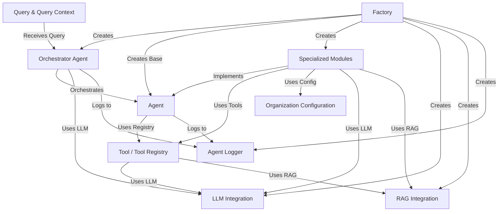

## Chapters

1. [Query & Query Context](#chapter-1-query--query-context)
2. [Orchestrator Agent](#chapter-2-orchestrator-agent)
3. [Agent](#chapter-3-agent)
4. [Specialized Modules](#chapter-4-specialized-modules)
5. [Tool / Tool Registry](#chapter-5-tool--tool-registry)
6. [LLM Integration](#chapter-6-llm-integration)
7. [RAG Integration](#chapter-7-rag-integration)
8. [Organization Configuration](#chapter-8-organization-configuration)
9. [Agent Logger](#chapter-9-agent-logger)
10. [Factory](#chapter-10-factory)

---

# Chapter 1: Query & Query Context

Welcome to the RegulAIte tutorial! This is the very first step in understanding how this powerful framework helps build intelligent systems that can understand and respond to complex requests.

Imagine you're talking to a super-smart assistant. When you ask it something, it doesn't just hear the words you say *right now*. It also remembers who you are, what you've talked about before in this conversation, maybe even your preferences or current situation. All of this extra information helps it understand your *current* question much better.

In RegulAIte, we have two core ideas to capture this: the **Query** and the **Query Context**.

## What's the Problem?

If you were building a simple command-line tool, you might just take the user's typed input and process it. Like `process "analyze this document"`. But what if the user types `analyze it` right after? The system needs to know what "it" refers to. What if they previously uploaded a document? What if they said "analyze this document, I uploaded it 5 minutes ago and it's about GDPR compliance"? The raw text `analyze it` is not enough.

To build helpful, conversational, and context-aware AI systems, we need more than just the user's immediate words. We need the full picture.

## Meet the Query and Query Context

RegulAIte solves this by separating the immediate request from all the background information.

1.  **The Query:** Think of this as the specific question or command the user is giving *at this moment*. It's the core of their request. For example, if the user types "What are the main risks?", the Query is "What are the main risks?".

2.  **The Query Context:** This is like the "background memo" attached to the Query. It holds everything the system needs to know to understand the Query properly. This includes things like:
    *   A unique ID for the current conversation session.
    *   When the query was made (timestamp).
    *   Who the user is (user ID).
    *   Maybe even a history of previous questions and answers in this session.
    *   Other relevant details (metadata).

Let's use our assistant analogy again:

*   **Query:** "Summarize *that*."
*   **Query Context:** "The user is Sarah (user ID), she's in session #XYZ, the time is now. In the previous turn, she asked me to find document 'Report_Q3.pdf'. 'That' likely refers to 'Report_Q3.pdf'."

Without the Context, the system would have no idea what "that" means. With the Context, it understands perfectly.

## How RegulAIte Uses Query and Query Context

When a user interacts with a RegulAIte-based system (like typing into a chat interface), the first thing that happens is that the system packages their input into a `Query` object and gathers all the relevant background information into a `QueryContext` object. These two objects are then bundled together and passed along to the parts of the system (the [Agents](#chapter-3-agent), which we'll talk about later) that will actually process the request.

Here’s a simplified look at what's happening:

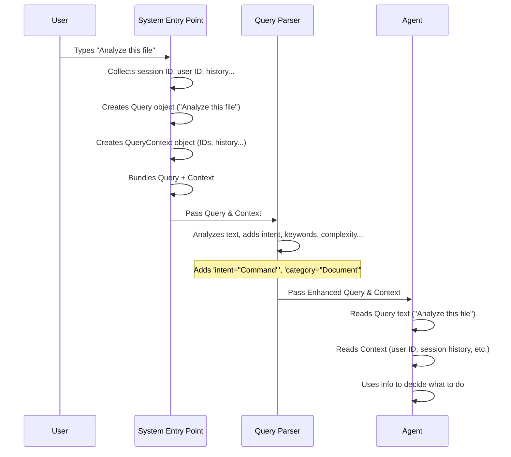

This diagram shows that the raw user input is the starting point, but it's quickly enriched by the system into the `Query` and `QueryContext` objects before any real processing happens.

## Looking at the Code (Simplified)

The `Query` and `QueryContext` are defined using Python Pydantic models. Pydantic helps ensure that these objects always have the right kind of information inside them.

Let's look at simplified versions of the code defining these objects (from `backend/agent_framework/agent.py`).

First, the `QueryContext`:

```python
# backend/agent_framework/agent.py (simplified)
from typing import Dict, List, Optional, Any
from pydantic import BaseModel, Field
import uuid # To generate unique IDs
from datetime import datetime # For timestamps

class QueryContext(BaseModel):
    """Context information about a query."""
    session_id: str = Field(default_factory=lambda: str(uuid.uuid4()))
    timestamp: str = Field(default_factory=lambda: datetime.now().isoformat())
    user_id: Optional[str] = None # User ID might be optional
    previous_interactions: Optional[List[Dict[str, Any]]] = None # List of past messages/responses
    metadata: Dict[str, Any] = Field(default_factory=dict) # Flexible place for other data

    # ... potentially more fields for complex features (like iteration context)
    # The actual code has more fields like iteration_count, previous_findings, etc.

```

This code snippet shows the core fields of the `QueryContext`. `session_id` and `timestamp` are automatically generated if not provided. `user_id`, `previous_interactions`, and `metadata` allow the system to carry crucial context throughout the conversation.

Now, let's look at the `Query` itself:

```python
# backend/agent_framework/agent.py (simplified)
from pydantic import BaseModel, Field
from enum import Enum

class IntentType(str, Enum):
    """Types of user query intents."""
    QUESTION = "question"
    COMMAND = "command"
    CLARIFICATION = "clarification"
    UNKNOWN = "unknown"

class Query(BaseModel):
    """Incoming user query with metadata."""
    query_text: str = Field(..., description="The raw query text from the user") # The user's words
    intent: IntentType = Field(default=IntentType.UNKNOWN) # What the user wants to do
    context: QueryContext = Field(default_factory=QueryContext) # The background info!
    parameters: Dict[str, Any] = Field(default_factory=dict) # Any specific options in the query

    # ... potentially more fields for complex features (like iteration mode, focus areas)
    # The actual code has more fields like iteration_mode, focus_areas, etc.

    # There's also a validator to try and guess the intent if not provided.

```

Here, the `Query` model clearly includes `query_text` (the user's raw input) and, importantly, a `context` field which is an instance of our `QueryContext` model. It also has fields like `intent` and `parameters` that might be extracted by the [Query Parser](backend/agent_framework/query_parser.py) (another component we'll discuss later) to add more structure to the user's request.

You can see these objects being used in other parts of the framework, like the `ChatIntegration` (`backend/agent_framework/integrations/chat_integration.py`) when it receives a request:

```python
# backend/agent_framework/integrations/chat_integration.py (simplified)
# ... imports ...
from ..agent import Query, AgentResponse, QueryContext # Import our models

class ChatIntegration:
    # ... __init__ ...

    async def process_chat_request(self, request_data: Dict[str, Any], ...) -> Dict[str, Any]:
        # ... extract user_message and session_id from request_data ...

        # Create query context
        query_context = QueryContext(
            session_id=session_id,
            metadata={"previous_messages": messages[:-1] if len(messages) > 1 else []}
        )

        # Create the query
        query = Query(
            query_text=user_message,
            context=query_context, # Link the context here!
            # ... other fields like iteration_mode might be set here ...
        )

        # Pass the query object (which includes the context) to the agent
        agent_response = await agent.process_query(query)

        # ... process agent_response ...
        return {
            "message": agent_response.content,
            # ... other response data ...
            "session_id": session_id,
            # ...
        }
```

This snippet from `ChatIntegration` shows how the system takes the incoming `request_data`, creates the `QueryContext` using information like the `session_id` and past messages, then creates the `Query` object by combining the user's `user_message` and the newly created `query_context`. This bundled `query` object is what gets passed to the `agent.process_query()` method.

## Why is this important?

By explicitly defining the `Query` and `QueryContext` as structured objects, RegulAIte ensures that all the necessary information for understanding and responding to a user's request is readily available to the different parts of the system, especially the [Agents](#chapter-3-agent) that perform the actual work. This makes the system more robust, easier to develop, and allows for more sophisticated behaviors like remembering conversation history or adapting based on user identity. It's the foundation for building truly intelligent and context-aware applications.

## Conclusion

In this chapter, we learned that a user's request isn't just the words they type. RegulAIte uses the `Query` object to represent the immediate request and the `QueryContext` object to hold all the crucial background information like session ID, user ID, and history. Together, these provide the complete picture needed for the system to understand and process the request accurately.

Now that we understand how user requests are structured, let's look at the component responsible for taking these structured requests and figuring out what needs to happen next: the [Orchestrator Agent](#chapter-2-orchestrator-agent).

# Chapter 2: Orchestrator Agent

Welcome back to the RegulAIte tutorial! In the [previous chapter](#chapter-1-query--query-context), we learned how RegulAIte takes your request and its background information and packages it neatly into the `Query` and `QueryContext` objects. Now that we know *what* the user is asking, the next crucial step is figuring out *how* to answer it. This is where the **Orchestrator Agent** comes in.

## What's the Problem?

Imagine you ask a sophisticated question like: "Analyze the cybersecurity risks associated with our new cloud provider based on the latest internal security policies and verify our compliance against the GDPR requirements for data processing."

This isn't a simple lookup. To answer this completely, the system needs to:
1.  Understand the specific goals: analyze risk, check compliance.
2.  Identify the relevant areas: cloud provider, security policies, GDPR, data processing.
3.  Find necessary documents: the new cloud provider details, internal security policies, GDPR text, possibly past risk assessments or compliance reports.
4.  Analyze the risks based on the documents and context.
5.  Analyze the GDPR compliance based on the documents and context.
6.  Combine the findings from both the risk analysis and compliance analysis.
7.  Present a unified, coherent answer that addresses all parts of the original question.

Doing all of this requires coordinating multiple different "expert" systems or components. How do you manage this complex process automatically?

## Meet the Orchestrator Agent

In RegulAIte, the **Orchestrator Agent** is the mastermind behind this complex coordination. Think of it as the **Project Manager** or **Team Leader** of your AI system.

Its main job is to take the user's `Query` and `QueryContext` and figure out the best way to get the job done. It doesn't necessarily do the detailed analysis itself; instead, it directs other, more specialized components.

Here's what the Orchestrator Agent does:

*   **Understands the Request:** It looks at the `Query` and `QueryContext` to determine the user's intent and the type of analysis needed (like GRC - Governance, Risk, Compliance, or a mix).
*   **Plans the Work:** Based on its understanding, it creates a plan. This involves deciding which specialized [Agents](#chapter-3-agent) (like a Risk Agent or a Compliance Agent) and which [Tools](#chapter-5-tool--tool-registry) (like a Document Finder) are required.
*   **Delegates Tasks:** It assigns specific parts of the overall request as tasks to the appropriate specialized [Agents](#chapter-3-agent).
*   **Manages Execution:** It oversees the process, making sure tasks are done in the right order (if needed) and handling the flow of information between agents.
*   **Iterates (if necessary):** If the initial analysis isn't sufficient or reveals missing information, the Orchestrator can decide to perform additional steps or iterations, potentially reformulating the original request internally to gather more context.
*   **Synthesizes Results:** Once the specialized agents have completed their tasks, the Orchestrator collects all their findings and combines them into a single, final, comprehensive response for the user.

Essentially, the Orchestrator takes the user's big, complex problem and manages a team of experts to solve it, providing a single, clear answer at the end.

## How the Orchestrator Works: A Simple Flow

Let's look at a simplified view of how the Orchestrator processes a request:

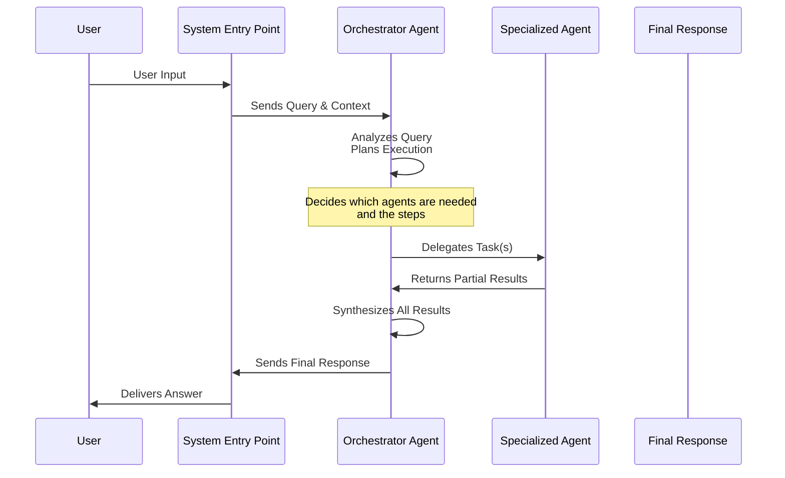

This diagram shows that the Orchestrator is at the center. It receives the initial request (as `Query` and `QueryContext`), decides who does what, gathers the results, and builds the final answer before sending it back to the user via the System Entry Point (like your chat interface).

## The Orchestrator's Core Tasks

The Orchestrator breaks down its job into several key steps, often involving calling other parts of the system or using its internal logic (often powered by an LLM for complex reasoning).

1.  **Query Analysis & Planning:** The Orchestrator first analyzes the `Query` text and `QueryContext` (from Chapter 1). It uses this to figure out the user's goal (e.g., Risk Assessment, Compliance Check) and creates a plan. This plan lists the specialized [Agents](#chapter-3-agent) needed and the steps they should take. The code uses a method like `_analyze_request` for this, often asking a powerful LLM to interpret the user's complex request and output a structured plan (like the JSON plan seen in the code's Orchestrator definition).

    *Simplified Code Idea:*
    ```python
    # Inside OrchestratorAgent class
    async def _analyze_request(self, user_query: str) -> Dict[str, Any]:
        # This method uses the LLM to understand the query
        # and propose a plan.
        analysis_prompt = f"""
        Analyze this user request and create an action plan...
        DEMANDE: "{user_query}"
        Respond in JSON format:
        {{
            "agents_required": [...],
            "execution_sequence": [...]
        }}
        """
        # ... send prompt to LLM ...
        # ... parse LLM response into a dictionary ...
        return parsed_plan # e.g., {"agents_required": ["risk_assessment", "document_finder"], ...}
    ```
    *Explanation:* The `_analyze_request` method is crucial. It takes the user's query and sends it to an LLM with instructions on how to break it down and plan the necessary steps and required agents. The LLM's response is then parsed into a structured dictionary that guides the subsequent execution.

2.  **Execution & Delegation:** Once the plan is ready, the Orchestrator executes it. It loops through the planned steps, calling the relevant specialized [Agents](#chapter-3-agent) for each task. When calling an agent, it provides a focused version of the original request, along with the `QueryContext` and any specific parameters or intermediate results needed by that specialized agent. This is handled by a method like `_execute_plan_with_iteration`.

    *Simplified Code Idea:*
    ```python
    # Inside OrchestratorAgent class
    async def _execute_plan_with_iteration(self, analysis_plan: Dict[str, Any], original_query: Query, iteration_context: IterationContext) -> Dict[str, Any]:
        results = {"agent_results": {}, "all_sources": []}
        # ... get execution steps from analysis_plan ...

        for step in analysis_plan.get("execution_sequence", []):
            agent_id = step.get("agent")
            # ... prepare enriched query for the specific agent ...
            enriched_query = Query(
                 query_text=original_query.query_text,
                 context=original_query.context, # Pass original context
                 parameters={
                     "specific_objective": step.get("action"),
                     # Add relevant context/parameters for this step
                     "previous_findings": iteration_context.knowledge_gained
                 }
             )

            # Find and call the specialized agent
            if agent_id in self.specialized_agents:
                 agent_response = await self.specialized_agents[agent_id].process_query(enriched_query)
                 results["agent_results"][agent_id] = agent_response.content
                 results["all_sources"].extend(agent_response.sources) # Collect sources
                 # ... extract new knowledge from response ...
            else:
                 # Handle missing agent
                 pass
        return results
    ```
    *Explanation:* The `_execute_plan_with_iteration` method iterates through the steps defined in the plan. For each step, it creates an `enriched_query` specifically tailored for the targeted specialized agent, including the original `Query` and `QueryContext`, plus any specific instructions or gathered information from previous steps. It then calls the `process_query` method of the relevant specialized agent and collects the results.

3.  **Iteration & Gap Identification:** After executing a step or sequence of steps, the Orchestrator might evaluate the results. If the results aren't complete, if there are contradictions, or if key information is still missing (identifying "context gaps"), it can decide to perform another round (an "iteration"). It might even reformulate the original request internally to specifically target the missing information in the next iteration. This is managed using an `IterationContext` and methods like `_identify_context_gaps` and `_reformulate_query`. This makes the Orchestrator highly capable of handling ambiguous or complex queries that require multiple passes.

    *Simplified Code Idea:*
    ```python
    # Inside OrchestratorAgent class
    # ... in process_query method ...
    iteration_context = IterationContext()
    while iteration_context.should_continue_iteration():
         # ... execute the plan ...
         execution_results = await self._execute_plan_with_iteration(...)

         # Check if more info is needed
         context_gaps = await self._identify_context_gaps(..., execution_results, iteration_context)

         if context_gaps:
             iteration_context.add_iteration(..., execution_results, context_gaps)
             # Decide if a new query formulation is needed
             reformulated_query = await self._reformulate_query(..., context_gaps, iteration_context)
             if reformulated_query:
                 original_query.query_text = reformulated_query # Update query for next iteration
             else:
                 break # Cannot reformulate, stop iterating
         else:
             break # No gaps, stop iterating
    # ... continue to final synthesis ...
    ```
    *Explanation:* The `process_query` method uses a `while` loop guided by the `iteration_context`. After executing a step, it checks for `context_gaps` using `_identify_context_gaps`. If gaps are found and the maximum iterations haven't been reached (`should_continue_iteration`), it adds the current results to the `iteration_context` and potentially calls `_reformulate_query` to create a better query for the next loop iteration, aiming to fill those gaps.

4.  **Synthesis:** Finally, after completing all necessary iterations, the Orchestrator gathers all the results from the specialized agents across all iterations and synthesizes them into a single, coherent, and comprehensive response. This involves structuring the information logically and presenting it clearly to the user, often including references to the sources found. This is handled by a method like `_synthesize_iterative_results`.

    *Simplified Code Idea:*
    ```python
    # Inside OrchestratorAgent class
    async def _synthesize_iterative_results(self, original_query_text: str, iteration_context: IterationContext) -> str:
        # This method takes all the results gathered
        # during all iterations and combines them
        # into a final answer.
        synthesis_prompt = f"""
        Synthesize the results from {iteration_context.iteration_count} iterations...
        DEMANDE ORIGINALE: "{original_query_text}"
        ALL RESULTS: {iteration_context.previous_results}
        KNOWLEDGE GAINED: {iteration_context.knowledge_gained}
        ...
        """
        # ... send prompt to LLM ...
        final_answer = await self.llm_client.generate_response(...)
        # ... optionally format with sources etc. ...
        return final_answer
    ```
    *Explanation:* The `_synthesize_iterative_results` method receives the history of the entire process via the `iteration_context`. It constructs a detailed prompt for the LLM, including the original query, the number of iterations, the knowledge gained, and all the results from the specialized agents. The LLM is then tasked with combining all this information into a structured, final answer.

## Orchestrator in the Code

Let's look at some simplified code snippets from `backend/agent_framework/orchestrator.py` to see how this is structured.

First, the class definition shows it inherits from `Agent` (more on that in the [next chapter](#chapter-3-agent)) and holds references to the `llm_client` and the `specialized_agents` it needs to coordinate.

```python
# backend/agent_framework/orchestrator.py (simplified)
import logging
from typing import Dict, List, Optional, Any, Union

from .agent import Agent, AgentResponse, Query, QueryContext
from .integrations.llm_integration import LLMIntegration # Used for analysis/synthesis

logger = logging.getLogger(__name__)

class OrchestratorAgent(Agent):
    """
    Main orchestrator agent coordinating specialized agents.
    Handles query analysis, planning, execution, iteration, and synthesis.
    """
    
    def __init__(self, llm_client: LLMIntegration, log_callback=None):
        super().__init__(
            agent_id="orchestrator",
            name="Orchestrateur Principal GRC Itératif" # Name indicates its role
        )
        
        self.llm_client = llm_client # The brain for planning/synthesis
        self.specialized_agents: Dict[str, Agent] = {} # Holds the team of experts
        self.agent_logger = None # For detailed logs of the process
        self.log_callback = log_callback # How to send logs out

        # ... system prompt and other setup ...

    def register_agent(self, agent_id: str, agent: Agent):
        """Register a specialized agent with the orchestrator."""
        self.specialized_agents[agent_id] = agent
        logger.info(f"Agent {agent_id} registered in the orchestrator")

    # ... other methods like debug_agent_status ...
```
*Explanation:* The `OrchestratorAgent` is defined, inheriting basic agent capabilities. It's initialized with an `llm_client` (essential for its planning and synthesis tasks) and has a dictionary `specialized_agents` to keep track of the different expert agents it can call upon. The `register_agent` method is how other parts of the system (like the [Factory](#chapter-10-factory)) add specialized agents to the Orchestrator's team.

Next, the main `process_query` method shows the high-level flow, receiving the `Query` object from the previous layer:

```python
# backend/agent_framework/orchestrator.py (simplified process_query)
# ... other imports and class definition ...

    async def process_query(self, query: Union[str, Query]) -> AgentResponse:
        """
        Process a user query and orchestrate specialized agents iteratively.
        """
        if isinstance(query, str):
            query = Query(query_text=query) # Ensure it's a Query object

        # Initialize logger for this session
        self.agent_logger = AgentLogger(session_id=query.context.session_id, callback=self.log_callback)

        logger.info(f"Orchestrator - Starting iterative analysis for: {query.query_text}")

        iteration_context = IterationContext() # Manages iteration state

        # Initial Analysis & Planning
        analysis_result = await self._analyze_request(query.query_text)
        # Log query analysis...

        # Iteration Loop
        while iteration_context.should_continue_iteration():
            # Log iteration start...
            
            # Execute the planned steps
            execution_results = await self._execute_plan_with_iteration(
                analysis_result, query, iteration_context
            )
            # Log execution results...

            # Identify gaps needing more info
            context_gaps = await self._identify_context_gaps(
                query.query_text, analysis_result, execution_results, iteration_context
            )
            # Log gap analysis...

            # Add results and gaps to the iteration context
            iteration_context.add_iteration(
                query.query_text, execution_results, context_gaps
            )

            # If gaps, reformulate query for next iteration
            if context_gaps and iteration_context.should_continue_iteration():
                reformulated_query = await self._reformulate_query(
                    query.query_text, context_gaps, iteration_context
                )
                if reformulated_query:
                    query.query_text = reformulated_query # Update query
                    logger.info(f"Query reformulated: {reformulated_query}")
                else:
                    break # Stop if reformulation fails
            else:
                break # Stop if no gaps

        # Final Synthesis
        final_response_content = await self._synthesize_iterative_results(
            query.query_text, analysis_result, iteration_context
        )
        # Log synthesis...

        # Aggregate sources from all iterations
        all_sources = self._aggregate_all_sources(iteration_context)

        # Return the final response
        return AgentResponse(
            content=final_response_content,
            tools_used=[], # Orchestrator doesn't use tools directly, agents do
            context_used=True,
            sources=all_sources,
            metadata={
                # ... include iteration summary, logs, etc. ...
                "total_iterations": iteration_context.iteration_count,
                "agents_involved": self._get_all_agents_used(iteration_context),
                "iteration_summary": iteration_context.get_iteration_summary()
            }
        )
```
*Explanation:* The `process_query` method is the main entry point. It receives the `query` object (which includes the `QueryContext`). It initializes an `IterationContext` to track the progress. The core logic is a `while` loop that continues as long as the `iteration_context` indicates more work is needed (`should_continue_iteration`). Inside the loop, it calls the internal methods `_execute_plan_with_iteration` to run the planned steps, `_identify_context_gaps` to check if anything is missing, and potentially `_reformulate_query` to adjust the approach for the next iteration. Finally, it calls `_synthesize_iterative_results` to combine everything and returns an `AgentResponse`.

## Why is this important?

The Orchestrator Agent is the brain and coordinator of the RegulAIte system. It elevates the system beyond simple request-response by enabling:

*   **Handling Complexity:** It can break down and manage sophisticated user requests that require multiple steps and different types of analysis.
*   **Flexibility:** It can dynamically decide which agents and tools are needed based on the specific query.
*   **Robustness:** Its iterative nature allows it to potentially recover from initial incomplete results by seeking more information or refining its approach.
*   **Efficiency:** By delegating tasks to specialized agents, it leverages the specific expertise of each component.
*   **Transparency:** With detailed logging (managed by the `agent_logger`), you can see exactly how the Orchestrator analyzed the query, what plan it created, which agents were called, and what happened during each iteration.

Without the Orchestrator, the system would struggle to handle anything beyond basic, single-step requests. It's what makes RegulAIte capable of tackling complex GRC analysis workflows.

## Conclusion

In this chapter, we learned about the Orchestrator Agent, the central project manager of the RegulAIte system. It takes the `Query` and `QueryContext`, plans the necessary steps, delegates tasks to specialized agents, manages iterations to refine the analysis, and synthesizes all the findings into a final answer. It's the core component that enables RegulAIte to handle complex, multi-step requests effectively.

Now that we understand the central coordinator, let's zoom in on the team members it directs: the specialized [Agents](#chapter-3-agent).

# Chapter 3: Agent

Welcome back! In the [previous chapter](#chapter-2-orchestrator-agent), we met the Orchestrator Agent, the central project manager of the RegulAIte system. It takes complex requests, breaks them down, and delegates tasks. But who are the "workers" that actually perform these specific tasks?

That's where the **Agent** concept comes in. Agents are the fundamental building blocks – the specialized team members the Orchestrator calls upon.

## What's the Problem?

Imagine you're building a system to handle various GRC (Governance, Risk, Compliance) tasks. You might need to:
*   Analyze a document for cybersecurity risks.
*   Check if a policy complies with GDPR.
*   Find specific information within a large set of documents.
*   Compare controls from two different frameworks.

These are very different tasks, requiring different expertise and processes. If you tried to put all this logic into one giant piece of code, it would quickly become messy, hard to manage, and difficult to update.

We need a way to modularize these capabilities – to create distinct components, each specialized in a particular domain or type of analysis.

## Meet the Agent: The Specialized Worker

In RegulAIte, an **Agent** is designed to be one of these specialized components. Think of an Agent as an expert in a particular area, ready to perform specific tasks when requested.

Each Agent is essentially a wrapper around a piece of business logic or a specialized capability. It provides a standard interface for receiving instructions ([Queries](#chapter-1-query--query-context)) and producing results (`AgentResponse`).

Here are the key ideas about an Agent:

*   **Specialized:** Each Agent focuses on a particular domain (like risk, compliance, or document search) or a specific type of task.
*   **Task-Oriented:** An Agent is designed to perform one or more related tasks effectively.
*   **Receives Queries:** It takes a `Query` object (which includes the `QueryContext` from Chapter 1) as input. This gives it the request details and all necessary background information.
*   **Uses Tools (Optional but Common):** Agents often need to interact with external systems or perform specific actions, like searching a document database or calling an LLM. They do this by using [Tools](#chapter-5-tool--tool-registry).
*   **Generates Responses:** After processing the query and using any necessary tools, the Agent produces an `AgentResponse` object containing the results.

Going back to our analogy:
*   The **Orchestrator** is the Project Manager who decides *what* needs to be done and *who* should do it.
*   An **Agent** is a specialized worker (e.g., a "Risk Analyst Agent," a "Compliance Auditor Agent," a "Document Search Agent") who receives a specific task from the Orchestrator and carries it out.

## How a Simple Agent Processes a Query

Let's visualize a very basic scenario where an Agent handles a request directly (without the Orchestrator coordinating multiple steps for simplicity). Imagine a "Document Finder Agent" that just needs to find documents based on a query.

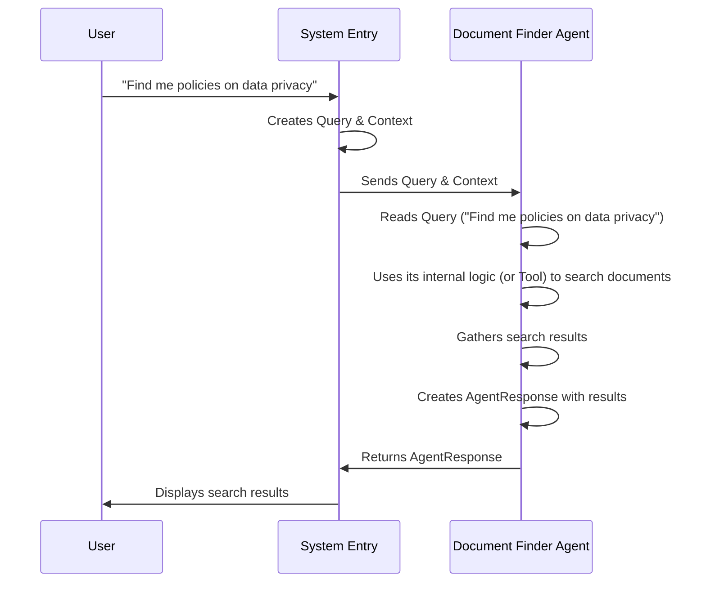

This simple diagram shows the Agent receiving the `Query` (which includes the user's text and the `Context`), doing its specific job (document finding), and returning the result packaged in an `AgentResponse`.

## Agents in the Code

The `Agent` is defined as a base class in `backend/agent_framework/agent.py`. Other specialized agents inherit from this base class and implement their specific logic.

Let's look at the core `Agent` class structure:

```python
# backend/agent_framework/agent.py (simplified)
import logging
from typing import Dict, List, Optional, Any, Union, Callable
# ... imports for Pydantic, uuid, datetime ...

# Import our context/query models from the same file
from .agent import Query, AgentResponse, QueryContext # This is simplified, Query/Context/Response are above Agent class

# IterativeCapability mixin provides iterative features
class IterativeCapability:
    # ... methods for assessing context, suggesting reformulations, accumulating knowledge ...
    pass

class Agent(IterativeCapability):
    """
    Core Agent class for orchestrating query processing with iterative capabilities.
    """

    def __init__(self, agent_id: str, name: str, tools: Optional[Dict[str, Callable]] = None):
        """
        Initialize the agent with its identity and tools.
        """
        super().__init__()  # Initialize iterative capabilities
        self.agent_id = agent_id # Unique ID
        self.name = name # Human-readable name
        self.tools = tools or {} # Tools available to this agent
        self.logger = logging.getLogger(f"agent.{agent_id}") # Agent-specific logger

        # ... iterative configuration (max_iterations, etc.) ...

    async def process_query(self, query: Union[str, Query]) -> AgentResponse:
        """
        Process a user query and generate a response.
        """
        # Ensure query is a Query object
        if isinstance(query, str):
            query = Query(query_text=query)

        self.logger.info(f"Agent {self.agent_id} processing query: {query.query_text}")

        # Determine processing mode (single pass or iterative)
        if query.iteration_mode != IterationMode.SINGLE_PASS: # IterationMode enum from the same file
             # Handle iterative processing (more complex, often involves LLM calls, tool use, state management)
             response = await self._process_iterative_query(query, ...) # Simplified call
        else:
             # Handle simple single-pass processing
             response = await self._process_single_query(query, ...) # Simplified call

        return response

    async def _process_single_query(self, query: Query, ...) -> AgentResponse:
        """
        Basic processing logic for a single-pass query.
        This method is often overridden by specialized agents.
        """
        # Default simple response
        response_content = f"Hello! I am {self.name} ({self.agent_id}). You asked: '{query.query_text}'. I am not configured for complex analysis in single-pass mode."
        return AgentResponse(content=response_content, context_used=True)

    # ... other methods like _process_iterative_query, execute_tool, etc. ...
```
*Explanation:*
*   The `Agent` class inherits from `IterativeCapability`, meaning it has built-in potential for handling iterative tasks (though the Orchestrator manages iteration *between* agents).
*   The `__init__` method gives each agent a unique `agent_id`, a friendly `name`, and a dictionary of `tools` it can use.
*   The core method is `process_query`. This is the standard way the Orchestrator (or any other component) interacts with an Agent. It takes a `Query` object.
*   Inside `process_query`, it checks the `iteration_mode` from the `Query` context.
*   It then calls either `_process_single_query` (for simple, non-iterative requests) or `_process_iterative_query` (for requests requiring more depth or multiple steps *within* the agent, which is more advanced).
*   The `_process_single_query` method is a placeholder. Specialized agents override this (and `_process_iterative_query`) to implement their specific logic.

## The AgentResponse

When an Agent finishes its work, it returns its findings packaged neatly in an `AgentResponse` object. This provides a standard format for agents to communicate their results back.

```python
# backend/agent_framework/agent.py (simplified)
from pydantic import BaseModel, Field
from typing import Dict, List, Optional, Any
# ... imports ...

class AgentResponse(BaseModel):
    """Response from the agent with iterative support."""
    response_id: str = Field(default_factory=lambda: str(uuid.uuid4()))
    content: str = Field(..., description="The main textual response") # The agent's answer
    tools_used: List[str] = Field(default_factory=list) # Which tools did it use?
    context_used: bool = False # Did it use the provided context?
    sources: List[Any] = Field(default_factory=list) # Any sources found (like documents)
    confidence: float = 1.0 # How confident is the agent?
    thinking: Optional[str] = None # Optional internal thinking process (useful for debugging)
    metadata: Dict[str, Any] = Field(default_factory=dict) # Flexible place for other data

    # ... fields related to iterative response (requires_iteration, context_gaps, etc.) ...

    @model_validator(mode='after')
    def clean_sources(self):
       # ... validation logic for sources ...
       return self
```
*Explanation:*
*   `content`: This is the main result, usually a piece of text summarizing the agent's findings or providing the answer to the specific task it was given.
*   `tools_used`: Lists the IDs of any [Tools](#chapter-5-tool--tool-registry) the agent used during processing.
*   `sources`: If the agent used tools that retrieve information (like the Document Finder), this list will contain the sources (e.g., documents or document chunks) that were used. This is crucial for transparency (showing *where* the information came from).
*   `confidence`: An optional score indicating how confident the agent is in its response.
*   `metadata`: A flexible dictionary to include any other relevant information about the response or the processing that occurred.

## Creating Specialized Agents

To create a new specialized agent in RegulAIte, you typically:
1.  Create a new Python class that inherits from `Agent`.
2.  In the `__init__` method, give it a unique `agent_id` and `name`, and potentially provide it with specific [Tools](#chapter-5-tool--tool-registry) it needs.
3.  Override the `_process_single_query` and/or `_process_iterative_query` methods to implement the agent's specialized logic. This is where the agent analyzes the `Query`, potentially calls its `execute_tool` method to use its available tools, and constructs the `AgentResponse`.

For example, a simplified `ComplianceAgent` might look something like this (this is just an illustrative example, not the full code):

```python
# backend/agent_framework/modules/compliance_analysis_module.py (conceptual simplification)
# ... imports ...
from ..agent import Agent, AgentResponse, Query # Import from the core agent file
# ... import tools it might need ...

class ComplianceAnalysisAgent(Agent):
    def __init__(self, llm_client, document_finder_tool):
        super().__init__(
            agent_id="compliance_analysis",
            name="Compliance Analysis Agent",
            tools={"document_finder": document_finder_tool} # Provide the tool
        )
        self.llm_client = llm_client # Often agents need LLMs too

    async def _process_single_query(self, query: Query, ...) -> AgentResponse:
        self.logger.info(f"Compliance Agent processing: {query.query_text}")

        # 1. Use a tool to find relevant documents
        find_docs_result = await self.execute_tool(
            "document_finder",
            query=query.query_text + " compliance requirements", # Enhance query for tool
            # ... other parameters like frameworks from query.parameters ...
        )

        relevant_documents = find_docs_result.result # Get results from the ToolResult

        # 2. Use LLM (or other logic) to analyze documents for compliance
        analysis_prompt = f"""
        Analyze these documents for compliance with {query.parameters.get('framework', 'relevant frameworks')}:
        {relevant_documents}

        Query: {query.query_text}
        """
        compliance_findings = await self.llm_client.generate(analysis_prompt)

        # 3. Construct the AgentResponse
        response_content = f"Based on my analysis and the documents found, here are the compliance findings:\n{compliance_findings}"
        sources = self.format_documents_as_sources(relevant_documents) # Method inherited from Agent base

        return AgentResponse(
            content=response_content,
            tools_used=["document_finder"],
            context_used=query.context_used, # Use context flag from input query
            sources=sources,
            confidence=0.9 # Example confidence
            # ... other fields ...
        )

    # _process_iterative_query would be more complex...
```
*Explanation:*
*   `ComplianceAnalysisAgent` inherits from `Agent`.
*   Its `__init__` takes specific dependencies like an `llm_client` and a `document_finder_tool` and registers the tool.
*   It overrides `_process_single_query`. Inside this method, it uses `self.execute_tool` to call the `document_finder` tool.
*   It then uses its `llm_client` to process the retrieved documents and the original query.
*   Finally, it creates an `AgentResponse` with the findings (`content`), the tools used, and the sources found.

This demonstrates how a specialized Agent encapsulates specific logic and uses its available tools to fulfill its part of a request.

## Why is this Important?

Having a clear `Agent` abstraction is vital because it provides:

*   **Modularity:** Breaks down complex systems into smaller, manageable pieces.
*   **Specialization:** Each Agent can be highly optimized for its specific domain or task.
*   **Reusability:** Agents can potentially be reused in different workflows or for different types of queries.
*   **Maintainability:** Easier to update or replace a single specialized Agent without affecting the whole system.
*   **Collaboration:** Provides a standard interface (`process_query`, `AgentResponse`) that allows the Orchestrator (or other agents) to easily interact with and receive results from any specialized Agent.

While the base `Agent` class in `agent.py` includes features for internal iteration (`IterativeCapability`, `_process_iterative_query`), for simpler cases or when the Orchestrator is managing the overall flow, a specialized agent might just implement the `_process_single_query` method or use the iterative features locally to refine *its own* specific subtask (like analyzing a single document in depth).

## Conclusion

In this chapter, we explored the Agent, the core building block and specialized worker within the RegulAIte framework. We learned that Agents receive [Queries & Query Context](#chapter-1-query--query-context), perform specific tasks potentially using [Tools](#chapter-5-tool--tool-registry), and return their results in a standard `AgentResponse` format. This modular design allows the system to handle diverse and complex tasks by assigning them to the appropriate experts (Agents).

Now that we understand the fundamental Agent, let's look at how several Agents can be grouped or categorized into [Specialized Modules](#chapter-4-specialized-modules) focusing on specific domains like Risk, Compliance, or Governance.

# Chapter 4: Specialized Modules

Welcome back to the RegulAIte tutorial! In the [previous chapter](#chapter-3-agent), we learned about the Agent, the fundamental building block and specialized worker that performs specific tasks. We saw how an Agent receives a request ([Query & Query Context](#chapter-1-query--query-context)), potentially uses [Tools](#chapter-5-tool--tool-registry), and returns a result (`AgentResponse`).

Now, imagine you have many different types of expert Agents: a Risk Analyst Agent, a Compliance Auditor Agent, a Data Privacy Expert Agent, maybe even a Security Expert Agent. While the [Orchestrator Agent](#chapter-2-orchestrator-agent) (Chapter 2) is great at coordinating these individual experts, the system needs a clear way to organize them and ensure they have the specific knowledge and capabilities required for their area of expertise.

This is where the concept of **Specialized Modules** comes in.

## What's the Problem?

Building on our previous example, if a user asks a question about "GDPR compliance risks for cloud processing," this request touches on multiple domains: Risk, Compliance, and perhaps specific technical aspects of Cloud Security.

To answer this well, the system needs experts who understand:
*   **Compliance:** What are the specific GDPR requirements? What does "processing" mean under GDPR?
*   **Risk:** What are the typical cybersecurity risks for cloud services? How likely are they? What could the impact be?
*   **Technical:** What specific cloud processing activities are being done? What security measures are already in place?

We could have individual [Agents](#chapter-3-agent) for each of these, but their work is tightly related. The Compliance Agent needs to know about Risk factors, and the Risk Agent needs context from Compliance rules. Grouping these related experts and their tools together into dedicated *modules* makes the system much more organized and powerful.

## Meet the Specialized Modules: The Expert Departments

In RegulAIte, **Specialized Modules** are essentially collections of related expertise and logic focused on a specific domain, like Risk Management, Compliance Analysis, Governance, or Gap Analysis.

Think of them as **Expert Departments** within your RegulAIte system.

*   Each module is designed to handle complex analysis within its specific area.
*   They often contain or coordinate the work of one or more specialized [Agents](#chapter-3-agent) that are particularly skilled in that domain.
*   These modules encapsulate the detailed logic, specific knowledge, and sometimes specialized [Tools](#chapter-5-tool--tool-registry) or integrations needed for deep analysis in their domain.
*   They are the "domain experts" that the [Orchestrator Agent](#chapter-2-orchestrator-agent) can call upon to perform sophisticated tasks.

For example, the Compliance Analysis Module would contain all the necessary logic, potentially several specific compliance-related [Agents](#chapter-3-agent), and links to compliance knowledge bases ([RAG Integrations](#chapter-7-rag-integration)) needed to interpret regulations, check policies, or assess compliance status.

## How Specialized Modules Fit In

The Specialized Modules work closely with the [Orchestrator Agent](#chapter-2-orchestrator-agent). When the Orchestrator receives a [Query & Query Context](#chapter-1-query--query-context), it analyzes the request to determine which domain(s) are involved. It then directs the relevant Specialized Module(s) to perform the required tasks.

Here's a simplified flow showing how a Specialized Module fits into the picture:

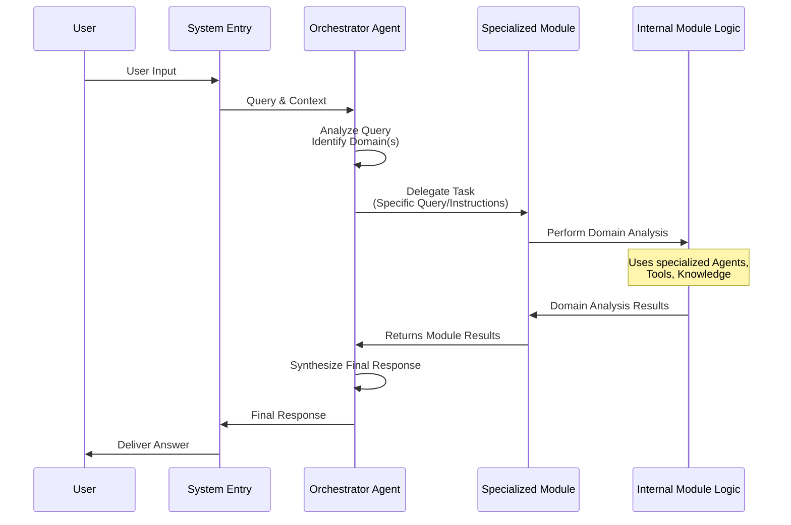

This diagram shows that the Specialized Module acts as an intermediary between the central Orchestrator and the detailed domain-specific work. The Orchestrator asks the "Compliance Department" (the Compliance Analysis Module) to handle the compliance part of the request, and the module uses its internal resources to do so.

## Specialized Modules in the Code

In the `regulaite` project, Specialized Modules are typically implemented as classes that inherit from the base [Agent](#chapter-3-agent) class. This might seem a bit confusing at first – why is a "Module" an "Agent"?

The reason is that each Specialized Module also needs to have a standard way for the [Orchestrator Agent](#chapter-2-orchestrator-agent) to interact with it. By making the Module class inherit from `Agent`, it automatically gets the standard `process_query` method and the ability to return an `AgentResponse`.

So, a "Specialized Module" in the code is often a sophisticated [Agent](#chapter-3-agent) specifically designed to be the entry point and coordinator for a particular domain's analysis.

You can find these modules in the `backend/agent_framework/modules/` directory. Let's look at the `__init__.py` file in that directory to see how they are structured and imported:

```python
# backend/agent_framework/modules/__init__.py (simplified)
# ... imports for other modules ...

# Import specialized modules with error handling
try:
    from .risk_assessment_module import RiskAssessmentModule, get_risk_assessment_module
    RISK_ASSESSMENT_AVAILABLE = True
except ImportError as e:
    print(f"Warning: Could not import RiskAssessmentModule: {e}")
    RISK_ASSESSMENT_AVAILABLE = False

try:
    from .compliance_analysis_module import ComplianceAnalysisModule, get_compliance_analysis_module
    COMPLIANCE_ANALYSIS_AVAILABLE = True
except ImportError as e:
    print(f"Warning: Could not import ComplianceAnalysisModule: {e}")
    COMPLIANCE_ANALYSIS_AVAILABLE = False

# ... similar imports for GovernanceAnalysisModule, GapAnalysisModule, DocumentFinderAgent ...

# Build __all__ dynamically based on available modules
__all__ = [
    # ... other exports ...
]

# Add available modules to __all__
if RISK_ASSESSMENT_AVAILABLE:
    __all__.extend(["RiskAssessmentModule", "get_risk_assessment_module"])

if COMPLIANCE_ANALYSIS_AVAILABLE:
    __all__.extend(["ComplianceAnalysisModule", "get_compliance_analysis_module"])

# ... extend __all__ for other modules ...

```
*Explanation:*
*   The `__init__.py` file acts like an index for the `modules` directory.
*   It imports the main class for each specialized module (like `RiskAssessmentModule`, `ComplianceAnalysisModule`) and their associated factory functions (`get_risk_assessment_module`, etc.). Factory functions are a common way to create instances of these complex objects with their dependencies already set up – we'll talk more about [Factories](#chapter-10-factory) later.
*   It includes error handling (`try...except ImportError`) so the system can still run even if one specific module fails to import (e.g., due to missing dependencies).
*   The `__all__` list defines what gets exported when you do `from backend.agent_framework import modules`.

Now let's look at a simplified structure of one of these module classes, for example, `ComplianceAnalysisModule` (from `backend/agent_framework/modules/compliance_analysis_module.py`):

```python
# backend/agent_framework/modules/compliance_analysis_module.py (simplified structure)
import logging
# ... other imports ...

from ..agent import Agent, AgentResponse, Query # Import base Agent class

logger = logging.getLogger(__name__)

class ComplianceAnalysisModule(Agent):
    """
    Module expert en analyse de conformité avec IA avancée.
    """
    
    def __init__(self, llm_client=None, rag_system=None):
        """
        Initialize the compliance analysis module.
        """
        # Call the parent Agent constructor
        super().__init__(
            agent_id="compliance_analysis", # Unique ID for this module/agent
            name="Expert Analyse de Conformité" # Human-readable name
        )
        
        self.llm_client = llm_client # Often needs LLM
        # ... other specific dependencies like RAG system, specific tools ...
        self.document_finder = DocumentFinder(rag_system=rag_system) # Example specific tool

        # Specific prompts or logic for compliance tasks
        self.system_prompts = {
            "compliance_expert": "Tu es un expert senior en conformité réglementaire..."
        }
        
        # Specific internal logic for compliance analysis
        # self._analyze_documents_for_compliance(...)
        # self._identify_compliance_gaps(...)
        # ...

    async def process_query(self, query: Query) -> AgentResponse:
        """
        Process a compliance-related query.
        This is the main entry point called by the Orchestrator.
        """
        logger.info(f"Compliance Module processing query: {query.query_text}")

        # The module's logic to process the query
        # It might analyze the query, decide on a sub-task (like "assess compliance", "find gaps"),
        # use its internal specific logic or tools, and generate a response.
        
        # Example: Analyze query to find relevant documents using its tool
        relevant_docs_result = await self.document_finder.search_documents(
            query=query.query_text + " compliance requirements",
            limit=5
        )
        
        # Example: Use LLM with specific compliance prompt and docs to analyze
        analysis_prompt = f"""
        Based on these documents, assess compliance for: {query.query_text}
        Documents: {relevant_docs_result}
        """
        compliance_findings_text = await self.llm_client.generate_response(
             messages=[{"role": "system", "content": self.system_prompts["compliance_expert"]},
                       {"role": "user", "content": analysis_prompt}]
        )

        # Construct the AgentResponse
        response_content = f"Here are the compliance findings:\n{compliance_findings_text}"

        return AgentResponse(
            content=response_content,
            tools_used=["document_finder"], # Indicate tools used by the module
            context_used=True, # Indicate context was used
            sources=[s for s in relevant_docs_result if 'title' in s], # Attach sources
            metadata={"module_type": "compliance"}
        )

    # Other internal methods specific to compliance analysis
    # async def _analyze_documents_for_compliance(self, documents, query_context): ...
    # async def _identify_compliance_gaps(self, analysis_results): ...
    # ... and potentially iterative processing logic (_process_iterative_query from Agent base)

```
*Explanation:*
*   The `ComplianceAnalysisModule` class inherits from `Agent`. This means it *is* an Agent, but a highly specialized one.
*   Its `__init__` method initializes its identity (`agent_id`, `name`) and sets up specific dependencies needed for compliance work, like the `llm_client` and a `document_finder` (which itself might be using a [RAG Integration](#chapter-7-rag-integration)).
*   It defines a specific `system_prompt` (`compliance_expert`) tailored for compliance tasks, which it will use when interacting with the LLM.
*   It overrides the `process_query` method. This is where the module's core logic resides. Inside `process_query`, it orchestrates its internal components (like calling the `document_finder` tool and then using the `llm_client` with its specific prompt) to perform the compliance analysis.
*   It returns an `AgentResponse` just like any other Agent, packaging the results, tools used, sources, etc., for the Orchestrator.

The [Orchestrator Agent](#chapter-2-orchestrator-agent) (Chapter 2) is initialized with references to instances of these Specialized Module classes (as seen in the Orchestrator's `__init__` and `register_agent` methods in Chapter 2's code snippet). When the Orchestrator determines a query requires compliance analysis, it simply calls the `process_query` method of the `compliance_analysis` Agent (which is our `ComplianceAnalysisModule` instance).

## Why are Specialized Modules Important?

Grouping domain expertise into Specialized Modules offers significant benefits:

*   **Clear Organization:** It provides a clean structure for the project, separating logic for different GRC domains.
*   **Encapsulation of Expertise:** All the knowledge, logic, specific prompts, and tools needed for a particular domain are kept together within its module.
*   **Maintainability and Scalability:** It's easier to update or improve the compliance logic without affecting the risk analysis module, and you can add new domains by creating new modules.
*   **Focused Development:** Developers working on the compliance module can focus solely on compliance logic, without needing to understand the intricacies of risk assessment or governance.
*   **Enhanced Capabilities:** Because a module is focused, it can implement more sophisticated, domain-specific techniques or pipelines (e.g., specialized data parsing for legal texts within the compliance module).

While technically implemented as specialized [Agents](#chapter-3-agent), viewing them conceptually as "Modules" or "Expert Departments" helps understand their role in the larger system architecture – they are the key components responsible for deep analysis within their respective GRC domains, delegated tasks by the central [Orchestrator Agent](#chapter-2-orchestrator-agent).

## Conclusion

In this chapter, we explored the concept of Specialized Modules. We learned that these are domain-focused components, typically implemented as specialized [Agents](#chapter-3-agent), which encapsulate the expertise and logic required for deep analysis in areas like Risk, Compliance, and Governance. They act as expert departments that the [Orchestrator Agent](#chapter-2-orchestrator-agent) delegates tasks to, using their specific knowledge and [Tools](#chapter-5-tool--tool-registry) to provide detailed domain-specific results.

Now that we understand these expert departments, let's dive into the specific utilities and external systems they might use to perform their tasks: the [Tool / Tool Registry](#chapter-5-tool--tool-registry).

# Chapter 5: Tool / Tool Registry

Welcome back to the RegulAIte tutorial! In the last few chapters, we've built up our understanding of how RegulAIte handles requests:
*   [Chapter 1: Query & Query Context](#chapter-1-query--query-context): How user requests and background information are packaged.
*   [Chapter 2: Orchestrator Agent](#chapter-2-orchestrator-agent): The project manager that takes a complex request and plans how to execute it.
*   [Chapter 3: Agent](#chapter-3-agent): The specialized workers that perform specific tasks, often delegated by the Orchestrator.
*   [Chapter 4: Specialized Modules](#chapter-4-specialized-modules): Groups of related Agents and logic focused on a specific domain like Compliance or Risk.

Now, imagine one of these specialized [Agents](#chapter-3-agent), say the Document Finder Agent (which might be part of a [Specialized Module](#chapter-4-specialized-modules)), needs to actually *search* through a large library of documents. Or maybe the Compliance Agent needs to check a policy against a specific regulation text that's stored elsewhere. How do these agents perform such specific actions or access external systems?

This is where the concepts of **Tool** and **Tool Registry** come in.

## What's the Problem?

An [Agent](#chapter-3-agent) is an expert *in a domain* or *type of analysis* (like risk assessment or compliance checking). But they aren't necessarily built with the direct capability to interact with *everything* in the outside world. For example, a Risk Agent might know *how* to assess risk, but it doesn't inherently know *how to connect to your specific document database* or *how to call a web search API*.

Putting all these specific interaction details directly inside every Agent would make them complicated and hard to maintain. If you change how you search documents, you'd have to update every Agent that uses document search.

We need a way to give Agents specific, reusable capabilities that are separate from the Agent's core logic.

## Meet the Tool: The Agent's Utility Belt

In RegulAIte, a **Tool** is a specific, well-defined capability that an [Agent](#chapter-3-agent) can use. Think of Tools as specialized gadgets or functions that agents can pick up and use to perform concrete actions.

*   A Tool does one specific job (like searching, extracting data, parsing).
*   It provides a simple way for an Agent to ask it to do that job (like calling a function).
*   It hides the complexity of *how* the job is done (e.g., the Document Finder Tool knows *how* to talk to the document database, the Agent just asks it to "find documents about X").

Examples of Tools in RegulAIte might include:
*   **Document Finder Tool:** Searches for relevant documents or document chunks.
*   **Entity Extractor Tool:** Identifies specific items (like controls, risks, assets) within a piece of text.
*   **Framework Parser Tool:** Analyzes and extracts information from compliance framework documents.
*   **Cross-Reference Tool:** Finds relationships between different entities or documents.
*   **Temporal Analyzer Tool:** Analyzes trends in data over time.

An Agent, when processing a [Query](#chapter-1-query--query-context), can decide it needs one or more of these Tools to complete its task.

## Meet the Tool Registry: The Central Catalog

If you have many different Tools, how does an Agent know what tools are available and how to find them? That's the job of the **Tool Registry**.

The Tool Registry is like a central library or a well-organized toolbox.

*   It keeps track of *all* the available Tools in the system.
*   It knows what each Tool does (its description), what inputs it needs (parameters), and what kind of information it might return.
*   [Agents](#chapter-3-agent) can query the Tool Registry to discover tools or get information about a specific tool they want to use.
*   The system uses the Registry to manage the lifecycle of tools (like registering them when the system starts).

## How Agents Use Tools (with the Registry)

Here's a simplified view of how an [Agent](#chapter-3-agent) might interact with a Tool, often relying on the Registry behind the scenes:

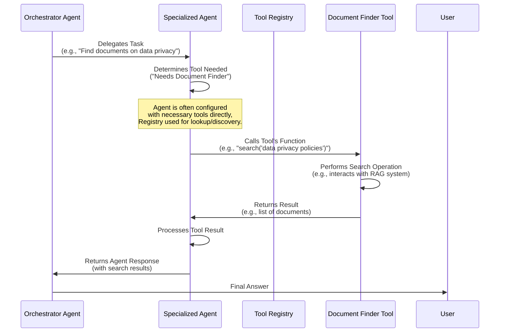

In this flow, the [Specialized Agent](#chapter-3-agent) knows (or figures out) which Tool it needs. It then directly calls the Tool's function to perform the specific action (like searching). The Agent usually gets access to its necessary tools during its setup, often via configuration managed by the [Factory](#chapter-10-factory), which itself might use the **Tool Registry** to look up or instantiate tools.

## Tools in the Code

Let's look at how Tools are defined and registered in RegulAIte, primarily in `backend/agent_framework/tool_registry.py` and `backend/agent_framework/tools/`.

First, the concept of a `ToolParameter` and `ToolMetadata`:

```python
# backend/agent_framework/tool_registry.py (simplified)
from pydantic import BaseModel, Field
from typing import List, Optional, Any

class ToolParameter(BaseModel):
    """Parameter definition for a tool."""
    name: str
    description: str
    type: str
    required: bool = False

class ToolMetadata(BaseModel):
    """Metadata for a tool."""
    id: str # Unique ID for the tool
    name: str # Display name
    description: str # What the tool does
    parameters: List[ToolParameter] = Field(default_factory=list) # What inputs it needs
    tags: List[str] = Field(default_factory=list) # Categories (e.g., "search", "grc")
    # ... other fields like version, etc.
```
*Explanation:* These Pydantic models define the structure for describing a tool. `ToolMetadata` includes a unique `id`, a human-readable `name`, a `description`, and a list of `parameters` that explain what arguments the tool's function expects. Tags help categorize tools.

RegulAIte uses a `@tool` decorator to make it easy to turn any Python function into a Tool and automatically generate its metadata:

```python
# backend/agent_framework/tool_registry.py (simplified decorator)
from typing import Callable

class Tool:
    # ... __init__ and metadata defined above ...
    pass # Simplified

def tool(id: str = None, name: str = None, description: str = None, tags: List[str] = None):
    """
    Decorator to register a function as a tool.
    """
    def decorator(func: Callable):
        # Create a Tool instance from the function
        tool_instance = Tool(func)

        # Override metadata with provided values
        if id: tool_instance.metadata.id = id
        # ... update name, description, tags if provided ...

        # Store metadata on the function itself for discovery
        func._tool_metadata = tool_instance.metadata

        # The wrapper ensures the Tool's __call__ method is used
        @wraps(func) # Imports functools.wraps
        def wrapper(*args, **kwargs):
            return tool_instance(*args, **kwargs)

        wrapper._tool_metadata = tool_instance.metadata # Keep metadata on wrapper too
        return wrapper
    return decorator

# Example usage in backend/agent_framework/tools/document_finder.py
# ... imports ...
# from ..tool_registry import tool # Import the decorator

# @tool(...) # Apply the decorator here in the actual file
async def document_finder_tool(
    query: str,
    doc_types: List[str] = None,
    limit: int = 10,
    **kwargs
) -> Dict[str, Any]:
    """
    Outil de recherche de documents pour les agents.
    Searches for documents based on a query and optional criteria.
    """
    # ... actual implementation calling RAG system ...
    print(f"Document Finder Tool called with query: '{query}', types: {doc_types}, limit: {limit}")
    # Example simulation of a result
    return {
        "status": "success",
        "documents": [{"id": "doc-123", "title": "Relevant Policy", "score": 0.9}],
        "total_results": 1
    }
```
*Explanation:* The `@tool(...)` decorator wraps your function (`document_finder_tool` in the example). It creates a `Tool` object internally, captures the function's parameters (like `query`, `doc_types`, `limit`) to build the `ToolMetadata`, and attaches this metadata (`_tool_metadata`) to the function. When an Agent calls the decorated function, the `Tool` instance's `__call__` method is executed, which in turn runs the original function. This makes the function discoverable and usable by the Tool Registry and Agents.

Now, the `ToolRegistry` class itself:

```python
# backend/agent_framework/tool_registry.py (simplified)
from typing import Dict, List, Callable, Union
# ... other imports and class definitions ...

class ToolRegistry:
    """
    Registry for managing tools that can be used by agents.
    """
    def __init__(self):
        """Initialize an empty tool registry."""
        self.tools: Dict[str, Union[Tool, Callable]] = {} # Stores tools by ID
        self.tags: Set[str] = set() # Keeps track of all unique tags
        # ... optional LLM client for selection ...

    def register(self, tool_func: Union[Tool, Callable], **kwargs) -> str:
        """
        Register a tool with the registry. Can accept decorated functions.
        """
        # If it's a decorated function, extract metadata and wrap it
        if not isinstance(tool_func, Tool) and hasattr(tool_func, "_tool_metadata"):
             # Create a Tool instance if needed based on the stored metadata
             tool_instance = Tool(tool_func) # Pass the original function
             tool_instance.metadata = tool_func._tool_metadata # Use the attached metadata
        elif isinstance(tool_func, Tool):
             tool_instance = tool_func # Already a Tool instance
        else:
             # Handle non-decorated functions if necessary, or raise error
             raise ValueError("Input must be a Tool instance or a function decorated with @tool")

        # Register the tool instance
        tool_id = tool_instance.metadata.id
        if tool_id in self.tools:
             logger.warning(f"Tool ID conflict: {tool_id}. Overwriting existing tool.")
        self.tools[tool_id] = tool_instance # Store the Tool instance

        # Update tags from the tool's metadata
        for tag in tool_instance.metadata.tags:
            self.tags.add(tag)

        logger.info(f"Registered tool: {tool_id}")
        return tool_id

    def get_tool(self, tool_id: str) -> Optional[Union[Tool, Callable]]:
        """
        Get a tool by its ID.
        """
        return self.tools.get(tool_id)

    def list_tools(self) -> List[ToolMetadata]:
        """
        List metadata for all registered tools.
        """
        return [tool.metadata for tool in self.tools.values() if isinstance(tool, Tool)]

    # ... methods for discovering tools (discover_tools) ...
    # ... methods for intelligently selecting tools (select_tools using LLM) ...
```
*Explanation:* The `ToolRegistry` class has a dictionary `self.tools` to store the registered `Tool` instances (or decorated functions, which the registry can turn into `Tool` instances). The `register` method takes a Tool or a `@tool` decorated function, extracts its metadata, stores it by its unique `id`, and collects its `tags`. The `get_tool` method allows retrieving a tool by its ID, and `list_tools` provides a list of all registered tool metadata.

Tools are typically organized into Python files within the `backend/agent_framework/tools` directory (as seen in the provided code snippets like `document_finder.py`, `entity_extractor.py`, etc.). The `__init__.py` file in this directory imports all the decorated tool functions so they can be discovered by the registry. The `ToolRegistry` has a `discover_tools` method (not shown in the simplified snippet but present in the full code) that can scan specified Python packages to find all functions marked with the `@tool` decorator and automatically register them.

This discovery process usually happens during the system's startup phase ([Factory](#chapter-10-factory) or application entry point).

## Agent Using a Registered Tool

An Agent doesn't typically call `get_tool` from the registry every time it needs a tool. Instead, Agents are usually initialized with references to the specific Tool instances they might need. The Agent base class provides a helper method, `execute_tool`, to make calling these tools easier and handle potential logging or error handling:

```python
# backend/agent_framework/agent.py (simplified execute_tool method)
# ... imports ...
# from .tool_registry import Tool # Import Tool

class Agent:
    # ... __init__ method stores tools in self.tools dictionary ...
    # Example: self.tools = {"document_finder": document_finder_tool_instance}

    async def execute_tool(self, tool_id: str, **kwargs) -> Any: # Could return structured ToolResult
        """
        Execute a registered tool.
        
        Args:
            tool_id: The ID of the tool to execute.
            **kwargs: Parameters to pass to the tool function.
            
        Returns:
            The result of the tool execution.
        """
        if tool_id not in self.tools:
            self.logger.error(f"Tool '{tool_id}' is not available to agent '{self.agent_id}'")
            raise ValueError(f"Tool '{tool_id}' not found") # Or return error result

        tool_instance = self.tools[tool_id]
        self.logger.info(f"Agent '{self.agent_id}' executing tool '{tool_id}' with kwargs: {kwargs}")

        try:
            # Call the tool's function (remember it's wrapped by @tool)
            # Assuming the tool function is async
            result = await tool_instance(**kwargs) 
            self.logger.info(f"Tool '{tool_id}' executed successfully.")
            # In a real system, might wrap result in a standard ToolResult object
            return result 
        except Exception as e:
            self.logger.error(f"Error executing tool '{tool_id}': {str(e)}")
            raise # Re-raise or return a structured error
```
*Explanation:* The `execute_tool` method is part of the base `Agent` class. An agent instance that has been given a tool (e.g., `self.tools["document_finder"]`) can call `await self.execute_tool("document_finder", query="...")`. This method looks up the tool instance by ID from the agent's internal `self.tools` dictionary and calls it, passing the provided keyword arguments. This provides a clean way for Agents to interact with their capabilities.

## Why are Tools and the Tool Registry Important?

The Tool and Tool Registry concepts are fundamental for building flexible and powerful agent systems like RegulAIte because they provide:

*   **Modularity:** Specific capabilities (like search or parsing) are encapsulated in Tools, separate from the agent's core reasoning logic.
*   **Reusability:** The same Tool can be used by multiple different [Agents](#chapter-3-agent) or [Specialized Modules](#chapter-4-specialized-modules).
*   **Maintainability:** If an external system changes (e.g., the document database API), only the corresponding Tool needs to be updated, not all the agents that use it.
*   **Discoverability:** The Registry provides a central catalog, making it easy for developers (and potentially even the AI itself, via methods like `select_tools`) to see what capabilities are available.
*   **Standard Interface:** The `@tool` decorator and `ToolMetadata` ensure that all tools present themselves in a consistent way, regardless of their underlying implementation.

By separating capabilities into Tools and managing them with a Registry, RegulAIte enables the creation of complex systems where different expert agents can easily leverage a shared set of utilities to accomplish their tasks.

## Conclusion

In this chapter, we explored the concepts of the Tool and the Tool Registry. We learned that Tools are specific, reusable capabilities that [Agents](#chapter-3-agent) use to perform actions like searching documents or extracting entities. The Tool Registry acts as a central catalog for discovering and managing these tools. This architecture allows for greater modularity, reusability, and maintainability within the RegulAIte framework, enabling agents to effectively interact with external systems and perform specialized tasks.

Next, we'll look at a critical component that many Agents and Tools rely on for their "intelligence": the [LLM Integration](#chapter-6-llm-integration).

# Chapter 6: LLM Integration

Welcome back to the RegulAIte tutorial! In the previous chapters, we've explored how user requests are structured ([Query & Query Context](#chapter-1-query--query-context)), how the main [Orchestrator Agent](#chapter-2-orchestrator-agent) plans and delegates tasks to [Specialized Modules](#chapter-4-specialized-modules) (which are often themselves specialized [Agents](#chapter-3-agent)), and how these agents use [Tools](#chapter-5-tool--tool-registry) to perform specific actions like searching documents.

Many of these components, especially the [Orchestrator Agent](#chapter-2-orchestrator-agent) for planning and synthesis, and the specialized [Agents](#chapter-3-agent) for analyzing text or generating structured output, need artificial intelligence to perform their core functions. They need to understand language, reason, and generate human-like text or structured data. This is where Large Language Models (LLMs) like GPT-4.1 come into play.

While [Tools](#chapter-5-tool--tool-registry) help agents *do* things in the world (like search databases), the LLM is often the "brain" that helps agents *think*, *understand*, and *generate*. How does RegulAIte connect to and effectively use these powerful LLMs?

## What's the Problem?

Simply put, interacting with LLMs isn't always straightforward. You don't just send a string and get a perfect response back. You often need to:

*   **Choose the right model:** Different models (like GPT-4, GPT-3.5, etc.) have different capabilities and costs.
*   **Handle API keys and endpoints:** Securely manage credentials and know where to send requests.
*   **Craft effective prompts:** Write clear instructions (system messages) and format user questions (user messages) in a way the LLM understands best. This is called **Prompt Engineering**.
*   **Manage conversational history:** If you're building a chatbot, you need to send previous messages so the LLM remembers the conversation context.
*   **Parse responses:** Sometimes you need the LLM to return structured data (like JSON), not just text, and you need to parse that reliably.
*   **Handle errors and retries:** API calls can fail.
*   **Add specific instructions:** For a domain like GRC, you might need to tell the LLM to act as a "Compliance Expert" or "Risk Analyst".
*   **Manage languages:** Ensure the LLM responds in the desired language (especially important for RegulAIte's multi-language support, like French).

Doing all of this logic within every [Agent](#chapter-3-agent) that needs an LLM would be repetitive and prone to errors.

## Meet LLM Integration: The AI Communication Channel

RegulAIte solves this by dedicating a specific component to handle all interactions with the underlying LLM: the **LLM Integration** module.

Think of the LLM Integration as the **Interpreter and Communication Hub** between your RegulAIte system and the AI model.

*   It is the **single point of contact** for any part of the framework that needs to use the LLM.
*   It knows *how* to talk to the specific LLM provider (like OpenAI).
*   It manages the technical details like API keys and model selection.
*   Crucially, it **enhances prompts** by adding specialized system instructions or language-specific directives before sending them to the LLM.
*   It receives the raw responses from the LLM and provides them back to the calling component.

It's the layer that turns a request like "LLM, assess this risk context" into the correctly formatted API call with the right system prompt, user message, language instructions, and parameters.

## Key Responsibilities of LLM Integration

Based on the code and description, the LLM Integration module handles several key tasks:

1.  **Connection Management:** Initializes and manages the connection to the LLM provider (like OpenAI) using the configured API key and model.
2.  **Prompt Formatting:** Structures the input into the format required by the LLM API (e.g., system, user, assistant messages).
3.  **Specialized Prompting (Prompt Engineering):** Adds system prompts tailored for specific GRC domains (Risk, Compliance, Governance, etc.) when requested by an [Agent](#chapter-3-agent).
4.  **Multi-Language Support:** Automatically detects the language of the user's input (or the overall context) and adds instructions to the LLM to respond in that language (supporting French, English, etc.).
5.  **Structured Output:** Provides methods to specifically ask the LLM to generate output in a structured format like JSON, often used by agents for parsing results.
6.  **Method Abstraction:** Offers different methods for various tasks, like simple text generation (`generate`), conversational interaction (`generate_response`), structured analysis (`analyze_with_structured_output`), or even embeddings (`embed`).

## How Agents Use LLM Integration

An [Agent](#chapter-3-agent) or another component that needs to use the LLM doesn't call the external API directly. Instead, it gets an instance of the `LLMIntegration` class (often passed to it during initialization via the [Factory](#chapter-10-factory)) and calls one of its methods.

Here's a simple example flow:

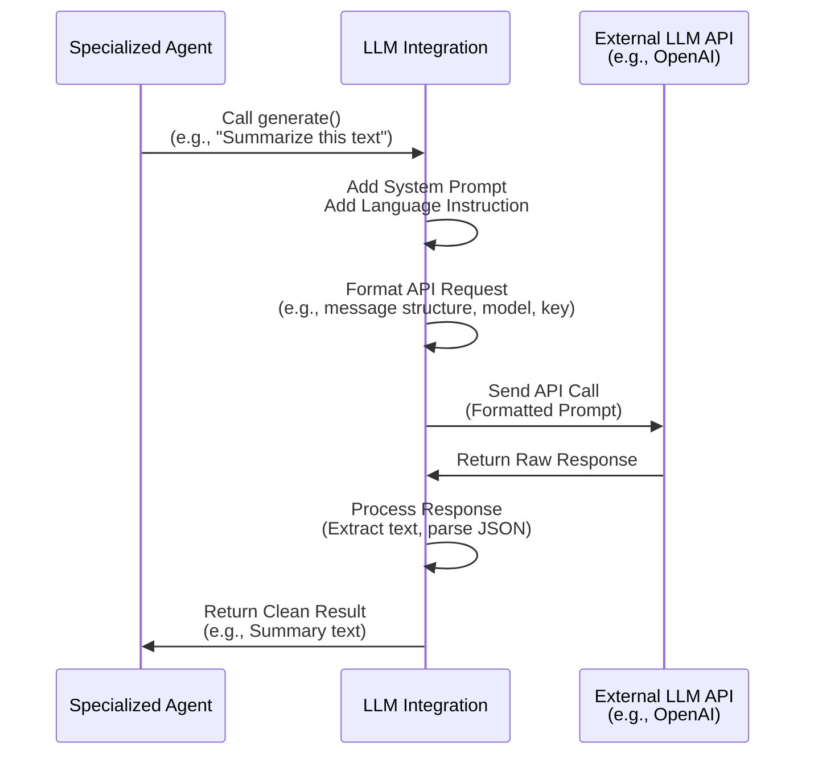

This diagram shows that the [Specialized Agent](#chapter-3-agent) interacts *only* with the `LLMIntegration` layer. The LLM Integration hides all the complexity of talking to the external LLM API.

## LLM Integration in the Code

The core of this component is the `LLMIntegration` class in `backend/agent_framework/integrations/llm_integration.py`.

Let's look at simplified parts of the code:

First, the class definition and initialization:

```python
# backend/agent_framework/integrations/llm_integration.py (simplified)
import logging
import os
# ... other imports ...

logger = logging.getLogger(__name__)

# Try to import OpenAI (optional dependency)
try:
    from openai import AsyncOpenAI
    OPENAI_AVAILABLE = True
except ImportError:
    OPENAI_AVAILABLE = False # System can still run without OpenAI


class LLMIntegration:
    """
    Integration with LLM services. Handles connection, prompts, language.
    """
    
    def __init__(self, 
                provider: str = "openai", 
                model: str = "gpt-4.1", 
                api_key: Optional[str] = None,
                max_tokens: int = 4000,
                temperature: float = 0.2):
        """
        Initialize the LLM integration with provider and model details.
        """
        self.provider = provider
        self.model = model
        self.max_tokens = max_tokens
        self.temperature = temperature
        
        # Get API key from args or environment variable
        self.api_key = api_key or os.environ.get("OPENAI_API_KEY")
            
        # Initialize the specific client (like OpenAI AsyncOpenAI)
        self._client = None
        self._initialize_client()
        
        # GRC specific system prompts are stored here
        self.system_prompts = {
            "risk_assessment": """Tu es un expert en évaluation des risques...""",
            "compliance_analysis": """Tu es un expert en conformité...""",
            # ... other prompts ...
        }
        # Language specific instructions are stored here or generated
        self.language_instructions = {
             'fr': """IMPORTANT: Vous devez TOUJOURS répondre en français...""",
             'en': """IMPORTANT: Always respond in English...""",
             # ... other languages ...
        }
        
    def _initialize_client(self):
        """Initialize the appropriate client for the selected provider."""
        if self.provider == "openai":
            if OPENAI_AVAILABLE and self.api_key:
                try:
                    self._client = AsyncOpenAI(api_key=self.api_key)
                    logger.info(f"Initialized OpenAI client for model {self.model}")
                except Exception as e:
                    logger.error(f"Error initializing OpenAI client: {str(e)}")
                    self._client = None # Ensure client is None on failure
            else:
                logger.warning("OpenAI not available or API key missing.")
                self._client = None
        else:
            logger.warning(f"Unsupported LLM provider: {self.provider}")
            self._client = None

    # ... other methods like generate, generate_response, analyze_with_structured_output ...
```
*Explanation:* The `LLMIntegration` class takes configuration like the `provider` (e.g., "openai"), the `model` (e.g., "gpt-4.1"), and the `api_key`. In its `__init__` method, it reads the API key (from arguments or environment variables) and calls `_initialize_client` to set up the actual connection object (like `AsyncOpenAI`). It also stores the specific GRC system prompts and language instructions that it will use later to enhance queries.

Next, look at a simplified version of the `generate` or `generate_response` method, which is how other parts of the system ask the LLM to do something:

```python
# backend/agent_framework/integrations/llm_integration.py (simplified generate_response)
# ... imports and class definition ...

    async def generate_response(
        self, 
        messages: List[Dict[str, str]], # Conversation history
        agent_type: str = None,         # Hint for specialized prompt
        **kwargs                        # Other LLM parameters
    ) -> str:
        """
        Generate text response from the LLM, adding specialized prompts.
        """
        if self._client is None:
            logger.error("LLM client not initialized.")
            return "Error: LLM service not available." # Friendly error message

        try:
            # Prepare messages, potentially adding a system message
            processed_messages = list(messages) # Copy the list

            # Auto-detect language from user query (last message)
            user_query = processed_messages[-1].get("content", "") if processed_messages else ""
            detected_language = await detect_language(user_query, llm_client=self) # detect_language function

            # Add language instruction
            language_instruction = self.language_instructions.get(detected_language, self.language_instructions['en'])
            
            # Add GRC specific system prompt if provided
            grc_system_prompt = self.system_prompts.get(agent_type)

            # Combine and add system message if not already present
            full_system_message = language_instruction
            if grc_system_prompt:
                 full_system_message = f"{full_system_message}\n\n{grc_system_prompt}"

            # Check if messages already have a system prompt
            has_system = any(msg.get("role") == "system" for msg in processed_messages)
            if not has_system:
                processed_messages.insert(0, {"role": "system", "content": full_system_message})
            else:
                 # If system prompt exists, merge or ensure language/GRC are included
                 # (More complex merging logic would be here in full code)
                 pass 
            
            # Prepare configuration parameters (model, temperature, etc.)
            config = {**self.default_config, **kwargs} # Combine defaults and overrides
            config['model'] = self.model # Ensure correct model is used

            logger.info(f"Calling LLM ({self.model}) with {len(processed_messages)} messages.")

            # Call the actual LLM client (e.g., OpenAI API)
            response = await self._client.chat.completions.create(
                messages=processed_messages,
                **config
            )
            
            # Extract the response text
            generated_content = response.choices[0].message.content
            
            logger.debug(f"LLM generated response (first 100 chars): {generated_content[:100]}")
            
            return generated_content
            
        except Exception as e:
            logger.error(f"Error during LLM generation: {str(e)}")
            raise # Re-raise exception for calling agent to handle
```
*Explanation:* The `generate_response` method receives a list of `messages` (like a chat history) and an optional `agent_type` hint.
1.  It first checks if the internal LLM client (`self._client`) is initialized.
2.  It detects the language of the user's input (the last message).
3.  It retrieves the appropriate language instruction and the GRC specialized prompt based on `agent_type`.
4.  It combines these into a `full_system_message`.
5.  It adds this system message to the beginning of the `messages` list that will be sent to the LLM (unless a system message is already there, in which case it might merge them).
6.  It prepares the API call parameters using default configuration and any overrides provided in `kwargs`.
7.  It calls the underlying LLM provider's client (`self._client.chat.completions.create`) with the formatted messages and parameters.
8.  It extracts the generated text from the LLM's response and returns it.

There are also specialized methods like `analyze_with_structured_output`:

```python
# backend/agent_framework/integrations/llm_integration.py (simplified analyze_with_structured_output)
# ... imports and class definition ...
import json # Needed for JSON handling

    async def analyze_with_structured_output(
        self, 
        prompt: str, 
        schema: Dict[str, Any], # The expected JSON structure
        agent_type: str = None
    ) -> Dict[str, Any]:
        """
        Generate a structured response according to a JSON schema.
        """
        try:
            # Craft the prompt to specifically request JSON output
            structured_prompt = f"""
{prompt}

Respond ONLY in the following JSON format:
{json.dumps(schema, indent=2, ensure_ascii=False)}

Ensure the response is valid and complete JSON.
"""
            # Call the general generation method with the structured prompt
            # Use a lower temperature for more predictable JSON output
            response_text = await self.generate(
                prompt=structured_prompt,
                agent_type=agent_type,
                temperature=0.1 
            )
            
            # Try to find and parse the JSON from the response text
            json_start = response_text.find("{")
            json_end = response_text.rfind("}") + 1
            
            if json_start == -1 or json_end == 0:
                raise ValueError("No JSON found in LLM response")
                
            json_content = response_text[json_start:json_end]
            
            return json.loads(json_content) # Parse the JSON string into a Python dict
            
        except Exception as e:
            logger.error(f"Error during structured analysis: {str(e)}")
            raise # Propagate the error
```
*Explanation:* This method is designed for tasks where an [Agent](#chapter-3-agent) needs data back in a specific structure (like a list of risks or compliance gaps). It takes the user's `prompt` and a `schema` dictionary representing the desired JSON structure. It then formats the prompt to explicitly instruct the LLM to respond *only* in that JSON format. It calls the general `generate` method and then attempts to find and parse the resulting text as JSON.

Finally, to ensure that different parts of the system always use the *same* configured LLM client, a simple singleton pattern is used via the `get_llm_integration()` function:

```python
# backend/agent_framework/integrations/llm_integration.py (simplified)
# ... imports and class definition ...

# Singleton instance variable
_llm_integration = None

def get_llm_integration(provider: str = "openai", model: str = "gpt-4.1") -> LLMIntegration:
    """
    Get the singleton LLM integration instance. Create it if it doesn't exist.
    
    Args:
        provider: The LLM provider to use (used only for initial creation)
        model: The model to use (used only for initial creation)
        
    Returns:
        The LLM integration instance
    """
    global _llm_integration
    
    if _llm_integration is None:
        # Create the instance only once
        _llm_integration = LLMIntegration(provider=provider, model=model)
        
    # Note: Subsequent calls with different provider/model might return
    # the same instance configured with the first provided values.
    # For a multi-model system, this would need to be a factory
    # managing multiple instances, but for a singleton it's simpler.
        
    return _llm_integration

# get_llm_client is just an alias for get_llm_integration for backward compatibility
get_llm_client = get_llm_integration 
```
*Explanation:* The `get_llm_integration()` function ensures that the `LLMIntegration` object is created only once (`if _llm_integration is None:`). Any part of the code needing to talk to the LLM should call `get_llm_integration()` to get this shared instance. The [Factory](#chapter-10-factory) (`backend/agent_framework/factory.py`) uses this function when creating agents that require an LLM client.

## Why is LLM Integration Important?

Having a dedicated LLM Integration layer is crucial for several reasons:

*   **Centralization:** All LLM communication logic is in one place, making it easier to manage, update, and debug.
*   **Abstraction:** Agents and other components don't need to know the specifics of the LLM API; they just use the standard `LLMIntegration` methods.
*   **Consistency:** Ensures that all LLM calls within the framework use consistent settings, system prompts, and language handling.
*   **Specialization:** Allows adding GRC-specific prompt engineering and language support seamlessly.
*   **Maintainability:** If you switch LLM providers or models, you primarily only need to modify the `LLMIntegration` module, not every single agent.
*   **Testability:** Makes it easier to mock or simulate LLM responses for testing purposes.

It acts as the necessary bridge, making the raw power of LLMs accessible and controllable for the specific needs of the RegulAIte agent framework, particularly for GRC analysis in multiple languages.

## Conclusion

In this chapter, we learned about the LLM Integration module, the dedicated component responsible for connecting the RegulAIte framework to external Large Language Models like GPT-4.1. We saw how it handles the technical details of API communication, adds crucial system prompts and multi-language instructions, provides methods for various LLM tasks like structured analysis, and centralizes all LLM interactions, making the system more robust, maintainable, and specialized for GRC analysis.

While the LLM is powerful, it operates based on the vast amount of data it was trained on. To provide answers grounded in *specific* domain knowledge or *your organization's documents*, we need another layer. Next, we'll explore the [RAG Integration](#chapter-7-rag-integration), which helps the system retrieve relevant information *before* talking to the LLM.

# Chapter 7: RAG Integration

Welcome back to the RegulAIte tutorial! In the [previous chapter](#chapter-6-llm-integration), we learned about the LLM Integration layer, which connects our framework to powerful language models. These models are great at understanding language and generating human-like text, but they rely on the vast, general knowledge they were trained on.

However, for a specialized application like GRC analysis, the AI needs access to *specific*, often proprietary, documents: your organization's policies, procedures, risk assessments, compliance reports, and industry regulations. The LLM doesn't know the details of "Report_Q3.pdf" unless you show it the content.

## What's the Problem?

If a user asks, "What are the key cybersecurity risks identified in our latest risk assessment report?" or "Does our data retention policy comply with GDPR according to document P-005?", a general LLM can't answer this using only its training data. It needs the actual text from *your* specific risk assessment report and *your* specific policy document.

Simply sending the entire document content to the LLM every time is impractical. Documents can be very long, and LLMs have limits on how much text they can process at once (this is called their "context window"). We need a smart way to find *only* the most relevant pieces of information from a large collection of documents and provide *those* pieces to the LLM.

## Meet RAG Integration: The Smart Librarian

This is where **RAG Integration** comes in. RAG stands for **Retrieval-Augmented Generation**. It's a technique that combines retrieval (finding relevant information) with generation (using an LLM to create a response based on that information).

In RegulAIte, the **RAG Integration** component is the bridge between the agent framework and your organization's knowledge base (where your documents are stored). Think of it as a **smart librarian**:

*   When an [Agent](#chapter-3-agent) or a [Tool](#chapter-5-tool--tool-registry) needs information from the knowledge base, it asks the RAG Integration.
*   The RAG Integration understands the request and searches through the documents (or parts of documents, called "chunks").
*   It retrieves the most relevant document chunks or information snippets.
*   It provides this retrieved information back to the requesting component (often an LLM via the [LLM Integration](#chapter-6-llm-integration), or directly to an Agent).

The LLM then uses this specific, retrieved information to generate its answer, ensuring that the response is grounded in the actual data from your knowledge base, rather than just its general training.

## Key Responsibilities of RAG Integration

The main jobs of the RAG Integration component include:

1.  **Connecting to the Knowledge Base:** It knows how to communicate with the underlying system that stores and indexes the documents (like a vector database such as Qdrant, which RegulAIte uses).
2.  **Searching:** It performs searches based on user queries or agent needs. This can be simple keyword search or more advanced *semantic search* (understanding the meaning of the query).
3.  **Retrieving Relevant Information:** It fetches the top N most relevant document chunks or documents based on the search results.
4.  **Processing Results:** It formats the retrieved information in a way that is easy for Agents or the LLM to use, often including the text content and metadata about the source (like the document title).
5.  **Query Expansion (Optional):** It can sometimes improve search by automatically generating related terms or rephrasing the query before searching.

## How Agents Use RAG Integration

Instead of talking directly to the knowledge base or complex vector database, [Agents](#chapter-3-agent) or specialized [Tools](#chapter-5-tool--tool-registry) use the `RAGIntegration` instance. The `DocumentFinder` Tool (from Chapter 5) is a prime example of a component that heavily relies on RAG Integration.

Here's a simplified flow:

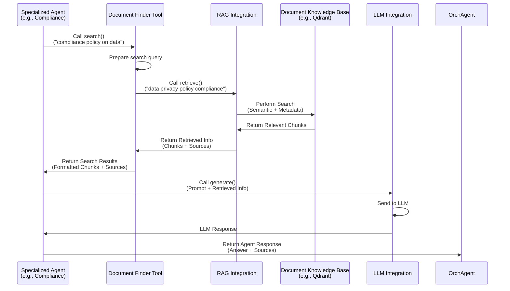

This diagram shows that the [Specialized Agent](#chapter-3-agent) delegates the search task to a [Tool](#chapter-5-tool--tool-registry) (like the Document Finder). The Tool then interacts with the `RAGIntegration` component to get the actual information from the Knowledge Base. The Tool (or the calling Agent) then takes this retrieved information and uses the [LLM Integration](#chapter-6-llm-integration) to ask the LLM to generate an answer based *on* that information.

## RAG Integration in the Code

The core code for this integration is in `backend/agent_framework/integrations/rag_integration.py`.

First, the `RAGIntegration` class itself. It needs access to the actual RAG system components. In RegulAIte, this is often an instance of a `RAGSystem` or `QueryEngine` from another part of the application (HyPE RAG).

```python
# backend/agent_framework/integrations/rag_integration.py (simplified __init__)
import logging
from typing import Dict, List, Optional, Any, Union, Set

logger = logging.getLogger(__name__)

class RAGIntegration:
    """
    Integration with the existing RAG system.
    """
    
    def __init__(self, query_engine=None, rag_system=None, use_query_expansion=False):
        """
        Initialize the RAG integration.
        """
        self.query_engine = query_engine # Might be a QueryEngine instance
        self.rag_system = rag_system     # Might be a RAGSystem instance
        self.use_query_expansion = use_query_expansion
        
        # Optional: Initialize query expansion tool if needed
        self.query_expander = None
        if self.use_query_expansion:
             # Code to get or create a QueryExpander tool
             pass 
        
        if self.query_engine is None and self.rag_system is None:
            logger.warning("RAG integration initialized without query engine or RAG system")

    # ... methods like retrieve, query, _process_retrieval_result, etc. ...
```
*Explanation:* The `RAGIntegration` class is initialized with references to `query_engine` and `rag_system`. These are the actual components that perform the search and retrieval from the knowledge base. The integration class itself doesn't contain the searching logic; it *uses* the provided RAG system objects. It also has a flag and potentially an instance for `use_query_expansion`.

The main method that Agents or Tools call to get relevant document chunks is `retrieve`:

```python
# backend/agent_framework/integrations/rag_integration.py (simplified retrieve)
# ... imports and class definition ...

    async def retrieve(self, query: str, top_k: int = 5, search_filter: Optional[Dict[str, Any]] = None) -> Dict[str, Any]:
        """
        Retrieve relevant documents from the RAG system.
        """
        # Check if a RAG system or query engine is available
        if self.query_engine is None and self.rag_system is None:
            logger.error("Cannot retrieve documents: No RAG system available")
            return {"results": [], "sources": []}
            
        try:
            logger.info(f"Retrieving documents for query: {query}")
            
            # --- Query Expansion (Simplified) ---
            queries_to_search = [query]
            if self.use_query_expansion and self.query_expander:
                 expanded = await self.query_expander.expand_query(query, ...)
                 if expanded.expanded_terms:
                      queries_to_search.append(query + " " + " ".join(expanded.expanded_terms[:3]))
                 logger.debug(f"Searching with queries: {queries_to_search}")
            # --- End Query Expansion ---

            all_results = []
            seen_doc_ids = set()

            # Try retrieving using the available RAG system/query engine
            for search_query in queries_to_search:
                 if self.query_engine is not None and hasattr(self.query_engine, 'retrieve'):
                     retrieval_result = await self.query_engine.retrieve(
                         search_query, 
                         top_k=top_k, 
                         search_filter=search_filter
                     )
                     processed = self._process_retrieval_result(retrieval_result)
                     self._merge_results(all_results, processed, seen_doc_ids) # Handle duplicates

                 elif self.rag_system is not None and hasattr(self.rag_system, 'retrieve'):
                     # Fallback to rag_system if query_engine doesn't have retrieve
                     retrieval_result = await self.rag_system.retrieve(search_query, top_k=top_k)
                     processed = self._process_retrieval_result(retrieval_result)
                     self._merge_results(all_results, processed, seen_doc_ids)

                 # ... potentially other fallback methods like rag_system.search ...

            # Sort and limit the final results
            all_results.sort(key=lambda x: x.get('score', 0), reverse=True)
            final_results = all_results[:top_k]
            
            return {
                "results": [r.get('text', str(r)) for r in final_results], # Extract just text content
                "sources": final_results # Keep full source objects with metadata
            }
                
        except Exception as e:
            logger.error(f"Error retrieving documents: {str(e)}")
            return {"results": [], "sources": []}
```
*Explanation:* The `retrieve` method takes the user's `query`, the desired number of results (`top_k`), and optional `search_filter`. It checks if a RAG system object is available. It might perform `query_expansion` to generate alternative queries. It then calls the `retrieve` method on the internal `query_engine` or `rag_system` object. It processes the potentially diverse output format from the RAG system using `_process_retrieval_result` and returns a standardized dictionary containing a list of text snippets (`results`) and the full source objects with metadata (`sources`).

There's also a `query` method, which might be used if the underlying RAG system can provide a direct answer *without* the calling component needing to process the retrieved chunks itself:

```python
# backend/agent_framework/integrations/rag_integration.py (simplified query)
# ... imports and class definition ...

    async def query(self, query: str, **kwargs) -> str:
        """
        Query the RAG system for a response directly.
        """
        if self.query_engine is None and self.rag_system is None:
            logger.error("Cannot query: No RAG system available")
            return "I'm sorry, but I cannot access the knowledge base at the moment."
            
        try:
            logger.info(f"Querying RAG system: {query}")
            
            # Try querying using the available RAG system/query engine
            if self.query_engine is not None and hasattr(self.query_engine, 'query'):
                response = await self.query_engine.query(query, **kwargs)
                # Assuming the query engine returns the final answer string
                return str(response) 
            
            elif self.rag_system is not None and hasattr(self.rag_system, 'query'):
                # Fallback to rag_system query method
                response = await self.rag_system.query(query, **kwargs)
                return str(response)
                
            else:
                # If neither has a direct 'query' method, inform the caller
                logger.warning("RAG system does not have a direct 'query' method. Use 'retrieve' instead.")
                return "I'm sorry, I can only retrieve documents, not answer directly from the knowledge base with the current setup."
                
        except Exception as e:
            logger.error(f"Error querying RAG system directly: {str(e)}")
            return f"I encountered an error while processing your query: {str(e)}"
```
*Explanation:* The `query` method attempts to call a `query` method on the underlying RAG system objects. This is useful for RAG systems that can perform both retrieval and the final answer generation step internally. It returns the response as a string.

The methods `_process_retrieval_result` and `_process_query_result` (not shown in full detail here, but present in the actual file) are crucial because different RAG systems or libraries might return search results in slightly different formats (list of dicts, custom objects, etc.). These internal methods standardize the output into the `{"results": [...], "sources": [...]}` format expected by RegulAIte's components.

Just like the [LLM Integration](#chapter-6-llm-integration), the `RAGIntegration` instance is typically managed as a singleton to ensure consistency throughout the application. The `initialize_rag_integration` and `get_rag_integration` functions handle this:

```python
# backend/agent_framework/integrations/rag_integration.py (simplified singleton)
# ... imports and class definition ...

# Singleton instance
_rag_integration = None

def initialize_rag_integration(rag_system=None, rag_query_engine=None, use_query_expansion=False):
    """
    Initialize the global RAG integration with explicit systems.
    """
    global _rag_integration
    logger.info("Initializing global RAG integration")
    _rag_integration = RAGIntegration(
        query_engine=rag_query_engine, 
        rag_system=rag_system,
        use_query_expansion=use_query_expansion
    )
    return _rag_integration

def get_rag_integration(rag_system=None, rag_query_engine=None, use_query_expansion=False):
    """
    Get the RAG integration instance. Create it if it doesn't exist.
    """
    global _rag_integration
    if _rag_integration is None:
        # Create the instance, potentially using provided systems or auto-discovery
        _rag_integration = RAGIntegration(
            rag_system=rag_system, 
            rag_query_engine=rag_query_engine,
            use_query_expansion=use_query_expansion
        )
        if rag_system is None and rag_query_engine is None:
             logger.warning("RAG Integration instance created without explicit RAG system/query engine. It might not function correctly without a configured knowledge base.")
        else:
             logger.info("RAG Integration instance created with explicit RAG system/query engine.")

    return _rag_integration
```
*Explanation:* These functions ensure that when any part of RegulAIte calls `get_rag_integration()`, it gets the *same* instance of `RAGIntegration`, which holds the connection to the knowledge base. The actual `rag_system` or `rag_query_engine` objects are typically passed to `initialize_rag_integration` during the application's startup process, managed by the [Factory](#chapter-10-factory).

Looking at the [Factory](#chapter-10-factory) code snippet provided in the context, you can see how `get_rag_integration` is used when creating agents that might need it, like the `RiskAssessmentModule`, `ComplianceAnalysisModule`, `GovernanceAnalysisModule`, `GapAnalysisModule`, and the `DocumentFinderAgent`:

```python
# backend/agent_framework/factory.py (snippet)
# ... imports ...
from .integrations.rag_integration import get_rag_integration # Import the function

async def create_specialized_agents(...):
    # ... get llm_client ...

    # Initialize RAG integration - this is done once during system initialization
    # The factory function might receive the rag_system/rag_query_engine
    # from the main application entry point.
    rag_integration_instance = get_rag_integration(
         rag_system=rag_system, # rag_system could be passed into create_specialized_agents
         # rag_query_engine is also a possible parameter here
         use_query_expansion=True # Example: Configure RAG integration feature
    )
    
    # ... later, when creating agents ...
    # 1. Risk Assessment Agent
    try:
        from .modules.risk_assessment_module import RiskAssessmentModule
        risk_agent = RiskAssessmentModule(
            llm_client=llm_client,
            # Pass the RAG integration instance or the rag_system itself
            rag_system=rag_integration_instance # Or pass rag_integration_instance
        )
        orchestrator.register_agent("risk_assessment", risk_agent)
        logger.info("Created RiskAssessmentModule...")
    except Exception as e:
        logger.error(f"Could not create risk_assessment agent: {e}")
        # Fallback to a RAG agent which inherently uses RAG integration
        try:
            risk_agent = await create_rag_agent(
                agent_id="risk_assessment",
                name="Agent d'Évaluation des Risques",
                # create_rag_agent internally calls get_rag_integration
                **kwargs 
            )
            orchestrator.register_agent("risk_assessment", risk_agent)
            logger.info("Created fallback RAG agent for risk_assessment")
        except Exception as fallback_e:
            logger.error(f"Could not create fallback risk_assessment agent: {fallback_e}")

    # 2. Document Finder Agent
    try:
        from .modules.document_finder_agent import DocumentFinderAgent
        document_finder_agent = DocumentFinderAgent(
            agent_id="document_finder",
            name="Agent de Recherche de Documents",
            # DocumentFinderAgent needs access to the RAG system
            # Its internal DocumentFinder tool will use the RAG integration
            rag_system=rag_integration_instance # Pass the instance
        )
        orchestrator.register_agent("document_finder", document_finder_agent)
        logger.info("Created DocumentFinderAgent...")
    # ... other agents created similarly, receiving rag_system/rag_integration_instance ...
```
*Explanation:* The `create_specialized_agents` function (called by `initialize_complete_agent_system`) first gets the `rag_integration_instance` using `get_rag_integration`. It then passes this instance (or sometimes just the core `rag_system` object itself) as an argument to the constructors of the specialized modules/agents that need it. Agents like `RiskAssessmentModule` or the `DocumentFinderAgent` then store this reference (`self.rag_system` or `self.document_finder` which internally holds `rag_system`) and use it when they need to perform retrieval tasks.

## Why is RAG Integration Important?

RAG Integration is absolutely vital for RegulAIte because it:

*   **Grounds Responses:** Ensures that the AI's answers are based on specific, verified information from your documents, not just general training data, making responses accurate and trustworthy for GRC analysis.
*   **Handles Proprietary Data:** Allows the AI to use your organization's private documents and knowledge base without needing to retrain the entire LLM.
*   **Bypasses LLM Context Limits:** Enables the system to work with documents larger than the LLM's context window by retrieving only the relevant snippets.
*   **Improves Accuracy and Relevance:** By providing targeted information, the LLM can generate more precise and relevant answers to domain-specific questions.
*   **Decouples LLM from Knowledge Base:** Allows you to change the underlying RAG system or knowledge base technology without significantly changing the LLM interaction logic in your agents.
*   **Enhances Tools:** Provides the necessary backend for crucial [Tools](#chapter-5-tool--tool-registry) like the Document Finder.

Without RAG Integration, RegulAIte would essentially be a powerful but generic LLM wrapper. With it, it becomes an intelligent system capable of performing complex GRC analysis grounded in specific, real-world data.

## Conclusion

In this chapter, we explored the RAG Integration component, the intelligent librarian that connects the RegulAIte agent framework to your document knowledge base. We learned how it retrieves relevant document chunks based on queries, providing essential context to the LLM or agents, thereby grounding the AI's responses in specific data. This capability is fundamental for applying LLMs effectively to domain-specific tasks like GRC analysis using your organization's own information.

Now that we understand how the different parts of the system (Agents, Tools, LLMs, RAG) work together, the next question is how to set up and configure these components for a specific organization or deployment. Next, we'll look at the [Organization Configuration](#chapter-8-organization-configuration).

# Chapter 8: Organization Configuration

Welcome back to the RegulAIte tutorial! In our journey so far, we've seen how RegulAIte handles user requests ([Query & Query Context](#chapter-1-query--query-context)), how the central [Orchestrator Agent](#chapter-2-orchestrator-agent) coordinates tasks, how [Specialized Modules](#chapter-4-specialized-modules) and [Agents](#chapter-3-agent) perform specific analyses using [Tools](#chapter-5-tool--tool-registry), and how these components leverage powerful AI models ([LLM Integration](#chapter-6-llm-integration)) and your organization's documents ([RAG Integration](#chapter-7-rag-integration)).

But even with all these capabilities, the AI needs to understand *who* it's performing the analysis *for*. An assessment of cybersecurity risks for a small tech startup is very different from one for a large bank. The relevant regulations, typical threats, key assets, and acceptable risk levels vary greatly.

How does RegulAIte ensure the analysis and recommendations are specifically tailored to *your* organization's unique situation?

## What's the Problem?

Imagine asking RegulAIte: "Assess our compliance status."

*   **Which regulations apply to "us"?** GDPR, HIPAA, PCI DSS, SOX, DORA, ANSSI? It depends entirely on your industry, location, and business activities.
*   **What kind of risks are "we" most concerned about?** A bank worries about financial cybercrime; a hospital worries about patient data breaches and medical device security; a tech company worries about IP theft and supply chain attacks.
*   **What are "our" most critical assets?** Customer data, payment systems, source code, medical records? This impacts the focus and severity of risk assessments.
*   **What's "our" preferred way of receiving reports?** An executive summary, a detailed technical breakdown, a specific format for the board?

A generic AI system wouldn't know these crucial details about *your* specific organization. Its analysis would be too general to be truly useful for GRC (Governance, Risk, Compliance) purposes.

To provide actionable, relevant, and compliant analysis, RegulAIte needs a comprehensive understanding of the client organization's profile and context.

## Meet Organization Configuration: The Client Brief

The **Organization Configuration** module in RegulAIte is designed to capture all the essential details about the organization requesting the analysis. Think of it as the **detailed client brief** or **company profile** that the AI team (the Agents) uses to perform their work correctly.

This module stores and provides access to information such as:

*   **Basic Information:** Organization ID, name, type (startup, SME, large corp), size (employee count, revenue), sector (banking, healthcare, technology).
*   **Operational Context:** Geographical presence, business model, digital maturity.
*   **Regulatory Environment:** Applicable compliance frameworks (like GDPR, ISO 27001), regulatory pressure, audit frequency.
*   **Risk Posture:** Risk appetite (conservative, moderate, aggressive), risk tolerance levels (by type like cyber, operational), insurance coverage.
*   **Assets and Infrastructure:** Key asset categories (with templates for common types), critical processes, key technologies used (e.g., cloud providers).
*   **Threat Landscape:** Typical threats relevant to the sector and size.
*   **Governance:** Governance maturity levels, reporting structures.
*   **Analysis Preferences:** Preferred methodologies (NIST, ISO), desired report format, level of detail, specific focus areas for analysis (e.g., only cloud security).

This configuration data serves as the foundational context that guides the behavior and focus of various components within the framework, especially the specialized [Agents](#chapter-3-agent).

## How Organization Configuration Tailors Analysis

When a [Query](#chapter-1-query--query-context) comes in, it's typically associated with an `organization_id` within its [Query Context](#chapter-1-query--query-context). Before or during analysis, the [Orchestrator Agent](#chapter-2-orchestrator-agent) or a specialized [Agent](#chapter-3-agent) retrieves the relevant Organization Profile using this ID.

This profile then influences decisions and processes throughout the analysis pipeline:

*   **Compliance Scope:** The system knows which regulations (like GDPR, HIPAA) are relevant and focuses its compliance checks accordingly.
*   **Risk Prioritization:** The system understands the organization's risk appetite and tolerance, helping it prioritize risks and tailor recommendations (e.g., recommending more stringent controls for a conservative organization).
*   **Asset/Threat Focus:** The system uses the defined assets and threat landscape to focus risk assessments on the most critical areas and relevant threats.
*   **Analysis Depth & Format:** The system applies analysis preferences to control the level of detail, specific topics to cover, and how the final report should be structured.
*   **Prompt Engineering (LLM):** The [LLM Integration](#chapter-6-llm-integration) or agents can use the organization's context (sector, size, specific concerns) to provide more specific instructions to the LLM, ensuring the generated analysis is highly relevant.
*   **RAG Filtering:** The [RAG Integration](#chapter-7-rag-integration) or [Tools](#chapter-5-tool--tool-registry) might use the organizational context (like relevant document types, asset names) to improve the search for relevant internal documents.

Here's a simplified flow showing how an Agent might use the Organization Configuration:

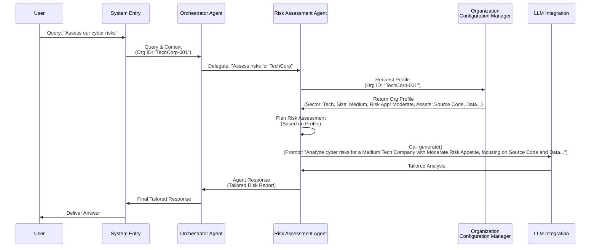

This diagram illustrates how the `Risk Assessment Agent` retrieves the organization's profile, which then informs how it structures its analysis and interacts with other components like the `LLM Integration` to get context-specific results.

## Organization Configuration in the Code

The Organization Configuration is managed by the `OrganizationConfigManager` class and the `OrganizationProfile` data structure, defined in `backend/agent_framework/modules/organization_config.py`. There are also example usage scripts like `backend/agent_framework/examples/example_organization_setup.py` and `backend/agent_framework/examples/organization_config_guide.py`.

Let's look at simplified snippets from the code.

First, the core data structure, `OrganizationProfile`, uses Python's `@dataclass` to define the fields holding the organization's details:

```python
# backend/agent_framework/modules/organization_config.py (simplified dataclasses)
from dataclasses import dataclass, field
from typing import Dict, List, Optional, Any
from enum import Enum
from datetime import datetime

# Enums for structured data (e.g., standardizing types/sectors)
class OrganizationType(Enum):
    STARTUP = "startup"
    SME = "sme"
    # ... other types ...

class RegulatorySector(Enum):
    BANKING = "banking"
    HEALTHCARE = "healthcare"
    # ... other sectors ...

# Data structures for specific aspects like assets or threats
@dataclass
class AssetTemplate:
    id: str
    name: str
    type: str
    criticality: str
    # ... other asset details ...

@dataclass
class ThreatProfile:
    threat_type: str
    likelihood: str
    # ... other threat details ...

@dataclass
class RegulatoryEnvironment:
    primary_frameworks: List[ComplianceFramework] = field(default_factory=list)
    regulatory_pressure: str = "medium"
    # ... other regulatory details ...

@dataclass
class OrganizationProfile:
    """Profil complet de l'organisation."""
    # Basic Info
    organization_id: str
    name: str
    organization_type: OrganizationType # Uses the Enum
    sector: RegulatorySector         # Uses the Enum
    size: str
    employee_count: int
    annual_revenue: str
    
    # Operational Context
    geographical_presence: List[str] = field(default_factory=list)
    business_model: str = "traditional"
    # ... more operational fields ...
    
    # Risk Posture
    risk_appetite: str = "moderate"
    risk_tolerance: Dict[str, str] = field(default_factory=dict)
    
    # Regulatory Environment
    regulatory_env: RegulatoryEnvironment = field(default_factory=RegulatoryEnvironment)
    
    # Assets and Infrastructure
    asset_templates: List[AssetTemplate] = field(default_factory=list)
    # ... more asset fields ...
    
    # Threat Profile
    threat_profile: List[ThreatProfile] = field(default_factory=list)
    
    # Governance
    governance_maturity: Dict[str, str] = field(default_factory=dict)
    # ... more governance fields ...
    
    # RegulAIte Specific Configuration
    preferred_methodologies: List[str] = field(default_factory=list)
    analysis_preferences: Dict[str, Any] = field(default_factory=dict)
    
    # ... timestamps and history ...
```
*Explanation:* This shows the structure of the `OrganizationProfile`. It groups related information into sections (Basic, Operational, Risk, Regulatory, etc.) and uses other dataclasses like `AssetTemplate` or Enums like `RegulatorySector` to ensure data is structured and standardized. Fields use `default_factory` for lists/dicts to avoid shared default objects.

The `OrganizationConfigManager` class holds the logic for creating, loading, and accessing these profiles.

```python
# backend/agent_framework/modules/organization_config.py (simplified Manager)
import logging
from typing import Dict, List, Optional, Any

# ... imports for dataclasses and Enums ...

logger = logging.getLogger(__name__)

class OrganizationConfigManager:
    """Gestionnaire de configuration organisationnelle."""
    
    def __init__(self):
        # Stores active profiles, typically loaded from a database or file
        self.profiles: Dict[str, OrganizationProfile] = {} 
        # Templates for auto-populating based on sector/size
        self.sector_templates = self._load_sector_templates() 
        self.size_templates = self._load_size_templates()
    
    def create_organization_profile(
        self,
        org_data: Dict[str, Any],
        use_templates: bool = True
    ) -> OrganizationProfile:
        """Crée un profil d'organisation avec templates sectoriels."""
        
        # Basic validation and parsing
        org_id = org_data.get("organization_id")
        if not org_id:
            raise ValueError("organization_id is required")
            
        # Create profile instance from provided data
        profile = OrganizationProfile(
            organization_id=org_id,
            name=org_data.get("name", "Unknown Organization"),
            organization_type=OrganizationType(org_data.get("organization_type", "sme")),
            sector=RegulatorySector(org_data.get("sector", "general")),
            size=org_data.get("size", "medium"),
            employee_count=org_data.get("employee_count", 100),
            annual_revenue=org_data.get("annual_revenue", "10M-100M")
            # ... map other direct fields ...
        )
        
        # Apply templates based on sector, size, type
        if use_templates:
            self._apply_sector_template(profile, profile.sector)
            self._apply_size_template(profile, profile.size)
            self._apply_type_template(profile, profile.organization_type)
        
        # Apply specific custom settings provided in the input
        if "custom_settings" in org_data:
            self._apply_custom_settings(profile, org_data["custom_settings"])
        
        # Store the newly created profile
        self.profiles[profile.organization_id] = profile
        logger.info(f"Created profile for organization: {org_id}")
        return profile

    # --- Methods to get specific parts of the profile ---
    def get_organization_assets(self, org_id: str, scope: str = None) -> List[Dict[str, Any]]:
        """Récupère les actifs de l'organisation."""
        profile = self.profiles.get(org_id)
        if not profile:
            logger.warning(f"Profile not found for {org_id}. Returning default assets.")
            return self._get_default_assets() # Fallback to defaults
            
        # Logic to filter/format assets from profile.asset_templates
        assets_list = []
        for asset in profile.asset_templates:
             assets_list.append({"name": asset.name, "criticality": asset.criticality, "type": asset.type})
        # ... add filtering by scope ...
        return assets_list

    def get_regulatory_context(self, org_id: str) -> Dict[str, Any]:
        """Récupère le contexte réglementaire."""
        profile = self.profiles.get(org_id)
        if not profile:
            logger.warning(f"Profile not found for {org_id}. Returning default reg context.")
            return {"frameworks": ["iso27001"], "pressure": "medium"} # Fallback
            
        return {
            "frameworks": [f.value for f in profile.regulatory_env.primary_frameworks],
            "pressure": profile.regulatory_env.regulatory_pressure,
            # ... include other reg fields ...
        }
        
    # ... get_threat_landscape, get_governance_context, etc. methods ...

    # --- Internal Helper Methods for Templates and Defaults ---
    def _load_sector_templates(self) -> Dict[str, Dict[str, Any]]:
        """Charge les templates sectoriels depuis un fichier ou défini ici."""
        # ... load template data (e.g., from JSON files) ...
        return {
            "banking": {"regulatory_frameworks": ["dora", "pci_dss"], "risk_appetite": "conservative"},
            "healthcare": {"regulatory_frameworks": ["hipaa", "rgpd"], "risk_appetite": "conservative"},
            # ... etc ...
        }

    def _apply_sector_template(self, profile: OrganizationProfile, sector: RegulatorySector):
        """Applique le template sectoriel au profil."""
        template = self.sector_templates.get(sector.value, {})
        # ... logic to update profile fields based on template ...
        if "regulatory_frameworks" in template:
             # Convert template strings back to Enum if needed
             profile.regulatory_env.primary_frameworks = [ComplianceFramework(f) for f in template["regulatory_frameworks"]]
        if "risk_appetite" in template:
             profile.risk_appetite = template["risk_appetite"]
        # ... logic to add sector-specific assets/threats from template ...

    # ... _load_size_templates, _apply_size_template, _apply_type_template, _apply_custom_settings ...

    # --- Default Fallback Data ---
    def _get_default_assets(self) -> List[Dict[str, Any]]:
        """Assets par défaut."""
        return [{"name": "Generic Systems", "criticality": "medium"}] # Simplified default

    def _get_default_threats(self) -> List[Dict[str, Any]]:
        """Menaces par défaut."""
        return [{"name": "Generic Cyber Threats", "likelihood": "medium"}] # Simplified default

# Singleton instance - Access the manager globally via this instance
org_config_manager = OrganizationConfigManager()

def get_organization_config_manager() -> OrganizationConfigManager:
    """Récupère l'instance singleton du gestionnaire de configuration."""
    return org_config_manager
```
*Explanation:*
*   The `OrganizationConfigManager` holds a dictionary (`self.profiles`) to store configured `OrganizationProfile` instances, keyed by their `organization_id`.
*   The `__init__` method loads default templates based on sector and size.
*   `create_organization_profile` takes input data (typically a dictionary), validates it, creates an `OrganizationProfile` object, applies templates based on the organization type/sector/size, applies any custom settings, and stores the profile in `self.profiles`.
*   Methods like `get_organization_assets` or `get_regulatory_context` allow other parts of the system to easily retrieve specific pieces of information for a given organization ID. They also include fallback logic to return default values if a profile isn't found.
*   Internal helper methods like `_load_sector_templates` and `_apply_sector_template` handle the logic for populating the profile with predefined data based on industry or size.
*   The `org_config_manager` is a global instance of the manager, and `get_organization_config_manager()` is the standard way to access this singleton throughout the application, ensuring everyone uses the same configuration data. This function is used by the [Factory](#chapter-10-factory) when building agents that need organizational context.

You can see examples of how to provide the `org_data` dictionary and use the `create_organization_profile` method in the example files (`example_organization_setup.py`, `organization_config_guide.py`) provided in the context. These examples show how to define basic info, operational context, custom settings, and then use the manager to create the profile and retrieve its attributes.

## Why is Organization Configuration Important?

The Organization Configuration module is essential because it:

*   **Enables Tailoring:** Allows RegulAIte to adapt its analysis, recommendations, and reporting to the specific context and needs of each unique client organization.
*   **Improves Relevance and Accuracy:** By using organization-specific data (regulations, assets, threats, risk appetite), the insights provided are far more relevant and accurate than generic GRC advice.
*   **Manages Complexity:** Provides a structured way to handle the diverse requirements of different organization types, sizes, and industries.
*   **Centralizes Context:** Keeps all crucial organizational information in one place, making it easy for any agent or module to access the necessary context.
*   **Supports Customization:** Allows users to define custom preferences and specific focus areas, giving them control over the analysis process.
*   **Provides Foundation:** Serves as the basis for many other components' behavior, from the specific prompts sent to the [LLM Integration](#chapter-6-llm-integration) to the filtering applied during [RAG Integration](#chapter-7-rag-integration).

Without a robust Organization Configuration, RegulAIte would not be able to deliver the highly specific and actionable GRC analysis required by its users.

## Conclusion

In this chapter, we learned about the Organization Configuration module, which is responsible for storing and managing the unique profile and context of the organization being analyzed. We saw how details like sector, size, regulations, risk appetite, and custom preferences are captured in the `OrganizationProfile` and managed by the `OrganizationConfigManager`. This configuration is crucial for tailoring the analysis performed by [Agents](#chapter-3-agent) and ensuring that the system's outputs are relevant, accurate, and specific to the client's situation.

Understanding how the system processes requests and uses organizational context is key, but sometimes things go wrong, or you need to understand *why* the AI made certain decisions. Next, we'll look at the component that helps track and explain the system's execution steps: the [Agent Logger](#chapter-9-agent-logger).


# Chapter 9: Agent Logger

Welcome back to the RegulAIte tutorial! In the [previous chapter](#chapter-8-organization-configuration), we learned how RegulAIte uses [Organization Configuration](#chapter-8-organization-configuration) to tailor its analysis to a specific client's context, ensuring the AI provides relevant and accurate insights.

As the system processes a request – with the [Orchestrator Agent](#chapter-2-orchestrator-agent) planning, delegating to [Specialized Modules](#chapter-4-specialized-modules) or [Agents](#chapter-3-agent), using [Tools](#chapter-5-tool--tool-registry) and [LLM Integration](#chapter-6-llm-integration) with [RAG Integration](#chapter-7-rag-integration) and organizational context – a lot is happening behind the scenes! The AI is making decisions, trying different approaches, sometimes even iterating.

But what if something goes wrong? What if the answer doesn't seem quite right? How do you understand *why* the AI did what it did? You can't just "look inside its head."

## What's the Problem?

Imagine the AI gives you a compliance assessment, but you're unsure how it reached that conclusion. Did it use the right documents? Did it consider your organization's specific policies? Did it get stuck on a particular step? Without visibility into the process, it's like getting an answer from a black box.

Debugging a complex AI system where multiple components are interacting and making dynamic decisions is very difficult if you don't have a record of what happened. You need to see the sequence of events, the inputs and outputs of each step, and any errors that occurred. This is also essential for auditing AI behavior and monitoring its performance over time.

## Meet the Agent Logger: The AI's Journal

RegulAIte solves this challenge with a dedicated system for recording the AI's actions: the **Agent Logger**.

Think of the Agent Logger as a **detailed journal** or a **flight recorder** for every session. Whenever an important event happens – the [Orchestrator Agent](#chapter-2-orchestrator-agent) makes a plan, an [Agent](#chapter-3-agent) decides to use a [Tool](#chapter-5-tool--tool-registry), the system performs an iteration, or an error occurs – the Agent Logger makes an entry in its logbook.

It captures crucial information for each step:

*   Which [Agent](#chapter-3-agent) performed the action?
*   What type of activity was it (tool use, decision, analysis, etc.)?
*   What was the status (started, completed, failed)?
*   What message or description is associated with the activity?
*   What were the detailed inputs or results (parameters used, summary of output)?
*   When did it happen (timestamp)?
*   How long did it take (execution time)?
*   Which user session does it belong to?

This detailed record provides crucial **transparency** into the AI's reasoning process.

## How the Agent Logger Works (High-Level)

1.  **Session Start:** When a new user query comes into the system (often via the Chat Integration layer), a unique session ID is assigned, and a new `AgentLogger` instance is created for that session.
2.  **Components Log Events:** As the [Orchestrator Agent](#chapter-2-orchestrator-agent) and the [Specialized Agents](#chapter-3-agent) ([Modules](#chapter-4-specialized-modules)) execute their tasks, they actively call methods on the `AgentLogger` instance to record their activities.
3.  **Logs Collected:** The `AgentLogger` collects these structured log entries chronologically for the duration of the session.
4.  **Real-time Streaming (Optional):** The logger can be configured with a "callback" function (as seen in the `ChatIntegration`). This allows log entries to be sent out *in real-time* as they happen, which is incredibly useful for building a user interface that shows the user exactly what the AI is doing step-by-step.
5.  **Session Summary:** At the end of the session (when the final response is generated), the `AgentLogger` can provide a summary of everything that happened, including metrics like total activities, successful/failed steps, agents involved, etc.

Here's a simplified flow showing logging events:

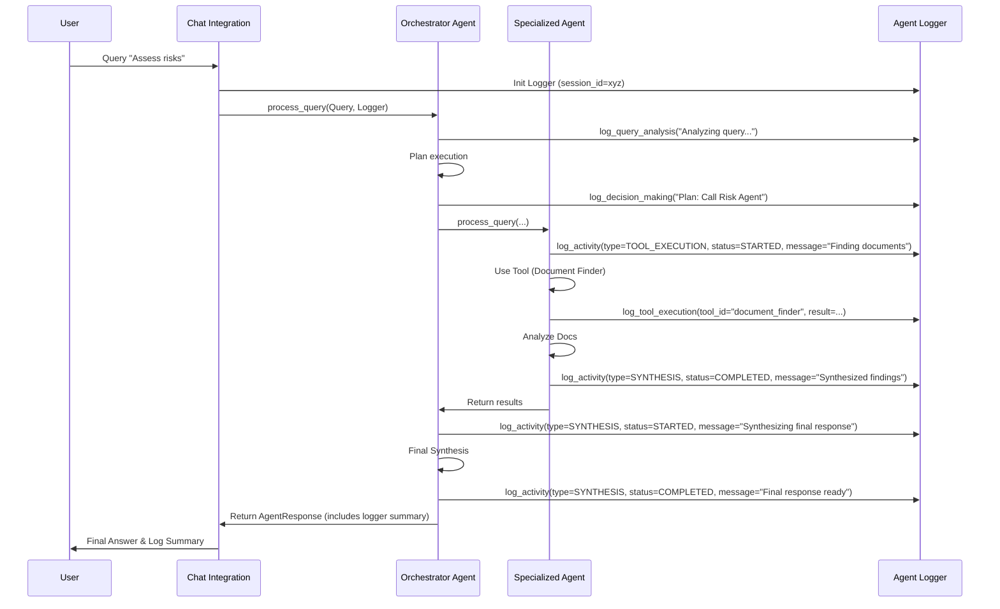

This diagram shows various components (`Orch`, `SpecAgent`) interacting with the `Logger` to record their progress and actions throughout the session.

## Agent Logger in the Code

The core logic for the Agent Logger is found in the `backend/agent_framework/agent_logger.py` file.

First, let's look at the structure of an individual log entry, defined by the `AgentLogEntry` dataclass:

```python
# backend/agent_framework/agent_logger.py (simplified AgentLogEntry)
from dataclasses import dataclass, asdict
from typing import Dict, List, Optional, Any
from enum import Enum
from datetime import datetime

class LogLevel(str, Enum): # Like INFO, ERROR, etc.
    DEBUG = "debug"
    # ... others ...

class ActivityType(str, Enum): # Like TOOL_EXECUTION, ITERATION
    QUERY_ANALYSIS = "query_analysis"
    TOOL_EXECUTION = "tool_execution"
    # ... others ...

class ActivityStatus(str, Enum): # Like STARTED, COMPLETED, FAILED
    STARTED = "started"
    COMPLETED = "completed"
    # ... others ...

@dataclass
class AgentLogEntry:
    """Individual log entry for agent activities."""
    entry_id: str # Unique ID for this log entry
    timestamp: str # When it happened (ISO format)
    agent_id: str # Which agent logged it (e.g., "orchestrator", "risk_assessment")
    agent_name: str # Human-readable name
    activity_type: ActivityType # What kind of activity (enum)
    status: ActivityStatus # Status of the activity (enum)
    level: LogLevel # Severity of the log (enum)
    message: str # Short descriptive message
    details: Dict[str, Any] # Detailed payload (parameters, results, reasoning)
    metadata: Dict[str, Any] # Other flexible info
    execution_time_ms: Optional[float] = None # How long it took
    parent_entry_id: Optional[str] = None # For nesting activities
    session_id: Optional[str] = None # Session it belongs to

    def to_dict(self) -> Dict[str, Any]:
        """Convert log entry to dictionary."""
        return asdict(self)
```
*Explanation:* This dataclass defines the structure of each log message. It includes standard logging fields like timestamp, level, and message, plus agent-specific fields like `agent_id`, `activity_type`, `status`, and a flexible `details` dictionary to store task-specific information like tool parameters or decision reasoning. The `session_id` links the entry to a specific user interaction.

Next, the `AgentLogger` class itself:

```python
# backend/agent_framework/agent_logger.py (simplified AgentLogger __init__)
import json
import uuid
import asyncio
from typing import Dict, List, Optional, Any, Union, Callable
from datetime import datetime, timezone

# ... imports for Enums and AgentLogEntry ...

class AgentLogger:
    """
    Comprehensive logging system for agent activities.
    """
    
    def __init__(self, session_id: str = None, callback: Callable = None):
        """Initialize the logger for a session."""
        self.session_id = session_id or str(uuid.uuid4()) # Assign or use provided session ID
        self.logs: List[AgentLogEntry] = [] # List to store logs chronologically
        self.callback = callback  # Optional function for real-time streaming
        self.metrics: Dict[str, Any] = { # Simple metrics for the session
            "start_time": datetime.now(timezone.utc).isoformat(),
            "total_activities": 0,
            # ... other metrics ...
        }

    # ... methods like log_activity, log_tool_execution, get_session_summary ...
```
*Explanation:* The `AgentLogger` is initialized for a specific `session_id`. It maintains a list `self.logs` to store all the `AgentLogEntry` objects created during that session. The `callback` function is stored if provided, to enable real-time streaming of logs. `self.metrics` keeps track of simple statistics for the session.

The core method for logging is `log_activity`:

```python
# backend/agent_framework/agent_logger.py (simplified log_activity)
    async def log_activity(self, agent_id: str, agent_name: str, activity_type: ActivityType,
                          status: ActivityStatus, level: LogLevel, message: str,
                          details: Dict[str, Any] = None, metadata: Dict[str, Any] = None,
                          execution_time_ms: float = None, parent_entry_id: str = None) -> str:
        """Log an agent activity with detailed information."""
        
        entry_id = str(uuid.uuid4())
        entry = AgentLogEntry(
            entry_id=entry_id,
            timestamp=datetime.now(timezone.utc).isoformat(),
            agent_id=agent_id,
            agent_name=agent_name,
            activity_type=activity_type,
            status=status,
            level=level,
            message=message,
            details=details or {},
            metadata=metadata or {},
            execution_time_ms=execution_time_ms,
            parent_entry_id=parent_entry_id,
            session_id=self.session_id
        )
        
        self.logs.append(entry) # Add to the list
        self._update_metrics(agent_id, activity_type, status, details) # Update metrics
        
        # Stream to UI if callback is provided
        if self.callback:
            await self._stream_log_entry(entry) # Call the async callback

        # Standard Python logging for server-side visibility
        log_message = f"[Session:{self.session_id}] [Agent:{agent_id}] [Activity:{activity_type.value}] [Status:{status.value}] {message}"
        if level == LogLevel.DEBUG: logger.debug(log_message)
        elif level == LogLevel.INFO: logger.info(log_message)
        elif level == LogLevel.WARNING: logger.warning(log_message)
        elif level == LogLevel.ERROR: logger.error(log_message)
        elif level == LogLevel.CRITICAL: logger.critical(log_message)
        else: logger.info(log_message) # Default to info

        return entry_id # Return ID for potential parent linking
```
*Explanation:* This is the central method that components call. It takes all the information for an activity, creates an `AgentLogEntry`, adds it to the internal list, updates session metrics, and optionally calls the `callback` to stream the log entry in real-time. It also writes a summary message to standard server-side logs.

The `AgentLogger` also provides helper methods for common activity types, making logging simpler for the calling agents:

```python
# backend/agent_framework/agent_logger.py (simplified helper methods)
    async def log_tool_execution(self, agent_id: str, agent_name: str, tool_id: str, 
                                tool_params: Dict[str, Any], result: Any, 
                                status: ActivityStatus = ActivityStatus.COMPLETED,
                                execution_time_ms: float = None, error: str = None) -> str:
        """Log tool execution with detailed parameters and results."""
        return await self.log_activity(
            agent_id=agent_id,
            agent_name=agent_name,
            activity_type=ActivityType.TOOL_EXECUTION, # Specific type
            status=status,
            level=LogLevel.INFO if status == ActivityStatus.COMPLETED else LogLevel.ERROR,
            message=f"Executed tool '{tool_id}'", # Standard message
            details={ # Structured details specific to tool execution
                "tool_id": tool_id,
                "tool_parameters": tool_params,
                "execution_result": result if status == ActivityStatus.COMPLETED else None,
                "error_message": error,
                "success": status == ActivityStatus.COMPLETED
            },
            execution_time_ms=execution_time_ms
        )

    async def log_iteration(self, agent_id: str, agent_name: str, iteration_number: int,
                           reason_for_iteration: str, context_gaps: List[str],
                           reformulated_query: str = None, execution_time_ms: float = None) -> str:
        """Log iterative processing step."""
        return await self.log_activity(
            agent_id=agent_id,
            agent_name=agent_name,
            activity_type=ActivityType.ITERATION, # Specific type
            status=ActivityStatus.IN_PROGRESS, # Often IN_PROGRESS for iteration start
            level=LogLevel.INFO,
            message=f"Starting iteration #{iteration_number}",
            details={ # Structured details specific to iteration
                "iteration_number": iteration_number,
                "reason_for_iteration": reason_for_iteration,
                "context_gaps_identified": context_gaps,
                "reformulated_query": reformulated_query
            },
            execution_time_ms=execution_time_ms
        )

    async def log_decision_making(self, agent_id: str, agent_name: str, decision_context: str,
                                 decision_made: str, reasoning: str, confidence: float = None) -> str:
        """Log agent decision-making process."""
        return await self.log_activity(
            agent_id=agent_id,
            agent_name=agent_name,
            activity_type=ActivityType.DECISION_MAKING, # Specific type
            status=ActivityStatus.COMPLETED, # Decision is usually a completed action
            level=LogLevel.INFO,
            message=f"Made decision: {decision_made}",
            details={ # Structured details specific to decision making
                "decision_context": decision_context,
                "decision_made": decision_made,
                "reasoning": reasoning,
                "confidence_score": confidence
            }
        )
    # ... similar methods for log_query_analysis, log_synthesis, etc.
```
*Explanation:* These methods are convenient wrappers around `log_activity`. They pre-fill the `activity_type` and structure the `details` dictionary appropriately for specific kinds of events (tool use, iteration, decision). Agents call these specific methods to log their actions.

Finally, the logger can provide a summary:

```python
# backend/agent_framework/agent_logger.py (simplified get_session_summary)
    def get_session_summary(self) -> Dict[str, Any]:
        """Get comprehensive session summary."""
        end_time = datetime.now(timezone.utc)
        start_time = datetime.fromisoformat(self.metrics["start_time"].replace('Z', '+00:00'))
        total_duration = (end_time - start_time).total_seconds()
        
        # Convert sets to lists for JSON serialization
        metrics = self.metrics.copy()
        metrics["agents_involved"] = list(metrics.get("agents_involved", set()))
        metrics["tools_used"] = list(metrics.get("tools_used", set()))
        metrics["end_time"] = end_time.isoformat()
        metrics["total_duration_seconds"] = total_duration
        
        # Call helper methods to get breakdown and timeline
        activity_breakdown = self._get_activity_breakdown()
        agent_performance = self._get_agent_performance()
        timeline = self._get_activity_timeline() # Chronological list of summaries

        return {
            "session_id": self.session_id,
            "metrics": metrics,
            "total_log_entries": len(self.logs),
            "activity_breakdown": activity_breakdown,
            "agent_performance": agent_performance,
            "timeline": timeline # Contains simplified entries for sequence view
            # Full logs can be accessed via self.logs if needed elsewhere
        }
    
    # ... _get_activity_breakdown, _get_agent_performance, _get_activity_timeline helper methods ...
```
*Explanation:* `get_session_summary` calculates metrics, provides breakdowns of activity types and agent performance, and creates a chronological list of summary events (`timeline`). This summary object is often included in the final `AgentResponse` metadata (as seen in the `OrchestratorAgent.process_query` method in Chapter 2's code snippet) to be returned to the user interface or calling system.

**How is it used?**

The `ChatIntegration` (as shown in its code snippet in the context files) creates the `AgentLogger` instance with a callback:

```python
# backend/agent_framework/integrations/chat_integration.py (snippet)
# ... inside process_chat_request ...
async def detailed_log_callback(log_data):
    """Forward detailed logs as specific detailed log events."""
    detailed_log_event = {
        "type": "agent_detailed_log",
        "log_entry": log_data,
        "timestamp": time.time()
    }
    await self._emit_agent_step(detailed_log_event) # This sends it to the UI stream

# Get the global orchestrator... and set the callback
agent = await get_global_orchestrator() # Or fallback
if hasattr(agent, 'set_log_callback'):
    agent.set_log_callback(detailed_log_callback) # Orchestrator stores and uses the logger with this callback
# ... then call agent.process_query(query) ...
```
*Explanation:* The `ChatIntegration` sets up an asynchronous function `detailed_log_callback` that takes log data and emits it as a specific type of step event (`agent_detailed_log`) which the frontend is listening for. It then passes this callback to the [Orchestrator Agent](#chapter-2-orchestrator-agent) using a method like `set_log_callback`.

The `OrchestratorAgent` itself, in its `process_query` method (as shown in its code snippet in the context files), initializes the `AgentLogger` for the session and uses it extensively:

```python
# backend/agent_framework/orchestrator.py (snippet inside process_query)
# Initialize detailed logger for this session
session_id = query.context.session_id if query.context else None
# Use the callback passed from ChatIntegration
self.agent_logger = AgentLogger(session_id=session_id, callback=self.log_callback) 

# Log query analysis start
await self.agent_logger.log_query_analysis(
    agent_id=self.agent_id,
    agent_name=self.name,
    query=query.query_text,
    analysis_result={"status": "starting", "query_length": len(query.query_text)}
)

# ... later, after getting analysis_result ...
await self.agent_logger.log_query_analysis(
    agent_id=self.agent_id,
    agent_name=self.name,
    query=query.query_text,
    analysis_result=analysis_result, # Log the full result this time
    execution_time_ms=analysis_time
)

# ... inside the execution loop, before calling a specialized agent ...
await self.agent_logger.log_activity(
    agent_id=agent_id, # The ID of the specialized agent being called
    agent_name=f"Specialized Agent: {agent_id}",
    activity_type=ActivityType.TOOL_EXECUTION, # Or PROCESS_STEP
    status=ActivityStatus.STARTED,
    level=LogLevel.INFO,
    message=f"Starting execution of {agent_id} agent",
    details=... # Details about the task given to the agent
)

# ... after getting agent_response ...
await self.agent_logger.log_activity(
    agent_id=agent_id,
    agent_name=f"Specialized Agent: {agent_id}",
    activity_type=ActivityType.TOOL_EXECUTION, # Or PROCESS_STEP
    status=ActivityStatus.COMPLETED,
    level=LogLevel.INFO,
    message=f"Completed execution of {agent_id} agent",
    details={ # Summary of the agent's response
        "agent_response": {
            "content_length": len(agent_response.content),
            "sources_count": len(agent_response.sources),
            # ... other details ...
        },
        "execution_time_ms": agent_execution_time
    },
    execution_time_ms=agent_execution_time # Log the time taken by the agent
)

# ... and so on for iterations, synthesis, etc. ...

# At the very end, before returning the final AgentResponse
session_summary = self.agent_logger.get_session_summary()
# Include summary in metadata
return AgentResponse(..., metadata={..., "detailed_logs": session_summary, ...})
```
*Explanation:* The `OrchestratorAgent` holds the `AgentLogger` instance (`self.agent_logger`). It calls the specific logging methods (`log_query_analysis`, `log_activity`, etc.) throughout its execution flow (planning, executing steps, handling iterations, synthesizing). It passes its own ID and name (`self.agent_id`, `self.name`) or the ID/name of the specialized agent it's calling, along with the activity type, status, and detailed context in the `details` dictionary. This builds the complete chronological log for the session. The final summary from `get_session_summary()` is packaged into the `AgentResponse`.

## Why is Agent Logger Important?

The Agent Logger is crucial for making the complex behavior of the AI system understandable and trustworthy:

*   **Debugging:** When something goes wrong, the logs provide a step-by-step trail to pinpoint exactly where and why the failure occurred.
*   **Transparency:** Users or administrators can see the AI's thought process, building trust in the system's outputs. You can show which documents were retrieved, which analysis steps were taken, and the reasoning behind decisions.
*   **Monitoring:** Logs can be analyzed to track agent performance, identify bottlenecks, or detect patterns in behavior.
*   **Auditing:** Provides a verifiable record of how specific queries were processed, which is essential for GRC applications.
*   **Development:** Developers can use the detailed logs to understand how different agents interact and how their logic is performing in real-world scenarios.

Without the Agent Logger, RegulAIte's sophisticated iterative, multi-agent capabilities would largely remain a "black box," difficult to manage, debug, and trust.

## Conclusion

In this chapter, we explored the Agent Logger, the system that keeps a detailed journal of all agent activities during a session. We learned how it records steps, tool executions, decisions, iterations, and errors, providing essential transparency into the AI's process. This logging is vital for debugging, monitoring, auditing, and building trust in the system's complex behavior.

Now that we understand how all the individual components work and how their actions are logged, how are all these pieces brought together, configured, and instantiated when the system starts? Next, we'll look at the [Factory](#chapter-10-factory).

# Chapter 10: Factory

Welcome to the final chapter of the RegulAIte beginner tutorial! We've journeyed through many essential components: the structure of requests ([Query & Query Context](#chapter-1-query--query-context)), the central conductor ([Orchestrator Agent](#chapter-2-orchestrator-agent)), the specialized workers ([Agent](#chapter-3-agent) and [Specialized Modules](#chapter-4-specialized-modules)), the tools they use ([Tool / Tool Registry](#chapter-5-tool--tool-registry)), how they talk to AI models ([LLM Integration](#chapter-6-llm-integration)) and access your data ([RAG Integration](#chapter-7-rag-integration)), how the analysis is tailored ([Organization Configuration](#chapter-8-organization-configuration)), and how we track everything ([Agent Logger](#chapter-9-agent-logger)).

We have all these powerful building blocks defined, but how do they magically appear, get set up with the right configurations (like API keys, database connections, or which agents report to the Orchestrator), and get connected to each other when you start the RegulAIte system? They don't just assemble themselves!

## What's the Problem?

Imagine you're building a complex machine out of many different parts. You have an engine, wheels, steering system, electronics, etc. You can't just put them all in a box and shake it; you need a skilled builder or a factory process to:

1.  **Create** each part (or take it from storage).
2.  **Configure** it (e.g., set tire pressure, fill the engine with oil).
3.  **Connect** the parts together in the right way (attach wheels to the axle, connect the steering wheel to the steering column).
4.  Ensure parts are ready *before* they are needed by another part (you need the engine before you can connect the fuel line).

In a software system like RegulAIte, where many classes need instances of *other* classes to work correctly (e.g., an [Orchestrator Agent](#chapter-2-orchestrator-agent) needs [Specialized Agents](#chapter-4-specialized-modules), a [Specialized Agent](#chapter-3-agent) needs an [LLM Integration](#chapter-6-llm-integration) and [RAG Integration](#chapter-7-rag-integration)), managing this creation, configuration, and connection process manually throughout your code becomes messy very quickly.

Hardcoding `my_agent = SpecificAgent(LLMIntegration(...), RAGIntegration(...), ToolRegistry(...))` everywhere makes it hard to change configurations or swap out implementations.

## Meet the Factory: The System Builder

The **Factory** in RegulAIte is the dedicated part of the system responsible for solving this problem. It's like the **central construction crew lead** or the **assembly line manager** that knows how to build and wire up all the components.

Its main job is to **create and initialize instances** of the core RegulAIte components, making sure they have everything they need to function correctly.

Here’s what the Factory does:

*   **Knows How to Build:** It contains the logic for creating instances of specific [Agents](#chapter-3-agent), [Integrations](#chapter-6-llm-integration) (LLM, RAG), [Tool Registries](#chapter-5-tool--tool-registry), etc.
*   **Manages Dependencies:** It understands which components need *other* components and ensures those dependencies are created and passed to the constructors correctly.
*   **Applies Configuration:** It takes configuration settings (like API keys, model names, paths to RAG data) and uses them during the creation process.
*   **Connects Components:** It performs necessary setup like registering specialized agents with the [Orchestrator Agent](#chapter-2-orchestrator-agent) or giving agents references to their required tools or integrations.
*   **Handles Singletons:** For components that should only have one instance (like the main [LLM Integration](#chapter-6-llm-integration) or [RAG Integration](#chapter-7-rag-integration)), the Factory often manages creating and returning that single, shared instance.

Think of the Factory as the place you go to ask for a fully assembled and ready-to-use "RegulAIte Agent System" or a specific "Compliance Agent," rather than having to gather all the nuts and bolts yourself.

## How the Factory Initializes the System

The main entry point for setting up the RegulAIte agent system is typically a function in the Factory that builds everything. In `regulaite`, this is the `initialize_complete_agent_system` function.

Here's a very simplified sequence of events that happens when you call this function during application startup:

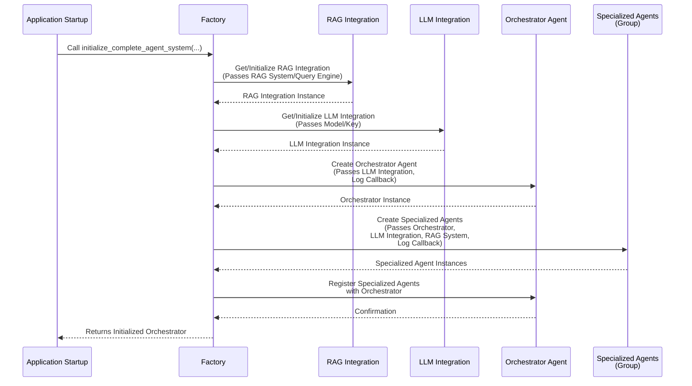

This diagram shows the Factory orchestrating the creation of the key components: the [RAG Integration](#chapter-7-rag-integration), [LLM Integration](#chapter-6-llm-integration), the main [Orchestrator Agent](#chapter-2-orchestrator-agent), and the various [Specialized Agents](#chapter-3-agent). It ensures that components that rely on others (like the Orchestrator needing the LLM client, or Specialized Agents needing LLM/RAG/Logger) receive the necessary instances during their creation or shortly after. Finally, it connects the specialized agents to the Orchestrator by registering them.

## The Factory in the Code

The core logic for creating agents and integrations is located in `backend/agent_framework/factory.py`. Let's look at simplified snippets.

First, the main function that kicks off the system initialization:

```python
# backend/agent_framework/factory.py (simplified initialize_complete_agent_system)
import logging
# ... other imports ...

from .orchestrator import OrchestratorAgent # Import the class it creates
from .integrations.rag_integration import initialize_rag_integration # Import RAG factory function
from .integrations.llm_integration import get_llm_integration # Import LLM factory function

logger = logging.getLogger(__name__)

async def initialize_complete_agent_system(rag_system=None, rag_query_engine=None, log_callback=None, **kwargs) -> OrchestratorAgent:
    """
    Initialise le système complet d'agents avec orchestrateur et agents spécialisés.
    """
    logger.info("Initialisation du système complet d'agents")
    
    # Step 1: Initialize RAG integration (often requires external systems)
    # This uses a function from the RAG integration module itself, which acts like a mini-factory
    if rag_system is not None or rag_query_engine is not None:
        initialize_rag_integration(rag_system=rag_system, rag_query_engine=rag_query_engine)
        logger.info("RAG integration initialized with provided systems")
    else:
        logger.warning("RAG system not provided. RAG-dependent agents may not function.")
        # Still initialize RAG integration singleton, but it will be empty
        initialize_rag_integration() 
        
    # Step 2: Create the Orchestrator agent
    orchestrator = await create_orchestrator_agent(log_callback=log_callback, **kwargs)
    
    # Step 3: Create and register specialized agents with the orchestrator
    specialized_agents = await create_specialized_agents(
        orchestrator=orchestrator,
        # Pass rag_system/rag_integration reference if needed by specialized agents
        rag_system=rag_system, # Or pass get_rag_integration() instance
        log_callback=log_callback,
        **kwargs
    )
    
    logger.info(f"Système d'agents initialisé avec {len(specialized_agents)} agents spécialisés")
    
    return orchestrator 
```
*Explanation:* The `initialize_complete_agent_system` function is the top-level builder. It first calls functions to set up the necessary integrations ([RAG Integration](#chapter-7-rag-integration) and [LLM Integration](#chapter-6-llm-integration) - note that `get_llm_integration` is called internally by `create_orchestrator_agent` and `create_specialized_agents`), then calls `create_orchestrator_agent` to build the main orchestrator, and finally calls `create_specialized_agents` to build all the worker agents and register them with the orchestrator instance it just created. It takes external dependencies like the actual `rag_system` object or a `log_callback` as arguments, allowing the application's entry point to control these.

Let's look at a simplified version of `create_specialized_agents`:

```python
# backend/agent_framework/factory.py (simplified create_specialized_agents)
from typing import Dict # For type hints
# ... other imports ...

from .agent import Agent # Base class for Agents
from .integrations.llm_integration import get_llm_client # To get the LLM singleton
from .integrations.rag_integration import get_rag_integration # To get the RAG singleton
from .agent_logger import AgentLogger # To create loggers for agents

async def create_specialized_agents(
    orchestrator: OrchestratorAgent, # Needs the orchestrator instance to register agents
    rag_system = None, # Or rag_integration_instance could be passed
    log_callback = None,
    **kwargs
) -> Dict[str, Agent]:
    """
    Crée et enregistre les agents spécialisés dans l'orchestrateur.
    """
    logger.info("Création des agents spécialisés")
    
    specialized_agents = {}
    
    # Get shared dependencies that many agents will need
    llm_client = get_llm_client() # Get the singleton LLM instance
    rag_integration_instance = get_rag_integration(rag_system=rag_system) # Get or initialize RAG singleton

    # Create agents one by one with individual error handling
    # Example: Risk Assessment Agent
    try:
        # Import the specific agent class
        from .modules.risk_assessment_module import RiskAssessmentModule 
        
        # Create an instance, passing its dependencies
        risk_agent = RiskAssessmentModule(
            llm_client=llm_client, # Pass the shared LLM instance
            agent_logger=AgentLogger(callback=log_callback) if log_callback else None, # Create logger for this agent
            rag_system=rag_integration_instance # Pass the shared RAG instance
        )
        specialized_agents["risk_assessment"] = risk_agent # Store in dictionary
        orchestrator.register_agent("risk_assessment", risk_agent) # Register with orchestrator
        logger.info("Created RiskAssessmentModule...")
    except Exception as e:
        logger.error(f"Could not create risk_assessment agent: {e}")
        # Fallback logic might create a simpler agent if the complex one fails
        try:
             # create_rag_agent is another factory function for RAG agents
             fallback_agent = await create_rag_agent(
                 agent_id="risk_assessment",
                 name="Agent d'Évaluation des Risques",
                 **kwargs # Pass relevant config
             )
             specialized_agents["risk_assessment"] = fallback_agent
             orchestrator.register_agent("risk_assessment", fallback_agent)
             logger.info("Created fallback RAG agent for risk_assessment")
        except Exception as fallback_e:
             logger.error(f"Could not create fallback risk_assessment agent: {fallback_e}")

    # Example: Document Finder Agent
    try:
        from .modules.document_finder_agent import DocumentFinderAgent
        
        document_finder_agent = DocumentFinderAgent(
            agent_id="document_finder",
            name="Agent de Recherche de Documents",
            # This agent's internal tool will use the RAG integration
            rag_system=rag_integration_instance 
        )
        specialized_agents["document_finder"] = document_finder_agent
        orchestrator.register_agent("document_finder", document_finder_agent)
        logger.info("Created DocumentFinderAgent...")
    except Exception as e:
         logger.error(f"Could not create document_finder agent: {e}")
         # Fallback to RAG agent
         try:
              fallback_agent = await create_rag_agent(
                  agent_id="document_finder",
                  name="Agent de Recherche de Documents",
                  **kwargs
              )
              specialized_agents["document_finder"] = fallback_agent
              orchestrator.register_agent("document_finder", fallback_agent)
              logger.info("Created fallback RAG agent for document_finder")
         except Exception as fallback_e:
              logger.error(f"Could not create fallback document_finder agent: {fallback_e}")

    # ... code for creating other specialized agents (Compliance, Governance, etc.) ...
    
    return specialized_agents
```
*Explanation:* The `create_specialized_agents` function receives the `orchestrator` instance. It first gets the singleton instances of the [LLM Integration](#chapter-6-llm-integration) and [RAG Integration](#chapter-7-rag-integration) using their respective helper functions (`get_llm_client`, `get_rag_integration`). Then, for each type of specialized agent (Risk, Document Finder, Compliance, etc.), it uses a `try...except` block to:
1.  Import the specific agent class (e.g., `RiskAssessmentModule`).
2.  Create an instance of the class, passing the necessary dependencies (like `llm_client`, `rag_system`, and a new `AgentLogger` configured with the session's `log_callback`).
3.  Register the newly created agent instance with the `orchestrator` instance using `orchestrator.register_agent()`.
4.  Log success or handle errors, potentially creating a simpler fallback agent if the main one fails.

Notice how the factory functions like `create_specialized_agents` don't contain the *logic* of the agents themselves, nor do they contain the complex setup for the LLM or RAG connections. They simply orchestrate the *creation* of these objects and *pass* the necessary dependencies to their constructors or setup methods. This adheres to the principle of **Dependency Injection**, where components receive their dependencies rather than creating them themselves, which makes the code much more modular and testable.

The Factory also contains helper functions like `create_rag_agent` and `get_agent_instance`. `create_rag_agent` is a dedicated factory function for creating instances of the generic `RAGAgent` (a type of [Agent](#chapter-3-agent) specializing in RAG interactions), often used here as a fallback. `get_agent_instance` provides a simple cache to return existing agent instances if they've already been created, preventing unnecessary re-creation.

## Why is the Factory Important?

Using a Factory pattern is crucial for a complex system like RegulAIte because it provides:

*   **Centralized Creation Logic:** All the code for *how* to build and configure the system's components lives in one place (`factory.py`), making it easy to understand the system's structure.
*   **Decoupling:** Components ([Agents](#chapter-3-agent), [Integrations](#chapter-6-llm-integration)) don't need to know *how* their dependencies (like the [LLM Client](#chapter-6-llm-integration) or [Tool Registry](#chapter-5-tool--tool-registry)) are created; they just expect to receive them. This makes the code cleaner and components more independent.
*   **Easier Configuration:** You can change how components are configured (e.g., switch LLM models, change RAG parameters) by modifying only the Factory, without touching the code of the agents themselves.
*   **Simplified Testing:** For testing, you can create components directly in your test code, providing mock or dummy dependencies instead of needing the full, complex setup managed by the Factory.
*   **Manages Complexity:** It handles the potentially complex graph of dependencies between components, ensuring everything is created and connected in the correct order.
*   **Flexibility:** Makes it easier to add new types of agents, tools, or integrations, or to provide alternative implementations (like a different LLM provider) by adding or modifying logic in the Factory.

The Factory is the unseen backbone that sets up the stage for the entire agent system to operate. Without it, getting all the pieces configured and working together would be a much more difficult and error-prone process.

## Conclusion

In this final chapter, we explored the Factory, the essential component responsible for creating, configuring, and connecting all the other pieces of the RegulAIte agent framework. We learned how it acts as a central builder, managing dependencies and applying configuration to assemble the complete system from components like the [Orchestrator Agent](#chapter-2-orchestrator-agent), [Specialized Agents](#chapter-3-agent), and various [Integrations](#chapter-6-llm-integration) and [Tools](#chapter-5-tool--tool-registry).

This concludes our beginner-friendly tutorial on the core concepts of the RegulAIte agent framework. You now have a foundational understanding of how user queries are processed by a sophisticated multi-agent system designed for GRC analysis, leveraging AI and your organization's data. We hope this guide empowers you to explore the codebase further and contribute to the project!
