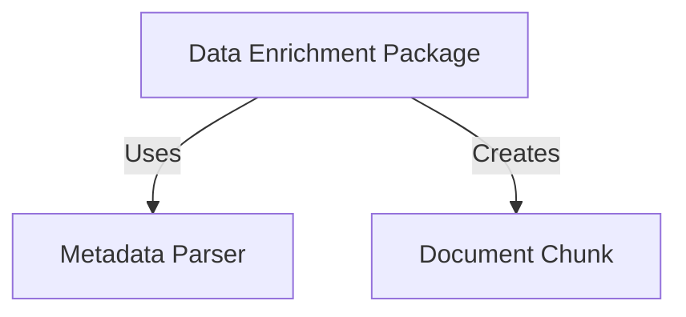
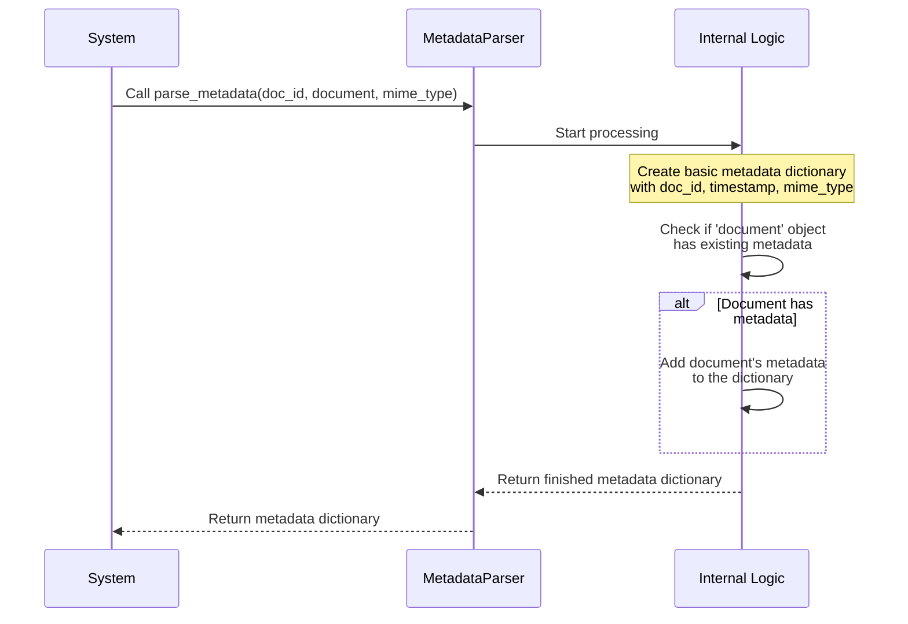

# Tutorial: Data Enrichemnt RegulAIte

This part of the project, the **Data Enrichment Package**, acts like a
*mini-factory* for processing raw documents. It uses a **Metadata Parser**
to extract basic information about a document (like its type and ID), and
then breaks the document into smaller, manageable pieces called
**Document Chunks**. This process prepares the document data to be easily
searched and used by other parts of the system.


## Visual Overview



## Chapters

1. [Data Enrichment Package](#chapter-1-data-enrichment-package)
2. [Document Chunk](#chapter-2-document-chunk)
3. [Metadata Parser](#chapter-3-metadata-parser)

# Chapter 1: Data Enrichment Package

Welcome to the RegulAIte tutorial! In this first chapter, we're going to look at a core part of how RegulAIte understands and works with documents: the Data Enrichment Package.

Imagine you have a huge pile of paper documents – maybe laws, regulations, policies, or articles. To find specific information quickly or understand connections between them, just reading through everything is impossible! You need a way to process them, make them organized, and add helpful notes or structure.

That's exactly what the **Data Enrichment Package** does for RegulAIte, but for digital documents. Think of it as a mini-factory that takes in raw document files and transforms them into something much more useful and searchable for the rest of the RegulAIte system.

Its main job is to take raw document content and "enrich" it. What does "enrich" mean here? It means adding structured information that wasn't immediately obvious in the raw text. This makes the documents easier for computers (like RegulAIte) to process, analyze, and retrieve information from later on.

## What Problem Does it Solve?

Let's consider a central use case for RegulAIte: finding specific information within a large set of regulations based on a question.

If RegulAIte just had the raw text of a hundred different regulations, answering a question like "What are the requirements for data privacy notifications?" would be incredibly difficult. It would be like looking for a specific sentence across hundreds of unindexed books.

The **Data Enrichment Package** solves this by processing these documents *before* you even ask a question. It prepares the documents so that RegulAIte knows:

1.  Where different pieces of information are.
2.  What each piece is about (in a structured way).
3.  Which larger document each piece belongs to.

This pre-processing step is crucial and makes searching and analysis fast and effective later.

## The Mini-Factory's Key Concepts

The Data Enrichment Package isn't just one big magical box. It's built using specific tools and concepts that work together. The two main concepts you'll encounter are:

1.  **Document Chunk:** Raw documents are often too large to process all at once. The enrichment process breaks them down into smaller, more manageable pieces called "chunks." Each chunk is like a paragraph, a section, or a specific element from the original document.
2.  **Metadata Parser:** As the document is processed, the Metadata Parser extracts or creates extra information *about* the document itself (like its ID or source) and potentially about each individual chunk (like which page it came from, or what type of element it is, like text or a table). This extra information is called "metadata."

These two concepts work hand-in-hand. The document is broken into [Document Chunks](#chapter-2-document-chunk), and the [Metadata Parser](#chapter-3-metadata-parser) adds relevant context (metadata) to each chunk and the overall document.

## How the Enrichment Factory Works (A Simple View)

Let's visualize the basic flow inside this package.

```mermaid
graph LR
    A[Raw Document] --> B[Data Enrichment Package];
    B --> C[Break into smaller pieces];
    C --> D[Add Metadata to pieces];
    D --> E[Create Document Chunks];
    E --> F[Enriched Data (Chunks with Metadata)];
```

1.  **Raw Document enters:** You provide the Data Enrichment Package with a document.
2.  **Break into pieces:** The package (or components it uses) splits the large document into smaller segments.
3.  **Add Metadata:** Information about the original document (like its title or unique ID) and information specific to each piece (like its page number) is gathered or generated.
4.  **Create Document Chunks:** Each small piece of text is packaged together with its relevant metadata into a `DocumentChunk` object.
5.  **Enriched Data Out:** The result is a collection of `DocumentChunk` objects, ready to be stored and used by other parts of RegulAIte.

## Looking at the Code (Simple Steps)

The code for this package is located in the `backend/data_enrichment` directory. Let's peek at how the main components are made available.

The file `backend/data_enrichment/__init__.py` acts like the front door of the package. It tells you what's inside and ready to be used:

```python
# backend/data_enrichment/__init__.py
"""
Data enrichment package for RegulAIte.
"""

from .metadata_parser import MetadataParser
from .document_chunk import DocumentChunk

__all__ = ["MetadataParser", "DocumentChunk"]
```

This little file is important. It shows that the Data Enrichment Package mainly provides access to the `MetadataParser` and `DocumentChunk` tools we just talked about. The `__all__` list explicitly states these are the main things you're intended to use from this package.

Now, let's see how these might be *used* in a very simple, conceptual way to start the enrichment process (this isn't the full process, just showing the components):

```python
# This is conceptual usage, not a runnable script
from backend.data_enrichment import MetadataParser, DocumentChunk

# Imagine you have a raw document and a unique ID for it
doc_id = "my-first-regulation-doc-123"
raw_document_content = "This is the first section. It talks about privacy..."

# Step 1: Use the Metadata Parser to get basic info about the whole document
parser = MetadataParser()
doc_metadata = parser.parse_metadata(doc_id=doc_id, document=raw_document_content, mime_type="text/plain")

print(f"Parsed document metadata: {doc_metadata}")

# Step 2: Imagine breaking the document into chunks (this part isn't shown in detail here)
# Let's say we got one chunk:
chunk_text = "This is the first section. It talks about privacy..."
chunk_page = 1 # Imagine we know this from parsing

# Step 3: Create a Document Chunk object for this piece
# We add info specific to the chunk, AND the overall doc info
chunk = DocumentChunk(
    doc_id=doc_id,
    text=chunk_text,
    page_num=chunk_page,
    metadata=doc_metadata # We can include doc metadata here too
)

print(f"Created a chunk object: {chunk.chunk_id}")
print(f"Chunk text: {chunk.text[:30]}...") # Show a bit of the text
print(f"Chunk page: {chunk.page_num}")
print(f"Chunk metadata includes doc_id: {chunk.metadata.get('doc_id')}")
```

This example shows how you'd import and create instances of `MetadataParser` and `DocumentChunk`. The parser is used first to get overall document info, and then this info, along with the chunk's specific text and page, is used to create a `DocumentChunk` object. This `DocumentChunk` object is the structured output we need.

## Under the Hood

Let's briefly peek inside the files to see what the `MetadataParser` and `DocumentChunk` look like.

The `MetadataParser` (`backend/data_enrichment/metadata_parser.py`) is quite simple. It's a class with one main method:

```python
# backend/data_enrichment/metadata_parser.py (simplified)

import time
import logging

logger = logging.getLogger(__name__)

class MetadataParser:
    """Simple metadata parser for document processing."""

    def parse_metadata(self, doc_id: str, document: any, mime_type: str = None) -> dict:
        """
        Parse metadata from a document.
        ... (docstring continues)
        """
        logger.info(f"Parsing metadata for doc_id: {doc_id}")
        metadata = {
            "doc_id": doc_id,
            "timestamp": time.time(), # Adds when it was processed
            "mime_type": mime_type or "text/plain", # Adds the file type
        }

        # If the document object itself has a 'metadata' attribute, add it
        if hasattr(document, "metadata"):
             metadata.update(document.metadata)
             logger.debug("Added document's internal metadata.")


        return metadata
```

Its `parse_metadata` method takes the document ID, the document content itself, and the MIME type. It creates a basic dictionary with the ID, a timestamp, and the MIME type. If the `document` object passed in happens to already have its own `metadata` attribute (like some complex document objects might), it adds that too. It's designed to be simple and extensible.

The `DocumentChunk` (`backend/data_enrichment/document_chunk.py`) is a bit more complex because it defines the structure for our enriched data pieces:

```python
# backend/data_enrichment/document_chunk.py (simplified)

import uuid
from typing import Dict, Any, List, Optional
from pydantic import BaseModel, Field # Uses Pydantic for structure

class DocumentChunk(BaseModel):
    """
    Represents a chunk of a document with metadata and embedding.
    ... (docstring continues)
    """
    
    chunk_id: uuid.UUID = Field(default_factory=uuid.uuid4) # Unique ID for this chunk
    doc_id: str # ID of the original document
    text: str # The actual text content of the chunk
    content: str = "" # Alias for text
    embedding: List[float] = [] # Placeholder for later - vector representation
    metadata: Dict[str, Any] = {} # Dictionary to hold extra info
    page_num: Optional[int] = None # Which page it came from (if applicable)
    element_type: str = "text" # What kind of element it is (text, table, image, etc.)

    # There's also an __init__ method to set defaults and sync text/content
    # And methods like to_dict and from_dict for converting to/from dictionaries
```

This class uses `Pydantic` (a Python library) to clearly define what information a `DocumentChunk` object must hold. Key fields include a unique `chunk_id`, the `doc_id` of the original document, the `text` content, and a `metadata` dictionary to store all the extra context we talked about (like page number, etc.). It's designed to hold all the necessary information for a single, searchable piece of a document.

## Conclusion

The **Data Enrichment Package** is the crucial first step in making raw documents useful for RegulAIte. It acts as a factory that processes documents, using tools like the [Metadata Parser](#chapter-3-metadata-parser) to add context and structuring the output into manageable [Document Chunks](#chapter-2-document-chunk). This process transforms unstructured text into organized, "rich" data that can be easily searched and analyzed in later stages of the RegulAIte system.

In the next chapter, we'll dive deeper into one of the key outputs of this package: the [Document Chunk](#chapter-2-document-chunk). You'll learn more about its structure and why breaking documents into chunks is so important.

# Chapter 2: Document Chunk

Welcome back! In the last chapter, we were introduced to the [Data Enrichment Package](#chapter-1-data-enrichment-package) – the factory that processes your raw documents to make them useful for RegulAIte. We learned that this package uses two main concepts: [Metadata Parser](#chapter-3-metadata-parser) and **Document Chunk**.

Now, let's dive deeper into one of the most fundamental pieces of data within RegulAIte: the **Document Chunk**.

## What Problem Does the Document Chunk Solve?

Imagine you have a giant legal document, maybe hundreds of pages long. If you want to find the specific part that talks about "data privacy requirements for minors," how would you do it quickly?

You probably wouldn't read the entire document from start to finish every time you had a question. Instead, you'd likely:

1.  Look at the table of contents or index to find relevant sections.
2.  Scan headings and paragraphs within those sections.
3.  Find the specific paragraphs or sentences that contain the information you need.

Computers face a similar challenge. Processing and searching a massive document all at once is slow and inefficient. If you ask a system a question, you don't usually want the *entire* document back; you want the *specific parts* that answer your question.

This is where the **Document Chunk** comes in.

## What is a Document Chunk?

Think of a large book broken down into individual pages or perhaps significant paragraphs. Each **Document Chunk** is like one of these smaller, self-contained pieces from your original document.

Instead of dealing with the whole document as one massive block, RegulAIte breaks it down into these smaller chunks. Each chunk is small enough to be easily processed and understood, while still containing meaningful information.

But a Document Chunk isn't *just* the text. It's a structured package that contains:

*   The **text content** of that specific piece.
*   A unique **ID** for *this* chunk.
*   An **ID** linking it back to the **original document**.
*   Extra **metadata** – helpful information *about* this chunk (like which page it came from, or what type of content it is).
*   (Later, we'll add) A **numerical representation** (an "embedding") that helps computers quickly find similar chunks.

So, a Document Chunk is the basic building block for searching and analyzing documents in RegulAIte. Instead of searching the whole "book", RegulAIte searches through a collection of "pages" (chunks).

## Why Break Documents into Chunks?

Breaking documents into chunks makes everything much easier and faster:

*   **Targeted Search:** When you search, RegulAIte can find the *specific chunk(s)* relevant to your query, not just the entire document. This gives you more precise results.
*   **Efficient Processing:** Large documents are hard for AI models to handle. Chunks are smaller and fit nicely into the limits of processing tools.
*   **Easier Updates:** If only a small part of a document changes, you might only need to update or re-process the affected chunks, not the whole document.
*   **Structured Information:** By attaching metadata to each chunk, we add valuable context that improves search and analysis.

## The Key Information in a Document Chunk

The `DocumentChunk` object in RegulAIte is designed to hold all the necessary information about a single piece of a document. It's like a detailed label attached to each "page" or "paragraph".

Here are the main pieces of information a `DocumentChunk` typically holds:

| Field         | Description                                                                 | Example                 |
| :------------ | :-------------------------------------------------------------------------- | :---------------------- |
| `chunk_id`    | A unique identifier *for this specific chunk*.                              | `a1b2c3d4-e5f6-7890...` |
| `doc_id`      | The identifier of the original document this chunk came from.               | `"GDPR-2016-679"`       |
| `text`        | The actual text content of the chunk.                                       | `"Article 6, paragraph 1 states..."` |
| `metadata`    | A dictionary holding extra details about the chunk and/or document.         | `{"page_num": 5, "section_title": "Lawful Processing"}` |
| `page_num`    | Which page number this chunk appeared on (if applicable).                   | `5`                     |
| `element_type`| What type of content this chunk represents (e.g., text, table, title).      | `"text"`                |
| `embedding`   | A numerical list representing the meaning of the text (for search).         | `[0.1, -0.5, 0.9, ...]` |

This structured format ensures that when RegulAIte finds a chunk, it knows *what* the text is, *where* it came from (both the document and potentially the page/section), and any other relevant context captured in the metadata.

## How are Document Chunks Created?

As we saw in the previous chapter, the [Data Enrichment Package](#chapter-1-data-enrichment-package) is responsible for creating `DocumentChunk` objects.

The general process involves:

1.  Taking the raw document content.
2.  Using logic (often called a "chunking strategy") to split the document into smaller pieces based on rules (e.g., split by paragraph, by section, by a fixed number of characters, etc.).
3.  For each piece of text created in step 2, gathering relevant information like the original `doc_id`, potentially the page number, section title, etc. (this is often where the [Metadata Parser](#chapter-3-metadata-parser) helps!).
4.  Packaging the text, the unique chunk ID, the original document ID, and all the gathered metadata into a `DocumentChunk` object.

Let's revisit the simple example from Chapter 1 showing how a `DocumentChunk` object is created conceptually:

```python
# This is conceptual usage, showing chunk creation
from backend.data_enrichment import DocumentChunk

# Assume you have already processed the raw document
# and obtained the text for a piece, the doc ID, and some metadata

doc_id = "my-first-regulation-doc-123"
chunk_text = "This is the first section. It talks about privacy..."
chunk_page = 1
chunk_metadata = {"source_file": "reg.pdf", "section": "Introduction"} # Metadata for this chunk

# Step 3: Create a Document Chunk object for this piece
chunk = DocumentChunk(
    doc_id=doc_id,
    text=chunk_text,
    page_num=chunk_page,
    metadata=chunk_metadata
)

print(f"Created a chunk object with ID: {chunk.chunk_id}")
print(f"Belongs to document: {chunk.doc_id}")
print(f"Text content: {chunk.text[:50]}...") # Show first 50 chars
print(f"Metadata: {chunk.metadata}")
print(f"Page number: {chunk.page_num}")
```

This code snippet shows that creating a `DocumentChunk` object is straightforward once you have the pieces of information ready. You provide the essential details like `doc_id`, `text`, and `metadata` when you create it. The `chunk_id` is automatically generated for you.

## Under the Hood: The `DocumentChunk` Class

Let's peek into the actual `DocumentChunk` code file (`backend/data_enrichment/document_chunk.py`) to see how this structure is defined.

```python
# backend/data_enrichment/document_chunk.py (simplified)

import uuid
from typing import Dict, Any, List, Optional
from pydantic import BaseModel, Field # Uses Pydantic for structure

class DocumentChunk(BaseModel):
    """
    Represents a chunk of a document with metadata and embedding.
    """
    
    chunk_id: uuid.UUID = Field(default_factory=uuid.uuid4) # Unique ID for this chunk
    doc_id: str # ID of the original document
    text: str # The actual text content of the chunk
    content: str = "" # Alias for text
    embedding: List[float] = [] # Placeholder for later - vector representation
    metadata: Dict[str, Any] = {} # Dictionary to hold extra info
    page_num: Optional[int] = None # Which page it came from (if applicable)
    element_type: str = "text" # What kind of element it is (text, table, image, etc.)

    # ... __init__ method and to_dict/from_dict methods below ...
```

This uses a library called `Pydantic`, which helps define data structures in Python very clearly. It ensures that any `DocumentChunk` object you create will have these specific fields (`chunk_id`, `doc_id`, `text`, etc.) and that they will be of the expected type (like a string for `doc_id`, a list of numbers for `embedding`, a dictionary for `metadata`, etc.).

The `Field(default_factory=uuid.uuid4)` part for `chunk_id` is a neat Pydantic feature that means if you don't provide a `chunk_id` when creating the object, it will automatically generate a unique one using Python's `uuid` library.

The code also includes helpful methods like `to_dict()` and `from_dict()`.

```python
# backend/data_enrichment/document_chunk.py (simplified)

class DocumentChunk(BaseModel):
    # ... fields defined above ...

    def __init__(self, **data):
        super().__init__(**data)
        # Ensure content and text are synchronized
        if not self.content and self.text:
            self.content = self.text
        elif not self.text and self.content:
            self.text = self.content
            
        # Ensure doc_id and chunk_id are also present in metadata for easier searching
        if "doc_id" not in self.metadata:
            self.metadata["doc_id"] = self.doc_id
        if "chunk_id" not in self.metadata:
            self.metadata["chunk_id"] = str(self.chunk_id)
            
        # ... other metadata syncing ...

    def to_dict(self) -> Dict[str, Any]:
        """Convert the chunk to a dictionary."""
        return {
            "chunk_id": str(self.chunk_id), # Convert UUID to string for dictionary
            "doc_id": self.doc_id,
            "text": self.text,
            "content": self.content,
            "metadata": self.metadata,
            "page_num": self.page_num,
            "element_type": self.element_type
            # embedding is often handled separately or stored differently
        }
    
    @classmethod
    def from_dict(cls, data: Dict[str, Any]):
        """Create a chunk from a dictionary."""
        # ... logic to handle different names and convert chunk_id back to UUID ...
        return cls(**data)
```

*   The `__init__` method is called when you create a `DocumentChunk` object. It does some automatic cleanup and ensures that important IDs (`doc_id`, `chunk_id`) are also stored inside the `metadata` dictionary, which can be useful for certain databases. It also syncs the `text` and `content` fields.
*   The `to_dict()` method is useful for converting the `DocumentChunk` object into a standard Python dictionary. This format is often needed when you want to save the chunk data to a database or send it over a network. Notice it converts the `chunk_id` (which is a `uuid.UUID` object) into a string, as dictionaries usually work best with simpler types.
*   The `from_dict()` method does the opposite: it takes a dictionary (like the one you'd get from `to_dict()`) and turns it back into a `DocumentChunk` object.

These methods make it easy to work with `DocumentChunk` objects – create them, access their information, and convert them for storage or transfer.

## Conclusion

The **Document Chunk** is a core concept in RegulAIte. It represents a small, manageable, and structured piece of a larger document. By breaking down documents into chunks, RegulAIte can process, search, and analyze information much more efficiently and provide more targeted results. Each chunk contains the essential text, identifiers linking it back to its origin, and crucial metadata that adds context.

Now that we understand what a `DocumentChunk` is, let's explore the next concept in the [Data Enrichment Package](#chapter-1-data-enrichment-package) workflow: the [Metadata Parser](#chapter-3-metadata-parser), which helps add that valuable extra information to the chunks.

# Chapter 3: Metadata Parser

Welcome back to the RegulAIte tutorial! In the first two chapters, we learned about the [Data Enrichment Package](#chapter-1-data-enrichment-package) – the process that transforms raw documents into useful data – and the [Document Chunk](#chapter-2-document-chunk) – the small, structured pieces that documents are broken into.

Now, let's explore another key player in the [Data Enrichment Package](#chapter-1-data-enrichment-package): the **Metadata Parser**.

## What Problem Does the Metadata Parser Solve?

Imagine you're a librarian receiving a new book. Before you put it on the shelf, you need to know some basic things: What's the title? Who's the author? When was it published? What's its unique ID in your system? You need this information *about* the book (the "metadata") so you can organize it, find it later, and decide how to process it.

In the world of RegulAIte, when a new digital document (like a PDF regulation or a policy file) comes in, we need to gather similar basic facts about it automatically. We need to know:

*   What kind of file is it (e.g., PDF, text)?
*   When was it received or processed?
*   What unique ID does RegulAIte assign to it?
*   Are there any other high-level details already known about this document?

Doing this manually for hundreds or thousands of documents would be impossible. This is the problem the **Metadata Parser** solves. It acts like an automated librarian that quickly scans the incoming document's initial information and pulls out or generates these essential facts.

## What is a Metadata Parser?

A **Metadata Parser** is a tool specifically designed to extract or create "metadata" for a document. Metadata is simply "data about data". In the context of a document, it's structured information that describes the document itself, rather than being part of its main content.

The Metadata Parser in RegulAIte is designed to be simple but effective. Its main job is to take a raw document and assign some fundamental identifiers and properties to it as soon as it enters the system's processing pipeline.

This initial metadata is crucial because it travels with the document throughout the [Data Enrichment Package](#chapter-1-data-enrichment-package) process. As the document is broken down into [Document Chunks](#chapter-2-document-chunk), this core metadata (like the document's unique ID) is attached to *each* chunk, linking them all back to the original source document.

## How to Use the Metadata Parser

The `MetadataParser` is part of the `data_enrichment` package we saw in Chapter 1. Using it is quite straightforward. You create an instance of the parser and then call its `parse_metadata` method, providing the necessary information about the document.

Let's look at a simple example, similar to the one we saw in Chapter 1:

```python
# This is a conceptual example showing how to use MetadataParser
from backend.data_enrichment import MetadataParser

# Imagine you have a document ID and some content
doc_id = "example-policy-2023-A"
# In reality, 'raw_document' could be the actual file content or an object
raw_document = "This is the text of the policy..." 
mime_type = "text/plain"

# 1. Create a MetadataParser instance
parser = MetadataParser()

# 2. Use the parser to get metadata for the document
doc_metadata = parser.parse_metadata(
    doc_id=doc_id,
    document=raw_document,
    mime_type=mime_type
)

# 3. Look at the result
print("--- Generated Metadata ---")
print(f"Document ID: {doc_metadata.get('doc_id')}")
print(f"Processed Timestamp: {doc_metadata.get('timestamp')}")
print(f"File Type (MIME): {doc_metadata.get('mime_type')}")
print(f"Full metadata dictionary: {doc_metadata}")
```

When you run this conceptual code (or equivalent logic in the real system), the `parser.parse_metadata` method will generate a dictionary containing the basic metadata.

Here's what the output might look like:

```
--- Generated Metadata ---
Document ID: example-policy-2023-A
Processed Timestamp: 1678886400.123456 # The exact number will vary
File Type (MIME): text/plain
Full metadata dictionary: {'doc_id': 'example-policy-2023-A', 'timestamp': 1678886400.123456, 'mime_type': 'text/plain'}
```

As you can see, the parser took the inputs you gave (`doc_id`, `mime_type`) and added some standard information (`timestamp`) to create a simple metadata dictionary. This dictionary is the output of the `MetadataParser`.

This dictionary is then used by other parts of the [Data Enrichment Package](#chapter-1-data-enrichment-package), particularly when creating [Document Chunks](#chapter-2-document-chunk), to ensure each chunk knows which document it belongs to and when that document was processed.

## Under the Hood: How it Works

Let's peek behind the curtain to see what the `MetadataParser` does internally when you call `parse_metadata`.

Here's a simplified sequence of what happens:



Essentially, the `MetadataParser`'s `parse_metadata` method performs these steps:

1.  **Initialize Metadata:** It creates a new Python dictionary.
2.  **Add Core Info:** It immediately adds the `doc_id` provided, the current time (as a `timestamp`), and the `mime_type` to this dictionary.
3.  **Check Document:** It looks at the `document` object that was passed in. Sometimes, the object representing the document might *already* have a `metadata` attribute (for example, if it came from a system that already extracted some details).
4.  **Include Existing Metadata:** If the `document` object *does* have a `metadata` attribute, the parser takes that existing metadata and adds it to the dictionary it's building, potentially overriding default values if there are conflicts (though in this simple version, it just updates).
5.  **Return:** The method finishes and returns the completed metadata dictionary.

This makes the parser flexible: it can generate basic metadata itself, but it can also incorporate metadata that might have come from another source earlier in the pipeline.

Let's look at the code in `backend/data_enrichment/metadata_parser.py`:

```python
# backend/data_enrichment/metadata_parser.py (simplified)

import time
import logging
from typing import Dict, Any, Optional # Helps define types

logger = logging.getLogger(__name__)

class MetadataParser:
    """Simple metadata parser for document processing."""
    
    def __init__(self):
        """Initialize metadata parser."""
        logger.info("Initializing metadata parser") # Just logs a message
    
    def parse_metadata(self, doc_id: str, document: Any, mime_type: str = None) -> Dict[str, Any]:
        """
        Parse metadata from a document.
        """
        logger.info(f"Parsing metadata for doc_id: {doc_id}") # Logs which doc is being processed
        
        # Create the basic metadata dictionary
        metadata = {
            "doc_id": doc_id,
            "timestamp": time.time(), # Get the current time
            "mime_type": mime_type or "text/plain", # Use provided type or default
        }
        
        # Check if the document object itself has metadata
        if hasattr(document, "metadata"):
             # If it does, add/update the metadata dictionary with it
             metadata.update(document.metadata)
             logger.debug("Added document's internal metadata.")

        # Return the final dictionary
        return metadata
```

This code is very minimal, reflecting the simple but important job of the `MetadataParser`.

*   The `__init__` method doesn't do much yet, just sets up logging.
*   The `parse_metadata` method takes the `doc_id`, `document` (which can be any type, indicated by `Any`), and optional `mime_type`.
*   It uses `time.time()` to get a numeric timestamp (seconds since a standard reference point).
*   `mime_type or "text/plain"` is a Python trick meaning "use the `mime_type` if it was provided, otherwise use `"text/plain"`".
*   `hasattr(document, "metadata")` checks if the `document` object has an attribute named `metadata`.
*   `metadata.update(document.metadata)` adds all key-value pairs from `document.metadata` into the `metadata` dictionary being built. If a key (like `doc_id` or `timestamp`) exists in both, the one from `document.metadata` will overwrite the one created initially.

This simple structure allows the `MetadataParser` to reliably produce a dictionary of core information for every document processed by the [Data Enrichment Package](#chapter-1-data-enrichment-package).

## Conclusion

The **Metadata Parser** is a fundamental component of the [Data Enrichment Package](#chapter-1-data-enrichment-package). Its job is to automatically extract or generate basic but essential information – metadata – about an incoming document. By providing facts like the document's unique ID, processing timestamp, and file type, it creates crucial context that follows the document throughout the processing pipeline, including being attached to the [Document Chunks](#chapter-2-document-chunk). This ensures that every piece of data within RegulAIte is clearly linked back to its origin and includes valuable descriptive information.

We've now covered the two core outputs and key concepts of the [Data Enrichment Package](#chapter-1-data-enrichment-package): the [Document Chunk](#chapter-2-document-chunk) (the pieces of the document) and the **Metadata Parser** (the tool that provides information *about* those pieces and the original document).

This concludes our look at these foundational components. You now understand how documents start their journey in RegulAIte, being processed and structured into manageable, informative chunks ready for searching and analysis.
