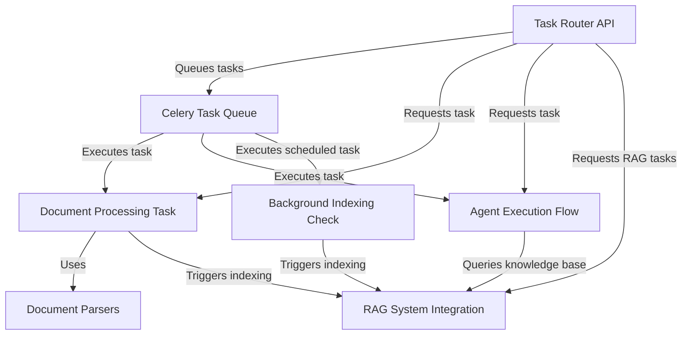
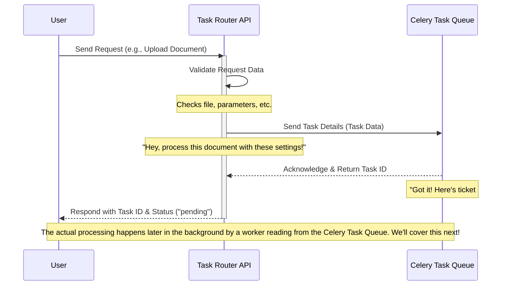
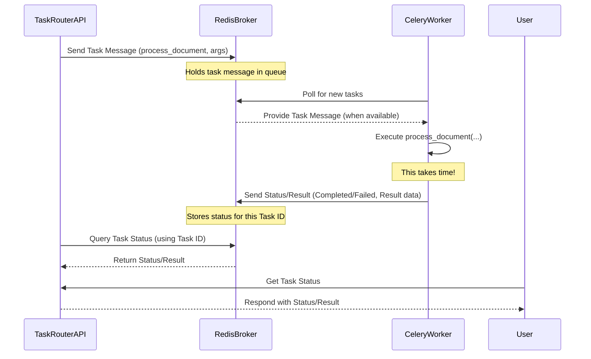
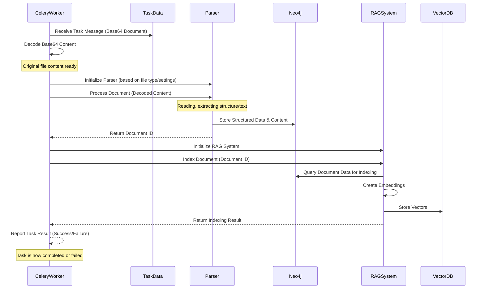
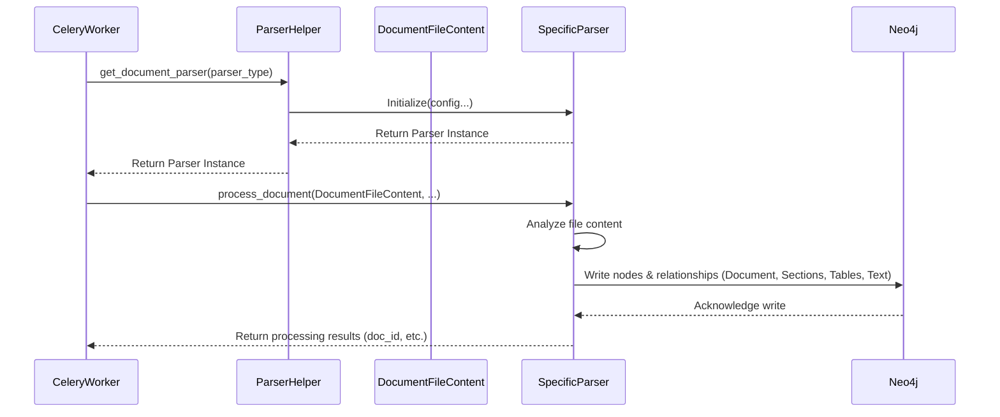
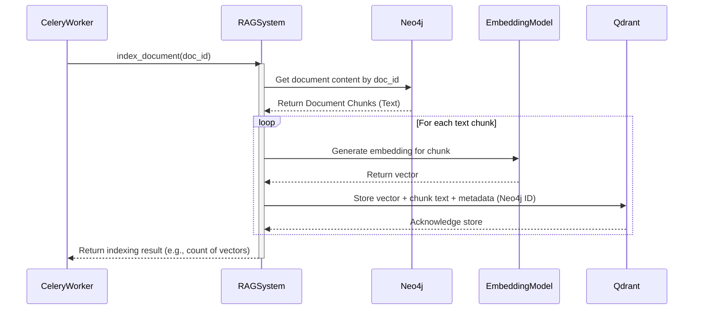
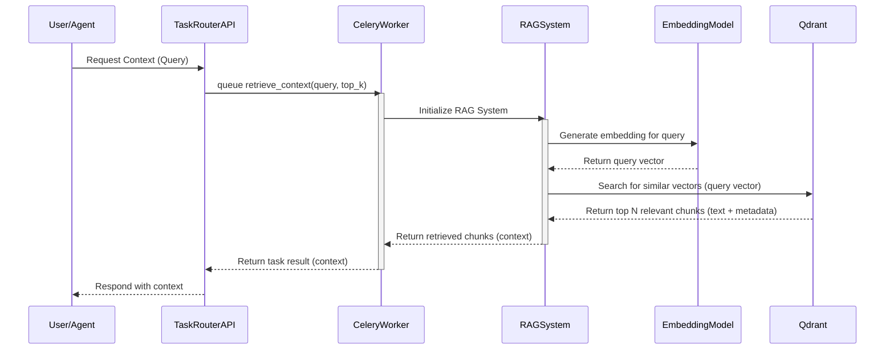
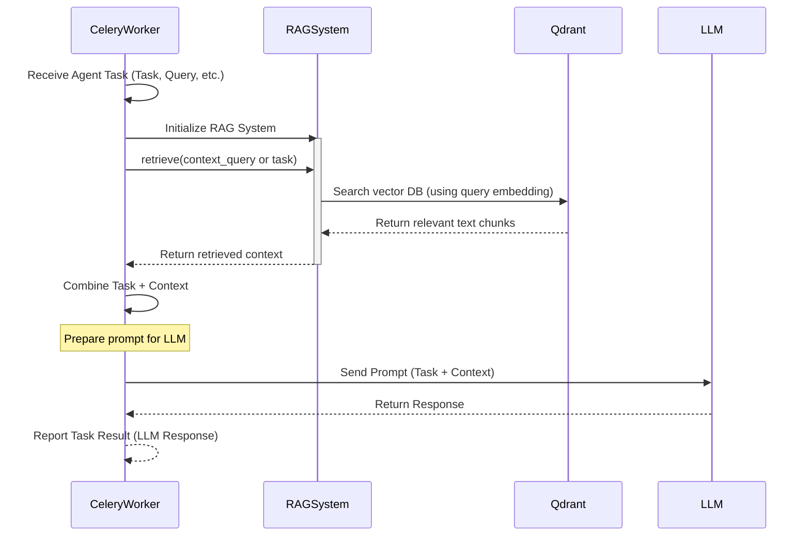
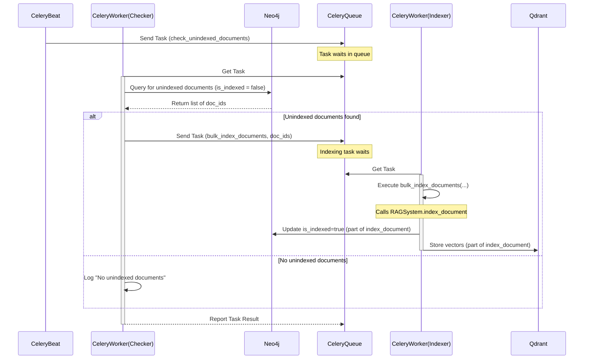

# Tutorial: RegulAIte Queueing System

This project provides a backend system for processing documents and executing AI agent tasks **asynchronously**.
It uses a **Celery task queue** to handle jobs like **parsing documents** and **indexing their content** into a searchable knowledge base (the **RAG System**).
A **FastAPI router** serves as the API entry point, allowing users or other services to queue these tasks and check their status in the background.


## Visual Overview



## Chapters

1. [Task Router API
](#chapter-1-task-router-api)
2. [Celery Task Queue
](#chapter-2-celery-task-queue)
3. [Document Processing Task
](#chapter-3-document-processing-task)
4. [Document Parsers
](#chapter-4-document-parsers)
5. [RAG System Integration
](#chapter-5-rag-system-integration)
6. [Agent Execution Flow
](#chapter-6-agent-execution-flow)
7. [Background Indexing Check
](#chapter-7-background-indexing-check)

# Chapter 1: Task Router API

Welcome to the first chapter of the `regulaite` tutorial! In this chapter, we'll dive into the very first part of the `regulaite` system that you interact with when you want to get something done: the **Task Router API**.

Think of `regulaite` as a bustling service, like a restaurant with a very busy kitchen. You, the user, come in and want to order something – maybe you have a document you want processed, or you want an AI assistant to answer a question. These "orders" can sometimes take a while to prepare, especially if they involve lots of steps like reading, analyzing, and indexing documents.

If the restaurant's front desk (the web server) had to wait right there for your entire order to be cooked before taking the next customer's order, things would get very slow! The front desk would be blocked.

This is the problem the **Task Router API** solves. It acts like the friendly and efficient front desk of `regulaite`.

## What is the Task Router API?

The Task Router API is the "front door" where user requests come in. It's built using a web framework called **FastAPI**, which makes it easy to create these entry points using standard web addresses (URLs) and methods like `POST` (to send data) and `GET` (to get information).

Its main job is **NOT** to perform the complex tasks itself (like reading a PDF or running an AI). Instead, it:

1.  **Receives** your request (your "order").
2.  **Validates** your request (makes sure you've provided all the necessary info).
3.  **Creates** a "ticket" for your task (gives it a unique ID).
4.  **Hands off** your task to a background system (the "kitchen") for processing.
5.  **Immediately** tells you, "Okay, I got your request! Here's your ticket number (Task ID). I'll let you know when it's done!"

This way, the Task Router can quickly handle many requests without getting stuck, keeping the system responsive.

## A Practical Example: Processing a Document

Let's say you have a PDF file and you want `regulaite` to process it, extract text, and make it searchable. This is a perfect example of a task that takes time and shouldn't block the main web server.

You would send this file and some instructions (like "use this document ID", "extract metadata") to the Task Router API. The Task Router would then make sure the request is valid, assign a task ID, and hand it over to the background processing system. It would then immediately respond with the task ID, so you can check its status later.

## How It Works Behind the Scenes (High Level)

Here's a simplified view of the flow when you send a request to the Task Router API:



As you can see, the Task Router's job is short and sweet: receive, validate, hand off, respond with a ticket. The heavy lifting happens *after* the Task Router has finished its part. The "Celery Task Queue" and the "worker" that processes tasks from it are explained in the next chapter: [Celery Task Queue](#chapter-2-celery-task-queue).

## Looking at the Code (`task_router.py`)

Let's peek at some small pieces of the `task_router.py` file to see how this is implemented using FastAPI.

First, the file sets up a router:

```python
# plugins/regul_aite/backend/queuing_sys/task_router.py
from fastapi import APIRouter, HTTPException, File, UploadFile, Form
from fastapi.responses import JSONResponse
from pydantic import BaseModel, Field
# ... other imports and setup ...

router = APIRouter(prefix="/tasks", tags=["tasks"])

# ... rest of the file ...
```

-   `APIRouter`: This is a FastAPI tool that helps organize your web addresses (endpoints). We create one for all our task-related endpoints.
-   `prefix="/tasks"`: This means all endpoints defined using this `router` will start with `/tasks` (e.g., `/tasks/documents/process`).
-   `tags=["tasks"]`: This helps group related endpoints in the automatic documentation FastAPI generates.

Next, it defines models for the data that the API uses, like the response you get back:

```python
# plugins/regul_aite/backend/queuing_sys/task_router.py
# ... imports ...
from pydantic import BaseModel, Field
from datetime import datetime

class TaskResponse(BaseModel):
    """Response with task ID"""
    task_id: str
    status: str
    message: str
    created_at: str = Field(default_factory=lambda: datetime.now().isoformat())

# ... other models and routes ...
```

-   `BaseModel` (from `pydantic`): This helps define the structure of the data. `TaskResponse` specifies that any response using this model must have a `task_id` (string), `status` (string), `message` (string), and optionally `created_at` (string, automatically set to the current time). This ensures the API sends back predictable data.

Now, let's look at the endpoint for processing a document. This is a `POST` request because you're *sending* data (the file) to the server.

```python
# plugins/regul_aite/backend/queuing_sys/task_router.py
# ... imports and models ...
from fastapi import File, UploadFile, Form # Needed for file uploads

@router.post("/documents/process", response_model=TaskResponse)
async def queue_document_processing(
    file: UploadFile = File(...),
    doc_id: Optional[str] = Form(None),
    metadata: Optional[str] = Form(None),
    # ... other parameters ...
):
    """Queue document for processing"""
    try:
        # ... code to handle input and prepare data ...

        # Read file content
        file_content = await file.read()
        # Encode file content to base64 to send in the task
        file_content_b64 = base64.b64encode(file_content).decode('utf-8')

        # Create Celery task for document processing
        task = process_document.delay(
            file_content_b64=file_content_b64,
            file_name=file.filename,
            doc_id=doc_id,
            doc_metadata=doc_metadata,
            # ... other arguments ...
        )

        # Return task ID and status immediately
        return TaskResponse(
            task_id=task.id,
            status="pending",
            message=f"Document {doc_id} queued for processing"
        )

    except Exception as e:
        # ... error handling ...
        pass
```

-   `@router.post(...)`: This is a decorator that tells FastAPI that the `queue_document_processing` function should be called when a `POST` request arrives at the `/tasks/documents/process` URL. `response_model=TaskResponse` ensures the response follows the `TaskResponse` structure.
-   `async def queue_document_processing(...)`: This defines the function that handles the request. `async` is used because reading the file might take a moment, and we don't want to block.
-   `file: UploadFile = File(...)`: This tells FastAPI to expect a file upload field named `file`.
-   `doc_id: Optional[str] = Form(None)`: This tells FastAPI to expect an optional form field named `doc_id`.
-   `await file.read()`: Reads the content of the uploaded file.
-   `base64.b64encode(...)`: Files are binary data. To send them reliably within a background task message, they are often converted to a text format like Base64.
-   `task = process_document.delay(...)`: This is the crucial line! `process_document` is a function defined elsewhere (which we'll see in [Celery Task Queue](#chapter-2-celery-task-queue)). Calling `.delay(...)` on it *doesn't* run the function immediately. Instead, it packages the function name and arguments and sends them as a message to the Celery Task Queue. It immediately returns an `AsyncResult` object which contains the `task.id`.
-   `return TaskResponse(...)`: The API quickly sends back a `TaskResponse` object containing the unique `task_id`. This tells the user the request was received and queued.

Other endpoints, like the one to queue an AI agent task, follow a similar pattern but use different request models:

```python
# plugins/regul_aite/backend/queuing_sys/task_router.py
# ... imports and other code ...

class AgentTaskRequest(BaseModel):
    """Request for agent task execution"""
    agent_type: str
    task: str
    config: Optional[Dict[str, Any]] = None
    # ... other fields ...

@router.post("/agents/execute", response_model=TaskResponse)
async def queue_agent_task(request: AgentTaskRequest):
    """Queue an agent task for execution"""
    try:
        # Create Celery task for agent execution
        task = execute_agent_task.delay(
            agent_type=request.agent_type,
            task=request.task,
            # ... other arguments from request ...
        )

        # Return task ID and status
        return TaskResponse(
            task_id=task.id,
            status="pending",
            message=f"{request.agent_type.capitalize()} agent task queued for execution"
        )

    except Exception as e:
        # ... error handling ...
        pass
```

-   `request: AgentTaskRequest`: Here, FastAPI automatically validates the incoming JSON body against the `AgentTaskRequest` model.
-   `execute_agent_task.delay(...)`: Again, the task details are sent to the queue for background execution.

Finally, the Task Router also provides endpoints to check on the status of the tasks it has sent to the queue:

```python
# plugins/regul_aite/backend/queuing_sys/task_router.py
# ... imports and other code ...
from celery.result import AsyncResult # Needed to check task status

@router.get("/status/{task_id}")
async def get_task_status(task_id: str):
    """Get status of a queued task"""
    try:
        # Get task by ID
        task_result = AsyncResult(task_id, app=celery_app)

        # Determine task status and return
        if task_result.successful():
             # ... return success details ...
             pass
        elif task_result.failed():
             # ... return failure details ...
             pass
        elif task_result.status == 'PENDING':
             # ... return pending status ...
             pass
        else:
             # ... return other status ...
             pass

    except Exception as e:
        # ... error handling ...
        pass

# ... other status/management endpoints ...
```

-   `@router.get("/status/{task_id}")`: This defines a `GET` endpoint where the last part of the URL (`{task_id}`) is a variable that captures the task ID you want to check.
-   `task_id: str`: The `task_id` from the URL is passed as an argument to the function.
-   `AsyncResult(task_id, app=celery_app)`: This connects to the Celery system using the task ID and retrieves information about its current state (pending, started, successful, failed, etc.).

## Summary

The Task Router API is the essential front-end layer of `regulaite`'s queuing system. It uses FastAPI to provide structured web endpoints. Its core responsibility is to receive various requests (like processing documents, running agents, or indexing), perform basic validation, and then hand these tasks off to a background processing system ([Celery Task Queue](#chapter-2-celery-task-queue)) for execution, without getting blocked. It immediately provides a task ID so you can later check the status using the `/status/{task_id}` endpoint.

In the next chapter, we'll explore the "kitchen" – the [Celery Task Queue](#chapter-2-celery-task-queue) – and understand how these tasks are actually picked up and processed in the background.

# Chapter 2: Celery Task Queue

Welcome back! In the previous chapter, [Task Router API](#chapter-1-task-router-api), we learned how `regulaite`'s front door (the Task Router API) quickly receives your requests, gives them a ticket number (Task ID), and hands them off for background processing. We saw the API call `.delay()` on a function, like `process_document.delay(...)`, but we didn't explore *where* those tasks go or *how* they actually get done.

This is where the **Celery Task Queue** comes in.

## What is the Celery Task Queue?

Think of Celery as the entire back-office system in our restaurant analogy, specifically the **kitchen staff**, the **order board**, and the **system** that makes sure orders are picked up and cooked.

When the Task Router API calls `.delay()`, it's like the front desk writing an order ticket and placing it on a special order board for the kitchen. Celery is the system that manages this order board and the staff who are ready to pick up those tickets and cook the food.

Why do we need this? Because complex tasks, like processing a long document or running a complicated AI query, can take a significant amount of time (seconds, maybe even minutes). If the main web server (the front desk) had to wait for each task to finish before handling the next incoming request, it would become unresponsive. Your browser request would just hang there, waiting.

Celery solves this by:

1.  Providing a reliable way to **send** tasks to be done later.
2.  Maintaining a **queue** (the order board) of tasks waiting to be processed.
3.  Having **workers** (the kitchen staff) that constantly check the queue and pick up tasks when they are free.
4.  Executing the tasks **asynchronously** in the background, without blocking the main application.

## Key Components of Celery

Celery works with a few main pieces:

| Component        | Analogy              | Role                                                                 |
| :--------------- | :------------------- | :------------------------------------------------------------------- |
| **Tasks**        | The "Orders"         | Regular Python functions marked to be run by Celery.                 |
| **Broker**       | The "Order Board"    | A message queue (like Redis or RabbitMQ) that holds tasks waiting.   |
| **Workers**      | The "Kitchen Staff"  | Processes that run on servers, picking up tasks from the broker and executing them. |
| **Backend (Optional)** | The "Status Tracker" | Where task results and status (success, failure) are stored. Often the same as the Broker (Redis). |

In `regulaite`, we use **Redis** as both the **Broker** and the **Backend**. Redis is like a super-fast message board that remembers things.

## How a Task Gets Processed

Let's trace the journey of a "Process Document" task once it leaves the Task Router API:

1.  **Task Router sends task:** The `task_router.py` code calls `process_document.delay(...)`.
2.  **Celery client creates message:** The Celery library (running within the Task Router API process) takes the details (`process_document` function name, the file data, metadata, etc.) and packages them into a message (like writing an order ticket).
3.  **Message sent to Broker:** This message is immediately sent to the Redis server (our "Order Board"). Redis holds onto it.
4.  **Worker polls Broker:** A separate process, the Celery Worker (our "Kitchen Staff"), is constantly connected to Redis, asking, "Are there any new tasks for me?"
5.  **Worker picks up task:** When a task message appears in Redis, an available worker grabs it. The message is removed from the queue (or marked as being processed).
6.  **Worker executes task:** The worker unpacks the message, finds the `process_document` function, and runs it with the provided arguments (decoding the file, calling the parser, storing in Neo4j, indexing in Qdrant, etc.).
7.  **Worker reports status/result:** Once the `process_document` function finishes (either successfully or with an error), the worker sends a message back to Redis (the "Status Tracker") indicating the task's status and storing the result or error information.



This flow ensures that the Task Router API can quickly receive the request (steps 1-3 complete almost instantly) and respond to the user, while the heavy work (steps 6-7) happens independently in the background.

## Looking at the Code (`celery_worker.py`)

The file `plugins/regul_aite/backend/queuing_sys/celery_worker.py` is where the Celery application is configured and where the actual task functions are defined.

First, the Celery application is created and configured:

```python
# plugins/regul_aite/backend/queuing_sys/celery_worker.py
import os
from celery import Celery
from dotenv import load_dotenv

load_dotenv() # Load environment variables like REDIS_URL

# Redis URL from environment or default
redis_url = os.getenv("REDIS_URL", "redis://redis:6379/0")

# Initialize Celery app
app = Celery(
    'regul_aite_tasks', # Name of the app
    broker=redis_url,  # The message broker URL
    backend=redis_url  # Where to store task results/status
)

# Configure Celery settings (simplified)
app.conf.update(
    task_serializer='json',       # How tasks are packaged
    result_serializer='json',     # How results are packaged
    task_track_started=True,      # Record when a task starts
    task_time_limit=7200,         # Maximum time a task can run
    worker_prefetch_multiplier=1, # How many tasks a worker fetches at once
    task_acks_late=True,          # Only acknowledge task *after* it finishes
    # ... other configuration ...
)

# ... rest of the file ...
```

-   `from celery import Celery`: Imports the main Celery class.
-   `redis_url = os.getenv("REDIS_URL", "redis://redis:6379/0")`: Gets the Redis server address from environment variables, falling back to a default (which assumes Redis is running in a Docker container named `redis`).
-   `app = Celery(...)`: Creates the Celery application instance. We give it a name, specify the `broker` (Redis URL), and specify the `backend` (also Redis URL) where task results will be stored so the Task Router can check them later.
-   `app.conf.update(...)`: Configures various settings for how Celery should behave. For beginners, the key is understanding that the broker and backend are set up here.

Next, the Python functions that should run as background tasks are defined using the `@app.task` decorator:

```python
# plugins/regul_aite/backend/queuing_sys/celery_worker.py
# ... imports and Celery app setup ...

# Initialize shared components (Parsers, RAG System - details later)
# These are initialized *inside* the worker process when needed

# Task definition for document processing
@app.task(bind=True, name="process_document", max_retries=3)
def process_document(self, file_content_b64: str, file_name: str, doc_id: Optional[str] = None,
                    doc_metadata: Optional[Dict[str, Any]] = None, enrich: bool = True,
                    detect_language: bool = True, parser_type: str = ParserType.UNSTRUCTURED.value,
                    parser_settings: Optional[Dict[str, Any]] = None) -> Dict[str, Any]:
    """
    Process a document using the specified parser API and store in Neo4j
    (This is the function the Celery worker executes)
    """
    logger.info(f"Starting document processing for {file_name} (Task ID: {self.request.id})")
    try:
        # ... Decode file_content_b64 ...
        # ... Generate doc_id if needed ...
        # ... Initialize parser (calls get_document_parser) ...
        # ... Call parser.process_document(...) ...
        # ... Initialize RAG system (calls get_rag_system) ...
        # ... Call rag_system.index_document(...) ...
        logger.info(f"Document processing complete for {file_name} (Task ID: {self.request.id})")
        # ... Return results ...
        # return result # Actual function returns result dict
    except Exception as e:
        logger.error(f"Error processing document {file_name}: {str(e)}")
        # Log error, maybe retry
        # self.retry(exc=e, countdown=30, max_retries=3)
        raise # Re-raise to mark task as failed

# Task definition for agent execution (simplified)
@app.task(bind=True, name="execute_agent_task", max_retries=2)
def execute_agent_task(self, agent_type: str, task: str, config: Optional[Dict[str, Any]] = None,
                      include_context: bool = True, context_query: Optional[str] = None) -> Dict[str, Any]:
    """
    Execute a task using an AI agent
    (This is another function a Celery worker executes)
    """
    logger.info(f"Starting agent task: {task} (Task ID: {self.request.id})")
    try:
        # ... Initialize RAG system ...
        # ... Process task using RAG query or other logic ...
        logger.info(f"Agent task complete: {task} (Task ID: {self.request.id})")
        # return result # Actual function returns result dict
    except Exception as e:
        logger.error(f"Error executing agent task {task}: {str(e)}")
        # Log error, maybe retry
        # self.retry(exc=e, countdown=20, max_retries=2)
        raise # Re-raise to mark task as failed

# ... other task definitions (bulk_index_documents, retrieve_context) ...

# Optional: Scheduled tasks using Celery Beat
# app.conf.beat_schedule = { ... }
```

-   `@app.task(...)`: This decorator tells Celery that the function below it (`process_document` or `execute_agent_task`) is a Celery task. When `.delay()` is called on this function from *another process* (like the Task Router API), Celery won't run the function directly but will instead send a message to the broker.
-   `bind=True`: This makes the first argument `self`, which is the task instance itself. This is useful for things like accessing the task ID (`self.request.id`) or retrying the task (`self.retry(...)`).
-   `name="process_document"`: Assigns a specific name to the task. This is what Celery uses to identify which function to run. The `.delay()` call in the Task Router actually refers to the function object `process_document`, and Celery uses this defined name.
-   `max_retries`: Specifies how many times Celery should automatically retry the task if it fails.
-   The function signature (`file_content_b64`, `file_name`, etc.) defines the arguments that the task expects when it's called via `.delay()`. These arguments are sent in the message to the broker.
-   The *body* of the function (the `try...except` block) contains the actual logic for processing the document or executing the agent. This code runs *only* inside a Celery worker process when it picks up the task.

When you run `regulaite` using Docker Compose, separate containers are typically used for:

1.  The FastAPI application (running the [Task Router API](#chapter-1-task-router-api)).
2.  The Redis broker/backend.
3.  One or more Celery worker processes (running the code from `celery_worker.py` and listening to Redis).
4.  (Optional) A Celery Beat process for scheduled tasks.

This distributed setup allows different parts of the system to scale independently and ensures that long-running tasks don't freeze the user-facing API.

## Summary

Celery Task Queue is the backbone of `regulaite`'s background processing. It allows the system to receive requests quickly via the [Task Router API](#chapter-1-task-router-api) and delegate the heavy lifting (like document processing and agent execution) to dedicated worker processes. It uses a message broker (Redis) to manage the queue of tasks, ensuring reliability and scalability. By decorating Python functions with `@app.task` and calling them with `.delay()`, we turn ordinary functions into asynchronous background jobs handled by Celery workers.

In the next chapter, we will dive deeper into the details of the **Document Processing Task** itself, exploring the logic within the `process_document` function that runs inside the Celery worker.

# Chapter 3: Document Processing Task

Welcome back to the `regulaite` tutorial! In the previous chapter, [Celery Task Queue](#chapter-2-celery-task-queue), we learned how `regulaite` uses Celery to handle tasks in the background, explaining the roles of the broker (Redis) and the workers. We saw how the [Task Router API](#chapter-1-task-router-api) sends a message to Celery, and a worker picks it up to do the actual work.

Now, let's look at one of the most important *types* of work that Celery workers perform in `regulaite`: the **Document Processing Task**.

## What is the Document Processing Task?

Imagine you have a stack of paper documents – maybe legal regulations, research papers, or company reports. You can't easily search through them, ask questions about them, or connect ideas across different documents when they're just static files like PDFs.

The **Document Processing Task** is the specific job inside `regulaite`'s "kitchen" (the Celery worker) that takes one of these raw document files and turns it into structured, searchable, and queryable data.

Think of it as sending your document to a highly specialized digital processing center. This center:

1.  Takes your raw file.
2.  "Reads" it carefully using smart tools to understand its content, structure (like headings, paragraphs, tables), and any important details (metadata). This step is called **parsing**.
3.  Stores this extracted, organized information in a database built for connected data (like Neo4j).
4.  Prepares the content to be quickly searched and queried by an AI (like storing parts of it as vectors in a special database like Qdrant). This step is often called **indexing**.

Once this task is complete, your document is no longer just a file; its knowledge has been integrated into `regulaite`'s knowledge base, ready for the [RAG System Integration](#chapter-5-rag-system-integration) and agents to use.

## The Core Use Case: Making a Document Smart

The central use case for the Document Processing Task is simple: You have a document file (PDF, Word, etc.), and you want `regulaite` to understand it and make its content available for AI agents and search.

You trigger this by sending the document to the `regulaite` [Task Router API](#chapter-1-task-router-api) endpoint `/tasks/documents/process`. As we saw in Chapter 1, the API quickly receives the file and details, assigns a Task ID, and sends a message to the Celery Task Queue:

```python
# From plugins/regul_aite/backend/queuing_sys/task_router.py (simplified)
@router.post("/documents/process", response_model=TaskResponse)
async def queue_document_processing(
    file: UploadFile = File(...),
    # ... other parameters ...
):
    # ... Read file content and encode to base64 ...
    file_content_b64 = base64.b64encode(await file.read()).decode('utf-8')

    # Create Celery task for document processing
    task = process_document.delay( # <-- This sends the task message!
        file_content_b64=file_content_b64,
        file_name=file.filename,
        # ... other arguments ...
    )

    # Return task ID immediately
    return TaskResponse(
        task_id=task.id,
        status="pending",
        message=f"Document {file.filename} queued for processing"
    )
```

The key is the line `process_document.delay(...)`. This doesn't run the `process_document` function immediately. Instead, it tells Celery to create a task message containing the function name (`process_document`) and the provided arguments (like the base64 document content, file name, etc.). This message sits in the Redis broker queue, waiting for a Celery worker to become available.

## What Happens Inside the Task?

When a Celery worker picks up the "process_document" task message from the queue, it starts executing the actual Python function associated with that task name. This function contains the detailed instructions for the digital processing center.

The main steps performed by the `process_document` task are:

1.  **Receive Data:** The worker receives the function call with all the arguments provided by the [Task Router API](#chapter-1-task-router-api), including the document content as a base64 string.
2.  **Decode Content:** The base64 string is decoded back into the original binary file content.
3.  **Initialize Parser:** It selects and sets up the correct tool (parser) needed to read this specific type of document file. `regulaite` supports different parsers, which we'll cover in [Document Parsers](#chapter-4-document-parsers).
4.  **Process Document (Parsing):** It hands the document content to the initialized parser. The parser does the heavy lifting: reading the file, extracting text, identifying structural elements (like titles, paragraphs), and figuring out relationships between parts. Crucially, the parser is also responsible for saving this structured data into the Neo4j database.
5.  **Index Document:** After the parser has successfully stored the document's structure and content in Neo4j, the task initiates the indexing process. This involves fetching the relevant data from Neo4j, potentially splitting it into smaller chunks, creating vector embeddings (numerical representations) of these chunks, and storing these vectors in a vector database (like Qdrant) so they can be quickly searched based on meaning. This step uses the [RAG System Integration](#chapter-5-rag-system-integration).
6.  **Report Status:** Once parsing and indexing are complete (or if an error occurs), the task updates its status in the Celery backend (Redis) and returns a result (like the assigned document ID, number of vectors created, etc.).

Here's a simplified sequence of events within the worker:



## Looking at the Code (`celery_worker.py`)

The logic for the `process_document` task lives within the `process_document` function in the `plugins/regul_aite/backend/queuing_sys/celery_worker.py` file.

Let's look at simplified pieces of this function to see how it implements the steps above.

First, the function definition, marked with the `@app.task` decorator we saw in the previous chapter:

```python
# From plugins/regul_aite/backend/queuing_sys/celery_worker.py (simplified)
import base64
# ... other imports ...
from unstructured_parser.base_parser import ParserType
from rag.hype_rag import HyPERagSystem as RAGSystem

@app.task(bind=True, name="process_document", max_retries=3)
def process_document(self, file_content_b64: str, file_name: str, doc_id: Optional[str] = None,
                    # ... other arguments like metadata, parser_type, etc. ...
                    ) -> Dict[str, Any]:
    """
    Process a document using the specified parser API and store in Neo4j
    (This function runs inside a Celery worker)
    """
    logger.info(f"Starting document processing for {file_name} (Task ID: {self.request.id})")
    try:
        # Step 1 & 2: Receive and Decode Base64 content
        file_content = base64.b64decode(file_content_b64)

        # ... Generate doc_id if not provided ...
        # ... Prepare doc_metadata ...

        # Step 3 & 4: Initialize Parser and Process Document
        parser = get_document_parser(parser_type=parser_type) # Helper to get parser
        result = parser.process_document( # <-- Parser does the core work and stores in Neo4j
            file_content=file_content,
            file_name=file_name,
            doc_id=doc_id,
            doc_metadata=doc_metadata,
            # ... other arguments for parser ...
        )

        # Step 5: Index Document in RAG system
        if result and "doc_id" in result:
             processed_doc_id = result["doc_id"]
             rag_system = get_rag_system() # Helper to get RAG system
             index_result = rag_system.index_document(processed_doc_id) # <-- RAG system indexes (uses Neo4j, stores in VectorDB)

             # ... Update result dictionary with indexing status ...

        # Clean up resources (like parser connection)
        parser.close()
        rag_system.close() # Assuming RAGSystem needs close

        # Step 6: Return results
        return result # The function returns a dictionary

    except Exception as e:
        logger.error(f"Error processing document: {str(e)}")
        # Log the error and potentially retry the task
        # self.retry(exc=e, countdown=30, max_retries=3)
        raise # Re-raise to mark task as failed in Celery
```

-   `@app.task(...)`: Marks this Python function to be executable as a Celery task.
-   `file_content_b64: str`: The base64 string passed from the Task Router.
-   `base64.b64decode(...)`: Converts the base64 string back into the raw file bytes.
-   `get_document_parser(...)`: This is a helper function (also defined in `celery_worker.py`) that determines which specific parser to use based on the `parser_type` argument and sets it up. We'll look closer at parsers in the next chapter.
-   `parser.process_document(...)`: This is the method call on the selected parser instance. This method contains the complex logic of reading the document's content, extracting information, and writing it to the Neo4j database.
-   `get_rag_system()`: Another helper function to get an instance of the RAG (Retrieval Augmented Generation) system component.
-   `rag_system.index_document(processed_doc_id)`: This calls the RAG system's method to make the document searchable. It typically reads the processed data from Neo4j, processes it further (like splitting into chunks), creates vector embeddings, and stores them in the vector database (Qdrant).
-   `try...except...self.retry()`: This standard Python structure handles errors. If something goes wrong during processing, the error is logged. `self.retry(...)` tells Celery to try running this task again later (up to `max_retries` times, with a delay specified by `countdown`). If retries are exhausted or an exception is raised, the task is marked as 'FAILED' in Celery.

The `get_document_parser` and `get_rag_system` helpers encapsulate the logic for configuring and initializing these complex components, often involving reading environment variables for API keys or database connection details, as seen in the full `celery_worker.py` code. This keeps the `process_document` task function itself focused on the *orchestration* of the document processing pipeline.

## Summary

The Document Processing Task is a key worker task in `regulaite`, specifically the `process_document` function executed by a Celery worker. Its purpose is to transform a raw document file into structured data stored in Neo4j and vectorized for indexing in a vector database like Qdrant, making the document's content available for AI agents and search. This task orchestrates the use of specialized tools like document parsers and the RAG system.

Understanding this task helps you see how your uploaded documents move from being simple files to becoming active parts of `regulaite`'s knowledge graph, ready to be queried.

In the next chapter, we will focus specifically on the tools responsible for the "reading" and "extracting" part of this process: the **Document Parsers**.

# Chapter 4: Document Parsers

Welcome back! In the last chapter, [Document Processing Task](#chapter-3-document-processing-task), we explored how `regulaite`'s Celery workers perform the crucial job of taking a raw document file and transforming it into structured data ready for search and AI. We saw that a key part of this process involves "reading" the document's content and structure.

But how does a computer program actually "read" a complex file like a PDF or a Word document? These files aren't just simple text; they contain formatting, images, tables, and a specific layout that holds meaning. This is where **Document Parsers** come in.

## What are Document Parsers?

Think of document parsers as highly skilled digital translators or data extraction specialists. When you upload a document to `regulaite` for processing, the raw file is like a book written in a complex code that the system can't directly understand or easily search. The Document Processing Task needs help to decipher it.

**Document Parsers** are those specialized tools or services that the Document Processing Task uses to:

1.  **Read** different file formats (PDFs, DOCX, etc.).
2.  **Break down** the complex structure of the file.
3.  **Extract** the actual text content.
4.  **Identify** different elements like titles, headings, paragraphs, lists, tables, and even relationships between them.
5.  **Understand** the overall layout and flow of information.

They take the raw, unstructured or semi-structured data from a file and convert it into organized, structured data that `regulaite`'s other components (like the database and the [RAG System Integration](#chapter-5-rag-system-integration)) can work with.

Without a good parser, the Document Processing Task would just see a jumble of bytes instead of meaningful content and structure.

## Why Different Parsers?

Just like a human translator might specialize in legal documents or technical manuals, different document parsers have different strengths. Some are better at handling complex table layouts, others excel at extracting text from scanned images (using OCR - Optical Character Recognition), some are very fast, and others might be more accurate but require more resources or cost money (if they are external API services).

`regulaite` is designed to be flexible and can integrate with different parsers. This allows the system to choose the best tool for the job based on the type of document being processed or the specific requirements (e.g., accuracy, speed, handling specific features).

Here are some types of parsers `regulaite` might use (or is configured to use, based on the code):

| Parser Type         | Where it Runs        | Typical Strengths                                  | Notes                                       |
| :------------------ | :------------------- | :------------------------------------------------- | :------------------------------------------ |
| **Unstructured**    | Often local service  | Handles various formats, good with structure, tables | Open source, can run in Docker alongside `regulaite`. |
| **Unstructured Cloud** | External API Service | Scalable, potentially higher accuracy/features   | Requires an API key and internet access.    |
| **Doctly**          | External API Service | Specialized in document understanding              | External service, requires API key.         |
| **LlamaParse**      | External API Service | Optimized for LlamaIndex workflows                   | External service, requires API key.         |

When you queue a document for processing via the [Task Router API](#chapter-1-task-router-api), you can often specify which `parser_type` to use, giving you control over this crucial step.

## How Parsers Work Within the Document Processing Task

As we saw in [Chapter 3](#chapter-3-document-processing-task), the `process_document` function inside the Celery worker is the one that orchestrates document processing. A major part of its job is to use the selected parser.

Here's a simplified view of the steps involving the parser:

1.  **Task Receives Data:** The `process_document` function gets the document content (decoded from base64) and the chosen `parser_type`.
2.  **Select and Initialize Parser:** The task uses a helper function (`get_document_parser`) to create an instance of the correct parser based on `parser_type`. This involves setting up the parser, potentially providing connection details for the database (Neo4j) where the parser will store the extracted data, or API keys if it's an external service.
3.  **Call Parser's Process Method:** The task calls a method on the parser instance, typically named `process_document`. This is where the parser's internal logic runs.
4.  **Parser Reads and Extracts:** The parser takes the document file content, analyzes it, extracts text and structure.
5.  **Parser Writes to Database:** Crucially, the parser is often responsible for saving the extracted information directly into the structured database (Neo4j in `regulaite`), creating nodes (like Document, Section, Table) and relationships between them.
6.  **Parser Returns Result:** The parser finishes its work and returns a summary back to the `process_document` task, often including the ID of the document in the database and perhaps a count of elements found.

This sequence looks like this:



Notice how the `CeleryWorker` doesn't do the reading and structuring itself. It delegates that complex job to the `SpecificParser` instance it initialized.

## Looking at the Code (`celery_worker.py`)

Let's revisit the `celery_worker.py` file and look specifically at how parsers are handled within the `process_document` task.

First, the `get_document_parser` helper function mentioned above:

```python
# plugins/regul_aite/backend/queuing_sys/celery_worker.py (simplified)
# ... imports ...
from unstructured_parser.base_parser import BaseParser, ParserType # Import parser types

def get_document_parser(parser_type: str = ParserType.UNSTRUCTURED):
    """
    Get or initialize document parser with retry logic
    """
    parser_type_enum = None
    try:
        # Convert string parser_type (from task argument) to the enum
        parser_type_enum = ParserType(parser_type)
    except ValueError:
        # Fallback if invalid type is provided
        logger.warning(f"Invalid parser type: {parser_type}, using default: {ParserType.UNSTRUCTURED}")
        parser_type_enum = ParserType.UNSTRUCTURED

    parser_kwargs = {
        "neo4j_uri": NEO4J_URI,
        "neo4j_user": NEO4J_USER,
        "neo4j_password": NEO4J_PASSWORD,
        # ... other shared settings ...
    }

    # Add parser-specific configurations based on type
    if parser_type_enum == ParserType.UNSTRUCTURED:
        parser_kwargs["unstructured_api_url"] = UNSTRUCTURED_API_URL
        # ... other unstructured settings ...
    elif parser_type_enum == ParserType.UNSTRUCTURED_CLOUD:
        parser_kwargs["unstructured_api_url"] = UNSTRUCTURED_CLOUD_API_URL
        parser_kwargs["unstructured_api_key"] = UNSTRUCTURED_CLOUD_API_KEY
        # ... other unstructured cloud settings ...
    # ... elif for other parser types (DOCTLY, LLAMAPARSE) ...

    # Use a factory method from BaseParser to create the specific parser instance
    parser = BaseParser.get_parser(
        parser_type=parser_type_enum,
        **parser_kwargs # Pass all settings
    )
    logger.info(f"{parser_type} parser initialized successfully")
    return parser
```

-   `ParserType`: This is an `Enum` (a fixed set of named values) that defines the valid types of parsers `regulaite` knows how to use.
-   `get_document_parser`: This function takes the `parser_type` string (which came from the [Task Router API](#chapter-1-task-router-api) request) and looks up the correct configuration and class needed to instantiate that parser.
-   `BaseParser.get_parser(...)`: This is a factory method (a common programming pattern) that returns the correct *specific* parser object (e.g., an `UnstructuredParser` object, a `DoctlyParser` object) based on the `parser_type_enum`. It passes necessary configuration like database credentials or API URLs.

Now, inside the `process_document` task function, we see how this parser is used:

```python
# plugins/regul_aite/backend/queuing_sys/celery_worker.py (simplified)
# ... imports and get_document_parser definition ...

@app.task(bind=True, name="process_document", max_retries=3)
def process_document(self, file_content_b64: str, file_name: str, doc_id: Optional[str] = None,
                    # ... other arguments ...
                    parser_type: str = ParserType.UNSTRUCTURED.value, # Receives type
                    parser_settings: Optional[Dict[str, Any]] = None):
    """
    Process a document...
    """
    try:
        # ... Decode base64 content ...
        # ... Generate doc_id if needed ...
        # ... Prepare doc_metadata ...

        # Initialize the parser using the helper function
        # get_document_parser incorporates parser_settings internally now
        parser = get_document_parser(parser_type=parser_type)

        # Pass additional settings received from API if applicable
        if parser_settings:
            parser.apply_settings(parser_settings) # Assumes parsers have this method

        # **Call the parser's core processing method**
        result = parser.process_document( # <-- Parser reads file, stores in Neo4j
            file_content=file_content,
            file_name=file_name,
            doc_id=doc_id,
            doc_metadata=doc_metadata,
            # ... other arguments the parser needs ...
        )

        # Check if document was successfully processed (parser should return doc_id)
        if result and "doc_id" in result:
            processed_doc_id = result["doc_id"]
            # ... Next step: Index the processed document using RAG system ...
            # See Chapter 5: RAG System Integration
        else:
            # Handle cases where parser didn't return expected result
            logger.error(f"Parser did not return expected document ID for {file_name}")
            raise Exception("Document parsing failed to return document ID")

        # Clean up the parser connection
        parser.close()

        # Return the result (which includes doc_id from the parser)
        return result

    except Exception as e:
        logger.error(f"Error during document processing task: {str(e)}")
        # ... Error handling and retry logic ...
        raise # Re-raise to mark task as failed if retries exhausted
```

-   `parser = get_document_parser(parser_type=parser_type)`: This is where the task gets the right parser object based on the user's request.
-   `parser.process_document(...)`: This line calls the main method on the selected parser object. This method contains all the code specific to that parser type (e.g., calling the Unstructured API, parsing a PDF locally, etc.) and importantly, the logic to connect to Neo4j and save the extracted data.

By abstracting the parser selection and execution behind the `get_document_parser` helper and the `parser.process_document` method, the `process_document` task stays relatively clean and focused on the overall pipeline (get parser -> process with parser -> index with RAG).

## Summary

Document Parsers are indispensable tools in `regulaite`'s document processing pipeline. They are the specialized components responsible for reading various file formats, extracting text and structure, identifying elements like tables, and converting raw documents into structured data. `regulaite` can be configured to use different parsers, allowing flexibility based on document types and requirements. The Document Processing Task ([Chapter 3](#chapter-3-document-processing-task)) selects and utilizes the appropriate parser, which then performs the core work of analyzing the document and storing the results in the Neo4j database.

Once a document has been successfully parsed and its data stored in Neo4j, the next crucial step is to make that information quickly searchable and usable by AI agents. This involves indexing the document, which is where the RAG system comes in.

# Chapter 5: RAG System Integration

Welcome back to the `regulaite` tutorial! In the last chapter, [Document Parsers](#chapter-4-document-parsers), we saw how specialized parsers read your document files, extract their content and structure, and store this organized information in the Neo4j graph database.

Having your document data in Neo4j is powerful for understanding relationships and structure, but what if you want to quickly ask a question about your entire collection of documents? For example, "What are the requirements for reporting hazardous materials in this set of regulations?"

Searching a graph database for this kind of semantic (meaning-based) query can be slow and difficult. This is where the **RAG System Integration** comes in.

## What is RAG System Integration?

RAG stands for **Retrieval Augmented Generation**. It's a technique commonly used in AI systems to improve their ability to answer questions or generate text by giving them access to specific, relevant information from a knowledge base *before* they generate the response.

The "Retrieval" part is key here. It's the process of finding the most relevant pieces of information from your documents based on a user's query.

Imagine your parsed documents in Neo4j are like a perfectly organized physical library archive. You know exactly where each section, paragraph, and table is stored, but manually finding every mention of "hazardous materials reporting" across dozens or hundreds of documents would take a lot of time and effort, even with a detailed index.

The **RAG System Integration** in `regulaite` adds a highly efficient, AI-powered search layer on top of your documents. It's like having a super-librarian who has read every document, understood the meaning of every sentence, and can instantly pull out the few paragraphs most relevant to your specific question, regardless of the exact keywords used.

This system is built using:

1.  **Vector Embeddings:** A way to convert text (like sentences, paragraphs, or document chunks) into numerical lists (vectors) where the *meaning* of the text determines the position and distance in a high-dimensional space. Text snippets with similar meanings will have vectors that are numerically "close" to each other.
2.  **Vector Database (Qdrant):** A specialized database designed to store these vectors and, critically, perform extremely fast "similarity searches". Given a vector for a query (your question), Qdrant can quickly find the vectors (and thus the corresponding document chunks) that are most similar in meaning.

## The Core Use Case: Semantic Search & Context Retrieval

The primary use case enabled by RAG System Integration is **semantic search** and **context retrieval**.

You have processed documents in `regulaite`, and you want to:

*   Find document snippets that are conceptually related to a query, even if they don't contain the exact keywords.
*   Retrieve relevant paragraphs or sections to feed to an AI agent, so it can answer questions or perform tasks using specific information from your knowledge base.

This is often done by querying the system with a natural language question like "Summarize the key safety protocols" or "What are the penalties for non-compliance?". The RAG system's job is to find the bits of your documents that best answer that question.

You trigger this process by using the `/tasks/context/retrieve` endpoint on the [Task Router API](#chapter-1-task-router-api) or, more commonly, by including context retrieval as part of an [Agent Execution Flow](#chapter-6-agent-execution-flow).

## How RAG Works in `regulaite`

The RAG system integration involves two main phases after a document has been parsed:

1.  **Indexing:** Taking the processed document content and preparing it for fast retrieval (storing vectors in Qdrant). This happens as part of the [Document Processing Task](#chapter-3-document-processing-task) or the `bulk_index_documents` task.
2.  **Retrieval:** Using a query to find the most relevant indexed content from Qdrant. This happens in tasks like `retrieve_context` or as a step within an agent task (`execute_agent_task`).

Let's look at each phase.

### Phase 1: Indexing Documents

After a document is successfully parsed and stored in Neo4j by the [Document Processing Task](#chapter-3-document-processing-task), the next step is to make it searchable using vectors.

Here's what happens during indexing:

1.  **Retrieve Data:** The RAG system component fetches the document's content and structure from the Neo4j database using the document ID provided by the parser.
2.  **Chunking:** The document text is divided into smaller, manageable pieces called "chunks". These chunks are typically paragraphs or sections of a few hundred words. Why chunk? Large documents make poor vectors, and AI models work better with focused pieces of text.
3.  **Embedding:** Each text chunk is fed into an **embedding model**. This model is an AI trained to convert text into a numerical vector representation of its meaning.
4.  **Store in Qdrant:** The resulting vector for each chunk is stored in the Qdrant vector database. Along with the vector, Qdrant also stores the original text of the chunk and metadata, crucially including a link back to the original document and element in Neo4j (e.g., the Neo4j node ID).

This process ensures that every meaningful snippet of your document is represented by a unique vector in Qdrant, ready to be searched.



### Phase 2: Retrieval (Searching)

When a user or an AI agent needs information from the documents, they provide a query (usually a question or statement). The RAG system performs retrieval to find relevant chunks:

1.  **Embed Query:** The user's query is fed into the *same* embedding model used during indexing to get a vector representation of the query's meaning.
2.  **Query Qdrant:** The query vector is sent to the Qdrant database.
3.  **Similarity Search:** Qdrant performs a fast similarity search, finding the vectors in its database (representing document chunks) that are closest in distance to the query vector. The "closest" vectors correspond to the document chunks whose meaning is most similar to the query.
4.  **Retrieve Content:** Qdrant returns the original text content and metadata (including the link to Neo4j) for the top N most similar chunks (where N is typically configured, like `top_k=5`).
5.  **Return Context:** The RAG system returns these relevant text snippets as "context". This context can then be passed to a Large Language Model (LLM) by an AI agent to help it formulate an accurate answer based *only* on the information found in your documents.



## Looking at the Code (`celery_worker.py`)

The implementation of the RAG system integration is primarily handled by the `HyPERagSystem` class and its usage within the Celery worker tasks, particularly `process_document`, `bulk_index_documents`, and `retrieve_context`.

First, let's see the helper function `get_rag_system()` which initializes the RAG component:

```python
# plugins/regul_aite/backend/queuing_sys/celery_worker.py (simplified)
# ... imports ...
from rag.hype_rag import HyPERagSystem as RAGSystem

# Configuration from environment variables
QDRANT_URL = os.getenv("QDRANT_URL", "http://qdrant:6333")
OPENAI_API_KEY = os.getenv("OPENAI_API_KEY", "") # Needed for some embedding models/LLMs

def get_rag_system():
    """Get or initialize RAG system with retry logic"""
    max_retries = 5
    retry_count = 0

    while retry_count < max_retries:
        try:
            rag = RAGSystem(
                collection_name="regulaite_docs", # Name for the collection in Qdrant
                qdrant_url=QDRANT_URL,
                embedding_model="sentence-transformers/all-MiniLM-L6-v2", # Which model to use
                openai_api_key=OPENAI_API_KEY, # Pass key if needed by embedding/LLM
                llm_model="gpt-4o-mini", # LLM model for query/generation (less relevant for just retrieval)
                chunk_size=1024, # How big chunks should be
                chunk_overlap=200, # Overlap between chunks
                # ... other settings ...
            )
            logger.info("RAG system initialized successfully")
            return rag
        except Exception as e:
            retry_count += 1
            logger.error(f"Failed to initialize RAG system (attempt {retry_count}/{max_retries}): {str(e)}")
            time.sleep(5) # Wait before retrying initialization

    raise Exception("Failed to initialize RAG system after multiple attempts")

# ... task definitions ...
```

-   `HyPERagSystem`: This is the custom class in `regulaite` that encapsulates the RAG logic (chunking, embedding, interacting with Qdrant and potentially Neo4j).
-   `get_rag_system()`: This helper function creates an instance of `HyPERagSystem`, passing configuration details like the Qdrant URL, the name of the collection (like a table) in Qdrant to use, and which embedding model should be used to convert text to vectors. It includes retry logic because external services like databases might not be immediately available when the worker starts.

Now, let's look at where `index_document` is called within the `process_document` task, right after the parser has finished:

```python
# plugins/regul_aite/backend/queuing_sys/celery_worker.py (simplified)
# ... imports and get_rag_system ...

@app.task(bind=True, name="process_document", max_retries=3)
def process_document(self, file_content_b64: str, file_name: str, doc_id: Optional[str] = None,
                    # ... other arguments including parser_type ...
                    ) -> Dict[str, Any]:
    """
    Process a document...
    """
    try:
        # ... Decode base64 content ...
        # ... Initialize parser and call parser.process_document() ...
        # The parser stores structured data in Neo4j and returns the doc_id
        result = parser.process_document(...)

        # Check if document was successfully processed by parser
        if result and "doc_id" in result:
            processed_doc_id = result["doc_id"]

            # Step 5: Index document in RAG system
            try:
                # Add a small delay to ensure Neo4j is ready
                time.sleep(2)
                # Optional: Verify document exists in Neo4j first
                # ... (Verification code shown in full listing) ...

                # Initialize RAG system
                rag_system = get_rag_system()

                # **Call the RAG system's indexing method**
                index_result = rag_system.index_document(processed_doc_id) # <-- This triggers chunking, embedding, storing in Qdrant

                # ... Update result dictionary with indexing status ...
                if isinstance(index_result, dict) and index_result.get("status") == "success":
                     logger.info(f"Document {processed_doc_id} indexed in RAG system with {index_result.get('vector_count', 0)} vectors")
                     result["indexed"] = True
                     result["vector_count"] = index_result.get("vector_count", 0)
                else:
                     logger.warning(f"Indexing failed or returned unexpected result for {processed_doc_id}")
                     result["indexed"] = False
                     result["index_error"] = str(index_result) # Store potential error message

            except Exception as e:
                logger.error(f"Error indexing document in RAG system: {str(e)}", exc_info=True)
                result["indexed"] = False
                result["index_error"] = str(e)
                # Note: We log the error but don't necessarily fail the *entire* task
                # because parsing might have succeeded. Indexing can be retried later
                # by check_unindexed_documents (see Chapter 7).

        # Clean up resources
        parser.close()
        if 'rag_system' in locals(): rag_system.close() # Close RAG connection too

        return result # Return the overall processing result including indexing status

    except Exception as e:
        # ... Error handling and retry for the *parsing* step ...
        raise # Re-raise exception to mark task as failed if parsing fails
```

-   `rag_system = get_rag_system()`: Gets the initialized RAG system instance.
-   `rag_system.index_document(processed_doc_id)`: This is the key call. The `HyPERagSystem` class's `index_document` method contains the logic for reading from Neo4j, chunking, embedding, and writing to Qdrant. The `processed_doc_id` tells it which document to index.

There's also a specific task for bulk indexing or re-indexing:

```python
# plugins/regul_aite/backend/queuing_sys/celery_worker.py (simplified)
# ... imports and get_rag_system ...

@app.task(bind=True, name="bulk_index_documents", max_retries=3)
def bulk_index_documents(self, doc_ids: List[str]) -> Dict[str, Any]:
    """
    Index multiple documents in the RAG system
    """
    logger.info(f"Starting bulk indexing for {len(doc_ids)} documents (Task ID: {self.request.id})")
    try:
        rag_system = get_rag_system()

        results = { "successful": [], "failed": [] }

        for doc_id in doc_ids:
            try:
                # **Call the RAG system's index_document method for each ID**
                index_result = rag_system.index_document(doc_id)

                if isinstance(index_result, dict) and index_result.get("status") == "success":
                    results["successful"].append({
                        "doc_id": doc_id,
                        "vector_count": index_result.get("vector_count", 0),
                        "message": "Successfully indexed"
                    })
                # ... handle other success cases like 'already indexed' ...
                else:
                    logger.warning(f"Indexing completed but with issues for {doc_id}: {index_result}")
                    results["failed"].append({
                        "doc_id": doc_id,
                        "error": f"Indexing issue: {index_result.get('message', 'Unknown issue')}"
                    })

            except Exception as e:
                logger.error(f"Error indexing document {doc_id}: {str(e)}")
                results["failed"].append({"doc_id": doc_id, "error": str(e)})

        # Clean up
        rag_system.close()

        return {"status": "completed", **results } # Return summary of results

    except Exception as e:
        logger.error(f"Error in bulk document indexing: {str(e)}")
        self.retry(exc=e, countdown=60, max_retries=3) # Retry the whole batch task
```

-   `bulk_index_documents`: This task takes a list of document IDs and calls `rag_system.index_document` for each one. This is useful for re-indexing documents or handling documents that failed indexing during initial processing.

Finally, the `retrieve_context` task demonstrates the retrieval phase:

```python
# plugins/regul_aite/backend/queuing_sys/celery_worker.py (simplified)
# ... imports and get_rag_system ...

@app.task(bind=True, name="retrieve_context", max_retries=2)
def retrieve_context(self, query: str, top_k: int = 5) -> Dict[str, Any]:
    """
    Retrieve context from RAG system
    """
    logger.info(f"Starting context retrieval for query: '{query[:50]}...' (Task ID: {self.request.id})")
    try:
        rag_system = get_rag_system()

        # **Call the RAG system's retrieve method**
        results = rag_system.retrieve(query, top_k=top_k) # <-- This triggers embedding query, searching Qdrant

        # Clean up
        rag_system.close()

        return {
            "status": "success",
            "query": query,
            "results": results, # List of retrieved text chunks/contexts
            "count": len(results)
        }

    except Exception as e:
        logger.error(f"Error retrieving context: {str(e)}")
        self.retry(exc=e, countdown=15, max_retries=2) # Retry retrieval task
```

-   `rag_system.retrieve(query, top_k=top_k)`: This calls the RAG system's method to perform the similarity search in Qdrant using the query vector and return the top `top_k` relevant document chunks.

These snippets show how the `HyPERagSystem` class is initialized and then its methods (`index_document`, `retrieve`) are called by the Celery tasks to perform the core RAG functions. The Task Router API (`task_router.py`) simply provides the endpoints (`/documents/bulk-index`, `/context/retrieve`) that queue these retrieval tasks, similar to how it queues document processing.

## Summary

The RAG System Integration is a vital component of `regulaite` for enabling intelligent search and question answering over processed documents. It works by creating vector embeddings of document chunks and storing them in a specialized vector database (Qdrant). This allows `regulaite` to quickly find document snippets whose meaning is similar to a given query. The integration happens within Celery worker tasks: `process_document` and `bulk_index_documents` handle the indexing phase, while `retrieve_context` performs the retrieval phase. This retrieved context can then be used by AI agents to provide informed responses.

Now that we understand how documents are processed, parsed, and indexed for retrieval, we can explore how this information is used to power AI agents.

# Chapter 6: Agent Execution Flow

Welcome back! In the previous chapters, we've built up quite a system. We learned how the [Task Router API](#chapter-1-task-router-api) receives requests, how the [Celery Task Queue](#chapter-2-celery-task-queue) manages background work, how documents are processed by the [Document Processing Task](#chapter-3-document-processing-task) using [Document Parsers](#chapter-4-document-parsers), and how the [RAG System Integration](#chapter-5-rag-system-integration) makes that document knowledge searchable using vectors.

Now, how do we put all this together to actually **do** something intelligent with our processed documents? How do we ask `regulaite` a question and get an answer that's informed by the documents we've indexed?

This is where the **Agent Execution Flow** comes in.

## What is Agent Execution Flow?

Think of `regulaite` as your new, super-smart assistant who has read all your documents and remembers everything. When you want this assistant to perform a task that might require knowledge from those documents – like answering a specific question, summarizing a topic based on regulations, or extracting key information – you are triggering the **Agent Execution Flow**.

It's the process that handles your request for an AI agent to perform an action. This flow involves:

1.  Receiving your request for an agent task.
2.  Queuing that task for background processing.
3.  A background worker picking up the task.
4.  (Often) Using the [RAG System](#chapter-5-rag-system-integration) to find relevant information from your processed documents based on your request.
5.  Using an AI model (like a Large Language Model, or LLM) and the retrieved information to formulate a response or perform the action.
6.  Reporting the result back.

Just like other complex tasks in `regulaite`, agent execution is handled asynchronously by the [Celery Task Queue](#chapter-2-celery-task-queue) so it doesn't block the main API.

## The Core Use Case: Asking a Question about Your Documents

Let's take the most common example: You want to ask a question about the content of the documents you've processed in `regulaite`.

For instance, you might ask: "What are the requirements for handling waste disposal in the documents I uploaded?"

This is the perfect scenario for the Agent Execution Flow, specifically using an agent designed to answer questions based on document context.

You initiate this by sending a request to the `regulaite` [Task Router API](#chapter-1-task-router-api). The API endpoint for this is `/tasks/agents/execute`.

As we learned in [Chapter 1](#chapter-1-task-router-api), the Task Router API's job is simple and fast: receive, validate, queue, and respond with a Task ID. It doesn't run the agent itself.

You send a request that looks something like this (conceptually, via an HTTP POST request):

```json
POST /tasks/agents/execute
Content-Type: application/json

{
  "agent_type": "question_answerer",
  "task": "What are the requirements for handling waste disposal?",
  "include_context": true,
  "context_query": "waste disposal requirements"
}
```

*   `agent_type`: Specifies what kind of agent you want to use (e.g., one for answering questions, one for summarizing, etc.).
*   `task`: This is the main instruction or question for the agent.
*   `include_context`: Set to `true` if the agent should use document knowledge.
*   `context_query`: (Optional) A specific query to use for retrieving relevant document chunks from the [RAG System](#chapter-5-rag-system-integration). If not provided, the `task` itself might be used.

The Task Router API receives this, validates it using the `AgentTaskRequest` model, and calls the associated Celery task function's `.delay()` method. It then immediately returns a response like:

```json
{
  "task_id": "some-unique-id-12345",
  "status": "pending",
  "message": "QuestionAnswerer agent task queued for execution",
  "created_at": "2023-10-27T10:00:00Z"
}
```

You get your Task ID, and the actual work begins in the background.

## What Happens Inside the Agent Task?

Just like the Document Processing Task, the Agent Execution Task is a specific Python function that a [Celery worker](#chapter-2-celery-task-queue) runs after picking up the message from the queue. This function is `execute_agent_task` in the `celery_worker.py` file.

Here's what the `execute_agent_task` function does when it runs:

1.  **Receive Request:** The worker receives the task message containing the `agent_type`, `task`, `include_context`, `context_query`, etc.
2.  **Initialize Components:** It sets up any necessary tools, primarily the [RAG System](#chapter-5-rag-system-integration), which is needed for retrieving context and often handles interaction with the LLM.
3.  **Retrieve Context (If requested):** If `include_context` is `True`, the worker calls the `retrieve` method of the RAG system. It passes the `context_query` (or the main `task` if no specific query was given) to the RAG system.
4.  **RAG System Performs Retrieval:** The RAG system takes the query, converts it into a vector using an embedding model, and searches the [Vector Database (Qdrant)](#chapter-5-rag-system-integration) for the most similar document chunk vectors. It retrieves the text content of the relevant chunks.
5.  **Prepare Input for LLM:** The worker takes the original `task` (the user's question/instruction) and the text content of the retrieved document chunks. It combines these into a single prompt for the AI model. The prompt is carefully formatted to instruct the AI to use *only* the provided context to answer the question or complete the task.
6.  **Interact with LLM:** The worker sends the combined prompt to an AI Language Model (LLM), often via the RAG system's `query` method or a dedicated LLM client.
7.  **LLM Generates Response:** The LLM processes the prompt and the context and generates a response based on the instructions and the provided information.
8.  **Report Result:** The result generated by the LLM is captured by the worker. The worker updates the task's status to 'SUCCESS' or 'FAILURE' in the Celery backend and stores the LLM's response as the task result.

Here's a simplified sequence diagram of this flow within the worker:



This diagram shows how the worker orchestrates the process, fetching context from the RAG system and then using that context when interacting with the LLM.

## Looking at the Code (`celery_worker.py`)

The main logic for the Agent Execution Flow resides in the `execute_agent_task` function within the `plugins/regul_aite/backend/queuing_sys/celery_worker.py` file.

Let's look at simplified pieces of this function.

First, the task definition, decorated with `@app.task` as discussed in [Chapter 2](#chapter-2-celery-task-queue):

```python
# plugins/regul_aite/backend/queuing_sys/celery_worker.py (simplified)
# ... imports and get_rag_system function ...

@app.task(bind=True, name="execute_agent_task", max_retries=2)
def execute_agent_task(self, agent_type: str, task: str, config: Optional[Dict[str, Any]] = None,
                      include_context: bool = True, context_query: Optional[str] = None) -> Dict[str, Any]:
    """
    Execute a task using an AI agent (This function runs inside a Celery worker)
    """
    logger.info(f"Starting agent task: {task[:50]}... (Task ID: {self.request.id})")
    try:
        # Step 1: Receive Request (arguments are automatically passed)

        # Step 2: Initialize RAG system (used for retrieval and LLM interaction)
        rag_system = get_rag_system()

        # Prepare the query for the LLM
        llm_query = f"Task: {task}\nAgent type: {agent_type}" # Base query includes task/agent info

        # Step 3 & 4: Retrieve Context (If requested)
        if include_context:
            # Use context_query if provided, otherwise use the main task
            query_for_retrieval = context_query or task
            logger.info(f"Retrieving context for query: '{query_for_retrieval[:50]}...'")

            # Call the RAG system's retrieve method
            context_results = rag_system.retrieve(query_for_retrieval, top_k=5)

            # Format the retrieved context to include in the LLM prompt
            if context_results:
                context_str = "\n\n".join([f"Context {i+1}:\n{ctx}" for i, ctx in enumerate(context_results)])
                # Step 5: Prepare Input for LLM - Prepend context to the LLM query
                llm_query = f"Using the following context, answer the task:\n\n{context_str}\n\n{llm_query}"
                logger.info(f"Context included in LLM query. Retrieved {len(context_results)} chunks.")
            else:
                logger.info("No relevant context retrieved.")

        # Step 6 & 7: Interact with LLM and Generate Response
        # Use RAG system's query method which internally handles LLM call
        logger.info("Sending combined query to LLM via RAG system...")
        llm_raw_result = rag_system.query(llm_query)
        logger.info("Received raw result from LLM.")

        # Step 8: Report Result
        # Structure the result
        result = {
            "agent_type": agent_type,
            "task_description": task,
            "llm_response": str(llm_raw_result), # Convert potential complex object to string
            "status": "completed",
            "timestamp": datetime.now().isoformat()
        }

        # Clean up resources (like RAG system connection)
        rag_system.close()

        return result # The task returns the result dictionary

    except Exception as e:
        logger.error(f"Error executing agent task '{task[:50]}...': {str(e)}", exc_info=True)
        # Log error and potentially retry
        # self.retry(exc=e, countdown=20, max_retries=2)
        raise # Re-raise exception to mark task as failed
```

-   `@app.task(...)`: Marks this as a Celery task.
-   `agent_type`, `task`, etc.: These are the arguments received from the [Task Router API](#chapter-1-task-router-api) request.
-   `rag_system = get_rag_system()`: Initializes the RAG component ([Chapter 5](#chapter-5-rag-system-integration)).
-   `if include_context:`: This conditional block executes only if the request asked for document context.
-   `rag_system.retrieve(...)`: Calls the RAG system's method to perform the semantic search in Qdrant and get relevant document snippets.
-   `context_str = ...`: Formats the retrieved context into a string suitable for adding to the LLM prompt.
-   `llm_query = f"...{context_str}\n\n{llm_query}"`: This crucial step combines the retrieved document text with the original task/question for the LLM.
-   `rag_system.query(llm_query)`: Sends the combined prompt to the LLM. The `HyPERagSystem` class handles the actual API call to the LLM service (like OpenAI, configured internally).
-   `return result`: The function returns a dictionary containing the LLM's response and other details, which is then stored by Celery as the task result.

This task function is the heart of the Agent Execution Flow, combining retrieval and generation to leverage the processed document knowledge.

## Summary

The Agent Execution Flow is the process by which `regulaite` handles requests for AI agents to perform tasks, particularly those that require accessing and using knowledge from processed documents. Initiated via the `/tasks/agents/execute` endpoint of the [Task Router API](#chapter-1-task-router-api), the request is queued as a `execute_agent_task` for a [Celery worker](#chapter-2-celery-task-queue). The worker then orchestrates the process: it initializes the [RAG System](#chapter-5-rag-system-integration), uses it to retrieve relevant document context based on a query, combines this context with the user's task or question, sends this combined input to an AI Language Model (LLM), and captures the LLM's response as the task result. This flow is what enables `regulaite` to act as a smart assistant capable of answering questions and performing tasks grounded in your specific documentation.

We've now covered how documents are processed and how AI agents use that information. In the final chapter of this tutorial, we'll look at a background process that helps ensure the system stays up-to-date by checking for documents that might not have been fully indexed.

# Chapter 7: Background Indexing Check

Welcome to the final chapter of the `regulaite` tutorial! We've covered a lot of ground, from how requests enter the system via the [Task Router API](#chapter-1-task-router-api), how tasks are managed by the [Celery Task Queue](#chapter-2-celery-task-queue) and executed by workers, how documents are processed using [Document Parsers](#chapter-4-document-parsers) and stored, and how the [RAG System Integration](#chapter-5-rag-system-integration) makes them searchable for the [Agent Execution Flow](#chapter-6-agent-execution-flow).

But what happens if, for some reason, the indexing step fails during the initial [Document Processing Task](#chapter-3-document-processing-task)? Maybe the vector database (Qdrant) was temporarily unavailable, or there was a network issue? The document was processed and stored in Neo4j, but it's not yet searchable by meaning using the RAG system.

This is where the **Background Indexing Check** comes in.

## What is the Background Indexing Check?

Think of `regulaite` as a large library with a digital catalog. When a new book (document) arrives, it goes through processing (parsing and storing in Neo4j). Part of this process is supposed to add it to the searchable digital catalog (indexing in Qdrant via the RAG system).

Occasionally, a book might get processed and put on the shelf (in Neo4j), but something prevents it from being correctly added to the searchable catalog. It's in the library, but nobody can find it using the quick digital search.

The **Background Indexing Check** is like a diligent librarian who, on a regular schedule, walks through the library archives (checks the Neo4j database) specifically looking for books that seem to be on the shelves but aren't marked as fully cataloged (indexed). If they find any, they don't catalog them right away; instead, they put them back in the queue for the cataloging department (schedule a `bulk_index_documents` task) to handle properly.

Its purpose is to be a safety net. It runs periodically in the background to ensure that any documents that were successfully processed but missed the indexing step are eventually identified and re-queued for indexing, making sure your knowledge base stays complete and searchable over time without manual intervention.

## The Core Use Case: Automatic Indexing Recovery

The main use case is ensuring that documents don't get "lost" from the RAG search index due to transient errors during their initial processing. You don't have to manually track which documents failed indexing or try to re-index them one by one. The system handles this automatically over time.

How does it work? It doesn't involve a user-triggered API endpoint. Instead, it's a scheduled task managed by Celery Beat.

Celery Beat is a separate process in the Celery ecosystem that acts as a scheduler. You tell Celery Beat which tasks to run and how often, and it sends the task messages to the Celery queue at the appointed times, just like the [Task Router API](#chapter-1-task-router-api) does for user requests.

## How the Background Indexing Check Works

Here's the simple flow for the Background Indexing Check:

1.  **Scheduler Trigger:** Celery Beat's internal clock reaches the scheduled time (e.g., every 10 minutes).
2.  **Queue Check Task:** Celery Beat sends a message to the Celery Task Queue for the `check_unindexed_documents` task.
3.  **Worker Picks Up Task:** A Celery worker picks up the `check_unindexed_documents` task from the queue.
4.  **Check Database:** The worker connects to the Neo4j database and runs a query to find documents that exist but are not marked as indexed. Documents have a property like `is_indexed` that is set to `true` after successful RAG indexing. The check looks for documents where this is `false` or missing.
5.  **Find Unindexed Documents:** The query returns a list of Document IDs that need indexing.
6.  **Queue Indexing Task:** If any unindexed documents are found, the worker calls `bulk_index_documents.delay(...)`, passing the list of these Document IDs. This queues a *new* task specifically for indexing those documents.
7.  **Finish Check Task:** The `check_unindexed_documents` task finishes its run, reports the results (how many found, how many queued), and waits for the next scheduled time.
8.  **Index Documents:** A separate Celery worker will pick up the `bulk_index_documents` task and proceed to index the listed documents in the RAG system (Qdrant), as described in [Chapter 5](#chapter-5-rag-system-integration).



This diagram illustrates the cycle: the checker task finds documents and queues the actual indexing work, which is then performed by a separate indexer task.

## Looking at the Code (`celery_worker.py`)

The Background Indexing Check requires two parts in the `celery_worker.py` file: the Celery Beat schedule configuration and the definition of the `check_unindexed_documents` task function itself.

First, the schedule configuration:

```python
# plugins/regul_aite/backend/queuing_sys/celery_worker.py
# ... other Celery configurations ...

# Optional: Celery beat tasks for scheduled operations
app.conf.beat_schedule = {
    'check-unindexed-documents': { # Name of the schedule entry
        'task': 'check_unindexed_documents', # Name of the task function to run
        'schedule': 600.0,  # How often to run (in seconds) - 600.0 = 10 minutes
    },
    # ... other potential scheduled tasks ...
}
```

-   `app.conf.beat_schedule`: This dictionary tells Celery Beat which tasks to schedule and when.
-   `'check-unindexed-documents'`: This is just a descriptive name for this scheduled job entry.
-   `'task': 'check_unindexed_documents'`: This specifies the name of the Celery task function to run. The name matches the `name` argument in the `@app.task` decorator for the actual function.
-   `'schedule': 600.0`: This tells Celery Beat to send the task message every 600 seconds (10 minutes).

Next, the `check_unindexed_documents` task function definition:

```python
# plugins/regul_aite/backend/queuing_sys/celery_worker.py
# ... imports and task definitions ...

from neo4j import GraphDatabase # Import Neo4j driver
# Assuming NEO4J_URI, NEO4J_USER, NEO4J_PASSWORD are defined from environment

@app.task(name="check_unindexed_documents") # Defines the Celery task
def check_unindexed_documents():
    """Check for unindexed documents and schedule them for indexing"""
    logger.info("Starting check for unindexed documents...")
    try:
        # Connect to Neo4j
        driver = GraphDatabase.driver(
            NEO4J_URI,
            auth=(NEO4J_USER, NEO4J_PASSWORD)
        )

        # Find unindexed documents using a Cypher query
        with driver.session() as session:
            result = session.run(
                """
                MATCH (d:Document)
                WHERE COALESCE(d.is_indexed, false) = false
                RETURN d.doc_id as doc_id,
                       COALESCE(d.language, 'en') as language # Also get language for potential language-specific indexing
                LIMIT 100 # Limit the batch size to avoid overwhelming the queue
                """
            )

            unindexed_docs_with_lang = [(record["doc_id"], record.get("language", "en")) for record in result]

        # Close Neo4j connection
        driver.close()

        # Group documents by language (relevant for multi-lingual embeddings)
        language_groups = {}
        for doc_id, language in unindexed_docs_with_lang:
            lang = language if language else "en" # Default to 'en' if language is null
            if lang not in language_groups:
                language_groups[lang] = []
            language_groups[lang].append(doc_id)

        # Initialize RAG system just to ensure language embeddings are loaded if needed
        # This might not be strictly necessary for the checker, but good practice if
        # RAG system initialization involves language setup.
        rag_system = get_rag_system() # Reuse the helper from Chapter 5
        for lang in language_groups.keys():
            try:
                rag_system.ensure_language_initialized(lang)
            except Exception as e:
                 logger.error(f"Failed to initialize language {lang}: {str(e)}")
        rag_system.close() # Close the RAG connection

        indexed_count = 0
        # Iterate through language groups and queue indexing tasks per language
        for lang, docs in language_groups.items():
             if docs:
                logger.info(f"Found {len(docs)} unindexed documents for language {lang}. Scheduling for indexing.")
                # **Schedule bulk indexing task using .delay()**
                from .celery_worker import bulk_index_documents # Import the task function itself
                bulk_index_documents.delay(doc_ids=docs) # Queue the task!
                indexed_count += len(docs)


        if indexed_count > 0:
            logger.info(f"Successfully queued indexing for {indexed_count} documents.")
            return {
                "status": "success",
                "unindexed_documents_found": indexed_count,
                "language_groups_queued": {k: len(v) for k, v in language_groups.items()}
            }
        else:
            logger.info("No unindexed documents found.")
            return {
                "status": "success",
                "unindexed_documents_found": 0
            }

    except Exception as e:
        logger.error(f"Error checking for unindexed documents: {str(e)}")
        # This task typically doesn't retry on failure, it just waits for the next schedule
        return {
            "status": "error",
            "message": str(e)
        }
```

-   `@app.task(name="check_unindexed_documents")`: This decorator registers this Python function as a Celery task with the name `check_unindexed_documents`, matching the name in the `beat_schedule` configuration.
-   `GraphDatabase.driver(...)`: Connects to the Neo4j database using configuration loaded from environment variables (like `NEO4J_URI`).
-   `session.run(...)`: Executes a Cypher query.
-   `MATCH (d:Document) WHERE COALESCE(d.is_indexed, false) = false`: This is the core of the query. It finds all nodes labeled `Document` (`MATCH (d:Document)`) where the property `is_indexed` is either explicitly `false` or doesn't exist at all (`COALESCE(d.is_indexed, false)` treats missing `is_indexed` as `false`).
-   `RETURN d.doc_id as doc_id, ... LIMIT 100`: Gets the `doc_id` and `language` for the found documents, limiting the results to 100 to process in batches.
-   `language_groups = {} ...`: Groups the found documents by language, as `bulk_index_documents` might be optimized or require language information.
-   `get_rag_system()...ensure_language_initialized()`: Ensures any necessary language models for embedding are loaded by the RAG system, which can prevent issues when the indexer task runs.
-   `bulk_index_documents.delay(doc_ids=docs)`: This is the key line! It takes the list of `doc_ids` found by the query and sends a message to the Celery queue requesting the `bulk_index_documents` task ([Chapter 5](#chapter-5-rag-system-integration)) to run with those IDs as arguments. This doesn't block the checker task; it just puts a new job on the queue.
-   The rest of the code handles logging and returning a summary of what was found and queued.

By running this task periodically, `regulaite` automatically detects and corrects cases where documents were parsed into Neo4j but not successfully indexed into Qdrant, ensuring your RAG system index remains synchronized with your parsed document base.

## Summary

The Background Indexing Check is a scheduled task (using Celery Beat) that acts as a crucial safety net in `regulaite`. It periodically queries the Neo4j database to identify documents that have been processed but are not yet marked as indexed in the RAG system. When such documents are found, the check task automatically queues a separate `bulk_index_documents` task to ensure they are added to the vector database (Qdrant), making them searchable via the RAG system. This background process maintains the consistency and completeness of the searchable knowledge base without requiring manual intervention.

With this chapter, we conclude the introductory tutorial series on the core concepts of `regulaite`. You now have a foundational understanding of how requests are handled, tasks are processed in the background, documents are ingested and made searchable, and how AI agents leverage this knowledge.

---

You have reached the end of this tutorial series. We hope this has provided you with a solid understanding of the key components and workflows within the `regulaite` project!