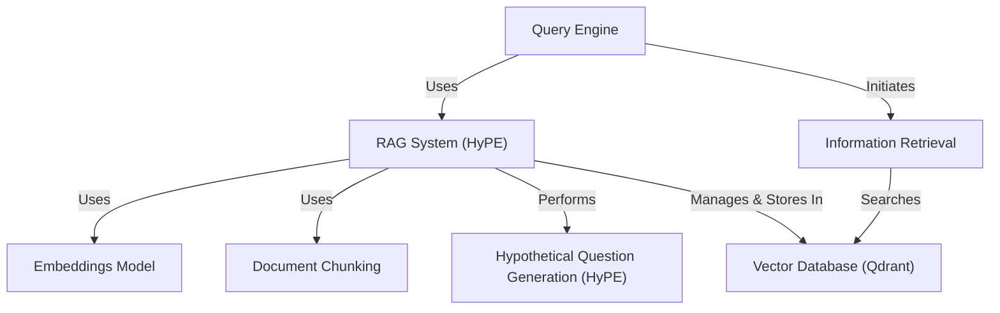
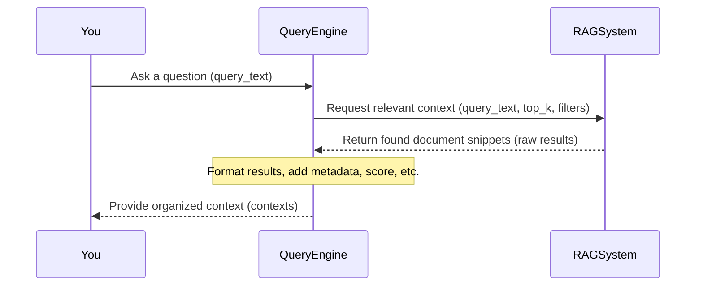
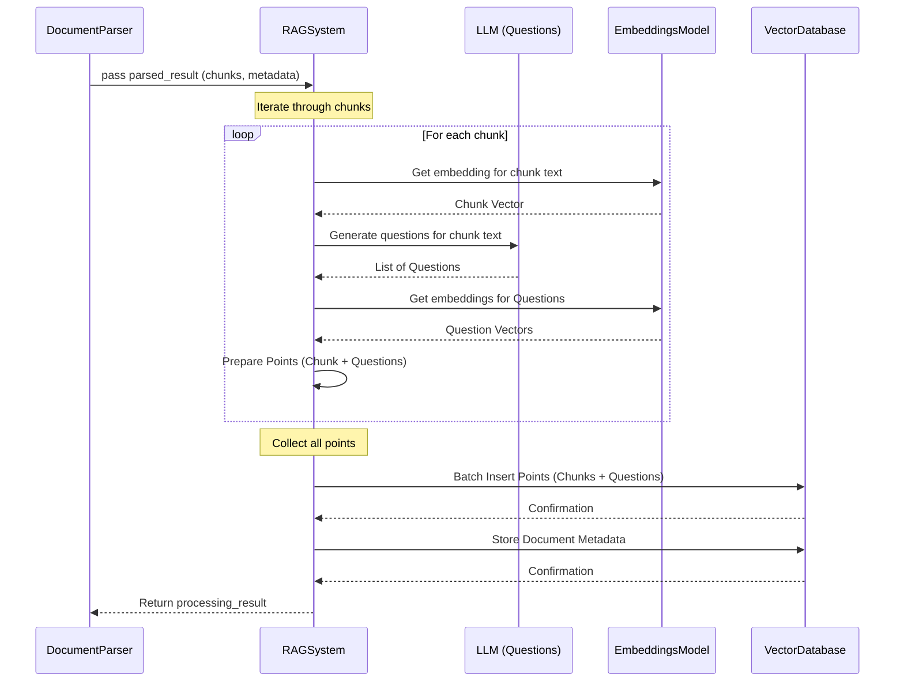
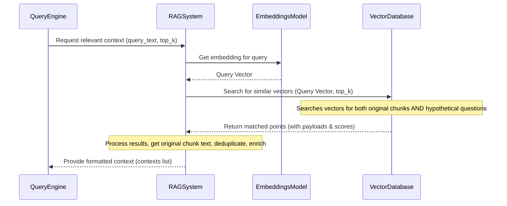
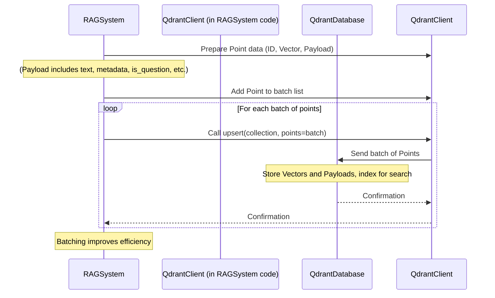
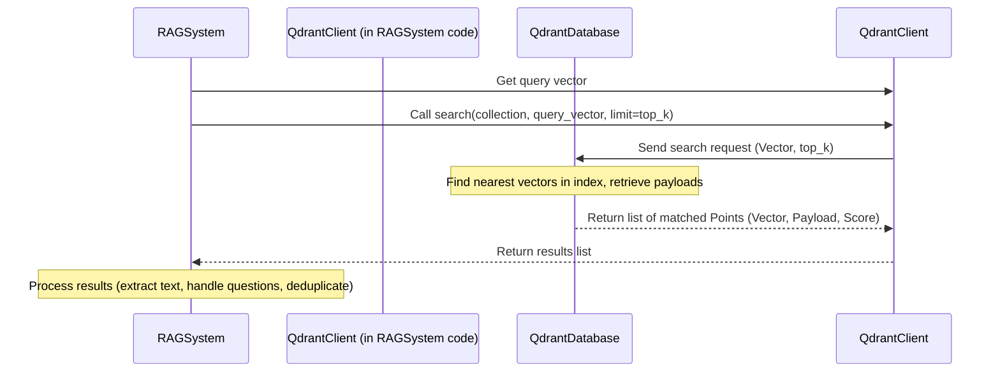
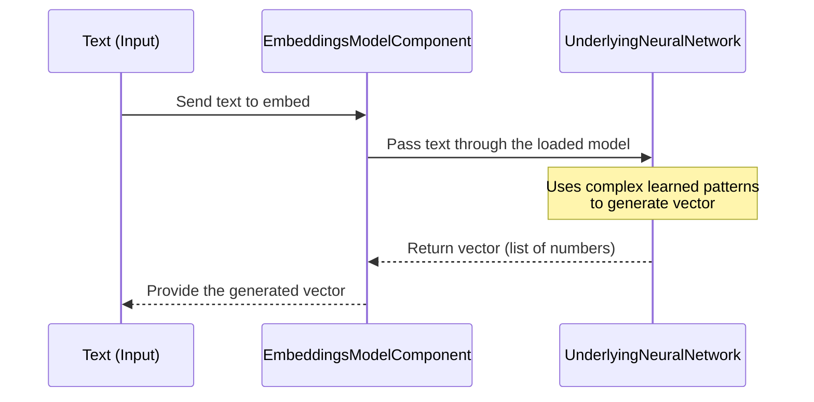
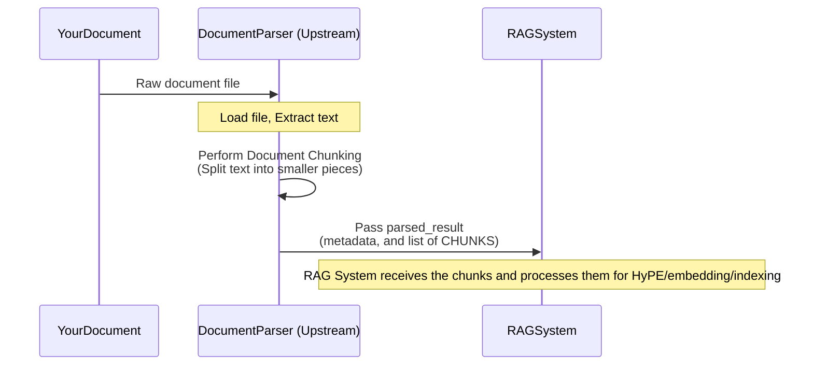
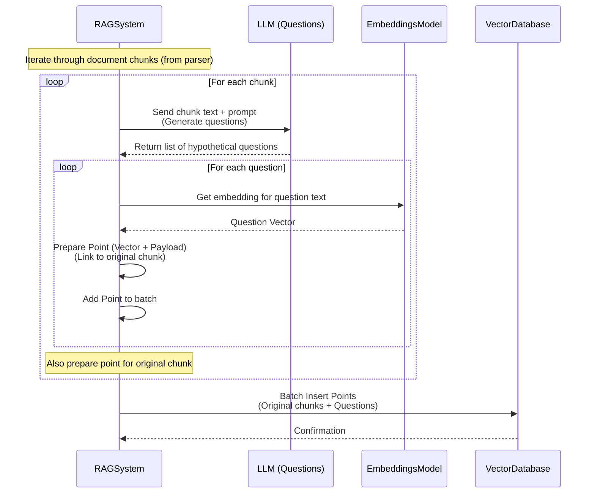

The project `regulaite` functions as a **smart document assistant**. It *processes documents* by breaking them into smaller parts (**Document Chunking**) and generating *potential questions* (**Hypothetical Question Generation**) for each part. It converts all this information into numerical codes (**Embeddings Model**) and stores them in a specialized search engine (**Vector Database**). When you ask a question using the **Query Engine**, the system finds the most relevant parts (**Information Retrieval**) based on your query or the generated questions, providing *context* to help answer your question accurately.


## Visual Overview



## Chapters

1. [Query Engine](#chapter-1-query-engine)
2. [RAG System (HyPE)](#chapter-2-rag-system-hype)
3. [Information Retrieval](#chapter-3-information-retrieval)
4. [Vector Database (Qdrant)](#chapter-4-vector-database-qdrant)
5. [Embeddings Model](#chapter-5-embeddings-model)
6. [Document Chunking](#chapter-6-document-chunking)
7. [Hypothetical Question Generation (HyPE)](#chapter-7-hypothetical-question-generation-hype)

# Chapter 1: Query Engine

Welcome to the `regulaite` tutorial! In this first chapter, we'll meet the **Query Engine**. Think of the Query Engine as your main tool for asking questions and getting information from the system. It's like talking to a very smart research assistant who knows how to find the information you need within your documents.

## What is the Query Engine?

Imagine you have a huge collection of documents – manuals, reports, notes, anything! You want to ask a specific question about something buried deep inside these documents, but you don't want to spend hours reading everything yourself.

This is where the **Query Engine** comes in. Its job is to take your question and figure out which parts of your documents are most relevant to that question. It doesn't necessarily *write* the final answer for you (though it can help with that!), but its primary role is to find the relevant "context" or snippets of text from your documents.

Think of it like this:

*   **You:** "Hey, Query Engine, what's the maximum operating temperature for the Mark IV device?"
*   **Query Engine:** "Okay, I'll go find the document sections that talk about temperatures and the Mark IV."
*   **(Behind the scenes, it talks to other parts of the system)**
*   **Query Engine:** "Alright, I found these sentences/paragraphs from the manual that seem relevant. Here they are!"

These relevant pieces of text are what we call the **context**. This context is super useful because you (or another system, like an AI model) can then read *just* the context to formulate a direct answer to your question, without wading through irrelevant information.

## How to Ask the Query Engine a Question

In `regulaite`, the `RAGQueryEngine` class is our Query Engine. To use it, you first need to create an instance of it. The most important thing it needs is access to the "librarian" of our document collection, which in our system is called the [RAG System (HyPE)](#chapter-2-rag-system-hype). (Don't worry about the details of the RAG System yet, we'll cover that in the next chapter!).

Here's a simplified look at how you might set it up (we'll skip some setup details for now):

```python
# Imagine 'my_rag_system' is already set up (more on this later!)
# from rag.hype_rag import HyPERagSystem 
# my_rag_system = HyPERagSystem(...) 

from rag.query_engine import RAGQueryEngine

# Create the Query Engine, giving it our RAG system
query_engine = RAGQueryEngine(rag_system=my_rag_system)

# Now, ask a question!
query_text = "What are the benefits of using hybrid search?"

# Use the query method to get relevant context
results = query_engine.query(query_text=query_text, top_k=3) 

print(results)
```

This code snippet shows you asking the `query_engine` a question using the `query()` method. We specify the `query_text` (your question) and `top_k=3`, which means we want the top 3 most relevant pieces of context.

The `results` variable will contain the information found by the Query Engine. It will be a dictionary containing your original query and the `contexts` it found.

Here's what the output might look like (simplified example structure):

```json
{
  "query": "What are the benefits of using hybrid search?",
  "contexts": [
    {
      "text": "Hybrid search combines vector and keyword search...",
      "metadata": {"source": "document_abc.pdf", "page": 5, ...},
      "score": 0.85,
      "document_id": "doc_abc_123"
    },
    {
      "text": "Using both methods improves recall and precision...",
      "metadata": {"source": "report_xyz.docx", "page": 10, ...},
      "score": 0.78,
      "document_id": "doc_xyz_456"
    },
    {
      "text": "Vector search alone can sometimes miss important keywords...",
      "metadata": {"source": "document_abc.pdf", "page": 6, ...},
      "score": 0.72,
      "document_id": "doc_abc_123"
    }
  ],
  "timestamp": "...",
  "context_quality": "high"
}
```

As you can see, the `results` dictionary gives you the `query` you asked and a list of `contexts`. Each context item contains:
*   The `text` snippet from the original document.
*   `metadata` about where that text came from (like file name, page number, etc.).
*   A `score` indicating how relevant the system thought this piece was.
*   The ID of the document it came from.

The Query Engine also adds a `timestamp` and a simple `context_quality` assessment based on the scores.

## What Happens When You Call `query()`? (Under the Hood)

When you call `query_engine.query("your question")`, the Query Engine doesn't do the heavy lifting of searching itself. Instead, it delegates that task to the [RAG System (HyPE)](#chapter-2-rag-system-hype).

Here's a simple step-by-step flow:

1.  You ask the Query Engine your question.
2.  The Query Engine takes your question and hands it over to the [RAG System (HyPE)](#chapter-2-rag-system-hype), saying, "Hey RAG System, find me the best document pieces for this question!"
3.  The [RAG System (HyPE)](#chapter-2-rag-system-hype) goes off and does the complex work of searching through your documents (more on this in Chapter 2!).
4.  The [RAG System (HyPE)](#chapter-2-rag-system-hype) finds the relevant document pieces and gives them back to the Query Engine.
5.  The Query Engine takes these raw results, organizes them nicely (into the `contexts` list format we saw), and adds any extra info like timestamps or quality scores.
6.  The Query Engine gives the final formatted results back to you.

Here is a simple diagram showing this interaction:



This diagram shows that the Query Engine acts as an intermediary. It's the friendly face you talk to, but it relies on the [RAG System (HyPE)](#chapter-2-rag-system-hype) to do the actual searching.

## Looking at the Code

Let's peek at the `RAGQueryEngine` code (in `backend/rag/query_engine.py`) to see this in action.

First, when the `RAGQueryEngine` is created, it needs the RAG system:

```python
# From backend/rag/query_engine.py

class RAGQueryEngine:
    # ... other code ...
    def __init__(
        self,
        rag_system, # <--- It needs the rag_system here!
        model_name: str = "gpt-4o-mini",
        # ... other parameters ...
    ):
        """
        Initialize the RAG query engine
        """
        self.rag_system = rag_system # <--- It stores the rag_system
        # ... rest of init ...
```

This snippet from the `__init__` method shows that when you create a `RAGQueryEngine`, you must provide the `rag_system` object, and the engine keeps a reference to it (`self.rag_system`).

Now, look at the `query` method:

```python
# From backend/rag/query_engine.py

async def query(self, query_text: str, top_k: int = 5, search_filter: Optional[Dict[str, Any]] = None, debug: bool = False, streaming: bool = False, custom_prompt: Optional[str] = None) -> Dict[str, Any]:
    """
    Query the RAG system and return results with context
    """
    try:
        # Get context from RAG system
        # <--- This is where the Query Engine talks to the RAG System!
        context_results = self.rag_system.retrieve(query_text, top_k=top_k, filters=search_filter)

        # Format context for response
        contexts = []
        for res in context_results:
            # Include the full result in context
            ctx_item = {
                "text": res.get("text", ""),
                "metadata": res.get("metadata", {}),
                "score": res.get("score", 0),
                "document_id": res.get("metadata", {}).get("doc_id", "unknown")
            }
            contexts.append(ctx_item)

        response = {
            "query": query_text,
            "contexts": contexts, # The formatted list
            # ... other response details like timestamp, quality ...
        }

        return response
    # ... error handling ...
```

See the line `context_results = self.rag_system.retrieve(...)`? This is the key part! The `query` method of the `RAGQueryEngine` calls the `retrieve` method on the `rag_system` object it holds. It passes your `query_text`, how many results (`top_k`) you want, and any optional `filters`.

The code that follows takes the `context_results` returned by the RAG system and formats them into the clean `contexts` list we saw in the example output.

There's also a `generate_answer` method in the `RAGQueryEngine` class. This method takes the query and the context returned by `query()` and uses an AI model (like GPT) to write a human-friendly answer based *only* on that context. While the `query` method focuses on *finding* the context, `generate_answer` focuses on *using* the context to create a summary or answer. You could use the results from `query()` with *any* tool or model you like, but the `generate_answer` method provides a convenient built-in way to get a direct answer.

## Conclusion

In this chapter, we learned that the **Query Engine** is your main point of contact for interacting with the `regulaite` system. You give it a question, and it works with the [RAG System (HyPE)](#chapter-2-rag-system-hype) to find the most relevant pieces of information (the context) from your documents. It then presents this context to you in an organized way. It's the first step in getting answers from your document collection.

Now that we know *who* we talk to (the Query Engine), let's find out *who* the Query Engine talks to to get the actual information – the **RAG System**.

# Chapter 2: RAG System (HyPE)

Welcome back to the `regulaite` tutorial! In the last chapter, we met the [Query Engine](#chapter-1-query-engine). We learned that it's your primary way to ask questions, but it doesn't actually store or find the documents itself. Instead, it asks the **RAG System** for help.

So, what exactly *is* this RAG System that the Query Engine relies on? Let's find out!

## What is the RAG System (HyPE)?

Think of the RAG System as the *heart* of your document collection. If the Query Engine is the helpful assistant you talk to, the RAG System is the **smart librarian** who knows exactly where everything is stored, how it's organized, and how to quickly find relevant pieces when asked.

Its main job is two-fold:

1.  **Ingest Documents:** Take new documents, process them, and store them in a way that makes them searchable.
2.  **Retrieve Information:** When the Query Engine asks for information related to a query, search through the stored documents and find the most relevant parts.

The "RAG" part stands for **Retrieval Augmented Generation**. In simple terms:

*   **Retrieval:** Finding relevant information from your documents.
*   **Augmented Generation:** Using that found information to help a language model generate a better, more informed answer.

`regulaite`'s RAG System specifically focuses on the **Retrieval** part. Its goal is to find the *best context* (relevant text snippets) for any given question or task.

The "(HyPE)" part of the name refers to **Hypothetical Document Embedding**. This is a special technique `regulaite` uses to make retrieval even smarter. We'll explain this twist shortly!

## HyPE: The Smart Twist

Imagine you have a paragraph in a document that describes "the process for requesting temporary access exceptions." If you search for "requesting temporary access exceptions," a basic system might find it easily. But what if you search for "how do I get a temporary security bypass?"? The document might not use the words "security bypass" or "get," but the *content* of the paragraph *answers* that question.

Traditional search systems often rely heavily on keyword matching or simple semantic similarity to the text itself. HyPE adds another layer:

*   For every piece of text (a "chunk") it processes, the RAG System **generates several hypothetical questions** that this chunk might answer.
*   It then **indexes** both the original text chunk *and* these hypothetical questions.

When you ask a query, the system searches not only for text similar to your query, but also for the *hypothetical questions* that are similar to your query. If your query matches a hypothetical question, the system knows that the *original chunk* associated with that question is likely relevant, even if the chunk's text doesn't contain your exact keywords.

This is like the smart librarian not just indexing the book title and summary, but also adding index cards for common questions the book's content would answer.

## How Does the RAG System Work (High Level)?

The `HyPERagSystem` class (`backend/rag/hype_rag.py`) is our smart librarian. Here's a simplified view of its core processes:

1.  **Receiving Documents:** It takes documents that have already been broken down into smaller pieces (chunks) by another part of the system ([Document Chunking](#chapter-6-document-chunking)).
2.  **Generating Questions:** For each chunk of text, it uses an AI model (a Language Model, or LLM) to create several relevant hypothetical questions ([Hypothetical Question Generation (HyPE)](#chapter-7-hypothetical-question-generation-hype)).
3.  **Creating Embeddings:** It converts the original chunks *and* the generated questions into numerical representations called vectors using an [Embeddings Model](#chapter-5-embeddings-model). These vectors capture the meaning of the text.
4.  **Storing in the Database:** It stores these vectors, along with the original text and metadata (like where the text came from), in a searchable database, specifically a [Vector Database (Qdrant)](#chapter-4-vector-database-qdrant).
5.  **Retrieval:** When queried, it takes the query, turns it into a vector, and searches the database for vectors (representing chunks or questions) that are numerically similar to the query vector ([Information Retrieval](#chapter-3-information-retrieval)). It then returns the original text chunks associated with the most similar vectors found.

## Using the RAG System: Adding Documents

The main way you interact with the RAG System to add data is by giving it the result of a parsed document. This usually happens after a file has been uploaded and processed by a separate parsing component. The `process_parsed_document` method is key here.

Here's a simplified look at how you might call it (assuming `my_rag_system` is set up and you have a `parsed_result`):

```python
# Imagine my_rag_system is initialized...
# from rag.hype_rag import HyPERagSystem
# my_rag_system = HyPERagSystem(...) 

# Assume 'parsed_data' comes from a document parsing step
parsed_data = {
    "doc_id": "doc_abc_123",
    "chunks": [
        {"text": "Chunk 1 text...", "metadata": {"page": 1}},
        {"text": "Chunk 2 text...", "metadata": {"page": 1}},
        # ... more chunks ...
    ],
    "metadata": {"filename": "report.pdf", "title": "Annual Report 2023"},
    "content": "Full document text...", # Fallback content
    "file_name": "report.pdf"
}

# Process the parsed document using the RAG System
processing_result = my_rag_system.process_parsed_document(parsed_data)

print(processing_result)
```

When you run this, the `process_parsed_document` method will take the chunks from `parsed_data`, generate questions for each, create embeddings for everything, and store them in the database.

The `processing_result` will be a dictionary giving you feedback on the operation, something like this:

```json
{
  "status": "success",
  "doc_id": "doc_abc_123",
  "total_chunks": 10,         // Total chunks in the document
  "processed_chunk_count": 10, // Chunks successfully processed
  "vector_count": 60,         // Total vectors added (e.g., 10 chunks + 50 questions)
  "question_count": 50,       // Total hypothetical questions generated
  "processing_time": 15.5     // Time taken in seconds
}
```

This tells you that the document processing was successful, how many pieces were processed, and how many data points (vectors) were added to the database.

## What Happens When You Process a Document? (Under the Hood)

Let's peel back the curtain and see what happens inside the `HyPERagSystem` when you call `process_parsed_document`.

1.  **Receive Parsed Data:** The method gets the `parsed_result` dictionary containing the document ID, original metadata, and most importantly, the list of pre-processed `chunks`.
2.  **Prepare for Processing:** It sets up some base metadata to be included with all the pieces from this document (like the `doc_id`).
3.  **Process Each Chunk:** It goes through each `chunk` provided in the list.
4.  **Chunk Processing (`_process_parsed_chunk`):** For *each* chunk, a dedicated step occurs:
    *   Get the text of the current chunk.
    *   Get the vector embedding for the chunk text (either provided or generated).
    *   **Generate Questions:** It calls the `generate_hypothetical_questions` method, which uses a Large Language Model (LLM) to create questions that the chunk text could answer.
    *   **Embed Questions:** It gets vector embeddings for *each* of the generated questions.
    *   **Create Points:** It prepares data structures (called `PointStruct` in Qdrant) for *both* the original chunk *and* each generated question. These points include the vector embedding and a `payload` dictionary holding the text, metadata, source document ID, chunk index, and crucial flags like `is_question`. The question points also store a reference back to their `original_chunk_text`.
5.  **Collect Points:** The points created for the chunk and its questions are added to a main list of points to be indexed.
6.  **Batch Upsert:** After processing all chunks, the system takes the collected list of points (which includes points for both original chunks and all generated questions) and sends them in batches to the [Vector Database (Qdrant)](#chapter-4-vector-database-qdrant) for storage and indexing.
7.  **Store Metadata:** It stores the document-level metadata (like filename, title, etc.) in a separate collection in Qdrant, linked by `doc_id`. This metadata is used later to display document information in the frontend and during retrieval enrichment.

Here's a simplified sequence diagram showing this process:



This diagram illustrates how the RAG System coordinates different components – the LLM for question generation, the Embeddings Model for creating vectors, and the Vector Database for storage – to ingest the document pieces.

## Looking at the Code

Let's look at snippets from `backend/rag/hype_rag.py` to see this in the code.

First, the `__init__` method shows that the system needs connections to the embedding model, LLM, and Qdrant:

```python
# From backend/rag/hype_rag.py

class HyPERagSystem:
    def __init__(
        self,
        # ... other params ...
        qdrant_url: str = "http://regulaite-qdrant:6333",
        embedding_model: str = "...",
        llm_model: str = "gpt-4o-mini",
        # ... other params ...
    ):
        # ... connection setup ...
        self.embedding_model = HuggingFaceEmbedding(model_name=embedding_model)
        self.qdrant_client = QdrantClient(url=qdrant_url, ...)
        self.llm = ChatOpenAI(model=llm_model, api_key=self.openai_api_key)
        # ... other setup ...
```

The `process_parsed_document` method orchestrates the chunk processing:

```python
# From backend/rag/hype_rag.py

    def process_parsed_document(self, parsed_result: Dict[str, Any]) -> Dict[str, Any]:
        # ... setup and error handling ...
        chunks = parsed_result.get("chunks", [])
        metadata = parsed_result.get("metadata", {})
        doc_id = parsed_result.get("doc_id")
        
        # ... checks ...

        # If we have pre-parsed chunks, store them and generate questions
        if chunks:
            return self._process_parsed_chunks(doc_id, chunks, metadata)
        # ... fallback to content if no chunks ...

    # ... rest of class ...
```
This method mainly calls `_process_parsed_chunks` if chunks are available.

The `_process_parsed_chunks` method handles iterating through chunks and parallelizing the work:

```python
# From backend/rag/hype_rag.py

    def _process_parsed_chunks(self, doc_id: str, chunks: List[Dict[str, Any]], metadata: Dict[str, Any]) -> Dict[str, Any]:
        # ... setup ...
        points_to_add = []
        
        with ThreadPoolExecutor(max_workers=self.max_workers) as executor:
            futures = []
            for i, chunk in enumerate(chunks):
                # ... prepare chunk metadata ...
                futures.append(
                    executor.submit(
                        self._process_parsed_chunk, # Calls the method for a single chunk
                        chunk_text,
                        chunk_id,
                        chunk_metadata,
                        chunk.get("embedding", []) # Potentially uses existing embedding
                    )
                )
            
            # Wait for all futures to complete and collect results
            for future in as_completed(futures):
                 chunk_points, questions_count = future.result()
                 if chunk_points:
                     points_to_add.extend(chunk_points) # Collect points
        
        # Batch insert collected points
        if points_to_add:
             self._batch_upsert_with_retry(
                 collection_name=self.collection_name,
                 points=points_to_add,
                 # ... batching params ...
             )
        # ... store metadata ...
        # ... return results ...
```
This snippet shows how it loops through `chunks`, submits each one to `_process_parsed_chunk` (often in parallel using a `ThreadPoolExecutor`), and then collects all the points generated by those tasks to `points_to_add` before finally performing a batch insert.

The `_process_parsed_chunk` method is where the magic happens for a single piece:

```python
# From backend/rag/hype_rag.py

    def _process_parsed_chunk(self, chunk_text: str, chunk_id: str, metadata: Dict[str, Any], embedding: List[float] = None) -> Tuple[List[PointStruct], int]:
        points_to_add = []
        questions_generated = 0
        
        try:
            # 1. Create point for the chunk itself (using provided or generated embedding)
            if embedding and len(embedding) > 0:
                chunk_embedding = embedding
            else:
                chunk_embedding = self.embedding_model.get_text_embedding(chunk_text)
                
            chunk_payload = {
                "text": chunk_text,
                "is_question": False, # Not a question
                # ... other payload fields like doc_id, chunk_index, metadata ...
            }
            points_to_add.append(
                PointStruct(id=chunk_id, vector=chunk_embedding, payload=chunk_payload)
            )
            
            # 2. Generate hypothetical questions
            questions = self.generate_hypothetical_questions(chunk_text)
            
            # 3. Create points for each question
            for i, question_text in enumerate(questions):
                question_embedding = self.embedding_model.get_text_embedding(question_text)
                question_point_id = str(uuid.uuid4())
                
                question_payload = {
                    "text": question_text, # The question text
                    "original_chunk_text": chunk_text, # Reference to original chunk
                    "is_question": True, # THIS IS A QUESTION!
                    # ... other payload fields like doc_id, parent_chunk_id, metadata ...
                }
                points_to_add.append(
                    PointStruct(id=question_point_id, vector=question_embedding, payload=question_payload)
                )
                questions_generated += 1

            # ... Add BM25 nodes (omitted for simplicity) ...

            return points_to_add, questions_generated
        # ... error handling ...
```
This simplified snippet highlights the core steps: embedding the chunk, generating questions, embedding the questions, and creating `PointStruct` objects for *both* types of content, critically marking `is_question` in the payload.

## Using the RAG System: Retrieving Information

As we saw in Chapter 1, the Query Engine calls the RAG System's `retrieve` method when you ask a question.

```python
# Called by the QueryEngine:
# context_results = self.rag_system.retrieve(query_text, top_k=top_k, filters=search_filter)
```

When `retrieve` is called:

1.  The RAG System takes your `query_text`.
2.  It gets the vector embedding of your `query_text` using the [Embeddings Model](#chapter-5-embeddings-model).
3.  It sends this query vector to the [Vector Database (Qdrant)](#chapter-4-vector-database-qdrant) to search for similar vectors. Because it stored vectors for *both* original chunks and hypothetical questions, this search finds documents where:
    *   The original text is similar to your query.
    *   Or, a hypothetical question generated *from* the text is similar to your query (this is the HyPE benefit!).
4.  When it gets results from Qdrant, it checks the `is_question` flag in the payload. If a result is a hypothetical question (`is_question` is True), it retrieves the `original_chunk_text` that generated that question.
5.  It collects the original chunk text (whether the match was direct to the chunk or via a question) and deduplicates them so you don't get the same chunk multiple times.
6.  It adds relevant metadata (fetching it from the separate metadata collection) like filename and page number to the results.
7.  Finally, it returns the top `top_k` most relevant *original document chunks* (along with their metadata and score) back to the Query Engine.

Here's a simplified look at the `retrieve` method:

```python
# From backend/rag/hype_rag.py

    def retrieve(self, query: str, top_k: int = 5, filters: Dict[str, Any] = None) -> List[Dict[str, Any]]:
        # ... setup and error handling ...
        
        # Step 1: Get query embedding
        query_embedding = self.embedding_model.get_text_embedding(query)
        
        # Step 2: Search Qdrant (including questions)
        results = self.qdrant_client.search(
             collection_name=self.collection_name,
             query_vector=query_embedding,
             limit=top_k * 2, # Get more results initially
             with_payload=True
             # ... add filters ...
        )
        
        # Step 3: Process results (convert questions to chunks, deduplicate)
        documents = []
        seen_chunks = set()
        
        for result in results:
            payload = result.payload
            is_question = payload.get("is_question", False)
            
            if is_question:
                # Found a question, get the original chunk text
                original_chunk_text = payload.get("original_chunk_text", "")
                doc_id = payload.get("doc_id", "")
                chunk_index = payload.get("chunk_index", 0)
                chunk_identifier = f"{doc_id}_chunk_{chunk_index}" # Unique ID for the chunk
                
                if chunk_identifier not in seen_chunks and original_chunk_text:
                    # Add the original chunk
                    doc = {
                        "text": original_chunk_text,
                        "metadata": payload.get("metadata", {}),
                        "score": result.score,
                        "matched_via": "question" # Indicate how we found it
                        # ... other chunk info ...
                    }
                    documents.append(doc)
                    seen_chunks.add(chunk_identifier)
            else:
                # Found a direct chunk
                doc_id = payload.get("doc_id", "")
                chunk_index = payload.get("chunk_index", 0)
                chunk_identifier = f"{doc_id}_chunk_{chunk_index}"
                
                if chunk_identifier not in seen_chunks:
                    # Add the chunk as-is
                    doc = payload.copy()
                    doc["score"] = result.score
                    doc["matched_via"] = "chunk" # Indicate how we found it
                    documents.append(doc)
                    seen_chunks.add(chunk_identifier)
            
            # Stop if we have enough unique results
            if len(documents) >= top_k:
                 break

        # Step 4: Sort, limit, enrich with metadata
        documents = sorted(documents, key=lambda x: x.get("score", 0), reverse=True)[:top_k]
        documents = self._enrich_documents_with_metadata(documents)
        
        return documents
```
This snippet shows the core retrieval logic: embedding the query, searching Qdrant (which returns both chunk and question matches), and then the crucial step of extracting the `original_chunk_text` if a question point was matched, before returning the unique, relevant chunks.

## Conclusion

The **RAG System (HyPE)** is the crucial component in `regulaite` that manages your document collection. It takes in processed documents, uses Hypothetical Document Embedding (HyPE) by generating and indexing questions alongside the original text chunks, converts everything into searchable vectors, and stores them in a [Vector Database (Qdrant)](#chapter-4-vector-database-qdrant).

When the [Query Engine](#chapter-1-query-engine) asks for information, the RAG System performs the **Retrieval** step, using the HyPE index (chunks and questions) to find the most relevant original text snippets, which it then returns. It's the engine that powers finding the "context" for any query.

Now that we understand how documents are processed and stored, and how the system finds relevant pieces, let's dive deeper into the **Information Retrieval** step itself and explore the different ways the system searches.

# Chapter 3: Information Retrieval

Welcome back! In the last chapter ([RAG System (HyPE)](#chapter-2-rag-system-hype)), we explored how the RAG System acts as the smart librarian, responsible for processing your documents and storing them in a way that makes them searchable, including the clever HyPE technique of generating and indexing hypothetical questions. We saw how it gets documents ready to be found.

Now, let's focus on the *finding* part itself. This is where **Information Retrieval** comes in. It's the core process the system uses when you ask a question – taking your query and searching through all the processed document pieces to pull out the most relevant ones.

## What is Information Retrieval?

Imagine you have a massive library, but instead of browsing shelves, you type a question into a computer system. **Information Retrieval** is what happens inside that computer to figure out which books, chapters, or even specific paragraphs in the library are most likely to contain the answer to your question.

In the context of `regulaite` and its RAG System, Information Retrieval is the process of:

1.  Taking your question (the "query").
2.  Understanding what that question is really about (its meaning).
3.  Searching through the vast collection of document pieces (the "corpus") managed by the RAG System.
4.  Finding the pieces that are most relevant to your question.
5.  Returning those relevant pieces, which we call **context**.

The goal is simple: to find the best possible source material from your documents that can help answer your query accurately.

## How Does `regulaite` Find Information? (HyPE-Enhanced Vector Search)

Traditional search often relies on keywords. If your query uses the exact words in a document, you find it. But what if the document uses different words to describe the same concept? This is where modern Information Retrieval systems, like `regulaite`, go beyond simple keyword matching.

`regulaite` uses a powerful technique based on **vector similarity search**. Here's the idea:

*   **Understanding Meaning with Vectors:** As we'll see in a later chapter ([Embeddings Model](#chapter-5-embeddings-model)), both your query and the document pieces (chunks and hypothetical questions) are converted into numerical representations called **vectors**. These vectors are like coordinates in a huge mathematical space, where texts with similar meanings are located closer to each other.
*   **Searching for Similarity:** When you submit a query, the system converts your query into a vector. It then searches the [Vector Database (Qdrant)](#chapter-4-vector-database-qdrant) for stored vectors (representing chunks and questions) that are numerically *closest* to your query vector. The closer the vectors, the more likely the document piece is relevant.
*   **The HyPE Advantage:** Remember the hypothetical questions from the [RAG System (HyPE)](#chapter-2-rag-system-hype) chapter? This is where they help! By searching against both the *original chunk vectors* and the *hypothetical question vectors*, the system increases its chances of finding relevant information. Your query might be semantically similar to a hypothetical question, even if it doesn't use the same words as the original chunk text. If a question is matched, the system retrieves the *original chunk* that question came from.

This approach, searching across both chunk embeddings and hypothetical question embeddings using vector similarity, makes the retrieval more robust and better able to understand the underlying meaning of your query.

## Triggering Information Retrieval

As we saw in Chapter 1, you initiate the search process by calling the `query()` method on the [Query Engine](#chapter-1-query-engine).

```python
# Imagine 'query_engine' is set up as shown in Chapter 1
# query_engine = RAGQueryEngine(rag_system=my_rag_system)

query_text = "How can I request a temporary security bypass?"

# Calling query() starts the information retrieval process
results = query_engine.query(query_text=query_text, top_k=3) 

print(results)
```

When `query_engine.query(query_text=query_text, top_k=3)` is called, the Query Engine doesn't perform the search itself. It delegates this task to the [RAG System (HyPE)](#chapter-2-rag-system-hype), specifically calling its `retrieve()` method. The `retrieve()` method is the core function responsible for Information Retrieval.

The output `results` will contain the original query and the list of `contexts`, where each context is a relevant piece of text (an original document chunk) found through the retrieval process.

```json
{
  "query": "How can I request a temporary security bypass?",
  "contexts": [
    {
      "text": "Neo Financia recognizes that temporary exceptions to the PSSI...", // This is the original chunk text
      "metadata": {"source": "security_policy.pdf", "page": 10, ...},
      "score": 0.88, // High score for relevance
      "document_id": "doc_xyz_456"
      // Note: This might have been found because the query
      // was similar to a *hypothetical question* like
      // "What is the process for requesting temporary access exceptions?"
    },
    // ... other relevant contexts ...
  ],
  // ... other details ...
}
```

Notice that even if the system matched a *hypothetical question* like "What is the process for requesting temporary access exceptions?", the `text` returned in the `contexts` is the *original document chunk* that generated that question. Information Retrieval's goal is to give you the source material.

## What Happens During Retrieval? (Under the Hood)

Let's trace the steps inside the [RAG System (HyPE)](#chapter-2-rag-system-hype)'s `retrieve()` method when the [Query Engine](#chapter-1-query-engine) calls it:

1.  **Query Embedding:** The `retrieve` method takes your `query_text`. It uses the [Embeddings Model](#chapter-5-embeddings-model) to convert this text into a vector. This vector represents the meaning of your question.
2.  **Vector Database Search:** The query vector is sent to the [Vector Database (Qdrant)](#chapter-4-vector-database-qdrant). The database is asked to find points (vectors) within its collection that are numerically closest to the query vector. Crucially, this collection contains vectors for *both* the original document chunks and the hypothetical questions generated from them.
3.  **Result Collection:** The [Vector Database (Qdrant)](#chapter-4-vector-database-qdrant) returns a list of the most similar vectors found, along with their payloads (which contain the original text, whether it was a chunk or a question, metadata, etc.) and a similarity score.
4.  **Processing Results:** The RAG System loops through these results. For each result:
    *   It checks the payload to see if the matched point was an `is_question`.
    *   If `is_question` is True (it matched a hypothetical question), it extracts the `original_chunk_text` that was stored alongside the question vector.
    *   If `is_question` is False (it matched an original chunk directly), it uses the `text` from the matched point.
    *   It collects the original chunk text and its associated metadata.
5.  **Deduplication:** Since a single original chunk might be matched either directly *or* via one or more of its hypothetical questions, the system deduplicates the results to ensure you only get each unique original chunk once.
6.  **Enrichment:** It adds additional metadata (like the document filename or title) to the retrieved chunks, often by looking up the document's ID in a separate metadata store within Qdrant.
7.  **Return Top Results:** The RAG System sorts the unique, relevant chunks by their similarity score and returns the top `top_k` results back to the [Query Engine](#chapter-1-query-engine).

Here is a simplified sequence diagram showing this Information Retrieval flow:



This diagram illustrates how the RAG System coordinates the Embeddings Model and the Vector Database to perform the core search operation, ultimately returning the original source document chunks that are most relevant to the user's query.

## Looking at the Code

Let's look at snippets from the `HyPERagSystem` class (`backend/rag/hype_rag.py`) focusing on the `retrieve` method.

First, getting the query embedding:

```python
# From backend/rag/hype_rag.py

    def retrieve(self, query: str, top_k: int = 5, filters: Dict[str, Any] = None) -> List[Dict[str, Any]]:
        # ... setup and error handling ...
        
        # Step 1: Get query embedding
        query_embedding = self.embedding_model.get_text_embedding(query)
        
        # ... rest of method ...
```

This is the first step: turning the user's plain text query into a numerical vector using the embedding model.

Next, searching the [Vector Database (Qdrant)](#chapter-4-vector-database-qdrant):

```python
# From backend/rag/hype_rag.py

    def retrieve(self, query: str, top_k: int = 5, filters: Dict[str, Any] = None) -> List[Dict[str, Any]]:
        # ... get query embedding ...
        
        # Step 2: Search Qdrant (including questions)
        results = self.qdrant_client.search(
             collection_name=self.collection_name,
             query_vector=query_embedding, # Use the query vector
             limit=top_k * 2, # Get more results initially to help with deduplication
             with_payload=True
             # ... add filters ...
        )
        
        # ... rest of method ...
```

Here, the RAG System calls the `search` method of the `qdrant_client`. It specifies the collection name (where the chunk and question vectors are stored), the `query_vector` it just created, and how many results (`limit`) to fetch. Fetching slightly more (`top_k * 2`) helps ensure we have enough unique *original chunks* after processing questions and deduplicating.

Finally, processing the results to get the original chunks:

```python
# From backend/rag/hype_rag.py

    def retrieve(self, query: str, top_k: int = 5, filters: Dict[str, Any] = None) -> List[Dict[str, Any]]:
        # ... get query embedding ...
        # ... search Qdrant ...
        
        # Step 3: Process results (convert questions to chunks, deduplicate)
        documents = []
        seen_chunks = set() # Keep track of chunk IDs already added
        
        for result in results:
            payload = result.payload
            is_question = payload.get("is_question", False) # Check if it's a question vector
            
            # Create a unique identifier for the original chunk this result refers to
            doc_id = payload.get("doc_id", "")
            chunk_index = payload.get("chunk_index", 0)
            chunk_identifier = f"{doc_id}_chunk_{chunk_index}" 
            
            # Only add the original chunk if we haven't seen it yet
            if chunk_identifier not in seen_chunks:
                
                if is_question:
                    # Found a question, use the original chunk text
                    original_chunk_text = payload.get("original_chunk_text", "")
                    if original_chunk_text: # Ensure text is not empty
                         doc = {
                            # ... include relevant details like doc_id, metadata, score ...
                            "text": original_chunk_text, # Use the original text
                            "matched_via": "question" # Note how it was found
                         }
                         documents.append(doc)
                         seen_chunks.add(chunk_identifier)
                         # Stop if we have enough unique results
                         if len(documents) >= top_k: break # Break after adding a unique chunk
                         
                else:
                    # Found a direct chunk match
                    doc_text = payload.get("text", "")
                    if doc_text: # Ensure text is not empty
                         doc = payload.copy()
                         doc["score"] = result.score
                         doc["matched_via"] = "chunk" # Note how it was found
                         documents.append(doc)
                         seen_chunks.add(chunk_identifier)
                         # Stop if we have enough unique results
                         if len(documents) >= top_k: break # Break after adding a unique chunk

        # Step 4: Sort, limit, enrich with metadata (Simplified - actual code does more)
        documents = sorted(documents, key=lambda x: x.get("score", 0), reverse=True)[:top_k] # Re-sort by score just in case
        # ... self._enrich_documents_with_metadata(documents) happens here ...
        
        return documents # Return the list of unique, relevant original chunks
```

This code snippet shows the core logic: it iterates through the search `results`, checks if a result came from a hypothetical question (`is_question`), and if so, grabs the `original_chunk_text`. It adds the original chunk to the `documents` list only if that specific chunk hasn't been added already (`seen_chunks`). Finally, it ensures only the top `top_k` unique chunks are returned.

This method effectively uses vector search over the combined pool of chunk and question embeddings (thanks to HyPE) to find the best original document passages.

## Conclusion

**Information Retrieval** is the engine that powers the search feature in `regulaite`. It takes your query, transforms it using vector embeddings, and searches the [Vector Database (Qdrant)](#chapter-4-vector-database-qdrant) for the most relevant document pieces. By leveraging the HyPE technique (searching against hypothetical questions as well as original chunks), the system improves its ability to understand the meaning of your query and find truly relevant source material, even if exact keywords aren't present. The output of this process is the "context" – the relevant document chunks that the [Query Engine](#chapter-1-query-engine) then provides.

Now that we know *how* the system searches, let's look at *where* all this searchable data – the vectors for chunks and questions – is stored: the **Vector Database**.


# Chapter 4: Vector Database (Qdrant)

Welcome back to the `regulaite` tutorial! In the previous chapters, we've explored the top layers of our system: the [Query Engine](#chapter-1-query-engine) (what you talk to), the [RAG System (HyPE)](#chapter-2-rag-system-hype) (the smart librarian), and [Information Retrieval](#chapter-3-information-retrieval) (how the librarian finds stuff).

We learned that when you ask a question, your query is turned into a numerical representation called a **vector**, and the system searches for document pieces whose vectors are "close" to your query vector. But where are all these vectors stored? And how does the system find the closest ones so quickly?

This is where the **Vector Database** comes in!

## What is a Vector Database?

Imagine you have thousands or millions of tiny maps (vectors), each representing a piece of information (like a document chunk or a hypothetical question). You need a special place to store these maps and, more importantly, a system that can instantly tell you which maps are geographically closest to a new map you just created (your query vector).

A **Vector Database** is that specialized storage system. Unlike traditional databases that are optimized for finding exact matches (like "find me all users named 'Alice'") or searching for keywords, a vector database is built specifically for **Similarity Search** using vectors. It excels at finding items whose vector representations are numerically "similar" to a given query vector.

Think of it like this:

| Feature          | Traditional Database (e.g., SQL)             | Vector Database (e.g., Qdrant)                   |
| :--------------- | :------------------------------------------- | :----------------------------------------------- |
| **Primary Data** | Text, numbers, structured records            | High-dimensional vectors (numerical lists)       |
| **Search Method**| Keyword matching, exact values, ranges       | Similarity search (finding nearest neighbors)    |
| **Goal**         | Find exact matches, specific records         | Find items with similar *meaning* or *content* |
| **Analogy**      | Filing cabinet organized alphabetically      | Library organized by topic/idea location on a map |

In `regulaite`, our Vector Database is **Qdrant**. Qdrant is an open-source vector database designed to store, search, and manage vector embeddings with a rich payload. It's highly performant for searching through millions or billions of vectors.

## Why `regulaite` Needs a Vector Database

Our [RAG System (HyPE)](#chapter-2-rag-system-hype) works by converting every document chunk and every hypothetical question into a vector using an [Embeddings Model](#chapter-5-embeddings-model). These vectors are the numerical "codes" that capture the meaning of the text.

To perform [Information Retrieval](#chapter-3-information-retrieval) efficiently, the system needs to:

1.  **Store** all these vectors reliably.
2.  **Associate** each vector with the original text it came from and relevant metadata (like the document ID, page number, or whether it's a question vector). This associated data is called the **payload**.
3.  Given a query vector, **quickly find** the vectors in storage that are most mathematically similar (closest) to it.

A traditional database simply isn't built for this third step. Trying to calculate similarity between millions of vectors in a traditional database would be incredibly slow. A vector database like Qdrant is specifically engineered to do this kind of "nearest neighbor search" at lightning speed.

Qdrant acts as `regulaite`'s long-term memory for the vectorized versions of your documents, ready to answer similarity queries initiated by the [RAG System (HyPE)](#chapter-2-rag-system-hype) during retrieval.

## How `regulaite` Uses Qdrant

Let's look at the two main ways the [RAG System (HyPE)](#chapter-2-rag-system-hype) interacts with Qdrant: storing data and searching data.

### Storing Data (Ingestion)

When you add a document to `regulaite` (processed by the [RAG System (HyPE)](#chapter-2-rag-system-hype)), here's how Qdrant is involved:

1.  The document is broken into chunks ([Document Chunking](#chapter-6-document-chunking)).
2.  For each chunk, an embedding vector is created ([Embeddings Model](#chapter-5-embeddings-model)).
3.  For each chunk, hypothetical questions are generated ([Hypothetical Question Generation (HyPE)](#chapter-7-hypothetical-question-generation-hype)).
4.  For each hypothetical question, an embedding vector is created ([Embeddings Model](#chapter-5-embeddings-model)).
5.  All these vectors (for original chunks *and* questions) are prepared to be stored in Qdrant. Each vector is packaged with a unique ID and a **payload**. The payload is a JSON-like structure containing the original text (either the chunk text or the question text), metadata about its source (doc ID, page), and importantly, a flag indicating if it's an `is_question` vector. The question vectors also store the `original_chunk_text` in their payload.
6.  The [RAG System (HyPE)](#chapter-2-rag-system-hype) then sends these packages of ID, vector, and payload to Qdrant for storage using an "upsert" operation (which means "insert if new, update if exists").

Qdrant takes these points (ID + Vector + Payload) and indexes them efficiently, so they can be searched later.

### Searching Data (Retrieval)

When you submit a query via the [Query Engine](#chapter-1-query-engine), which then calls the [RAG System (HyPE)](#chapter-2-rag-system-hype)'s `retrieve` method, here's how Qdrant is used for searching:

1.  Your query text is converted into a query vector ([Embeddings Model](#chapter-5-embeddings-model)).
2.  The [RAG System (HyPE)](#chapter-2-rag-system-hype) sends this query vector to Qdrant and asks it to find the `top_k` most similar vectors in its collection.
3.  Qdrant performs a highly optimized nearest neighbor search across all the stored vectors (chunks *and* questions). It calculates the numerical distance (similarity score) between the query vector and the stored vectors.
4.  Qdrant returns the results: a list of points (ID, vector, payload) that are most similar to the query vector, sorted by similarity score.
5.  The [RAG System (HyPE)](#chapter-2-rag-system-hype) receives these results. It examines the payload of each result to get the original text and metadata. If a result is a vector for a hypothetical question (`is_question` is True in the payload), the RAG System retrieves the `original_chunk_text` stored in that question vector's payload.
6.  The RAG System then compiles the unique original document chunks found and returns them as the "context" for your query.

## What Happens Inside Qdrant? (Under the Hood)

When the [RAG System (HyPE)](#chapter-2-rag-system-hype) talks to Qdrant, it's using a client library to send commands. Let's visualize the interactions.

### Storing Data Flow

Here's a simplified look at what happens when the RAG System adds points to Qdrant:



### Searching Data Flow

Here's a simplified look at what happens when the RAG System searches Qdrant:



These diagrams show that the Qdrant database handles the core tasks of storing the vector data and executing the high-speed similarity search requests.

## Looking at the Code

Let's peek at snippets from the `HyPERagSystem` class (`backend/rag/hype_rag.py`) to see how it interacts with Qdrant.

First, in the `__init__` method, the `QdrantClient` is initialized, pointing to where Qdrant is running (often in another Docker container):

```python
# From backend/rag/hype_rag.py

import qdrant_client
from qdrant_client import QdrantClient # Import the client
# ... other imports ...

class HyPERagSystem:
    def __init__(
        self,
        # ... other params ...
        qdrant_url: str = "http://regulaite-qdrant:6333", # Qdrant address
        # ... other params ...
    ):
        # ... connection setup ...
        logger.info(f"Connecting to Qdrant at {qdrant_url}")
        self.qdrant_client = QdrantClient( # Initialize the client
            url=qdrant_url,
            timeout=self.qdrant_timeout,
            grpc_port=6334, # Often uses gRPC for performance
            prefer_grpc=True
        )
        
        # ... collection creation/check (_ensure_collection_exists) ...
        
        logger.info("HyPE RAG System initialized successfully")
    # ... rest of class ...
```

This sets up the connection to the Qdrant database using the `QdrantClient`. The `_ensure_collection_exists` method (not shown here in detail) is called during initialization to make sure the collections (like `regulaite_documents` for vectors and `regulaite_metadata` for document info) are present in Qdrant.

Next, when processing chunks, the system creates `PointStruct` objects. A simplified view from `_process_parsed_chunk` shows how these points are structured:

```python
# From backend/rag/hype_rag.py (simplified snippet from _process_parsed_chunk)

from qdrant_client.models import PointStruct # Import PointStruct
# ... other imports ...

    def _process_parsed_chunk(self, chunk_text: str, chunk_id: str, metadata: Dict[str, Any], embedding: List[float] = None) -> Tuple[List[PointStruct], int]:
        points_to_add = []
        # ... setup ...
        
        # 1. Create point for the chunk itself
        chunk_embedding = self.embedding_model.get_text_embedding(chunk_text) # Get the vector
        chunk_point_id = str(uuid.uuid4()) # Unique ID for this point
        
        # Prepare payload for chunk - data to store alongside the vector
        chunk_payload = { 
            "node_id": f"{metadata.get('doc_id', 'unknown')}_chunk_{metadata.get('chunk_index', 0)}",
            "doc_id": metadata.get("doc_id", "unknown"),
            "chunk_id": chunk_point_id, # This point's ID
            "chunk_index": metadata.get("chunk_index", 0),
            "text": chunk_text, # The original text!
            "text_content_type": "chunk",
            "is_question": False, # Important flag
            "metadata": metadata.copy() # Original metadata
        }
        
        chunk_point = PointStruct( # Create the PointStruct object
            id=chunk_point_id, 
            vector=chunk_embedding, 
            payload=chunk_payload
        )
        points_to_add.append(chunk_point)
        
        # 2. Generate hypothetical questions and create points for them
        questions = self.generate_hypothetical_questions(chunk_text)
        for i, question_text in enumerate(questions):
            question_embedding = self.embedding_model.get_text_embedding(question_text)
            question_point_id = str(uuid.uuid4())
            
            question_payload = { # Payload for a question point
                "node_id": f"{chunk_point_id}-q{i}",
                "doc_id": metadata.get("doc_id", "unknown"),
                "chunk_id": chunk_point_id, # Reference to parent chunk point
                "parent_chunk_id": chunk_point_id,
                "parent_node_id": f"{metadata.get('doc_id', 'unknown')}_chunk_{metadata.get('chunk_index', 0)}",
                "chunk_index": metadata.get("chunk_index", 0),
                "text": question_text, # The question text
                "original_chunk_text": chunk_text, # Store original chunk text here!
                "text_content_type": "question",
                "is_question": True, # Important flag!
                "question_index": i,
                "metadata": metadata.copy() # Original metadata
            }
            
            question_point = PointStruct(
                id=question_point_id, 
                vector=question_embedding, 
                payload=question_payload
            )
            points_to_add.append(question_point)
            questions_generated += 1

        # ... points_to_add contains the PointStructs for the chunk and its questions ...
        return points_to_add, questions_generated
    # ... rest of method ...
```

This snippet clearly shows `PointStruct` being used. It packages a unique `id` (a UUID), the numerical `vector`, and the `payload` dictionary containing all the associated information like the text, document ID, and the crucial `is_question` flag. Notice how question points store the `original_chunk_text`.

These prepared `PointStruct` objects are then sent to Qdrant for storage in batches. The `_batch_upsert_with_retry` method handles this:

```python
# From backend/rag/hype_rag.py (simplified snippet from _batch_upsert_with_retry)

from qdrant_client.models import PointStruct # Ensure this is imported
# ... other imports ...

    def _batch_upsert_with_retry(self, collection_name: str, points: List[PointStruct], batch_size: int = 100, max_retries: int = 3) -> int:
        # ... retry logic and batching setup ...
        
        for i in range(0, total_points, batch_size):
            batch_points = points[i:i + batch_size]
            # ... logging ...
            for attempt in range(max_retries):
                try:
                    # THIS IS WHERE WE TALK TO QDRANT TO STORE DATA
                    self.qdrant_client.upsert( 
                        collection_name=collection_name,
                        points=batch_points # Send the list of PointStructs
                    )
                    # ... success handling ...
                    break  # Success, move to next batch
                    
                except Exception as e:
                    # ... error and retry handling ...
                    continue # Try again or move to next batch
        # ... logging and return ...
```

This shows the `qdrant_client.upsert()` call, sending a batch of `PointStruct` objects to the specified collection name in Qdrant.

Finally, let's look at the retrieval process in the `retrieve` method, where we ask Qdrant to search:

```python
# From backend/rag/hype_rag.py (simplified snippet from retrieve)

# ... other imports ...

    def retrieve(self, query: str, top_k: int = 5, filters: Dict[str, Any] = None) -> List[Dict[str, Any]]:
        # ... setup ...
        
        # Step 1: Get query embedding
        query_embedding = self.embedding_model.get_text_embedding(query) # Get the query vector
        
        # Step 2: Search Qdrant
        # THIS IS WHERE WE ASK QDRANT TO FIND SIMILAR VECTORS
        results = self.qdrant_client.search( 
             collection_name=self.collection_name,
             query_vector=query_embedding, # Provide the query vector
             limit=top_k * 2, # Ask for results
             with_payload=True # Make sure we get the payload (text, metadata, etc.)
             # ... add filters ...
        )
        
        # ... Step 3: Process results (extract original text, handle questions, deduplicate) ...
        
        return documents # Return the unique original document chunks
    # ... rest of method ...
```

This snippet shows the `qdrant_client.search()` call. It sends the `query_vector` and the `limit` (`top_k * 2` to get extra results for better deduplication later) to Qdrant, and importantly, requests the `with_payload=True` so it gets back the text and metadata associated with the found vectors. Qdrant performs the similarity calculation internally and returns the list of matching points. The RAG System then processes this list as described in the previous chapter.

These code examples show that the `HyPERagSystem` uses the `QdrantClient` object to send specific commands (`upsert` for storing, `search` for retrieving) to the running Qdrant database. Qdrant handles the complex tasks of managing the vectors and executing the high-performance similarity lookups.

## Conclusion

The **Vector Database (Qdrant)** is the specialized engine room where `regulaite` stores the numerical representations (vectors) of your document chunks and the hypothetical questions generated from them. Its core power lies in its ability to perform incredibly fast similarity searches, quickly finding the vectors (and thus the associated original text) that are most relevant to your query vector. It acts as the high-speed memory, working hand-in-hand with the [RAG System (HyPE)](#chapter-2-rag-system-hype) to power the [Information Retrieval](#chapter-3-information-retrieval) process.

We've talked a lot about converting text into vectors, but how exactly does that happen? In the next chapter, we'll dive into the **Embeddings Model** and discover how it creates these powerful numerical codes from plain text.

# Chapter 5: Embeddings Model

Welcome back to the `regulaite` tutorial! In our journey so far, we've learned that you talk to the [Query Engine](#chapter-1-query-engine), which asks the [RAG System (HyPE)](#chapter-2-rag-system-hype) to find relevant information. We saw that the RAG System stores document information in a [Vector Database (Qdrant)](#chapter-4-vector-database-qdrant) by converting text into numerical lists called **vectors** and then performing [Information Retrieval](#chapter-3-information-retrieval) by searching for similar vectors.

But how exactly do we turn human-readable text into these strange lists of numbers (vectors) that capture meaning? This is the job of the **Embeddings Model**.

## What is an Embeddings Model?

Think of the **Embeddings Model** as a highly specialized **universal translator** for text. Its mission is to take words, sentences, or even entire paragraphs and convert them into a sequence of numbers (a vector). This isn't just any random sequence of numbers; this sequence is carefully generated to capture the **meaning** and **context** of the original text.

Here's the magic: texts that are similar in meaning will have vectors that are numerically "close" to each other in a multi-dimensional space. Texts with different meanings will have vectors that are far apart.

Why do we need this translation? Because computers are brilliant with numbers but don't understand the nuances of human language directly. By converting text to vectors, we give computers a numerical way to measure how similar different pieces of text are, which is fundamental for searching and understanding information based on meaning rather than just keywords.

Imagine you have two sentences:
1.  "The cat sat on the mat."
2.  "A feline rested on the rug."

A simple keyword search might not find similarity because the words are different (cat vs. feline, sat vs. rested, mat vs. rug). But an Embeddings Model would likely generate two vectors that are very close numerically because the *meaning* of the two sentences is very similar.

## Why `regulaite` Needs an Embeddings Model

The core function of `regulaite` is to find information in your documents that is relevant to your query. This is done through similarity search in the [Vector Database (Qdrant)](#chapter-4-vector-database-qdrant). But the vector database stores numbers, not text.

The Embeddings Model is the bridge:

1.  **During Document Ingestion:** When a document is processed, its individual pieces (chunks) and the hypothetical questions generated from them need to be stored in the [Vector Database (Qdrant)](#chapter-4-vector-database-qdrant). The Embeddings Model takes the text of each chunk and each hypothetical question and turns them into vectors that are then saved.
2.  **During Information Retrieval:** When you submit a query, your query text must also be converted into a vector using the *same* Embeddings Model that was used for the documents. This allows the system to compare your query vector to all the document/question vectors already stored in the database.

Without the Embeddings Model, `regulaite` wouldn't be able to create the vector representations necessary to store and search for information based on meaning in the [Vector Database (Qdrant)](#chapter-4-vector-database-qdrant).

## How to Use the Embeddings Model (Indirectly)

As a user interacting with the `regulaite` system (via the API or frontend), you typically don't interact directly with the Embeddings Model. It works behind the scenes, primarily used by the [RAG System (HyPE)](#chapter-2-rag-system-hype).

When you call `query_engine.query("your question")`, the [RAG System (HyPE)](#chapter-2-rag-system-hype)'s `retrieve` method is called. Inside `retrieve`, the Embeddings Model is used to convert your query into a vector:

```python
# This happens inside the RAG System's retrieve method
# from rag.embeddings_model import EmbeddingsModel
# self.embedding_model = EmbeddingsModel(...) # Model is initialized earlier

query_text = "What is the process for requesting exceptions?"

# The RAG System uses the embedding model like this:
query_embedding = self.embedding_model.get_text_embedding(query_text)

print(type(query_embedding))
print(len(query_embedding))
# print(query_embedding[:5]) # Example of printing first few numbers

# The output would be something like:
# <class 'list'>
# 384
# [0.0123, -0.0456, 0.0789, ..., ] # A list of floats
```

This snippet shows that the `get_text_embedding()` method is the main way to get a vector for a given text. The model takes your `query_text` (a string) and returns `query_embedding`, which is just a list of numbers (floats). The number of elements in this list is the "dimension" of the embedding (often a few hundred, like 384 or 768).

Similarly, when a document is processed by the [RAG System (HyPE)](#chapter-2-rag-system-hype), for each text chunk and each hypothetical question, the RAG System calls `get_text_embedding()` to get their vector representations before sending them to the [Vector Database (Qdrant)](#chapter-4-vector-database-qdrant).

```python
# This happens inside the RAG System's _process_parsed_chunk method
# chunk_text = "Text from a document chunk..."
# question_text = "A hypothetical question..."

# Get embedding for the chunk
chunk_embedding = self.embedding_model.get_text_embedding(chunk_text)

# Get embedding for a question
question_embedding = self.embedding_model.get_text_embedding(question_text)

# These embeddings (vectors) are then stored in Qdrant
```

Again, the `get_text_embedding` method is the core function that performs the translation from text to vector.

## What Happens Inside the Embeddings Model? (Under the Hood)

The actual process of how an Embeddings Model converts text into a meaningful vector is quite complex and involves advanced machine learning techniques. These models (often based on neural networks like Transformers) are trained on massive amounts of text data to learn patterns, relationships between words, and how context influences meaning.

Think of it as learning a complex code where every idea or concept in language has a unique numerical fingerprint. When you give the model new text, it processes it through its trained "brain" and generates the corresponding numerical fingerprint (the vector).

For `regulaite`, the Embeddings Model component wraps an existing, pre-trained model (like a Sentence Transformer model). You don't need to understand the deep learning architecture, just what the component does:



This diagram shows that the `EmbeddingsModel` component in `regulaite` is essentially an interface to the complex underlying model. You give it text, and it gives you back a vector.

## Looking at the Code

Let's look at the `EmbeddingsModel` class in `backend/rag/embeddings_model.py`.

First, the `__init__` method shows that it loads a specific pre-trained model:

```python
# From backend/rag/embeddings_model.py

import logging
import os
from typing import List, Dict, Any, Optional

logger = logging.getLogger(__name__)

class EmbeddingsModel:
    """Model for generating text embeddings for vector search."""

    def __init__(
        self,
        model_name: str = "sentence-transformers/paraphrase-multilingual-MiniLM-L12-v2", # The model name
        cache_dir: Optional[str] = None,
        device: str = "cpu",
        normalize_embeddings: bool = True
    ):
        """
        Initialize the embeddings model.
        """
        self.model_name = model_name
        self.device = device
        self.normalize_embeddings = normalize_embeddings
        self.cache_dir = cache_dir or os.getenv("MODEL_CACHE_DIR", "./model_cache")

        # Lazy load the model - it will be loaded on first use
        self._model = None # The underlying model
        # ... rest of init ...

        logger.info(f"Initialized EmbeddingsModel with model {model_name} on {device}")
```

This shows that the `EmbeddingsModel` class takes a `model_name` (like a specific Sentence Transformer model) and prepares to load it. The actual loading might happen later to save resources (`_load_model` method, not shown completely here, handles the details of using libraries like `sentence-transformers`).

The core function is `get_text_embedding`:

```python
# From backend/rag/embeddings_model.py

    def get_text_embedding(self, text: str) -> List[float]:
        """
        Get embedding for a text.

        Args:
            text: Text to embed

        Returns:
            Text embedding as a list of floats
        """
        if not text or not text.strip():
            # Return zero vector for empty text - good practice
            dim = 384
            return [0.0] * dim

        # Load model if not already loaded
        if self._model is None:
            self._load_model() # Load the actual ML model here

        # ... retry mechanism ...

        # THIS IS WHERE THE UNDERLYING MODEL IS USED
        if isinstance(self._model, DummyEmbeddingModel): # Handle dummy model case
            embedding = self._model.encode(text)
        else:
            # Call the encode method of the loaded model
            embedding = self._model.encode(
                text,
                normalize_embeddings=self.normalize_embeddings
            )

        # Convert numpy array to list of floats if needed
        if isinstance(embedding, np.ndarray):
            embedding = embedding.tolist()

        return embedding # Return the list of numbers (the vector)

        # ... error handling ...
```

This snippet clearly shows the `get_text_embedding` method taking `text` as input. It ensures the underlying model (`self._model`) is loaded and then calls its `encode` method, passing the text. The result, the numerical `embedding`, is then returned as a Python list of floats. This list is the vector representation of your text.

The `DummyEmbeddingModel` class is also included as a fallback if the main model fails to load. It generates random (but consistent for the same text) vectors.

## Conclusion

The **Embeddings Model** is the critical component in `regulaite` responsible for translating human language (text) into a numerical format (vectors) that computers can understand and process for similarity search. It's the engine that creates the data stored in the [Vector Database (Qdrant)](#chapter-4-vector-database-qdrant) and enables the [Information Retrieval](#chapter-3-information-retrieval) process by converting both document content and user queries into comparable vector representations.

Now that we understand how text is converted into searchable vectors, let's step back and look at what happens *before* this conversion: how large documents are broken down into smaller, manageable pieces suitable for embedding and indexing.

# Chapter 6: Document Chunking

Welcome back to the `regulaite` tutorial! In the last chapter, [Embeddings Model](#chapter-5-embeddings-model), we saw how text can be magically turned into numerical vectors that capture meaning. These vectors are then stored in the [Vector Database (Qdrant)](#chapter-4-vector-database-qdrant) to power the [Information Retrieval](#chapter-3-information-retrieval) process.

But imagine you have a huge document – say, a 300-page manual. Trying to create a single vector embedding for the *entire* manual at once would be like trying to squeeze a whole library into a single paragraph summary. It's impossible to capture all the detail and nuance, and a single vector representing such a large text would be very general, making it hard to find specific information later.

This is where **Document Chunking** comes in!

## What is Document Chunking?

**Document Chunking** is the process of breaking down large documents into smaller, more manageable sections or "chunks." Instead of treating an entire document as one big piece of text, we split it into logical units, often paragraphs, sections, or fixed-size blocks of text.

Think of it like taking a large book and dividing it into chapters, then perhaps dividing those chapters into paragraphs. Each paragraph is a "chunk."

Why do we do this?

1.  **Manageable Size:** Modern language models and embedding models work best with text inputs of a certain length. A whole document is usually too long. Breaking it into smaller chunks makes the text suitable for creating high-quality vector embeddings ([Embeddings Model](#chapter-5-embeddings-model)).
2.  **Improved Relevance:** When you search for information, you're usually looking for a specific detail or answer contained within a smaller section of the document, not the entire document itself. By indexing and searching *chunks*, the system can pinpoint the exact relevant paragraphs, leading to much more precise [Information Retrieval](#chapter-3-information-retrieval). If we only indexed the whole document, the search result would just tell you "the answer is somewhere in this huge document," which isn't very helpful!
3.  **Efficiency:** Processing and comparing vectors for smaller chunks is much faster and requires less memory than doing so for entire large documents.

In short, chunking transforms your large, unwieldy documents into a collection of small, meaningful pieces that are perfect for embedding and fast similarity search in the [Vector Database (Qdrant)](#chapter-4-vector-database-qdrant).

## How `regulaite` Uses Chunking

In `regulaite`, Document Chunking is a crucial step that happens *before* the document data reaches the [RAG System (HyPE)](#chapter-2-rag-system-hype) for vectorization and indexing. While the `regulaite` core includes logic to split raw text (like a fallback if a sophisticated parser isn't used), the standard pipeline assumes that a dedicated "parser" component (which is upstream of the RAG system) handles the initial document loading and chunking.

The [RAG System (HyPE)](#chapter-2-rag-system-hype) primarily works with documents that have *already* been processed by this parser and arrive as a collection of pre-defined chunks.

So, when a document is uploaded and processed in `regulaite`:

1.  A dedicated document "parser" reads the file (PDF, DOCX, etc.).
2.  The parser extracts the text content and metadata.
3.  The parser performs Document Chunking, breaking the text into smaller pieces based on rules like paragraph breaks or maximum token limits.
4.  The parser may also generate initial vector embeddings for these chunks ([Embeddings Model](#chapter-5-embeddings-model)).
5.  The result of this parsing and chunking step – a structured object containing document metadata and a list of individual chunks (each with its text, metadata, and potentially embedding) – is then passed to the [RAG System (HyPE)](#chapter-2-rag-system-hype).

The [RAG System (HyPE)](#chapter-2-rag-system-hype) then takes these ready-made chunks and proceeds with generating hypothetical questions ([Hypothetical Question Generation (HyPE)](#chapter-7-hypothetical-question-generation-hype)) and ensuring everything (original chunks and questions) is correctly embedded and stored in the [Vector Database (Qdrant)](#chapter-4-vector-database-qdrant).

## How Chunking Works (High-Level)

There are many strategies for chunking, but common ones involve:

*   **Fixed-size splitting:** Breaking text into pieces of a specific number of characters or tokens (like words or sub-word units). This is often done with some `overlap` between chunks to ensure context isn't lost at the boundaries. For example, chunks might be 500 tokens long with an overlap of 100 tokens, meaning the last 100 tokens of chunk 1 are also the first 100 tokens of chunk 2.
*   **Semantic splitting:** Attempting to keep related ideas or paragraphs together, perhaps splitting at section breaks, paragraph breaks, or based on changes in topic.

`regulaite` (and the underlying libraries it uses like LlamaIndex) often uses a **TokenTextSplitter** for splitting raw content if no pre-parsed chunks are provided. This splitter primarily uses a fixed size (`chunk_size`) and overlap (`chunk_overlap`) based on token counts, which are convenient units for language models.

## When Does Chunking Happen in the Flow?

Chunking sits early in the document processing pipeline, right after the document is loaded and its text extracted.



This diagram shows that the Document Parser component is responsible for the chunking step before handing the already-chunked data over to the RAG System.

## How to See Chunked Data (Example Input to RAG)

As a user or when looking at the RAG system's core processing code, you won't explicitly "call" a chunking function on a raw document *within* the main RAG processing flow. Instead, the `process_parsed_document` method of the `HyPERagSystem` receives the data *after* chunking has occurred.

The input to `HyPERagSystem.process_parsed_document()` is a dictionary that includes a list of `chunks`. Each item in the `chunks` list represents one piece of the original document.

Here's a simplified example of what that `parsed_result` dictionary might look like:

```python
# This is the kind of data structure the RAG system receives
parsed_data = {
    "doc_id": "unique_doc_id_123", # Unique ID for the whole document
    "chunks": [ # This is the list of chunks created by the parser
        {
            "text": "The maximum operating temperature for the Mark IV device is 75 degrees Celsius.",
            "metadata": {"page": 1, "section": "Technical Specs", "filename": "manual.pdf"},
            "embedding": [0.1, -0.5, 0.3, ...] # Optional: Embedding might be pre-computed
        },
        {
            "text": "To request a temporary access exception, submit form R-14.",
            "metadata": {"page": 5, "section": "Security Policy", "filename": "manual.pdf"},
            "embedding": [-0.2, 0.8, 0.1, ...]
        },
        # ... many more chunks ...
    ],
    "metadata": { # Metadata for the whole document
        "filename": "manual.pdf", 
        "title": "Mark IV Operating Manual",
        "total_pages": 50,
        "file_type": "application/pdf"
    },
    "content": "Full raw text of the document...", # May also include raw content as fallback
    "file_name": "manual.pdf"
}

# The RAG System's process_parsed_document method receives this 'parsed_data'
# It then iterates through the 'chunks' list.
```

The `chunks` list in this example is the direct result of the Document Chunking process. Each dictionary in the list is a single chunk, ready to be processed by the [RAG System (HyPE)](#chapter-2-rag-system-hype) for question generation and indexing.

## Looking at the Code (Processing Chunks)

Let's look at a simplified snippet from the `HyPERagSystem` class (`backend/rag/hype_rag.py`) specifically at the `_process_parsed_chunks` method, which is called by `process_parsed_document`. This shows how the RAG system *uses* the chunks it receives.

```python
# From backend/rag/hype_rag.py (simplified)

def _process_parsed_chunks(self, doc_id: str, chunks: List[Dict[str, Any]], metadata: Dict[str, Any]) -> Dict[str, Any]:
    """
    Process pre-parsed chunks and store them with HyPE enhancement.
    """
    # ... initialization ...
    points_to_add = []

    # This is the key loop: iterating through the chunks received from the parser
    for i, chunk in enumerate(chunks): 
        chunk_text = chunk.get("text", "")
        if not chunk_text:
            # Skip empty chunks
            continue

        # Prepare metadata for this chunk (inheriting from document metadata)
        chunk_metadata = metadata.copy()
        chunk_metadata.update(chunk.get("metadata", {}))
        chunk_metadata["chunk_index"] = i
        chunk_metadata["total_chunks"] = len(chunks)

        # Process this single chunk (get embedding, generate questions, etc.)
        # This calls another internal method to do the per-chunk work
        chunk_points, questions_count = self._process_parsed_chunk(
            chunk_text,
            chunk.get("chunk_id", str(uuid.uuid4())), # Use parser's chunk_id or generate
            chunk_metadata,
            chunk.get("embedding", []) # Use parser's embedding if available
        )
        
        if chunk_points:
            points_to_add.extend(chunk_points) # Collect points for batching

    # After processing all chunks, send collected points to Qdrant
    if points_to_add:
         self._batch_upsert_with_retry(
             collection_name=self.collection_name,
             points=points_to_add,
             # ... batching params ...
         )
    
    # Store document metadata (this is per document, not per chunk)
    self._store_document_metadata(doc_id, metadata, len(chunks), total_questions_generated)

    # ... return processing results ...

# The _process_parsed_chunk method (called inside the loop above)
# takes ONE chunk and generates its vector and questions' vectors:
def _process_parsed_chunk(self, chunk_text: str, chunk_id: str, metadata: Dict[str, Any], embedding: List[float] = None) -> Tuple[List[PointStruct], int]:
    """
    Process a single pre-parsed chunk and generate hypothetical questions.
    """
    points_to_add = []
    questions_generated = 0

    # 1. Get embedding for THIS chunk text
    if embedding and len(embedding) > 0:
        chunk_embedding = embedding # Use provided embedding
    else:
        chunk_embedding = self.embedding_model.get_text_embedding(chunk_text) # Or generate it

    # Create Qdrant PointStruct for the chunk itself
    # ... (code to create chunk_point with chunk_text, embedding, payload) ...
    points_to_add.append(chunk_point)


    # 2. Generate hypothetical questions for THIS chunk text
    questions = self.generate_hypothetical_questions(chunk_text)

    # 3. For EACH question, get embedding and create a PointStruct
    for i, question_text in enumerate(questions):
        question_embedding = self.embedding_model.get_text_embedding(question_text)
        # ... (code to create question_point with question_text, question_embedding, payload, linking back to original chunk_id) ...
        points_to_add.append(question_point)
        questions_generated += 1

    # Return all points generated from this single chunk (the chunk point + question points)
    return points_to_add, questions_generated
```

These snippets show that the `HyPERagSystem` doesn't perform the initial splitting itself when `process_parsed_document` is used. It loops through the `chunks` list it received in the input `parsed_result`. For each `chunk` (which is just a dictionary containing `text` and `metadata`), it then calls `_process_parsed_chunk` to handle the steps we discussed in previous chapters: getting the embedding for that specific chunk's text and generating/embedding hypothetical questions *based on that chunk's text*. All the resulting vector points (for the chunk and its questions) are collected and eventually sent to Qdrant.

Chunking is therefore the essential preparatory step that makes the rest of the HyPE RAG pipeline possible, providing the appropriately sized pieces of text to work with.

## Conclusion

**Document Chunking** is the foundational process of breaking large documents into smaller pieces called chunks. This is necessary because embedding models work best on smaller texts, and searching on chunks allows for much more precise retrieval of information. In `regulaite`, this chunking is typically performed by an upstream parser component, and the [RAG System (HyPE)](#chapter-2-rag-system-hype) receives these pre-chunked documents to perform the subsequent steps of vectorization and indexing in the [Vector Database (Qdrant)](#chapter-4-vector-database-qdrant).

Now that we know how documents are split into chunks, let's dive into one of the key enhancements `regulaite` uses within its [RAG System (HyPE)](#chapter-2-rag-system-hype) to improve search: **Hypothetical Question Generation**.

# Chapter 7: Hypothetical Question Generation (HyPE)

Welcome back to the `regulaite` tutorial! In our last chapter, [Document Chunking](#chapter-6-document-chunking), we learned how large documents are broken down into smaller, more manageable pieces called chunks. This is a crucial step to make the text suitable for converting into numerical vectors using the [Embeddings Model](#chapter-5-embeddings-model) and storing in the [Vector Database (Qdrant)](#chapter-4-vector-database-qdrant) for efficient [Information Retrieval](#chapter-3-information-retrieval).

Now, let's look at a clever technique `regulaite` uses, called **Hypothetical Question Generation (HyPE)**, to make sure it can find relevant information even when your search query uses different words than the document.

## What is Hypothetical Question Generation (HyPE)?

Imagine you have a document chunk that describes "the procedure for obtaining a temporary security exception." If someone searches for "temporary security exception procedure," the system will likely find it based on similar vectors of the chunk's text.

But what if the user asks, "How do I get a temporary bypass for the system security?"

The original chunk text might not contain the words "bypass," "get," or even "system security." A standard vector search based only on the chunk's text might miss this relevant piece of information, because the query vector and the chunk vector aren't as close as they could be.

**Hypothetical Question Generation (HyPE)** is a technique designed to solve this problem. For *each* document chunk, the system uses an AI (specifically, a Large Language Model or LLM) to **imagine** and **generate** several potential questions that this particular chunk could answer.

For our example chunk ("the procedure for obtaining a temporary security exception"), the AI might generate questions like:

*   "What is the procedure for obtaining a temporary security exception?"
*   "How can I request a temporary bypass of security policy?"
*   "What form do I need to submit for a temporary security exception?"
*   "Who needs to approve temporary security exceptions?" (if the chunk mentions approval steps)

These generated questions are **hypothetical** because they weren't in the original document.

## Why Use HyPE? The Search Boost!

The magic of HyPE happens *after* the questions are generated. The [RAG System (HyPE)](#chapter-2-rag-system-hype) takes these hypothetical questions, turns *them* into vectors using the [Embeddings Model](#chapter-5-embeddings-model), and stores these question vectors in the [Vector Database (Qdrant)](#chapter-4-vector-database-qdrant) *alongside* the vector for the original document chunk. Crucially, each question vector is linked back to the original chunk it came from.

Now, when you search with your query "How do I get a temporary bypass for the system security?", the system does the following during [Information Retrieval](#chapter-3-information-retrieval):

1.  Your query is turned into a vector.
2.  The system searches the [Vector Database (Qdrant)](#chapter-4-vector-database-qdrant) for vectors similar to your query vector.
3.  This search now potentially matches:
    *   The vector of the original chunk (if it's similar enough).
    *   **OR** the vectors of the *hypothetical questions* generated from the chunk (e.g., "How can I request a temporary bypass...").

Even if your query isn't very similar to the original chunk text, it might be very similar to one of the hypothetical questions. If a hypothetical question is found as relevant, the system looks at its link and retrieves the *original document chunk* that question came from.

This significantly improves the chances of finding the right document piece, even if you use slightly different wording in your query. It helps bridge the gap between how information is written and how people might ask about it.

Think of it like adding extra index cards in a library catalog for each book, where each card lists a common question the book answers, not just the title or keywords from the book itself.

## How HyPE Works (High Level)

HyPE is an automated process that happens when a document is added to `regulaite` via the [RAG System (HyPE)](#chapter-2-rag-system-hype).

Here are the steps involved in generating and using HyPE data during document ingestion:

1.  A document is processed and broken into chunks ([Document Chunking](#chapter-6-document-chunking)).
2.  For each chunk:
    *   The [RAG System (HyPE)](#chapter-2-rag-system-hype) sends the chunk text to a Language Model (LLM).
    *   The LLM, guided by a specific prompt, generates a list of hypothetical questions.
    *   The [Embeddings Model](#chapter-5-embeddings-model) converts each of these hypothetical questions into a vector.
    *   A special data point (a `PointStruct` in Qdrant terms) is created for *each* question, containing its vector and a payload. This payload includes the question text and, importantly, a reference back to the original chunk text and ID.
    *   These question points are added to the list of items to be stored in the [Vector Database (Qdrant)](#chapter-4-vector-database-qdrant). The original chunk's vector and payload are also prepared for storage.
3.  All collected points (original chunks and all their generated questions) are sent to Qdrant in batches for indexing.

During [Information Retrieval](#chapter-3-information-retrieval), when a query comes in:

1.  The query is converted to a vector using the [Embeddings Model](#chapter-5-embeddings-model).
2.  This query vector is used to search the [Vector Database (Qdrant)](#chapter-4-vector-database-qdrant).
3.  Qdrant finds similar vectors, which could be vectors of original chunks or vectors of hypothetical questions.
4.  The [RAG System (HyPE)](#chapter-2-rag-system-hype) processes the results. If a result is a hypothetical question vector (identified by a flag in its payload), the RAG System retrieves the `original_chunk_text` that was stored with that question. If it's an original chunk vector, it uses the chunk text directly.
5.  The system deduplicates results and returns the final list of unique, relevant *original document chunks* back to the [Query Engine](#chapter-1-query-engine).

Here's a simplified sequence diagram showing the **Hypothetical Question Generation** part during ingestion:



This diagram focuses on the process of generating and storing the question points. The original chunk points are also processed and stored, often in the same batch insert, but the diagram highlights the extra steps for questions.

## How to See HyPE in Action (Implicitly)

As mentioned, you don't directly "call" a HyPE function. It's built into how the [RAG System (HyPE)](#chapter-2-rag-system-hype) processes and retrieves documents. When you use the [Query Engine](#chapter-1-query-engine) to ask a question after documents have been processed, you are automatically benefiting from the HyPE layer.

Let's revisit the query example from Chapter 1:

```python
# Imagine 'query_engine' is set up and documents are processed
# (This processing included HyPE question generation)
# query_engine = RAGQueryEngine(rag_system=my_rag_system)

query_text = "How do I get a temporary bypass for system security?"

# When you call query(), the RAG System's retrieve method is used.
# The retrieve method searches across original chunks AND hypothetical questions
results = query_engine.query(query_text=query_text, top_k=3) 

print(results)
```

If the most relevant piece of information for your query was found because your query matched a *hypothetical question* ("How can I request a temporary bypass..."), the `results` you get back will *still* contain the original document chunk that generated that question. The system's goal is always to return the source material. The `matched_via` field in the context payload (as seen in Chapter 3) might even tell you *how* it was matched (though this might be simplified in the final output payload).

The key takeaway is that the HyPE questions are hidden indexing helpers that improve the *recall* (ability to find relevant documents) during the retrieval step.

## Looking at the Code

Let's look at some snippets from the `HyPERagSystem` class (`backend/rag/hype_rag.py`) to see HyPE in action.

First, in the `__init__` method, you can see that the system is set up with an LLM for question generation and a prompt template:

```python
# From backend/rag/hype_rag.py

# ... other imports ...
from langchain_openai.chat_models import ChatOpenAI
from langchain_core.prompts import PromptTemplate
from langchain_core.output_parsers import StrOutputParser
# ... other imports ...

class HyPERagSystem:
    def __init__(
        self,
        # ... other params ...
        openai_api_key: Optional[str] = None,
        llm_model: str = "gpt-4o-mini", # The LLM for questions
        hypothetical_questions_per_chunk: int = 5, # How many questions per chunk
        # ... other params ...
    ):
        # ... initialization of qdrant and embedding model ...

        # Set up LLM for question generation
        self.llm = ChatOpenAI(temperature=0, model=llm_model, api_key=self.openai_api_key) # Initialize the LLM
        self.hypothetical_questions_per_chunk = hypothetical_questions_per_chunk

        # Set up prompt for generating hypothetical questions
        self.question_gen_prompt = PromptTemplate.from_template(
            "Analyse le texte ci-dessous et génère {num_questions} questions précises qui permettraient de "
            # ... (rest of the French prompt template) ...
            "Texte :\n{chunk_text}\n\n"
            "Questions :\n"
        )
        self.question_chain = self.question_gen_prompt | self.llm | StrOutputParser() # Create a LangChain chain
        
        # ... rest of init ...
```

This shows that the `HyPERagSystem` holds a reference to a Language Model (`self.llm`), specified by `llm_model`, and defines a `question_gen_prompt` which is a template instructing the LLM on how to generate questions, including the number of questions (`{num_questions}`) and the chunk text (`{chunk_text}`). It then creates a simple LangChain chain to put these together.

Next, let's look at the `_process_parsed_chunk` method (called during document ingestion) where questions are generated and prepared for storage:

```python
# From backend/rag/hype_rag.py (simplified snippet from _process_parsed_chunk)

# ... imports and class definition ...

    def _process_parsed_chunk(self, chunk_text: str, chunk_id: str, metadata: Dict[str, Any], embedding: List[float] = None) -> Tuple[List[PointStruct], int]:
        points_to_add = []
        questions_generated = 0
        
        try:
            # 1. Create point for the chunk itself (omitted for brevity, see Chapter 4)
            # ... (code to create chunk_point) ...
            points_to_add.append(chunk_point)

            # 2. Generate hypothetical questions for THIS chunk text
            # THIS CALLS THE LLM TO GENERATE QUESTIONS
            questions = self.generate_hypothetical_questions(chunk_text) 
            logger.debug(f"Generated {len(questions)} questions for chunk {chunk_id}")
            
            # 3. For EACH question, get embedding and create a PointStruct
            for i, question_text in enumerate(questions):
                # Get embedding for the QUESTION
                question_embedding = self.embedding_model.get_text_embedding(question_text) 
                question_point_id = str(uuid.uuid4())
                
                # Prepare payload for QUESTION point
                question_payload = {
                    # ... other payload fields ...
                    "text": question_text,  # The actual question text
                    "original_chunk_text": chunk_text,  # CRITICAL: Store the original chunk text!
                    "text_content_type": "question",
                    "is_question": True,  # CRITICAL: Mark as a question!
                    "question_index": i,
                    # ... other metadata ...
                }
                
                question_point = PointStruct( # Create the Qdrant Point for the question
                    id=question_point_id,
                    vector=question_embedding,
                    payload=question_payload
                )
                points_to_add.append(question_point) # Add question point to the list
                questions_generated += 1
            
            # points_to_add now contains the chunk point AND all question points
            return points_to_add, questions_generated
        # ... error handling ...
```

This snippet shows `generate_hypothetical_questions` being called, which internally uses the LLM and the prompt. Then, it loops through the list of `questions` returned by the LLM. For *each* `question_text`, it gets its embedding using `self.embedding_model` and creates a `PointStruct`. Notice the `question_payload`: it stores the `question_text`, the full `original_chunk_text` (so we can retrieve it later), and the crucial `is_question: True` flag. These points are collected in `points_to_add` and later sent to Qdrant in a batch.

The `generate_hypothetical_questions` method itself uses the LangChain chain defined in `__init__`:

```python
# From backend/rag/hype_rag.py (simplified)

    def generate_hypothetical_questions(self, chunk_text: str) -> List[str]:
        """
        Generate hypothetical questions for a document chunk using LLM
        """
        try:
            # ... logging ...
            
            # Generate questions using the LangChain chain
            response = self.question_chain.invoke({ 
                "chunk_text": chunk_text,
                "num_questions": self.hypothetical_questions_per_chunk
            })
            
            # Parse questions from response (split by newline, strip whitespace)
            questions = response.strip().replace("\n\n", "\n").split("\n")
            
            # Filter out any empty questions
            questions = [q.strip() for q in questions if q.strip()]
            
            # ... logging ...
            
            return questions # Return the list of question strings
        except Exception as e:
            # ... error handling and fallback ...
            return [f"De quoi parle ce texte: {chunk_text[:50]}..."] # Basic fallback
```

This code shows the call to `self.question_chain.invoke`, passing the `chunk_text` and the desired number of questions. The response from the LLM is then parsed into a list of strings, which is returned.

Finally, during retrieval in the `retrieve` method, the system searches Qdrant and checks the `is_question` flag:

```python
# From backend/rag/hype_rag.py (simplified snippet from retrieve)

# ... imports and class definition ...

    def retrieve(self, query: str, top_k: int = 5, filters: Dict[str, Any] = None) -> List[Dict[str, Any]]:
        # ... get query embedding ...
        
        # Step 2: Search Qdrant - THIS SEARCH HITS BOTH CHUNK AND QUESTION VECTORS
        results = self.qdrant_client.search( 
             collection_name=self.collection_name,
             query_vector=query_embedding,
             limit=top_k * 2, 
             with_payload=True
             # ... add filters ...
        )
        
        # Step 3: Process results: convert questions to their original chunks and deduplicate
        documents = []
        seen_chunks = set()  # Track chunks we've already added
        
        for result in results:
            payload = result.payload
            is_question = payload.get("is_question", False) # Check the flag!
            
            # Create a unique identifier for the original chunk this result refers to
            doc_id = payload.get("doc_id", "")
            chunk_index = payload.get("chunk_index", 0)
            # Using original chunk ID from payload for consistency
            original_chunk_qdrant_id = payload.get("chunk_id") 
            
            # Identify the ultimate target chunk
            chunk_identifier = f"{doc_id}_{original_chunk_qdrant_id}" 
            
            if chunk_identifier not in seen_chunks:
                
                if is_question:
                    # Matched a question - get the original chunk text stored in its payload
                    original_chunk_text = payload.get("original_chunk_text", "")
                    if original_chunk_text: # Ensure text exists
                         doc = {
                            # ... include relevant details using payload data ...
                            "text": original_chunk_text,  # Use original chunk text
                            "matched_via": "question" # Note how it was found
                         }
                         documents.append(doc)
                         seen_chunks.add(chunk_identifier)
                         # Stop if we have enough unique chunks
                         if len(documents) >= top_k: break # Break after adding a unique chunk
                         
                else:
                    # Matched an original chunk directly
                    doc_text = payload.get("text", "")
                    if doc_text: # Ensure text exists
                         doc = payload.copy() # Copy the payload which is the chunk data
                         doc["score"] = result.score
                         doc["matched_via"] = "chunk" # Note how it was found
                         documents.append(doc)
                         seen_chunks.add(chunk_identifier)
                         # Stop if we have enough unique chunks
                         if len(documents) >= top_k: break # Break after adding a unique chunk

        # Step 4: Sort, limit, enrich (omitted for brevity, see Chapter 3)
        # ... documents are sorted, limited to top_k, and metadata added ...
        
        return documents # Return the list of unique, relevant original chunks
```

This code shows the results from the Qdrant search are iterated. For each `result`, it checks `payload.get("is_question", False)`. If true, it extracts `original_chunk_text` from the question's payload. If false, it uses the `text` from the chunk's payload. A unique `chunk_identifier` is used with `seen_chunks` to make sure the same original chunk isn't returned multiple times (e.g., if it was matched directly *and* via one of its questions). The final list `documents` contains only the original chunk texts, regardless of how they were found.

## Conclusion

**Hypothetical Question Generation (HyPE)** is a smart strategy used by `regulaite`'s [RAG System (HyPE)](#chapter-2-rag-system-hype) to improve [Information Retrieval](#chapter-3-information-retrieval). By generating potential questions for each document chunk and indexing these questions alongside the original chunks in the [Vector Database (Qdrant)](#chapter-4-vector-database-qdrant) (using the [Embeddings Model](#chapter-5-embeddings-model) and an LLM), the system increases its ability to find relevant document pieces even when your query uses different words than the original text. It enhances the "recall" of the search process, ensuring you're more likely to find the information you need, regardless of your exact phrasing.

We have now covered all the main components of the `regulaite` system mentioned in our tutorial structure. You know how queries are handled, how documents are processed and stored using HyPE, how retrieval finds relevant information, where vectors live, how text becomes vectors, and how documents are broken down.

This concludes our core tutorial on the `regulaite`'s RAG architecture!
