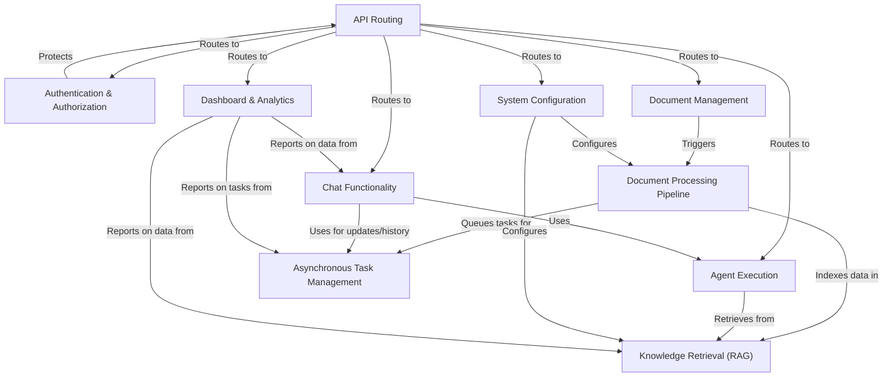
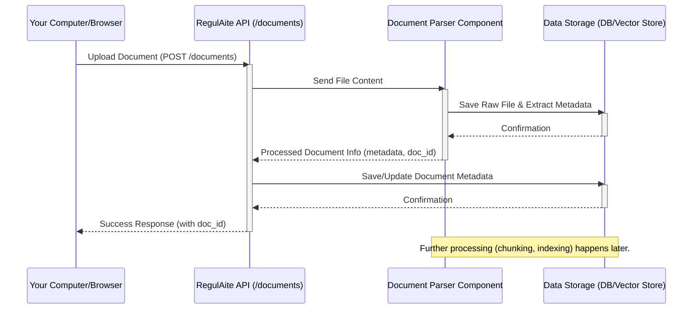
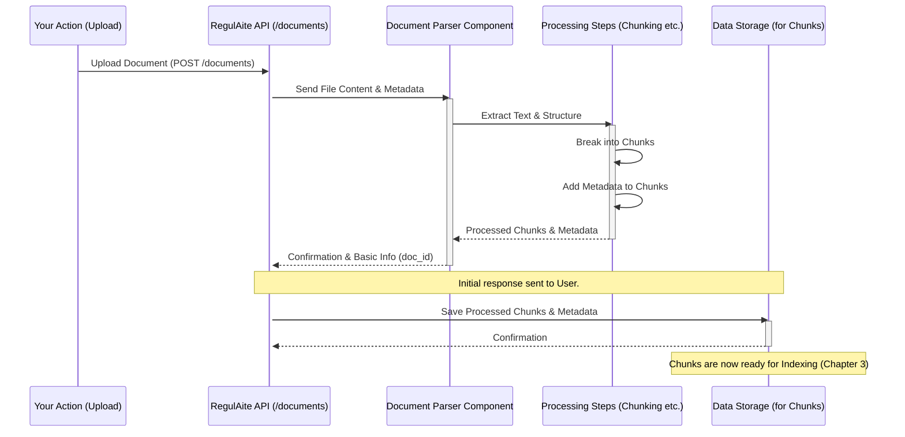
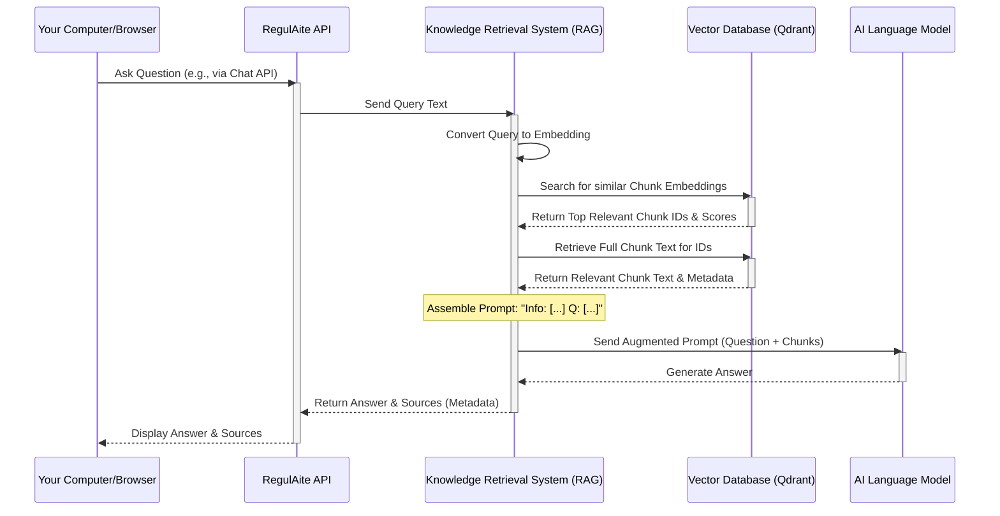
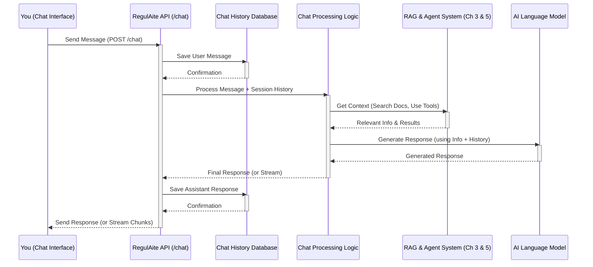
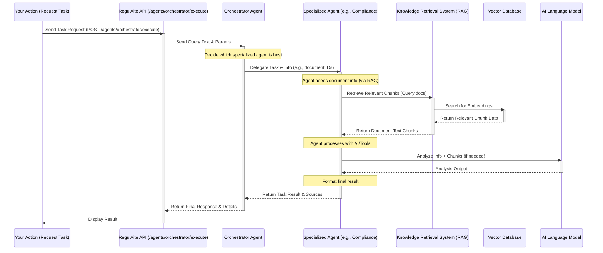
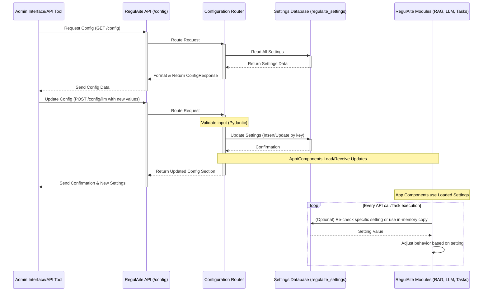
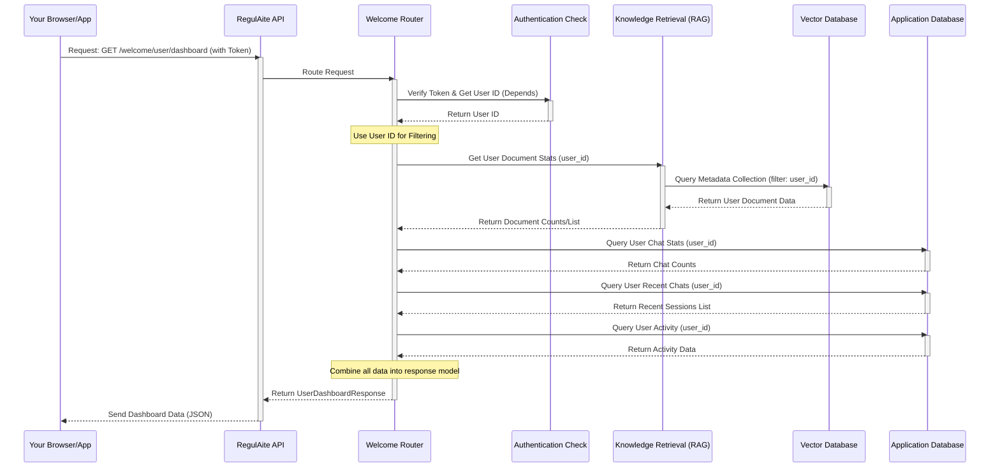

# Tutorial: RegulAIte routers

RegulAite is an application that helps you manage and understand your *regulatory documents* using AI. You can **upload documents**, which are automatically **processed** and made searchable in a **knowledge base**. This allows you to **chat with an AI** that provides answers based on your specific data or use specialized **agents** for tasks like risk analysis. The system handles **user authentication**, manages **background processing tasks**, provides **system configuration** options, and offers an overview through a **dashboard**.


## Visual Overview



## Chapters

1. [Document Management](#chapter-1-document-management)
2. [Document Processing Pipeline](#chapter-2-document-processing-pipeline)
3. [Knowledge Retrieval (RAG)](#chapter-3-knowledge-retrieval-rag)
4. [Chat Functionality](#chapter-4-chat-functionality)
5. [Agent Execution](#chapter-5-agent-execution)
6. [API Routing](#chapter-6-api-routing)
7. [Authentication & Authorization](#chapter-7-authentication--authorization)
8. [Asynchronous Task Management](#chapter-8-asynchronous-task-management)
9. [System Configuration](#chapter-9-system-configuration)
10. [Dashboard & Analytics](#chapter-10-dashboard--analytics)

# Chapter 1: Document Management

Welcome to the first chapter of the RegulAite tutorial! If you're just starting with RegulAite, this is the perfect place to begin. We'll cover the very first step in using the system: getting your documents into it and managing them.

Think of RegulAite as a smart assistant that helps you understand and work with your documents, especially legal and regulatory ones. But before it can help, you need to give it the documents! This is where **Document Management** comes in.

### What is Document Management?

At its heart, Document Management in RegulAite is like having a smart filing cabinet for all your important documents. It's the system's central hub for keeping track of the files you've added.

Imagine you have a new PDF file containing an important regulation update. You want RegulAite to read it, understand it, and be able to answer questions about it later. The first thing you need to do is get that PDF *into* RegulAite. Document Management provides the tools to do just that.

It handles the core operations you need for your documents:

1.  **Uploading New Files:** Getting your documents *into* the system.
2.  **Viewing Documents:** Seeing a list of documents you've already added and checking their details.
3.  **Deleting Documents:** Removing documents that are no longer needed.

These basic operations form the foundation for everything else RegulAite does.

### Your First Use Case: Adding a Regulation Document

Let's consider a simple, real-world example: You have a new government regulation document in PDF format that you need to add to RegulAite so you can later search it or chat with it.

How do you do this using RegulAite's Document Management? You use the **Upload** feature.

#### Uploading a Document

When you upload a document, you're essentially giving RegulAite a copy of your file. The system then takes this file and starts processing it so it can be used later.

Behind the scenes, this is typically handled by sending the file to a specific part of the RegulAite system, often through an API endpoint. In RegulAite, the `/documents` endpoint is used for this.

Here's a look at the function signature in the code that handles uploads (simplified):

```python
@router.post("")
async def process_document(
    file: UploadFile = File(...),
    # ... other optional parameters like metadata ...
    document_parser = Depends(get_document_parser)
):
    """Process a document using the specified parser."""
    # Read the file content
    file_content = await file.read()
    
    # ... determine file type, add metadata ...
    
    # Pass the file content to the document parser
    result = document_parser.process_document(
        file_content=file_content,
        file_name=file.filename,
        # ... other parameters ...
    )
    
    return result
```

*Explanation:*
*   `@router.post("")` tells us this function handles `POST` requests to the `/documents` path. `POST` is commonly used for sending data, like uploading a file.
*   `async def process_document(...)` is the function that runs when an upload request comes in.
*   `file: UploadFile = File(...)` shows that it expects a file as input.
*   `document_parser = Depends(get_document_parser)` means this function needs the system's document parser component to do its job.
*   Inside the function, it reads the content of the uploaded `file`.
*   Then, it calls `document_parser.process_document()`, passing the file content to be handled.

When you upload your PDF regulation file, this `process_document` function receives it. It reads the PDF data and then hands it over to the "document parser". What the parser does is the topic of the next chapter, [Document Processing Pipeline](#chapter-2-document-processing-pipeline)! For now, just know that the upload step gets the file into the system so it can be processed.

#### Viewing Your Documents

After uploading, you'll want to see your list of documents, perhaps check if the new regulation PDF is there. Document Management provides a way to list all documents currently in the system.

This is usually done via a different type of API request, typically a `GET` request to the same `/documents` endpoint.

Here's a simplified look at the function that retrieves the document list:

```python
@router.get("", response_model=DocumentListResponse)
async def document_list(
    skip: int = Query(0, alias="offset"),
    limit: int = Query(100, alias="limit"),
    # ... other optional parameters for filtering/sorting ...
):
    """Get a list of documents with optional filtering and search."""
    documents = []
    total_count = 0
    
    # Get data from where documents are stored (e.g., Qdrant)
    rag_system = await get_rag_system()
    
    # ... logic to query documents from storage based on skip/limit/filters ...
    
    return DocumentListResponse(
        documents=documents,
        total_count=total_count,
        limit=limit,
        offset=skip
    )
```

*Explanation:*
*   `@router.get("")` means this function handles `GET` requests to `/documents`. `GET` is used for retrieving data.
*   `async def document_list(...)` is the function that fetches the list.
*   `skip` and `limit` parameters help with pagination (showing documents page by page).
*   It gets the `rag_system` which is responsible for interacting with the data storage (like a vector database, which you'll learn more about later).
*   The code queries the storage to get the list of documents, applying any requested filters or sorting.
*   It returns a `DocumentListResponse`, which includes the list of documents (`documents`) and the total count.

The list you get back includes basic information about each document, like its name, type, size, and whether it has been indexed (processed).

#### Deleting a Document

What if you uploaded a test document, or a regulation becomes outdated? You need to remove it. Document Management includes a way to delete documents.

This uses a `DELETE` request, often specifying the unique ID of the document you want to remove.

Here's a simplified snippet for the delete function:

```python
@router.delete("/{doc_id}")
async def delete_document(doc_id: str, delete_from_index: bool = True):
    """Delete document and its chunks from storage."""
    try:
        # Get the system component that manages document data
        rag_system = await get_rag_system()

        # Use RAG system to delete the document and its associated data
        rag_deleted = rag_system.delete_document(doc_id)
        
        if rag_deleted:
             message = f"Document {doc_id} deleted successfully."
        else:
             message = f"Document {doc_id} not found or could not be deleted."

        return {"doc_id": doc_id, "deleted": rag_deleted, "message": message}

    except Exception as e:
        # Handle errors
        raise HTTPException(status_code=500, detail=f"Error deleting document: {str(e)}")
```

*Explanation:*
*   `@router.delete("/{doc_id}")` means this handles `DELETE` requests to `/documents/` followed by a specific document ID (e.g., `/documents/doc_12345`).
*   `async def delete_document(doc_id: str, ...)` receives the `doc_id` from the URL path.
*   It uses the `rag_system` to perform the actual deletion of the document's data from storage.
*   It returns a confirmation message indicating if the deletion was successful.

Deleting a document removes it from RegulAite's records and its processed parts, freeing up space and ensuring it doesn't appear in searches or analyses.

### Under the Hood: How it Works (Simplified)

Let's visualize the basic flow when you add a document:



This diagram shows the initial steps: You send the document, the API receives it, the parser extracts key info and saves some initial data, and the API confirms success. The heavy lifting of understanding the document (like breaking it into smaller pieces or creating embeddings) happens as part of the [Document Processing Pipeline](#chapter-2-document-processing-pipeline), which often kicks off *after* the document is successfully uploaded and its initial metadata is stored.

The code snippets we saw earlier are part of the `backend/routers/document_router.py` file. This file defines all the different actions (routes) you can take related to documents through the API. Each `@router.post`, `@router.get`, `@router.delete` you saw corresponds to one of these actions.

### Analogy: The RegulAite Library

Think of Document Management as the process of adding a book to a library.

*   **Uploading:** You bring a new book (your document) to the front desk. The librarian (the RegulAite API) takes it.
*   **The Parser (Next Chapter!):** Before putting it on the shelf, the librarian might categorize it, note down its title and author (extract metadata), and maybe even make a summary.
*   **Storage:** The book is given a unique spot and placed on the correct shelf in the stacks (your document data is saved).
*   **Viewing:** You can look up books in the library catalog (list documents) or ask for details about a specific book (get document details).
*   **Deleting:** You can ask the librarian to remove a book from the collection.

Document Management is simply the "front desk" and "catalog" part of the RegulAite library, making sure your books (documents) are properly registered and accessible.

### Conclusion

In this chapter, we learned that Document Management is the essential first step in using RegulAite. It allows you to upload your documents, view the list of documents you've added, and remove them when necessary. We saw how these operations correspond to API endpoints and briefly touched on the code structure that handles them.

Once a document is successfully uploaded and managed, RegulAite needs to actually *read* and *understand* its contents. This leads us directly to the next crucial step: processing the document.

# Chapter 2: Document Processing Pipeline

Welcome back to the RegulAite tutorial! In the [previous chapter](#chapter-1-document-management), we learned how to get your documents into RegulAite using the **Document Management** features. Think of that as successfully adding a new book to your smart library's collection.

But just having the book on the shelf isn't enough. For RegulAite to be a helpful assistant, it doesn't just need to *store* your documents; it needs to *read* and *understand* them. This is where the **Document Processing Pipeline** comes in.

### What is the Document Processing Pipeline?

Imagine you've just added that important PDF regulation document from Chapter 1. RegulAite can see the file is there, but it can't yet answer questions like "What are the key requirements for data privacy in Section 3?" or "Does this regulation mention compliance deadlines?".

To answer those questions, RegulAite needs to:

1.  **Read** the content of the PDF.
2.  **Figure out** the different parts – like headings, paragraphs, tables, and lists.
3.  **Extract** the actual text from these parts.
4.  **Break down** the document into smaller, manageable pieces that the AI can work with.

The **Document Processing Pipeline** is the automated system inside RegulAite that does all of this. It takes the raw document file (like your PDF) and transforms it into structured information that is ready for the AI to use for tasks like answering questions or finding relevant information.

It's essentially an automated, highly intelligent scanner and note-taker for your documents.

### Your Use Case Continues: Making the Regulation Document Understandable

Following our example from Chapter 1, your goal is to make that PDF regulation document "understandable" for RegulAite's AI features. The Document Processing Pipeline is the core part that makes this happen *after* you've uploaded the document.

Here's what the pipeline does with your PDF:

*   **Reads the PDF:** It opens the file and reads through the pages, handling different layouts, fonts, and even images (using OCR - Optical Character Recognition if needed).
*   **Identifies Structure:** It detects headings, subheadings, paragraphs, tables, footnotes, etc. This helps it understand the document's layout and hierarchy.
*   **Extracts Text:** It pulls out all the readable text from the document, preserving the order and context based on the identified structure.
*   **Breaks into Chunks:** Since AI models have limitations on how much text they can process at once (their "context window"), the pipeline breaks the long document text into smaller, overlapping pieces called "chunks". Each chunk is like a summary or a specific paragraph/section from the original document.
*   **Adds Metadata:** To each chunk, it adds important information (metadata) like the original document ID, the page number the chunk came from, the section it belonged to, the document title, etc. This helps RegulAite link the processed piece back to the original document and understand its context.

These chunks, enriched with metadata, are the building blocks that the AI will later use to answer your questions or find information.

### Key Steps in the Pipeline

Let's break down the main stages the pipeline goes through:

1.  **Parsing:** This is the initial reading and extraction phase. RegulAite uses special tools called **Parsers** to read different file types (PDFs, Word documents, text files, etc.). Think of a parser as a specialized reader designed for a specific document format. RegulAite can use different parsers depending on the document type or complexity.
2.  **Structuring:** Once the text and elements are extracted, the pipeline tries to understand the document's layout and hierarchy. It identifies headers, lists, tables, and how they relate to the main text.
3.  **Chunking:** The structured content is then divided into smaller pieces (chunks). This is crucial because AI models can only process a limited amount of text at a time. Chunking ensures that relevant pieces of the document can be fed to the AI without overwhelming it. Chunks often overlap slightly to maintain context across boundaries.
4.  **Enrichment (Optional):** The pipeline might add more information to the chunks, like identifying key entities (people, organizations, dates) or classifying the content.
5.  **Preparation for Indexing:** The final chunks, each with its associated text and metadata, are prepared to be stored in a special database optimized for search and retrieval (a vector database). This leads us to the next chapter: [Knowledge Retrieval (RAG)](#chapter-3-knowledge-retrieval-rag).

### Using Different Parsers

RegulAite is flexible and can use different "parser" technologies to read documents. Why? Because some parsers are better at handling complex layouts, tables, or specific file types than others.

You can even see which parsers are available through the API. The `GET /documents/parsers` endpoint provides this information.

Here's a simplified look at the code handling this endpoint:

```python
@router.get("/parsers", response_model=Dict[str, List[Dict[str, str]]])
async def get_parser_types():
    """Get available parser types for document processing."""
    parser_types = []
    
    for parser in ParserType:
        parser_info = {
            "id": parser.value,
            "name": parser.name.replace("_", " ").title(),
            "description": get_parser_description(parser)
        }
        parser_types.append(parser_info)
    
    return {"parsers": parser_types}

def get_parser_description(parser_type: ParserType) -> str:
    # ... returns a description string based on parser_type ...
    pass
```
*Explanation:*
*   `@router.get("/parsers")` indicates this endpoint responds to GET requests at `/documents/parsers`.
*   `async def get_parser_types()` is the function that runs.
*   It loops through the available `ParserType` options (like `UNSTRUCTURED`, `DOCTLY`, `LLAMAPARSE`).
*   For each parser, it creates a small dictionary with its ID, name, and description.
*   It returns a list of these dictionaries under the key "parsers".

This endpoint lets the user or the system know which "intelligent scanners" are available and what they are good at. For example, one might be great for simple text, another for complex tables, and yet another specialized for legal documents. RegulAite can be configured to use a default parser or select one based on the document type.

### Under the Hood: The Pipeline in Action

Let's trace our PDF regulation document through the pipeline after you upload it (from Chapter 1).



*   The `User` uploads the document via the `API` (as seen in Chapter 1).
*   The `API` receives the file and, importantly, sends the file content and any initial metadata to the `Document Parser Component`.
*   The `Parser` reads the document, extracts text and structure, and hands this raw content over to the downstream `Processing Steps` (represented here as `Pipeline`).
*   The `Pipeline` component takes the extracted content, performs tasks like breaking it into `Chunks`, and adds relevant `Metadata` to each chunk.
*   The `Pipeline` returns the `Processed Chunks & Metadata` back to the `Parser` (or directly to the `API` depending on design).
*   The `API` sends a confirmation back to the `User`, often with a document ID.
*   Crucially, the `API` (or another system component it triggers) takes the `Processed Chunks & Metadata` and saves them in the `Data Storage`. These chunks are now structured pieces of information ready for the next stage: indexing.

Remember the `process_document` function from Chapter 1? We saw it calling the document parser:

```python
@router.post("")
async def process_document(...):
    # ... read file content ...
    
    # Pass the file content to the document parser
    # The parser then handles the extraction, structuring, and chunking
    result = document_parser.process_document(
        file_content=file_content,
        file_name=file.filename,
        # ... other parameters ...
    )
    
    # ... save initial metadata and return result ...
    return result
```
*Explanation:*
*   The `document_parser` object, obtained using `Depends(get_document_parser)`, is the component responsible for the heavy lifting of reading the document content.
*   The `process_document` method of this parser takes the file data and performs the steps of extraction, structuring, and chunking. The result it returns includes the processed chunks and their metadata.

The raw document file itself might be saved initially (often in a different storage location), but it's the *processed chunks* that are used by the AI.

### Analogy: The Librarian Takes Notes

Continuing our library analogy:

*   **Document Management (Chapter 1):** Bringing the book to the front desk and adding it to the catalog.
*   **Document Processing Pipeline:** The librarian takes the book, sits down, reads it carefully, understands its chapters and sections, and writes summary notes for each important part (creating chunks). They also add notes about which page each summary came from (metadata).

These detailed notes (the processed chunks with metadata) are much easier to quickly scan and find information in than reading the whole book cover-to-cover every time.

### Conclusion

In this chapter, we explored the **Document Processing Pipeline**. This vital system takes your raw uploaded documents, reads their contents using specialized **Parsers**, understands their structure, breaks them down into small, manageable **Chunks**, and adds useful **Metadata**. This process transforms unstructured documents into structured information that is ready for the next steps: indexing and retrieval by the AI.

You've now seen how to get documents *into* RegulAite and how RegulAite *reads and processes* them. The next step is making these processed chunks easily searchable and retrievable by the AI.

# Chapter 3: Knowledge Retrieval (RAG)

Welcome back to the RegulAite tutorial! In the [previous chapters](#chapter-1-document-management), you learned how to get your documents *into* RegulAite using **Document Management** and how the **Document Processing Pipeline** ([Chapter 2](#chapter-2-document-processing-pipeline)) reads and breaks them down into smaller **Chunks** with **Metadata**.

Now you have a library full of processed documents, broken down into understandable pieces. But how does RegulAite actually *use* this knowledge to answer your questions? This is where **Knowledge Retrieval**, also known as **RAG (Retrieval-Augmented Generation)**, comes in.

### What is Knowledge Retrieval (RAG)?

Imagine you've uploaded hundreds of regulatory documents. You can't possibly remember every detail in every document. You want to ask a specific question like: "What is the maximum penalty for a data breach under GDPR Article 83?".

A standard AI model might give you a general answer based on its training data, but it won't know the exact details from *your specific versions* of the GDPR documents you uploaded. It doesn't have access to your private library.

This is the problem RAG solves. **RAG allows RegulAite's AI to look through your uploaded documents to find the exact information needed to answer your question.**

Here's the core idea:

1.  **Retrieval:** When you ask a question, RegulAite first finds the most relevant pieces (**Chunks**) from your processed documents.
2.  **Augmentation:** RegulAite then takes your original question and "augments" it by adding these retrieved chunks. It creates a combined input for the AI model that looks something like: "Here is some relevant information from documents: [...list of retrieved chunks...]. Based on this, answer the following question: [Your original question]".
3.  **Generation:** The AI model receives this augmented input. Instead of relying *only* on its general knowledge, it prioritizes the information provided in the retrieved chunks to formulate an accurate answer that is directly based on your documents.

It's like having a super-fast, intelligent research assistant who can instantly find the exact paragraphs in your documents that are relevant to your question and then provide those paragraphs to a wise scholar (the AI) to formulate the best answer.

### Your Use Case: Getting Answers from Your Regulation Documents

Let's continue with our example of the PDF regulation document you uploaded. After it's processed into chunks (Chapter 2), you want to ask questions about it and get answers grounded in its content.

When you ask a question about that document, RegulAite uses RAG:

1.  RegulAite receives your question (e.g., "What does Article 83 say about penalties?").
2.  It determines which of the processed chunks from your documents are most related to this question. These are the relevant "pieces of knowledge".
3.  It takes the text from those relevant chunks.
4.  It gives these text chunks *and* your question to the AI model.
5.  The AI model reads the chunks and your question and generates an answer using the information from the chunks.
6.  RegulAite presents the answer to you, often including references to the specific documents and sections where the information was found (the "sources").

This process ensures that the AI's answer isn't just a general guess but is specifically derived from the content you provided.

### Key Concepts Behind RAG

How does RegulAite "find" the relevant chunks so quickly? It involves a few key concepts:

*   **Chunks:** As we saw in [Chapter 2](#chapter-2-document-processing-pipeline), the processing pipeline breaks down large documents into smaller text pieces called chunks. These are the units of knowledge that RAG retrieves.
*   **Embeddings:** This is where things get a bit technical, but stay with us! RegulAite uses special AI models (called embedding models) to convert the text of each chunk (and your query) into a list of numbers called a "vector" or "embedding". Think of this vector as a numerical "fingerprint" of the text's meaning. Texts with similar meanings will have vectors that are numerically "close" to each other.
*   **Vector Database:** These numerical embeddings (fingerprints) are stored in a specialized database called a vector database (RegulAite uses Qdrant). This type of database is designed to perform ultra-fast searches for vectors that are "nearest" to a given query vector.
*   **Similarity Search:** When you ask a question, RegulAite converts your question into an embedding. It then queries the vector database to find the chunk embeddings that are numerically closest to your question's embedding. These "nearest" embeddings correspond to the chunks that are semantically most similar or relevant to your question.

Think of it like this:

| Concept            | Analogy (Library)                                    | Analogy (GPS)                                    |
| :----------------- | :--------------------------------------------------- | :----------------------------------------------- |
| **Chunk**          | A librarian's detailed note card about a book section | A specific location (address, landmark)          |
| **Embedding**      | A unique numerical code for the note card's content  | GPS coordinates (latitude, longitude) for a location |
| **Vector Database**| A special card catalog indexed by numerical codes    | A map database of GPS coordinates                |
| **Similarity Search**| Finding note cards with codes similar to your query's code | Finding locations on the map near your query's location |

By converting everything into numerical "fingerprints" and using a database optimized for comparing these fingerprints, RegulAite can quickly find the most relevant chunks from potentially millions of chunks.

### How RAG Works Under the Hood (Simplified)

Let's visualize the flow when you ask a question that requires RAG:



1.  The `User` sends a question to the RegulAite `API`.
2.  The `API` routes the request to a component that utilizes the `Knowledge Retrieval System (RAG)`.
3.  The `RAG System` takes the user's question and converts it into a numerical embedding (the "fingerprint").
4.  It sends this embedding to the `Vector Database` (Qdrant), asking it to find the embeddings of document chunks that are most similar.
5.  The `Vector Database` performs the similarity search and returns the identifiers of the most relevant chunks, along with a score indicating how relevant they are.
6.  The `RAG System` uses these identifiers to retrieve the full text and metadata of the relevant chunks from the `Vector Database`.
7.  The `RAG System` then creates a new, combined input (the "augmented prompt") which includes the text of the retrieved chunks alongside the original user question.
8.  This augmented prompt is sent to the `AI Language Model`.
9.  The `AI Model` generates an answer based on the provided chunks and the question.
10. The `RAG System` receives the answer and sends it back to the `API`, including the details of the chunks (documents, pages) that were used as sources.
11. The `API` sends the final answer and source information to the `User`.

This entire process happens very quickly, usually in just a few seconds, allowing RegulAite to provide informed answers based on your data in real-time.

### Using RAG in RegulAite (via the API)

While RAG is automatically used by agents (which we'll see in [Chapter 5: Agent Execution](#chapter-5-agent-execution)) and the chat ([Chapter 4: Chat Functionality](#chapter-4-chat-functionality)), RegulAite also exposes an endpoint specifically for demonstrating the **Retrieval** part of RAG: `/documents/search`.

You can use this endpoint to see *which* chunks RegulAite would find for a given query, before even sending them to an AI model for generation.

Here's a simplified look at the code for the `/documents/search` endpoint:

```python
@router.post("/search", response_model=Dict[str, Any])
async def search_documents(request: DocumentSearchRequest):
    """Search for documents using semantic search."""
    try:
        # Get RAG system dependency
        rag_system = await get_rag_system()

        # Use RAG system to retrieve results
        results = rag_system.retrieve(
            query=request.query,  # The user's search query
            top_k=request.limit,  # Max number of chunks to retrieve
            filters=request.filters # Optional filters (e.g., by document)
        )

        # 'results' is a list of dictionaries, each representing a chunk
        # Example: [{"text": "...", "metadata": {...}, "score": 0.9}, ...]

        # Return the search results
        return {
            "results": results,
            "query": request.query,
            "count": len(results),
            # ... other info like unique document count ...
        }

    except Exception as e:
        # Handle errors
        logger.error(f"Error in document search: {str(e)}")
        raise HTTPException(
            status_code=500,
            detail=f"Error searching documents: {str(e)}"
        )
```
*Explanation:*
*   `@router.post("/search")` defines the API endpoint that receives `POST` requests at `/documents/search`.
*   `async def search_documents(...)` is the function that processes the request.
*   `request: DocumentSearchRequest` uses a Pydantic model to automatically validate the incoming data, ensuring it has `query`, `limit`, `filters`, etc.
*   `rag_system = await get_rag_system()` gets the instance of RegulAite's RAG system component.
*   `rag_system.retrieve(...)` is the core call that performs the similarity search in the vector database. It takes the user's `query`, how many results (`top_k`) are needed, and optional `filters` (e.g., only search within documents with specific tags or IDs).
*   The `retrieve` method returns a list of dictionaries (`results`), where each dictionary represents a retrieved chunk, including its text content, its original metadata (like document ID, page number), and a relevance score.
*   The function then formats these `results` and returns them in the API response.

If you were to call this endpoint with a query like `"GDPR Article 83 penalties"`, it would return the chunks from your processed documents that are most relevant to that phrase, allowing you to see the source material RegulAite would use.

### Indexing Documents for RAG

For RAG to work, the processed chunks (from [Chapter 2](#chapter-2-document-processing-pipeline)) must be converted into embeddings and stored in the vector database. This process is called **Indexing**.

The processing pipeline typically handles this automatically after chunking. Each chunk's text is embedded, and the resulting vector, along with the chunk's metadata, is saved as a "point" in the vector database. The metadata is crucial as it links the chunk back to the original document, page, etc., which is needed for providing sources.

RegulAite also provides an endpoint to manually trigger indexing for a document if needed, for example, if it failed during initial processing: `/documents/index/{doc_id}`.

```python
@router.post("/index/{doc_id}", response_model=DocumentIndexStatus)
async def index_document(doc_id: str, force_reindex: bool = False):
    """Index a document in the vector store."""
    try:
        # Get RAG system dependency
        rag_system = await get_rag_system()

        # Call the RAG system's index method
        index_result = rag_system.index_document(doc_id)

        # Interpret the result and prepare response
        # ... (simplified logic to determine status and message) ...
        status = "success" # Assume success for simplicity
        message = "Document indexing triggered successfully"

        return {
            "doc_id": doc_id,
            "status": status,
            "vector_count": None, # Vector count often updated asynchronously
            "message": message
        }

    except Exception as e:
        # Handle errors
        logger.error(f"Error indexing document: {str(e)}")
        raise HTTPException(
            status_code=500,
            detail=f"Error indexing document: {str(e)}"
        )
```
*Explanation:*
*   `@router.post("/index/{doc_id}")` is the endpoint to trigger indexing for a specific document ID.
*   `async def index_document(doc_id: str, ...)` receives the `doc_id` from the URL.
*   It gets the `rag_system` component.
*   `rag_system.index_document(doc_id)` tells the system to take the already processed chunks for this `doc_id`, create embeddings for them, and save them in the vector database. This might happen immediately or be queued as a background task.
*   It returns a status indicating if the indexing process was successfully started.

Without successful indexing, RAG cannot retrieve any information from the document's chunks.

### Conclusion

In this chapter, we learned about **Knowledge Retrieval (RAG)**, a fundamental concept in RegulAite that enables the AI to answer questions accurately based on your specific documents. We saw how the processed document **Chunks** are converted into numerical **Embeddings** and stored in a **Vector Database** to allow for rapid **Similarity Search**. This retrieval process identifies the most relevant document pieces, which are then used to **Augment** the user's query before being sent to the AI model for **Generation** of a grounded response.

You now understand how RegulAite finds the right information in your document library. The next natural step is to see how this RAG capability is integrated into a conversational interface, allowing you to simply *chat* with your documents.

# Chapter 4: Chat Functionality

Welcome back to the RegulAite tutorial! In the [previous chapter](#chapter-3-knowledge-retrieval-rag), we explored **Knowledge Retrieval (RAG)**, the powerful technique RegulAite uses to find relevant information within your documents. You learned how documents are processed into **Chunks** and indexed in a **Vector Database** so that RegulAite can quickly pull up the right pieces of information when you ask a question.

Now, how do you actually *ask* those questions and have a natural conversation with RegulAite, getting answers that are grounded in your documents? This is where **Chat Functionality** comes in.

### What is Chat Functionality?

Imagine you want to have a conversation with the smart librarian we talked about in the previous chapters. You ask a question, the librarian quickly looks through their notes (the processed document chunks), finds the relevant ones, and gives you an answer based *only* on those notes. Then, you ask a follow-up question, and the librarian remembers what you were just talking about to give you an even better answer.

**Chat Functionality** in RegulAite provides this interactive conversational experience. It's the part of the system that:

1.  Listens for your messages (questions or statements).
2.  Takes your message and, using capabilities like RAG, figures out the best response based on your documents.
3.  Generates and sends the AI's reply back to you.
4.  Keeps track of your conversation history so the AI can understand follow-up questions and maintain context.
5.  Optionally provides real-time updates as the AI is thinking or generating its response, making the interaction feel faster and more dynamic.

It's the core feature that allows you to simply type questions and receive intelligent, document-aware answers directly from RegulAite.

### Your Use Case: Having a Conversation About a Regulation

Let's go back to our running example: you uploaded a PDF regulation document, and it has been processed and indexed (Chapters 1-3). Now, you want to chat with RegulAite about it.

Your goal is to ask a question, get an answer, ask a related follow-up, and have the system remember the context.

Example Conversation Flow:

*   **You:** "What are the main requirements in this regulation?"
*   **RegulAite:** (Uses RAG to find relevant sections, summarizes them) "Based on the documents you provided, the main requirements cover data privacy, reporting deadlines, and specific technical standards for compliance..."
*   **You:** "Tell me more about the reporting deadlines."
*   **RegulAite:** (Remembers you were just talking about requirements, uses RAG again focusing on 'reporting deadlines' within that context) "Certainly. The regulation specifies that quarterly reports must be submitted within 15 days of the end of the quarter, and annual reports by January 31st..."

This seamless back-and-forth, where RegulAite understands follow-ups and builds on previous messages, is enabled by Chat Functionality.

### Key Concepts in Chat

To support this interactive experience, Chat Functionality relies on a few key ideas:

*   **Messages:** The basic units of conversation. Each message has content (the text) and a role (who sent it - `user` or `assistant`).
*   **Session:** A single, ongoing conversation. Each session has a unique ID. All messages within the same session are linked together, allowing RegulAite to recall the history.
*   **Context:** The history of messages within a session. RegulAite often uses the recent messages as context to better understand your latest message and generate a relevant response.
*   **Real-time Updates (Streaming):** Sending the AI's response back piece by piece as it's being generated, rather than waiting for the entire response to be ready. This makes the chat feel much more responsive.

### How Chatting Works in RegulAite

When you send a message in the chat interface, here's a simplified look at what happens behind the scenes:

1.  Your message is sent to RegulAite's API.
2.  The API receives your message, notes which *session* it belongs to (or creates a new one), and saves your message to the chat history database.
3.  RegulAite's core chat logic takes your new message *and* recent messages from the session history.
4.  It uses this combined context to figure out the best way to respond. This often involves:
    *   Using **RAG** ([Chapter 3](#chapter-3-knowledge-retrieval-rag)) to find relevant document chunks based on the current message and potentially the history.
    *   Leveraging **Agent Execution** ([Chapter 5](#chapter-5-agent-execution)) to decide if other tools or actions are needed before generating a final answer (like performing specific searches, calculations, etc.).
5.  The relevant document chunks (from RAG) and any insights from agents are combined with your message and history to create a detailed request for the AI language model.
6.  The AI model generates a response.
7.  RegulAite receives the AI's response, saves it to the chat history database, and sends it back to you. If streaming is enabled, it sends the response back in chunks as it receives them from the AI.

Here's a simple flow diagram:



Notice how the database is involved in saving both your messages and the AI's responses, forming the persistent chat history.

### The Chat API Endpoint

The central piece of code handling this is the `/chat` API endpoint, typically using a `POST` request because you're sending new message data to the server.

Let's look at a simplified version of the function that handles this (from `backend/routers/chat_router.py`):

```python
@router.post("", response_model=ChatResponse)
async def chat(request: ChatRequest, req: Request, background_tasks: BackgroundTasks):
    """
    Process a chat request and generate a response.
    """
    # Get User ID (authentication)
    user_id = await extract_user_id_from_request(req)
    if not user_id:
        raise HTTPException(status_code=401, detail="Authentication required")

    # Get or create Session ID
    session_id = request.session_id or f"session_{uuid.uuid4()}"

    # Store user message in database
    try:
        conn = await get_db_connection()
        cursor = conn.cursor()
        cursor.execute(
            "INSERT INTO chat_history (user_id, session_id, message_text, message_role) VALUES (?, ?, ?, ?)",
            (user_id, session_id, request.messages[-1].content, "user") # Get the latest user message
        )
        conn.commit()
        conn.close()
    except Exception as e:
        logger.error(f"Error storing user message: {str(e)}")
        # Log error, but continue processing

    # --- Core Processing Happens Here (Delegated to Agent/Chat Integration) ---
    # This involves getting history, using RAG, calling AI model etc.
    # The code calls chat_integration.process_chat_request() which handles this.
    
    assistant_message = "..." # Placeholder for response from integration
    sources = None # Placeholder for sources from integration

    # Store assistant response in database
    try:
        conn = await get_db_connection()
        cursor = conn.cursor()
        cursor.execute(
            "INSERT INTO chat_history (user_id, session_id, message_text, message_role) VALUES (?, ?, ?, ?)",
            (user_id, session_id, assistant_message, "assistant")
        )
        conn.commit()
        conn.close()
    except Exception as e:
        logger.error(f"Error storing assistant message: {str(e)}")
        # Log error

    # Return response
    return ChatResponse(
        message=assistant_message,
        model=request.model,
        session_id=session_id,
        timestamp=datetime.now().isoformat(),
        # ... other details like sources, context_used etc.
    )
```

*Explanation:*
*   `@router.post("")` indicates this function handles `POST` requests to the base `/chat` path.
*   `request: ChatRequest` expects the incoming data to match the `ChatRequest` model, including the list of `messages` and potentially a `session_id`.
*   It extracts the `user_id` (required for chat history and sessions).
*   It gets the `session_id` from the request or generates a new one if it's the start of a new conversation.
*   It **saves the user's incoming message** to the `chat_history` table in the database. This is crucial for remembering the conversation.
*   The code then *delegates* the main work of processing the message and generating a response to an internal `chat_integration` component (which itself uses RAG and potentially agents). We've simplified this part significantly here for clarity.
*   After the response is generated, it **saves the assistant's message** to the same `chat_history` table.
*   Finally, it returns the generated `assistant_message` and other details in a `ChatResponse`.

This flow shows how the API endpoint acts as the gateway, ensuring messages are recorded and the core processing is triggered.

### Managing Chat History

RegulAite saves your chat messages so you can continue conversations later or review past interactions. This history is stored in a database table (`chat_history`).

Each entry in the `chat_history` table typically includes:

*   `user_id`: Who sent the message (links to [Chapter 7: Authentication & Authorization](#chapter-7-authentication--authorization)).
*   `session_id`: Which conversation this message belongs to.
*   `message_text`: The actual text of the message.
*   `message_role`: Whether it was sent by the 'user' or 'assistant'.
*   `timestamp`: When the message was sent (for ordering the conversation).

RegulAite provides API endpoints to access this history:

*   `/chat/sessions`: List all chat sessions for a user.
*   `/chat/history` or `/chat/sessions/{session_id}/messages`: Get the messages for a specific session.

Here's a simplified look at getting session messages:

```python
@router.get("/sessions/{session_id}/messages", response_model=ChatHistoryResponse)
async def get_session_messages(session_id: str, limit: int = 50, req: Request = None):
    """Get messages for a specific chat session."""
    user_id = await extract_user_id_from_request(req)
    # Authentication check ensures users only see their own sessions

    conn = await get_db_connection()
    cursor = conn.cursor(dictionary=True)

    # Query messages for the session, filtered by user, ordered by time
    query = """
        SELECT message_text, message_role, timestamp
        FROM chat_history
        WHERE session_id = ? AND user_id = ?
        ORDER BY timestamp ASC LIMIT ?
    """
    params = [session_id, user_id, limit] # Using user_id for security

    cursor.execute(query, params)
    history = cursor.fetchall() # Get all matching rows
    conn.close()

    # Process timestamps to ensure consistent format
    processed_history = await process_history_entries(history)

    return ChatHistoryResponse(
        session_id=session_id,
        messages=processed_history,
        count=len(processed_history)
    )
```

*Explanation:*
*   `@router.get("/sessions/{session_id}/messages")` handles GET requests to retrieve messages for a specific session ID.
*   `session_id: str` captures the session ID from the URL path.
*   It gets the `user_id` to ensure only the owner can retrieve the history for that session.
*   It connects to the database.
*   It executes a SQL query to select messages for the given `session_id` and `user_id`, orders them by `timestamp`, and limits the number of results.
*   The retrieved messages are formatted and returned in a `ChatHistoryResponse`.

Similarly, the `/chat/sessions` endpoint queries the database (potentially a separate `chat_sessions` table or by grouping the `chat_history` table) to list the user's ongoing conversations, often showing the last message time or a preview.

### Real-time Updates (Streaming)

Waiting for a long AI response can feel slow. RegulAite improves this by using streaming. Instead of getting the whole response at once, you receive it in small pieces (like words or sentences) as the AI generates them.

When you send a `ChatRequest` with `stream: True`, the API endpoint changes its behavior slightly:

```python
@router.post("", response_model=ChatResponse) # Note: Response model is different for streaming
async def chat(request: ChatRequest, req: Request, background_tasks: BackgroundTasks):
    # ... initial steps (get user_id, session_id, save user message) ...

    # If streaming is requested
    if request.stream:
        # Handle streaming agent processing (delegated to chat_integration)
        async def generate_agent_stream():
            try:
                chat_integration = get_chat_integration()

                # --- Core Processing with Streaming Call ---
                # chat_integration.process_chat_request() handles RAG, Agent, AI Model,
                # and *yields* response chunks as they are ready.
                agent_response_generator = chat_integration.process_chat_request(
                     # ... request data ...
                     stream=True # Tell integration to stream
                )

                final_assistant_message = ""
                async for chunk in agent_response_generator:
                    # Process the chunk (e.g., check type like 'token', 'end', 'source')
                    # Send the chunk data back to the user via 'yield'
                    if chunk.get("type") == "token":
                         yield json.dumps({"type": "token", "content": chunk.get("content")}) + "\n"
                         final_assistant_message += chunk.get("content", "")
                    elif chunk.get("type") == "end":
                         # Received end signal, include final metadata
                         yield json.dumps({
                             "type": "end",
                             "message": final_assistant_message,
                             "sources": chunk.get("sources", []),
                             # ... other final metadata ...
                         }) + "\n"
                         break # Exit the loop

                    # Add small delay for effect in UI
                    await asyncio.sleep(0.01)

                # Save the complete assistant message after streaming finishes
                # This is done in a background task or separate logic outside the loop
                # (Code snippet doesn't show this detail, but it's important)

            except Exception as e:
                # Handle errors during streaming
                yield json.dumps({
                    "type": "error",
                    "message": f"Streaming error: {str(e)}",
                    "error_code": "STREAM_ERROR"
                }) + "\n"


        # Return a StreamingResponse, which calls the generator function
        return StreamingResponse(generate_agent_stream(), media_type="text/event-stream")

    # --- (else) handle non-streaming response as shown previously ---
    # ... call process_chat_request() without stream=True ...
    # ... save full response ...
    # ... return ChatResponse ...
```

*Explanation:*
*   When `request.stream` is `True`, the function sets up an `async` generator function (`generate_agent_stream`).
*   This generator calls the core processing logic (`chat_integration.process_chat_request`) but asks it to stream the response (`stream=True`).
*   The core processing logic (which talks to the AI model) *yields* small chunks of the response (like `{ "type": "token", "content": "word" }`).
*   The `generate_agent_stream` function receives these chunks one by one and `yield`s them back to the `StreamingResponse`.
*   The `StreamingResponse` takes these yielded chunks and sends them over the HTTP connection immediately, as they arrive.
*   The front-end chat interface reads these chunks as they arrive and displays them in real-time.
*   The full message is typically reassembled on the backend and/or frontend and saved to history once the streaming is complete.

This streaming capability significantly enhances the user experience, making the AI feel much faster, especially for longer responses.

### Analogy: The Interactive Librarian

Let's refine our library analogy one last time:

*   **Document Management (Chapter 1):** Adding books to the library.
*   **Document Processing (Chapter 2):** The librarian reading the books and taking detailed notes (chunks).
*   **Knowledge Retrieval (RAG) (Chapter 3):** Asking the librarian a question, and they quickly find the relevant note cards.
*   **Chat Functionality:** Having a conversation with the librarian.
    *   You ask a question.
    *   The librarian uses their notes (RAG) and maybe consults other resources (Agent) based on your question *and* what you've talked about previously (History).
    *   They give you an answer, either all at once or by reading it out sentence by sentence as they formulate it (Streaming).
    *   They keep notes of your conversation (Saving History) so they remember the context for your next question (Session).

This interactive, history-aware, and potentially real-time communication is the essence of RegulAite's Chat Functionality.

### Conclusion

In this chapter, we learned about RegulAite's **Chat Functionality**. This is the core user-facing feature that allows you to have interactive, conversational exchanges with the system, getting answers based on your documents. We saw how it manages **Messages** within **Sessions**, leverages the **Conversation History** stored in a database to maintain context, and uses **Real-time Updates (Streaming)** to provide a smoother user experience.

While Chat Functionality provides the conversational *interface*, the intelligence behind it often comes from more sophisticated components that decide *how* to process your message – whether simply retrieving knowledge via RAG or performing more complex actions. This leads us to the concept of Agents.

# Chapter 5: Agent Execution

Welcome back to the RegulAite tutorial! In the [previous chapter](#chapter-4-chat-functionality), we learned about **Chat Functionality**, which lets you have a natural conversation with RegulAite, getting answers grounded in your documents using **Knowledge Retrieval (RAG)** ([Chapter 3](#chapter-3-knowledge-retrieval-rag)).

Chat is great for asking questions, summarizing information, and exploring your documents. But what if you need RegulAite to do something more complex? Something that requires specific expertise or multiple steps?

Imagine asking RegulAite not just "What does this regulation say?" but "Analyze this new policy against our compliance standards and identify gaps" or "Assess the potential risks associated with this proposed process." These aren't simple questions; they are *tasks* that require specialized knowledge and potentially structured analysis.

This is where the concept of **Agent Execution** comes in.

### What is Agent Execution?

Think of RegulAite's core intelligence not just as one large brain, but as a team of highly specialized experts. Each expert (or **Agent**) is trained or designed to handle a particular type of problem or task.

*   One agent might be an expert in **Risk Assessment**.
*   Another might specialize in **Compliance Analysis**.
*   Yet another could be focused purely on retrieving specific knowledge using **RAG**.

**Agent Execution** is the system within RegulAite that manages this team of experts. It's like having a project manager who receives your request, figures out which expert (or combination of experts and tools) is best suited for the job, gives them the necessary information (like your documents via RAG), supervises their work, and presents you with the final, structured result.

This abstraction handles the complexity of:

*   Receiving a request that isn't just a simple question.
*   Potentially deciding which specialized agent is needed (this is called **Orchestration**).
*   Providing the agent with the necessary information, often retrieved from your documents via RAG.
*   Running the agent's specific logic or analysis process.
*   Gathering the results and formatting them.

It allows RegulAite to perform sophisticated, task-oriented functions beyond basic chat.

### Your Use Case: Getting a Compliance Gap Analysis

Let's continue our journey with the PDF regulation document you uploaded. Instead of just chatting about it, you now want RegulAite to perform a specific task: check this regulation against your company's existing internal policies (also uploaded) and highlight any areas where your policies might conflict with or fail to address requirements in the new regulation.

This requires more than simple Q&A. It's a **Compliance Analysis** task.

To achieve this, RegulAite uses an **Agent** specifically designed for compliance analysis. When you initiate this task (often through a dedicated interface or by asking the system in a way that triggers this agent), the Agent Execution system goes to work:

1.  It receives your request (e.g., "Analyze regulation X against policies A and B for compliance gaps").
2.  If you used a general interface (like chat), an **Orchestrator Agent** might first determine that this is a "Compliance Analysis" task and delegate it to the **Compliance Analysis Agent**.
3.  The Compliance Analysis Agent activates. It knows it needs access to both the regulation and your policies.
4.  It uses **RAG** ([Chapter 3](#chapter-3-knowledge-retrieval-rag)) to find the relevant sections in both the regulation document and your policies.
5.  It applies its specialized "compliance analysis" logic (often involving comparing sections, identifying requirements, and checking for coverage or conflict). This might involve multiple calls to the AI model and internal tools.
6.  Once the analysis is complete, the agent structures the findings (e.g., a list of gaps, conflicting points, recommended actions).
7.  The result is returned to you, perhaps as a structured report or a detailed response.

This process allows RegulAite to perform complex, pre-defined analyses using specialized components.

### Key Concepts: Agents and Orchestration

*   **Agent:** A self-contained AI component designed for a specific task or domain (like `Risk Assessment Agent`, `Compliance Analysis Agent`). Agents might use AI models, internal tools (like a document search tool), or even call other agents to complete their task.
*   **Orchestration:** The process of managing multiple agents and tools to accomplish a user's request. An **Orchestrator Agent** acts as the central coordinator, deciding the best plan of action, which agents or tools to use, in what order, and combining their results. In RegulAite, the main Orchestrator Agent is designed to understand general GRC (Governance, Risk, Compliance) related requests and route them appropriately.

Think of it like this:

| Concept        | Analogy (Team of Experts)                                  |
| :------------- | :--------------------------------------------------------- |
| **User Request** | Asking the project manager to solve a complex problem      |
| **Orchestration**| The project manager deciding which experts are needed      |
| **Orchestrator Agent**| The project manager themselves                         |
| **Agent**      | A specific expert (e.g., the "Compliance Guy", the "Risk Analyst") |
| **Tools**      | Resources the experts use (e.g., filing cabinet, calculator) |
| **RAG**        | The expert quickly finding relevant notes in their files   |

### How to Trigger Agent Execution

While Agents are used internally by features like Chat ([Chapter 4](#chapter-4-chat-functionality)), RegulAite also provides direct API endpoints to understand and interact with agents.

You can find out what agents are available and what they can do using the `/agents/types` and `/agents/metadata` endpoints.

#### Listing Available Agents

The `/agents/types` endpoint gives you a simple list of the available specialized agents.

Here's a simplified look at the code for this (from `backend/routers/agents_router.py`):

```python
@router.get("/types", response_model=Dict[str, str])
async def list_agent_types():
    """List all available agent types."""
    # This function would likely pull from a configuration or registry
    return {
        "rag": "Retrieval-augmented generation agent",
        "compliance_analysis": "Agent for compliance analysis",
        "risk_assessment": "Agent for risk assessment",
        "orchestrator": "Main GRC orchestrator agent"
        # ... more agent types ...
    }
```
*Explanation:*
*   `@router.get("/types")` handles GET requests to `/agents/types`.
*   `async def list_agent_types()` returns a dictionary where keys are agent IDs (like `compliance_analysis`) and values are brief descriptions.

This tells you the 'names' of the experts available.

#### Getting Agent Details (Metadata)

The `/agents/metadata` endpoint provides more detailed information about each agent, including their capabilities (what tasks they can perform), parameters they accept, and examples.

Simplified code:

```python
@router.get("/metadata", response_model=List[AgentMetadata])
async def get_agents_metadata():
    """Get metadata for all available agents."""
    metadata_list = []
    # Loop through available agent types and create metadata objects
    for agent_id in ["rag", "compliance_analysis", "risk_assessment", "orchestrator"]:
        capabilities = []
        parameters = []
        if agent_id == "compliance_analysis":
            capabilities = [
                {"name": "Analyze Compliance Gaps", "description": "Compares docs to standards"},
                {"name": "Check Policy Adherence", "description": "Evaluates internal policy compliance"}
            ]
            parameters = [{"name": "standards", "type": "list", "required": True}]
        # ... similar logic for other agents ...
        
        metadata_list.append({
             "id": agent_id,
             "name": f"{agent_id.replace('_', ' ').title()} Agent",
             "description": f"Specialized agent for {agent_id.replace('_', ' ')}",
             "capabilities": capabilities,
             "parameters": parameters,
             # ... other metadata ...
        })

    return metadata_list
```
*Explanation:*
*   `@router.get("/metadata")` handles GET requests to `/agents/metadata`.
*   `async def get_agents_metadata()` builds a list of `AgentMetadata` objects, providing details like capabilities and parameters for each agent type.

This helps you understand *what* each expert can actually do and *what information* (parameters) they need.

#### Executing an Agent Directly

While the chat interface often uses the Orchestrator Agent automatically, you can also directly request a specific agent to execute a query or task using the `/agents/execute` endpoint.

This endpoint is used when you know exactly which specialized agent you need and want to bypass the main orchestrator's decision process. However, it's often more flexible to let the orchestrator handle it via the `/agents/orchestrator/execute` endpoint (or the chat, which routes to the orchestrator).

Let's look at a simplified version of the `/agents/execute` handler:

```python
@router.post("/execute", response_model=AgentResponse)
async def execute_agent(request: AgentRequest):
    """Execute an agent with the given query and parameters."""
    start_time = time.time()
    
    try:
        # Get the specific agent instance based on the requested type
        # This function looks up and initializes the correct agent class
        agent = await get_agent_instance(
            agent_type=request.agent_type,
            model=request.model,
            **request.parameters or {} # Pass any extra parameters
        )
        
        # Create a Query object to pass to the agent
        query = Query(
            query_text=request.query,
            parameters=request.parameters or {}
        )
        
        # Run the agent's processing logic
        response = await agent.process_query(query)
        
        execution_time = time.time() - start_time
        
        # Format the response into the expected AgentResponse model
        return AgentResponse(
            agent_id=agent.agent_id,
            query=request.query,
            response=response.content, # The main text response
            sources=response.sources or [], # Sources from RAG if used
            tools_used=response.tools_used or [], # Tools the agent used
            context_used=response.context_used,
            execution_time=execution_time,
            model=request.model
        )
        
    except Exception as e:
        # Handle any errors during agent execution
        logger.error(f"Error executing agent: {str(e)}")
        raise HTTPException(status_code=500, detail=f"Agent execution failed: {str(e)}")
```

*Explanation:*
*   `@router.post("/execute")` handles POST requests to `/agents/execute`.
*   `request: AgentRequest` expects a request body defining the `agent_type` to use, the `query` (the task description), and any `parameters` (like specific document IDs or analysis standards).
*   `agent = await get_agent_instance(...)` is a helper that finds the correct agent class based on `request.agent_type` and creates an instance of it, passing any specified model or parameters.
*   `query = Query(...)` wraps the user's query and parameters into an object the agent understands.
*   `response = await agent.process_query(query)` calls the core method of the chosen agent. This is where the agent performs its specialized task (e.g., compliance analysis, risk assessment). This method internally uses AI models, RAG, and tools as needed.
*   The result from the agent's `process_query` method is then formatted into an `AgentResponse` and returned via the API. This response includes the agent's output (`response`), any `sources` it used, `tools_used`, etc.

By calling this endpoint, you are explicitly asking a specific expert (the `agent_type`) to perform a task (`query`) with certain constraints (`parameters`).

### Under the Hood: The Orchestrated Flow

While you can execute agents directly, the more common and powerful flow (especially in the chat interface) involves the **Orchestrator Agent**.

Let's trace a task like "Analyze this policy for GDPR compliance" through the system when using the Orchestrator endpoint (`/agents/orchestrator/execute`) or the chat endpoint (which often routes general queries to the orchestrator):



1.  The `User` sends a task request (like "Analyze GDPR compliance") via the `API`.
2.  The `API` routes the request to the `Orchestrator Agent`.
3.  The `Orchestrator` analyzes the request and determines which `Specialized Agent` (e.g., `Compliance Agent`) is the most appropriate expert.
4.  The `Orchestrator` delegates the task to the chosen `Specialized Agent`, providing any relevant context or parameters (like which documents to analyze).
5.  The `Specialized Agent` begins its task. If it needs information from documents, it interacts with the `Knowledge Retrieval System (RAG)`.
6.  The `RAG System` performs a similarity search in the `Vector Database` using a query provided by the `Specialized Agent`.
7.  The `Vector Database` returns relevant chunk data from your documents.
8.  The `RAG System` returns the text content of the relevant document chunks to the `Specialized Agent`.
9.  The `Specialized Agent` uses these chunks (and possibly other tools or its own internal logic) and interacts with the `AI Language Model` to perform the actual analysis (comparing, evaluating, etc.).
10. The `AI Model` provides output based on the agent's request.
11. The `Specialized Agent` formats the final result of its analysis, potentially including references to the source documents it used, and returns this result to the `Orchestrator`.
12. The `Orchestrator` receives the result from the specialized agent. It might do some final formatting or add overall context before returning it to the `API`.
13. The `API` sends the final response, including the analysis result, back to the `User`.

This shows how the Agent Execution system, particularly the Orchestrator, adds a layer of intelligence to understand complex requests and coordinate the necessary steps and specialized components (including RAG) to fulfill them.

### Code Snippets: Orchestrator Endpoint

The `/agents/orchestrator/execute` endpoint is a dedicated way to interact with the main coordinator.

Simplified code for this endpoint:

```python
@router.post("/orchestrator/execute")
async def execute_orchestrator(
    query: str = Body(..., description="Query or task for the orchestrator"),
    session_id: Optional[str] = Body(None, description="Optional session ID for context")
):
    """
    Execute a query via the main orchestrator agent.
    """
    try:
        # Get the singleton instance of the orchestrator
        orchestrator = await get_orchestrator()
        
        # Create a Query object for the orchestrator
        query_obj = Query(
            query_text=query,
            parameters={"session_id": session_id} if session_id else {} # Pass session ID for context
        )
        
        # Process the query using the orchestrator
        start_time = time.time()
        response = await orchestrator.process_query(query_obj)
        execution_time = time.time() - start_time
        
        # Return the orchestrator's response
        result = {
            "query": query,
            "response": response.content, # The orchestrator's final answer/summary
            "execution_time": execution_time,
            "sources": response.sources or [], # Sources gathered by any agents/tools
            "tools_used": response.tools_used or [], # Tools/Agents used by the orchestrator
            "context_used": response.context_used, # Whether history/docs were used
            "orchestration_details": response.metadata # Info about decisions made
        }
        
        return result
        
    except Exception as e:
        logger.error(f"Error executing orchestrator: {str(e)}")
        raise HTTPException(
            status_code=500, 
            detail=f"Orchestrator execution failed: {str(e)}"
        )
```

*Explanation:*
*   `@router.post("/orchestrator/execute")` handles POST requests to this specific orchestrator endpoint.
*   It takes the user's `query` (the task) and an optional `session_id` for context.
*   `orchestrator = await get_orchestrator()` retrieves the main Orchestrator Agent instance.
*   `query_obj = Query(...)` creates the input object. Passing the `session_id` here allows the orchestrator to potentially retrieve chat history ([Chapter 4](#chapter-4-chat-functionality)) or other session context.
*   `response = await orchestrator.process_query(query_obj)` tells the orchestrator to figure out how to handle this query. This is where the orchestrator makes decisions, potentially calls other agents, and uses tools.
*   The result returned by the orchestrator (in `response.content`) and details about its process (like which `tools_used`, which might be other agents) are formatted and returned to the user.

This endpoint showcases the power of the orchestrator to take a higher-level request and coordinate the necessary underlying components.

### Analogy: The Consulting Firm

Extending our library analogy might get complicated here. A better analogy for Agent Execution is a specialized consulting firm.

*   **RegulAite System:** The consulting firm.
*   **Agents:** The specialized consultants within the firm (e.g., a cybersecurity expert, a legal compliance expert, a risk management analyst).
*   **Orchestrator Agent:** The senior partner or project manager who takes a client's complex problem, assigns it to the right consultant, makes sure they have the necessary data (your documents), and reviews the final report before giving it to you.
*   **RAG System:** The firm's internal knowledge base and library system that consultants use to quickly find relevant precedents, regulations, or internal documents.

When you make a complex request in RegulAite, the Agent Execution system (like the consulting firm) mobilizes the appropriate internal experts (agents) and resources (RAG, tools) to deliver a structured, task-specific output, all managed by the central coordinator (the orchestrator).

### Conclusion

In this chapter, we introduced the concept of **Agent Execution** in RegulAite. We learned that agents are specialized AI components designed to handle specific tasks like compliance analysis or risk assessment, going beyond simple question answering. We saw how an **Orchestrator Agent** acts as a coordinator, directing requests to the most suitable specialized agent or tool.

We explored how you can list available agents and their capabilities via the API and how to trigger agent execution, either for a specific agent or via the main orchestrator endpoint. Understanding Agent Execution is key to leveraging RegulAite for more sophisticated, task-oriented analyses on your documents.

These agents and their capabilities are exposed through API endpoints, which are the subject of our next chapter.

# Chapter 6: API Routing

Welcome back to the RegulAite tutorial! In the [previous chapter](#chapter-5-agent-execution), we explored **Agent Execution**, learning how specialized agents can perform complex tasks like compliance analysis using information retrieved via **RAG** ([Chapter 3](#chapter-3-knowledge-retrieval-rag)). We've also seen how to manage your documents ([Chapter 1](#chapter-1-document-management)) and interact with the system using the chat interface ([Chapter 4](#chapter-4-chat-functionality)).

All these different features – uploading files, asking chat questions, triggering analyses – happen because you, interacting through a web browser or another application, are sending requests to the RegulAite system. But how does the system know *which* part of the code should handle your specific request? If you upload a document, how does that request go to the document processing code, and if you send a chat message, how does *that* request go to the chat code?

This is exactly what **API Routing** handles.

### What is API Routing?

Imagine RegulAite is a large building that offers many different services: a library (Document Management), a research desk (RAG), a team of experts (Agents), and a customer service chat (Chat Functionality). When you visit this building, you need specific directions to find the right service. You can't go to the library desk to ask the compliance expert a question, and you can't go to the chat counter to upload a document.

**API Routing** is like the address book, directory, and internal navigation system for the RegulAite application. It defines:

1.  What services (functionalities) are available.
2.  The "addresses" (web addresses, called URLs) where you can access these services.
3.  How incoming requests to these addresses are directed to the correct piece of code that knows how to perform that specific service.

It makes the different parts of RegulAite accessible and organized. When you click a button to upload a document in the RegulAite web interface, API Routing ensures that request is sent to the right place on the server side that handles document uploads. When you type a message in the chat box, routing sends it to the chat processing logic.

### Your Use Case: Making RegulAite's Features Accessible

Let's think about the actions you might take while using RegulAite:

*   You upload a new PDF regulation.
*   You view the list of documents you've uploaded.
*   You ask a question in the chat interface.
*   You trigger a compliance analysis task.

Each of these actions corresponds to a specific interaction with the RegulAite backend system via its **API (Application Programming Interface)**. The API is just a way for different software components (like your web browser and the RegulAite server) to talk to each other.

When you perform one of these actions, your web browser (the client software) sends a **request** over the internet to the RegulAite server (the server software). This request includes:

*   **The URL:** The web address specifying *what* you want to interact with (e.g., something related to documents, or chat, or agents).
*   **The HTTP Method:** Specifies *how* you want to interact (e.g., get information, send new information, delete something).

API Routing takes this incoming request (URL + Method) and figures out exactly which function (a specific piece of Python code in RegulAite) should run to handle it.

### Key Concepts in API Routing

To understand routing, let's look at its core components:

| Concept         | Description                                                    | Analogy (RegulAite City Hall)                                  |
| :-------------- | :------------------------------------------------------------- | :------------------------------------------------------------- |
| **API**         | How software programs talk to each other.                      | The City Hall building itself, where services are offered.     |
| **URL**         | A web address (e.g., `https://regul-aite.com/api/documents`).  | A specific street address for the City Hall building.          |
| **Endpoint**    | A specific path within the API URL (e.g., `/documents`, `/chat`). | A specific department or window inside City Hall (e.g., "Document Services", "Citizen Chat"). |
| **HTTP Method** | The action requested at an endpoint (GET, POST, DELETE, etc.). | Telling the person at the window *what* you want to do (e.g., "I want to *get* my documents list", "I want to *submit* this form", "I want to *remove* this record"). |
| **Router**      | The system that matches incoming requests (Method + Endpoint) to the correct code function. | The directory map in the lobby and the staff that directs you to the right department and service window. |

In RegulAite, the API is built using a framework called FastAPI, which makes defining endpoints and routing requests very straightforward.

### How Routing Works in Practice (Simplified)

Let's revisit some actions we've discussed in earlier chapters and see how routing directs them:

1.  **Viewing Documents:**
    *   You want to see a list of uploaded documents.
    *   Your browser sends a `GET` request to the `/documents` endpoint.
    *   The RegulAite API router receives `GET /documents`.
    *   It looks up which function is registered to handle `GET` requests at `/documents`.
    *   It finds and calls the `document_list` function (like the one we saw in [Chapter 1](#chapter-1-document-management)).
    *   This function retrieves the list and sends it back to your browser.

2.  **Uploading a Document:**
    *   You select a file to upload.
    *   Your browser sends a `POST` request with the file data to the `/documents` endpoint.
    *   The RegulAite API router receives `POST /documents`.
    *   It looks up which function is registered to handle `POST` requests at `/documents`.
    *   It finds and calls the `process_document` function (like the one in [Chapter 1](#chapter-1-document-management)).
    *   This function handles the upload and processing.

3.  **Sending a Chat Message:**
    *   You type a message and hit Enter.
    *   Your browser sends a `POST` request with your message content to the `/chat` endpoint.
    *   The RegulAite API router receives `POST /chat`.
    *   It looks up which function is registered for `POST /chat`.
    *   It finds and calls the `chat` function (like the one in [Chapter 4](#chapter-4-chat-functionality)).
    *   This function processes the message and generates a response.

4.  **Executing an Agent Task:**
    *   You initiate a compliance analysis.
    *   Your interface sends a `POST` request with the task details to the `/agents/orchestrator/execute` endpoint.
    *   The RegulAite API router receives `POST /agents/orchestrator/execute`.
    *   It looks up which function is registered for `POST /agents/orchestrator/execute`.
    *   It finds and calls the `execute_orchestrator` function (like the one in [Chapter 5](#chapter-5-agent-execution)).
    *   This function coordinates the agent execution.

This shows how API Routing is the critical first step for almost any user interaction with RegulAite.

### Under the Hood: How RegulAite Organizes Routes

RegulAite, using FastAPI, organizes its endpoints into logical groups using `APIRouter` instances. Each group of related functionality often has its own router file.

*   `backend/routers/document_router.py` handles everything related to `/documents`.
*   `backend/routers/chat_router.py` handles everything related to `/chat`.
*   `backend/routers/agents_router.py` handles everything related to `/agents`.
*   `backend/routers/auth_router.py` handles everything related to `/auth`.
*   And so on...

Let's look at how a router is defined and how it registers endpoints, using the document router as an example:

```python
# File: backend/routers/document_router.py

from fastapi import APIRouter, Depends, HTTPException, File, UploadFile, Form, Query
# ... other imports ...

# Create router instance
router = APIRouter(
    prefix="/documents", # <-- This sets the base path for ALL endpoints in this file
    tags=["documents"],
    responses={404: {"description": "Not found"}},
)

# ... endpoint functions follow ...
```

*Explanation:*
*   `from fastapi import APIRouter, ...` imports necessary tools from the FastAPI library.
*   `router = APIRouter(...)` creates a new router object.
*   `prefix="/documents"` means that any endpoint defined using this `router` object will automatically start with `/documents`. So, if you define an endpoint `/parsers` using this router, its full path will be `/documents/parsers`. If you define an endpoint `""` (empty string), its path will be just `/documents`.

Now, let's see how specific functions are linked to endpoints and HTTP methods within this router:

```python
# Inside backend/routers/document_router.py

# Endpoint to list documents: GET /documents
@router.get("/", response_model=DocumentListResponse) # Note the "/" which becomes "/documents/" because of the prefix
@router.get("", response_model=DocumentListResponse)  # Also handle URL without trailing slash /documents
async def document_list(
    skip: int = Query(0, alias="offset"),
    limit: int = Query(100, alias="limit"),
    # ... other params ...
):
    """
    Get a list of documents with optional filtering and search.
    """
    # ... logic to fetch documents ...
    return DocumentListResponse(...)
```

*Explanation:*
*   `@router.get("/")` and `@router.get("")` tell this router that the `document_list` function should be called when a `GET` request arrives at either `/` or `""` *relative to the router's prefix*. Since the prefix is `/documents`, this function handles `GET /documents/` and `GET /documents`.
*   `response_model=DocumentListResponse` tells FastAPI to automatically structure and validate the output according to the `DocumentListResponse` Pydantic model.

Let's look at the upload endpoint again:

```python
# Inside backend/routers/document_router.py

# Endpoint to upload/process a document: POST /documents
@router.post("", response_class=CustomJSONResponse) # Note the "" which becomes "/documents"
async def process_document(
    file: UploadFile = File(...),
    doc_id: Optional[str] = Form(None),
    # ... other params ...
):
    """Process a document using the specified parser and store it in the system."""
    # ... logic to process file ...
    return result
```

*Explanation:*
*   `@router.post("")` tells this router to call the `process_document` function when a `POST` request arrives at `""` *relative to the prefix*, which is `POST /documents`.
*   `response_class=CustomJSONResponse` specifies the format of the response.

And the delete endpoint:

```python
# Inside backend/routers/document_router.py

# Endpoint to delete a document: DELETE /documents/{doc_id}
@router.delete("/{doc_id}") # Note the "/{doc_id}" which becomes "/documents/{doc_id}"
async def delete_document(doc_id: str, delete_from_index: bool = True):
    """Delete document and its chunks from Neo4j and optionally from vector store."""
    # ... logic to delete document ...
    return { "doc_id": doc_id, "deleted": True, ... }
```

*Explanation:*
*   `@router.delete("/{doc_id}")` tells this router to call `delete_document` for `DELETE` requests to paths like `/documents/abc-123`. The `{doc_id}` part in the URL path is captured and passed as an argument to the function.

This modular approach means all document-related endpoints are defined together, all chat endpoints are defined together, etc., making the code organized and easier to manage.

Finally, all these individual routers are brought together in the main application file (`backend/main.py`, although this file's code wasn't provided, we can describe it):

```python
# Conceptual Code (backend/main.py)

from fastapi import FastAPI
from fastapi.middleware.cors import CORSMiddleware
# ... import other dependencies ...

# Import the routers from their files
from routers.document_router import router as document_router
from routers.chat_router import router as chat_router
from routers.agents_router import router as agents_router
from routers.auth_router import router as auth_router
from routers.config_router import router as config_router
from routers.welcome_router import router as welcome_router
from routers.task_router import router as task_router # Alias from queuing_task_router in task_router.py
# ... import other routers ...

# Create the main FastAPI application instance
app = FastAPI(
    title="RegulAite API",
    description="API for the RegulAite Governance, Risk, and Compliance platform.",
    version="0.1.0",
)

# Configure CORS (Allows web browser to talk to the API)
app.add_middleware(
    CORSMiddleware,
    allow_origins=["*"], # In production, replace "*" with your frontend domain
    allow_credentials=True,
    allow_methods=["*"],
    allow_headers=["*"],
)

# Include all the specific routers in the main application
app.include_router(document_router)
app.include_router(chat_router)
app.include_router(agents_router)
app.include_router(auth_router)
app.include_router(config_router)
app.include_router(welcome_router)
app.include_router(task_router) # Including the task router
# ... include other routers ...

# Root endpoint (optional, often for health check or API info)
@app.get("/")
async def read_root():
    return {"message": "Welcome to RegulAite API"}

# ... other top-level dependencies or startup logic ...
```

*Explanation:*
*   `from fastapi import FastAPI` imports the main FastAPI class.
*   `from routers.document_router import router as document_router` imports the `router` object from `document_router.py` and gives it a local name.
*   `app = FastAPI(...)` creates the main application instance.
*   `app.add_middleware(...)` configures security settings like CORS, which is important for web applications.
*   `app.include_router(document_router)` tells the main application to include all the endpoints defined in the `document_router`. This is where `/documents` becomes the base path for those endpoints.
*   This process is repeated for all other routers, making all the defined endpoints available under their respective prefixes (`/chat`, `/agents`, etc.).

This structure effectively creates a well-defined and organized API, allowing external systems (like the RegulAite frontend) to interact with the backend functionalities by sending requests to specific, predictable URLs.

Here's a simple diagram illustrating this structure:

```mermaid
graph TD
    UserRequest[User Request (URL + Method)] --> MainApp(FastAPI Application)
    MainApp --> Router1[Document Router /documents]
    MainApp --> Router2[Chat Router /chat]
    MainApp --> Router3[Agents Router /agents]
    MainApp --> RouterN[...]

    Router1 --> DocumentListFn(document_list function)
    Router1 --> ProcessDocumentFn(process_document function)
    Router1 --> DeleteDocumentFn(delete_document function)

    Router2 --> ChatFn(chat function)
    Router2 --> GetHistoryFn(get_chat_history function)

    Router3 --> ListAgentsFn(list_agent_types function)
    Router3 --> ExecuteAgentFn(execute_agent function)
    Router3 --> ExecuteOrchestratorFn(execute_orchestrator function)

    DocumentListFn -- Calls --> RAG(RAG System - Chapter 3)
    ProcessDocumentFn -- Calls --> Parser(Document Parser - Chapter 2)
    ChatFn -- Calls --> RAG(RAG System - Chapter 3) & Agent(Agent System - Chapter 5)
    ExecuteAgentFn -- Calls --> RAG(RAG System - Chapter 3) & Agent(Agent System - Chapter 5)
    ExecuteOrchestratorFn -- Calls --> Agent(Agent System - Chapter 5)
```

This diagram shows how an incoming user request first hits the main application, which then directs it to the appropriate router based on the URL path. The router then uses the HTTP method to find the specific function designed to handle that exact type of request. These functions then interact with the core RegulAite components (Parser, RAG, Agents) that we discussed in previous chapters.

### Conclusion

In this chapter, we demystified **API Routing**. We learned that it's the system that provides web addresses (**URLs** and **Endpoints**) for RegulAite's different features and uses **HTTP Methods** to direct incoming requests to the specific code functions designed to handle them. We saw how RegulAite uses FastAPI's `APIRouter` to organize these endpoints logically by functionality and how the main application brings these routers together.

Understanding API Routing is fundamental to understanding how the various capabilities of RegulAite are exposed and accessed externally. Now that we know *how* requests are routed, the next crucial question is: how does RegulAite know *who* is making the request and *whether they are allowed* to perform the requested action?

# Chapter 6: API Routing

Welcome back to the RegulAite tutorial! In the [previous chapter](#chapter-5-agent-execution), we explored **Agent Execution**, learning how specialized agents can perform complex tasks like compliance analysis using information retrieved via **RAG** ([Chapter 3](#chapter-3-knowledge-retrieval-rag)). We've also seen how to manage your documents ([Chapter 1](#chapter-1-document-management)) and interact with the system using the chat interface ([Chapter 4](#chapter-4-chat-functionality)).

All these different features – uploading files, asking chat questions, triggering analyses – happen because you, interacting through a web browser or another application, are sending requests to the RegulAite system. But how does the system know *which* part of the code should handle your specific request? If you upload a document, how does that request go to the document processing code, and if you send a chat message, how does *that* request go to the chat code?

This is exactly what **API Routing** handles.

### What is API Routing?

Imagine RegulAite is a large building that offers many different services: a library (Document Management), a research desk (RAG), a team of experts (Agents), and a customer service chat (Chat Functionality). When you visit this building, you need specific directions to find the right service. You can't go to the library desk to ask the compliance expert a question, and you can't go to the chat counter to upload a document.

**API Routing** is like the address book, directory, and internal navigation system for the RegulAite application. It defines:

1.  What services (functionalities) are available.
2.  The "addresses" (web addresses, called URLs) where you can access these services.
3.  How incoming requests to these addresses are directed to the correct piece of code that knows how to perform that specific service.

It makes the different parts of RegulAite accessible and organized. When you click a button to upload a document in the RegulAite web interface, API Routing ensures that request is sent to the right place on the server side that handles document uploads. When you type a message in the chat box, routing sends it to the chat processing logic.

### Your Use Case: Making RegulAite's Features Accessible

Let's think about the actions you might take while using RegulAite:

*   You upload a new PDF regulation.
*   You view the list of documents you've uploaded.
*   You ask a question in the chat interface.
*   You trigger a compliance analysis task.

Each of these actions corresponds to a specific interaction with the RegulAite backend system via its **API (Application Programming Interface)**. The API is just a way for different software components (like your web browser and the RegulAite server) to talk to each other.

When you perform one of these actions, your web browser (the client software) sends a **request** over the internet to the RegulAite server (the server software). This request includes:

*   **The URL:** The web address specifying *what* you want to interact with (e.g., something related to documents, or chat, or agents).
*   **The HTTP Method:** Specifies *how* you want to interact (e.g., get information, send new information, delete something).

API Routing takes this incoming request (URL + Method) and figures out exactly which function (a specific piece of Python code in RegulAite) should run to handle it.

### Key Concepts in API Routing

To understand routing, let's look at its core components:

| Concept         | Description                                                    | Analogy (RegulAite City Hall)                                  |
| :-------------- | :------------------------------------------------------------- | :------------------------------------------------------------- |
| **API**         | How software programs talk to each other.                      | The City Hall building itself, where services are offered.     |
| **URL**         | A web address (e.g., `https://regul-aite.com/api/documents`).  | A specific street address for the City Hall building.          |
| **Endpoint**    | A specific path within the API URL (e.g., `/documents`, `/chat`). | A specific department or window inside City Hall (e.g., "Document Services", "Citizen Chat"). |
| **HTTP Method** | The action requested at an endpoint (GET, POST, DELETE, etc.). | Telling the person at the window *what* you want to do (e.g., "I want to *get* my documents list", "I want to *submit* this form", "I want to *remove* this record"). |
| **Router**      | The system that matches incoming requests (Method + Endpoint) to the correct code function. | The directory map in the lobby and the staff that directs you to the right department and service window. |

In RegulAite, the API is built using a framework called FastAPI, which makes defining endpoints and routing requests very straightforward.

### How Routing Works in Practice (Simplified)

Let's revisit some actions we've discussed in earlier chapters and see how routing directs them:

1.  **Viewing Documents:**
    *   You want to see a list of uploaded documents.
    *   Your browser sends a `GET` request to the `/documents` endpoint.
    *   The RegulAite API router receives `GET /documents`.
    *   It looks up which function is registered to handle `GET` requests at `/documents`.
    *   It finds and calls the `document_list` function (like the one we saw in [Chapter 1](#chapter-1-document-management)).
    *   This function retrieves the list and sends it back to your browser.

2.  **Uploading a Document:**
    *   You select a file to upload.
    *   Your browser sends a `POST` request with the file data to the `/documents` endpoint.
    *   The RegulAite API router receives `POST /documents`.
    *   It looks up which function is registered to handle `POST` requests at `/documents`.
    *   It finds and calls the `process_document` function (like the one in [Chapter 1](#chapter-1-document-management)).
    *   This function handles the upload and processing.

3.  **Sending a Chat Message:**
    *   You type a message and hit Enter.
    *   Your browser sends a `POST` request with your message content to the `/chat` endpoint.
    *   The RegulAite API router receives `POST /chat`.
    *   It looks up which function is registered for `POST /chat`.
    *   It finds and calls the `chat` function (like the one in [Chapter 4](#chapter-4-chat-functionality)).
    *   This function processes the message and generates a response.

4.  **Executing an Agent Task:**
    *   You initiate a compliance analysis.
    *   Your interface sends a `POST` request with the task details to the `/agents/orchestrator/execute` endpoint.
    *   The RegulAite API router receives `POST /agents/orchestrator/execute`.
    *   It looks up which function is registered for `POST /agents/orchestrator/execute`.
    *   It finds and calls the `execute_orchestrator` function (like the one in [Chapter 5](#chapter-5-agent-execution)).
    *   This function coordinates the agent execution.

This shows how API Routing is the critical first step for almost any user interaction with RegulAite.

### Under the Hood: How RegulAite Organizes Routes

RegulAite, using FastAPI, organizes its endpoints into logical groups using `APIRouter` instances. Each group of related functionality often has its own router file.

*   `backend/routers/document_router.py` handles everything related to `/documents`.
*   `backend/routers/chat_router.py` handles everything related to `/chat`.
*   `backend/routers/agents_router.py` handles everything related to `/agents`.
*   `backend/routers/auth_router.py` handles everything related to `/auth`.
*   And so on...

Let's look at how a router is defined and how it registers endpoints, using the document router as an example:

```python
# File: backend/routers/document_router.py

from fastapi import APIRouter, Depends, HTTPException, File, UploadFile, Form, Query
# ... other imports ...

# Create router instance
router = APIRouter(
    prefix="/documents", # <-- This sets the base path for ALL endpoints in this file
    tags=["documents"],
    responses={404: {"description": "Not found"}},
)

# ... endpoint functions follow ...
```

*Explanation:*
*   `from fastapi import APIRouter, ...` imports necessary tools from the FastAPI library.
*   `router = APIRouter(...)` creates a new router object.
*   `prefix="/documents"` means that any endpoint defined using this `router` object will automatically start with `/documents`. So, if you define an endpoint `/parsers` using this router, its full path will be `/documents/parsers`. If you define an endpoint `""` (empty string), its path will be just `/documents`.

Now, let's see how specific functions are linked to endpoints and HTTP methods within this router:

```python
# Inside backend/routers/document_router.py

# Endpoint to list documents: GET /documents
@router.get("/", response_model=DocumentListResponse) # Note the "/" which becomes "/documents/" because of the prefix
@router.get("", response_model=DocumentListResponse)  # Also handle URL without trailing slash /documents
async def document_list(
    skip: int = Query(0, alias="offset"),
    limit: int = Query(100, alias="limit"),
    # ... other params ...
):
    """
    Get a list of documents with optional filtering and search.
    """
    # ... logic to fetch documents ...
    return DocumentListResponse(...)
```

*Explanation:*
*   `@router.get("/")` and `@router.get("")` tell this router that the `document_list` function should be called when a `GET` request arrives at either `/` or `""` *relative to the router's prefix*. Since the prefix is `/documents`, this function handles `GET /documents/` and `GET /documents`.
*   `response_model=DocumentListResponse` tells FastAPI to automatically structure and validate the output according to the `DocumentListResponse` Pydantic model.

Let's look at the upload endpoint again:

```python
# Inside backend/routers/document_router.py

# Endpoint to upload/process a document: POST /documents
@router.post("", response_class=CustomJSONResponse) # Note the "" which becomes "/documents"
async def process_document(
    file: UploadFile = File(...),
    doc_id: Optional[str] = Form(None),
    # ... other params ...
):
    """Process a document using the specified parser and store it in the system."""
    # ... logic to process file ...
    return result
```

*Explanation:*
*   `@router.post("")` tells this router to call the `process_document` function when a `POST` request arrives at `""` *relative to the prefix*, which is `POST /documents`.
*   `response_class=CustomJSONResponse` specifies the format of the response.

And the delete endpoint:

```python
# Inside backend/routers/document_router.py

# Endpoint to delete a document: DELETE /documents/{doc_id}
@router.delete("/{doc_id}") # Note the "/{doc_id}" which becomes "/documents/{doc_id}"
async def delete_document(doc_id: str, delete_from_index: bool = True):
    """Delete document and its chunks from Neo4j and optionally from vector store."""
    # ... logic to delete document ...
    return { "doc_id": doc_id, "deleted": True, ... }
```

*Explanation:*
*   `@router.delete("/{doc_id}")` tells this router to call `delete_document` for `DELETE` requests to paths like `/documents/abc-123`. The `{doc_id}` part in the URL path is captured and passed as an argument to the function.

This modular approach means all document-related endpoints are defined together, all chat endpoints are defined together, etc., making the code organized and easier to manage.

Finally, all these individual routers are brought together in the main application file (`backend/main.py`, although this file's code wasn't provided, we can describe it):

```python
# Conceptual Code (backend/main.py)

from fastapi import FastAPI
from fastapi.middleware.cors import CORSMiddleware
# ... import other dependencies ...

# Import the routers from their files
from routers.document_router import router as document_router
from routers.chat_router import router as chat_router
from routers.agents_router import router as agents_router
from routers.auth_router import router as auth_router
from routers.config_router import router as config_router
from routers.welcome_router import router as welcome_router
from routers.task_router import router as task_router # Alias from queuing_task_router in task_router.py
# ... import other routers ...

# Create the main FastAPI application instance
app = FastAPI(
    title="RegulAite API",
    description="API for the RegulAite Governance, Risk, and Compliance platform.",
    version="0.1.0",
)

# Configure CORS (Allows web browser to talk to the API)
app.add_middleware(
    CORSMiddleware,
    allow_origins=["*"], # In production, replace "*" with your frontend domain
    allow_credentials=True,
    allow_methods=["*"],
    allow_headers=["*"],
)

# Include all the specific routers in the main application
app.include_router(document_router)
app.include_router(chat_router)
app.include_router(agents_router)
app.include_router(auth_router)
app.include_router(config_router)
app.include_router(welcome_router)
app.include_router(task_router) # Including the task router
# ... include other routers ...

# Root endpoint (optional, often for health check or API info)
@app.get("/")
async def read_root():
    return {"message": "Welcome to RegulAite API"}

# ... other top-level dependencies or startup logic ...
```

*Explanation:*
*   `from fastapi import FastAPI` imports the main FastAPI class.
*   `from routers.document_router import router as document_router` imports the `router` object from `document_router.py` and gives it a local name.
*   `app = FastAPI(...)` creates the main application instance.
*   `app.add_middleware(...)` configures security settings like CORS, which is important for web applications.
*   `app.include_router(document_router)` tells the main application to include all the endpoints defined in the `document_router`. This is where `/documents` becomes the base path for those endpoints.
*   This process is repeated for all other routers, making all the defined endpoints available under their respective prefixes (`/chat`, `/agents`, etc.).

This structure effectively creates a well-defined and organized API, allowing external systems (like the RegulAite frontend) to interact with the backend functionalities by sending requests to specific, predictable URLs.

Here's a simple diagram illustrating this structure:

```mermaid
graph TD
    UserRequest[User Request (URL + Method)] --> MainApp(FastAPI Application)
    MainApp --> Router1[Document Router /documents]
    MainApp --> Router2[Chat Router /chat]
    MainApp --> Router3[Agents Router /agents]
    MainApp --> RouterN[...]

    Router1 --> DocumentListFn(document_list function)
    Router1 --> ProcessDocumentFn(process_document function)
    Router1 --> DeleteDocumentFn(delete_document function)

    Router2 --> ChatFn(chat function)
    Router2 --> GetHistoryFn(get_chat_history function)

    Router3 --> ListAgentsFn(list_agent_types function)
    Router3 --> ExecuteAgentFn(execute_agent function)
    Router3 --> ExecuteOrchestratorFn(execute_orchestrator function)

    DocumentListFn -- Calls --> RAG(RAG System - Chapter 3)
    ProcessDocumentFn -- Calls --> Parser(Document Parser - Chapter 2)
    ChatFn -- Calls --> RAG(RAG System - Chapter 3) & Agent(Agent System - Chapter 5)
    ExecuteAgentFn -- Calls --> RAG(RAG System - Chapter 3) & Agent(Agent System - Chapter 5)
    ExecuteOrchestratorFn -- Calls --> Agent(Agent System - Chapter 5)
```

This diagram shows how an incoming user request first hits the main application, which then directs it to the appropriate router based on the URL path. The router then uses the HTTP method to find the specific function designed to handle that exact type of request. These functions then interact with the core RegulAite components (Parser, RAG, Agents) that we discussed in previous chapters.

### Conclusion

In this chapter, we demystified **API Routing**. We learned that it's the system that provides web addresses (**URLs** and **Endpoints**) for RegulAite's different features and uses **HTTP Methods** to direct incoming requests to the specific code functions designed to handle them. We saw how RegulAite uses FastAPI's `APIRouter` to organize these endpoints logically by functionality and how the main application brings these routers together.

Understanding API Routing is fundamental to understanding how the various capabilities of RegulAite are exposed and accessed externally. Now that we know *how* requests are routed, the next crucial question is: how does RegulAite know *who* is making the request and *whether they are allowed* to perform the requested action?

# Chapter 7: Authentication & Authorization

Welcome back to the RegulAite tutorial! In the [previous chapter](#chapter-6-api-routing), we learned about **API Routing**, which is how RegulAite knows where to send your requests – like directing a document upload to the document handling code or a chat message to the chat code.

But there's a crucial piece missing: how does RegulAite know *who* is sending the request? And once it knows who you are, how does it decide *if* you're allowed to do what you're asking? This is where **Authentication & Authorization** come in.

### What is Authentication & Authorization?

Imagine RegulAite as a secure building with different floors and rooms containing sensitive information and powerful tools (your documents, analysis agents, chat history). Not everyone should be able to walk into any room and do anything they want.

*   **Authentication:** This is the process of verifying your identity. It's like showing your ID card at the security desk. RegulAite needs to be sure you are who you say you are before you can do anything. Are you a registered user? Can you prove it?
*   **Authorization:** Once your identity is verified (Authentication is successful), this is the process of determining what you are *allowed* to do. It's like the security guard checking your access level on your ID card. Are you allowed into this specific room? Can you perform this specific action (like deleting a document or accessing a report)?

Together, Authentication and Authorization form RegulAite's security layer, ensuring that only legitimate users can access the system and that they only have permission to perform actions they are authorized to do.

### Your Use Case: Accessing Your Documents Securely

Let's consider a simple use case: You want to log into RegulAite, view the list of documents *you* uploaded, and then perhaps delete one of them.

This requires both Authentication and Authorization:

1.  **Login:** You need to prove your identity (Authentication) to get access to the system. RegulAite needs to verify that you are a registered user and that you know the correct password.
2.  **Viewing Documents:** Once logged in, you request the list of documents. RegulAite needs to know *your* identity (Authentication) to retrieve *your* documents and ensure you are allowed to see document lists at all (Authorization - usually all logged-in users can do this, but the system still checks).
3.  **Deleting a Document:** You select one of your documents to delete. RegulAite confirms your identity (Authentication) and then checks if you have permission to delete documents, specifically *this* document (Authorization). If you uploaded it, you likely do; if someone else uploaded it in a multi-user setup, you might not.

This flow highlights how these security steps are interleaved with accessing features.

### Key Concepts

| Concept           | Description                                                                 | Analogy (Security Checkpoint)                                    |
| :---------------- | :-------------------------------------------------------------------------- | :--------------------------------------------------------------- |
| **User Registration** | Creating a new account in the system (getting your first ID card).          | Applying for an ID card by providing your details.             |
| **Login**         | Proving your identity to the system, usually with a username/email and password. | Presenting your ID card and perhaps a fingerprint/password.      |
| **Access Token**  | A digital key issued after successful login, used to prove identity for subsequent requests. | A temporary badge or stamp given after showing your ID. You show this instead of your full ID each time. |
| **Refresh Token** | A longer-lasting key used only to get a *new* access token when the current one expires. | A special pass that lets you bypass the full ID check at certain points to get a new temporary badge. |
| **Authentication**| The process of verifying that a token (or initial login credentials) is valid and belongs to a known user. | The security guard verifying your ID/token.                     |
| **Authorization** | The process of checking if the authenticated user has permission to perform a specific action. | The security guard checking your access level/permissions.       |

### How RegulAite Handles Authentication & Authorization

RegulAite implements Authentication and Authorization using a common industry pattern involving **JSON Web Tokens (JWTs)**.

Here's the typical flow:

1.  **Registration:** A new user provides their details (email, password, etc.). RegulAite creates a user account in its database, storing a secure hash of the password.
2.  **Login:** A registered user sends their email and password. RegulAite finds the user in the database, verifies the password hash. If it matches, the user is authenticated. RegulAite then generates an **Access Token** and a **Refresh Token**. These tokens are sent back to the user's browser/application.
3.  **Accessing Protected Resources:** For almost every subsequent request (like viewing documents, sending a chat message), the user's browser/application includes the **Access Token** in the request's headers (usually in an `Authorization: Bearer <token>` format).
4.  **Token Verification (Authentication):** Before routing the request to the specific endpoint handler (like the one for `/documents`), a security middleware intercepts the request. It extracts the Access Token, verifies its signature and expiry date. If valid, it decodes the token to find the `user_id` (the identity). This step authenticates the request – the system now knows *who* is making the request.
5.  **Permission Check (Authorization):** Once the `user_id` is known, the endpoint handler (or logic within it) can check if this specific user has the necessary permissions to perform the requested action. For example, the `delete_document` function might check if the authenticated `user_id` is the owner of the document being requested for deletion.
6.  **Token Refresh:** Access tokens are short-lived for security. When an Access Token expires, the user's application uses the longer-lived **Refresh Token** to request a new Access Token without needing to log in again with email/password.

### Under the Hood: API Endpoints and Code

RegulAite provides specific API endpoints for the core Authentication actions, and uses middleware or dependencies to enforce checks on other protected endpoints.

The main authentication logic resides in `backend/routers/auth_router.py` and is supported by logic in `backend/routers/auth_middleware.py`.

#### User Registration (`POST /auth/register`)

This endpoint allows new users to create an account.

Simplified code from `backend/routers/auth_router.py`:

```python
@router.post("/register", response_model=UserResponse, status_code=status.HTTP_201_CREATED)
async def register_user(user: UserCreate):
    """Register a new user"""
    conn = None
    try:
        conn = get_db_connection() # Connect to database
        create_auth_tables(conn) # Ensure tables exist
        
        existing_user = get_user_by_email(user.email) # Check if email is taken
        if existing_user:
            raise HTTPException(
                status_code=status.HTTP_400_BAD_REQUEST,
                detail="Email already registered"
            )
        
        user_id = str(uuid.uuid4()) # Generate unique ID
        password_hash = get_password_hash(user.password) # Hash the password securely
        
        # Insert new user into the 'users' table
        cursor = conn.cursor()
        cursor.execute(
            "INSERT INTO users (user_id, email, password_hash, full_name, company, username) VALUES (?, ?, ?, ?, ?, ?)",
            (user_id, user.email, password_hash, user.full_name, user.company, user.username)
        )
        conn.commit()
        
        # Return user details (excluding password hash)
        return UserResponse(user_id=user_id, email=user.email, full_name=user.full_name, ...)
        
    except Exception as e:
        # Handle errors (database, etc.)
        if conn: conn.rollback()
        raise HTTPException(status_code=status.HTTP_500_INTERNAL_SERVER_ERROR, detail=f"Registration failed: {str(e)}")
    finally:
        if conn: conn.close()
```

*Explanation:*
*   `@router.post("/register")` maps POST requests to `/auth/register` to this function.
*   `user: UserCreate` uses a Pydantic model to ensure the incoming data has the required fields (email, password, etc.) and validates them (like password complexity).
*   It connects to the database and ensures the `users` table exists.
*   It checks if a user with the same email already exists.
*   It generates a unique `user_id` and securely `hash`es the user's password (never store plain passwords!).
*   It inserts the new user's details (including the password hash) into the `users` table.
*   It returns a `UserResponse` model confirming the successful registration, but importantly, it *doesn't* include the password hash.

#### Login and Token Generation (`POST /auth/login`)

This endpoint handles user login and issues tokens.

Simplified code from `backend/routers/auth_router.py`:

```python
@router.post("/login", response_model=Token)
async def login(form_data: OAuth2PasswordRequestForm = Depends()):
    """Login and get access token and refresh token"""
    # Get user from database by email (username in form_data is used for email)
    user = get_user_by_email(form_data.username)  
    
    # Verify password hash
    if not user or not verify_password(form_data.password, user["password_hash"]):
        raise HTTPException(
            status_code=status.HTTP_401_UNAUTHORIZED,
            detail="Incorrect email or password",
            headers={"WWW-Authenticate": "Bearer"},
        )
    
    # Create access token (short-lived)
    access_token_expires = timedelta(minutes=ACCESS_TOKEN_EXPIRE_MINUTES)
    access_token = create_access_token(
        data={"sub": user["user_id"]}, # Subject 'sub' is the user ID
        expires_delta=access_token_expires
    )
    
    # Create refresh token (long-lived) and store it in DB
    refresh_token = create_refresh_token(user["user_id"])
    
    # Return the tokens
    return Token(
        access_token=access_token,
        refresh_token=refresh_token,
        token_type="bearer"
    )
```

*Explanation:*
*   `@router.post("/login")` maps POST requests to `/auth/login` to this function.
*   `form_data: OAuth2PasswordRequestForm = Depends()` tells FastAPI to expect form data with `username` (used for email) and `password` fields and automatically parse it.
*   It retrieves the user from the `users` database table based on the provided email.
*   It uses `verify_password` to compare the provided password with the stored hash.
*   If login is successful, it generates an `access_token` (using `user_id` as the subject) and a `refresh_token`.
*   The `refresh_token` is also stored in a separate `refresh_tokens` database table with an expiry date.
*   The function returns both tokens wrapped in a `Token` response model.

#### Getting the Current User (`GET /auth/me`)

This endpoint is a common way for a logged-in user to verify their token and retrieve their own profile information. It demonstrates how token verification is used.

Simplified code from `backend/routers/auth_router.py`:

```python
# Helper function to get user from token (often in auth_middleware)
async def get_current_user(token: str = Depends(oauth2_scheme)):
    """Get current user from token by verifying JWT"""
    credentials_exception = HTTPException(...) # Define error for invalid credentials
    
    try:
        # Decode JWT token using the secret key
        payload = jwt.decode(token, SECRET_KEY, algorithms=[ALGORITHM])
        user_id: str = payload.get("sub") # Get the subject (user ID)
        if user_id is None:
            raise credentials_exception # Token doesn't contain user ID
        # Check if token is expired (often handled by jwt.decode itself)
    except jwt.PyJWTError:
        raise credentials_exception # Token is invalid or expired
    
    # Get the full user object from the database using the user_id
    user = get_user_by_id(user_id)
    if user is None:
        raise credentials_exception # User ID from token doesn't exist
    
    return user # Return the authenticated user object

@router.get("/me", response_model=UserResponse)
async def get_me(current_user: dict = Depends(get_current_user)):
    """Get current user information (requires valid access token)"""
    # If we reach here, get_current_user succeeded, meaning the token was valid
    # and current_user contains the user's database record.
    return UserResponse(user_id=current_user["user_id"], email=current_user["email"], ...)
```

*Explanation:*
*   `@router.get("/me")` maps GET requests to `/auth/me`.
*   `current_user: dict = Depends(get_current_user)` is the key here. `Depends(get_current_user)` tells FastAPI to run the `get_current_user` function *before* running `get_me`.
*   The `get_current_user` function automatically extracts the Access Token from the `Authorization` header (using `Depends(oauth2_scheme)`), decodes and verifies the JWT, retrieves the `user_id`, fetches the user from the database, and returns the user object if everything is valid.
*   If `get_current_user` raises an `HTTPException` (e.g., invalid or missing token), FastAPI stops the request and returns the error immediately, so `get_me` is never called.
*   If `get_current_user` succeeds, the returned user object is passed as the `current_user` argument to the `get_me` function.
*   The `get_me` function simply formats and returns the user's public profile information. This pattern (`Depends(get_current_user)`) is used on other protected endpoints throughout RegulAite.

#### Protecting Other Endpoints (Authentication & Authorization)

To protect endpoints like `/documents`, `/chat`, or `/agents`, RegulAite uses the same `Depends(get_current_user)` pattern.

Look back at the simplified code for `GET /documents` from [Chapter 1](#chapter-1-document-management):

```python
# Inside backend/routers/document_router.py

@router.get("", response_model=DocumentListResponse)
async def document_list(
    skip: int = Query(0, alias="offset"),
    limit: int = Query(100, alias="limit"),
    current_user: dict = Depends(get_current_user) # <-- This line adds authentication!
    # ... other optional parameters for filtering/sorting ...
):
    """Get a list of documents for the current user."""
    # Logic here now uses current_user['user_id'] to filter results
    user_id = current_user['user_id']
    documents = []
    
    # Get data from where documents are stored (e.g., Qdrant)
    rag_system = await get_rag_system()
    
    # ... logic to query documents from storage for THIS user_id ...
    # rag_system.get_documents(user_id=user_id, skip=skip, limit=limit, ...)
    
    return DocumentListResponse(
        documents=documents,
        total_count=total_count,
        limit=limit,
        offset=skip
    )
```

*Explanation:*
*   By adding `current_user: dict = Depends(get_current_user)` as a parameter, we make this endpoint require a valid access token.
*   If no valid token is provided, `get_current_user` raises an error, and the user gets a 401 Unauthorized response.
*   If a valid token *is* provided, `get_current_user` runs, authenticates the user, and passes their database record (`current_user`) to the `document_list` function.
*   Inside the function, `current_user['user_id']` is used to filter the query to the database/vector store, ensuring the user only sees *their* documents (this is a form of Authorization - limiting access to data based on identity).

Similarly, the `DELETE /documents/{doc_id}` endpoint could add this dependency and then check if `current_user['user_id']` matches the `owner_id` stored for that specific document in the database before allowing the deletion. This is Authorization based on ownership.

While the provided code snippets don't show explicit role-based authorization checks (like checking if a user is an 'admin' vs 'basic' user), the framework is in place. Once `Depends(get_current_user)` provides the `current_user` object, you could add checks like `if current_user.get("role") != "admin": raise HTTPException(...)` before proceeding with sensitive operations.

### Sequence Diagram: Authenticated Access

Let's visualize the flow for accessing a protected endpoint, like viewing your documents:

```mermaid
sequenceDiagram
    participant User as Your Browser/App
    participant APIRouter as RegulAite API Router
    participant AuthMiddleware as Authentication Check
    participant EndpointHandler as Document List Function (GET /documents)
    participant Database as Users & Documents Data

    User->>APIRouter: Request: GET /documents (with Access Token in Header)
    activate APIRouter
    APIRouter->>AuthMiddleware: Intercept Request (Check for token)
    activate AuthMiddleware
    AuthMiddleware->>AuthMiddleware: Verify Access Token (JWT Decode)
    alt Token Invalid/Expired
        AuthMiddleware-->>APIRouter: Raise 401 Unauthorized
        APIRouter-->>User: 401 Unauthorized Response
        deactivate APIRouter
        deactivate AuthMiddleware
    else Token Valid
        AuthMiddleware->>Database: Get User Details by ID from Token
        activate Database
        Database-->>AuthMiddleware: Return User Data
        deactivate Database
        AuthMiddleware-->>APIRouter: Authentication Successful (Pass User Data)
        deactivate AuthMiddleware
        APIRouter->>EndpointHandler: Call document_list function (with User Data)
        activate EndpointHandler
        Note over EndpointHandler: Use User ID for Authorization (Filter documents)
        EndpointHandler->>Database: Query Documents for This User ID
        activate Database
        Database-->>EndpointHandler: Return User's Document List
        deactivate Database
        EndpointHandler-->>APIRouter: Return Document List Response
        deactivate EndpointHandler
        APIRouter-->>User: 200 OK Response (Your Document List)
        deactivate APIRouter
    end
```

This diagram shows how the request containing the token is intercepted by the authentication middleware, verified, and only proceeds to the actual endpoint handler if valid. The handler then uses the authenticated identity (`user_id`) to authorize access to specific data (only *your* documents).

### Analogy: The Secure Library

Let's bring back our library analogy:

*   **User Registration:** Applying for a library card.
*   **Login:** Showing your library card at the entrance.
*   **Access Token:** The stamp the librarian puts on your hand that day - proves you checked in, but only lasts until closing.
*   **Refresh Token:** A special membership renewal form you keep - lets you get a new stamp (access token) without showing your full ID again.
*   **Authentication:** The librarian checking if your card (or stamp) is valid.
*   **Authorization:** The librarian checking if your membership level allows you into the rare books section or if you're allowed to check out a specific book (e.g., one you didn't borrow yourself).

Authentication is getting past the entrance; Authorization is determining which sections and services you can use inside.

### Conclusion

In this chapter, we explored **Authentication & Authorization** in RegulAite. We learned that Authentication verifies *who* you are (like logging in with a password and receiving **Access** and **Refresh Tokens**), while Authorization determines *what* you are allowed to do. We saw how RegulAite uses standard practices involving JWT tokens and database checks to secure its endpoints. By adding a simple dependency (`Depends(get_current_user)`) to API functions, RegulAite enforces authentication and provides the user's identity for authorization checks within the function logic itself.

You now understand how RegulAite protects its features and data, ensuring only authenticated and authorized users can interact with the system. As you use RegulAite, some operations might take a little while to complete, like processing a very large document or running a complex analysis. How does RegulAite handle these longer-running tasks without making you wait?

# Chapter 8: Asynchronous Task Management

Welcome back to the RegulAite tutorial! In the [previous chapter](#chapter-7-authentication--authorization), we covered **Authentication & Authorization**, learning how RegulAite knows who you are and what you're allowed to do, ensuring secure access to its features and your data.

Now, imagine you're authenticated and authorized, and you want to upload a really large document, or trigger a complex analysis on many documents. These operations can take several seconds, perhaps even minutes, depending on the size and complexity. If RegulAite's server had to wait for these tasks to finish before responding to *anything* else, the application would seem frozen. You couldn't click on anything, send another message, or view a different page until that one big task was completely done. That would be a frustrating user experience!

This is the problem that **Asynchronous Task Management** solves.

### What is Asynchronous Task Management?

Think of RegulAite's main application as a busy receptionist desk that handles quick requests (like showing a list of documents) and also receives complex job orders (like processing a huge document).

If a complex job order comes in, the receptionist doesn't stop everything else to do it themselves. Instead, they:

1.  Quickly write down the job details on a ticket.
2.  Give you the ticket number.
3.  Put the job order into a special inbox labeled "To Be Processed".
4.  Immediately go back to helping the next person in line.

Meanwhile, in a separate workshop area, there are workers whose job is to *only* take orders from that special "To Be Processed" inbox and work on them, one by one, in the background.

**Asynchronous Task Management** in RegulAite is this system. When you trigger an action that might take a while, RegulAite doesn't block and wait. It:

1.  Registers the request as a "task".
2.  Assigns it a unique "Task ID".
3.  Puts the task description into a **Task Queue**.
4.  Immediately tells you "Okay, I've received your request and started working on it in the background. Your Task ID is XYZ."

Separate background processes, called **Workers**, constantly monitor the **Task Queue**. When a worker is free, it picks up a task from the queue and starts processing it (like reading the document, performing the analysis, etc.). While the worker is busy, RegulAite's main application (the receptionist) is free to handle other incoming requests from you or other users.

You can use the **Task ID** you received to check on the status of your task ("Is it running?", "Is it finished?", "Did it fail?") or even get updates about its progress without having to wait actively on the original request.

### Your Use Case: Processing a Large Document in the Background

Let's revisit the use case from [Chapter 1](#chapter-1-document-management) and [Chapter 2](#chapter-2-document-processing-pipeline) where you upload a regulation PDF. If this PDF is very large or requires complex parsing (maybe it has lots of tables or needs OCR), the processing pipeline described in [Chapter 2](#chapter-2-document-processing-pipeline) can take a noticeable amount of time.

Instead of making the `/documents` API call wait for the *entire* processing pipeline (parsing, chunking, embedding, indexing) to finish, RegulAite handles this asynchronously:

1.  You upload the document via the `/documents` endpoint.
2.  RegulAite receives the file and *quickly* performs initial steps, like saving the raw file and creating a basic record for the document in the database.
3.  Crucially, it then creates a *new task* for the document processing pipeline and adds it to the **Task Queue**.
4.  The `/documents` endpoint immediately sends a response back to you, confirming the upload was received and providing a **Task ID** for the background processing task. It *doesn't* wait for the processing to complete.
5.  A **Worker** process sees the new task in the queue.
6.  The **Worker** picks up the task and starts running the full document processing pipeline ([Chapter 2](#chapter-2-document-processing-pipeline)), including parsing, chunking, and indexing ([Chapter 3](#chapter-3-knowledge-retrieval-rag)).
7.  While the worker is busy processing, you are free to use other parts of RegulAite – upload another document, ask a quick chat question, etc.
8.  You can use the Task ID to ask RegulAite, "Hey, what's the status of task XYZ?" RegulAite checks the status recorded by the worker (e.g., "processing", "completed", "failed") and tells you.
9.  Once the worker finishes, it marks the task as "completed" (or "failed" if something went wrong) and potentially includes results or error messages.

This ensures the user interface remains responsive, even when heavy work is happening behind the scenes.

### Key Concepts

| Concept             | Description                                                                 | Analogy (Workshop)                                        |
| :------------------ | :-------------------------------------------------------------------------- | :-------------------------------------------------------- |
| **Synchronous Task**| A task where the request waits for the task to fully complete before responding.| You stand at the counter while the receptionist copies a single page. |
| **Asynchronous Task**| A task where the request receives an immediate confirmation and the task runs in the background.| You get a ticket number and leave while your car is being repaired. |
| **Task Queue**      | A list or system where pending asynchronous tasks are stored, waiting for a worker to pick them up. | The "In-Progress Jobs" board where mechanics see what's next. |
| **Worker**          | A separate process or machine that retrieves tasks from the queue and executes them. | The mechanics in the workshop who do the actual repair work. |
| **Task ID**         | A unique identifier assigned to each background task for tracking.           | The job number on your repair ticket.                     |
| **Task Status**     | The current state of the task (e.g., `QUEUED`, `PROCESSING`, `COMPLETED`, `FAILED`).| The status update when you call the garage ("Waiting", "Working on it", "Ready for pickup"). |
| **Notifications/Updates**| Ways RegulAite informs the user about task progress or completion (e.g., via API calls or WebSockets).| The garage calling you when your car is ready, or you calling them for a status update. |

### How Asynchronous Task Management Works in RegulAite

RegulAite uses a queuing system (like Celery or a similar mechanism) along with a message broker (like RabbitMQ or Redis) to implement asynchronous tasks. The code interacts with this system through specific functions and API endpoints.

The core idea is decoupling: the part of the application that receives the request (the API router) doesn't *execute* the long task directly; it just *sends a message* to the queuing system saying "please run task X with these parameters". A worker process, which is *listening* to the queuing system, receives this message and runs the code for task X.

The `task_router.py` file we saw snippets of in the authentication chapter includes endpoints related to task management, and it interacts with an underlying queuing system module (`queuing_sys`).

#### Triggering an Asynchronous Task (Document Processing Example)

While the primary `/documents` endpoint (from [Chapter 1](#chapter-1-document-management)) handles the initial file upload, it often then delegates the heavy processing to a background task.

Let's look at the simplified code that *initiates* the queuing:

```python
# Conceptual code within process_document (POST /documents) or a related endpoint

from queuing_sys.task_router import queue_document_processing # Import the queuing function

@router.post("", response_class=CustomJSONResponse)
async def process_document(
    file: UploadFile = File(...),
    # ... other params like doc_id, parser_type ...
):
    """Process a document by queuing it for background processing."""
    try:
        # --- Initial Sync Steps ---
        # Save raw file, create initial database record for the document
        document_id = generate_unique_doc_id() # Placeholder
        save_initial_document_record(document_id, file.filename, ...) # Placeholder
        
        # Read file content (or pass path if saved)
        file_content = await file.read() # Could pass content or a path

        # --- Queue the Main Processing Task ---
        # Call the function that adds the task to the queue
        task_id = queue_document_processing(
            document_id=document_id,
            file_content=file_content, # Or path to saved file
            file_name=file.filename,
            # ... other processing parameters ...
        )
        
        logger.info(f"Document processing task {task_id} queued for document {document_id}")

        # --- Respond Immediately ---
        # Return confirmation with the task ID, DO NOT wait for processing to finish
        return JSONResponse(
            status_code=status.HTTP_202_ACCEPTED, # 202 Accepted means request received, processing ongoing
            content={
                "doc_id": document_id,
                "task_id": task_id,
                "status": "processing_queued",
                "message": "Document uploaded successfully, processing queued."
            }
        )

    except Exception as e:
        # Handle errors during initial upload/queuing
        logger.error(f"Error queuing document processing: {str(e)}")
        raise HTTPException(status_code=500, detail=f"Failed to queue document processing: {str(e)}")

# The queue_document_processing function (conceptual, part of queuing_sys):
# def queue_document_processing(document_id, file_content, file_name, ...):
#     # Logic to connect to message broker (e.g., RabbitMQ, Redis)
#     # Create a message/job payload with task details
#     # Send the message to the queue
#     # Return the generated task ID
#     pass
```
*Explanation:*
*   The API endpoint (`process_document`) receives the document upload request.
*   It performs quick, necessary steps like saving initial metadata and perhaps the file content itself.
*   The crucial line is `task_id = queue_document_processing(...)`. This function (which is part of the underlying queuing system integration) packages up all the information needed for processing (document ID, file location/content, etc.) and sends it as a message to the task queue. It returns a unique `task_id` right away.
*   The API endpoint immediately sends a `202 Accepted` response back to the user, including the `task_id`. This signal tells the user "Your request is valid, I've started the background process, here's how to track it."

The actual document parsing, chunking, and indexing now happen completely separately, performed by a worker process reading from the queue.

#### Checking Task Status

RegulAite provides endpoints to check the status of a task using its `task_id`.

Endpoint: `GET /tasks/{task_id}/status`

Simplified code from `backend/routers/task_router.py`:

```python
# Inside backend/routers/task_router.py

from fastapi import APIRouter, Depends, HTTPException
# ... other imports ...

# This router includes routes from the queuing system
task_router = APIRouter(prefix="/tasks", tags=["tasks"], ...)
# task_router.include_router(queuing_task_router) # includes routes like GET /tasks/{task_id} potentially

# Assuming the included queuing_task_router defines this endpoint:
@task_router.get("/{task_id}", response_model=Dict[str, Any])
# Or a dedicated status endpoint like this (conceptually)
# @task_router.get("/{task_id}/status", response_model=TaskStatusResponse)
async def get_task_status(task_id: str):
    """Get the current status of a specific task."""
    try:
        # --- Query the Task Status ---
        # This function interacts with the queuing system or database
        # where task statuses are recorded by the workers.
        task_info = lookup_task_status_in_database(task_id) # Placeholder function

        if task_info is None:
            raise HTTPException(status_code=404, detail="Task not found")

        # task_info might be a dictionary like {"task_id": "...", "status": "COMPLETED", "result": {...}}

        return {
            "task_id": task_id,
            "status": task_info.get("status"), # e.g., QUEUED, PROCESSING, COMPLETED, FAILED
            "result": task_info.get("result"), # Contains final data if completed
            "error": task_info.get("error"),   # Contains error details if failed
            "timestamp": task_info.get("timestamp") # Last update time
            # ... other details ...
        }

    except HTTPException:
        # Re-raise HTTPExceptions (like 404)
        raise
    except Exception as e:
        logger.error(f"Error getting task status for {task_id}: {str(e)}")
        raise HTTPException(status_code=500, detail=f"Failed to retrieve task status: {str(e)}")

# The lookup_task_status_in_database function (conceptual):
# def lookup_task_status_in_database(task_id):
#    # Connect to the database where task results/statuses are stored
#    # Query the tasks table for the given task_id
#    # Return the status and other info
#    pass
```

*Explanation:*
*   The `get_task_status` function receives a `task_id` from the URL path.
*   It calls an internal function (`lookup_task_status_in_database` or similar, which talks to the queuing system's backend or a dedicated task status database table).
*   This function retrieves the current status and any associated information (like results or errors) that the worker recorded upon completion or failure.
*   The endpoint returns this information to the user.

This allows the user's application to poll this endpoint periodically to see if the task is done.

#### Real-time Task Updates (WebSocket Example)

For a better user experience, RegulAite might offer real-time updates using WebSockets. This avoids constant polling. Instead, the user's browser connects to a WebSocket endpoint, and the server pushes updates automatically when the task status changes or new information is available (like progress updates or messages).

Looking at the provided `task_router.py` snippet, there's a WebSocket endpoint specifically for chat *related to a task*: `/tasks/ws/chat/{task_id}`. While its primary purpose is task *chat*, it demonstrates the mechanism for real-time communication tied to a task ID. A similar WebSocket endpoint could be used purely for status updates.

Simplified WebSocket endpoint structure from `backend/routers/task_router.py`:

```python
# Inside backend/routers/task_router.py

from fastapi import WebSocket, WebSocketDisconnect
# ... other imports ...

chat_manager = ChatConnectionManager() # Manages active WebSocket connections

@task_router.websocket("/ws/chat/{task_id}")
async def websocket_chat_endpoint(websocket: WebSocket, task_id: str):
    """WebSocket endpoint for real-time chat updates related to a task."""
    # Connect the websocket and associate it with the task_id
    await chat_manager.connect(websocket, task_id)
    
    try:
        # Optionally send initial status/history
        # messages = await get_task_chat_history(task_id) # Uses DB
        # await websocket.send_json(...)

        # Keep connection open, potentially receive messages from client
        while True:
            # Receive and process incoming messages from the client (e.g., user typing)
            data = await websocket.receive_text()
            # ... process message (like adding to task chat history via add_task_chat_message) ...
            # The add_task_chat_message function *broadcasts* the new message to connections via chat_manager
            pass 

    except WebSocketDisconnect:
        # Handle disconnection
        chat_manager.disconnect(websocket, task_id)
        logger.info(f"WebSocket disconnected for task {task_id}")
    except Exception as e:
        # Handle other errors
        logger.error(f"WebSocket error for task {task_id}: {str(e)}")
        chat_manager.disconnect(websocket, task_id)

# Worker processes would use chat_manager.broadcast_to_task(task_id, update_message)
# to send real-time updates about the task status or progress to connected clients.
```

*Explanation:*
*   The `/ws/chat/{task_id}` endpoint accepts a WebSocket connection for a specific `task_id`.
*   A `ChatConnectionManager` (or similar) keeps track of which WebSocket connections are interested in which `task_id` updates.
*   The worker process (running in the background) or other parts of the system can use `chat_manager.broadcast_to_task(task_id, update_message)` to send data to *all* clients connected to the WebSocket for that specific `task_id`.
*   This allows the frontend to display status updates or progress messages in real-time without repeatedly asking the server.

This provides a dynamic way to keep the user informed about the progress of their background tasks.

### Under the Hood: The Asynchronous Flow

Here's a simplified sequence showing the flow when a user triggers a long task (like document processing) and then checks its status:

```mermaid
sequenceDiagram
    participant User as Your Browser/App
    participant API as RegulAite API (Main App)
    participant TaskRouter as Tasks API Endpoints
    participant QueueSys as Task Queue System
    participant Worker as Background Worker
    participant Database as DB (Task Status/Results)

    User->>API: Request to start long task (e.g., POST /documents)
    activate API
    API->>QueueSys: Send task details (e.g., via queue_document_processing function)
    activate QueueSys
    QueueSys->>Database: Record Task Status: QUEUED
    activate Database
    Database-->>QueueSys: OK
    deactivate Database
    QueueSys-->>API: Return Task ID
    deactivate QueueSys
    API-->>User: Immediate Response (202 Accepted, includes Task ID)
    deactivate API

    Note over Worker,Database: Sometime later...
    Worker->>QueueSys: Poll Queue for next task
    activate Worker
    QueueSys-->>Worker: Send Task Details (e.g., document processing)
    deactivate QueueSys
    Worker->>Database: Update Task Status: PROCESSING
    activate Database
    Database-->>Worker: OK
    deactivate Database

    Note over Worker: Worker performs actual long task (Parsing, Indexing etc.) - This involves steps from Ch 2, 3

    User->>TaskRouter: Check Task Status (GET /tasks/{Task ID}/status)
    activate TaskRouter
    TaskRouter->>Database: Query Task Status by ID
    activate Database
    Database-->>TaskRouter: Return current status (e.g., PROCESSING)
    deactivate Database
    TaskRouter-->>User: Response: { "status": "PROCESSING", ... }
    deactivate TaskRouter

    Note over Worker,Database: After task is finished...
    Worker->>Database: Update Task Status: COMPLETED (or FAILED) + Save Results/Error
    activate Database
    Database-->>Worker: OK
    deactivate Database
    Worker->>Worker: Task finished.

    User->>TaskRouter: Check Task Status again (GET /tasks/{Task ID}/status)
    activate TaskRouter
    TaskRouter->>Database: Query Task Status by ID
    activate Database
    Database-->>TaskRouter: Return status (e.g., COMPLETED) + Results
    deactivate Database
    TaskRouter-->>User: Response: { "status": "COMPLETED", "result": {...} }
    deactivate TaskRouter

```

This diagram shows how the initial request is handled quickly by queuing the task and responding. The actual work is done by a separate worker process at its own pace. The user can then interact with dedicated task status endpoints (or WebSockets) to monitor progress, querying the database where the worker updates the task's state.

### Analogy: The Automated Factory with Tracking

Let's refine our workshop analogy:

*   **RegulAite API (Main App):** The front office.
*   **Long Task (Document Processing):** A custom manufacturing order.
*   **Queueing System:** The digital system where the front office enters new orders and the factory floor picks them up.
*   **Task Queue:** The list of waiting orders in the digital system.
*   **Task ID:** The unique order number.
*   **Worker:** An automated machine on the factory floor that performs manufacturing tasks.
*   **Database (Task Status/Results):** The central computer that tracks the status of every order (queued, working, done, failed) and stores the results or any notes.
*   **Task Status Endpoint:** Calling the office phone, giving your order number, and the office staff checking the central computer.
*   **WebSocket Update:** Signing up for text message updates when your order status changes.

You submit your order (upload document), get an order number (Task ID), and the front office is immediately ready for the next customer. Your order goes into the digital queue. When a machine is free (worker), it gets your order from the queue, starts working, and updates the central computer ("Order #XYZ is now processing"). You can check the status anytime by calling the office (status endpoint), or you get automatic texts (WebSocket) as it moves through the factory and finishes.

### Conclusion

In this chapter, we learned about **Asynchronous Task Management** in RegulAite. This crucial system prevents the application from freezing during long-running operations by sending them to a **Task Queue** to be processed by separate **Workers** in the background. We saw how you receive an immediate **Task ID** when a task is queued and how you can use this ID to check the **Task Status** via dedicated API endpoints or receive real-time updates via WebSockets.

Understanding asynchronous tasks is key to how RegulAite handles potentially time-consuming jobs like document processing efficiently, ensuring a responsive user experience. The successful operation of these workers and queues often depends on the underlying infrastructure and system parameters.

# Chapter 9: System Configuration

Welcome back to the RegulAite tutorial! In the [previous chapter](#chapter-8-asynchronous-task-management), we explored **Asynchronous Task Management**, learning how RegulAite handles time-consuming operations like document processing in the background, keeping the system responsive.

These different parts of RegulAite – the AI models it uses, how it performs knowledge retrieval (RAG), how the user interface looks, how background tasks are handled – all have settings that control their behavior. What if you want to change the default AI model, tweak the RAG search, or adjust task timeouts? You shouldn't need to dive into the code every time.

This is where **System Configuration** comes in.

### What is System Configuration?

Think of RegulAite like a complex piece of software, similar to your phone or your computer's operating system. Both your phone and computer have a "Settings" or "Control Panel" area where you can customize how they work: change the display brightness, set network preferences, manage apps, adjust sound levels, etc.

**System Configuration** in RegulAite is exactly like this central settings panel. It's the feature that allows administrators or authorized users to view and modify various parameters that control the application's overall behavior and the specifics of its different components.

It provides a structured way to:

1.  **View** the current operational settings.
2.  **Modify** these settings through a user interface or API.
3.  Ensure changes are **saved persistently** (remembered even if RegulAite restarts).
4.  Allow different parts of the system to **access and use** the configured settings.

It's the control room where you can fine-tune RegulAite to better suit your specific needs and environment.

### Your Use Case: Customizing AI Model and RAG Settings

Let's say you're responsible for managing the RegulAite deployment for your organization.

*   You want to switch from the default AI model (e.g., `gpt-4`) to a different, potentially cheaper or more performant model (e.g., `gpt-3.5-turbo` or a self-hosted model).
*   You also want to experiment with the RAG settings ([Chapter 3](#chapter-3-knowledge-retrieval-rag)) to see if retrieving more (`top_k`) or fewer document chunks improves the quality of AI answers.

Your goal is to change these settings and have the RegulAite system immediately start using the new values for all subsequent AI interactions and RAG searches.

This is a perfect use case for System Configuration.

### Key Concepts

| Concept               | Description                                                                  | Analogy (Car Dashboard)                                  |
| :-------------------- | :--------------------------------------------------------------------------- | :------------------------------------------------------- |
| **Setting**           | A single parameter or value that controls a specific behavior (e.g., `llm_model`, `rag_default_top_k`). | A knob or switch for a specific function (e.g., speed limit setting, radio volume). |
| **Configuration Section**| A logical grouping of related settings (e.g., `LLM Config`, `RAG Config`, `UI Config`). | A panel on the dashboard dedicated to a specific system (e.g., infotainment controls, climate control). |
| **Persistent Storage**| Where settings are saved so they aren't lost when the application stops or restarts. | The car's computer memory that remembers your seat position or radio presets. |
| **Default Settings**  | The values RegulAite uses out-of-the-box before you change anything.          | The factory settings your car has before you customize anything. |

RegulAite organizes its settings into sections like:

*   **LLM (Language Model) Config:** Settings related to the AI model (e.g., model name, temperature, max tokens).
*   **RAG (Retrieval) Config:** Settings related to finding information in your documents (e.g., hybrid search weights, number of results to retrieve).
*   **UI (User Interface) Config:** Settings related to how the application looks (e.g., theme, colors, app name).
*   **System Config:** General system settings (e.g., logging level, task limits, maintenance mode).

### Accessing and Modifying Configuration

RegulAite exposes its configuration settings through a dedicated set of API endpoints, typically under the `/config` path. This allows a user interface (like the RegulAite frontend) or another administrative tool to read and write settings.

The main endpoints are:

*   `GET /config`: Retrieve all current configuration settings.
*   `POST /config/llm`: Update just the LLM-related settings.
*   `POST /config/rag`: Update just the RAG-related settings.
*   `POST /config/ui`: Update just the UI-related settings.
*   `POST /config/system`: Update just the System-related settings.
*   `GET /config/export`: Export current settings for backup.
*   `POST /config/import`: Import settings from a backup.
*   `GET /config/reset`: Reset settings (optionally by section) to defaults.

These endpoints are defined in the `backend/routers/config_router.py` file (parts of which were provided in the previous chapter's context).

#### Getting All Configuration Settings (`GET /config`)

To see the current values for all settings, you would make a `GET` request to `/config`.

Here's a simplified look at the code handling this (from `backend/routers/config_router.py`):

```python
# Inside backend/routers/config_router.py

@router.get("", response_model=ConfigResponse)
async def get_all_config():
    """Get all configuration settings."""
    try:
        conn = await get_db_connection() # Get database connection
        cursor = conn.cursor(dictionary=True)

        # Read all settings from the database table
        cursor.execute(
            "SELECT setting_key, setting_value FROM regulaite_settings"
        )
        settings_data = cursor.fetchall()
        conn.close()

        # Build response using Pydantic models and fetched data
        settings = {row['setting_key']: row['setting_value'] for row in settings_data}

        # Example: Populating LLM config from DB results
        llm_config = LLMConfig(
            model=settings.get('llm_model', 'gpt-4'), # Use DB value, fallback to default
            temperature=float(settings.get('llm_temperature', 0.7)),
            # ... populate other LLM fields ...
        )
        # Mask API key for security
        if 'llm_api_key' in settings and settings['llm_api_key']:
            llm_config.api_key = '**********'

        # ... populate rag_config, ui_config, system_config similarly ...

        return ConfigResponse(
            llm=llm_config,
            rag=rag_config,
            ui=ui_config,
            system=system_config,
            last_updated="..." # Get from DB or system
        )

    except Exception as e:
        logger.error(f"Error retrieving configuration: {str(e)}")
        raise HTTPException(status_code=500, detail="Error retrieving configuration")
```

*Explanation:*
*   `@router.get("")` maps `GET /config` to this function.
*   It connects to the database and queries the `regulaite_settings` table to get all stored settings.
*   It then structures these key/value pairs into the appropriate configuration Pydantic models (`LLMConfig`, `RAGConfig`, etc.), using default values if a setting isn't found in the database.
*   Note the security handling for sensitive values like the API key, which is masked before being sent back.
*   It returns a combined `ConfigResponse` object containing all the categorized settings.

When you call this endpoint, you get a snapshot of the current settings the system is running with.

#### Updating a Configuration Section (`POST /config/llm`)

To change a specific set of settings, like the LLM configuration, you make a `POST` request to the corresponding endpoint (`/config/llm`) with the new values you want to set.

Let's look at a simplified version of the `POST /config/llm` handler:

```python
# Inside backend/routers/config_router.py

@router.post("/llm", response_model=LLMConfig)
async def update_llm_config(config: LLMConfig):
    """Update LLM configuration settings."""
    try:
        conn = await get_db_connection()
        cursor = conn.cursor()

        # Loop through the fields provided in the incoming config data
        updates = config.dict(exclude_none=True) # Get changes, ignore None values

        for key, value in updates.items():
            # Special handling for API key mask
            if key == "api_key" and value == "**********":
                continue # Don't save the masked value

            setting_key = f"llm_{key}" # Create the database key (e.g., 'llm_model')

            # Save or update the setting in the database
            cursor.execute(
                """
                INSERT INTO regulaite_settings (setting_key, setting_value)
                VALUES (?, ?)
                ON DUPLICATE KEY UPDATE setting_value = ?
                """,
                (setting_key, str(value), str(value)) # Store value as string
            )

        conn.commit() # Save changes permanently
        conn.close()

        # Return the *actual* current LLM config (re-read from DB)
        # This ensures the response reflects what's truly saved/active
        full_config = await get_all_config()
        return full_config.llm

    except Exception as e:
        logger.error(f"Error updating LLM configuration: {str(e)}")
        raise HTTPException(status_code=500, detail="Error updating LLM configuration")
```

*Explanation:*
*   `@router.post("/llm")` maps `POST /config/llm` to this function.
*   `config: LLMConfig` expects the incoming request body to contain data matching the `LLMConfig` model (e.g., `{"model": "gpt-3.5-turbo", "temperature": 0.9}`). FastAPI validates this data automatically.
*   The code iterates through the provided settings.
*   For each setting, it constructs a unique `setting_key` (like `llm_model`, `llm_temperature`).
*   It then uses an SQL `INSERT ... ON DUPLICATE KEY UPDATE` command to either add the setting if it's new or update its value if it already exists in the `regulaite_settings` table.
*   `conn.commit()` saves these changes to the database.
*   Finally, it calls `get_all_config()` again to fetch the *current* settings (which now include the changes just made) and returns just the `llm` section.

This demonstrates how changing configuration is essentially writing specific key-value pairs to a dedicated database table.

### Under the Hood: Persistence and Application Loading

The core mechanism for persistence is storing settings in a database table. The provided code snippets show interactions with a table named `regulaite_settings`. This table likely has columns like `setting_key` (a unique name for the setting, e.g., `llm_model`), `setting_value` (the value itself, stored as text), `created_at`, and `updated_at`.

When RegulAite starts up, various components (like the RAG system, the chat integration, the task manager) need to know the current configuration. The application's startup process will typically:

1.  Connect to the database.
2.  Load all or relevant settings from the `regulaite_settings` table.
3.  Make these settings available globally within the application, often through a dedicated configuration manager object or dependency injection system.

When settings are updated via the API (`POST /config/...`), the application might also need to:

1.  Update the in-memory configuration manager with the new values.
2.  Notify relevant components (like the RAG system instance, as shown in the conceptual `update_rag_config` in the provided code) to start using the new settings immediately without requiring a full restart.

Here's a simplified flow diagram illustrating the configuration process:



This diagram shows that the API endpoints primarily interact with the database for reading and writing settings. The RegulAite application components either load these settings on startup or receive updates, ensuring they use the currently configured values.

### Analogy: The Command Console

Expanding our car dashboard analogy, the System Configuration endpoints are like a hidden "developer console" or maintenance interface.

*   **The Dashboard/User Interface:** How you normally interact (drive, change radio, adjust AC).
*   **The Hidden Maintenance Interface/Command Console (API Endpoints):** Allows a technician or advanced user to do more fundamental things, like:
    *   Read the exact internal readings for tire pressure, engine temperature (equivalent to `GET /config`).
    *   Adjust engine parameters for performance, update the GPS system (equivalent to `POST /config/...`).
    *   Save the car's current state for backup (`GET /config/export`).
    *   Restore from a previous backup (`POST /config/import`).
    *   Reset specific systems to factory settings (`GET /config/reset`).

This interface gives powerful control over the internal workings of the system, allowing administrators to manage and optimize RegulAite's performance and behavior across different modules like AI, RAG, and background tasks.

### Conclusion

In this chapter, we explored **System Configuration** in RegulAite. We learned that it acts as the central control panel, allowing administrators to view and modify crucial settings for various parts of the application, including the AI model, RAG behavior, UI appearance, and system-level parameters like task limits. We saw how these settings are accessed and modified through dedicated API endpoints under `/config` and how they are stored persistently in a database. This allows customization and tuning of the RegulAite system without needing to change the core application code.

Understanding System Configuration is vital for deploying and managing RegulAite effectively, ensuring it operates optimally in your specific environment. The effects of these configurations are often most visible in the application's overall performance and the information presented to users.

# Chapter 10: Dashboard & Analytics

Welcome to the final chapter of the RegulAite tutorial! We've covered a lot of ground, from getting your documents into the system ([Chapter 1: Document Management](#chapter-1-document-management)) and how they get processed ([Chapter 2: Document Processing Pipeline](#chapter-2-document-processing-pipeline)), to how AI finds information within them using RAG ([Chapter 3: Knowledge Retrieval (RAG)](#chapter-3-knowledge-retrieval-rag)), how you can chat with the system ([Chapter 4: Chat Functionality](#chapter-4-chat-functionality)), how specialized agents perform complex tasks ([Chapter 5: Agent Execution](#chapter-5-agent-execution)), and how all these features are accessed via API endpoints ([Chapter 6: API Routing](#chapter-6-api-routing)). We also looked at security ([Chapter 7: Authentication & Authorization](#chapter-7-authentication--authorization)), handling long tasks in the background ([Chapter 8: Asynchronous Task Management](#chapter-8-asynchronous-task-management)), and how the system's behavior is customized via configuration ([Chapter 9: System Configuration](#chapter-9-system-configuration)).

Now, imagine you've been using RegulAite for a while. You've uploaded documents, chatted with the AI, and perhaps triggered some analyses. How can you get a quick summary of all this activity? How many documents do you have in total? What types of documents are most common? How many chat conversations have you started?

This is where the **Dashboard & Analytics** feature comes in.

### What is Dashboard & Analytics?

Think of the dashboard in RegulAite like the dashboard in your car. You get a quick glance at the most important information: your speed, fuel level, engine temperature, and any warning lights. You don't need to be a mechanic to understand the basics of your car's status.

Similarly, the **Dashboard & Analytics** feature provides a central place to see key information and statistics about your RegulAite usage and, for administrators, the overall system activity and health. It's designed to give you quick insights without needing to run complex queries or look through logs.

It gathers and displays summary information such as:

*   The total number of documents in the system (or that you own).
*   How many documents of each file type you have (PDFs, DOCX, etc.).
*   Statistics on chat sessions (total count, perhaps recent activity).
*   Information about recent document uploads.
*   Potentially, system-level metrics like storage usage or the status of background tasks.

It's your personal or the system's central reporting screen, giving you an overview of RegulAite's state and usage.

### Your Use Case: Getting an Overview of Your RegulAite Activity

As a regular user of RegulAite, you want to log in and immediately see a summary of your interaction with the system. You want to know:

1.  How many documents have *you* uploaded?
2.  What are the types of documents you use most frequently?
3.  Have you had any recent document uploads?
4.  How many chat sessions have *you* started, and what were your most recent conversations?

The user-specific dashboard is designed to answer these exact questions, giving you a personalized overview.

### Key Concepts

| Concept             | Description                                                                  | Analogy (Personal Fitness Tracker)                                    |
| :------------------ | :--------------------------------------------------------------------------- | :---------------------------------------------------------------------- |
| **Dashboard**       | The main screen that aggregates and displays key information.                  | The home screen showing your steps, calories burned, active minutes.      |
| **Metrics**         | Specific measurements or counts (e.g., document count, chat session count). | Your total steps taken today, your average heart rate.                  |
| **Activity Feed**   | A list of recent events or items (e.g., recent uploads, recent chats).       | A list of your recent workouts or health achievements.                |
| **User-Specific Data**| Information filtered to show only data relevant to the logged-in user.       | Your personal stats, not aggregated data from everyone using the app.   |
| **System-Wide Data**| Aggregated data for the entire RegulAite deployment (usually for admins).    | Overall statistics across all users or the app's usage worldwide.       |
| **Data Sources**    | The underlying parts of RegulAite where the dashboard pulls information from (Databases, Vector Stores, Task Queues). | The sensors (accelerometer, heart rate monitor) that collect your data. |

The dashboard doesn't store all this data itself; it queries the components that do. For example, document counts come from querying the document storage ([Chapter 1](#chapter-1-document-management), [Chapter 3](#chapter-3-knowledge-retrieval-rag)), chat counts come from the chat history database ([Chapter 4](#chapter-4-chat-functionality)), and task stats come from the task management system ([Chapter 8: Asynchronous Task Management](#chapter-8-asynchronous-task-management)).

### How Dashboard Data is Gathered

When you access the RegulAite dashboard, the system performs the following steps:

1.  Your browser or application sends a request to the RegulAite API asking for dashboard data.
2.  The API receives the request and identifies *who* is asking, using the authentication token ([Chapter 7: Authentication & Authorization](#chapter-7-authentication--authorization)). This is crucial for personalizing the user dashboard.
3.  Based on whether it's a request for a user dashboard or an admin dashboard, RegulAite queries the relevant data sources:
    *   For document counts and types, it queries the document metadata storage (which lives in the Vector Database, as discussed in [Chapter 3](#chapter-3-knowledge-retrieval-rag)). It filters this data by *your* user ID if it's a user dashboard.
    *   For chat session counts and recent chats, it queries the chat history database ([Chapter 4](#chapter-4-chat-functionality)). Again, filtering by *your* user ID for the user dashboard.
    *   For task statistics, it queries the database used by the asynchronous task management system ([Chapter 8: Asynchronous Task Management](#chapter-8-asynchronous-task-management)).
4.  RegulAite collects the results from these different queries.
5.  It formats the collected data into a structured response.
6.  It sends this formatted response back to your browser or application, which then displays it on the dashboard screen.

This process needs to happen relatively quickly so the dashboard loads promptly.

### Under the Hood: The Dashboard API Endpoint

The API endpoint responsible for providing personalized user dashboard data is `GET /welcome/user/dashboard`. (There's also likely a separate endpoint like `GET /admin/dashboard` for system-wide stats, but we'll focus on the user one as it's in the provided code snippet).

Let's look at a simplified version of the code handling this endpoint, found in `backend/routers/welcome_router.py`:

```python
# Inside backend/routers/welcome_router.py

# Import necessary modules and dependencies
from fastapi import APIRouter, Depends, HTTPException, Request
from pydantic import BaseModel, Field
from datetime import datetime
# Import authentication dependency from Chapter 7
from routers.auth_middleware import get_current_user 
# Import RAG system dependency from Chapter 3 context
async def get_rag_system():
    from main import rag_system
    return rag_system
# Import DB connection helper
async def get_db_connection():
    from main import get_mariadb_connection
    return get_mariadb_connection()

# Pydantic model for the response structure
class UserDashboardResponse(BaseModel):
    user_id: str # Changed from int based on common UUID usage
    stats: Dict[str, int] = Field(..., description="User statistics")
    document_types: List[Dict[str, int]] = Field(..., description="Document types")
    recent_uploads: List[Dict[str, Any]] = Field(..., description="Recent uploads")
    recent_chats: List[Dict[str, Any]] = Field(..., description="Recent chats")
    activity: List[Dict[str, Any]] = Field(..., description="Activity")
    timestamp: str # ISO format string

# Define the API endpoint
@router.get("/user/dashboard", response_model=UserDashboardResponse)
async def get_user_dashboard_data(
    # Use the authentication dependency to get the current user
    current_user: Dict[str, Any] = Depends(get_current_user) 
):
    """Get personalized dashboard data for authenticated user."""
    try:
        # 1. Extract User ID from the authenticated user data
        user_id = current_user["user_id"]
        
        # 2. Get necessary dependencies
        rag_system = await get_rag_system() # For document data
        db_conn = await get_db_connection()  # For chat/task data
        db_cursor = db_conn.cursor(dictionary=True)
        
        # 3. Get User-Specific Document Stats (from RAG System, using Qdrant)
        # Simplified: In reality, this queries Qdrant metadata collection, filtering by user_id
        user_doc_count = 0 # Placeholder for actual count
        user_doc_types = {} # Placeholder for actual types
        user_recent_uploads = [] # Placeholder for actual data (e.g., query top N docs for user)
        if rag_system: # Check if RAG system is available
            try:
                # Conceptual calls to RAG system's internal Qdrant client
                # Example: Query total docs for user, count types, retrieve recent uploads
                user_doc_count = rag_system.get_document_count(user_id=user_id) # Simplified call
                user_doc_types = rag_system.get_document_type_counts(user_id=user_id) # Simplified call
                user_recent_uploads = rag_system.get_recent_documents(user_id=user_id, limit=5) # Simplified call
            except Exception as e:
                 logger.error(f"Error getting user document stats from Qdrant: {str(e)}")


        # 4. Get User Chat Stats (from Database)
        # Simplified SQL queries
        db_cursor.execute(
            "SELECT COUNT(DISTINCT session_id) as session_count, COUNT(*) as message_count FROM chat_history WHERE user_id = %s",
            (user_id,)
        )
        chat_stats = db_cursor.fetchone()
        
        # 5. Get User's Recent Chat Sessions (from Database)
        # Simplified SQL query
        db_cursor.execute(
            "SELECT session_id, MAX(timestamp) as last_interaction FROM chat_history WHERE user_id = %s GROUP BY session_id ORDER BY MAX(timestamp) DESC LIMIT 5",
            (user_id,)
        )
        recent_chats = db_cursor.fetchall()
        
        # 6. Get User's Activity Summary (e.g., chats per day)
        # Simplified SQL query
        db_cursor.execute(
            "SELECT DATE(timestamp) as date, COUNT(*) as activity_count FROM chat_history WHERE user_id = %s GROUP BY DATE(timestamp) ORDER BY DATE(timestamp) DESC LIMIT 7",
            (user_id,)
        )
        activity_data = db_cursor.fetchall()
        
        # Close database connection
        db_conn.close()
        
        # 7. Format and Return the Response
        return UserDashboardResponse(
            user_id=user_id,
            stats={
                "document_count": user_doc_count,
                "chat_session_count": chat_stats.get("session_count", 0) if chat_stats else 0,
                "message_count": chat_stats.get("message_count", 0) if chat_stats else 0
            },
            document_types=[
                {"type": doc_type, "count": count} 
                for doc_type, count in user_doc_types.items()
            ],
            recent_uploads=user_recent_uploads,
            recent_chats=recent_chats,
            activity=[
                {"date": str(item.get("date")), "count": item.get("activity_count", 0)}
                for item in activity_data
            ],
            timestamp=datetime.now().isoformat()
        )
        
    except Exception as e:
        # Handle errors
        logger.error(f"Error retrieving user dashboard data: {str(e)}")
        raise HTTPException(
            status_code=500,
            detail=f"Error retrieving user dashboard data: {str(e)}"
        )
```

*Explanation:*

*   `@router.get("/user/dashboard")` defines that this function handles `GET` requests to `/welcome/user/dashboard`. This is the endpoint your frontend would call.
*   `response_model=UserDashboardResponse` tells FastAPI to ensure the data returned by this function matches the structure defined in the `UserDashboardResponse` Pydantic model.
*   `current_user: Dict[str, Any] = Depends(get_current_user)` is the **authentication step**. Before the function's main code runs, FastAPI executes `get_current_user`. If you are not logged in or your token is invalid ([Chapter 7](#chapter-7-authentication--authorization)), this dependency will raise an error, and the function won't proceed. If successful, it provides the `user_id` and other user details from the authentication token.
*   `user_id = current_user["user_id"]` extracts your unique ID from the authenticated user data. This ID is used to fetch *your* specific data.
*   The code then gets instances of the `rag_system` (which interacts with the Vector Database) and a connection to the main `db_conn` (MariaDB in this case).
*   It performs several data retrieval steps:
    *   It calls functions (simplified here as `rag_system.get_document_count`, etc.) that query the document storage (Qdrant) to count documents, group them by type, and list recent ones, all filtered by `user_id`.
    *   It executes SQL queries against the `chat_history` table in the database to count total messages/sessions and list recent chats, again filtered by `user_id`.
    *   It executes another SQL query to summarize chat activity by date.
*   Finally, it structures all the collected data into the `UserDashboardResponse` format and returns it.

This endpoint efficiently gathers data from disparate sources (Vector Database for documents, MariaDB for chat history) and presents it as a single, comprehensive view for the logged-in user.

### Sequence Diagram: Fetching User Dashboard Data



This diagram shows how your request hits the API, goes through authentication, and then the `WelcomeRouter` coordinates multiple queries to different data sources (`Qdrant` via `RagSystem` and `MariaDB` directly) using your `user_id` to get the personalized data before compiling it into the final response sent back to you.

### Analogy: Your Bank Account Summary

Think of your online banking portal:

*   **Logging In:** This is **Authentication** ([Chapter 7](#chapter-7-authentication--authorization)). The bank verifies your identity.
*   **Seeing Your Account Balances:** This is the core **Dashboard** function. It shows you key **Metrics** (checking balance, savings balance, credit card balance) specific to **You** (User-Specific Data).
*   **Seeing Recent Transactions:** This is the **Activity Feed** part of the dashboard, pulling data from the bank's transaction database.
*   **The Bank's Internal Systems:** The multiple **Data Sources** (different databases for accounts, transactions, loans, etc.) that the banking portal queries to assemble your summary.
*   **The Banking Website Code:** The **API Endpoint** and underlying logic that gathers all this specific information after you log in.

Just as your bank provides a simple, personalized overview of your finances by querying its various internal systems, RegulAite provides a simple, personalized overview of your GRC activities by querying its document storage, chat history, and other components.

### Conclusion

In this final chapter, we explored the **Dashboard & Analytics** feature in RegulAite. We learned that it provides users and administrators with a quick, high-level overview of system usage and activity, pulling key **Metrics** and **Recent Activity** from various underlying **Data Sources** like the Vector Database and the application's main database. We saw how a dedicated API endpoint (`GET /welcome/user/dashboard`) is used to retrieve this data, ensuring it's personalized for the **Authenticated** user.

This concludes our beginner-friendly tutorial on the core concepts of RegulAite. You've learned how documents become intelligent knowledge, how AI interacts with this knowledge through chat and agents, how the system is accessed securely via its API, and how its operations can be monitored and configured.

Thank you for joining us on this journey into RegulAite!