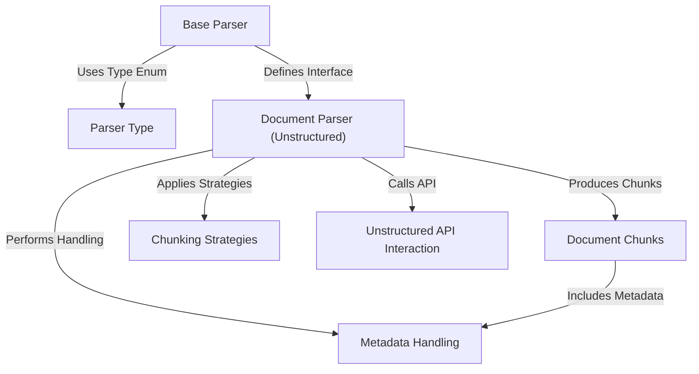
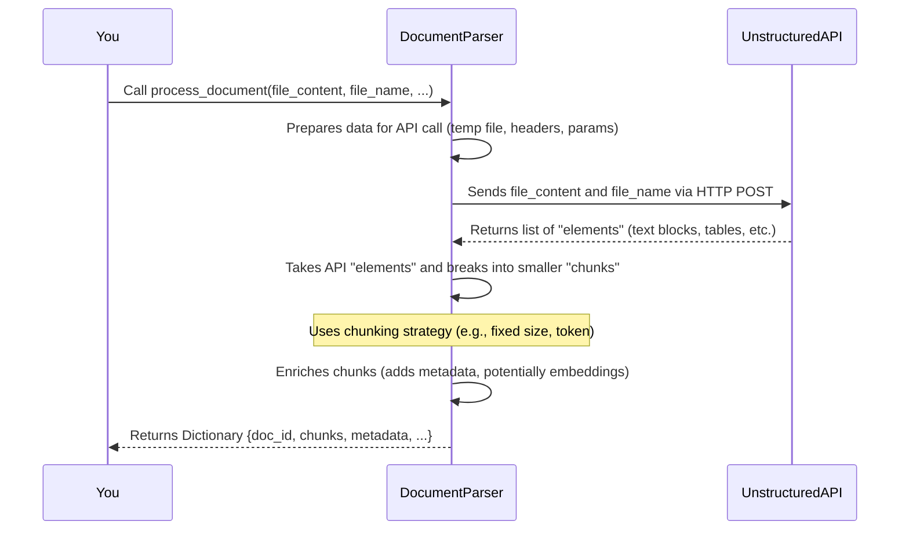
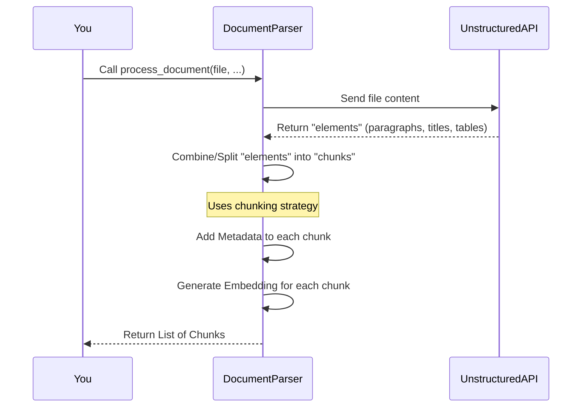
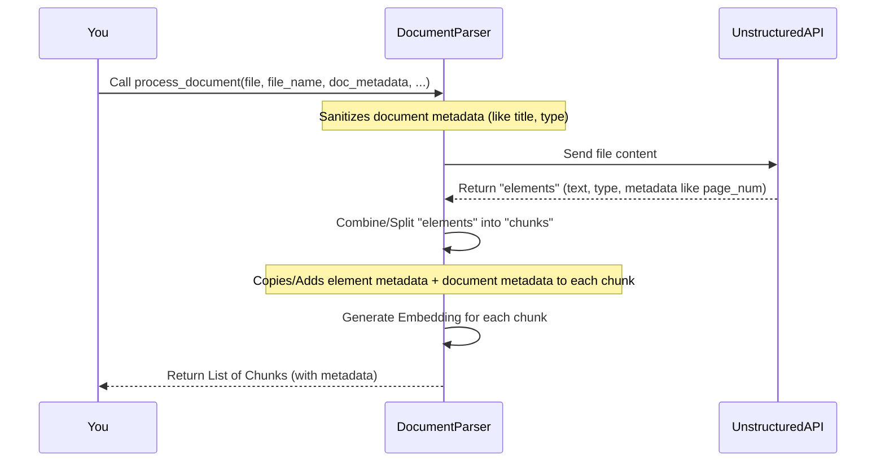
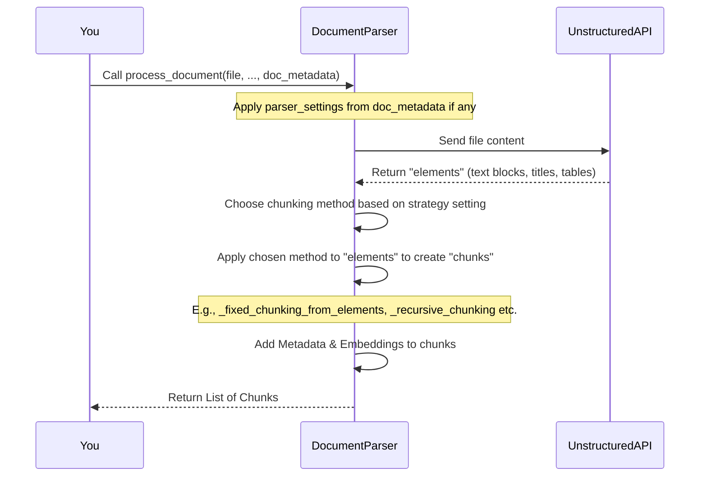
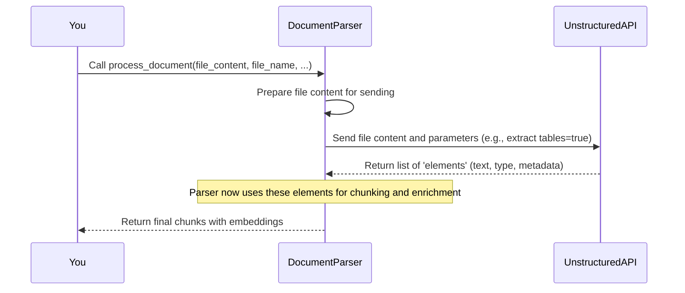

# Tutorial: RegulAIte Document Processing

RegulAite includes a system for **parsing documents**. It uses a *standard blueprint* called the Base Parser that different tools, like the Unstructured API, follow. The primary parser takes documents, sends them to the *Unstructured service* for extraction, then applies different *chunking strategies* to break the content into smaller *document chunks*. These chunks are the final output, enriched with *metadata* about their origin and content, ready for use in a **Retrieval Augmented Generation (RAG)** system.


## Visual Overview



## Chapters

1. [Document Parser (Unstructured)
](#chapter-1-document-parser-unstructured)
2. [Document Chunks
](#chapter-2-document-chunks)
3. [Metadata Handling
](#chapter-3-metadata-handling)
4. [Chunking Strategies
](#chapter-4-chunking-strategies)
5. [Unstructured API Interaction
](#chapter-5-unstructured-api-interaction)
6. [Base Parser
](#chapter-6-base-parser)
7. [Parser Type
](#chapter-7-parser-type)

# Chapter 1: Document Parser (Unstructured)

Welcome to the first chapter of the RegulAite tutorial! In this chapter, we'll meet a key player in our system: the **Document Parser (Unstructured)**. This tool is essential because it helps us read and understand the documents we want to work with.

### What's the Big Problem?

Imagine you have lots of different documents – maybe some PDFs with regulations, some Word documents with internal policies, or even plain text files with notes. Your goal is to build a system that can read these documents and answer questions about their content, like a helpful chatbot.

The problem is, computers don't naturally "read" a PDF like we do. They see raw data. We need a way to turn that raw file data into structured information that our system can understand and use, especially for things like searching or asking questions.

This is where the **Document Parser** comes in. Its main job is to open various file types, pull out the text and other important pieces, and organize them.

### Meet the Document Parser (Unstructured)

The **Document Parser (Unstructured)** is a specific tool within RegulAite designed to solve this parsing problem. Think of it as a specialized reader that knows how to handle many different document formats.

Here's what it does:

1.  **Handles Different Files:** It can work with PDFs, Word documents, text files, and many others.
2.  **Uses a Helper:** It doesn't do the complex file format reading itself. Instead, it talks to a powerful service called the **Unstructured API**. This API is the real expert at cracking open different file types and extracting the raw content like text, titles, tables, and more. We'll dive deeper into [Unstructured API Interaction](#chapter-5-unstructured-api-interaction) later.
3.  **Breaks Content Down:** Once it gets the extracted content from the Unstructured API, the Document Parser doesn't keep it as one giant blob. It carefully breaks it down into smaller, manageable pieces called **chunks**. Understanding [Document Chunks](#chapter-2-document-chunks) is crucial, and that's our next chapter!
4.  **Adds Extra Info:** It also adds helpful information (like page numbers, or where the text came from) to these chunks. This is part of [Metadata Handling](#chapter-3-metadata-handling).

In short, the Document Parser (Unstructured) is our primary tool for taking a document file and transforming it into a list of ready-to-use chunks of text, powered by the Unstructured API.

### How to Use It: Processing a Document

The main way you'll interact with the Document Parser is by giving it a file and asking it to process it. This is done using the `process_document` method.

Let's look at a simplified example of how you might create and use this parser (we'll skip some setup details for now):

```python
# Simplified example (not the full code)

# 1. Get a parser instance (we'll learn how BaseParser helps with this later)
# In reality, you'd use a factory method or dependency injection
# from unstructured_parser.base_parser import BaseParser, ParserType
# parser = BaseParser.get_parser(ParserType.UNSTRUCTURED, ...)
# For simplicity, let's just create the parser directly for this example:
from unstructured_parser.document_parser import DocumentParser

# Create the parser (configure it if needed, using default settings here)
# You might need to set unstructured_api_url and key in a real setup
parser = DocumentParser()

# 2. Prepare your file content (e.g., read a file into bytes)
# Imagine 'my_regulation.pdf' is a file on your computer
try:
    with open("my_regulation.pdf", "rb") as f:
        file_content = f.read()
    file_name = "my_regulation.pdf"
except FileNotFoundError:
    print("Error: my_regulation.pdf not found. Please replace with a real file path.")
    file_content = b"This is a dummy document." # Fallback for example
    file_name = "dummy.txt"


# 3. Call the process_document method
print(f"Processing file: {file_name}")
processed_result = parser.process_document(
    file_content=file_content,
    file_name=file_name,
    # You could optionally provide a doc_id or initial metadata here
    # doc_id="my_unique_doc_id_123",
    # doc_metadata={"category": "Legal"}
)

# 4. What you get back
print("\nDocument processed successfully!")
print(f"Document ID: {processed_result['doc_id']}")
print(f"Number of chunks generated: {processed_result['chunk_count']}")
# The 'chunks' list contains the parsed and chunked content
# print(f"First chunk text: {processed_result['chunks'][0]['text'][:200]}...") # Show first 200 chars

# 5. Remember to close the parser when done
parser.close()

print("\nParser closed.")

```

**Explanation:**

1.  We create an instance of the `DocumentParser`. In a real application, you'd typically use a factory method provided by the [Base Parser](#chapter-6-base-parser) concept, but for this simple example, creating it directly shows the idea.
2.  We load the content of a file (like a PDF) into memory as `bytes`. This is the raw data the parser needs. We also keep the `file_name`.
3.  We call `parser.process_document()`, passing the content and name.
4.  The method returns a dictionary. The most important part for the next steps in our system is the list of `chunks` and the unique `doc_id` assigned to this document. The dictionary also includes other info like the number of chunks found.

The job of taking the file content and turning it into that `processed_result` dictionary, specifically the `chunks` list, is the core function of the Document Parser.

### Under the Hood: How it Works (Simplified Flow)

Let's peek behind the curtain to see the basic steps the `DocumentParser` takes when you call `process_document`:



**Step-by-Step Walkthrough:**

1.  You call `process_document` with your file's binary content and its name.
2.  The `DocumentParser` gets ready to talk to the Unstructured API. It might save the file content temporarily or prepare it for sending over the internet or network.
3.  It makes an HTTP request (like visiting a website, but programmatically) to the Unstructured API's address. It sends the file data along with some instructions (like "please extract text and tables"). You can see this in the `_call_unstructured_api` method within `backend/unstructured_parser/document_parser.py`.
    ```python
    # Simplified snippet from _call_unstructured_api in document_parser.py
    # ... (temp file creation, headers setup) ...
    try:
        with open(temp_file_path, "rb") as f:
            files = {"files": (file_name, f)}
            data = {
                "strategy": "auto",
                "extract_tables": "true" if self.extract_tables else "false",
                # ... other parameters ...
            }
            response = requests.post(
                self.unstructured_api_url, # Where to send the file
                headers=headers,
                files=files, # The file content
                data=data,   # The instructions
                timeout=300
            )
        # ... process response ...
    except Exception as e:
        # ... handle errors ...
        return self._create_fallback_elements(file_name, file_content)
    # ... (temp file cleanup) ...
    ```
    *This code prepares the data and sends a request to the Unstructured API URL.*
4.  The Unstructured API (which is a separate service) processes the file and sends back a list of structured "elements." Each element represents a part of the document, like a paragraph, a list item, a table, or a title, along with its extracted text and some basic metadata.
5.  The `DocumentParser` receives these elements. Now, it needs to break them down further into **chunks**. It looks at the text from the elements and applies a chosen **chunking strategy** ([Chunking Strategies](#chapter-4-chunking-strategies)). This might involve splitting text every few hundred characters, or trying to split based on paragraphs or sections. The code for this is in methods like `_chunk_text` and `_fixed_chunking_from_elements`.
    ```python
    # Simplified snippet from _fixed_chunking_from_elements in document_parser.py
    # ... initialize lists ...
    current_chunk_text = ""
    # ... loop through elements ...
    for element in elements:
        element_text = element.get("text", "").strip()
        if not element_text: continue

        # Add element text to current chunk
        if current_chunk_text: current_chunk_text += "\n\n"
        current_chunk_text += element_text

        # If chunk is too big, finalize it and start new one with overlap
        if len(current_chunk_text) >= self.chunk_size:
             # Create a chunk dictionary using current_chunk_text, metadata, etc.
             chunk = { /* ... chunk details ... */ }
             chunks.append(chunk)
             # Start next chunk with overlap
             current_chunk_text = current_chunk_text[-self.chunk_overlap:] # Basic overlap
             # ... update metadata, index ...

    # ... handle final chunk ...
    return chunks
    ```
    *This code takes the raw elements and combines/splits their text into chunks based on size limits.*
6.  Finally, the parser takes the list of raw chunks it created and **enriches** them. This involves adding more sophisticated metadata (using the [Metadata Handling](#chapter-3-metadata-handling) process) and, importantly, generating a numerical representation (an "embedding") for each chunk's text. Embeddings are crucial for searching later, and we'll generate a dummy one here if a real embedding model isn't configured. This happens in the `_enrich_document` method.
    ```python
    # Simplified snippet from _enrich_document in document_parser.py
    # ... initialize list ...
    enriched_chunks = []
    # ... loop through raw chunks ...
    for chunk_dict in chunks:
        # Generate embedding for the chunk text
        embedding = self.embedding_model.get_text_embedding(chunk_dict.get("text", ""))
        
        # Create the final enriched chunk dictionary
        enriched_chunk = {
            "chunk_id": chunk_dict.get("chunk_id", uuid.uuid4()),
            "doc_id": doc_id,
            "text": chunk_dict.get("text", ""),
            "embedding": embedding, # The generated vector!
            "metadata": chunk_dict.get("metadata", {}),
            # ... other fields ...
        }
        enriched_chunks.append(enriched_chunk)

    return enriched_chunks
    ```
    *This code adds the crucial embedding vector and finalizes the chunk structure.*
7.  The `process_document` method then returns the document ID and the list of these fully prepared, enriched chunks back to you.

### Analogy: Sorting and Folding Laundry

Think of the `DocumentParser (Unstructured)` like someone doing laundry:

*   You hand them a big, mixed pile of laundry (your document file).
*   They use a special sorting machine (the **Unstructured API**) that automatically separates everything into categories: shirts, pants, socks, towels (these are like the "elements" returned by the API).
*   Now they have sorted piles, but they're still too big or messy. They take each pile and cut/fold it into smaller, neat pieces (the **chunks**), using different folding methods ([Chunking Strategies](#chapter-4-chunking-strategies)).
*   As they fold, they attach little labels to each folded piece saying what it is (shirt/pants/sock), which pile it came from (which part of the document), and what page it was on ([Metadata Handling](#chapter-3-metadata-handling)). They might even take a tiny picture of the item for easier finding later (creating an **embedding**).
*   Finally, they give you back a basket full of neatly folded, labeled pieces of laundry (the list of enriched **chunks**) and tell you which load of laundry it all came from (the `doc_id`).

### Wrapping Up

In this chapter, we introduced the **Document Parser (Unstructured)** as the tool responsible for taking raw document files and transforming them into structured information, specifically a list of chunks. We learned it relies on the Unstructured API for the heavy lifting of file format parsing and then performs its own chunking and enrichment steps.

This process is the vital first step in allowing our system to actually understand and utilize the information within various documents.

Now that we know how documents get broken down, the next logical step is to understand what those smaller pieces, the "chunks," actually are.


# Chapter 2: Document Chunks

Welcome back! In [Chapter 1: Document Parser (Unstructured)](#chapter-1-document-parser-unstructured), we learned how the `DocumentParser` takes a raw document file and starts the process of making its content usable. We saw that its main output is a collection of smaller pieces.

Now, let's dive into what those smaller pieces actually are. They are the stars of this chapter: **Document Chunks**.

### What's the Problem Chunks Solve?

Imagine you have a massive PDF document, maybe hundreds of pages long. You want to build a system that can answer specific questions about this document, like "What is the regulation regarding data privacy?".

A computer or an AI model (like a Large Language Model, LLM) can't easily read and instantly understand a huge document all at once. It's like trying to find a specific sentence in a giant book without an index or chapter breaks – very inefficient!

We need to break the document down into smaller, more manageable parts. These parts should be small enough for a computer to process efficiently, but large enough to contain some meaningful context. This is exactly what **Document Chunks** are for.

### What is a Document Chunk?

A Document Chunk is a fundamental building block in our system. It's a self-contained piece of information derived from the original document.

Think of a large document like a book. The **Document Parser** processes the book and breaks it down into things like paragraphs, headings, and tables (these are like the "elements" we saw the Unstructured API provide). Then, it takes these elements and combines or splits them into **chunks**, which are roughly equivalent to structured paragraphs or small sections.

Each chunk is designed to be useful on its own. It typically includes:

1.  **Text:** The actual words extracted from that specific part of the document.
2.  **Metadata:** Extra information *about* that text, such as where it came from (page number, section, original file name). This helps provide context.
3.  **Embedding:** A special numerical representation of the text that helps computers understand its meaning and find similar pieces of text.

These chunks are the pieces that our system will index, store, and search over when trying to answer a question.

### The Three Key Parts of a Chunk

Let's look closer at what makes up a document chunk:

| Part      | What it is                                    | Why it's important                                        |
| :-------- | :-------------------------------------------- | :-------------------------------------------------------- |
| **Text**  | The actual content (words, sentences)         | This is the information we want to retrieve and use.      |
| **Metadata** | Information *about* the text (e.g., page, section) | Provides context, allows filtering, helps source attribution. We'll cover [Metadata Handling](#chapter-3-metadata-handling) next. |
| **Embedding** | A list of numbers representing the text's meaning | Enables finding *semantically similar* chunks, even if they don't use the exact same words (Vector Search). |

The combination of text, descriptive metadata, and a searchable embedding makes each chunk a powerful, usable unit of information from the original document.

### How Chunks are Created (The Process)

You saw in Chapter 1 that calling `parser.process_document()` gives you a list of chunks. But how does the parser actually create them?

Let's look at the simplified flow again:



Based on this diagram:

1.  The `DocumentParser` first uses the `UnstructuredAPI` to break the raw file data into basic structural `elements` (like getting individual paragraphs, titles, or tables).
2.  It then takes these `elements` and applies a **chunking strategy** ([Chunking Strategies](#chapter-4-chunking-strategies)). This is where the main work of deciding *how* to group or split the elements happens to create chunks that are a specific size (e.g., around 500 words or 1000 characters).
3.  As it creates each chunk, it adds **metadata** to it. This metadata comes partly from the Unstructured API's results (like page numbers for an element) and partly from the document's overall information ([Metadata Handling](#chapter-3-metadata-handling)).
4.  Finally, for each chunk, the parser generates an **embedding** – the numerical vector that captures the meaning of the chunk's text.

The output you get is the list of these fully prepared, enriched chunks.

### Seeing a Chunk in Code (Output Example)

Let's revisit the output of the `process_document` method from Chapter 1. We'll look specifically at the `chunks` part of the result.

```python
# Recall from Chapter 1, the result dictionary looked like this:
processed_result = {
    "doc_id": "my_unique_doc_id_123",
    "chunks": [
        # ... chunk dictionaries go here ...
    ],
    "metadata": { /* ... document metadata ... */ },
    "chunk_count": 55, # Example count
    # ... other processing details ...
}

# Let's imagine what ONE chunk dictionary looks like inside the 'chunks' list:

example_chunk = {
    "chunk_id": "a1b2c3d4-e5f6-7890-1234-abcdeffedcba", # Unique ID for this chunk
    "doc_id": "my_unique_doc_id_123", # Link back to the original document
    "text": "This document outlines the regulations regarding data privacy, specifically section 3, covering user consent and data handling practices...",
    "content": "This document outlines...", # Alias for text
    "embedding": [0.123, -0.456, 0.789, ..., 0.987], # The numerical vector (e.g., 384 numbers)
    "metadata": {
        "source_file": "my_regulation.pdf",
        "page_number": 5,
        "section": "Section 3: Data Privacy Regulations",
        "file_type": "pdf",
        "title": "My Important Regulation",
        # ... other metadata like author, category, etc.
    },
    "page_num": 5, # Often duplicated for convenience
    "element_type": "NarrativeText", # Type of original element(s) it came from
    "index": 15, # Order index within the document's chunks
    "order_index": 15 # Alias for index
}

# This 'example_chunk' is one item in the processed_result['chunks'] list.
# The full list would contain many such dictionaries.
```

**Explanation:**

*   The `processed_result` dictionary contains the overall output.
*   The `chunks` key holds a `list` of dictionaries. Each dictionary in this list is a single **Document Chunk**.
*   We see the `chunk_id` (a unique identifier for *this specific chunk*), the `doc_id` (linking it back to the original document), the actual `text`, and the `embedding` (shown here as `[...]` because it's a long list of numbers).
*   The `metadata` dictionary holds structured information like the `source_file`, `page_number`, and `section`.
*   Fields like `page_num`, `element_type`, `index`, and `order_index` provide more context about the chunk's origin and position.

This dictionary structure is standardized, making it easy for the next parts of the system (like the vector database) to understand and process these chunks.

### Under the Hood: How the Parser Builds Chunks

Let's look at a simplified piece of the code within `DocumentParser` that handles creating these chunk dictionaries. This happens *after* the Unstructured API returns the initial `elements` and *during* the `_enrich_document` step (as shown in the mermaid diagram flow).

```python
# Simplified snippet from _enrich_document in document_parser.py
# This runs after _fixed_chunking_from_elements creates initial chunk dicts
# It takes 'chunks' (list of dictionaries) and adds embeddings

# ... inside the _enrich_document method ...

enriched_chunks = [] # This will be our final list of chunk dictionaries

# Loop through the chunks created by the chunking logic
for chunk_dict in chunks: # 'chunks' here is the output of _fixed_chunking_from_elements or similar
    
    # 1. Generate the embedding for the chunk's text
    # The embedding_model turns text into a list of numbers (the vector)
    embedding = self.embedding_model.get_text_embedding(chunk_dict.get("text", ""))

    # 2. Prepare the final chunk dictionary structure
    # We pull info from the chunk_dict and add the new embedding
    enriched_chunk = {
        "chunk_id": chunk_dict.get("chunk_id", uuid.uuid4()), # Get ID or create new
        "doc_id": doc_id, # The ID of the parent document
        "text": chunk_dict.get("text", ""),
        "content": chunk_dict.get("text", ""), # Common alias
        "embedding": embedding, # <-- The numerical vector is added here!
        "metadata": chunk_dict.get("metadata", {}), # Include the collected metadata
        "page_num": chunk_dict.get("page_num", 0),
        "element_type": chunk_dict.get("element_type", "text"),
        "index": chunk_dict.get("index", len(enriched_chunks)),
        "order_index": chunk_dict.get("order_index", len(enriched_chunks))
        # Other fields like 'section' might also be included
    }

    # Add the complete, enriched chunk to our final list
    enriched_chunks.append(enriched_chunk)

# ... after the loop, enriched_chunks is returned by _enrich_document ...

```

**Explanation:**

1.  The code iterates through an initial list of chunk dictionaries (which were already split and had basic metadata attached by other methods like `_fixed_chunking_from_elements`).
2.  For each `chunk_dict`, it extracts the `text`.
3.  It then calls `self.embedding_model.get_text_embedding()` on that text. This is where the text is converted into its numerical `embedding`. If a real model isn't set up, a list of zeros (`[0.0] * embedding_dim`) is created as a placeholder.
4.  A new dictionary, `enriched_chunk`, is created. It copies relevant information from the initial `chunk_dict` (like `text`, `doc_id`, `metadata`, `page_num`, etc.) and crucially, adds the newly generated `embedding`.
5.  This complete `enriched_chunk` dictionary is added to the `enriched_chunks` list.
6.  Once all initial chunks have been processed, the `enriched_chunks` list (containing all the final chunk dictionaries with text, metadata, and embeddings) is returned.

This process ensures that every chunk returned by the `process_document` method is ready to be indexed and searched by the RAG system.

### Analogy: Index Cards

Let's revisit our laundry analogy and refine it for chunks.

Think of your document as a large, complex textbook.

*   The **Unstructured API** extracts all the raw content and structure, giving you sorted piles of notes for each chapter, section, paragraph, and image caption (these are the "elements").
*   The **Document Parser's chunking logic** takes these piles and decides how to break them down further. It might combine a few related paragraphs, or split a very long one, ensuring each resulting note is a usable size (creating the **chunks**). This is like deciding how many paragraphs to put on one index card.
*   As it makes each index card (chunk), it writes important details at the top: the chapter and section title, the page number, and maybe a note about whether it was a heading or a regular paragraph (this is the **metadata**).
*   Then, it takes each completed index card and creates a special internal "summary code" or "fingerprint" for its content (this is the **embedding**).
*   Finally, the `process_document` method gives you a box filled with these neatly organized, labeled, and fingerprinted index cards (the list of **Document Chunks**).

Now, if you ask a question about the book, the RAG system can quickly look through the "fingerprints" to find the most relevant index cards (chunks) and use the text on those cards (along with the metadata for context) to help answer your question.

### Wrapping Up

In this chapter, we explored the concept of **Document Chunks**. We learned that they are the essential, self-contained units produced by the document parsing process. Each chunk combines a piece of the original document's text with rich **metadata** for context and an **embedding** (a numerical representation) to enable powerful search capabilities.

Understanding Document Chunks is key because they are the items that our RAG system will directly work with – indexing them, searching them, and using their text to generate answers.

Now that we know *what* chunks are made of, let's look more closely at the **Metadata** they contain and how it's handled.


# Chapter 3: Metadata Handling

Welcome back to the RegulAite tutorial! In [Chapter 1: Document Parser (Unstructured)](#chapter-1-document-parser-unstructured), we met the tool that reads your documents, and in [Chapter 2: Document Chunks](#chapter-2-document-chunks), we learned about the small, usable pieces of text it creates.

You might remember from Chapter 2 that each chunk isn't just raw text. It also includes two other important things: **metadata** and an **embedding**. In this chapter, we're going to focus on that second piece: **Metadata Handling**.

### What's the Problem Metadata Solves?

Imagine you're searching for information in a large library. Finding a book by its content alone is hard. You need the library's catalog! The catalog tells you the book's title, author, publication date, shelf location, and perhaps a summary. This "data about the data" helps you find exactly what you need quickly and understand its context.

In RegulAite, your collection of documents is like that library, and the chunks are like the paragraphs or sections within the books. If you just have a list of text chunks, how do you know which document a chunk came from? Which page? Which section? Was it part of a table or just regular text?

Without this extra information – the **metadata** – the chunks are less useful. You can find relevant text using the embedding, but you won't know its origin or context, which is crucial for building a reliable system.

This is where **Metadata Handling** comes in. It's the process of capturing, organizing, and attaching this vital contextual information to every chunk.

### What is Metadata?

Simply put, metadata is **data about data**. For a document chunk, metadata is information *about* the original document and *about* where that specific chunk came from within it.

Think of it like labels you stick on something to describe it.

Common types of metadata associated with a document chunk include:

*   **Original Filename:** The name of the file the chunk came from (e.g., `my_regulation.pdf`).
*   **File Type:** What kind of file it was (e.g., `pdf`, `docx`, `txt`).
*   **Document Title:** A potential title extracted or assigned to the whole document.
*   **Author (if available):** Who created the document.
*   **Creation Date (if available):** When the document was created.
*   **Page Number:** Which page(s) in the original document the text came from.
*   **Section/Heading:** Which section or heading this text was under.
*   **Element Type:** What kind of element it was in the original document (e.g., `NarrativeText` for a paragraph, `Title`, `ListItem`, `Table`).
*   **Index/Order:** The chunk's position within the sequence of chunks for that document.

This information is stored in a structured way, typically as a dictionary, alongside the chunk's text and embedding.

### Why is Metadata Important for RegulAite?

Metadata isn't just nice to have; it's essential for several reasons:

1.  **Provides Context:** When the system retrieves a chunk to answer a question, showing the user *which document* and *which page* it came from is critical for trust and verification.
2.  **Enables Filtering:** You can refine searches. For example, "Find regulations about data privacy *only* in PDF documents from 2022," or "Find information about section 5 in the 'Employee Handbook'".
3.  **Improves Search Accuracy:** Sometimes metadata like section titles or headings can be weighted more heavily in searches.
4.  **Organizes Information:** Helps keep track of thousands or millions of chunks from different sources.
5.  **Source Attribution:** Ensures you can always trace information back to its origin.

### How RegulAite Handles Metadata

The `DocumentParser (Unstructured)` is the primary component responsible for collecting and organizing metadata during the parsing process. It gets help from two main sources:

1.  **The Unstructured API:** When the parser sends a document to the Unstructured API ([Chapter 5: Unstructured API Interaction](#chapter-5-unstructured-api-interaction)), the API doesn't just send back text. It also sends back initial metadata for each `element` it extracts, like the page number or the element's type (Title, Table, etc.).
2.  **Document-level information:** The parser itself knows the original filename and can incorporate any document-level metadata you might provide (`doc_metadata` in the `process_document` call). It also assigns a unique `doc_id`.

The `DocumentParser` combines this information and adds it to the `metadata` dictionary within each chunk dictionary it creates. It also adds some key metadata fields like `doc_id`, `page_num`, and `index` directly to the chunk dictionary for easy access.

### Seeing Metadata in a Chunk (Again)

Let's look at that example chunk dictionary from Chapter 2 again, specifically focusing on the metadata:

```python
# An example of ONE chunk dictionary
example_chunk = {
    "chunk_id": "a1b2c3d4-e5f6-7890-1234-abcdeffedcba", # Unique ID for this chunk
    "doc_id": "my_unique_doc_id_123", # Link back to the original document

    # ... (text and embedding are here too) ...
    "text": "This document outlines the regulations regarding data privacy...",
    "embedding": [0.123, -0.456, ..., 0.987],

    # This is the main metadata dictionary:
    "metadata": {
        "source_file": "my_regulation.pdf", # Added by the parser
        "file_type": "pdf",               # Added/derived by the parser
        "page_number": 5,                 # Often comes from Unstructured API
        "section": "Section 3",           # Often comes from Unstructured API or parser logic
        "title": "My Important Regulation", # Added/derived by the parser
        "author": "Jane Doe",             # Could be provided or extracted
        "created_at": "2023-01-15T10:00:00Z",# Could be provided or extracted
        "doc_id": "my_unique_doc_id_123", # Also linked here for convenience
        # ... other metadata like extraction notes, table data link etc.
    },

    # Some key metadata fields are often promoted to the top level for convenience:
    "page_num": 5, # Duplicated from metadata['page_number']
    "element_type": "NarrativeText", # From Unstructured API element type
    "index": 15, # Order within the document's chunks (managed by parser)
    "order_index": 15 # Alias for index
}
```

As you can see, the `metadata` dictionary holds lots of useful information. Fields like `source_file`, `file_type`, and `title` are often added or derived by the `DocumentParser` itself, while `page_number` and `element_type` typically come directly from the Unstructured API's output for the corresponding elements. The parser makes sure all this is collected and placed correctly within the chunk's structure.

### Under the Hood: How Metadata Gets Added

Let's look at the process inside the `DocumentParser` to see how metadata is collected and attached to the chunks.

Recall the simplified flow from Chapter 1 & 2:



Notice the step where the `DocumentParser` takes the `elements` from the `UnstructuredAPI` and combines them into `chunks`. During this process, it actively collects and adds the metadata.

Here's a look at simplified code snippets showing how this happens:

First, the `DocumentParser` prepares some basic document-level metadata:

```python
# Simplified snippet from process_document in document_parser.py
# ... inside process_document method ...

# Generate document ID if not provided
if not doc_id:
    doc_id = f"doc_{uuid.uuid4()}"

# Initialize document metadata if not provided
if doc_metadata is None:
    doc_metadata = {}

# Validate and sanitize document metadata - adds defaults if missing
# This ensures doc_metadata has basic info like size, file_type, title
self._sanitize_metadata(doc_metadata, file_name, file_content)

# ... rest of process_document ...
```

This `_sanitize_metadata` method (shown in the actual code in `document_parser.py`) is important because it populates default values for things like `title` (from filename), `file_type` (from extension), and `size`, ensuring this base information exists before chunking starts.

Next, the `DocumentParser` calls the `UnstructuredAPI` to get the raw content and element-specific metadata:

```python
# Simplified snippet from _call_unstructured_api in document_parser.py
# ... inside _call_unstructured_api method ...

# Prepare data for API call (including request for metadata)
data = {
    # ... other parameters ...
    "include_metadata": "true" if self.extract_metadata else "false" # We ask for metadata
}

response = requests.post( /* ... send file to API ... */ )

# ... process response ...

# The 'elements' list comes back, where each element *might* have a 'metadata' field
elements = response.json()

# An element might look like:
# {"type": "NarrativeText", "text": "...", "metadata": {"page_number": 5, "filename": "...", "section": "..."}}

return elements # Return the list of elements
```

The `elements` returned by the API contain the text, their type, and importantly, a `metadata` dictionary for *that specific element*.

Finally, when the parser creates the actual chunks (like in `_fixed_chunking_from_elements`), it builds the chunk's metadata dictionary by combining information:

```python
# Simplified snippet from _fixed_chunking_from_elements in document_parser.py
# ... inside _fixed_chunking_from_elements method ...

chunks = [] # List to store final chunk dictionaries
current_chunk_text = ""
current_metadata = {} # Dictionary to build metadata for the current chunk
current_page_num = 0

for element in elements: # Loop through elements from the API
    element_type = element.get("type", "unknown")
    element_text = element.get("text", "").strip()

    if not element_text: continue

    # Capture page number from element metadata if available
    if "metadata" in element and "page_number" in element["metadata"]:
        current_page_num = element["metadata"]["page_number"]

    # Add element text to current chunk text ... (chunking logic happens here)

    # Copy metadata from the element to the chunk's metadata dictionary
    if "metadata" in element and isinstance(element["metadata"], dict):
        for key, value in element["metadata"].items():
             # Avoid complex types if necessary, add useful ones
             if key in ["page_number", "section", "filename", "source_file"]:
                 current_metadata[key] = value

    # When a chunk is finalized (either by size or end of elements):
    if len(current_chunk_text) >= self.chunk_size or element == elements[-1]:

        # Create the chunk dictionary
        chunk = {
            "chunk_id": uuid.uuid4(),
            "doc_id": doc_id, # Add the document ID
            "text": current_chunk_text,
            "metadata": current_metadata.copy(), # Add the collected metadata dictionary
            "page_num": current_page_num, # Add page number (often duplicated for ease)
            "element_type": ", ".join(current_element_types), # Add element types
            "index": chunk_index,
            # ... other fields ...
        }

        chunks.append(chunk)
        chunk_index += 1

        # Reset for next chunk (with overlap)
        current_chunk_text = "..." # With overlap
        current_metadata = {} # Start with empty metadata for the new chunk, will fill from next elements
        # ... reset other variables ...

# ... handle final chunk ...
return chunks # Return list of chunk dictionaries
```

This simplified code shows how the parser iterates through the elements returned by the API, building up the text for a chunk and *simultaneously* collecting relevant metadata from the elements (`page_number`, `section`, etc.) into the `current_metadata` dictionary. When a chunk is ready, this dictionary is copied into the chunk's `metadata` field, and key pieces like `page_num` and `doc_id` are also added directly.

The `_enrich_document` method then takes these chunk dictionaries and adds the embedding, finalizing the chunk structure for output.

### Analogy: Labeling the Index Cards

Let's go back to our index card analogy for chunks from Chapter 2.

When the Document Parser is creating those index cards (chunks) from the sorted piles of notes (elements from Unstructured API), the **Metadata Handling** process is like writing important details on the top of *each* card:

*   It looks at the original source document and writes its name on every card ("Source Book: My Regulation Guide").
*   It looks at the type of note (paragraph, heading, table) and writes that ("Type: Paragraph").
*   It checks the original page number the note came from and writes that ("Page: 5").
*   It looks at the heading above the note and writes that ("Section: Data Privacy").

So, each index card (chunk) ends up with the content (text), its summary code (embedding), and all these helpful labels (metadata) that tell you exactly what it is and where it came from. This makes it much easier to use and trust the information on the cards later.

### Wrapping Up

In this chapter, we explored **Metadata Handling**, the process of attaching crucial contextual information to document chunks. We learned why metadata is vital for providing context, enabling filtering, and ensuring source attribution in a RAG system.

We saw that the `DocumentParser (Unstructured)` collects this metadata from the Unstructured API's element output (like page numbers) and combines it with document-level information (like filename and title) to create the rich `metadata` dictionary within each chunk.

Understanding how metadata is handled is key because it transforms raw text chunks into structured, searchable, and contextually aware pieces of information that power the rest of the RegulAite system.

Now that we know *what* goes into a chunk (text, metadata, embedding), let's look at *how* the parser decides where to split the text into chunks – the different ways it applies **Chunking Strategies**.


# Chapter 4: Chunking Strategies

Welcome back! In our journey so far, we've met the [Document Parser (Unstructured)](#chapter-1-document-parser-unstructured) which reads our documents. We then learned about the small, usable pieces it creates called [Document Chunks](#chapter-2-document-chunks), and explored how helpful information, or [Metadata Handling](#chapter-3-metadata-handling), is attached to these chunks.

Now, we arrive at a crucial question: **How does the Document Parser decide *where* to split the original document's text into those smaller chunks?**

This is where **Chunking Strategies** come in.

### What's the Problem Chunking Strategies Solve?

Remember the problem chunks solve? We need to break large documents into pieces that are small enough for computers and AI models to process efficiently. But just splitting randomly isn't good.

Imagine cutting a book in half in the middle of a sentence. The two resulting pieces won't make sense! We want our chunks to be meaningful. A good chunk should ideally contain text that belongs together, like a complete paragraph, a list item, or a small section.

How we split the text affects:

*   **Context:** Does the chunk contain enough surrounding text for an AI to understand its meaning?
*   **Search Quality:** If you search for a concept, will the relevant information be contained within one or two chunks, or spread across many unrelated chunks?
*   **Processing Efficiency:** Chunks shouldn't be too big (hard for AI) or too small (losing context, creating too many chunks).

Different documents (like a formal legal text vs. a casual blog post) have different structures. A strategy that works well for one might be terrible for another.

**Chunking Strategies** are the different sets of rules the parser uses to decide *how* to perform this crucial splitting, allowing us to tune the process based on the document type.

### What is a Chunking Strategy?

A Chunking Strategy is simply the method or algorithm used by the `DocumentParser` to divide the continuous stream of text (extracted from the document's elements by the Unstructured API) into discrete **Document Chunks**.

Instead of just cutting the text every N characters, strategies consider things like:

*   A target size (number of characters or tokens).
*   Structural breaks (like paragraphs, headings, page breaks).
*   Even potentially semantic meaning (though this is more advanced).

The goal is always to create chunks that are reasonably sized and keep related text together.

### Common Chunking Strategies

The `DocumentParser` in RegulAite supports several strategies. Let's look at the main ones defined in the code (`ChunkingStrategy = Literal["fixed", "recursive", "semantic", "hierarchical", "token"]`):

1.  **Fixed Size Chunking (`"fixed"`)**
    *   **How it works:** This is the simplest method. The parser splits the text into chunks of a nearly fixed size (e.g., 1000 characters). It often tries to make the cut at a nearby sentence or word boundary to avoid splitting words or sentences. It also typically includes some **overlap** between consecutive chunks (e.g., the end 100 characters of one chunk are also the start of the next) to ensure context isn't lost at the boundaries.
    *   **Good for:** Simple text, or when structure is unreliable. Easy to understand and implement.
    *   **Analogy:** Cutting a long rope into pieces of roughly the same length. You might try to cut between knots if possible.

2.  **Recursive Chunking (`"recursive"`)**
    *   **How it works:** This strategy is more sophisticated. It tries to split the text using a list of separators, starting with the largest ones (like `\n\n` for paragraphs), then falling back to smaller ones (like `\n` for newlines, or even spaces) if a large chunk remains. This attempts to keep structural units (like paragraphs) together.
    *   **Good for:** Text with clear structural breaks (like markdown or plain text with double newlines for paragraphs). Respects logical flow better than fixed size.
    *   **Analogy:** Breaking a long stick by first trying to snap it at natural weak points, then splitting the resulting pieces further if they are still too long.

3.  **Semantic / Hierarchical Chunking (`"semantic"`, `"hierarchical"`)**
    *   **How it works:** These strategies aim to split based on the *meaning* or *structure* of the document, often using headings, titles, or other structural cues identified by the Unstructured API. The idea is to create chunks that represent coherent ideas or sections. *Note: The current implementation in the code uses heuristic patterns (like finding common heading formats) for `"semantic"` and treats `"hierarchical"` similarly, focusing on structure identified during parsing.*
    *   **Good for:** Structured documents (reports, articles, legal texts) where sections correspond to distinct topics.
    *   **Analogy:** Breaking a book down into chapters, then sections within chapters, then paragraphs within sections.

4.  **Token Chunking (`"token"`)**
    *   **How it works:** Instead of counting characters, this strategy counts "tokens." Tokens are the basic units of text that AI models understand (like words, parts of words, or punctuation). This method uses a specialized splitter (like `TokenTextSplitter` from `langchain_text_splitters`) to split chunks based on a target number of tokens, often also with overlap.
    *   **Good for:** Optimizing chunk size specifically for AI models, as their context window is typically measured in tokens. Can lead to more effective use of the AI's capacity. Requires an external library.
    *   **Analogy:** Breaking text down into pieces, making sure each piece contains a specific number of "meaningful word-like units" that a specific reader (the AI) prefers to process.

Here's a simple comparison:

| Strategy     | How it Splits                       | Respects Structure? | Complexity   | Good For...                    |
| :----------- | :---------------------------------- | :------------------ | :----------- | :----------------------------- |
| `fixed`      | By character count (approx)         | Poorly              | Simple       | Any text, fallback           |
| `recursive`  | By predefined separators (`\n\n`, `\n`) | Moderately          | Moderate     | Texts with clear paragraphs    |
| `semantic`   | By pattern-based sections           | Tries               | Moderate     | Structured text with headings  |
| `hierarchical`| By structure (ideally)             | Tries (basic in code) | Moderate     | Structured documents         |
| `token`      | By token count (approx)             | Indirectly (on text) | Depends      | AI processing optimization   |

### How to Choose and Use a Strategy

You select the chunking strategy when you initialize the `DocumentParser` or provide document-specific settings.

The `DocumentParser` constructor has a `chunking_strategy` parameter:

```python
from unstructured_parser.document_parser import DocumentParser

# Example 1: Use the default 'token' strategy (if available)
parser_default = DocumentParser() 

# Example 2: Explicitly choose fixed size chunking
parser_fixed = DocumentParser(chunking_strategy="fixed", chunk_size=1000, chunk_overlap=150)

# Example 3: Choose recursive chunking
parser_recursive = DocumentParser(chunking_strategy="recursive", chunk_size=800)

# ... then process a document using the chosen parser instance
# parser_fixed.process_document(...)
```

You can also override the default settings for a specific document by providing `parser_settings` in the `doc_metadata` dictionary when calling `process_document`:

```python
from unstructured_parser.document_parser import DocumentParser

parser = DocumentParser() # Initialize with default strategy

file_content = b"Your document content here..."
file_name = "special_report.txt"

# Define settings specifically for this document
doc_specific_settings = {
    "chunking_strategy": "recursive", # Use recursive for this text file
    "chunk_size": 1200,
    "chunk_overlap": 100
}

# Call process_document, passing the settings in metadata
processed_result = parser.process_document(
    file_content=file_content,
    file_name=file_name,
    doc_metadata={"parser_settings": doc_specific_settings}
)

print(f"Processed with strategy: {parser.chunking_strategy} (applied from metadata)")
# Note: The parser instance's settings are updated *during* the call
# based on doc_metadata if provided.
```

When you call `process_document`, the parser looks at the provided `doc_metadata` for `parser_settings`. If found, it temporarily uses those settings (including `chunking_strategy`, `chunk_size`, `chunk_overlap`) for *that specific document processing task*. Otherwise, it uses the settings it was initialized with.

### Under the Hood: How the Parser Applies the Strategy

Let's see where the chunking strategy is applied in the parser's workflow.



After getting the `elements` (like paragraphs, titles) from the Unstructured API, the `DocumentParser` needs to combine and/or split these elements' text according to the chosen strategy.

The core logic for choosing the method is in the `_chunk_text` method (although the `_fixed_chunking_from_elements` and `_hierarchical_chunking_from_elements` methods handle the element-to-chunk conversion based on the chosen *type* of chunking).

Here's a simplified look at the `_chunk_text` method, which routes the request based on the `self.chunking_strategy` setting:

```python
# Simplified snippet from _chunk_text in document_parser.py

def _chunk_text(self, text: str) -> List[str]:
    # ... checks for empty text ...

    if len(text) <= self.chunk_size:
        # If text is smaller than chunk size, no need to split
        return [text]

    # *** Strategy selection happens here! ***
    if self.chunking_strategy == "fixed":
        # Call the method for fixed size splitting
        return self._fixed_size_chunking(text) 
    elif self.chunking_strategy == "recursive":
        # Call the method for recursive splitting
        return self._recursive_chunking(text)
    elif self.chunking_strategy == "semantic":
        # Call the method for semantic splitting
        return self._semantic_chunking(text)
    elif self.chunking_strategy == "hierarchical":
        # Call the method for hierarchical splitting
        # Note: _hierarchical_chunking_from_elements actually does the element->chunk
        # mapping, _chunk_text handles raw text fallback if needed.
        return self._hierarchical_chunking(text) 
    elif self.chunking_strategy == "token":
        # Call the method for token-based splitting (with availability check)
        if HAS_TOKEN_SPLITTER:
             return self._token_chunking(text)
        else:
             logger.warning("Token chunking not available, falling back...")
             return self._fixed_size_chunking(text) # Fallback
    else:
        # Default fallback
        logger.warning(f"Unknown strategy {self.chunking_strategy}, falling back...")
        return self._fixed_size_chunking(text)

```

This method decides *which* specific chunking logic to apply to a given block of text. The actual implementation of each logic (like `_fixed_size_chunking`, `_recursive_chunking`, etc., found in `backend/unstructured_parser/document_parser.py`) contains the rules for measuring size, finding split points, and creating the text segments for each chunk.

For example, the `_fixed_size_chunking` method implements the logic to cut text based on the character count, attempting to break at sentence or word boundaries and managing the overlap:

```python
# Simplified snippet from _fixed_size_chunking in document_parser.py

def _fixed_size_chunking(self, text: str) -> List[str]:
    chunks = []
    start = 0
    text_len = len(text)

    while start < text_len:
        end = start + self.chunk_size # Proposed end based on size

        if end >= text_len:
            chunk = text[start:text_len] # Last chunk
        else:
            # Try to find a good split point before the hard 'end'
            # (e.g., find last period for sentence boundary)
            sentence_end = text.rfind(". ", start, end) + 1
            if sentence_end > start: # Found a sentence end
                end = sentence_end
            else: # No sentence end, try word boundary
                word_end = text.rfind(" ", start, end) + 1
                if word_end > start: # Found a word end
                    end = word_end
            # If no good boundary before 'end', 'end' remains start + chunk_size

        chunks.append(text[start:end].strip()) # Add the chunk

        # Move the start point for the next chunk, accounting for overlap
        start = end - self.chunk_overlap

    return chunks # Return the list of text segments
```

This simple code shows the core loop: calculate a potential end based on `self.chunk_size`, adjust it if a better split point is found nearby, capture the text, and then advance `start` backward by `self.chunk_overlap` for the next iteration.

Other methods like `_recursive_chunking` use different logic (splitting by `\n\n` first, then `\n`, etc.) but serve the same purpose: dividing the text into segments based on their specific rules.

These text segments, along with the metadata collected from the original elements, are then used in the `_enrich_document` method to create the final chunk dictionaries that include the embedding.

### Analogy: Folding Laundry (Advanced)

Let's refine our laundry analogy one last time for chunking strategies.

You've sorted the laundry into piles (elements from Unstructured API). Now you need to fold them into neat, manageable pieces (chunks) to put away. How do you fold?

*   **Fixed Size:** You decide every folded item should be roughly the same size. You take a pile, measure out a length, fold it, maybe include a little bit of the next piece underneath (overlap), then move to the next section. It's simple, but you might cut a shirt in half if it's too long!
*   **Recursive:** You decide to fold differently. First, you look for major divisions (like separating towels from clothes). Then, within clothes, you fold by type (shirts, pants). Then you fold each individual item. You use different folding *methods* for shirts, pants, and towels (like using different separators). If an item is huge (like a bedsheet), you might have to use the simple 'fixed size' cut-in-half method as a fallback.
*   **Semantic/Hierarchical:** You decide to fold based on *how you'll use* the laundry. All gym clothes go together, all work clothes go together, regardless of item type. Or you follow the structure of how the clothes were worn (outfit 1, outfit 2). You're guided by the *purpose* or *original structure* rather than just size or simple breaks.
*   **Token:** You fold based on what fits best in a specific drawer (the AI's context window). This drawer measures capacity not by physical size, but by a special unit (tokens). So you use a folding machine calibrated for that unit, making sure each folded piece is the right 'token size'.

Choosing a strategy is like picking the best folding method for the type of laundry you have and how you plan to store/use it.

### Wrapping Up

In this chapter, we explored the concept of **Chunking Strategies**. We learned why simply getting raw text isn't enough and why the method of splitting text into chunks is critical for context, search quality, and AI processing.

We looked at several common strategies like `fixed`, `recursive`, `semantic`/`hierarchical`, and `token`, understanding the basic idea behind each and when you might use them. We also saw how to select a strategy using the `chunking_strategy` parameter in the `DocumentParser`.

Understanding chunking strategies is important because it gives you control over how your source documents are prepared for the RAG system, allowing you to optimize performance and relevance based on your specific data.

Now that we understand how documents are broken down into enriched chunks based on chosen strategies, let's zoom back out and look at the first major step in this process: how the `DocumentParser` interacts with the powerful service that extracts the initial raw elements from the file.

# Chapter 5: Unstructured API Interaction

Welcome back! In the previous chapters, we've dissected how the [Document Parser (Unstructured)](#chapter-1-document-parser-unstructured) processes files, how it creates [Document Chunks](#chapter-2-document-chunks), how it manages [Metadata Handling](#chapter-3-metadata-handling) for those chunks, and the different [Chunking Strategies](#chapter-4-chunking-strategies) it can use.

All of this processing relies on getting the raw text and structural information *out* of the original document file in the first place. But parsing complex files like PDFs, images, or scanned documents is a very hard job! Doing it perfectly requires handling countless formats, layouts, and even image-to-text conversion (OCR).

Our `DocumentParser (Unstructured)` in RegulAite doesn't try to be an expert in *all* these file formats itself. Instead, it delegates this heavy lifting to a specialized external service called **Unstructured**.

This chapter is about the handshake between our `DocumentParser` and that external Unstructured service. We call this **Unstructured API Interaction**.

### What's the Problem This Solves?

Imagine you need to read information from a scanned image of a legal document, a PDF report with tables and charts, or a complex Word document with lots of formatting. If you had to write code to pull out just the plain text and figure out where paragraphs and tables were for *every single possible file type*, you'd spend forever!

This is a common problem, and thankfully, there are powerful tools designed specifically for it. Unstructured is one such tool. It's a service (that runs separately from RegulAite) that is an expert at taking almost any document file and breaking it down into its fundamental pieces.

The problem **Unstructured API Interaction** solves is allowing our `DocumentParser` to easily use this expert service without needing to know *how* the service does its magic internally. It's about sending the file *to* the expert and receiving the structured results *back*.

### What is Unstructured API Interaction?

At its core, Unstructured API Interaction is how our `DocumentParser` talks to the Unstructured service.

Here's the simple idea:

1.  The `DocumentParser` receives a document file (as binary content).
2.  Instead of trying to parse it itself, it packages up the file content and sends it over the network to the Unstructured API's address.
3.  The Unstructured API service receives the file, uses its internal tools to read and analyze it (doing things like OCR for images, identifying paragraphs, tables, titles, etc.).
4.  The Unstructured API sends back a structured response, typically a list of "elements." Each element is a piece it found in the document, like a paragraph, a title, a list item, or a table, along with the extracted text and some basic metadata (like the original page number).
5.  The `DocumentParser` receives this list of elements and *then* continues its job of applying chunking strategies, enriching metadata, and generating embeddings to create the final [Document Chunks](#chapter-2-document-chunks).

This interaction is an abstraction because the `DocumentParser` doesn't care *how* Unstructured reads the file; it just knows *what* to send and *what* kind of response to expect.

### Why is This Interaction Important for RegulAite?

Using an external API like Unstructured is crucial for RegulAite for several reasons:

*   **Broad File Support:** It immediately gives RegulAite the ability to process a wide range of document types (PDFs, images, Word docs, scanned documents, etc.) without implementing complex logic for each.
*   **Extracts Rich Elements:** Unstructured doesn't just give back raw text. It identifies different *types* of content (titles, tables, paragraphs) and provides initial metadata (like page numbers), which is invaluable for our parser to create meaningful chunks and metadata.
*   **Offloads Processing:** Parsing is computationally intensive. Using an external service offloads this work, keeping our main RegulAite application lighter.
*   **Keeps Our Code Focused:** Our `DocumentParser` can focus on the RAG-specific steps (chunking, embedding, metadata enrichment) rather than the complexities of document format parsing.

### How it Works (High-Level Flow)

Let's look at the simplified sequence diagram showing the interaction:



As shown, the `DocumentParser` acts as an intermediary. It receives the raw file from you, sends it to the `UnstructuredAPI`, waits for the API to return the initial `elements`, and *then* processes those elements further before giving you the final result.

### Under the Hood: Making the API Call

The core of the **Unstructured API Interaction** happens within the `_call_unstructured_api` method in the `DocumentParser` class (`backend/unstructured_parser/document_parser.py`).

This method is responsible for:

1.  Taking the binary file content and filename.
2.  Preparing the data and headers needed for the HTTP request to the Unstructured API.
3.  Making the actual `requests.post` call to send the file.
4.  Receiving the response and parsing the JSON output.
5.  Handling potential errors.

Let's look at a simplified snippet from `_call_unstructured_api`:

```python
# Simplified snippet from _call_unstructured_api in document_parser.py
# ... inside _call_unstructured_api method ...

# 1. Prepare headers (including API key if needed)
headers = {
    "Accept": "application/json",
    "unstructured-api-key": self.unstructured_api_key # Use the stored API key
}

# 2. Prepare file data for sending
files = {"files": (file_name, file_content)} # 'files' parameter expects tuple (name, content)

# 3. Prepare parameters/instructions for the API
data = {
    "strategy": "auto", # Let Unstructured choose the best internal strategy
    "extract_tables": "true" if self.extract_tables else "false", # Tell it to extract tables
    "include_metadata": "true" if self.extract_metadata else "false", # Ask for metadata
    # ... other parameters ...
}

# 4. Make the HTTP POST request
logger.info(f"Sending request to {self.unstructured_api_url}")
response = requests.post(
    self.unstructured_api_url, # The API endpoint URL
    headers=headers,
    files=files,       # The file content goes here
    data=data,         # The parameters go here
    timeout=300        # Don't wait forever
)

# 5. Check for errors and process the response
if response.status_code != 200:
    logger.error(f"Unstructured API error: {response.status_code} - {response.text}")
    # Call fallback method if API fails
    return self._create_fallback_elements(file_name, file_content) 

# Parse the JSON response - this is the list of 'elements'
elements = response.json() 
logger.info(f"Received {len(elements)} elements from API")

return elements # Return the list of elements to the parser
```

**Explanation:**

*   The code sets up the necessary HTTP `headers` to communicate with the API, including passing the API key for authentication.
*   It prepares the `files` dictionary in the format the `requests` library expects for sending files in a POST request.
*   It sets up the `data` dictionary with parameters that tell the Unstructured API *how* to process the file (e.g., use the "auto" strategy, whether to extract tables and metadata).
*   It then uses `requests.post()` to send the file and parameters to the configured `self.unstructured_api_url`.
*   After getting a `response`, it checks the `status_code`. If it's not 200 (OK), it logs an error and calls `_create_fallback_elements` (a simple method that creates a basic text element if the API fails completely).
*   If the response is successful, it calls `response.json()` to parse the API's output, which is expected to be a JSON list of element dictionaries.
*   Finally, this list of `elements` is returned by `_call_unstructured_api`.

This list of `elements` is the direct result of the Unstructured API's parsing work. Each item in the list is a dictionary representing a detected piece of content.

An example of an `element` dictionary might look like this:

```python
# Example of one 'element' dictionary returned by Unstructured API
{
    "type": "NarrativeText",  # What kind of content is this?
    "text": "This paragraph contains important information...", # The extracted text
    "metadata": {             # Metadata about this specific element
        "page_number": 3,     # Which page it was on
        "filename": "report.pdf", # Original filename
        "section": "Introduction", # Maybe even section info
        # ... other source location details ...
    },
    # ... other fields like coordinates ...
}
```

The `DocumentParser` then takes this list of element dictionaries and uses their `text`, `type`, and `metadata` fields to perform the chunking, metadata handling, and enrichment steps we discussed in previous chapters.

### Analogy: Hiring a Specialist

Think of the `DocumentParser` as a project manager and the `UnstructuredAPI` as a highly specialized contractor who is the world expert at dismantling complex machinery (reading complex documents).

*   You (the client) give the project manager (DocumentParser) a complex machine (your document file).
*   The project manager knows *they* aren't the expert at dismantling *this specific type* of machine.
*   The project manager calls their specialist contractor (Unstructured API).
*   They package up the machine and send it to the contractor with instructions ("Take this apart and tell me all the main components").
*   The contractor does the complex, dirty work of taking the machine apart.
*   The contractor sends back a list of all the main components they found (the `elements`), telling the project manager what each piece is (type) and where they found it (metadata like location/page number).
*   The project manager (DocumentParser) now has the main components (elements). *Their* job is to organize these components further, perhaps breaking some into smaller sub-components (chunking), adding their own labels (more metadata), and making a simple diagram of each piece (embedding).
*   Finally, the project manager gives you back a neatly organized inventory of all the parts, cross-referenced and easy to understand (the list of enriched chunks).

The **Unstructured API Interaction** is simply the process of the project manager sending the machine to the specialist and getting the list of main components back.

### Wrapping Up

In this chapter, we focused on **Unstructured API Interaction**. We learned that the `DocumentParser (Unstructured)` delegates the complex task of reading various document formats to an external service, the Unstructured API.

We saw that this interaction involves sending the raw file content to the API and receiving a list of structured `elements` in return. This abstraction is vital as it allows RegulAite to support a wide range of file types and benefit from Unstructured's advanced parsing capabilities without our `DocumentParser` needing to implement all that logic itself. The `_call_unstructured_api` method handles the details of this communication.

The `elements` received from this interaction are the building blocks that the `DocumentParser` then uses to apply [Chunking Strategies](#chapter-4-chunking-strategies) and [Metadata Handling](#chapter-3-metadata-handling) to produce the final [Document Chunks](#chapter-2-document-chunks) ready for the RAG system.

Now that we understand the core interaction with the external parser service, let's step back and look at how different *types* of parsers might be handled within RegulAite using the concept of a **Base Parser**.


# Chapter 6: Base Parser

Welcome back to the RegulAite tutorial! In our previous chapters, we've been focused on the [Document Parser (Unstructured)](#chapter-1-document-parser-unstructured) and all the amazing things it does: breaking documents into [Document Chunks](#chapter-2-document-chunks), managing [Metadata Handling](#chapter-3-metadata-handling), using different [Chunking Strategies](#chapter-4-chunking-strategies), and talking to the [Unstructured API Interaction](#chapter-5-unstructured-api-interaction) to get the initial text and elements.

Now, let's zoom out a bit. The `DocumentParser (Unstructured)` is just *one* way we might want to parse documents. What if we needed to use a different service or library to parse? Maybe one better suited for images, or handwritten text, or a specific legal format?

If every part of our system that needed a parser had to know the exact name (`DocumentParser`) and how to create *that specific parser*, it would become very rigid. Swapping to a new parser type later would require changing code in many places.

This is the problem the **Base Parser** concept solves.

### What's the Problem the Base Parser Solves?

Imagine you're building a team, and you need people who can process documents. You might hire someone who's an expert with PDFs, another who's great with Word documents, and perhaps someone else who handles scanned images.

Each of these people has different specific skills and uses different tools, but they all need to be able to perform core tasks:

*   Take a document and process it into usable pieces.
*   Know how to discard a document (delete it).
*   Clean up when they're done (close their tools).

If you give them all a standard "Job Description" outlining these core responsibilities, you can easily swap one person for another as long as they meet the job description. The rest of the team just needs to know they can hand a document to someone with the "Document Processor" job title and expect the processed pieces back. They don't need to know *exactly* how that person does it.

In RegulAite, the **Base Parser** is that standard "Job Description" or blueprint for any document parser. It defines the minimum set of actions any parser *must* be able to perform.

### The Blueprint: What is `BaseParser`?

`BaseParser` is an **abstract class**. In programming, an abstract class is like a template or an incomplete blueprint. You can't use the blueprint directly to build something (you can't create an instance of `BaseParser` itself), but it tells you what features any class that *inherits* from it *must* have.

The `BaseParser` defines a standard **interface** for all parsers in RegulAite. This interface includes methods like:

*   `process_document`: The core task of taking a document and turning it into structured data (like our chunks).
*   `process_large_document`: A variation potentially optimized for bigger files.
*   `delete_document`: The task of removing a processed document from storage.
*   `close`: The task of cleaning up resources when the parser is no longer needed.

Any actual parser class, like `DocumentParser`, *must* implement all these methods according to the `BaseParser` blueprint. This guarantees consistency.

Let's look at a simplified definition of the `BaseParser` abstract class:

```python
# Simplified example from backend/unstructured_parser/base_parser.py
import abc
from typing import Dict, List, Any, Optional

class BaseParser(abc.ABC): # abc.ABC marks this as an Abstract Base Class
    """Abstract base class for document parsers."""

    @abc.abstractmethod # This decorator means subclasses MUST implement this
    def process_document(
        self,
        file_content: bytes,
        file_name: str,
        doc_id: Optional[str] = None,
        doc_metadata: Optional[Dict[str, Any]] = None,
        **kwargs
    ) -> Dict[str, Any]:
        """Process a document and extract text, structure, and metadata."""
        pass # 'pass' here means no implementation in the base class

    @abc.abstractmethod
    def delete_document(self, doc_id: str, purge_orphans: bool = False, **kwargs) -> Dict[str, Any]:
        """Delete a document from the storage."""
        pass

    @abc.abstractmethod
    def close(self):
        """Close any open resources."""
        pass

    # ... process_large_document is also abstract but omitted here for brevity ...
```

**Explanation:**

*   `class BaseParser(abc.ABC):` declares `BaseParser` as an abstract class.
*   The `@abc.abstractmethod` decorator above each method (`process_document`, `delete_document`, `close`) signifies that any concrete class (like `DocumentParser`) that inherits from `BaseParser` *must* provide its own implementation for these methods. If it doesn't, Python will raise an error when you try to create an instance of that class.
*   The `pass` keyword inside the methods just means there's no code here in the base class; the implementation comes from the subclasses.

This structure ensures that no matter *which* specific parser you get (an Unstructured one, a LlamaParse one, etc.), you know you can call `process_document`, `delete_document`, and `close` on it.

### Identifying the Role: What is `ParserType`?

While `BaseParser` is the job description, we still need a way to specify *which specific type* of parser we want to hire (the expert PDF person vs. the scanned image person). This is done using the `ParserType` enum.

An `Enum` (enumeration) is a simple way to represent a fixed set of choices. `ParserType` defines the currently available parser implementations in RegulAite.

```python
# Snippet from backend/unstructured_parser/base_parser.py
from enum import Enum, auto

class ParserType(str, Enum):
    """Enum for the different types of document parsers available."""
    UNSTRUCTURED = "unstructured" # The one we've been using
    UNSTRUCTURED_CLOUD = "unstructured_cloud" # A cloud version
    # DOCTLY = "doctly" # Other potential parsers (may not be fully implemented)
    # LLAMAPARSE = "llamaparse"
```

**Explanation:**

*   `ParserType` is an `Enum` where each member has a descriptive name (like `UNSTRUCTURED`) and an associated string value ("unstructured").
*   When you need a parser, you'll specify which type you want using these members, for example, `ParserType.UNSTRUCTURED`.

This provides a clear and type-safe way to tell the system which parser implementation you require.

### Hiring the Right Person: The `get_parser` Factory

How do you actually get a parser instance that follows the `BaseParser` blueprint but is the specific `ParserType` you need? You use the `get_parser` static method provided on the `BaseParser` class itself.

Think of `get_parser` as the HR department or a factory floor manager. You tell the manager (call `get_parser`) the type of worker you need (`parser_type`), provide any necessary details (like API keys in `kwargs`), and they give you back the correct, fully trained worker (a parser instance) that fits the `BaseParser` job description.

You do **not** directly create `DocumentParser()`. Instead, you do this:

```python
# Recommended way to get a parser instance in your code
from unstructured_parser.base_parser import BaseParser, ParserType

# 1. Tell the factory which type of parser you need
parser_type_needed = ParserType.UNSTRUCTURED 

# 2. Call the get_parser factory method, providing type and config
# You might pass API URLs/keys, chunking settings etc. here
# Let's pass unstructured API URL and key as an example (assuming they are needed)
# In a real setup, these would likely come from environment variables or config
unstructured_config = {
    "unstructured_api_url": "http://localhost:8000/general/v0/process",
    "unstructured_api_key": "YOUR_SECRET_KEY", # Replace with your actual key
    "chunk_size": 1000,
    "chunking_strategy": "fixed"
}

print(f"Requesting parser type: {parser_type_needed.value}")

try:
    # The factory creates and returns the right kind of parser (e.g., DocumentParser)
    parser_instance: BaseParser = BaseParser.get_parser(
        parser_type=parser_type_needed,
        **unstructured_config # Pass config specific to UnstructuredParser
    )

    print("Successfully obtained a parser instance.")
    
    # Now you can use the parser instance.
    # You know it MUST have a process_document method because it's a BaseParser
    # The actual type is hidden from you here - it could be any BaseParser subclass
    # processed_data = parser_instance.process_document(...) 
    # print("Document processed (example call skipped)")

    # Remember to close the parser when done
    parser_instance.close()
    print("Parser instance closed.")

except ValueError as e:
    print(f"Error getting parser: {e}")

```

**Explanation:**

1.  We import `BaseParser` and `ParserType`.
2.  We specify the desired type using `ParserType.UNSTRUCTURED`.
3.  We call `BaseParser.get_parser()`, passing the type and any configuration needed for that specific parser (like API keys or parsing settings).
4.  The `get_parser` method internally decides which concrete class (like `DocumentParser`) matches `ParserType.UNSTRUCTURED`, creates an instance of that class, and returns it.
5.  The variable `parser_instance` now holds an object that is guaranteed to follow the `BaseParser` blueprint. You can confidently call `process_document`, `delete_document`, or `close` on it, knowing those methods exist, even though you might not know its *exact* underlying type (`DocumentParser`).

This is the power of the `BaseParser` abstraction: you interact with a generic "parser" type (`BaseParser`), and the factory method (`get_parser`) handles the complexity of giving you the right specific implementation.

### Under the Hood: The `get_parser` Logic

Let's see how the `get_parser` method in `BaseParser` actually works to provide the correct parser instance.

```mermaid
sequenceDiagram
    participant Your Code
    participant BaseParser.get_parser()
    participant DocumentParser (Class)
    participant Parser Instance (e.g., DocumentParser object)

    Your Code->>BaseParser.get_parser(): Call get_parser(ParserType.UNSTRUCTURED, config...)
    BaseParser.get_parser()->>BaseParser.get_parser(): Checks if parser_type is UNSTRUCTURED
    Note over BaseParser.get_parser(): If UNSTRUCTURED, decides to create DocumentParser
    BaseParser.get_parser()->>DocumentParser (Class): Creates new DocumentParser(**config)
    DocumentParser (Class)-->>BaseParser.get_parser(): Returns a DocumentParser object
    BaseParser.get_parser()-->>Your Code: Returns the DocumentParser object (typed as BaseParser)
    Your Code->>Parser Instance (e.g., DocumentParser object): Calls process_document() or close()
```

The `get_parser` method is quite simple internally. It uses `if/elif/else` statements to check the `parser_type` argument:

```python
# Simplified snippet from get_parser in backend/unstructured_parser/base_parser.py
# ... inside the BaseParser class definition ...

@staticmethod # This means you call it on the class itself: BaseParser.get_parser(...)
def get_parser(
    parser_type: ParserType,
    # ... parameters for config like neo4j, unstructured_api_url etc. ...
    **kwargs
) -> 'BaseParser': # It promises to return something that is a BaseParser
    """Factory method to get a parser instance based on the type."""

    # Import the concrete parser class(es) inside the method
    # This avoids circular imports
    from .document_parser import DocumentParser 
    # from .other_parser import OtherParser # If you had another parser type

    print(f"get_parser called for type: {parser_type}") # Added for clarity

    if parser_type == ParserType.UNSTRUCTURED:
        print("Creating DocumentParser (UNSTRUCTURED)...")
        # Filter kwargs to pass only those supported by DocumentParser
        supported_kwargs = {} # ... logic to filter kwargs ...
        return DocumentParser(**supported_kwargs) # <-- Creates and returns the DocumentParser instance

    elif parser_type == ParserType.UNSTRUCTURED_CLOUD:
        print("Creating DocumentParser (UNSTRUCTURED_CLOUD)...")
        # Configure as cloud version, pass relevant kwargs
        supported_kwargs = {'is_cloud': True} # ... logic to filter kwargs ...
        return DocumentParser(**supported_kwargs) # <-- Creates and returns another DocumentParser instance

    # elif parser_type == ParserType.DOCTLY:
    #     print("Creating DoctlyParser...")
    #     return DoctlyParser(**kwargs) # Imagine another parser class

    else:
        # If an unknown type is requested
        raise ValueError(f"Unknown parser type: {parser_type}")

    # Note: Actual implementation has more parameter filtering logic
```

**Explanation:**

*   The `@staticmethod` decorator means this method belongs to the `BaseParser` class itself, not to a specific instance.
*   It takes `parser_type` and `**kwargs` (any other keyword arguments).
*   It checks the value of `parser_type`.
*   If `parser_type` is `ParserType.UNSTRUCTURED` (or `UNSTRUCTURED_CLOUD`), it creates an instance of the `DocumentParser` class, passing along the relevant configuration from `kwargs`.
*   It *returns* this `DocumentParser` instance. Because `DocumentParser` inherits from `BaseParser` and implements all its abstract methods, the returned object is compatible with the `BaseParser` type hint.
*   If a `parser_type` is requested that doesn't have a corresponding `if/elif` block, it raises a `ValueError`.

This factory pattern (`get_parser` method) centralizes the logic for choosing and creating parser instances, keeping the code that *uses* the parser clean and decoupled from specific implementations.

### Analogy: The Hiring Manager

Continuing our team analogy:

*   The **`BaseParser`** is the **Job Description** for a "Document Processing Specialist". It lists the required duties: "Process Documents", "Delete Documents", "Clean Up Tools".
*   The **`ParserType`** enum is the list of **Specific Roles** you can hire for that job description: "PDF Expert", "Scanned Image Expert", "Word Doc Expert".
*   The **`BaseParser.get_parser()` method** is the **Hiring Manager**.
    *   You go to the Hiring Manager (`BaseParser.get_parser()`) and say, "I need a 'PDF Expert' (`ParserType.UNSTRUCTURED`)".
    *   The Hiring Manager looks at the list of Specific Roles and finds the person who matches ("Ah, that's our 'DocumentParser' employee!").
    *   The Hiring Manager creates an instance of that employee (creates a `DocumentParser` object), gives them the necessary tools (passes configuration via `kwargs`), and hands you the employee.
    *   You now have an employee who you know fits the "Document Processing Specialist" Job Description (`BaseParser`). You can tell them to "Process a document," and you don't need to know *exactly* how they do it internally – you just trust they meet the job description.

This setup makes it easy to add new types of "Document Processing Specialists" in the future without changing how the rest of your system asks for or uses a parser.

### Wrapping Up

In this chapter, we introduced the concept of the **Base Parser**. We learned that it's an abstract class (`BaseParser`) that serves as a blueprint, defining the standard methods (`process_document`, `delete_document`, `close`) that any document parser in RegulAite must implement.

We also saw how the `ParserType` enum is used to specify which concrete type of parser is needed, and how the `BaseParser.get_parser()` static method acts as a factory, creating and returning the correct parser instance based on the requested type.

This abstraction is crucial for the flexibility and maintainability of RegulAite, allowing different parser implementations to be used interchangeably as long as they adhere to the `BaseParser` interface.

Now that we understand the `BaseParser` concept and how it allows for different types of parsers, let's delve deeper into the `ParserType` itself and explore the different parser implementations that RegulAite currently supports or could support.


# Chapter 7: Parser Type

Welcome back to the RegulAite tutorial! In our previous chapter, [Chapter 6: Base Parser](#chapter-6-base-parser), we learned about the concept of a `BaseParser` – a blueprint or job description that defines the standard actions any document parser in RegulAite must be capable of (like processing or deleting documents). This abstraction allows our system to work with a generic "parser" without needing to know its specific implementation details.

Now, we need a way to tell RegulAite *which specific type* of parser we want to use when we need one. Do we want the one that uses the local Unstructured service? Or maybe a different one that talks to a cloud-based service?

This is where the concept of **Parser Type** comes in.

### What's the Problem `ParserType` Solves?

Imagine RegulAite needs to process a PDF document. As we learned, it needs a tool (a parser) to extract the text and structure. But there isn't just *one* single tool in the world for this! There are many different libraries and services available, each with its own strengths, weaknesses, setup requirements (like API keys or running a local server), and perhaps cost.

For example, you might:

*   Use the local **Unstructured API** service (the one we've focused on, which requires you to run it yourself).
*   Use a hosted **Unstructured Cloud API** service (run by Unstructured, available over the internet, requires an API key and potentially payment).
*   Use a different specialized service like **LlamaParse** (designed for complex PDFs) or **Doctly** (hypothetical, maybe good for images).

Each of these would be a different *implementation* of a parser, but they all need to fulfill the basic "parser" job.

The problem `ParserType` solves is providing a simple, standardized way to **select which specific parser implementation you want to use** for a task, without requiring the rest of the system to know how to create each one individually.

### The Selection Menu: What is `ParserType`?

`ParserType` is essentially a **list of the available options** for parser implementations within RegulAite.

It's defined as an `Enum` (enumeration). An `Enum` is just a way to create a fixed set of named values. Think of it like a dropdown menu or a list of checkboxes where you can only pick one option.

In RegulAite's code, `ParserType` lists the distinct parser tools or services that the system knows how to use:

```python
# Snippet from backend/unstructured_parser/base_parser.py
from enum import Enum

class ParserType(str, Enum):
    """Enum for the different types of document parsers available."""
    UNSTRUCTURED = "unstructured"       # The local Unstructured API
    UNSTRUCTURED_CLOUD = "unstructured_cloud" # The cloud-hosted Unstructured API
    DOCTLY = "doctly"                   # Potential future parser type
    LLAMAPARSE = "llamaparse"           # Potential future parser type
```

**Explanation:**

*   Each line like `UNSTRUCTURED = "unstructured"` defines one available **Parser Type**.
*   `UNSTRUCTURED` is the internal name we use in code (the `Enum` member).
*   `"unstructured"` is the string value associated with that name, often used for configuration.
*   The current implementation in `BaseParser.get_parser` primarily supports `UNSTRUCTURED` and `UNSTRUCTURED_CLOUD`, while `DOCTLY` and `LLAMAPARSE` are listed as potential future options.

So, `ParserType` gives us a clear, predefined vocabulary to say "I want *this* kind of parser."

### How to Use `ParserType`

You don't create instances of `ParserType` yourself. You use its **members** (like `ParserType.UNSTRUCTURED`) as an argument when you ask for a parser instance using the `BaseParser.get_parser()` factory method (the "Hiring Manager" from Chapter 6).

This is the standard and recommended way to get a parser instance in your RegulAite application code:

```python
# Example: Requesting a specific type of parser

from unstructured_parser.base_parser import BaseParser, ParserType

# 1. Choose the type of parser you want from the ParserType options
desired_parser_type = ParserType.UNSTRUCTURED 

# 2. Prepare any configuration needed for THAT specific parser type
# For UNSTRUCTURED (local), you might need the API URL and key.
# For UNSTRUCTURED_CLOUD, you'd need a cloud API URL and key.
# You pass these as keyword arguments (**kwargs) to get_parser.
parser_config = {
    "unstructured_api_url": "http://localhost:8000/general/v0/process",
    "unstructured_api_key": "YOUR_LOCAL_API_KEY", # Even local might need one
    # You can also add parsing settings like chunk size here,
    # as get_parser will pass them to the constructor
    "chunk_size": 1000 
}

print(f"Attempting to get parser of type: {desired_parser_type.value}")

try:
    # 3. Call the get_parser factory method, passing the type and config
    # The type hint ': BaseParser' tells us it will return something
    # that behaves like a BaseParser.
    parser_instance: BaseParser = BaseParser.get_parser(
        parser_type=desired_parser_type,
        **parser_config # Pass the configuration details
    )

    print("Successfully obtained a parser instance.")
    
    # Now you can use parser_instance to process documents,
    # delete documents, or close resources, because it adheres
    # to the BaseParser interface.
    # processed_data = parser_instance.process_document(...) 

    # Remember to close when done
    parser_instance.close()
    print("Parser instance closed.")

except ValueError as e:
    print(f"Error getting parser: {e}")
except Exception as e:
    print(f"An unexpected error occurred: {e}")

```

**Explanation:**

1.  We decide we want the `UNSTRUCTURED` type by referencing `ParserType.UNSTRUCTURED`.
2.  We gather the configuration details (`parser_config`) that are specific to setting up an Unstructured parser instance (like its API endpoint).
3.  We call `BaseParser.get_parser()`, passing our chosen type and the configuration.
4.  The `get_parser` method uses the `parser_type` to decide which concrete class to create (in this case, it will create an instance of `DocumentParser`, possibly configured for local or cloud based on other args, as we'll see below).
5.  The returned `parser_instance` is the actual object ready to be used. Because it was created via `get_parser` with a valid `ParserType`, we know it's a type of `BaseParser` and has the required methods.

This simple pattern allows you to switch between different parser implementations just by changing the `desired_parser_type` variable and providing the correct `parser_config` for that type.

### Under the Hood: `get_parser` Uses `ParserType`

Let's revisit how the `BaseParser.get_parser()` method internally uses the `ParserType` value you provide.

```mermaid
sequenceDiagram
    participant Your Code
    participant BaseParser.get_parser()
    participant DocumentParser (Class)
    participant Concrete Parser Instance (e.g., DocumentParser object)

    Your Code->>BaseParser.get_parser(): Call get_parser(parser_type=ParserType.UNSTRUCTURED, config...)
    BaseParser.get_parser()->>BaseParser.get_parser(): Receives ParserType.UNSTRUCTURED
    BaseParser.get_parser()->>BaseParser.get_parser(): Checks the value of parser_type (Is it UNSTRUCTURED?)
    Note over BaseParser.get_parser(): Yes, it's UNSTRUCTURED or UNSTRUCTURED_CLOUD. Decides to create a DocumentParser instance.
    BaseParser.get_parser()->>DocumentParser (Class): Instantiates DocumentParser(**filtered_config)
    DocumentParser (Class)-->>BaseParser.get_parser(): Returns the new DocumentParser object
    BaseParser.get_parser()-->>Your Code: Returns the DocumentParser object (as BaseParser type)
```

The core logic within `get_parser` is an `if/elif` structure that directly checks the value of the `parser_type` argument:

```python
# Simplified snippet from get_parser in backend/unstructured_parser/base_parser.py
# ... inside the BaseParser class definition ...

@staticmethod
def get_parser(
    parser_type: ParserType, # <-- This is the ParserType enum member
    # ... other common config args ...
    **kwargs # <-- Specific config for the chosen parser type
) -> 'BaseParser': 
    # Import the concrete parser class (DocumentParser)
    from .document_parser import DocumentParser 
    
    print(f"get_parser received type: {parser_type}")

    # *** Check the ParserType value to decide which class to create ***
    if parser_type == ParserType.UNSTRUCTURED:
        print("Matched UNSTRUCTURED type. Creating DocumentParser...")
        # Prepare config specific to DocumentParser, ensuring required args are passed
        # and potentially filtering out others.
        supported_kwargs = {} 
        if 'unstructured_api_url' in kwargs:
            supported_kwargs['unstructured_api_url'] = kwargs['unstructured_api_url']
        if 'unstructured_api_key' in kwargs:
            supported_kwargs['unstructured_api_key'] = kwargs['unstructured_api_key']
        # ... add other supported kwargs like chunk_size, chunking_strategy etc. ...
        
        # Create and return an instance of the concrete DocumentParser class
        return DocumentParser(**supported_kwargs) 

    elif parser_type == ParserType.UNSTRUCTURED_CLOUD:
        print("Matched UNSTRUCTURED_CLOUD type. Creating DocumentParser (Cloud)...")
        # Similar logic, but might set an 'is_cloud' flag and expect cloud-specific URLs/keys
        supported_kwargs = {'is_cloud': True}
         if 'unstructured_api_url' in kwargs:
            supported_kwargs['unstructured_api_url'] = kwargs['unstructured_api_url']
        if 'unstructured_api_key' in kwargs:
            supported_kwargs['unstructured_api_key'] = kwargs['unstructured_api_key']
        # ... add other supported kwargs ...
        
        # Create and return another instance of DocumentParser, configured for cloud
        return DocumentParser(**supported_kwargs)

    # --- If other parser types were fully implemented ---
    # elif parser_type == ParserType.DOCTLY:
    #     print("Matched DOCTLY type. Creating DoctlyParser...")
    #     # Assuming DoctlyParser exists and takes relevant kwargs
    #     from .doctly_parser import DoctlyParser # Import the specific class
    #     return DoctlyParser(**kwargs) # Create and return DoctlyParser

    else:
        # If the requested type doesn't match any known type
        raise ValueError(f"Unsupported parser type requested: {parser_type}")

```

**Explanation:**

*   The `get_parser` method receives the `parser_type` argument, which is one of the members from the `ParserType` enum.
*   It uses `if` and `elif` statements to compare the received `parser_type` with the known `ParserType` members (`ParserType.UNSTRUCTURED`, `ParserType.UNSTRUCTURED_CLOUD`, etc.).
*   Based on the match, it knows which *concrete* parser class to instantiate (in this case, `DocumentParser` for both Unstructured variants).
*   It filters the incoming `**kwargs` to only pass arguments that are relevant and supported by the chosen concrete parser's constructor.
*   Finally, it creates an instance of the selected concrete class (like `DocumentParser`) and returns it.

This mechanism ensures that `BaseParser.get_parser()` acts as a central point where you specify the desired behavior (`ParserType`), and it handles the details of providing the correct, configured parser object that fits the `BaseParser` blueprint.

### Analogy: Ordering from a Menu

Let's use our team analogy one last time, adding the menu concept.

*   The **`BaseParser`** is still the generic "Document Processing Specialist" Job Description.
*   The **`ParserType`** is now the **Menu of Specialist Options** you can choose from for that job: "Local Unstructured Specialist", "Cloud Unstructured Specialist", "LlamaParse Specialist", etc.
*   The **`BaseParser.get_parser()`** method is like **Calling the Hiring Manager to Place an Order**.
    *   You consult the Menu (`ParserType`).
    *   You tell the Hiring Manager (`BaseParser.get_parser()`), "I'd like one 'Local Unstructured Specialist' from the menu." (`parser_type=ParserType.UNSTRUCTURED`).
    *   You also provide specific details needed for *that* specialist role, like where their local Unstructured tool is located (`unstructured_api_url` in `kwargs`).
    *   The Hiring Manager looks at your order (`ParserType.UNSTRUCTURED`), finds the corresponding employee type (the `DocumentParser` class), makes sure they have the tools you specified (uses `kwargs` to configure), and then hands you the ready-to-work employee (`parser_instance`).

You used the `ParserType` menu item to specify *which kind* of `BaseParser` you wanted, and the `get_parser` factory fulfilled that order.

### Wrapping Up

In this chapter, we explored the concept of **Parser Type**. We learned that it's an `Enum` that lists the specific parser implementations (like local Unstructured or cloud Unstructured) that RegulAite knows how to use.

We saw that you use a `ParserType` member as an argument to the `BaseParser.get_parser()` factory method to request a specific type of parser instance. This method then looks at the requested `ParserType` and internally creates the appropriate concrete parser object (like an instance of `DocumentParser`), configured with any necessary settings you provide.

Understanding `ParserType` is key because it gives you the ability to easily switch between different underlying parsing tools and services within RegulAite based on your needs, configuration, or document types, while the rest of your application code can interact with the parser through the consistent `BaseParser` interface.

This concludes the chapters provided for this tutorial section on Document Parsing in RegulAite. You now have a foundational understanding of how documents are processed, broken into chunks with metadata and embeddings, and how RegulAite is structured to allow flexibility in choosing the specific parsing tools used.

You can now explore the actual code files (like `backend/unstructured_parser/base_parser.py` and `backend/unstructured_parser/document_parser.py`) with a much clearer picture of the concepts they implement.
