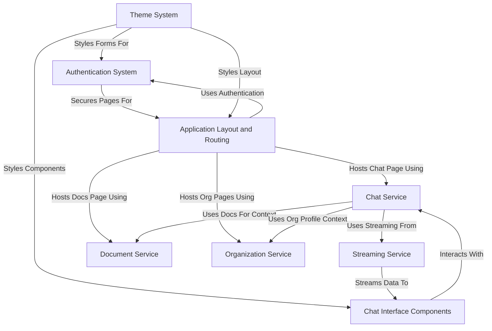
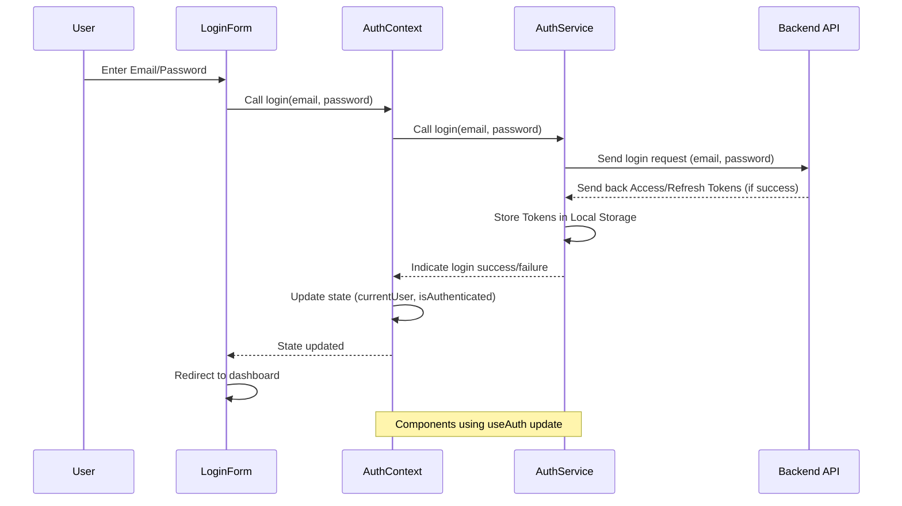
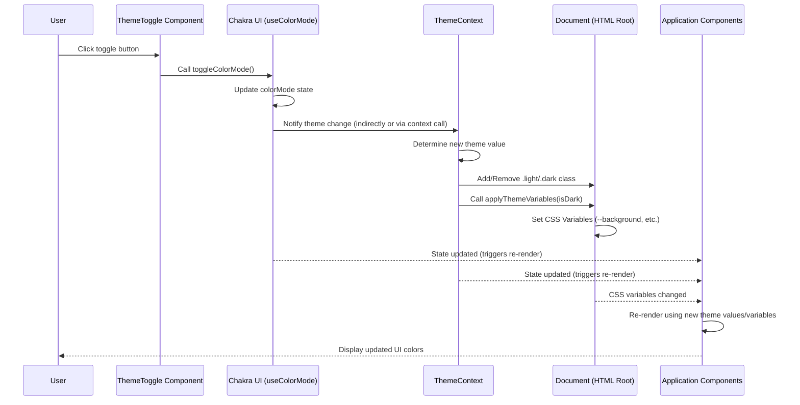
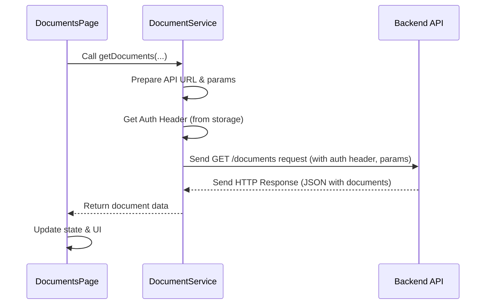
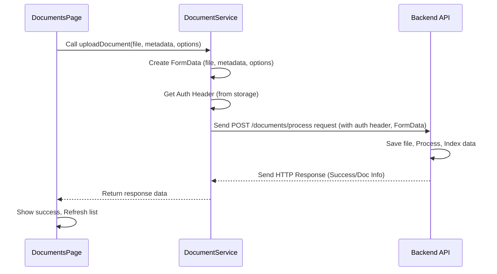
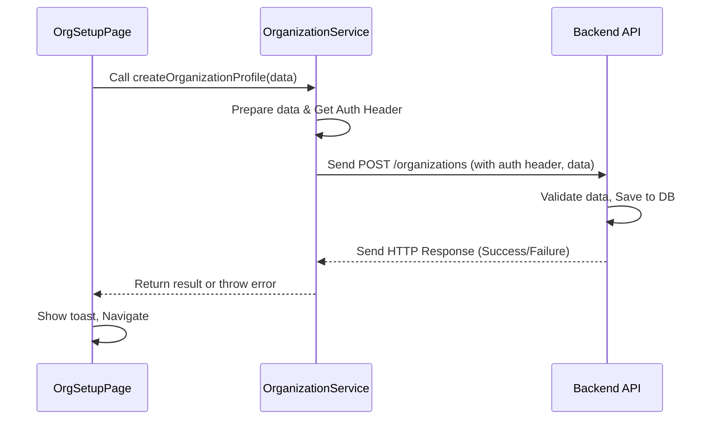
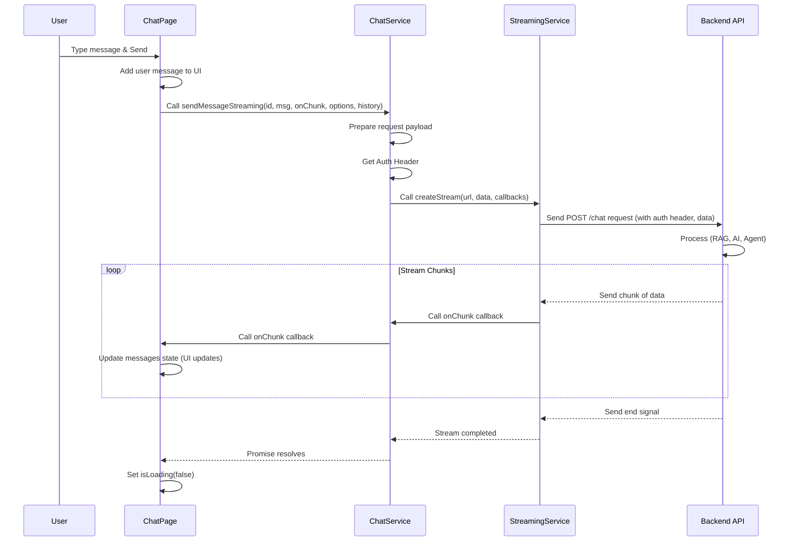
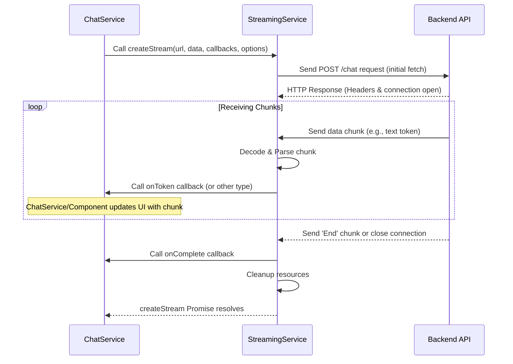
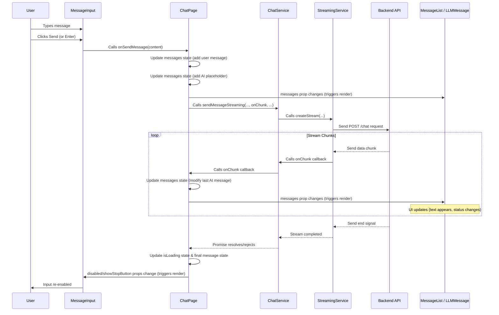

# Tutorial: RegulAIte front-end

RegulAIte is an **AI assistant** designed for **Governance, Risk, and Compliance (GRC)**.
It allows users to have *conversations* with an AI powered by their own documents,
upload and manage their organizational *knowledge base*, define their company's *profile*
for tailored AI responses, and provides a consistent user *interface* across the application.


## Visual Overview



## Chapters

1. [Authentication System
](#chapter-1-authentication-system)
2. [Application Layout and Routing
](#chapter-2-application-layout-and-routing)
3. [Theme System
](#chapter-3-theme-system)
4. [Document Service
](#chapter-4-document-service)
5. [Organization Service
](#chapter-5-organization-service)
6. [Chat Service
](#chapter-6-chat-service)
7. [Streaming Service
](#chapter-7-streaming-service)
8. [Chat Interface Components
](#chapter-8-chat-interface-components)

# Chapter 1: Authentication System

Welcome to the `regulaite` tutorial! In this first chapter, we're going to explore a fundamental concept in most web applications: the Authentication System. Think of it as the security guard for our application, making sure only the right people can get in and access specific areas.

## Why Do We Need an Authentication System?

Imagine you're building an online library application. Not everyone should be able to add new books or delete user accounts. Some parts are for everyone (like browsing the catalog), but other parts (like managing your borrowed books or accessing administrative tools) require you to prove who you are.

This is where an Authentication System comes in. Its job is to:

1.  **Identify Users:** Allow users to sign up (register) and then prove their identity when they return (login).
2.  **Control Access:** Based on who you are, it determines which parts of the application you're allowed to see or interact with.
3.  **Remember Who You Are:** Once you've logged in, the system needs a way to remember that you're authenticated as you move around the application, without asking for your password on every single page.

In `regulaite`, the Authentication System handles all of this, making it easy for other parts of the application to know who the current user is and whether they have permission to do something.

## Key Concepts

Let's break down the core ideas:

*   **User:** A person who wants to use the application. They have an account, usually identified by an email and password.
*   **Registration:** The process where a new user creates an account for the first time. They provide their information (like email, name, password).
*   **Login (Authentication):** The process where an existing user proves they are who they say they are, typically by entering their email and password. If successful, they are "authenticated".
*   **Tokens (Access Pass):** After logging in, the system gives the user some special credentials, often called "tokens." These are like temporary access passes. Instead of showing your ID (email/password) every time you enter a room, you just show your access pass (token). There are usually two types:
    *   **Access Token:** Your short-term pass to access protected resources.
    *   **Refresh Token:** A longer-term pass used to get a *new* access token when the old one expires, without needing to log in again with email/password.
*   **Protected Routes/Areas:** Parts of the application that you can only access if you are logged in (authenticated). Trying to access them without a valid token is like trying to enter a restricted area without your access pass – the security guard (the system) stops you.
*   **User Information:** Once logged in, the system often provides details about the user (like their name, email, or role) to different parts of the application that need it.

## How to Use the Authentication System

In `regulaite`, the Authentication System is primarily used through a feature called a "React Context". This is a standard React way to make data and functions available to many components in your application without passing them down manually through props.

The core interaction happens via the `useAuth` hook provided by the system. This hook gives components access to:

*   Functions for `login` and `register`.
*   Information about the `currentUser` (if any).
*   A way to check if the user `isAuthenticated`.
*   Loading and error states.

Let's look at how components use this:

### Registering a New User

When a user wants to create an account, they interact with a form. This form collects their details and then calls the `register` function from the `useAuth` hook.

Here's a simplified look at the `RegisterForm.jsx` component:

```jsx
import React, { useState } from 'react';
import { useNavigate } from 'react-router-dom';
// ... other imports from Chakra UI ...
import { useAuth } from '../../contexts/AuthContext'; // <-- Import the hook

const RegisterForm = () => {
  const [formData, setFormData] = useState({ /* ... */ });
  const [error, setError] = useState('');
  const [isLoading, setIsLoading] = useState(false);
  
  const { register } = useAuth(); // <-- Get the register function
  const navigate = useNavigate();

  const handleSubmit = async (e) => {
    e.preventDefault();
    setError('');
    setIsLoading(true);
    
    try {
      // Prepare user data from form state
      const userData = {
        email: formData.email,
        password: formData.password,
        full_name: formData.full_name,
        company: formData.company || undefined
      };
      
      await register(userData); // <-- Call the register function
      navigate('/login?registered=true'); // Redirect on success
    } catch (err) {
      // Handle registration errors
      setError(err.detail || 'Registration failed. Please try again.');
    . . .
    } finally {
      setIsLoading(false);
    }
  };

  return (
    // ... JSX for the registration form inputs and submit button ...
    <form onSubmit={handleSubmit}>
      {/* Form fields */}
      {/* Error display */}
      {/* Submit button */}
    </form>
    // ... rest of the component ...
  );
};

export default RegisterForm;
```

When the user submits the form, the `handleSubmit` function is called. It takes the data entered by the user and passes it to the `register` function provided by `useAuth`. If registration is successful, the application redirects the user, typically to the login page. If it fails (e.g., email already exists, password too weak), an error message is displayed.

### Logging In an Existing User

Similarly, for logging in, the `LoginForm.jsx` component collects the user's email and password and calls the `login` function from `useAuth`.

Here's a simplified snippet from `LoginForm.jsx`:

```jsx
import React, { useState } from 'react';
import { useNavigate } from 'react-router-dom';
// ... other imports ...
import { useAuth } from '../../contexts/AuthContext'; // <-- Import the hook

const LoginForm = () => {
  const [email, setEmail] = useState('');
  const [password, setPassword] = useState('');
  const [error, setError] = useState('');
  const [isLoading, setIsLoading] = useState(false);
  
  const { login } = useAuth(); // <-- Get the login function
  const navigate = useNavigate();

  const handleSubmit = async (e) => {
    e.preventDefault();
    setError('');
    setIsLoading(true);
    
    try {
      await login(email, password); // <-- Call the login function
      navigate('/'); // Redirect to dashboard on success
    } catch (err) {
      // Handle login errors
      setError(err.detail || 'Failed to login. Please check your credentials.');
    } finally {
      setIsLoading(false);
    }
  };

  return (
    // ... JSX for the login form inputs and submit button ...
     <form onSubmit={handleSubmit}>
      {/* Email input */}
      {/* Password input */}
      {/* Error display */}
      {/* Submit button */}
    </form>
    // ... rest of the component ...
  );
};

export default LoginForm;
```

The `handleSubmit` function calls `login(email, password)`. If the credentials are correct, the `useAuth` context handles storing the access tokens and marking the user as authenticated. The application then redirects the user to the main page (`/`). If login fails, an error is shown.

### Protecting Routes

To prevent unauthenticated users from accessing certain pages, `regulaite` uses a `ProtectedRoute.jsx` component, often configured in the application's routing setup.

Here's a look at `ProtectedRoute.jsx`:

```jsx
import React from 'react';
import { Navigate, Outlet } from 'react-router-dom';
import { useAuth } from '../../contexts/AuthContext'; // <-- Import the hook

const ProtectedRoute = () => {
  const { isAuthenticated, loading } = useAuth(); // <-- Get auth state and checker

  // Show loading state while checking auth status
  if (loading) {
    return <div>Loading...</div>; // Simplified loading indicator
  }
  
  // If not authenticated, redirect to login page
  if (!isAuthenticated()) {
    return <Navigate to="/login" replace />; // <-- Redirect if not authenticated
  }
  
  // If authenticated, render the child routes (the protected page)
  return <Outlet />; // <-- Allow access if authenticated
};

export default ProtectedRoute;
```

This component uses `isAuthenticated()` from `useAuth` to check the user's status. If `isAuthenticated()` returns `false`, it uses React Router's `Navigate` component to send the user to the `/login` page. Otherwise, it renders the content of the protected route (`<Outlet />`).

### Accessing User Information

Any component that needs to display information about the currently logged-in user can also use the `useAuth` hook to get the `currentUser` object.

See a simplified version of `UserProfile.jsx`:

```jsx
import React from 'react';
// ... other imports ...
import { useAuth } from '../../contexts/AuthContext'; // <-- Import the hook

const UserProfile = () => {
  const { currentUser } = useAuth(); // <-- Get the current user object

  // If no user is logged in, display a message
  if (!currentUser) {
    return <Box>No user information available</Box>;
  }

  // Extract user info from the currentUser object
  const userName = currentUser.full_name || currentUser.email || 'User';
  const userEmail = currentUser.email || 'No email provided';
  // ... other user details

  return (
    // ... JSX to display user info using userName, userEmail, etc. ...
    <Box>
        <Text fontWeight="bold">{userName}</Text>
        <Text>{userEmail}</Text>
        {/* Display other details */}
    </Box>
  );
};

export default UserProfile;
```

By calling `useAuth()`, the component gets the `currentUser` object, which contains the user's details retrieved after login (or from a stored token).

## Under the Hood: How it Works

Let's peek behind the curtain to understand the flow when a user logs in.

### The Login Flow (Step-by-Step)

1.  **User Enters Credentials:** The user types their email and password into the `LoginForm` component.
2.  **Form Calls Auth Context:** When the user clicks "Login", the `LoginForm` component calls the `login` function provided by the `useAuth` hook (which comes from the `AuthContext`).
3.  **Auth Context Calls Auth Service:** The `login` function inside the `AuthContext` doesn't talk directly to the backend. Instead, it calls a function in the `authService`. This service is specifically designed to handle communication with the backend API related to authentication.
4.  **Auth Service Talks to Backend API:** The `authService` makes an HTTP request to the backend's login endpoint, sending the email and password.
5.  **Backend Verification:** The backend receives the request, checks the database to see if a user with that email and password exists and is valid.
6.  **Backend Issues Tokens:** If the credentials are correct, the backend generates an **access token** and a **refresh token** and sends them back to the `authService`.
7.  **Auth Service Stores Tokens:** The `authService` receives the tokens and stores them securely (in the browser's `localStorage`). It might also decode the access token to quickly get basic user information.
8.  **Auth Context Updates State:** The `authService` signals back to the `AuthContext` that the login was successful. The `AuthContext` updates its internal state, setting `currentUser` to the logged-in user's data and `isAuthenticated` to true.
9.  **Components React:** Any component using the `useAuth` hook (like `LoginForm`, `ProtectedRoute`, `UserProfile`) automatically updates because the context's state has changed. The `LoginForm` might redirect, `ProtectedRoute` now allows access, and `UserProfile` displays the new `currentUser` information.

Here's a simple sequence diagram illustrating the login process:



### Code Details

Let's look at the code files that make this happen.

*   **`front-end/src/contexts/AuthContext.js`**: This file sets up the React Context. It holds the application's current authentication state (`currentUser`, `loading`, `error`). It provides the `register`, `login`, `logout`, and `isAuthenticated` functions via the `useAuth` hook.

```javascript
// front-end/src/contexts/AuthContext.js
import React, { createContext, useContext, useState, useEffect } from 'react';
import authService from '../services/authService'; // <-- Imports the service

const AuthContext = createContext(); // Create the context

export const AuthProvider = ({ children }) => {
  const [currentUser, setCurrentUser] = useState(null);
  const [loading, setLoading] = useState(true);
  // ... other state like error ...

  // Effect to check login status when app starts
  useEffect(() => {
    const loadUser = async () => {
      if (authService.isAuthenticated()) { // Check if tokens exist
        try {
          const userData = authService.getCurrentUserData(); // Get user data from stored token
          setCurrentUser(userData); // Set user state
        } catch (err) {
          console.error('Failed to load user from token:', err);
          authService.logout(); // Clear bad tokens if loading fails
        }
      }
      setLoading(false);
    };
    loadUser();
  }, []); // Run once on mount

  // Login function using authService
  const login = async (email, password) => {
    setLoading(true);
    try {
      await authService.login(email, password); // <-- Call the service
      const userData = authService.getCurrentUserData(); // Get updated user data
      setCurrentUser(userData); // Update context state
    } catch (err) {
      // Handle error
      throw err; // Rethrow for component
    } finally {
      setLoading(false);
    }
  };

  // Register function (similar structure)
  const register = async (userData) => {
     // ... calls authService.register ...
     // Does NOT set currentUser here, user needs to login after registering
     // ... error handling ...
  };

  // Value provided by the context
  const value = {
    currentUser,
    loading,
    login,
    register,
    logout: authService.logout, // Use logout directly from service
    isAuthenticated: authService.isAuthenticated, // Use checker directly
  };

  return <AuthContext.Provider value={value}>{children}</AuthContext.Provider>;
};

// Custom hook to easily access the context
export const useAuth = () => {
  const context = useContext(AuthContext);
  if (!context) {
    throw new Error('useAuth must be used within an AuthProvider');
  }
  return context;
};
```

This code sets up the `AuthProvider` component that wraps around the parts of your application that need access to authentication. It initializes by checking if a user is already logged in (from previous sessions using stored tokens). The `login` and `register` functions within the context act as the bridge, calling the actual logic implemented in `authService.js`.

*   **`front-end/src/services/authService.js`**: This file contains the core logic for interacting with the backend API. It handles sending login/register requests, receiving tokens, storing them, and adding the access token to future requests.

```javascript
// front-end/src/services/authService.js
import axios from "axios";
import { jwtDecode } from "jwt-decode"; // Helper to decode tokens

// Determine backend API URL (simplified)
const API_URL = process.env.REACT_APP_API_URL || 'http://localhost:8090';

// Create an Axios instance to make API calls
const api = axios.create({
  baseURL: API_URL,
  headers: { 'Content-Type': 'application/json' },
});

// Add an 'interceptor' to automatically add the token to requests
api.interceptors.request.use(
  (config) => {
    const token = localStorage.getItem('token'); // Get token from storage
    if (token) {
      config.headers['Authorization'] = `Bearer ${token}`; // Add token to headers
    }
    return config;
  },
  (error) => Promise.reject(error)
);

const authService = {
  // Register function: sends POST request to backend /auth/register
  register: async (userData) => {
    try {
      const response = await api.post('/auth/register', userData);
      return response.data;
    } catch (error) {
      throw error.response?.data || { detail: 'Registration failed' };
    }
  },

  // Login function: sends POST request to backend /auth/login
  login: async (email, password) => {
    try {
      // Data format needed for this specific backend endpoint
      const formData = new URLSearchParams();
      formData.append('username', email);
      formData.append('password', password);

      const response = await api.post('/auth/login', formData, {
        headers: { 'Content-Type': 'application/x-www-form-urlencoded' },
      });

      // Store tokens on successful login
      if (response.data.access_token) {
        localStorage.setItem('token', response.data.access_token);
        localStorage.setItem('refreshToken', response.data.refresh_token);
        // Decode and store user data from token payload
        try {
           const userData = jwtDecode(response.data.access_token);
           localStorage.setItem('userData', JSON.stringify(userData));
        } catch(e) { console.error("Failed to decode token:", e); }
      }
      return response.data;
    } catch (error) {
      throw error.response?.data || { detail: 'Login failed' };
    }
  },

  // Logout function: clears tokens from storage
  logout: () => {
    localStorage.removeItem('token');
    localStorage.removeItem('refreshToken');
    localStorage.removeItem('userData');
    // Optionally send a logout request to backend if needed
    // api.post('/auth/logout', { refresh_token: ... });
  },

   // Get user data from stored token
  getCurrentUserData: () => {
      const userDataString = localStorage.getItem('userData');
      if (userDataString) {
          return JSON.parse(userDataString);
      }
      // Fallback: Try decoding directly if userData wasn't stored
      const token = localStorage.getItem('token');
      if (token) {
          try { return jwtDecode(token); } catch(e) { return null; }
      }
      return null;
  },

  // Check if a token exists
  isAuthenticated: () => {
    return !!localStorage.getItem('token');
  },

  // ... other functions like refreshToken, getCurrentUser from API ...
};

export default authService;
```

This service uses the `axios` library to make HTTP requests. The `api.interceptors.request.use` part is clever: before sending *any* request using this `api` instance, it automatically checks `localStorage` for a token and adds it to the request headers if found. This means you don't have to manually add the token to every API call for protected resources! The `login` function specifically handles storing the tokens and some basic user data parsed from the token payload. The `isAuthenticated` function is a simple check if the `token` exists in storage.

In summary, the `AuthContext` manages the *state* and provides hooks for components, while the `authService` manages the *interaction* with the backend API and token storage.

## Conclusion

In this chapter, we learned about the Authentication System in `regulaite`. We saw how it acts as a security guard, managing user registration and login, and how it uses tokens as access passes. We explored how components like login/register forms, protected routes, and user profiles interact with this system using the `useAuth` hook. Finally, we got a brief look under the hood at how the `AuthContext` and `authService` work together to manage the authentication flow and store user tokens.


# Chapter 2: Application Layout and Routing

Welcome back! In [Chapter 1: Authentication System](#chapter-1-authentication-system), we learned how `regulaite` handles signing users up, logging them in, and keeping track of who they are. This is super important because it controls access to different parts of our application.

But now that we know *who* is using the app, how do we decide *what* they see and *how* they move between different screens or pages? That's where **Application Layout and Routing** comes in.

## Why Do We Need Layout and Routing?

Imagine our `regulaite` application is like a building with many rooms (pages) – a dashboard room, a chat room, a documents room, etc.

*   **Routing:** We need addresses (like room numbers or signs) so people can find the right room when they type in a specific URL (like typing `/chat` in the browser). Routing is the system that maps these addresses to the correct pages in our app.
*   **Layout:** Most buildings have common features on every floor or in every section – like hallways, maybe a lobby, or exit signs. In a web application, this is the "layout". It includes things like a consistent navigation bar at the top, maybe a sidebar, and a main area where the specific page content is displayed. We don't want to rebuild the navigation bar on *every single page*! The layout provides this consistent shell.
*   **Putting them together:** Our layout also needs to work with our [Authentication System](#chapter-1-authentication-system). Some "rooms" (like the login page) are open to everyone. Other "rooms" (like the dashboard or chat) are "protected" – you can only enter if you've shown your ID at the "security desk" (logged in). Our routing and layout system needs to enforce this.

In `regulaite`, this abstraction defines the overall structure of the application pages and how users navigate between them, ensuring a consistent look and controlling access based on authentication status. It's like the blueprint and navigation map for our app building.

## Key Concepts

Let's break down the essential ideas:

*   **Routes:** These are the "addresses" (URLs) in your application. For example, `/login`, `/dashboard`, `/chat`.
*   **Routing:** The process of matching a given URL to a specific component (a page) and displaying it. `regulaite` uses the popular `react-router-dom` library for this.
*   **Page Components:** These are the individual React components that represent the content of a specific page, like `DashboardPage.jsx` or `ChatPage.jsx`.
*   **Layout Component:** A special component (`Layout.jsx` in `regulaite`) that wraps around other page components. It contains elements that should appear on multiple pages (like the navigation bar) and provides the main structure.
*   **Protected Routes:** Routes that can only be accessed by authenticated users, integrating directly with the [Authentication System](#chapter-1-authentication-system).

## How to Use Layout and Routing

In `regulaite`, the main configuration for routing happens in the central `App.js` file. This file sets up the router and defines which path goes to which page component. It also applies the `Layout` component to routes that need the common structure and protection.

Let's look at the relevant parts of `front-end/src/App.js`:

```jsx
// front-end/src/App.js
import React from 'react';
import { BrowserRouter as Router, Routes, Route, Navigate } from 'react-router-dom';
// ... other imports like ChakraProvider, ThemeProvider, AuthProvider ...
import Layout from './components/layout/Layout'; // <-- Import the Layout component
// ... Import various page components like DashboardPage, ChatPage, etc. ...
import LoginPage from './pages/LoginPage'; // <-- Import specific login page
import RegisterPage from './pages/RegisterPage'; // <-- Import specific register page
// ... other imports ...

function App() {
  return (
    // ... Context Providers like ChakraProvider, ThemeProvider, AuthProvider ...
    <AuthProvider> {/* AuthProvider from Chapter 1 */}
      <Router> {/* This sets up the router */}
        <Routes> {/* This defines the list of possible paths */}
          
          {/* Public routes (NO Layout needed) */}
          <Route path="/login" element={<LoginPage />} />
          <Route path="/register" element={<RegisterPage />} />
          
          {/* Protected routes WITH Layout */}
          {/* Note: The protection logic is *inside* the Layout component */}
          <Route 
            path="/" // Path for the homepage
            element={
              <Layout> {/* Wrap the page component with Layout */}
                <DashboardPage /> 
              </Layout>
            } 
          />
          
          <Route 
            path="/dashboard" // Path for the dashboard
            element={
              <Layout> {/* Wrap the DashboardPage with Layout */}
                <DashboardPage /> 
              </Layout>
            } 
          />
          
          <Route 
            path="/chat" // Path for the chat page
            element={
              <Layout> {/* Wrap the ChatPage with Layout */}
                <ChatPage />
              </Layout>
            } 
          />
          
          {/* ... other protected routes like /documents, /organization wrapped similarly ... */}
          <Route 
            path="/documents" 
            element={
              <Layout>
                <DocumentsPage />
              </Layout>
            } 
          />

          <Route 
            path="/organization" 
            element={
              <Layout>
                <OrganizationPage />
              </Layout>
            } 
          />
           <Route 
            path="/organization/setup" 
            element={
              <Layout>
                <OrganizationSetupPage />
              </Layout>
            } 
          />
          
          {/* Fallback route: Redirect any unknown path to the homepage */}
          <Route path="*" element={<Navigate to="/" replace />} />
          
        </Routes>
      </Router>
    </AuthProvider>
    // ... closing Context Providers ...
  );
}

export default App;
```

**Explanation:**

1.  `BrowserRouter as Router`: This is the main routing component from `react-router-dom`. It keeps your UI in sync with the URL in the browser.
2.  `Routes`: This component looks through its `Route` children and renders the *first* one that matches the current URL.
3.  `Route`: This component links a specific `path` (URL) to a component that should be displayed (`element`).
4.  **Public Routes:** Notice `/login` and `/register`. Their `element` is just the page component (`<LoginPage />`, `<RegisterPage />`). These pages don't need the navigation bar or the layout structure, and they are intentionally *not* protected (because you need to access them to log in!).
5.  **Protected Routes with Layout:** For paths like `/`, `/dashboard`, `/chat`, `/documents`, etc., the `element` is `<Layout>...</Layout>`. This means whenever the user navigates to one of these paths, the `Layout` component is rendered, and the specific page component (like `<DashboardPage />`) is passed as its `children`.
6.  `Navigate`: This is used for redirecting. The `path="*"` route is a catch-all. If no other route matches, it redirects the user to `/` (`replace` prevents adding the bad path to browser history).

This setup effectively divides the application into two main sections: the public authentication pages and the protected, layout-wrapped main application pages.

## Under the Hood: How it Works

Let's follow what happens when you type `/chat` into the address bar after you've logged in:

1.  **Browser URL Change:** You change the URL to `/chat`.
2.  **`BrowserRouter` Detects:** The `BrowserRouter` in `App.js` notices the URL change.
3.  **`Routes` Finds Match:** The `Routes` component looks through its `Route` definitions. It finds the `Route` with `path="/chat"`.
4.  **`Route` Renders Element:** This `Route` tells React to render the element specified: `<Layout><ChatPage /></Layout>`.
5.  **`Layout` Component Runs:** The `Layout` component starts rendering.
6.  **`Layout` Checks Authentication:** Inside `Layout.jsx`, there's a check using `useAuth()` from our [Authentication System](#chapter-1-authentication-system): `isAuthenticated()`.
7.  **Authentication Success:** Since you are logged in, `isAuthenticated()` returns `true`.
8.  **`Layout` Renders Structure:** The `Layout` component proceeds to render its own structure:
    *   It renders the `Navbar` component (the consistent navigation bar).
    *   It renders the `children` it received, which in this case is the `<ChatPage />` component.
9.  **Page Content Displays:** The `<ChatPage />` component renders its specific content within the main area provided by the `Layout`.

If you weren't logged in when you tried to go to `/chat`:

1.  Steps 1-5 are the same (URL change -> Router -> Routes -> Match -> Render Layout).
2.  **`Layout` Checks Authentication:** Inside `Layout.jsx`, `isAuthenticated()` is called.
3.  **Authentication Failure:** Since you are *not* logged in, `isAuthenticated()` returns `false`.
4.  **`Layout` Redirects:** The `Layout` component sees you're not authenticated and renders a `<Navigate to="/login" replace />` component.
5.  **Router Navigates:** The `react-router-dom` system sees the `<Navigate />` component and changes the URL in the browser to `/login`, immediately rendering the `<LoginPage />` component instead. You are sent to the login page!

Here's a simplified flow diagram:

```mermaid
sequenceDiagram
    participant User
    participant Browser
    participant App.js (Router)
    participant Layout Component
    participant Specific Page (e.g., ChatPage)

    User->>Browser: Navigates to /chat
    Browser->>App.js (Router): URL Change
    App.js (Router)->>App.js (Router): Finds matching Route /chat
    App.js (Router)->>Layout Component: Renders <Layout><ChatPage/></Layout>
    Layout Component->>Layout Component: Checks isAuthenticated() (using useAuth)
    alt If Authenticated
        Layout Component->>Layout Component: Renders Navbar + children
        Layout Component->>Specific Page: Renders Specific Page component (ChatPage)
        Specific Page-->>Browser: Display page content
    else If NOT Authenticated
        Layout Component->>Browser: Renders <Navigate to="/login"/>
        Browser->>App.js (Router): URL Change to /login
        App.js (Router)->>App.js (Router): Finds matching Route /login
        App.js (Router)->>Specific Page: Renders LoginPage component
        Specific Page-->>Browser: Display Login Page
    end
```

## Code Details

Let's look closer at the `Layout.jsx` and `Navbar.jsx` components.

--- File: front-end/src/components/layout/Layout.jsx ---

```jsx
import React from 'react';
import { Navigate } from 'react-router-dom'; // <-- Used for redirecting
import { Box, Flex, Text, useColorModeValue } from '@chakra-ui/react';
import Navbar from './Navbar'; // <-- Imports the navigation bar
import { useAuth } from '../../contexts/AuthContext'; // <-- Imports auth hook from Chapter 1

const Layout = ({ children }) => {
  // ... theme and color hooks ...
  const bg = useColorModeValue('var(--chakra-colors-white)', 'var(--chakra-colors-gray-800)');
  const textColor = useColorModeValue('var(--chakra-colors-gray-800)', 'var(--chakra-colors-whiteAlpha-900)');
  
  const { isAuthenticated, loading } = useAuth(); // <-- Get auth status and loading state

  // If still checking auth status, show a loading message
  if (loading) {
    return (
      <Flex justify="center" align="center" minH="100vh" bg={bg}>
        <Text fontSize="lg">Loading...</Text>
      </Flex>
    );
  }
  
  // If NOT authenticated, redirect to the login page
  if (!isAuthenticated()) {
    return <Navigate to="/login" replace />; // <-- This triggers the redirect
  }

  // If authenticated, render the actual layout
  return (
    <Flex direction="column" minH="100vh" bg={bg} color={textColor}>
      <Navbar /> {/* The persistent navigation bar */}
      <Box as="main" flex="1">
        {children} {/* This is where the specific page content will render */}
      </Box>
      {/* Potential Footer component could go here */}
    </Flex>
  );
};

export default Layout;
```

**Explanation:**

*   `Layout` is a functional component that accepts `children` as a prop. These `children` are whatever components were placed inside `<Layout>` in `App.js` (e.g., `<DashboardPage />`, `<ChatPage />`).
*   It uses `useAuth()` to check the `loading` state (while auth status is being determined, perhaps on initial load) and `isAuthenticated()` (the actual check).
*   If `!isAuthenticated()`, it immediately returns `<Navigate to="/login" replace />`, stopping the rendering of the rest of the layout and redirecting the user.
*   If `isAuthenticated()`, it renders the main layout structure: a `Flex` container filling the screen, containing the `Navbar` at the top and a `Box` (`<Box as="main">`) that stretches to take up the remaining space (`flex="1"`). The `children` (the specific page) are rendered inside this main `Box`.

This means any page wrapped by `<Layout>` automatically gets the navigation bar and is protected by the authentication check.

--- File: front-end/src/components/layout/Navbar.jsx ---

```jsx
import React from 'react';
import { Link as RouterLink, useNavigate } from 'react-router-dom'; // <-- Use RouterLink for internal navigation
import { 
  Box, Flex, HStack, Text, Button, Link
} from '@chakra-ui/react';
import { useAuth } from '../../contexts/AuthContext'; // <-- Get auth info
import ThemeToggle from '../ui/ThemeToggle'; // <-- Theme switching component (Chapter 3)
import { useThemeColors } from '../../theme'; // <-- Helper for theme colors

const Navbar = () => {
  const { currentUser, isAuthenticated, logout } = useAuth(); // <-- Get user, auth status, logout function
  const navigate = useNavigate(); // <-- Hook to change routes programmatically
  // ... theme color setup ...
  const colors = useThemeColors();
  const accentColor = colors.primary; 

  const handleLogout = async () => {
    await logout(); // Call the logout function from AuthContext
    navigate('/login'); // Redirect to login after logging out
  };

  return (
    <Box as="nav" /* ... styling ... */>
      <Flex /* ... styling ... */>
        <Flex>
          {/* App Logo/Title - Link to homepage */}
          <Link as={RouterLink} to="/" /* ... styling ... */>
            <Text fontSize="xl" fontWeight="bold" color={accentColor}>
              RegulAIte
            </Text>
          </Link>
          
          {/* Navigation Links - Only show if authenticated */}
          {isAuthenticated() && (
            <HStack spacing={4} ml={10}>
              <Link as={RouterLink} to="/dashboard" /* ... styling ... */> Dashboard </Link>
              <Link as={RouterLink} to="/chat" /* ... styling ... */> Chat </Link>
              <Link as={RouterLink} to="/documents" /* ... styling ... */> Documents </Link>
              <Link as={RouterLink} to="/organization" /* ... styling ... */> Organization </Link>
            </HStack>
          )}
        </Flex>
        
        {/* Right side: Theme Toggle, User Info, Auth Buttons */}
        <Flex alignItems="center" gap={4}>
          <ThemeToggle /> {/* Component for switching themes */}
          
          {isAuthenticated() ? (
            // Show user name and logout button if authenticated
            <Flex alignItems="center" gap={4}>
              <Text fontSize="sm" /* ... styling ... */>
                {currentUser?.full_name || 'User'} {/* Display user's name or 'User' */}
              </Text>
              <Button size="sm" onClick={handleLogout}> Sign Out </Button>
            </Flex>
          ) : (
            // Show login and signup buttons if NOT authenticated
            <Flex alignItems="center" gap={4}>
              <Button as={RouterLink} to="/login" variant="ghost" size="sm"> Log in </Button>
              <Button as={RouterLink} to="/register" size="sm" bg={accentColor} /* ... styling ... */> Sign up </Button>
            </Flex>
          )}
        </Flex>
      </Flex>
    </Box>
  );
};

export default Navbar;
```

**Explanation:**

*   The `Navbar` component is included directly in the `Layout`.
*   It uses `useAuth()` to get the `currentUser` object, check `isAuthenticated()`, and access the `logout` function.
*   It uses `Link as={RouterLink}` from `react-router-dom` to create navigation links that change the application's route without causing a full page reload.
*   It conditionally renders parts of the navigation:
    *   The main navigation links (`Dashboard`, `Chat`, etc.) are only shown if `isAuthenticated()` is true.
    *   On the right side, it shows the user's name and a "Sign Out" button if authenticated, or "Log in" and "Sign up" buttons if not authenticated.
*   The `handleLogout` function calls `logout()` from the [Authentication System](#chapter-1-authentication-system) and then uses `navigate('/login')` to redirect the user to the login page.

--- File: front-end/src/pages/LoginPage.jsx ---

```jsx
import React, { useEffect } from 'react';
import { useNavigate, useLocation } from 'react-router-dom'; // <-- Navigation and location hooks
import { Box, Container, Center, Alert, AlertIcon, useColorModeValue } from '@chakra-ui/react';
import LoginForm from '../components/auth/LoginForm'; // <-- The actual login form component
import { useAuth } from '../contexts/AuthContext'; // <-- Auth hook

const LoginPage = () => {
  const { isAuthenticated } = useAuth(); // <-- Check auth status
  const navigate = useNavigate();
  const location = useLocation();
  // ... color mode hook ...

  // Redirect if already logged in
  useEffect(() => {
    if (isAuthenticated()) {
      navigate('/'); // If logged in, go to homepage (which is protected by Layout)
    }
  }, [isAuthenticated, navigate]); // Rerun this effect if isAuthenticated or navigate change

  return (
    <Box minH="100vh" /* ... styling ... */>
      {/* Optional: Show success message after registration */}
      {/* This checks if the URL has ?registered=true */}
      {new URLSearchParams(location.search).get('registered') === 'true' && (
        <Alert status="success" /* ... styling ... */>
          <AlertIcon />
          Registration successful! Please log in with your credentials.
        </Alert>
      )}
      <Container /* ... styling ... */>
        <Center>
          <LoginForm /> {/* Renders the actual login form */}
        </Center>
      </Container>
    </Box>
  );
};

export default LoginPage;
```

**Explanation:**

*   The `LoginPage` component does *not* use the `Layout`. It's a standalone page.
*   It uses `useEffect` and `useAuth()` to check if the user somehow landed on the login page while *already* authenticated. If they are, it immediately navigates them to the homepage (`/`).
*   It includes the actual `LoginForm` component we discussed in [Chapter 1: Authentication System](#chapter-1-authentication-system).

The `RegisterPage.jsx` component works in a very similar way, also checking if the user is already authenticated and redirecting them to the homepage if so.

## Conclusion

In this chapter, we've explored how `regulaite` structures its pages using **Application Layout and Routing**. We saw how `react-router-dom` maps URLs to specific components in `App.js`. We learned about the `Layout` component, which provides a consistent visual shell (like the `Navbar`) and crucially, integrates with the [Authentication System](#chapter-1-authentication-system) to protect routes and redirect unauthenticated users. We also saw how public pages like Login and Register are handled separately without the main layout.

Understanding how routing directs users and how the layout provides structure and protection is key to navigating and building upon the `regulaite` application.


# Chapter 3: Theme System

Welcome back! In [Chapter 1: Authentication System](#chapter-1-authentication-system), we secured our application, and in [Chapter 2: Application Layout and Routing](#chapter-2-application-layout-and-routing), we organized our pages and navigation. Now that we know *who* is using the app and *how* they move around, let's talk about making it look good and feel comfortable for them.

This is where the **Theme System** comes in.

## Why Do We Need a Theme System?

Imagine building a website where every button, every text color, and every background is styled individually, directly in each component. What happens if your client suddenly says, "Hey, can we change our main brand color from purple to blue everywhere?" Or if users start requesting a "dark mode" because the bright screen is hard on their eyes at night?

Making those changes manually across potentially hundreds of components would be a huge, error-prone task!

A **Theme System** solves this by centralizing all visual design decisions. Think of it as the interior designer for our application:

*   It defines a consistent set of **colors**, **fonts**, and **spacing** rules.
*   It ensures all components that need a "primary button" or "secondary text color" use the *same* defined style from the theme.
*   It makes it easy to switch between different visual modes, like **light mode** and **dark mode**, by simply changing the underlying set of colors and styles.

In `regulaite`, the Theme System uses a combination of the powerful styling library **Chakra UI** and standard **CSS variables** to provide consistent styling and support light/dark mode toggling. It allows us to make sweeping visual changes or add features like dark mode with minimal effort across the application.

The central use case we'll focus on in this chapter is **implementing and managing light/dark mode**.

## Key Concepts

Let's break down the core ideas behind `regulaite`'s theme system:

| Concept            | Description                                                                 | Analogy                                     |
| :----------------- | :-------------------------------------------------------------------------- | :------------------------------------------ |
| **Theme**          | A complete set of styling rules (colors, fonts, etc.).                      | A design stylebook (e.g., "Modern" or "Classic"). |
| **Color Palette**  | A specific collection of colors defined for the application.              | A paint sample card with chosen colors.     |
| **Typography**     | Rules for how text looks (fonts, sizes, weights).                         | Choosing specific fonts and text styles.    |
| **Chakra UI**      | A React component library that provides pre-built, accessible components with strong theme support. | A set of pre-made furniture pieces that follow the stylebook. |
| **CSS Variables**  | Custom properties in CSS that store values (like colors) that can be reused and easily changed. | Naming paint colors so you can say "use 'Wall White'" instead of the hex code. |
| **Light/Dark Mode**| Different sets of theme values (especially colors) optimized for bright or dim environments. | Having a daytime look and a nighttime look for a room. |

`regulaite` uses Chakra UI for most component styling, but also implements its own CSS variables, particularly for integrating with Tailwind CSS (another styling utility) and providing global color access.

## How to Use the Theme System

The most common way components interact with the Theme System is by accessing the defined colors and applying them. Chakra UI makes this easy using theme-aware props, and `regulaite` provides custom hooks for specific color groups.

### Using Theme Colors in Components

Chakra UI components automatically pick up colors defined in the theme configuration (`theme/themeConfig.js`). You can use shorthand props like `bg` (background), `color` (text color), `borderColor`, etc., with theme color names.

For colors defined in `theme/colors.js`, like the brand colors or UI colors, `regulaite` provides helper hooks. The `useThemeColors` hook is particularly useful.

Let's look at a simplified example of a button that uses the primary brand color and the text color:

```jsx
// ExampleComponent.jsx
import React from 'react';
import { Button, Box, Text } from '@chakra-ui/react';
import { useThemeColors } from '../theme'; // <-- Import the hook

const ExampleComponent = () => {
  const colors = useThemeColors(); // <-- Get access to themed colors

  // The 'primary' color from useThemeColors comes from brandColors.primary
  // and is applied via CSS variables.
  // The 'text' color is mapped via useColorModeValue in the hook.

  return (
    <Box bg={colors.background} p={4} borderRadius="md">
      <Text color={colors.text} mb={2}>
        This text uses the theme's main text color.
      </Text>
      <Button bg={colors.primary} color="white" _hover={{ bg: colors.primaryHover }}> {/* Use themed colors */}
        Primary Button
      </Button>
      {/* Chakra UI props automatically use theme colors */}
      <Button mt={2} variant="outline" colorScheme="purple"> {/* Use Chakra UI color scheme */}
        Chakra Outline Button
      </Button>
    </Box>
  );
};

export default ExampleComponent;
```

**Explanation:**

*   We import `useThemeColors` from `../theme`.
*   Calling `const colors = useThemeColors()` gives us an object (`colors`) containing the theme-defined colors, automatically adjusted for the current light or dark mode.
*   We then use properties from this `colors` object (e.g., `colors.background`, `colors.text`, `colors.primary`, `colors.primaryHover`) for our component's styling props.
*   We also show a standard Chakra UI button using `colorScheme="purple"`. Chakra UI maps these scheme names to colors defined in the theme configuration (`theme/themeConfig.js`, which includes a 'brand' color definition).

Using these theme-aware hooks and Chakra props ensures that when the theme changes (e.g., to dark mode), the colors used by this component automatically update without requiring any code changes inside `ExampleComponent.jsx`.

### Switching Themes (Light/Dark Mode Toggle)

The primary way users interact with the Theme System's light/dark mode feature is through a toggle control. `regulaite` provides a `ThemeToggle` component for this, often placed in the `Navbar`.

Let's look at the `ThemeToggle` component:

```jsx
// front-end/src/components/ui/ThemeToggle.jsx
import React from 'react';
import { IconButton, useColorMode } from '@chakra-ui/react'; // <-- Chakra hook for color mode
import { SunIcon, MoonIcon } from '@chakra-ui/icons'; // <-- Icons

const ThemeToggle = () => {
  const { colorMode, toggleColorMode } = useColorMode(); // <-- Get current mode and toggle function

  return (
    <IconButton
      aria-label="Toggle theme" // Accessibility label
      icon={colorMode === 'light' ? <MoonIcon /> : <SunIcon />} // Show moon in light, sun in dark
      onClick={toggleColorMode} // <-- Call Chakra's toggle function on click
      size="md"
      variant="ghost"
    />
  );
};

export default ThemeToggle;
```

**Explanation:**

*   This component uses the `useColorMode` hook provided by Chakra UI.
*   `colorMode` tells us the current mode ('light' or 'dark').
*   `toggleColorMode` is a function that switches between 'light' and 'dark' modes.
*   The `IconButton` displays a different icon based on the current `colorMode` and calls `toggleColorMode` when clicked.

When `toggleColorMode` is called, Chakra UI handles updating its internal state, which in turn causes Chakra components to re-render with the correct colors based on the current mode. Additionally, `regulaite`'s custom theme logic (handled in `ThemeContext`) also listens for this change or the underlying system preference to apply the custom CSS variables.

## Under the Hood: How it Works

Let's trace what happens when you click the `ThemeToggle` button.

1.  **User Clicks Toggle:** The user clicks the `IconButton` in the `ThemeToggle` component.
2.  **`toggleColorMode` Called:** The button's `onClick` handler calls Chakra UI's `toggleColorMode()` function.
3.  **Chakra UI Updates Internal State:** Chakra UI changes its internal state tracking the `colorMode` from 'light' to 'dark' (or vice-versa).
4.  **ThemeContext Reacts:** The `ThemeContext` (where our custom theme logic lives) is set up in `App.js` using `useSystemColorMode: true`. This allows it to potentially react to *system* preference changes, but our `ThemeToggle` directly triggers the change managed by Chakra and our custom context. When the state changes, the `useEffect` in `ThemeContext.js` is triggered or a specific `setThemeValue` (called by `applyTheme` which is triggered by `setThemeValue`) is invoked.
5.  **`applyTheme` Logic Runs:** Inside `ThemeContext.js`, the `applyTheme` function is called with the new theme preference ('light' or 'dark', or 'system').
6.  **Root Element Classes Updated:** `applyTheme` adds or removes the `.light` or `.dark` CSS class on the `<html>` element (the document root).
7.  **CSS Variables Applied:** `applyTheme` calls `applyThemeVariables(isDark)`, which iterates through the relevant color definitions from `theme/colors.js` (either `lightThemeColors.cssVariables` or `darkThemeColors.cssVariables`) and sets these values as CSS variables on the `:root` element (e.g., `--background: ...; --text: ...;`).
8.  **Chakra Components Update:** Components using Chakra UI props (like `bg="gray.100"`) automatically re-render because Chakra's theme state changed, picking up the correct 'gray.100' value for the new color mode.
9.  **Custom Hooks Update:** Components using hooks like `useThemeColors` also re-render. The `useColorModeValue` hook (used extensively within `useThemeColors.js`) now returns the color value corresponding to the *new* current mode.
10. **CSS Rules React:** Any custom CSS rules in files like `globals.css` or `chat.css` that use the CSS variables (e.g., `background: var(--background);`) automatically pick up the new variable values.

Here's a simplified sequence diagram for the theme switch:



## Code Details

Let's look at the key files that make this work.

--- File: front-end/src/contexts/ThemeContext.js ---
(Simplified to show the core logic)

```javascript
// front-end/src/contexts/ThemeContext.js
"use client" // Needed for Next.js App Router, can ignore for plain React

import { createContext, useContext, useEffect, useState } from 'react';
import { applyThemeVariables } from '../theme'; // <-- Utility to set CSS variables

const ThemeContext = createContext();

export function ThemeProvider({ children, defaultTheme = 'system', enableSystem = true }) {
  const [theme, setTheme] = useState(defaultTheme);

  // This effect runs once on mount and whenever enableSystem/defaultTheme change
  // It reads saved theme from localStorage and sets up system preference listener
  useEffect(() => {
    const savedTheme = localStorage.getItem('theme') || defaultTheme;
    setTheme(savedTheme);
    applyTheme(savedTheme); // <-- Apply theme on initial load

    if (enableSystem && typeof window !== 'undefined') { // Check for browser environment
      const mediaQuery = window.matchMedia('(prefers-color-scheme: dark)');
      const handleChange = () => {
        // If the user preference is 'system', re-apply theme based on system change
        if (localStorage.getItem('theme') === 'system') {
             applyTheme('system');
        }
      };
      mediaQuery.addEventListener('change', handleChange);
      return () => mediaQuery.removeEventListener('change', handleChange);
    }
  }, [enableSystem, defaultTheme]); // Added 'theme' to dependencies to correctly re-apply if theme state changes internally

  // Function to apply the theme (updates state, adds classes, sets variables)
  const applyTheme = (newTheme) => {
    if (typeof document === 'undefined') return; // Check for browser environment

    const root = document.documentElement;
    const isDark =
      newTheme === 'dark' ||
      (newTheme === 'system' && window.matchMedia('(prefers-color-scheme: dark)').matches);

    // Remove existing theme classes
    root.classList.remove('light', 'dark');
    // Add the new class
    root.classList.add(isDark ? 'dark' : 'light');

    // Apply the corresponding CSS variables
    applyThemeVariables(isDark); // <-- Calls the utility function

    // Store user preference unless it's 'system'
    localStorage.setItem('theme', newTheme); // Always store the requested theme
  };

  // The function components will call to change the theme
  const setThemeValue = (newTheme) => {
    setTheme(newTheme); // Update React state
    applyTheme(newTheme); // Apply the theme changes to the DOM/CSS variables
  };
  
  // Rerun applyTheme whenever the 'theme' state changes
  useEffect(() => {
      applyTheme(theme);
  }, [theme]);


  return (
    <ThemeContext.Provider value={{ theme, setTheme: setThemeValue }}>
      {children}
    </ThemeContext.Provider>
  );
}

export function useTheme() {
  const context = useContext(ThemeContext);
  if (context === undefined) {
    throw new Error('useTheme must be used within a ThemeProvider');
  }
  return context;
}
```

**Explanation:**

*   `ThemeProvider` wraps the application (usually in `App.js`).
*   It uses `useState` to hold the currently active `theme` ('light', 'dark', or 'system').
*   The first `useEffect` loads the saved theme from `localStorage` on startup and sets up a listener for system preference changes if `enableSystem` is true.
*   The `applyTheme` function is the core logic. It determines if dark mode is active, adds the correct class (`.light` or `.dark`) to the `<html>` element, and calls `applyThemeVariables` to set the CSS custom properties.
*   `setThemeValue` is the function exposed via the context that components can call to change the theme. It updates the state and triggers `applyTheme`.
*   The second `useEffect` ensures that whenever the internal `theme` state is updated (either by `setThemeValue` or the initial load), `applyTheme` is called to synchronize the DOM.
*   `useTheme` is the custom hook that components use to access the `theme` value and the `setTheme` function (aliased to `setThemeValue`).

--- File: front-end/src/theme/index.js ---
(Simplified to show `applyThemeVariables`)

```javascript
// front-end/src/theme/index.js
// ... other imports and exports ...

import { cssVariables } from './themeConfig'; // <-- Imports the CSS variable map

// Utility function to apply CSS variables to the document root
export const applyThemeVariables = (isDark = false) => {
  if (typeof document === 'undefined') return; // Check for browser environment
  const root = document.documentElement;
  const variables = isDark ? cssVariables.dark : cssVariables.light; // <-- Select variables based on mode

  // Loop through the variable map and set properties on :root
  Object.entries(variables).forEach(([key, value]) => {
    root.style.setProperty(key, value);
  });
};

// ... rest of the exports (useThemeColors, etc.) ...
export { useTheme } from '../contexts/ThemeContext';
```

**Explanation:**

*   This file provides the `applyThemeVariables` function, which is called by `ThemeContext`.
*   It accesses the `cssVariables` object from `themeConfig.js`, which holds a map of variable names (`--background`, `--text`, etc.) to their corresponding values for both light and dark modes.
*   It gets the root HTML element (`document.documentElement`).
*   It loops through the selected variables (light or dark) and uses `element.style.setProperty` to set each CSS variable on the `:root` element.

--- File: front-end/src/theme/themeConfig.js ---
(Simplified to show Chakra theme setup and CSS variables)

```javascript
// front-end/src/theme/themeConfig.js
import { extendTheme } from '@chakra-ui/react';
import { brandColors, lightThemeColors, darkThemeColors } from './colors'; // <-- Imports color definitions

/**
 * CSS variables that need to be applied to :root.
 * These map our named colors to standard CSS custom properties.
 * Used by raw CSS, Tailwind CSS, and potentially some Chakra components.
 */
export const cssVariables = {
  light: {
    // Examples:
    '--background': lightThemeColors.cssVariables['--background'], // Using HSL format here
    '--foreground': lightThemeColors.cssVariables['--foreground'],
    '--brand-primary': brandColors.primary, // Using hex/rgba here
    '--brand-primary-hover': brandColors.primaryHover,
    // ... many more variables ...
  },
  dark: {
    // Examples:
    '--background': darkThemeColors.cssVariables['--background'],
    '--foreground': darkThemeColors.cssVariables['--foreground'],
    '--brand-primary': brandColors.primaryDark, // Maybe a slightly different shade for dark mode
    '--brand-primary-hover': brandColors.primaryDark, // Use dark mode hover color
    // ... many more variables ...
  }
};

/**
 * Create a Chakra UI compatible theme object
 * This merges Chakra's default theme with our customizations.
 */
export const createChakraTheme = () => {
  return extendTheme({
    config: {
      initialColorMode: 'light',
      useSystemColorMode: true, // <-- Allows Chakra to respect OS preference
    },
    colors: {
      brand: { // Define a 'brand' color scheme for Chakra components
        50: '#f0ebfa', // Example shades
        100: '#d2c5f0',
        // ... other shades ...
        700: brandColors.primary, // Map a shade to our primary brand color
        800: brandColors.primaryHover, // Map another shade for hover
        900: brandColors.primaryDark, // Map another shade for dark mode primary
      },
      // You can map specific colors directly here for Chakra to use
      // error: 'red.500' // Example of mapping a semantic color
    },
    styles: {
      global: (props) => ({ // Global styles that depend on color mode
        body: {
          // Background and text colors for the body based on Chakra's internal colorMode
          bg: props.colorMode === 'dark' ? darkThemeColors.background : lightThemeColors.background,
          color: props.colorMode === 'dark' ? darkThemeColors.text : lightThemeColors.text,
        },
      }),
    },
    components: {
      // Customize how Chakra components look based on the theme/color mode
      Button: {
        variants: {
          primary: (props) => ({ // Custom button variant using our brand colors
            bg: brandColors.primary,
            color: 'white',
            _hover: {
              bg: props.colorMode === 'dark' ? 'brand.600' : brandColors.primaryHover,
            },
            // ... other states
          }),
          // ... other variants
        },
      },
      // ... other component customizations
    },
  });
};

export const chakraTheme = createChakraTheme();
```

**Explanation:**

*   `cssVariables` maps the color names we use in `colors.js` to standard CSS variable names (`--background`, `--brand-primary`, etc.). This allows raw CSS or other libraries (like Tailwind) to pick up the themed colors.
*   `createChakraTheme` uses Chakra UI's `extendTheme` to create a custom theme object.
*   `config` sets initial color mode preferences for Chakra.
*   `colors.brand` defines a custom color scheme named 'brand' that Chakra components can use (e.g., `colorScheme="brand"`). We map our specific `brandColors` (like `primary`, `primaryHover`) to shades within this scheme.
*   `styles.global` allows defining global CSS rules that can change based on Chakra's `colorMode` prop. This is where the main body background and text colors are often set.
*   `components` allows overriding or extending the default styles of Chakra components (like `Button`), enabling customization based on `colorMode`.

--- File: front-end/src/theme/useThemeColors.js ---
(Simplified to show how `useColorModeValue` works)

```javascript
// front-end/src/theme/useThemeColors.js
import { useColorModeValue } from '@chakra-ui/react'; // <-- Chakra hook
import { lightThemeColors, darkThemeColors, brandColors, chartColors, semanticColors } from './colors'; // <-- Color definitions

/**
 * Hook for common UI color needs
 * Provides color values based on current color mode
 */
export const useThemeColors = () => {
  // Example: Get background color
  // useColorModeValue('value-for-light-mode', 'value-for-dark-mode')
  const background = useColorModeValue(lightThemeColors.background, darkThemeColors.background);

  // Example: Get text color
  const text = useColorModeValue(lightThemeColors.text, darkThemeColors.text);

  // Example: Get primary brand color - derived from brandColors, but potentially used differently in light/dark
  // Note: Often primary is also exposed via Chakra color scheme 'brand'
  const primary = useColorModeValue(brandColors.primary, brandColors.primaryDark); // Pick appropriate shade

  // Example: Semantic error color
  const error = useColorModeValue(semanticColors.error.light, semanticColors.error.dark);

  return {
    background,
    text,
    primary,
    error,
    // ... return all other themed colors similarly ...
  };
};

// ... other hooks like useBrandColors, useChartColors, useSemanticColors ...
```

**Explanation:**

*   `useThemeColors` (and other custom color hooks) use Chakra UI's `useColorModeValue` hook.
*   `useColorModeValue(lightValue, darkValue)` takes two arguments: the value to use in light mode and the value to use in dark mode.
*   When the component renders, `useColorModeValue` automatically checks the current `colorMode` (managed by Chakra UI) and returns the correct value.
*   This makes it easy for components to get the right color without manual checks (`if (colorMode === 'dark')`).

--- File: front-end/src/theme/globals.css ---

```css
/**
 * Global CSS variables for the theme
 * These variables are set on :root by applyThemeVariables
 */

/* Light theme variables (default) */
:root {
  /* Example variables */
  --background: 0 0% 100%; /* HSL format for Tailwind integration */
  --foreground: 240 10% 3.9%;
  --brand-primary: #4415b6; /* Hex/RGBA format */
  --brand-primary-hover: #3a1296;
  /* ... other light theme variables ... */
}

/* Dark theme variables - applied when the .dark class is on the root */
.dark {
  /* Example variables */
  --background: 240 10% 3.9%;
  --foreground: 0 0% 98%;
  --brand-primary: #6c45e7; /* Dark mode primary might be different */
  --brand-primary-hover: #7d5df5;
  /* ... other dark theme variables ... */
}

/* You can use these variables directly in other CSS files */
/* For example, in front-end/src/styles/chat.css: */
/* .user-message-tail::before { border-left: 8px solid var(--brand-primary); } */
```

**Explanation:**

*   This CSS file defines the CSS variables (`--variable-name`).
*   The values in the `:root` block apply by default (or when the `.light` class is present).
*   The values inside the `.dark` rule override the `:root` values *only* when the `<html>` element has the `.dark` class.
*   The `applyThemeVariables` function (called by `ThemeContext`) is responsible for adding the `.light` or `.dark` class to the `<html>` element and setting the variable values based on the current theme.

This layered approach – using Chakra UI for components, custom hooks (`useThemeColors`) for easier access to common colors, and CSS variables for global styles and dark mode switching – provides a flexible and robust theme system for `regulaite`.

## Conclusion

In this chapter, we explored the **Theme System** in `regulaite`. We learned how it centralizes visual styling, making the application look consistent and enabling features like light/dark mode. We saw how components can easily use theme colors via Chakra UI props and custom hooks like `useThemeColors`, and how the `ThemeToggle` component allows users to switch modes. Finally, we looked under the hood at how the `ThemeContext`, `applyThemeVariables`, and `globals.css` work together to manage theme state, apply CSS variables, and enable the seamless transition between light and dark modes.

Understanding the Theme System is key to customizing the application's look and feel and building new components that fit within the overall design.

# Chapter 4: Document Service

Welcome back! So far, we've built a strong foundation for our `regulaite` application. In [Chapter 1: Authentication System](#chapter-1-authentication-system), we established who can use the app. In [Chapter 2: Application Layout and Routing](#chapter-2-application-layout-and-routing), we learned how users navigate through the app's structure and how we protect certain areas. And in [Chapter 3: Theme System](#chapter-3-theme-system), we made sure the app looks great and is comfortable to use, even allowing for light and dark modes.

Now that we have a secure, well-structured, and good-looking place for users, it's time to talk about the *content* itself – the core knowledge base that `regulaite` is built around: your organization's regulatory documents.

## Why Do We Need a Document Service?

Imagine `regulaite` is like a specialized library for compliance information. The "books" in this library are your documents (PDFs, DOCX files, etc.). To make this library useful, you need ways to:

1.  **Add new books:** Upload new documents.
2.  **Find existing books:** Search and list documents.
3.  **Remove old or incorrect books:** Delete documents.
4.  **Understand the collection:** Get statistics about the types and number of documents you have.

Doing these actions directly from every part of your application that might need them (like a dashboard, a search page, or a chat interface) would be messy and repetitive. This is where the **Document Service** comes in.

The Document Service acts like the main librarian for our application. It's a dedicated set of tools whose *only* job is to manage the interaction with the backend system for document-related tasks. It knows how to talk to the backend API to handle all document operations, so other parts of the application don't need to worry about the technical details of making API requests.

The central use case we'll explore is how a user can **view a list of uploaded documents** and **upload a new document** through the application interface.

## Key Concepts

Let's break down the ideas behind the Document Service:

| Concept              | Description                                                                      | Analogy                                           |
| :------------------- | :------------------------------------------------------------------------------- | :------------------------------------------------ |
| **Document Service** | A module containing functions for all document-related interactions with the backend API. | The main librarian desk with specific procedures. |
| **Backend API**      | The server-side system that actually stores documents, runs searches, etc.       | The library's back office and storage shelves.      |
| **Endpoints**        | Specific URLs the service talks to for different actions (e.g., `/documents`, `/documents/upload`). | Different windows or departments in the library office (e.g., "Uploads Here", "Ask for Stats"). |
| **API Call**         | Sending a request from the frontend service to a backend endpoint.               | A form or request slip you give to the librarian. |
| **Response**         | The data or confirmation sent back by the backend API.                           | The result the librarian gives you (the book, the stats report, confirmation). |
| **Data Model**       | The structure of information about a document (ID, name, type, size, etc.).      | The information on the book's catalog card.       |

The Document Service provides a clean, reusable interface for any part of the frontend application that needs to do something with documents.

## How to Use the Document Service

Components in `regulaite`, particularly the `DocumentsPage.jsx`, use the Document Service by calling its exported functions. Let's look at how the `DocumentsPage` component would fetch and display the list of documents.

### Fetching and Displaying Documents

The `DocumentsPage.jsx` needs to load the list of documents when it first appears and whenever filters or search terms change. It uses the `useEffect` hook and calls the `getDocuments` function from the Document Service.

Here's a simplified look at how `DocumentsPage.jsx` might fetch documents:

```jsx
// front-end/src/pages/DocumentsPage.jsx (Simplified)
import React, { useState, useEffect } from 'react';
import { Box, Text, Spinner } from '@chakra-ui/react';
// ... other Chakra imports
import { getDocuments } from '../services/documentService'; // <-- Import the service function

const DocumentsPage = () => {
  const [documents, setDocuments] = useState([]);
  const [loading, setLoading] = useState(true);
  // ... other state like filters, search term ...

  useEffect(() => {
    const fetchDocuments = async () => {
      try {
        setLoading(true);
        // Call the getDocuments function from the service
        const result = await getDocuments(
          10, // limit
          0,  // offset
          'created', // sortBy
          'desc', // sortOrder
          { search: '', fileType: '' } // example filters/search
        );
        
        // The service returns data, update the component's state
        setDocuments(result.documents || []);
        // ... update pagination totalCount ...
      } catch (error) {
        console.error('Error fetching documents:', error);
        // ... show error toast ...
      } finally {
        setLoading(false);
      }
    };

    fetchDocuments(); // Call the fetch function when component mounts or dependencies change
  }, [/* pagination.offset, filters, searchTerm */]); // Dependencies for useEffect

  // ... JSX to render the document list ...
  if (loading) {
    return <Spinner />; // Show spinner while loading
  }

  return (
    <Box>
      <Text>Your Documents:</Text>
      {/* Map over 'documents' state to display them */}
      {documents.map(doc => (
        <Box key={doc.doc_id}>{doc.title || doc.name}</Box>
      ))}
    </Box>
  );
};

export default DocumentsPage;
```

**Explanation:**

*   The `getDocuments` function is imported from `documentService.js`.
*   Inside a `useEffect` hook, an `async` function `fetchDocuments` is defined. This function is called when the component mounts and whenever its dependencies change (like page number or filters).
*   `fetchDocuments` calls `await getDocuments(...)` with parameters for pagination and filtering.
*   The result from the service call is then used to update the component's `documents` state using `setDocuments`.
*   The component's JSX uses the `documents` state to render the list.

### Uploading a New Document

The `DocumentsPage.jsx` also contains a modal (a pop-up window) with a form for uploading a new file. When the user selects a file and fills in metadata, the component calls the `uploadDocument` function from the service.

Here's a simplified look at the upload handler in `DocumentsPage.jsx`:

```jsx
// front-end/src/pages/DocumentsPage.jsx (Simplified Upload Logic)
import React, { useState } from 'react';
// ... other imports ...
import { uploadDocument } from '../services/documentService'; // <-- Import the service function

const DocumentsPage = () => {
  const [file, setFile] = useState(null);
  const [metadata, setMetadata] = useState({ title: '' });
  const [uploadLoading, setUploadLoading] = useState(false);
  // ... other state and functions ...

  const handleFileChange = (e) => {
    if (e.target.files[0]) {
      setFile(e.target.files[0]);
      // Auto-fill title from filename
      setMetadata(prev => ({ ...prev, title: e.target.files[0].name.split('.')[0] }));
    }
  };

  const handleUpload = async () => {
    if (!file) {
      // ... show warning toast ...
      return;
    }

    setUploadLoading(true);

    try {
      // Call the uploadDocument function from the service
      const response = await uploadDocument(
        file, // The selected file
        metadata, // The metadata from the form
        { // Optional processing options
          parserType: 'unstructured',
          useQueue: true
          // ... other options ...
        }
      );

      // Handle successful upload (e.g., show success message, close modal)
      // ... show success toast ...
      // ... close upload modal ...
      
      // Refresh the document list after upload
      // Note: Often requires a slight delay or polling as processing might be backgrounded
      setTimeout(() => {
        fetchDocuments(); // Call the fetch function to update the list
        // ... fetch stats ...
      }, 2000); // Wait a bit for backend processing

    } catch (error) {
      console.error('Upload error:', error);
      // ... show error toast ...
    } finally {
      setUploadLoading(false);
    }
  };

  return (
    <Box>
      {/* ... Document table and other UI ... */}
      
      {/* Simplified Upload Modal JSX */}
      <Box>
         <input type="file" onChange={handleFileChange} />
         <input 
            type="text" 
            placeholder="Title" 
            value={metadata.title} 
            onChange={(e) => setMetadata({...metadata, title: e.target.value})} 
         />
         <button onClick={handleUpload} disabled={uploadLoading}>
            {uploadLoading ? 'Uploading...' : 'Upload'}
         </button>
      </Box>
    </Box>
  );
};

export default DocumentsPage;
```

**Explanation:**

*   The `uploadDocument` function is imported from `documentService.js`.
*   `handleFileChange` updates the component's `file` and `metadata` state when a file is selected in the input.
*   `handleUpload` is an `async` function called when the upload button is clicked.
*   It calls `await uploadDocument(file, metadata, options)` passing the selected file, the form metadata, and any chosen processing options.
*   After a successful call, it triggers `fetchDocuments` (often with a slight delay) to refresh the list displayed to the user, showing the newly uploaded document.

These examples show how the `DocumentsPage` component relies entirely on the functions provided by `documentService.js` to perform document operations, keeping the component focused on displaying UI and managing user interaction, not dealing with HTTP requests.

## Under the Hood: How it Works

Let's peek behind the curtain to understand what the Document Service functions actually do. They primarily act as messengers between the frontend component and the backend API.

### Fetching Documents Flow

1.  **Component Calls Service:** The `DocumentsPage` component calls `getDocuments()` with desired parameters (limit, offset, filters, etc.).
2.  **Service Prepares Request:** Inside `documentService.js`, the `getDocuments` function constructs the correct URL for the backend endpoint (`/documents`) and prepares any query parameters (like `?limit=10&offset=0`).
3.  **Service Gets Auth Header:** The service calls `getAuthHeader()` to retrieve the necessary `Authorization` token from `localStorage` ([Chapter 1: Authentication System](#chapter-1-authentication-system)) to prove the user is logged in.
4.  **Service Makes API Call:** The service uses the `axios` library to make an HTTP `GET` request to the backend API URL, including the prepared query parameters and the authentication header.
5.  **Backend Processes Request:** The backend receives the `GET /documents` request, verifies the authentication token, queries the database for documents matching the criteria, and counts the total number of matching documents.
6.  **Backend Sends Response:** The backend sends an HTTP response back, containing a JSON object with the list of documents for the current page and the total count.
7.  **Service Handles Response:** The `documentService.js` receives the JSON response data. It might perform basic error checking.
8.  **Service Returns Data:** The `getDocuments` function returns the processed data (the list of documents and total count) back to the calling component (`DocumentsPage`).
9.  **Component Updates UI:** The `DocumentsPage` receives the data and updates its state (`setDocuments`), causing React to re-render and display the document list.

Here's a simple sequence diagram:



### Uploading Document Flow

1.  **Component Calls Service:** The `DocumentsPage` component calls `uploadDocument(file, metadata, options)`.
2.  **Service Prepares Request:** Inside `documentService.js`, the `uploadDocument` function creates a `FormData` object (this is standard for sending files via HTTP). It appends the actual file and converts the `metadata` and `options` objects into strings (like JSON) to also append to the form data.
3.  **Service Gets Auth Header:** The service retrieves the authentication token using `getAuthHeader()`.
4.  **Service Makes API Call:** The service uses `axios` to make an HTTP `POST` request to the backend's upload endpoint (`/documents/process`). It sends the `FormData` object and includes the authentication header. Importantly, for file uploads, the `Content-Type` header is typically `multipart/form-data`, which `axios` handles correctly when sending `FormData`.
5.  **Backend Processes Request:** The backend receives the `POST /documents/process` request. It verifies the authentication, receives the file and associated metadata/options. It saves the file, processes it (extracting text, creating chunks, potentially running NLP), and indexes the data in the vector store.
6.  **Backend Sends Response:** The backend sends an HTTP response back, usually indicating success and potentially returning information about the newly created document record.
7.  **Service Handles Response:** The `documentService.js` receives the response, checks for errors, and extracts the relevant data.
8.  **Service Returns Data:** The `uploadDocument` function returns the success response data to the calling component.
9.  **Component Updates UI:** The `DocumentsPage` receives the success signal, shows a toast notification, closes the modal, and triggers a refresh of the document list.



## Code Details

Let's look at snippets from the actual files.

--- File: front-end/src/services/documentService.js ---

```javascript
import axios from 'axios';

const API_URL = process.env.REACT_APP_API_URL || 'http://localhost:8090';

// Helper function to get auth header (from Chapter 1 context)
const getAuthHeader = () => {
  const token = localStorage.getItem('token');
  return token ? { Authorization: `Bearer ${token}` } : {};
};

// Function to get document list
export const getDocuments = async (
  limit = 10,
  offset = 0,
  sortBy = 'created',
  sortOrder = 'desc',
  filters = {} // Object containing search, fileType, etc.
) => {
  try {
    // Construct query parameters from filters and pagination
    const params = {
      limit,
      offset,
      sort_by: sortBy,
      sort_order: sortOrder,
      ...(filters.fileType && { file_type: filters.fileType }),
      ...(filters.category && { category }),
      ...(filters.language && { language }),
      ...(filters.search && { search: filters.search }), // Use 'search' for the query param
    };

    // Make GET request to the /documents endpoint
    const response = await axios.get(`${API_URL}/documents`, {
      headers: getAuthHeader(), // Add authentication header
      params, // Add query parameters
    });

    // Return the data received from the backend
    return response.data; // Expecting { documents: [...], total_count: N }
  } catch (error) {
    // Log and re-throw error for component to handle
    console.error('Error fetching documents:', error);
    throw error.response?.data || error;
  }
};

// Function to upload and process a document
export const uploadDocument = async (
  file, // The file object from input
  metadata = {}, // Document metadata (title, author, etc.)
  options = {} // Processing options (parser type, chunking, etc.)
) => {
  try {
    // Create FormData to send file and other data
    const formData = new FormData();
    formData.append('file', file); // Append the file

    // Append metadata and options as JSON strings
    if (metadata) {
      formData.append('metadata', JSON.stringify(metadata));
    }
     if (options.parserSettings) {
       formData.append('parser_settings', JSON.stringify(options.parserSettings));
     }
     // Append other options directly
     formData.append('use_nlp', options.useNlp?.toString() || 'false');
     formData.append('parser_type', options.parserType || 'unstructured');
     formData.append('use_queue', options.useQueue?.toString() || 'false');
     formData.append('detect_language', options.detectLanguage?.toString() || 'true');
     formData.append('extract_images', options.extractImages?.toString() || 'false');


    // Make POST request to the /documents/process endpoint
    const response = await axios.post(`${API_URL}/documents/process`, formData, {
      headers: {
        ...getAuthHeader(), // Add authentication header
        // axios automatically sets Content-Type to multipart/form-data for FormData
      },
    });

    // Return the response data
    return response.data; // Expecting success message or document info
  } catch (error) {
     console.error('Upload error:', error);
     throw error.response?.data || error;
  }
};

// Function to delete a document
export const deleteDocument = async (docId) => {
  try {
    // Make DELETE request to /documents/{docId} endpoint
    const response = await axios.delete(`${API_URL}/documents/${docId}`, {
      headers: getAuthHeader(), // Add authentication header
    });
    // Return the response data (e.g., confirmation message)
    return response.data;
  } catch (error) {
     console.error('Error deleting document:', error);
     throw error.response?.data || error;
  }
};

// ... other functions like getDocumentStats, searchDocuments, etc.
```

**Explanation:**

*   The file imports `axios` for making HTTP requests.
*   `API_URL` is determined, likely from environment variables.
*   `getAuthHeader` is a small helper function that retrieves the token from local storage and formats it for the `Authorization` header. This links directly back to the [Authentication System](#chapter-1-authentication-system).
*   `getDocuments`: This function takes parameters for filtering and pagination. It constructs a `params` object which `axios` automatically adds to the URL as query string parameters (`?key=value&...`). It makes a `GET` request to `/documents` including the auth header.
*   `uploadDocument`: This function takes the `file` object, `metadata`, and `options`. It creates a `FormData` object to package the file and other data. It makes a `POST` request to `/documents/process`. Note that the `Content-Type` header is omitted here; `axios` sets it correctly to `multipart/form-data` when sending `FormData`.
*   `deleteDocument`: This function simply takes the document ID (`docId`) and makes a `DELETE` request to the specific document's endpoint (`/documents/{docId}`).

These functions demonstrate the service's role: encapsulating the API interaction logic, making it easy for components to perform document actions without knowing the low-level details of HTTP requests, authentication headers, or URL structures.

--- File: front-end/src/pages/DocumentsPage.jsx ---
(showing simplified UI interaction and service calls)

```jsx
// front-end/src/pages/DocumentsPage.jsx (Simplified UI Interactions)
import React, { useState, useEffect } from 'react';
import { Box, Button, Flex, Heading, Input, Text, useToast, Spinner } from '@chakra-ui/react';
import { FiUpload, FiSearch, FiTrash2 } from 'react-icons/fi';
import { 
  getDocuments, // <-- Imported document service functions
  uploadDocument,
  deleteDocument,
  getDocumentStats 
} from '../services/documentService';

const DocumentsPage = () => {
  const toast = useToast();
  const [documents, setDocuments] = useState([]);
  const [stats, setStats] = useState(null);
  const [loading, setLoading] = useState(true);
  const [uploadLoading, setUploadLoading] = useState(false);
  const [searchTerm, setSearchTerm] = useState('');
  const [file, setFile] = useState(null); // State for the file input
  const [metadata, setMetadata] = useState({ title: '' }); // State for metadata inputs
  // ... other state for modals, filters, pagination ...

  // Effect hook to fetch documents when page loads or filters/search change
  useEffect(() => {
    const fetchDocumentsAndStats = async () => {
      setLoading(true);
      try {
        const docResult = await getDocuments(10, 0, 'created', 'desc', { search: searchTerm });
        setDocuments(docResult.documents || []);
        // ... update pagination totalCount ...
        
        const statsResult = await getDocumentStats(); // <-- Call getDocumentStats
        setStats(statsResult);

      } catch (error) {
        console.error('Error fetching data:', error);
        toast({
          title: 'Error loading data',
          description: error.message,
          status: 'error',
        });
      } finally {
        setLoading(false);
      }
    };

    fetchDocumentsAndStats();
  }, [searchTerm]); // Re-run when searchTerm changes (or other filter/pagination state)

  // Handler for file input change
  const handleFileChange = (e) => {
    setFile(e.target.files[0]);
    // ... auto-fill metadata ...
  };

  // Handler for upload button click
  const handleUpload = async () => {
    if (!file) { /* ... show warning ... */ return; }
    setUploadLoading(true);
    try {
      // CALLING THE SERVICE FUNCTION
      await uploadDocument(file, metadata, { parserType: 'unstructured', useQueue: true });
      toast({ title: 'Upload successful', status: 'success' });
      // ... close modal, reset form ...
      
      // Refresh documents after a short delay
      setTimeout(() => {
         // Trigger re-fetch by changing a state dependency of useEffect
         setSearchTerm(prev => prev); // Simple way to trigger re-fetch
         // Or directly call fetchDocumentsAndStats();
      }, 2000);

    } catch (error) {
      toast({ title: 'Upload failed', description: error.message, status: 'error' });
    } finally {
      setUploadLoading(false);
    }
  };

  // Handler for delete button click
  const handleDelete = async (docId) => {
     if (window.confirm('Are you sure?')) {
        try {
            // CALLING THE SERVICE FUNCTION
            await deleteDocument(docId);
            toast({ title: 'Document deleted', status: 'success' });
            // Refresh documents and stats after deletion
             setTimeout(() => {
               setSearchTerm(prev => prev); // Trigger re-fetch
             }, 500);
        } catch (error) {
            toast({ title: 'Delete failed', description: error.message, status: 'error' });
        }
     }
  };


  return (
    <Box p={5}>
      <Heading size="lg" mb={6}>Document Management</Heading>

      {/* Stats Display */}
      {stats && (
        <Flex mb={6} gap={4}>
           <Box>Total Documents: {stats.total_documents}</Box>
           <Box>Total Chunks: {stats.total_chunks}</Box>
           <Box>Storage: {stats.total_storage_mb.toFixed(2)} MB</Box>
        </Flex>
      )}

      {/* Search Input */}
      <Flex mb={6} gap={2}>
        <Input
          placeholder="Search documents..."
          value={searchTerm}
          onChange={(e) => setSearchTerm(e.target.value)}
        />
        <Button leftIcon={<FiSearch />} onClick={() => setSearchTerm(searchTerm)}> {/* Trigger useEffect */}
          Search
        </Button>
      </Flex>

      {/* Upload Button (triggers modal) */}
      <Button leftIcon={<FiUpload />} colorScheme="purple" onClick={() => { /* open upload modal */ }}>
        Upload Document
      </Button>

      {/* ... Document Table (mapping 'documents' state) ... */}
      {loading ? (
         <Spinner />
      ) : documents.length > 0 ? (
         documents.map(doc => (
           <Flex key={doc.doc_id} justify="space-between" align="center" p={2} borderBottom="1px solid gray">
              <Text>{doc.title || doc.name}</Text>
              <Button size="sm" colorScheme="red" leftIcon={<FiTrash2 />} onClick={() => handleDelete(doc.doc_id)}>
                 Delete
              </Button>
           </Flex>
         ))
      ) : (
         <Text>No documents found.</Text>
      )}

      {/* ... Upload Modal JSX (using handleFileChange, handleUpload) ... */}

    </Box>
  );
};

export default DocumentsPage;
```

**Explanation:**

*   The component imports the necessary functions (`getDocuments`, `uploadDocument`, `deleteDocument`, `getDocumentStats`) from `../services/documentService`.
*   The `useEffect` hook calls `getDocuments` and `getDocumentStats` to fetch data when the component loads or the `searchTerm` changes.
*   The `handleFileChange` and `handleUpload` functions manage the state and interaction related to the upload form. Crucially, `handleUpload` calls the `uploadDocument` service function.
*   The `handleDelete` function calls the `deleteDocument` service function after user confirmation.
*   After upload or deletion, the component often triggers a re-fetch of the documents to update the displayed list.
*   The JSX renders the data stored in the component's state (`documents`, `stats`) and provides UI elements that call the handler functions.

This clearly shows the separation: the `DocumentsPage` component focuses on UI and user actions, while `documentService.js` handles the communication with the backend API.

## Conclusion

In this chapter, we've introduced the **Document Service** in `regulaite`. We learned how it acts as the application's librarian, centralizing the logic for interacting with the backend API to manage regulatory documents. We saw how components like `DocumentsPage.jsx` use simple function calls (like `getDocuments` and `uploadDocument`) provided by the service, keeping their own logic clean and focused on the user interface. We also got a glimpse under the hood at how the service uses `axios` to make authenticated HTTP requests to specific backend endpoints.

Understanding the Document Service is essential for interacting with the application's core knowledge base and building new features that involve document management.


# Chapter 5: Organization Service

Welcome back! In our journey building `regulaite`, we've covered essential groundwork: [Chapter 1: Authentication System](#chapter-1-authentication-system) secured who can access the app, [Chapter 2: Application Layout and Routing](#chapter-2-application-layout-and-routing) structured our pages and navigation, [Chapter 3: Theme System](#chapter-3-theme-system) made the app visually appealing, and [Chapter 4: Document Service](#chapter-4-document-service) gave us a way to manage our regulatory documents.

Now, we need to talk about the most important entity the app serves: **Your Organization**.

## Why Do We Need an Organization Service?

Imagine `regulaite` is a sophisticated consultant specializing in Governance, Risk, and Compliance (GRC). To give the *right* advice, this consultant needs to understand *you* – the client organization. What industry are you in? How big are you? What are your risk priorities? Which regulations are you trying to follow?

Without this information, the AI wouldn't know if it should talk about cybersecurity risks for a large bank or data privacy for a small tech startup.

The **Organization Service** acts like the single point of contact for managing your company's profile within `regulaite`. It's responsible for handling all the official details about your organization – its size, sector, risk appetite, compliance frameworks, and more. It's like the central registry or HR department that keeps the company's official record up-to-date.

Its main job is to:

1.  **Store Your Identity:** Hold the basic information about your company.
2.  **Define Your Context:** Keep track of important operational, risk, and compliance details that guide the AI's analysis.
3.  **Manage the Profile:** Provide ways to create, view, update, and potentially delete this organization profile.

The central use case we'll explore is how you can **set up your organization's profile for the first time** and **view its details** through the application's interface.

## Key Concepts

Let's look at the core ideas related to the Organization Service:

| Concept              | Description                                                              | Analogy                                         |
| :------------------- | :----------------------------------------------------------------------- | :---------------------------------------------- |
| **Organization Profile** | The data representing a specific company (name, size, sector, etc.).     | Your company's digital ID card and preferences. |
| **Organization Service** | The module with functions to manage Organization Profiles via the API. | The front desk for company information.         |
| **Backend API**      | The server where the profiles are stored and processed.                    | The central database and processing unit.       |
| **Endpoints**        | Specific API addresses for profile actions (e.g., `/organizations`, `/organizations/{id}`). | Different forms or windows for specific tasks. |
| **Data Validation**  | Checking if the profile information is correct and complete.               | Ensuring all required fields on a form are filled correctly. |

The Organization Service acts as the bridge, providing easy-to-use functions in the frontend for components to interact with the organization data stored and managed by the backend.

## How to Use the Organization Service

Components in `regulaite` that need organization information, like the `OrganizationPage.jsx` (to view the profile) or `OrganizationSetupPage.jsx` (to create/edit it), use the functions provided by the `organizationService.js` module.

### Viewing the Organization Profile

The `OrganizationPage.jsx` is designed to display the current organization's details. When this page loads, it needs to fetch the profile data. It uses the `useEffect` hook and calls a function from the Organization Service to do this.

Here's a simplified look at how `OrganizationPage.jsx` might fetch the profile:

```jsx
// front-end/src/pages/OrganizationPage.jsx (Simplified Fetching)
import React, { useState, useEffect } from 'react';
import { Box, Text, Spinner, Heading } from '@chakra-ui/react';
import { getAllOrganizations } from '../services/organizationService'; // <-- Import the service function

const OrganizationPage = () => {
  const [organization, setOrganization] = useState(null);
  const [isLoading, setIsLoading] = useState(true);
  // ... other state like error ...

  useEffect(() => {
    const loadOrganization = async () => {
      setIsLoading(true);
      try {
        // Call the function to get organization(s) from the service
        // (The actual app might get one by ID, or list all for admin)
        const organizations = await getAllOrganizations(); 
        
        if (organizations && organizations.length > 0) {
          // For simplicity, assume we care about the first one
          setOrganization(organizations[0]); 
        } else {
          setOrganization(null); // No organization found
        }
      } catch (error) {
        console.error('Error loading organization:', error);
        // ... handle error (e.g., show message) ...
        setOrganization(null);
      } finally {
        setIsLoading(false);
      }
    };

    loadOrganization(); // Call the fetch function when the component mounts
  }, []); // Empty dependency array means this runs once on mount

  // ... JSX to render organization details or setup prompt ...

  if (isLoading) {
    return <Spinner size="xl" />; // Show loading indicator
  }

  if (!organization) {
    // Render UI prompting user to set up organization
    return (
      <Box textAlign="center" p={10}>
        <Heading>No Organization Configured</Heading>
        <Text mt={4}>Please set up your organization profile to use RegulAIte.</Text>
        {/* Button to navigate to setup page */}
      </Box>
    );
  }

  // Render the organization details if found
  return (
    <Box p={8}>
       <Heading>{organization.name}</Heading>
       <Text mt={4}>Sector: {organization.sector}</Text>
       {/* ... display other organization details ... */}
    </Box>
  );
};

export default OrganizationPage;
```

**Explanation:**

*   The `getAllOrganizations` function is imported from `organizationService.js`.
*   Inside a `useEffect` hook, an `async` function `loadOrganization` is defined and immediately called.
*   `loadOrganization` calls `await getAllOrganizations()`. In the real app, this might be `getOrganizationProfile(userId)` or similar, but `getAllOrganizations` is used in the provided code example, fetching a list and taking the first item.
*   The result is used to update the component's `organization` state.
*   The component's JSX conditionally renders a loading spinner, a message asking the user to set up the organization (if `organization` is null), or the actual organization details once loaded.

### Setting Up or Updating the Organization Profile

When a user needs to create a profile for the first time or edit an existing one, they interact with the form on the `OrganizationSetupPage.jsx`. This page manages the form state and, when the user clicks "Save" or "Complete Setup", calls the appropriate service function (`createOrganizationProfile` or `updateOrganizationProfile`).

Here's a simplified look at the submission handler in `OrganizationSetupPage.jsx`:

```jsx
// front-end/src/pages/OrganizationSetupPage.jsx (Simplified Submission)
import React, { useState, useEffect } from 'react';
import { Box, Button, VStack, Heading, useToast } from '@chakra-ui/react';
import { useNavigate, useLocation } from 'react-router-dom';
import { 
  createOrganizationProfile, 
  updateOrganizationProfile, 
  validateOrganizationConfig 
} from '../services/organizationService'; // <-- Import service functions

const OrganizationSetupPage = () => {
  // State to hold all form data for the organization profile
  const [organizationData, setOrganizationData] = useState({ 
     name: '', 
     sector: '', 
     size: '',
     // ... other profile fields with initial values ...
  });
  const [isLoading, setIsLoading] = useState(false);
  const [isEditMode, setIsEditMode] = useState(false); // Is this an edit flow?
  // ... other state for steps, errors, etc. ...

  const navigate = useNavigate();
  const toast = useToast();
  const location = useLocation();

  // Check if we came here to edit an existing profile
  useEffect(() => {
    if (location.state?.editMode && location.state?.organizationData) {
      setIsEditMode(true);
      setOrganizationData(location.state.organizationData); // Load existing data into form
    }
  }, [location.state]); // Rerun if navigation state changes

  const handleSubmit = async () => {
    setIsLoading(true);
    try {
      // Optional: Perform frontend validation here or call service validate function
      // await validateOrganizationConfig(organizationData); 

      let result;
      if (isEditMode) {
        // Call the update function if in edit mode
        result = await updateOrganizationProfile(organizationData.organization_id, organizationData);
        console.log('Update successful:', result);
      } else {
        // Generate ID if creating new (simplified, backend might do this)
        const newOrgData = { 
            ...organizationData, 
            organization_id: organizationData.name.toLowerCase().replace(/\s+/g, '-') + '-' + Date.now() 
        };
        // Call the create function if not in edit mode
        result = await createOrganizationProfile(newOrgData);
        console.log('Creation successful:', result);
      }

      toast({
        title: `Organization ${isEditMode ? 'updated' : 'configured'}!`,
        status: 'success',
      });

      // Redirect to the main organization page after success
      navigate('/organization');

    } catch (error) {
      console.error('Organization setup failed:', error);
      toast({
        title: `Configuration ${isEditMode ? 'update' : 'setup'} failed`,
        description: error.message || 'An error occurred. Please try again.',
        status: 'error',
      });
      // ... handle specific errors (e.g., set form errors) ...
    } finally {
      setIsLoading(false);
    }
  };

  // ... JSX for the multi-step form and navigation buttons ...

  return (
    <Box p={8}>
        <Heading>{isEditMode ? 'Edit' : 'Set Up'} Organization</Heading>
        {/* ... form fields using organizationData and updating with handleInputChange ... */}
        <Button onClick={handleSubmit} isLoading={isLoading}>
            {isEditMode ? 'Update Profile' : 'Complete Setup'}
        </Button>
    </Box>
  );
};

export default OrganizationSetupPage;
```

**Explanation:**

*   The `createOrganizationProfile`, `updateOrganizationProfile`, and `validateOrganizationConfig` functions are imported.
*   The component uses `useState` to manage `organizationData` (the form values).
*   `useEffect` checks the navigation state to determine if the user is editing an existing profile and pre-fills the form data.
*   The `handleSubmit` function is triggered when the final step's button is clicked.
*   Inside `handleSubmit`, it checks `isEditMode` to decide whether to call `createOrganizationProfile` or `updateOrganizationProfile`.
*   The appropriate service function is called with the relevant data.
*   Success or error messages are shown using `useToast`, and the user is navigated back to the main organization page on success.

These examples show how components rely on the service functions to perform the actual API calls, keeping the component code focused on form handling, validation (if any), and UI updates.

## Under the Hood: How it Works

Just like the Document Service, the Organization Service acts as a messenger between the frontend and the backend API. Its functions encapsulate the details of constructing and sending HTTP requests.

Let's look at the typical flow when you create a new organization profile:

1.  **Component Calls Service:** The `OrganizationSetupPage` component calls `createOrganizationProfile(organizationData)`.
2.  **Service Prepares Request:** Inside `organizationService.js`, the `createOrganizationProfile` function prepares the data to be sent (the `organizationData` object). It also gets the necessary `Authorization` token from `localStorage` ([Chapter 1: Authentication System](#chapter-1-authentication-system)) using a helper like `getAuthHeader()`.
3.  **Service Makes API Call:** The service uses the `axios` library to make an HTTP `POST` request to the backend endpoint `/organizations`. It sends the `organizationData` object as the request body and includes the authentication header. The `Content-Type` is set to `application/json`.
4.  **Backend Processes Request:** The backend receives the `POST /organizations` request, verifies the authentication token, validates the incoming `organizationData` (checking required fields, data types, etc.), saves the new organization profile to the database, and perhaps performs initial setup tasks related to the organization.
5.  **Backend Sends Response:** The backend sends an HTTP response back, typically confirming successful creation and possibly returning the full saved organization object (including any backend-generated ID or timestamps).
6.  **Service Handles Response:** The `organizationService.js` receives the response data. It checks for success or failure codes/messages.
7.  **Service Returns Data:** The `createOrganizationProfile` function returns the response data (or throws an error) back to the calling component (`OrganizationSetupPage`).
8.  **Component Updates UI:** The `OrganizationSetupPage` receives the success data, shows a toast notification, and navigates the user to the main organization page.

Here's a simple sequence diagram for creating a profile:



The flow for updating (`updateOrganizationProfile`) is very similar, but it typically uses an HTTP `PUT` request to a URL that includes the organization's ID (e.g., `/organizations/{id}`). Fetching (`getOrganizationProfile` or `getAllOrganizations`) uses an HTTP `GET` request, sending parameters in the URL if needed, and receiving the profile data in the response. Validation (`validateOrganizationConfig`) would send the data with a `POST` request to a specific validation endpoint (`/organizations/validate`).

## Code Details

Let's look at snippets from the actual `organizationService.js` file.

--- File: front-end/src/services/organizationService.js ---
(Showing key functions)

```javascript
import axios from 'axios'; // <-- Used for making HTTP requests

const API_URL = process.env.REACT_APP_API_URL || 'http://localhost:8090'; // <-- Backend API base URL

// Helper function to get auth header (reusing logic from Chapter 1)
const getAuthHeader = () => {
  const token = localStorage.getItem('token');
  return token ? { 'Authorization': `Bearer ${token}` } : {};
};

// Function to create a new organization profile
export const createOrganizationProfile = async (organizationData) => {
  try {
    console.log('Service: Creating organization profile with data:', organizationData);
    const response = await axios.post(`${API_URL}/organizations`, organizationData, {
      headers: {
        ...getAuthHeader(), // <-- Add auth token
        'Content-Type': 'application/json', // <-- Specify data format
      },
    });
    console.log('Service: Create successful', response.data);
    return response.data; // <-- Return the response data
  } catch (error) {
    console.error('Service: Error creating organization profile:', error.response?.data || error.message);
    throw error.response?.data || error; // <-- Throw error for component to handle
  }
};

// Function to get organization profile by ID (or the user's org)
// Note: The provided app code uses getAllOrganizations for display
export const getOrganizationProfile = async (orgId) => {
  try {
    console.log('Service: Fetching organization profile for ID:', orgId);
    const response = await axios.get(`${API_URL}/organizations/${orgId}`, {
      headers: getAuthHeader(), // <-- Add auth token
    });
    console.log('Service: Fetch successful', response.data);
    return response.data;
  } catch (error) {
    console.error('Service: Error fetching organization profile:', error.response?.data || error.message);
    throw error.response?.data || error;
  }
};

// Function to get ALL organizations (used in OrganizationPage for now)
export const getAllOrganizations = async () => {
   try {
    console.log('Service: Fetching all organizations');
    const response = await axios.get(`${API_URL}/organizations`, {
      headers: getAuthHeader(), // <-- Add auth token
    });
    console.log('Service: Fetch all successful', response.data);
    return response.data; // Expecting an array of organizations
  } catch (error) {
    console.error('Service: Error fetching all organizations:', error.response?.data || error.message);
    throw error.response?.data || error;
  }
};


// Function to update organization profile
export const updateOrganizationProfile = async (orgId, updateData) => {
  try {
    console.log(`Service: Updating organization profile ID ${orgId} with data:`, updateData);
    const response = await axios.put(`${API_URL}/organizations/${orgId}`, updateData, {
      headers: {
        ...getAuthHeader(), // <-- Add auth token
        'Content-Type': 'application/json',
      },
    });
    console.log('Service: Update successful', response.data);
    return response.data;
  } catch (error) {
    console.error('Service: Error updating organization profile:', error.response?.data || error.message);
    throw error.response?.data || error;
  }
};

// Function to validate organization configuration data
export const validateOrganizationConfig = async (configData) => {
  try {
    console.log('Service: Validating organization config:', configData);
    const response = await axios.post(`${API_URL}/organizations/validate`, configData, {
      headers: {
        ...getAuthHeader(), // <-- Add auth token
        'Content-Type': 'application/json',
      },
    });
     console.log('Service: Validation successful', response.data);
    return response.data; // Expecting validation results
  } catch (error) {
    console.error('Service: Error validating organization config:', error.response?.data || error.message);
    throw error.response?.data || error;
  }
};

// ... other functions for assets, threats, context, delete, templates ...
```

**Explanation:**

*   The file imports `axios` for making HTTP requests.
*   `API_URL` specifies the backend base URL.
*   `getAuthHeader` is a simple function linking back to how the [Authentication System](#chapter-1-authentication-system) stores the token. It's used in every authenticated API call.
*   `createOrganizationProfile`: Uses `axios.post` to send the `organizationData` to the `/organizations` endpoint. It includes the necessary `Authorization` header.
*   `getOrganizationProfile`: Uses `axios.get` to fetch data from a specific organization endpoint (`/organizations/{orgId}`).
*   `getAllOrganizations`: Also uses `axios.get` to fetch data from the base `/organizations` endpoint (likely returning a list).
*   `updateOrganizationProfile`: Uses `axios.put` to send updated data to a specific organization endpoint, also including the auth header.
*   `validateOrganizationConfig`: Uses `axios.post` to send configuration data to a validation-specific endpoint.
*   Each function includes basic error logging and re-throws the error so the calling component can handle it (e.g., display a toast).

These service functions centralize the complex parts of talking to the API, allowing the components (like `OrganizationPage` and `OrganizationSetupPage`) to stay clean and focused on the user interface and state management.

## Conclusion

In this chapter, we've introduced the **Organization Service** in `regulaite`. We learned how it acts as the central hub for managing your company's core profile data, which is essential for the AI to provide tailored GRC insights. We saw how components like `OrganizationPage` and `OrganizationSetupPage` use simple function calls from `organizationService.js` to view, create, or update the organization profile. Finally, we peeked under the hood to see how these service functions use `axios` to make authenticated HTTP requests to the backend API endpoints dedicated to organization management.

Understanding the Organization Service is key to configuring `regulaite` for your specific company and leveraging its AI capabilities effectively.

# Chapter 6: Chat Service

Welcome back! We've been building the foundation of our `regulaite` application. In [Chapter 1: Authentication System](#chapter-1-authentication-system), we learned who can use the app. [Chapter 2: Application Layout and Routing](#chapter-2-application-layout-and-routing) showed us how to structure pages and navigate. [Chapter 3: Theme System](#chapter-3-theme-system) made everything look nice, and [Chapter 4: Document Service](#chapter-4-document-service) taught us how to manage the core documents. Finally, in [Chapter 5: Organization Service](#chapter-5-organization-service), we saw how to manage the crucial details about *your* organization, giving context to the AI.

Now that the AI knows who you are and has access to your documents and organization context, it's time for the main event: **Talking to the AI!**

## Why Do We Need a Chat Service?

Imagine you have a very knowledgeable expert (the AI) who knows all about your company's documents and profile. You want to ask this expert questions and get answers. You wouldn't just shout your question into a void; you'd need a way to:

1.  **Send your question:** Clearly deliver your message to the expert.
2.  **Receive their answer:** Get the response back from the expert.
3.  **Keep track of the conversation:** Remember what was said earlier so the expert understands the context of your follow-up questions.
4.  **Have multiple conversations:** Start a new chat thread if you want to discuss a different topic without confusing the current one.

Doing all of this communication directly from the user interface components (like the chat window) would be complicated. You'd have to manage sending messages, receiving replies, handling errors, and keeping track of the conversation history all in one place.

This is where the **Chat Service** comes in. Think of it as the dedicated messaging department for your application. Its sole purpose is to handle all communication between the frontend (what you see and interact with) and the backend AI.

The central use case we'll explore is **sending a message to the AI and displaying its response** within a chat conversation.

## Key Concepts

Let's break down the main ideas behind the Chat Service:

| Concept           | Description                                                                    | Analogy                                          |
| :---------------- | :----------------------------------------------------------------------------- | :----------------------------------------------- |
| **Chat Service**  | The module in the frontend that talks to the backend Chat API.                 | The post office worker handling chat messages.   |
| **Backend Chat API**| The server-side system that receives messages, uses the AI, and sends responses. | The expert's office where the answers are created.|
| **Chat Session**  | A single, ongoing conversation thread with the AI.                             | One specific email chain or phone call.          |
| **Message**       | A single turn in a conversation (either from the user or the AI).              | One email or one sentence spoken.                |
| **Message History**| The list of all messages within a specific session.                            | The full transcript of the conversation.         |
| **Streaming**     | Receiving the AI's response as it's being generated, piece by piece.           | Hearing the expert dictate their answer as they think, rather than waiting for the full, typed response. |

The Chat Service provides a clean, simple interface for any part of the application that needs to interact with the AI for a conversation.

## How to Use the Chat Service

The primary component that uses the Chat Service is `ChatPage.js`. This page is where the user sees the message history, types new messages, and interacts with the conversation flow. The `ChatPage` relies heavily on functions provided by `chatService.js`.

Let's look at how `ChatPage.js` uses the Chat Service for our central use case: sending a message and getting a response.

### Sending a Message and Receiving a Streaming Response

When you type a message in the chat input and press Enter (or click Send), the `ChatPage` component takes that message content and calls the `sendMessageStreaming` function from `chatService.js`. This function is special because it doesn't wait for the *entire* response before giving you something back; it uses **streaming** to send the AI's reply piece by piece as it's generated.

Here's a simplified look at the message sending handler in `ChatPage.js`:

```jsx
// front-end/src/pages/ChatPage.js (Simplified Message Sending)
import React, { useState } from 'react';
// ... other imports ...
import chatService from '../services/chatService'; // <-- Import the chat service

const ChatPage = () => {
  const [messages, setMessages] = useState([]); // Array to hold messages
  const [isLoading, setIsLoading] = useState(false); // Loading state for input
  const [activeSessionId, setActiveSessionId] = useState(null); // Current conversation ID
  // ... other state ...

  const handleSendMessage = async (content) => {
    if (!content.trim() || isLoading) {
      console.log('Cannot send empty or while loading');
      return;
    }

    setIsLoading(true);
    const userMessage = { role: "user", content: content };

    // Add user message immediately to UI
    setMessages(prevMessages => [...prevMessages, userMessage]);

    try {
      // Call the streaming service function
      // It handles the API call and calls onChunk as pieces arrive
      await chatService.sendMessageStreaming(
        activeSessionId, // Pass the current session ID
        content,         // Pass the user's message content
        (chunkData) => { // This callback receives chunks of the AI's response
          // Update the UI with the chunk data (handled internally by ChatPage)
          // For example, appending content to the last assistant message
           setMessages(currentMessages => {
             const updatedMessages = [...currentMessages];
             let lastMessage = updatedMessages[updatedMessages.length - 1];
             
             // Ensure the last message is the streaming one we expect
             if (lastMessage?.role === "assistant" /* && it's the active stream */) {
                 if (chunkData.type === 'token' && chunkData.content) {
                     lastMessage.content += chunkData.content; // Append new tokens
                 }
                 // ... handle other chunk types (processing state, etc.) ...
             } else if (chunkData.type === 'start') {
                 // If the last message wasn't the streaming one, create a new one
                 updatedMessages.push({
                     role: "assistant",
                     content: "",
                     isGenerating: true,
                     processingState: "Connecting...",
                     // ... add metadata from chunkData ...
                 });
             }
             // In a real app, this chunk processing logic is more complex
             // and often happens inside a dedicated component like StreamingMessage
             return updatedMessages;
           });
        },
        { /* options like model, etc. */ }, // Configuration options for the AI
        messages // Pass the full message history for context
      );

      // Streaming is complete, handle final state if needed
      console.log('Streaming finished.');

    } catch (error) {
      console.error('Error during chat streaming:', error);
      // Update UI to show error
       setMessages(currentMessages => {
         const updatedMessages = [...currentMessages];
         let lastMessage = updatedMessages[updatedMessages.length - 1];
         if (lastMessage?.role === "assistant" /* && it's the active stream */) {
             lastMessage.isGenerating = false;
             lastMessage.processingState = "Error";
             lastMessage.content += `\n\nError: ${error.message}`;
         } else {
            updatedMessages.push({ role: "assistant", content: `Error: ${error.message}` });
         }
         return updatedMessages;
       });
    } finally {
      setIsLoading(false); // Release the input lock
    }
  };

  // ... JSX for chat history display and message input ...
   return (
        <Box>
            {/* ... Message history display (using 'messages' state) ... */}
            <MessageInput onSendMessage={handleSendMessage} disabled={isLoading} />
        </Box>
   );
};

export default ChatPage;
```

**Explanation:**

*   We import `chatService` from `../services/chatService`.
*   The `handleSendMessage` function is called when the user submits a message.
*   It updates the component's `messages` state to immediately show the user's message.
*   Crucially, it calls `await chatService.sendMessageStreaming(...)`.
    *   It passes `activeSessionId` so the backend knows which conversation this message belongs to.
    *   It passes the `content` of the user's message.
    *   It provides an `onChunk` *callback function*. This function will be called *multiple times* by the `chatService` as it receives pieces (chunks) of the response from the backend.
    *   It passes `options` to configure the AI's behavior (like which model to use, although the example code forces agent usage).
    *   It passes the full `messages` array to provide conversation history context to the AI.
*   The `onChunk` callback is where the magic of streaming happens. The simplified example shows it appending received `chunkData.content` (the actual text tokens) to the last message in the `messages` state, making the AI's response appear character by character or word by word. It also updates the processing state.
*   The component's `isLoading` state is used to disable the input field while a response is being generated.

This example shows how the `ChatPage` component uses the `sendMessageStreaming` function to manage the conversation flow, relying on the service to handle the communication and streaming complexities.

### Managing Chat Sessions

The `ChatPage` also needs to fetch existing conversations (sessions), select one to view its history, start new conversations, and potentially delete old ones. It uses other functions from the Chat Service for these tasks.

```jsx
// front-end/src/pages/ChatPage.js (Simplified Session Management)
import React, { useState, useEffect } from 'react';
// ... other imports ...
import chatService from '../services/chatService'; // <-- Import the chat service

const ChatPage = () => {
  const [sessions, setSessions] = useState([]); // List of chat sessions
  const [activeSessionId, setActiveSessionId] = useState(null); // Current conversation ID
  const [messages, setMessages] = useState([]); // Messages for the active session
  const [isLoading, setIsLoading] = useState(false); // Loading state
  // ... other state ...

  // Effect hook to fetch sessions when the page loads
  useEffect(() => {
    const fetchSessions = async () => {
      setIsLoading(true); // Show loading while fetching
      try {
        // Call the service function to get sessions
        const fetchedSessions = await chatService.getChatSessions();

        if (fetchedSessions && fetchedSessions.length > 0) {
          // Update sessions state
          setSessions(fetchedSessions);
          // Automatically select the first session and load its messages
          handleSelectSession(fetchedSessions[0].id);
        } else {
          // If no sessions, create a new one
          handleNewSession();
        }
      } catch (err) {
        console.error('Error fetching sessions:', err);
        // ... show error message ...
         setSessions([]); // Clear sessions on error
         setMessages([]); // Clear messages
         setActiveSessionId(null);
      } finally {
        setIsLoading(false);
      }
    };

    fetchSessions(); // Run this effect once when component mounts
  }, []);

  // Function to handle selecting a session from the sidebar list
  const handleSelectSession = async (sessionId) => {
    setIsLoading(true); // Show loading while fetching messages
    setActiveSessionId(sessionId); // Set the newly active session ID
    setMessages([]); // Clear previous messages immediately

    try {
      // Call the service function to get messages for the selected session
      const sessionMessages = await chatService.getSessionMessages(sessionId);

      if (sessionMessages && sessionMessages.length > 0) {
        // Update messages state with fetched history
        setMessages(sessionMessages);
      } else {
        // If session is empty, just show the initial welcome message
        setMessages([{ role: "assistant", content: "How can I help?" }]);
      }
    } catch (err) {
      console.error(`Error fetching messages for session ${sessionId}:`, err);
      // ... show error message ...
       setMessages([{ role: "assistant", content: "Could not load messages." }]); // Show fallback message
    } finally {
      setIsLoading(false);
    }
  };

  // Function to create a new chat session
  const handleNewSession = async () => {
     setIsLoading(true);
     try {
       // Call the service function to create a new session on the backend
       const response = await chatService.createSession();
       const newSessionId = response.session_id; // Get the ID from the response

       if (newSessionId) {
          // Create a new session object for the UI
          const newSession = {
            id: newSessionId,
            title: "New Conversation",
            date: new Date().toLocaleString(),
            preview: "",
            message_count: 0
          };
          // Add the new session to the list and make it active
          setSessions([newSession, ...sessions]); // Add to the top of the list
          setActiveSessionId(newSessionId);
          setMessages([{ role: "assistant", content: "Hello! Ask me anything." }]); // Start with welcome message
       } else {
           console.error("No session ID returned from new session API");
           // ... Handle error ...
            setMessages([{ role: "assistant", content: "Could not start new session." }]);
       }
     } catch (err) {
        console.error('Error creating new session:', err);
        // ... Show error ...
         setMessages([{ role: "assistant", content: "Could not start new session." }]);
     } finally {
        setIsLoading(false);
     }
  };

  // Function to delete a session
  const handleDeleteSession = async (sessionId) => {
      setIsLoading(true);
      try {
          // Call the service function to delete the session on the backend
          await chatService.deleteSession(sessionId);
          console.log(`Session ${sessionId} deleted successfully`);

          // Remove the session from the UI list
          const updatedSessions = sessions.filter(session => session.id !== sessionId);
          setSessions(updatedSessions);

          // If the deleted session was the active one, switch to another or create new
          if (sessionId === activeSessionId) {
              if (updatedSessions.length > 0) {
                  handleSelectSession(updatedSessions[0].id); // Select first session
              } else {
                  handleNewSession(); // Or create a new one if none left
              }
          }
           // ... Show success toast ...
      } catch (err) {
           console.error(`Error deleting session ${sessionId}:`, err);
           // ... Show error toast ...
      } finally {
           setIsLoading(false);
      }
  };


  // ... JSX for sidebar and main chat area ...
   return (
        <Flex>
            {/* Sidebar for sessions list */}
            <Box>
                {isLoading ? <Spinner /> : sessions.map(session => (
                    <Button key={session.id} onClick={() => handleSelectSession(session.id)}>
                        {session.title}
                    </Button>
                ))}
                <Button onClick={handleNewSession}>+ New Chat</Button>
            </Box>
            {/* Main chat area with messages and input */}
            <Box>
                {/* ... Messages mapped from 'messages' state ... */}
                <MessageInput onSendMessage={handleSendMessage} disabled={isLoading} />
            </Box>
        </Flex>
   );
};

export default ChatPage;
```

**Explanation:**

*   The `useEffect` hook on component mount calls `chatService.getChatSessions()` to fetch the list of available conversations for the logged-in user. It then updates the `sessions` state and automatically selects the first one.
*   `handleSelectSession` is called when a user clicks on a session in the list. It uses `chatService.getSessionMessages(sessionId)` to fetch the history for that specific session ID and updates the `messages` state.
*   `handleNewSession` calls `chatService.createSession()` to tell the backend to start a new conversation thread. It receives the new session ID, updates the `sessions` list in the UI, and sets the `activeSessionId`.
*   `handleDeleteSession` calls `chatService.deleteSession(sessionId)` to remove the session from the backend and then updates the UI list.

These functions show how the `ChatPage` component orchestrates the user interface and interaction, delegating the actual backend communication for session management to the `chatService`.

## Under the Hood: How it Works

The Chat Service (`chatService.js`) acts as the intermediary, translating the simple function calls from `ChatPage.js` into specific HTTP requests that the backend API understands. It also handles the details of adding authentication and processing the responses, including the complexities of streaming.

Let's trace the flow for sending a streaming message:

1.  **Component Calls Service:** The `ChatPage` component calls `chatService.sendMessageStreaming(sessionId, message, onChunk, options, history)`.
2.  **Service Prepares Request:** Inside `chatService.js`, the `sendMessageStreaming` function prepares the data payload for the backend. This includes the `sessionId`, the new `message`, the conversation `history`, and the AI `options`.
3.  **Service Gets Auth Header:** The service uses a helper function (like `getAuthHeader()`, which we saw in [Chapter 4: Document Service](#chapter-4-document-service) and is similar to the one used in [Chapter 1: Authentication System](#chapter-1-authentication-system)) to retrieve the user's authentication token from `localStorage`. This token is needed to authorize the request.
4.  **Service Initiates Streaming API Call:** The service uses a dedicated **Streaming Service** ([Chapter 7: Streaming Service](#chapter-7-streaming-service) is up next!) to make an HTTP `POST` request to the backend Chat API endpoint (`/chat`). It sends the prepared data and includes the authentication header.
5.  **Backend Processes Request:** The backend receives the request, validates the authentication token, identifies the session, incorporates the history, loads organization context ([Chapter 5: Organization Service](#chapter-5-organization-service)) and retrieves relevant documents ([Chapter 4: Document Service](#chapter-4-document-service)) via RAG (Retrieval Augmented Generation). It then passes everything to the AI model and possibly an agent ([Chapter 7: Streaming Service](#chapter-7-streaming-service) also hints at this).
6.  **Backend Streams Response:** As the AI/agent processes and generates its response, the backend doesn't wait. It immediately starts sending pieces (chunks) of the response back over the open HTTP connection.
7.  **Streaming Service Receives and Parses Chunks:** The dedicated Streaming Service within the frontend receives these chunks as they arrive. It parses each chunk to understand its type (e.g., a text token, a processing update, the end of the message).
8.  **Streaming Service Calls `onChunk` Callback:** For each successfully parsed chunk, the Streaming Service calls the `onChunk` function that was originally passed by the `ChatPage`.
9.  **Component Updates UI:** The `onChunk` function inside the `ChatPage` receives the chunk data and updates the component's `messages` state. This causes React to re-render, showing the AI's response appearing live.
10. **Stream Completes:** Once the backend has sent all chunks, the Streaming Service signals completion (or an error). The `sendMessageStreaming` promise resolves (or rejects), and the `finally` block in `ChatPage` runs to set `isLoading` back to false.

Here's a simplified sequence diagram for sending a streaming message:



The flows for fetching sessions, messages, creating sessions, and deleting sessions are simpler. They involve:

1.  **Component Calls Service:** `ChatPage` calls the relevant function (`getChatSessions`, `getSessionMessages`, `createSession`, `deleteSession`).
2.  **Service Prepares Request:** `chatService.js` constructs the correct URL (`/chat/sessions`, `/chat/sessions/{id}/messages`, etc.) and prepares parameters if needed.
3.  **Service Gets Auth Header:** Adds the authentication token.
4.  **Service Makes API Call:** Uses `axios` to make a standard HTTP `GET`, `POST`, or `DELETE` request.
5.  **Backend Processes and Responds:** The backend performs the requested action (queries database, creates record, deletes record) and sends a standard HTTP response with JSON data.
6.  **Service Handles Response:** `chatService.js` receives the data, checks for errors.
7.  **Service Returns Data:** Returns the data (list of sessions, messages, new session ID) to `ChatPage`.
8.  **Component Updates UI:** `ChatPage` updates its state and renders the changes.

## Code Details

Let's look at some key parts of `front-end/src/services/chatService.js`.

--- File: front-end/src/services/chatService.js ---
(Simplified to show core API calls)

```javascript
import axios from 'axios'; // <-- Used for standard HTTP requests
import authService from './authService'; // <-- Used to get auth token (Chapter 1)
import streamingService from './streamingService'; // <-- Used for streaming requests (Chapter 7)

const API_URL = process.env.REACT_APP_API_URL || 'http://localhost:8090'; // Backend API base URL

// Helper function to get auth header (simplified, logic inside interceptor)
const getAuthHeader = () => {
  const token = localStorage.getItem('token');
  return token ? { 'Authorization': `Bearer ${token}` } : {};
};

// Create axios instance with interceptor for auth (see file for details)
const api = axios.create({
  baseURL: API_URL,
  headers: { 'Content-Type': 'application/json' },
  timeout: 600000, // Standard timeout
});

// axios interceptor handles adding the Authorization header automatically
api.interceptors.request.use((config) => {
  const token = localStorage.getItem('token');
  if (token) {
    config.headers['Authorization'] = `Bearer ${token}`;
     // Add user ID to headers for backend tracing (from Chapter 1 user data)
    const userData = authService.getCurrentUserData();
    if (userData?.user_id) {
       config.headers['X-User-ID'] = userData.user_id;
    }
  }
  return config;
}, (error) => Promise.reject(error));

/**
 * Service to handle interactions with the chat API
 */
const chatService = {

  // Function to get chat sessions
  getChatSessions: async (userId = null, limit = 20, offset = 0) => {
    try {
      // Build query parameters
      const params = { limit, offset };
       if (userId) params.user_id = userId; // Optional: backend might filter by user from token

      // Use the configured axios instance (which includes the auth interceptor)
      const response = await api.get(`/chat/sessions`, { params });

      // Return the list of sessions
      return response.data.sessions || []; // Expecting { sessions: [...] }
    } catch (error) {
      console.error('Error fetching chat sessions:', error);
      throw error; // Re-throw for component to handle
    }
  },

   // Function to get messages for a specific session
  getSessionMessages: async (sessionId, limit = 50, offset = 0) => {
    try {
      // Use the configured axios instance (which includes the auth interceptor)
      const response = await api.get(`/chat/sessions/${sessionId}/messages`, {
        params: { limit, offset },
      });
      // Return the list of messages for this session
      return response.data.messages || []; // Expecting { messages: [...] }
    } catch (error) {
      console.error('Error fetching session messages:', error);
      throw error;
    }
  },


  // Function to send a message using streaming (delegates to StreamingService)
  sendMessageStreaming: async (sessionId, message, onChunk, options = {}, allMessages = null, requestId = null) => {
    console.log(`Service: Preparing streaming message for session ${sessionId}`);

    // Prepare data payload for the backend
    const requestData = {
      session_id: sessionId,
      messages: allMessages || [{ role: 'user', content: message }], // Send full history or just current
      include_context: options.includeContext ?? true,
      use_agent: true, // Agent always enabled in this app config
      model: options.model || 'gpt-4',
      temperature: options.temperature ?? 0.7,
      // ... other LLM/Agent options ...
    };

     // Prepare callbacks for the StreamingService
    const callbacks = {
       onStart: (data) => onChunk({ type: 'start', ...data }),
       onToken: (data) => onChunk({ type: 'token', ...data }),
       onProcessing: (data) => onChunk({ type: 'processing', ...data }),
       onComplete: (data) => onChunk({ type: 'end', ...data }),
       onError: (error) => onChunk({ type: 'error', message: error.message }),
        // onProgress can be used for warnings, etc.
        onProgress: (data) => onChunk({ type: 'processing', state: data.message, step: 'info' })
    };

    // Prepare options for the StreamingService
    const streamOptions = {
       timeout: options.timeout || 300000,
       retryOnFailure: true,
       headers: {
         'X-Request-ID': requestId || `req_${Date.now()}`,
         'X-Session-ID': sessionId
       }
    };

    // DELEGATE THE STREAMING WORK TO THE STREAMING SERVICE
    try {
        const result = await streamingService.createStream(
            `${API_URL}/chat`, // Endpoint URL
            requestData, // Data to send
            callbacks, // Callbacks for chunk handling
            streamOptions // Streaming options
        );
         console.log('Service: Streaming completed via StreamingService');
         return result; // Return final result if any
    } catch (error) {
        console.error('Service: StreamingService reported error:', error);
        throw error; // Re-throw the error
    }
  },

  // Function to create a new session
  createSession: async (userId = null) => {
    try {
      // Use the configured axios instance (includes auth)
      const response = await api.post(`/chat/sessions`, {
         user_id: userId || authService.getCurrentUserData()?.user_id // Pass user ID
      });
       // Return the new session ID
      return response.data; // Expecting { session_id: "..." }
    } catch (error) {
      console.error('Error creating chat session:', error);
       // Add specific error info for the component if needed
       if (error.response?.status === 401) {
         error.message = 'Authentication required to create session.';
       }
      throw error;
    }
  },
  
  // Function to delete a session
  deleteSession: async (sessionId) => {
    try {
      console.log(`Service: Deleting session ${sessionId}`);
      // Use the configured axios instance (includes auth)
      const response = await api.delete(`${API_URL}/chat/sessions/${sessionId}`);
      console.log(`Service: Session ${sessionId} deleted successfully`, response.data);
       // Return deletion confirmation
      return response.data; // Expecting confirmation, e.g., { messages_deleted: N }
    } catch (error) {
       console.error(`Error deleting session ${sessionId}:`, error);
       if (error.response?.status === 404) {
           error.message = 'Session not found.';
       } else if (error.response?.status === 401) {
           error.message = 'Authentication required to delete session.';
       }
      throw error;
    }
  },
  
  // Utility to stop all active streams (delegates to StreamingService)
  stopAllStreams: () => {
    streamingService.abortAllStreams();
  },
   // Utility to stop a specific stream (delegates to StreamingService)
  stopStream: (streamId) => {
    streamingService.abortStream(streamId);
  },
   // Utility to get streaming stats (delegates to StreamingService)
  getStreamingStats: () => {
    return streamingService.getActiveStreamCount();
  },


  // ... other chat-related functions (getAgentProgress, etc.) ...
};

export default chatService;
```

**Explanation:**

*   The file imports `axios` for standard API calls and `streamingService` for streaming calls. It also imports `authService` to help get user data, although the `axios` interceptor primarily handles adding the token.
*   An `axios` instance (`api`) is created with a base URL and an interceptor. The interceptor is automatically called before *every* request made with this `api` instance and adds the `Authorization` header using the token from `localStorage`. This is a powerful pattern from [Chapter 1: Authentication System](#chapter-1-authentication-system).
*   `getChatSessions`, `getSessionMessages`, `createSession`, and `deleteSession` are straightforward functions that use the configured `api` instance to make `GET`, `POST`, and `DELETE` requests to the appropriate backend endpoints (`/chat/sessions`, `/chat/sessions/{id}/messages`). They pass any necessary parameters (like `limit`, `offset`, `sessionId`, `user_id`) and return the data received from the backend.
*   `sendMessageStreaming` is different. Instead of making the `axios` call itself, it prepares the data and *delegates* the work of initiating and managing the streaming connection to the `streamingService.createStream` function. It passes the endpoint, the data, and the `callbacks` (which include the `onChunk` function from the `ChatPage`).
*   Utility functions like `stopAllStreams` and `stopStream` are just wrappers that call the corresponding functions in the `streamingService`, providing a consistent API within `chatService`.
*   Error handling (`try...catch`) is included in each function to log issues and re-throw the error so the component can display user-friendly messages.

This structure shows how `chatService.js` centralizes all frontend-to-backend chat communication logic. It uses standard `axios` for simple requests and a dedicated `streamingService` for the more complex streaming interaction, all while ensuring every request is authenticated.

## Conclusion

In this chapter, we've delved into the **Chat Service** in `regulaite`. We learned how it serves as the vital communication bridge between the frontend and the backend AI, enabling interactive conversations. We saw how the `ChatPage` component uses functions like `sendMessageStreaming` to send messages and receive live, streaming responses, and functions like `getChatSessions`, `getSessionMessages`, `createSession`, and `deleteSession` to manage the conversation history and sessions. We also looked under the hood at how `chatService.js` uses `axios` for standard API calls and delegates the complexity of receiving piece-by-piece responses to a dedicated Streaming Service, all while handling authentication seamlessly.

Understanding the Chat Service is fundamental, as it powers the core AI interaction feature of `regulaite`.


# Chapter 7: Streaming Service

Welcome back! In [Chapter 6: Chat Service](#chapter-6-chat-service), we learned how `regulaite` lets you talk to the AI, managing conversations and fetching message history. We briefly touched on how the AI's response appears piece by piece, like watching someone type it out in real-time. This interactive, live feedback is much better than waiting for the entire answer to load all at once, especially for potentially long AI responses.

But handling that piece-by-piece delivery requires a special mechanism on the frontend. This is where the **Streaming Service** comes in.

## Why Do We Need a Streaming Service?

Imagine asking a complex question to the AI. The AI might take 30 seconds or even a minute to generate a full, detailed response. If our application just waited for the *entire* response to arrive before showing anything, you'd see a blank screen or a spinning loader for a long time. This feels slow and unresponsive.

Instead, we want the response to appear as it's being generated, much like:

*   Watching a old-school printer print character by character.
*   Seeing a transcript appear line by line in a live voice call.
*   Receiving parts of a long email as they download.

This is called **streaming**. The backend AI sends the response in small pieces (chunks) as soon as it's ready, and the frontend application receives and displays these chunks immediately.

The **Streaming Service** in `regulaite` is the dedicated part of the frontend responsible for managing this real-time data flow. Its job is to:

1.  **Establish and maintain the connection:** Open a channel to the backend specifically for receiving streaming data.
2.  **Listen for data chunks:** Continuously listen for pieces of the AI's response as they arrive over that connection.
3.  **Process incoming chunks:** Decode the received data and figure out what type of information each chunk contains (Is it text? Is it a status update? Is it an error?).
4.  **Notify other parts of the app:** Call specific functions (callbacks) provided by other services (like the Chat Service) whenever a new chunk arrives or an important event occurs (like the stream starting, ending, or hitting an error).
5.  **Handle connection issues:** Implement logic for timeouts, retries, and stopping the stream if requested.

Its central use case is enabling the live, piece-by-piece display of AI responses in the chat interface.

## Key Concepts

Let's break down the core ideas:

| Concept              | Description                                                                      | Analogy                                         |
| :------------------- | :------------------------------------------------------------------------------- | :---------------------------------------------- |
| **Streaming Service** | The frontend component managing the real-time connection and receiving chunks.   | The mailroom worker who receives incoming packages and sorts them. |
| **Stream**           | The continuous flow of data from the backend to the frontend over time.          | The conveyor belt carrying packages.            |
| **Chunk**            | A small, individual piece of data sent by the backend as part of the stream.     | A single package on the conveyor belt.          |
| **Server-Sent Events (SSE)** | A common web technology often used for streaming data from a server to a client over a single HTTP connection. | A dedicated delivery channel for small items.  |
| **Callback Functions** | Functions provided by the component using the service that the service calls when specific events happen (e.g., `onToken`, `onProcessing`). | Specific instructions you give the mailroom worker: "If you get a text package, put it here. If you get a status package, note it down." |
| **Abort Controller** | A standard web API used to cancel an ongoing `fetch` request or stream.         | A button to stop the conveyor belt.             |

The Streaming Service works behind the scenes, primarily used by other services like the Chat Service, to handle the low-level details of the real-time connection.

## How to Use the Streaming Service

Most parts of the `regulaite` application won't directly use the `StreamingService`. Instead, other services, like the `chatService` we saw in the previous chapter, will use it internally.

The main way to interact with the `StreamingService` is by calling its `createStream` function. This function is like telling the mailroom worker to set up a new delivery channel for a specific type of package flow.

Let's revisit the simplified message sending logic from `ChatService.js` to see how it calls the `StreamingService`:

```javascript
// front-end/src/services/chatService.js (Simplified)

// ... (imports and API_URL declaration) ...
import streamingService from './streamingService'; // <-- Import the streaming service

const chatService = {
    // ... (other chat functions like getChatSessions, etc.) ...

    sendMessageStreaming: async (sessionId, message, onChunk, options = {}, allMessages = null) => {
        console.log(`Service: Preparing streaming message for session ${sessionId}`);

        // Prepare data payload for the backend
        const requestData = {
            session_id: sessionId,
            messages: allMessages || [{ role: 'user', content: message }],
            // ... other AI configuration options ...
            stream: true // Crucial flag for backend to enable streaming
        };

        // Prepare callbacks for the StreamingService
        const callbacks = {
           onStart: (data) => onChunk({ type: 'start', ...data }),
           onToken: (data) => onChunk({ type: 'token', ...data }), // <-- Call onChunk for text tokens
           onProcessing: (data) => onChunk({ type: 'processing', ...data }), // <-- Call onChunk for status
           onComplete: (data) => onChunk({ type: 'end', ...data }),
           onError: (error) => onChunk({ type: 'error', message: error.message }),
           onProgress: (data) => onChunk({ type: 'processing', state: data.message, step: 'info' }) // Using processing type for progress
        };

        // Prepare options for the StreamingService
        const streamOptions = {
           timeout: options.timeout || 300000,
           retryOnFailure: true,
           headers: { /* ... any specific headers ... */ }
        };

        // DELEGATE THE STREAMING WORK TO THE STREAMING SERVICE
        try {
            // CALLING THE STREAMING SERVICE
            const result = await streamingService.createStream(
                `${API_URL}/chat`, // Endpoint URL to stream from
                requestData, // Data to send in the initial request
                callbacks, // The functions the StreamingService will call
                streamOptions // Configuration for the stream
            );
             console.log('Service: Streaming completed via StreamingService');
             return result; // Return final result if any
        } catch (error) {
            console.error('Service: StreamingService reported error:', error);
            throw error; // Re-throw the error
        }
    },

    // ... (utility functions like stopAllStreams, etc., that call StreamingService) ...
     stopAllStreams: () => {
       streamingService.abortAllStreams(); // <-- Calls StreamingService to stop
     },
     stopStream: (streamId) => {
       streamingService.abortStream(streamId); // <-- Calls StreamingService to stop one
     },
     // ...
};

export default chatService;
```

**Explanation:**

*   The `chatService` imports `streamingService`.
*   Inside `sendMessageStreaming`, after preparing the data to send (`requestData`), it sets up a `callbacks` object.
*   The `callbacks` object contains functions like `onStart`, `onToken`, `onProcessing`, etc. *These are the functions that the `StreamingService` will call when it receives data chunks of different types.* In this example, they all wrap the original `onChunk` function that the `ChatPage` provided, adding a `type` field. This allows the `ChatPage` to receive *all* streaming updates through a single `onChunk` function and then decide how to display them based on the `type`.
*   `streamingService.createStream` is called with:
    *   The URL of the backend streaming endpoint (`${API_URL}/chat`).
    *   The `requestData` containing the user's message, session ID, history, etc.
    *   The `callbacks` object.
    *   Optional `streamOptions`.
*   The `await` keyword here is important. `createStream` returns a Promise that resolves only when the stream successfully completes or rejects if there's an unrecoverable error. However, the *callbacks* (like `onToken`) will be called *asynchronously* and *multiple times* while the Promise is still pending, as chunks arrive.
*   The `stopAllStreams` and `stopStream` functions in `chatService` simply call the corresponding methods on the `streamingService` instance, providing a way for other components (like buttons in the UI) to interrupt a stream.

This shows that `chatService` doesn't handle the stream itself; it configures and delegates the streaming process to `streamingService`, providing the necessary information (URL, data) and instructions (callbacks).

## Under the Hood: How it Works

Let's trace what happens inside the `StreamingService` when `createStream` is called and the stream starts.

1.  **`createStream` is Called:** The `chatService` (or another service) calls `streamingService.createStream` with the URL, data, callbacks, and options.
2.  **Setup & Request:** The `StreamingService` creates an `AbortController` (to allow stopping the stream later) and uses the standard browser `fetch` API to make a `POST` request to the specified URL. It includes the `requestData` in the body, adds necessary headers (including authentication using `localStorage.getItem('token')`), and associates the `AbortController`'s `signal` with the request so it can be cancelled.
3.  **Get Stream Reader:** If the backend responds successfully (`response.ok`), the service gets a `reader` from the response body (`response.body.getReader()`). This `reader` is like a tap that lets you read the incoming data chunk by chunk.
4.  **Reading Loop:** The service enters a `while (true)` loop. Inside the loop, it calls `await reader.read()`. This pauses execution until the next chunk of data arrives from the backend or the stream finishes (`done` becomes `true`).
5.  **Decode and Process Chunks:** When `reader.read()` returns a `value` (a piece of data, often raw bytes), the service:
    *   Decodes the bytes into text using `TextDecoder`.
    *   Splits the text by newlines, as streaming protocols like SSE often send chunks as lines.
    *   For each line, it attempts to parse the data, often expecting JSON.
6.  **Identify Event Type:** Based on the structure or a specific field (like a `type` field) within the parsed chunk data, the service determines what kind of event this chunk represents (e.g., 'start', 'processing', 'token', 'end', 'error').
7.  **Call Appropriate Callback:** For each identified event type, the service calls the corresponding function from the `callbacks` object that was provided in step 1 (e.g., if the chunk is a 'token', it calls the `onToken` callback). It passes the data from the chunk to the callback function.
8.  **Component Reacts:** The callback function (which is likely defined back in the `ChatService` and ultimately calls `onChunk` in `ChatPage`) receives the data and updates the state of the components displaying the chat. This causes the UI to show the new text, update the processing status, etc.
9.  **Loop Continues:** The `while` loop goes back to `await reader.read()` to wait for the next chunk.
10. **Stream End/Error:** The loop exits if `reader.read()` returns `done: true` (stream finished) or if an error occurs during the fetch or reading process.
11. **Cleanup:** Finally, the service cleans up resources, such as clearing any timers (used for heartbeat/timeout checks) and removing the stream from its list of active streams. If an error occurred, it might check if a retry is possible and, if not, calls the `onError` callback.

Here's a simple sequence diagram for the streaming process:



## Code Details

Let's look at key snippets from `front-end/src/services/streamingService.js` to see how this loop and callback mechanism is implemented.

--- File: front-end/src/services/streamingService.js (Simplified) ---

```javascript
/**
 * Simplified Streaming Service core logic
 */
class StreamingService {
  constructor() {
    this.activeStreams = new Map(); // Keep track of active streams
    // ... (retry/timeout logic initialization) ...
  }

  async createStream(url, requestData, callbacks = {}, options = {}) {
    const streamId = `stream_${Date.now()}_${Math.random().toString(36).substr(2, 9)}`;
    const { onStart, onToken, onProcessing, onComplete, onError, onProgress } = callbacks;
    const { headers, signal, timeout } = options;

    let controller = new AbortController();
    if (signal) { // Allow external signal to abort
        signal.addEventListener('abort', () => controller.abort());
    }

    // Store stream reference
    this.activeStreams.set(streamId, { controller, reader: null }); // Store reader later

    // ... (Setup timeout timer) ...

    try {
      // Use fetch API for streaming
      const response = await fetch(url, {
        method: 'POST',
        headers: {
          'Content-Type': 'application/json',
          'Accept': 'text/event-stream', // Important header for SSE
          ...headers,
          // Add auth token here (similar to axios interceptor in other services)
          'Authorization': `Bearer ${localStorage.getItem('token')}`
        },
        body: JSON.stringify({ ...requestData, stream: true }),
        signal: controller.signal // Link abort signal
      });

      // ... (Clear timeout timer) ...

      if (!response.ok) {
        // Handle non-2xx HTTP responses as errors
        const errorText = await response.text().catch(() => '');
        throw new Error(`HTTP ${response.status}: ${errorText || response.statusText}`);
      }

      if (!response.body) {
        throw new Error('Response body is not readable');
      }

      const reader = response.body.getReader(); // <-- Get the reader
      this.activeStreams.get(streamId).reader = reader; // Store reader

      let messageBuffer = '';
      // The main loop for reading chunks
      while (true) {
        const { done, value } = await reader.read(); // <-- Read the next chunk

        if (done) {
          // Stream finished normally
          console.log(`Stream ${streamId} completed`);
          break;
        }

        // Decode the chunk (value is Uint8Array)
        const chunk = new TextDecoder().decode(value);
        const lines = chunk.split('\n'); // Split into lines (common for SSE)

        for (const line of lines) {
           if (line.trim() === '' || line.startsWith(':')) continue; // Skip empty lines or comments

           try {
              // Basic attempt to parse as JSON, common for complex events
              // In a real SSE, you might look for 'data:' prefix
              const eventData = JSON.parse(line.replace('data: ', ''));

              // Call appropriate callback based on event type
              switch (eventData.type) {
                  case 'start': onStart(eventData); break;
                  case 'token':
                      if (eventData.content) {
                          messageBuffer += eventData.content; // Accumulate content
                          onToken({ ...eventData, accumulated: messageBuffer }); // Call token callback
                      }
                      break;
                  case 'processing': onProcessing(eventData); break;
                  case 'agent_step': onProcessing({ ...eventData, isAgentStep: true }); break; // Agent steps also map to processing
                  case 'end':
                       // Call complete callback and potentially return final data
                       onComplete({ ...eventData, message: messageBuffer });
                       this.cleanupStream(streamId); // Clean up immediately on 'end' signal
                       return { success: true, streamId, message: messageBuffer, metadata: eventData.metadata };
                  case 'error':
                       // Call error callback and re-throw/handle
                       onError(new Error(eventData.message || 'Stream error'));
                       throw new Error(eventData.message || 'Stream error chunk'); // Exit loop with error
                  // ... handle other known types ...
                  default:
                      console.warn(`Unknown stream event type: ${eventData.type}`, eventData);
              }
           } catch (parseError) {
              console.warn(`Failed to parse stream line: ${line}`, parseError);
              // Continue reading even if one line fails to parse
           }
        }
      } // End of while loop

      // This part is reached if the stream ends without an explicit 'end' signal
      // Handle as completion or potential error depending on context
      console.log(`Stream ${streamId} loop finished.`);
      // Often, the 'end' event is expected. If we exit loop without it, something might be wrong.
      // For simplicity here, assume loop end without 'end' is a problem OR a valid termination without final metadata.
       if (!this.activeStreams.has(streamId)) { // Already cleaned up by 'end' event?
            return { success: true, streamId, message: messageBuffer, metadata: null };
       } else {
            // If loop ends and stream wasn't cleaned by 'end' event, maybe call onComplete/onError
            console.warn(`Stream ${streamId} loop ended without explicit 'end' event.`);
            // Decide if this is an error or completion without metadata
            // For robustness, might treat as error or call onComplete with available data
             onComplete({ message: messageBuffer, metadata: null, streamId });
             this.cleanupStream(streamId);
             return { success: true, streamId, message: messageBuffer, metadata: null };
       }


    } catch (error) {
      console.error(`Stream ${streamId} error in fetch/read loop:`, error);
      // ... (Retry logic checks and calls createStream again if retrying) ...

      this.cleanupStream(streamId); // Clean up on error
      onError(error); // Call error callback
      throw error; // Re-throw for the original caller (chatService)
    }
  }

  // Utility to clean up interval timers, readers, etc.
  cleanupStream(streamId) {
     console.log(`Cleaning up stream ${streamId}`);
     const stream = this.activeStreams.get(streamId);
     if (stream) {
       if (stream.reader) {
         stream.reader.cancel().catch(() => {}); // Try to cancel the reader
       }
       // ... (Clear heartbeat/progress intervals) ...
       this.activeStreams.delete(streamId);
       // ... (Clear retry attempts count) ...
     }
  }

  // ... (Methods for abortStream, abortAllStreams, shouldRetry, getRetryDelay, delay, getActiveStreamCount) ...
}

// Create a single instance
const streamingService = new StreamingService();

export default streamingService;
```

**Explanation:**

*   The `StreamingService` class is created, managing a map of `activeStreams`.
*   `createStream`: This async function is the core. It sets up an `AbortController` and uses the browser's `fetch` API with `method: 'POST'`, including the request `body` (JSON data), `headers` (including `Authorization` and `Accept: 'text/event-stream'`), and the `signal` from the `AbortController`.
*   `response.body.getReader()`: If `fetch` is successful, this gets a `reader` object that allows reading the response body as a stream.
*   `while (true)` loop: This is the heart of the streaming. It repeatedly calls `await reader.read()`. This pauses execution until the backend sends more data (`done: false, value: [...]`) or closes the connection (`done: true`).
*   `TextDecoder().decode(value)`: Converts the raw byte chunk into a string.
*   `chunk.split('\n')`: Splits the received string into lines. SSE protocols often send distinct messages on separate lines.
*   `JSON.parse(line.replace('data: ', ''))`: Attempts to parse each line as JSON. The `replace('data: ', '')` handles the standard SSE prefix.
*   `switch (eventData.type)`: This block checks the `type` field within the parsed JSON chunk.
*   Callback Calls: Based on the `type`, the corresponding callback function (`onStart`, `onToken`, `onProcessing`, etc.) is called, passing the parsed data.
*   `messageBuffer += eventData.content`: For 'token' chunks, the received text is appended to a buffer. This buffer is often passed to the `onToken` callback as `accumulated`.
*   `case 'end'`: When an 'end' chunk is received, the `onComplete` callback is called with the final accumulated message and any final metadata. `cleanupStream` is called, and the function returns, resolving the `createStream` Promise.
*   `catch (error)`: Handles any errors during the `fetch` or reading process. It calls the `onError` callback, performs `cleanupStream`, and re-throws the error.
*   `cleanupStream`: This method is responsible for releasing resources when the stream finishes or errors, including cancelling the reader and clearing any timers.

This simplified view shows the core loop that continuously reads from the stream and dispatches the incoming data to the appropriate callback functions provided by the service that initiated the stream.

## Conclusion

In this chapter, we explored the **Streaming Service** in `regulaite`. We learned how it solves the problem of waiting for long AI responses by handling the real-time delivery of data chunks, allowing the user interface to update live. We saw that it's primarily used internally by other services like the [Chat Service](#chapter-6-chat-service) via the `createStream` function, which takes callbacks to handle different types of incoming data. Finally, we looked under the hood at how the service uses the `fetch` API with a `reader` and a reading loop to continuously listen for, decode, and process incoming data chunks, calling the specified callbacks for events like receiving text tokens, processing updates, or the stream completing.

Understanding the Streaming Service is key to appreciating how `regulaite` provides a responsive and dynamic chat experience, making interaction with the AI feel much more natural.


# Chapter 8: Chat Interface Components

Welcome back! We've covered a lot of ground in building the `regulaite` application. We started with the basics like [Authentication System](#chapter-1-authentication-system) and [Application Layout and Routing](#chapter-2-application-layout-and-routing), then moved into crucial backend interactions with the [Document Service](#chapter-4-document-service) and [Organization Service](#chapter-5-organization-service). In the last two chapters, we dove into the heart of the AI interaction with the [Chat Service](#chapter-6-chat-service) and the [Streaming Service](#chapter-7-streaming-service), learning how the frontend sends messages and receives real-time, piece-by-piece responses from the AI.

But all of these services operate behind the scenes. How does the user actually *see* the conversation, *type* their questions, and watch the AI's answer appear live? That's the job of the **Chat Interface Components**.

## Why Do We Need Chat Interface Components?

Think about your favorite chat application (like Slack, WhatsApp, etc.). What do you see?

*   A list of past conversations (or a single current one).
*   A history of messages within the current conversation, clearly showing who said what (you or the other person/AI).
*   An area at the bottom where you type your new message.
*   Maybe some status indicators ("typing...", "sending...", "error").

These are all visual elements, parts of the **User Interface (UI)**. In `regulaite`, we build this chat UI using a set of dedicated React components.

Why use separate components for each part?

*   **Organization:** It breaks down a complex screen into smaller, manageable pieces (like building a house wall by wall instead of trying to sculpt it from a single block).
*   **Reusability:** Some components might be useful elsewhere (e.g., a generic message display).
*   **Maintainability:** If you need to change how a user message looks, you only change the `UserMessage` component, not the entire chat screen code.
*   **Specialization:** Components can focus on doing one thing well (e.g., one component just handles the input box, another just displays a single AI message, including its unique features like sources or processing steps).

The Chat Interface Components are the actual "chatroom" where the conversation happens. They take the data managed by the [Chat Service](#chapter-6-chat-service) (the list of messages, the current session ID, the streaming data from the [Streaming Service](#chapter-7-streaming-service)) and translate it into what the user sees and interacts with on the screen.

Our central use case for this chapter is to understand how these components work together to **display the conversation history and provide a way for the user to send new messages**.

## Key Concepts

Let's look at the main building blocks that make up the chat interface in `regulaite`:

| Component             | Description                                                                 | Analogy                                            |
| :-------------------- | :-------------------------------------------------------------------------- | :------------------------------------------------- |
| **ChatPage**          | The top-level page component that holds everything together.                | The blueprint for the whole chatroom.              |
| **ChatContainer**     | Wraps the main message area, often handling layout and scrolling.           | The main display board in the room.                |
| **MessageList**       | Renders the list of individual messages in the conversation history.        | The section of the board where messages are posted. |
| **UserMessage**       | Displays a single message sent by the user.                               | A note written by you on the board.                |
| **LLMMessage**        | Displays a single message generated by the AI (LLM - Large Language Model). | A note written by the AI on the board.             |
| **MessageInput**      | The area where the user types their message and clicks send.                | The writing desk and pen.                          |
| **ChatHistory**       | (Often a sidebar) Displays a list of past chat sessions.                    | The filing cabinet storing past conversations.     |
| **StreamingMessage**  | A more advanced component specifically for displaying messages as they stream (used within `LLMMessage`). | A note that writes itself as the ink appears.    |
| **ProcessingStatus**  | Shows the current state of the AI's thinking process.                       | A small sign saying "Thinking..." or "Searching...". |
| **SourcesSection**    | Displays the documents the AI used to formulate its answer (from RAG).      | Footnotes or references citing the source books.   |
| **ResponseSection**   | Displays the actual text response, often supporting markdown.               | The main text content of the note.                 |
| **AIReasoningPanel**  | Provides details about the AI's decision-making process and confidence.   | A "How I Reached This Answer" explanation.         |
| **AdvancedSettings**  | Provides a UI for configuring AI parameters (like model).                     | A panel with knobs/dials for fine-tuning the expert. |

The `ChatPage` component acts as the manager, orchestrating these pieces. It holds the state (like the array of messages), fetches data from the services ([Chat Service](#chapter-6-chat-service)), and passes the necessary data and functions down to the child components.

## How to Use the Chat Interface Components

The primary interaction is within the `ChatPage.js` file. This file is responsible for fetching the initial conversation history, holding the current list of messages in its state, and defining the functions that are called when a user sends a message or selects a different conversation. These functions then interact with the [Chat Service](#chapter-6-chat-service).

Let's look at the simplified structure of `ChatPage.js` and how it uses some of the core components for our use case (displaying history and sending messages).

```jsx
// front-end/src/pages/ChatPage.js (Simplified)
import React, { useState, useEffect } from 'react';
import { Box, Flex, Heading, Text } from '@chakra-ui/react';
import ChatHistory from '../components/chat/ChatHistory'; // <-- Import ChatHistory
import ChatContainer from '../components/chat/ChatContainer'; // <-- Import ChatContainer
import MessageInput from '../components/MessageInput'; // <-- Import MessageInput
import chatService from '../services/chatService'; // <-- Import ChatService (from Chapter 6)

// Initial welcome message
const initialMessage = {
  role: "assistant",
  content: "Hello! How can I assist you today?",
  id: "initial" // Give it an ID
};

const ChatPage = () => {
  // State to hold the list of messages in the current conversation
  const [messages, setMessages] = useState([initialMessage]);
  // State to track the currently active chat session ID
  const [activeSessionId, setActiveSessionId] = useState(null);
  // State to track if the app is currently processing a message (disables input)
  const [isLoading, setIsLoading] = useState(false);
  // State to hold the list of all chat sessions (for the sidebar)
  const [sessions, setSessions] = useState([]);

  // Effect to fetch chat sessions when the page loads
  useEffect(() => {
    const fetchSessions = async () => {
      try {
        // Use the ChatService to get the list of sessions
        const fetchedSessions = await chatService.getChatSessions();
        if (fetchedSessions && fetchedSessions.length > 0) {
          setSessions(fetchedSessions);
          // Automatically select the first session and load its messages
          handleSelectSession(fetchedSessions[0].id);
        } else {
          // If no sessions, create a new one
          handleNewSession();
        }
      } catch (err) {
        console.error('Error fetching chat sessions:', err);
        // Handle error... maybe show a message or create a fallback session
      }
    };

    fetchSessions(); // Call the fetch function on mount
  }, []); // Empty dependency array means this runs only once on mount

  // Function to handle selecting a different session from the history
  const handleSelectSession = async (sessionId) => {
    setIsLoading(true); // Show loading while fetching messages
    setActiveSessionId(sessionId); // Update active session ID
    setMessages([]); // Clear current messages immediately for responsiveness

    try {
      // Use the ChatService to get messages for the selected session
      const sessionMessages = await chatService.getSessionMessages(sessionId);
      if (sessionMessages && sessionMessages.length > 0) {
        // Format messages if needed and update state
        setMessages(sessionMessages.map(msg => ({
             role: msg.role || msg.message_role,
             content: msg.content || msg.message_text,
             id: msg.id || msg.message_id,
             metadata: msg.metadata // Keep metadata for sources/processing
             // ... other message properties ...
        })));
      } else {
        // If the session is empty, just show the initial message
        setMessages([initialMessage]);
      }
    } catch (err) {
      console.error(`Error fetching messages for session ${sessionId}:`, err);
      // Handle error... maybe show a message
      setMessages([{ role: "assistant", content: "Error loading messages." }]);
    } finally {
      setIsLoading(false);
    }
  };

   // Function to handle creating a new chat session
   const handleNewSession = async () => {
      setIsLoading(true);
      try {
        // Use the ChatService to create a new session on the backend
        const response = await chatService.createSession();
        const newSessionId = response.session_id;

        if (newSessionId) {
           // Create a new session object for the UI
           const newSession = {
             id: newSessionId,
             title: "New Conversation", // Title will update after first message
             date: new Date().toLocaleString(),
             preview: "",
             message_count: 0
           };
           // Add the new session to the list and make it active
           setSessions([newSession, ...sessions]); // Add to the top
           setActiveSessionId(newSessionId);
           setMessages([initialMessage]); // Start with welcome message
        } else {
            console.error("No session ID returned from new session API");
            // Handle error...
             setMessages([{ role: "assistant", content: "Could not start new session." }]);
        }
      } catch (err) {
         console.error('Error creating new session:', err);
         // Handle error...
          setMessages([{ role: "assistant", content: "Could not start new session." }]);
      } finally {
         setIsLoading(false);
      }
   };

  // Function called by MessageInput when user sends a message
  const handleSendMessage = async (content) => {
    if (!content.trim() || isLoading) {
      return; // Don't send empty messages or while processing
    }

    setIsLoading(true); // Disable input while sending/processing

    // Create the user message object
    const userMessage = {
      role: "user",
      content: content,
      timestamp: Date.now(),
      id: `user_${Date.now()}` // Simple client-side ID
    };

    // Add user message to the UI immediately
    const updatedMessages = [...messages, userMessage];
    setMessages(updatedMessages);

    // Create a placeholder for the AI's streaming response
    const tempAssistantMessage = {
        role: "assistant",
        content: "", // Starts empty, will fill with streamed tokens
        isGenerating: true, // Flag for streaming state
        processingState: "Connecting...", // Initial status
        id: `assistant_${Date.now()}`, // Simple client-side ID
        metadata: {} // Placeholder for streaming metadata
    };

    // Add the placeholder message to the UI
    setMessages([...updatedMessages, tempAssistantMessage]);

    // Prepare messages array for the API call (includes history + new user message)
    const messagesForAPI = updatedMessages.map(msg => ({
        role: msg.role,
        content: msg.content
    }));

    try {
        // Call the streaming service function via chatService
        // It handles the API call and calls onChunk as pieces arrive
        await chatService.sendMessageStreaming(
          activeSessionId, // Pass the current session ID
          content,         // Pass the user's message content
          (chunkData) => { // This callback receives chunks of the AI's response
             // This function is called repeatedly by the StreamingService
             // Update the UI with the chunk data by updating the messages state
             setMessages(currentMessages => {
                 const messagesCopy = [...currentMessages];
                 const lastMessage = messagesCopy[messagesCopy.length - 1];

                 // Check if the last message is the one we're currently streaming into
                 if (lastMessage && lastMessage.isGenerating && lastMessage.role === 'assistant') {
                     // Logic to process chunkData and update the lastMessage
                     // (Details omitted for brevity, handled by StreamingService logic)
                     // Example: Append token content, update processingState, add sources/metadata
                     if (chunkData.type === 'token' && chunkData.content) {
                         lastMessage.content += chunkData.content;
                     } else if (chunkData.type === 'processing' && chunkData.state) {
                         lastMessage.processingState = chunkData.state;
                     }
                     // ... more sophisticated handling based on chunkData.type ...
                      if (chunkData.type === 'end' && chunkData.metadata) {
                         lastMessage.metadata = { ...lastMessage.metadata, ...chunkData.metadata };
                     }
                 }
                 return messagesCopy; // Return the updated message array
             });
          },
          { /* optional AI configuration options */ },
          messagesForAPI // Pass history for context
        );

        // Streaming finished. Update session preview/title based on first user message.
        if (activeSessionId && messages.length === 1 && userMessage.content) {
            // If this was the first user message in a new session, update the title
            // This often requires a backend call to update the session title
            // For simplicity here, we'll just update the local session list
            const newTitle = userMessage.content.substring(0, 50) + (userMessage.content.length > 50 ? '...' : '');
             setSessions(prevSessions =>
               prevSessions.map(session =>
                 session.id === activeSessionId ? { ...session, title: newTitle, preview: newTitle } : session
               )
             );
        } else if (activeSessionId) {
             // For subsequent messages, just update the preview
             const lastAIMessageContent = messages.findLast(m => m.role === 'assistant')?.content || '';
              const preview = lastAIMessageContent.substring(0, 60) + (lastAIMessageContent.length > 60 ? '...' : '');
             setSessions(prevSessions =>
               prevSessions.map(session =>
                 session.id === activeSessionId ? { ...session, preview: preview } : session
               )
             );
        }


    } catch (error) {
      console.error('Error during chat streaming:', error);
      // Update the last message to indicate error
       setMessages(currentMessages => {
         const messagesCopy = [...currentMessages];
         const lastMessage = messagesCopy[messagesCopy.length - 1];
         if (lastMessage && lastMessage.isGenerating) {
             lastMessage.isGenerating = false;
             lastMessage.processingState = "Error";
             lastMessage.content += `\n\nError: ${error.message}`; // Append error message
             lastMessage.metadata.error = { message: error.message }; // Add error metadata
         } else {
             messagesCopy.push({ role: "assistant", content: `Error: ${error.message}` });
         }
         return messagesCopy;
       });
    } finally {
      setIsLoading(false); // Re-enable input
       // Mark the last message as not generating
       setMessages(currentMessages => {
         const messagesCopy = [...currentMessages];
         const lastMessage = messagesCopy[messagesCopy.length - 1];
          if (lastMessage) { // Ensure message exists
            lastMessage.isGenerating = false;
          }
         return messagesCopy;
       });
    }
  };

  // ... other handlers for deleting sessions, etc. ...

  return (
    <Flex h="100vh"> {/* Main Flex container for the page */}
      {/* Sidebar */}
      <Box w="300px" h="full" borderRight="1px solid gray"> {/* Placeholder styling */}
         <ChatHistory
             sessions={sessions} // Pass the list of sessions
             activeSessionId={activeSessionId} // Pass the active session ID
             onSelectSession={handleSelectSession} // Pass callback for selection
             onNewSession={handleNewSession} // Pass callback for new chat
             onDeleteSession={() => alert('Delete not implemented yet')} // Placeholder
          />
      </Box>

      {/* Main Chat Area */}
      <Flex direction="column" flex="1" h="full" overflow="hidden">
         {/* Optional: Welcome/empty state UI */}
         {messages.length <= 1 && !isLoading && (
            <Box textAlign="center" mt={10}>
                 <Heading size="lg">Start a conversation</Heading>
                 <Text mt={2}>Ask a question...</Text>
            </Box>
         )}

         {/* Message List Container */}
         {/* ChatContainer wraps MessageList and handles potential overflow/scrolling */}
         <ChatContainer
             messages={messages} // Pass the messages state down
             isLoading={isLoading} // Pass loading state
             onRetry={() => alert('Retry not implemented yet')} // Placeholder
             onStop={() => alert('Stop not implemented yet')} // Placeholder
          />

        {/* Message Input */}
        <Box p={4}> {/* Padding around the input */}
           <MessageInput
               onSendMessage={handleSendMessage} // Pass the send message function
               disabled={isLoading} // Disable input when loading/streaming
               showStopButton={isLoading} // Show stop button when loading
               onStop={() => chatService.stopAllStreams()} // Call service stop function
            />
        </Box>
      </Flex>
    </Flex>
  );
};

export default ChatPage;
```

**Explanation:**

1.  **State Management:** `ChatPage` uses `useState` to keep track of the `messages` array (the conversation history shown on screen), the `activeSessionId`, whether a message is being processed (`isLoading`), and the list of `sessions` for the sidebar.
2.  **Fetching Sessions:** The `useEffect` hook calls `chatService.getChatSessions()` when the component first appears. This fetches the list of past conversations. If successful, it updates the `sessions` state and calls `handleSelectSession` to automatically load the messages for the first session.
3.  **`handleSelectSession` & `handleNewSession`:** These functions are called when the user clicks on a session in the sidebar or clicks "New Chat". They update the `activeSessionId` state, clear the current `messages`, and then use `chatService.getSessionMessages()` (for existing sessions) or `chatService.createSession()` (for new ones) to get the relevant data from the backend and update the `messages` and `sessions` states accordingly.
4.  **`handleSendMessage`:** This is the key function for our use case.
    *   It's triggered when the `MessageInput` component (shown below) calls its `onSendMessage` prop.
    *   It immediately adds the user's message to the `messages` state (`setMessages([...messages, userMessage])`) so the user sees their message appear instantly.
    *   It adds a temporary, empty "assistant" message placeholder, marked as `isGenerating`, which will be filled by the streaming response.
    *   It calls `chatService.sendMessageStreaming(...)`. This is the call to the [Chat Service](#chapter-6-chat-service) that initiates the backend AI process.
    *   It passes an `onChunk` callback function to `sendMessageStreaming`. **This is crucial for streaming UI.** The `chatService` (which uses the [Streaming Service](#chapter-7-streaming-service) internally) will call this `onChunk` function *every time* a new piece of data (a "chunk") arrives from the backend.
    *   Inside the `onChunk` callback, `ChatPage` updates its `messages` state by appending the new data (e.g., text tokens, processing status updates) to the last message in the array.
    *   The `isLoading` state is used to disable the input while processing is happening.
    *   Error handling (`try...catch...finally`) is included to catch problems during the API call and update the UI accordingly.
5.  **Component Composition:** The `return` statement shows how the page is built:
    *   A `Flex` container lays out the page.
    *   A `Box` acts as the container for the `ChatHistory` sidebar. `ChatHistory` is passed the `sessions` list and handler functions (`onSelectSession`, `onNewSession`, `onDeleteSession`) as props.
    *   Another `Flex` container holds the main chat area.
    *   `ChatContainer` is used to wrap the `MessageList`. It receives the `messages` state and `isLoading` state as props.
    *   `MessageInput` is placed at the bottom. It is passed the `handleSendMessage` function as its `onSendMessage` prop and the `isLoading` state to manage its `disabled` prop. It also gets `onStop` to handle stopping generation.

This shows that `ChatPage` is the central orchestrator, managing the data and passing it down to simpler components for rendering (`ChatHistory`, `ChatContainer`, `MessageInput`), while receiving events (like "send message", "select session") back up via callbacks.

Now, let's look at how the `MessageList` and individual message components (`UserMessage`, `LLMMessage`) work.

```jsx
// front-end/src/components/chat/MessageList.js (Simplified)
import React, { useRef, useEffect } from 'react';
import { VStack, Box } from '@chakra-ui/react';
import UserMessage from './UserMessage'; // <-- Import UserMessage
import LLMMessage from './LLMMessage'; // <-- Import LLMMessage

/**
 * MessageList - Renders and manages the list of chat messages
 */
const MessageList = ({
  messages = [], // Receives messages array from ChatPage
  isLoading = false,
  onRetry = null,
  onStop = null
}) => {
  const messagesEndRef = useRef(null); // Ref for auto-scrolling

  // Auto-scroll to bottom whenever messages change
  useEffect(() => {
    // Scroll to the element referenced by messagesEndRef
    messagesEndRef.current?.scrollIntoView({ behavior: 'smooth' });
  }, [messages]); // Dependency array: runs when 'messages' state changes

  // Helper function to decide which message component to render
  const renderMessage = (message, index) => {
    const isUser = message.role === 'user';
    const isStreaming = message.isGenerating || false; // Check if message is still generating

    if (isUser) {
      // Render UserMessage for user role
      return (
        <UserMessage
          key={message.id || index} // Use message ID or index as key
          message={message} // Pass the individual message object
          index={index}
        />
      );
    } else {
      // Render LLMMessage for assistant role
      return (
        <LLMMessage
          key={message.id || index}
          message={message}
          index={index}
          isStreaming={isStreaming} // Pass streaming status
          onRetry={() => onRetry && onRetry(index)} // Pass retry handler
          onStop={isStreaming ? onStop : null} // Pass stop handler only if streaming
        />
      );
    }
  };

  return (
    <VStack
      spacing={4} // Space between messages
      flex="1" // Take up available vertical space
      overflowY="auto" // Enable scrolling if content overflows
      p={6} // Padding around the list
      align="stretch" // Stretch items to fill width
      pb="120px" // Add padding at the bottom to not hide last message behind input
    >
      {/* Map over the messages array and render each one */}
      {messages.map((message, index) => renderMessage(message, index))}

      {/* Invisible element at the bottom to scroll to */}
      <Box ref={messagesEndRef} />
    </VStack>
  );
};

export default MessageList;
```

**Explanation:**

*   `MessageList` receives the `messages` array, `isLoading`, `onRetry`, and `onStop` as props from `ChatContainer` (which got them from `ChatPage`).
*   It uses a `useRef` and `useEffect` to automatically scroll to the bottom of the list whenever the `messages` array is updated (like when a new message is added or streaming content updates the last message).
*   The `renderMessage` helper function looks at the `message.role` property to decide whether to render a `UserMessage` component or an `LLMMessage` component for that specific message object.
*   Crucially, it maps over the `messages` array, calling `renderMessage` for each message and passing the individual `message` object and other relevant props (`isStreaming`, `onRetry`, `onStop`) down to it. This is how the list of data becomes a list of visual components.

Now let's see snippets of the individual message components:

```jsx
// front-end/src/components/chat/UserMessage.js (Simplified)
import React from 'react';
import { Box, Text, useColorModeValue } from '@chakra-ui/react';
import { motion } from 'framer-motion'; // For simple animation

/**
 * UserMessage - Renders user messages with proper styling
 */
const UserMessage = ({ message, index }) => {
  // Theme colors using Chakra UI hook
  const userBg = useColorModeValue('blue.50', 'blue.900');
  const userBorderColor = useColorModeValue('blue.200', 'blue.700');
  const userTextColor = useColorModeValue('blue.900', 'blue.100');

  return (
    <Box display="flex" justifyContent="flex-end" w="full"> {/* Right-align the message box */}
      {/* Motion div for entry animation */}
      <motion.div
        initial={{ opacity: 0, x: 20 }} // Start slightly transparent and off to the right
        animate={{ opacity: 1, x: 0 }} // Animate to full opacity and normal position
        transition={{ duration: 0.3 }} // Animation duration
        style={{ maxWidth: '70%' }} // Limit message width
      >
        <Box
          bg={userBg} // Apply themed background color
          borderWidth="1px"
          borderColor={userBorderColor} // Apply themed border color
          borderRadius="lg" // Rounded corners
          p={4} // Padding inside the box
          boxShadow="sm" // Subtle shadow
          position="relative"
          // ... _before and _after pseudo-elements for message tail (styling detail) ...
        >
          <Text
            color={userTextColor} // Apply themed text color
            fontSize="sm"
            lineHeight="1.6"
            whiteSpace="pre-wrap" // Preserve line breaks from input
            wordBreak="break-word" // Prevent long words from overflowing
          >
            {message.content} {/* Display the message text */}
          </Text>

          {/* Optional Timestamp display */}
          {message.timestamp && (
            <Text
              fontSize="xs"
              color={useColorModeValue('blue.600', 'blue.300')} // Themed timestamp color
              mt={2}
              textAlign="right"
              opacity={0.7}
            >
              {/* Format timestamp */}
              {new Date(message.timestamp).toLocaleTimeString([], {
                hour: '2-digit',
                minute: '2-digit'
              })}
            </Text>
          )}
        </Box>
      </motion.div>
    </Box>
  );
};

export default UserMessage;
```

**Explanation:**

*   `UserMessage` receives a single `message` object as a prop.
*   It uses Chakra UI hooks (`useColorModeValue`) for applying theme colors correctly based on light/dark mode.
*   It uses a `motion.div` from `framer-motion` for a simple animation when the message appears.
*   It renders a `Box` styled to look like a chat bubble, specifically aligned to the right (`justifyContent="flex-end"`) for user messages.
*   Inside the box, it displays `message.content` using a `Text` component.
*   It optionally displays a timestamp if the `message` object includes one.
*   It *only* focuses on displaying *one* user message based on the data it receives via props. It doesn't know about other messages or how they were sent.

The `LLMMessage.js` component is similar but renders the AI's response, aligned to the left (`justifyContent="flex-start"`). It's more complex because it needs to handle markdown rendering (often using a library like `react-markdown`), potentially display processing status, sources, and other metadata depending on the `message.metadata` property. It often composes *other* specialized components like `ProcessingStatus`, `ResponseSection`, and `SourcesSection` to handle these details.

```jsx
// front-end/src/components/chat/LLMMessage.js (Simplified)
import React from 'react';
import { Box, useColorModeValue } from '@chakra-ui/react';
import { motion } from 'framer-motion';
// Import components that LLMMessage might use
import ProcessingStepsSection from './ProcessingStepsSection'; // Shows AI steps
import ResponseSection from './ResponseSection'; // Handles content & streaming cursor
import SourcesSection from './SourcesSection'; // Shows document sources

/**
 * LLMMessage - Main container for AI assistant messages
 */
const LLMMessage = ({
  message,
  index,
  isStreaming = false,
  onRetry = null,
  onStop = null
}) => {
  const textColor = useColorModeValue('gray.800', 'gray.200');

  // Check if we have data for these sections
  const hasProcessingSteps = message.metadata?.processingSteps || message.processingState;
  const hasSources = message.metadata?.sources && message.metadata.sources.length > 0;
  const hasError = message.metadata?.error;


  // Don't render if there's no content, no error, and not currently streaming
  if (!message.content && !isStreaming && !hasError) {
      return null;
  }

  return (
    <Box display="flex" justifyContent="flex-start" w="full"> {/* Left-align AI messages */}
      {/* Motion div for entry animation */}
      <motion.div
        initial={{ opacity: 0, x: -20 }} // Start slightly transparent and off to the left
        animate={{ opacity: 1, x: 0 }} // Animate to full opacity and normal position
        transition={{ duration: 0.3 }}
        style={{ maxWidth: '85%', width: '100%' }} // Limit message width
      >
        <Box
          color={textColor} // Themed text color
          // Note: LLMMessage might have background/border in some designs,
          // but this version emphasizes nesting sections directly.
        >
          {/* Processing Steps Section - shown if data exists */}
          {hasProcessingSteps && (
            <ProcessingStepsSection
              message={message} // Pass message data
              isStreaming={isStreaming} // Pass streaming status
              onStop={onStop} // Pass stop handler
            />
          )}

          {/* Error state section - shown if error metadata exists */}
          {hasError && (
             <Box
                bg={useColorModeValue('red.50', 'red.900')}
                borderWidth="1px"
                borderColor={useColorModeValue('red.200', 'red.700')}
                borderRadius="lg" p={3} mb={4}
             >
                <Text fontSize="sm" fontWeight="medium" color={useColorModeValue('red.800', 'red.200')}>Error:</Text>
                 <Text fontSize="xs" color={useColorModeValue('red.700', 'red.300')}>{message.metadata.error.message}</Text>
                 {/* Optional retry button if needed */}
                 {onRetry && (
                    <Button size="xs" colorScheme="red" variant="outline" onClick={onRetry} mt={2}>Retry</Button>
                 )}
             </Box>
          )}


          {/* Response Section - handles markdown content and streaming cursor */}
          {/* Only render if there's content or it's currently streaming */}
          {(message.content || isStreaming) && !hasError && (
               <ResponseSection
                 message={message} // Pass message data
                 isStreaming={isStreaming} // Pass streaming status
                 onRetry={onRetry} // Pass retry handler
                 onStop={onStop} // Pass stop handler
                 hasProcessingSteps={hasProcessingSteps} // Indicate if processing steps are shown above
               />
          )}


          {/* Sources Section - shown if sources data exists */}
          {hasSources && (
            <Box mt={4}> {/* Add space above sources if there's content */}
              <SourcesSection
                sources={message.metadata.sources} // Pass the sources array
                isStreaming={isStreaming} // Pass streaming status (sources don't show while streaming)
              />
            </Box>
          )}

           {/* Optional AI Reasoning Panel - shown if data exists */}
           {/* message.metadata?.reasoning_insights && (
              <AIReasoningPanel data={message.metadata.reasoning_insights} />
           )*/}

           {/* Optional Agent Feedback Component */}
            {/* !isStreaming && !hasError && (
                <AgentFeedback messageId={message.id} sessionId={message.sessionId} agentId={message.metadata?.agentUsed} />
            ) */}

        </Box>
      </motion.div>
    </Box>
  );
};

export default LLMMessage;
```

**Explanation:**

*   `LLMMessage` also receives a `message` object and `isStreaming`, `onRetry`, `onStop` props.
*   It's aligned to the left (`justifyContent="flex-start"`).
*   Instead of rendering all content itself, it delegates to specialized components like `ProcessingStepsSection`, `ResponseSection`, and `SourcesSection`.
*   It conditionally renders these sections based on the data available in `message.metadata`.
*   The `ResponseSection` component is responsible for taking the potentially piece-by-piece `message.content` and rendering it, including the blinking cursor effect while `isStreaming` is true. It also includes the markdown rendering logic.
*   The `SourcesSection` component is responsible for displaying the list of sources, typically collapsed by default, based on the `message.metadata.sources` array.
*   The `ProcessingStepsSection` displays updates about the AI's internal thinking process based on `message.metadata.processingSteps` or `message.processingState`.
*   Error messages are rendered if `message.metadata.error` is present.

Finally, let's look at the `MessageInput` component:

```jsx
// front-end/src/components/MessageInput.js (Simplified)
import React, { useState } from 'react';
import {
  Box,
  Flex,
  Textarea,
  IconButton,
  Button, // Import Button for the stop button
  useColorModeValue
} from '@chakra-ui/react';
import { AttachmentIcon, ArrowRightIcon } from '@chakra-ui/icons';

/**
 * Message input component for sending messages with stop functionality
 * @param {Object} props
 * @param {Function} props.onSendMessage - Function to call when sending a message
 * @param {boolean} props.disabled - Whether the input is disabled
 * @param {string} props.placeholder - Placeholder text for the input
 * @param {boolean} props.showStopButton - Whether to show the stop button
 * @param {Function} props.onStop - Function to call when stopping
 */
const MessageInput = ({
  onSendMessage, // Function to call when message is sent
  disabled = false, // Prop to disable input/send button
  placeholder = "Ask a question...",
  showStopButton = false, // Prop to show/hide stop button
  onStop = null // Function to call when stop button is clicked
}) => {
  const [input, setInput] = useState(''); // State to hold input text

  // Theme colors... (omitted for brevity)

  // Handler for form submission (clicking send or pressing Enter)
  const handleSubmit = (e) => {
    e.preventDefault(); // Prevent full page reload
    if (input.trim() && !disabled) { // Check if input is not empty and not disabled
      onSendMessage(input); // Call the function passed by the parent (ChatPage)
      setInput(''); // Clear the input field after sending
    }
  };

  // Handler for key presses in the textarea
  const handleKeyDown = (e) => {
    if (e.key === 'Enter' && !e.shiftKey) { // If Enter is pressed and Shift is NOT held
      e.preventDefault(); // Prevent default new line
      handleSubmit(e); // Submit the form
    }
  };

  // Handler for stop button click
  const handleStop = () => {
    if (onStop) { // If an onStop function was provided
      onStop(); // Call it
    }
  };

  return (
    <Box p={4}>
      <Box as="form" onSubmit={handleSubmit} position="relative" w="full">
        <Flex
          align="center"
          gap={2}
          rounded="lg"
          border="1px"
          // ... styling props ...
        >
          {/* Optional Attachment Icon button */}
          <IconButton
            aria-label="Attach file"
            icon={<AttachmentIcon />}
            size="sm"
            variant="ghost"
            // ... styling ...
            isDisabled={disabled} // Disable if main input is disabled
          />
          {/* Textarea for typing the message */}
          <Textarea
            placeholder={placeholder}
            minH="8"
            resize="none"
            flex="1"
            border="0"
            p="0"
            _focus={{ outline: 'none' }}
            // ... styling ...
            value={input} // Controlled component: value is tied to state
            onChange={(e) => setInput(e.target.value)} // Update state on change
            onKeyDown={handleKeyDown} // Handle Enter key
            rows={1} // Start with one row, will expand with content (due to resize="none")
            isDisabled={disabled} // Disable based on prop
          />

          {/* Stop button when streaming is active */}
          {showStopButton && onStop && (
            <Button
              onClick={handleStop} // Call handleStop when clicked
              size="sm"
              colorScheme="red"
              borderRadius="full"
              mr={2}
              isDisabled={!showStopButton} // Only enabled if showStopButton is true
            >
              Stop
            </Button>
          )}

          {/* Send button */}
          <IconButton
            type="submit" // Submits the form when clicked
            aria-label="Send message"
            icon={<ArrowRightIcon />}
            isDisabled={input.trim() === '' || disabled} // Disabled if input is empty or disabled prop is true
            borderRadius="full"
            size="md"
            // ... styling based on disabled state ...
          />
        </Flex>
      </Box>
    </Box>
  );
};

export default MessageInput;
```

**Explanation:**

*   `MessageInput` receives `onSendMessage`, `disabled`, `placeholder`, `showStopButton`, and `onStop` as props.
*   It uses `useState` to manage the text currently typed in the `Textarea`.
*   `handleKeyDown` listens for the Enter key to trigger sending.
*   `handleSubmit` is called by the form or `handleKeyDown`. It checks if the input has content and if the component is not `disabled`. If ready, it calls the `onSendMessage` function (which is `handleSendMessage` from `ChatPage`) with the input text, and then clears the input state.
*   The `Textarea`'s `value` is controlled by the `input` state, and `onChange` updates the state.
*   The `IconButton` for sending is a `submit` button and is disabled if the input is empty or the component is `disabled`.
*   The `Button` for stopping is conditionally rendered based on `showStopButton` and calls the `onStop` callback when clicked.

This component is simple: it holds the input value and calls a function provided by its parent (`ChatPage`) when the user wants to send that value. It also allows stopping the generation.

## Under the Hood: How it Works Together

Putting it all together, here's how our central use case (sending a message and seeing the streaming response) flows through the Chat Interface Components and interacts with the services:

1.  **User Types:** The user types text into the `Textarea` within the `MessageInput` component. The `input` state inside `MessageInput` updates with each character.
2.  **User Clicks Send:** The user clicks the `IconButton` or presses Enter. This triggers the `handleSubmit` function inside `MessageInput`.
3.  **`MessageInput` Calls Callback:** `handleSubmit` calls the `onSendMessage` prop, passing the current `input` text.
4.  **`ChatPage` Receives Message:** The `onSendMessage` prop in `MessageInput` is connected to the `handleSendMessage` function in `ChatPage.js`. `handleSendMessage` receives the message text.
5.  **`ChatPage` Updates State (User Message):** `ChatPage` immediately creates a new "user" message object and adds it to its `messages` state array using `setMessages`.
6.  **`ChatPage` Updates State (AI Placeholder):** `ChatPage` also adds a temporary, empty "assistant" message object with `isGenerating: true` to its `messages` state.
7.  **`MessageList` Re-renders:** React sees that the `messages` state in `ChatPage` has changed. The `ChatContainer` and `MessageList` components, which receive `messages` as a prop, automatically re-render. The user's message and the empty AI placeholder appear on the screen.
8.  **`ChatPage` Calls Service:** `handleSendMessage` then calls `chatService.sendMessageStreaming(...)`, passing the message content, session ID, message history, and the crucial `onChunk` callback.
9.  **Services Talk to Backend:** As we saw in [Chapter 6: Chat Service](#chapter-6-chat-service) and [Chapter 7: Streaming Service](#chapter-7-streaming-service), `chatService` uses the `StreamingService` to send the message to the backend API and establish a streaming connection.
10. **Backend Streams Chunks:** The backend processes the request and starts sending small pieces of the response (chunks) back via the streaming connection.
11. **`StreamingService` Receives & Calls Callback:** The `StreamingService` in the frontend receives each chunk, parses it, and calls the appropriate callback function provided by `chatService`. `chatService` in turn calls the `onChunk` callback originally provided by `ChatPage`.
12. **`ChatPage` Updates State (Streaming Chunks):** The `onChunk` function inside `ChatPage` is called repeatedly with `chunkData`. It updates the *last* message in its `messages` state, appending text content, updating processing status, or adding metadata based on the chunk type.
13. **`MessageList` & `LLMMessage` Re-render:** React sees the `messages` state in `ChatPage` changing again (even though the array reference might be the same, the *contents* of the last message object are modified). `MessageList` re-renders, and because the last message's data has changed, `LLMMessage` (or specifically its `ResponseSection`, `ProcessingStepsSection`, etc.) also re-renders.
14. **Streaming UI Updates:** The `ResponseSection` inside `LLMMessage` now receives the slightly longer `message.content` (with the new token) and updates what's displayed, making the text appear to type out. The `ProcessingStepsSection` updates the status if a relevant chunk arrived.
15. **Repeat 11-14:** This process repeats for every chunk received until the backend finishes streaming.
16. **Stream Ends:** When the stream is complete (`onComplete` callback is called), `ChatPage` sets `isLoading` to `false` and marks the message as no longer generating (`isGenerating: false`).
17. **Input Re-enabled:** React re-renders `MessageInput` because `isLoading` is now false, enabling the input field again. `LLMMessage`'s `ResponseSection` stops showing the blinking cursor because `isStreaming` is false.

Here is a simplified sequence diagram illustrating this flow:



This diagram clearly shows how the state changes managed by `ChatPage` (steps 5, 6, 12, 16) are the drivers for the UI components (`MessageList`, `LLMMessage`, `MessageInput`) to update and display the dynamic conversation flow, especially the real-time streaming response.

## Code Details

Let's briefly revisit some key parts from the code snippets above to reinforce the concepts.

From `ChatPage.js`, the central state and the call to the service with the callback:

```javascript
// front-end/src/pages/ChatPage.js snippet
const ChatPage = () => {
  const [messages, setMessages] = useState([initialMessage]); // Array of message objects
  const [activeSessionId, setActiveSessionId] = useState(null);
  const [isLoading, setIsLoading] = useState(false);
  // ... other state and effects ...

  const handleSendMessage = async (content) => {
    // ... add user message and AI placeholder to messages state ...

    await chatService.sendMessageStreaming(
      activeSessionId,
      content,
      (chunkData) => { // This is the callback!
         setMessages(currentMessages => {
             // ... Logic to update the last message in currentMessages based on chunkData ...
             return [...currentMessages]; // Return new array reference to trigger render
         });
      },
      { /* options */ },
      messages.map(...) // Pass history
    );

    // ... handle success/error and set isLoading(false) ...
  };

  return (
    <Flex>
      {/* ... Sidebar (ChatHistory) ... */}
      <Flex direction="column" flex="1">
        {/* ... Welcome/empty state ... */}
        <ChatContainer messages={messages} isLoading={isLoading} /> {/* Pass messages down */}
        <Box p={4}>
          <MessageInput onSendMessage={handleSendMessage} disabled={isLoading} /> {/* Pass handler down */}
        </Box>
      </Flex>
    </Flex>
  );
};
```

The `ChatPage` component passes its `messages` state down through `ChatContainer` to `MessageList`. It passes its `handleSendMessage` function down to `MessageInput` via the `onSendMessage` prop. The `onChunk` callback function is defined within `handleSendMessage` and is responsible for calling `setMessages` to update the state when streaming data arrives.

From `MessageList.js`, mapping state to components and auto-scrolling:

```javascript
// front-end/src/components/chat/MessageList.js snippet
const MessageList = ({ messages = [], isLoading = false }) => { // Receives messages state
  const messagesEndRef = useRef(null);

  useEffect(() => { // Effect to scroll
    messagesEndRef.current?.scrollIntoView({ behavior: 'smooth' });
  }, [messages]); // Triggered when messages array changes

  const renderMessage = (message, index) => { // Renders one message based on role
    if (message.role === 'user') {
      return <UserMessage key={message.id || index} message={message} />; // Pass message object
    } else {
      // Pass message object and streaming status for LLM messages
      return <LLMMessage key={message.id || index} message={message} isStreaming={message.isGenerating} />;
    }
  };

  return (
    <VStack overflowY="auto"> {/* Enables scrolling */}
      {messages.map((message, index) => renderMessage(message, index))} {/* Maps messages state to components */}
      <Box ref={messagesEndRef} /> {/* Scroll target */}
    </VStack>
  );
};
```

`MessageList` receives the `messages` array and uses the `map` function to create a list of `UserMessage` or `LLMMessage` components. Each individual message component receives just *its own* message object via props. The `useEffect` ensures that when a new message is added or an existing message is updated in the `messages` array (triggering a re-render), the view automatically scrolls to the bottom.

From `UserMessage.js` and `LLMMessage.js`, rendering based on props:

```javascript
// front-end/src/components/chat/UserMessage.js snippet
const UserMessage = ({ message }) => { // Receives one message object
  return (
    <Box> {/* Styling for user bubble */}
      <Text>{message.content}</Text> {/* Display content */}
    </Box>
  );
};

// front-end/src/components/chat/LLMMessage.js snippet
const LLMMessage = ({ message, isStreaming }) => { // Receives one message object & streaming status
  const hasProcessingSteps = message.metadata?.processingSteps;
  const hasSources = message.metadata?.sources;
  const hasError = message.metadata?.error;

  return (
    <Box> {/* Styling for AI container */}
      {hasProcessingSteps && <ProcessingStepsSection message={message} isStreaming={isStreaming} />} {/* Render processing if data exists */}
      {hasError && <Box>Error: {message.metadata.error.message}</Box>} {/* Render error if data exists */}
      {(message.content || isStreaming) && !hasError && <ResponseSection message={message} isStreaming={isStreaming} />} {/* Render response if content/streaming/no error */}
      {hasSources && <SourcesSection sources={message.metadata.sources} isStreaming={isStreaming} />} {/* Render sources if data exists */}
    </Box>
  );
};
```

These components are passive. They receive data and status flags via props (`message`, `isStreaming`, etc.) and simply render themselves accordingly. They don't know how the data got there or what happens after they are displayed.

Finally, from `MessageInput.js`, triggering the action:

```javascript
// front-end/src/components/MessageInput.js snippet
const MessageInput = ({ onSendMessage, disabled, showStopButton, onStop }) => { // Receives handler and status
  const [input, setInput] = useState(''); // Holds input text

  const handleSubmit = (e) => {
    e.preventDefault();
    if (input.trim() && !disabled) {
      onSendMessage(input); // CALL THE PROP FUNCTION HERE!
      setInput(''); // Clear input
    }
  };

  // ... handleKeyDown ...
  // ... handleStop calls onStop ...

  return (
    <Box as="form" onSubmit={handleSubmit}>
      <Flex>
        <Textarea value={input} onChange={(e) => setInput(e.target.value)} isDisabled={disabled} />
        {showStopButton && onStop && <Button onClick={onStop}>Stop</Button>} {/* Stop button calls onStop */}
        <IconButton type="submit" isDisabled={input.trim() === '' || disabled} /> {/* Send button submits form */}
      </Flex>
    </Box>
  );
};
```

The `MessageInput` component holds its own `input` state. When the user submits the form, it calls the `onSendMessage` prop function, passing the current value of its `input` state. This is how the message typed by the user gets sent back up to the `ChatPage` to be processed. Similarly, the `Stop` button calls the `onStop` prop.

This detailed breakdown shows how state flows downwards through components via props, and how user actions flow upwards via callback functions passed as props. This is a fundamental pattern in React development and forms the structure of the `regulaite` chat interface.

## Conclusion

In this chapter, we've explored the **Chat Interface Components** in `regulaite`. We learned how these dedicated UI components build the visual chat experience, displaying conversation history, showing messages, and providing an input area. We saw how the main `ChatPage` component acts as the orchestrator, managing the chat state (the list of messages, active session, loading status) and passing this data down to components like `ChatContainer` and `MessageList`. We also learned how components like `MessageInput` communicate user actions back up to `ChatPage` via callback functions (`onSendMessage`). Finally, we saw how the streaming updates from the [Streaming Service](#chapter-7-streaming-service) cause the `ChatPage` state to update, which in turn triggers the rendering components (`MessageList`, `LLMMessage`, `ResponseSection`) to re-render and display the live, piece-by-piece AI response.

These components are the visible face of the `regulaite` chat feature, bringing together the underlying authentication, services, and styling to provide an interactive GRC AI assistant experience.

This concludes our tutorial series exploring the core concepts of `regulaite`. We hope this guided tour has provided a solid foundation for understanding the project's architecture and contributing to its development.
