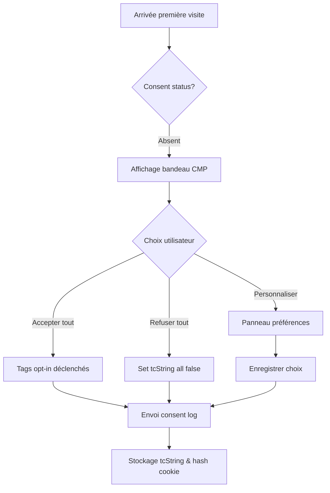

# Procédure Opérationnelle – Gestion des Cookies & Consentements

**Version :** 1.0
**Date d’application :** 1 août 2025
**Propriétaire :** Data Protection Officer (DPO)

---

## 1. Objectif

Mettre en œuvre un dispositif conforme aux exigences **RGPD** et **ePrivacy** (directive 2002/58/CE, délibération CNIL n°2020‑092) pour :

* recueillir, enregistrer et prouver le **consentement** des visiteurs du site web et de l’application mobile Neo Financia ;
* permettre la **gestion granulaire** des préférences et leur retrait à tout moment ;
* assurer la **minimisation** des traceurs non nécessaires avant acceptation.

---

## 2. Portée

* Domaine public : `https://www.neofinancia.com` et sous‑domaines (`app.`, `blog.`)
* Applications mobiles iOS & Android (WebView + SDK).
* Catégories de traceurs : cookies HTTP, local storage, SDK analytics/pub, pixels externes.
* Exclusions : Cookies strictement nécessaires (session, panier, authentification SCA).

---

## 3. Gouvernance & rôles

| Rôle                       | Responsabilités                                                                    |
| -------------------------- | ---------------------------------------------------------------------------------- |
| **DPO**                    | Définit cadres légaux, approuve cette procédure, conserve preuves de consentement. |
| **Marketing Digital**      | Configure la CMP, gère les tags dans GTM, contrôle finalités.                      |
| **Développeurs Front‑end** | Implémentent déclencheurs `dataLayer` et APIs CMP.                                 |
| **CISO**                   | Vérifie sécurité des tags tiers et intégrité script CMP.                           |
| **Audit interne**          | Contrôle conformité tous les 6 mois.                                               |

---

## 4. Architecture technique

| Élément            | Description                                                                                 |
| ------------------ | ------------------------------------------------------------------------------------------- |
| **CMP**            | Didomi SaaS – mode IAB TCF v2.2, fibres FR + EU pour stockage consent logs.                 |
| **Tag Manager**    | Google Tag Manager (serveur + web container) – déclenchement conditionnel par `tcString`.   |
| **Consent Log DB** | PostgreSQL AWS RDS – table `consent_log` (visitor\_id, tcString\_hash, timestamp, version). |
| **Mobile SDK**     | Didomi SDK v2.0 intégré, consent synchronisé via API REST `/sync-consent`.                  |
| **DataLayer**      | `window.dataLayer.push({event:'cmp_event',cmpStatus:'ok',purpose1:true,…})`.                |

---

## 5. Catégories & finalités

| Finalité CNIL              | Exemple Tags                        | Base légale                                              |
| -------------------------- | ----------------------------------- | -------------------------------------------------------- |
| **Mesure d’audience**      | GA4, Matomo                         | Consentement                                             |
| **Personnalisation pub**   | Google Ads, Facebook Pixel          | Consentement                                             |
| **Réseaux sociaux**        | LinkedIn Insight                    | Consentement                                             |
| **Fonctionnel**            | Chatbot Intercom                    | Intérêt légitime (paramétré comme optionnel si tracking) |
| **Strictement nécessaire** | Cookie session `SID`, load balancer | Exemption                                                |

---

## 6. Flux utilisateur

### 6.1 Affichage bandeau

* Doit recouvrir **au moins 1/3** de la hauteur écran sur mobile (obligation CNIL).
* Boutons : « Accepter tout », « Refuser tout », « Personnaliser ».
* Pas de cookies non nécessaires pré‑déposés avant choix (vérifié via script `preConsentBlocker.js`).

### 6.2 Enregistrement du consentement

* Le `tcString` complet est stocké côté navigateur (`euconsent‑v2` cookie – TTL = 6 mois) + hash SHA‑256 dans RDS (preuve).
* Zone horaire Europe/Paris, champs : `visitor_id` (UUID v4 stocké en first‑party cookie), `version_cmp`, `timestamp`, `geo`.

### 6.3 Retrait / modification

* Lien « Gérer mes cookies » dans footer permanent.
* API `didomi.setUserConsentStatus(false, purposeId)` expose changement ; suppression des tags via `window['ga-disable-UA-XXXX']=true`.
* Log update écrit dans `consent_log` (`is_revoked=true`).

---

## 7. Procédure opérationnelle

| Étape                                                    | Responsable   | Outil                   | Délai              |
| -------------------------------------------------------- | ------------- | ----------------------- | ------------------ |
| 1. Mettre à jour **liste des vendors** trimestrielle     | Marketing     | CMP Didomi              | J+0                |
| 2. Publier nouvelle version CMP (v +0.1)                 | Marketing     | CMP                     | <24 h              |
| 3. Ajouter/supprimer tag dans GTM                        | Dev Front     | GTM PR                  | Avant mise en prod |
| 4. Vérifier blocage pré‑consentement (preProd)           | CISO          | Script Cypress test     | Pré‑GoLive         |
| 5. Exécuter test CNIL automatisé (`tarteaucitron-check`) | DevOps        | GitLab CI               | À chaque release   |
| 6. Export mensuel consent logs CSV                       | DPO           | Lambda `export_logs.py` | Mensuel            |
| 7. Audit semi‑annuel conformité                          | Audit interne | Checklist COOK‑01       | 2×/an              |

---

## 8. Journalisation & conservation

| Enregistrement            | Format                             | Rétention                |
| ------------------------- | ---------------------------------- | ------------------------ |
| `consent_log`             | UUID, tcHash, ip\_trunc, timestamp | 6 ans (coffre‑fort WORM) |
| GTM Server logs           | JSON                               | 13 mois                  |
| PreConsentBlocker reports | CSV                                | 24 mois                  |

---

## 9. Supervision & alertes

| Alarme                          | Seuil        | Action                       |
| ------------------------------- | ------------ | ---------------------------- |
| `% visites sans tcString` >5 %  | Rolling 24 h | Alerte Slack #privacy‑alerts |
| `blocked_before_consent` <100 % | Test CI      | Build fail                   |
| Export logs KO                  | Cron daily   | PagerDuty DevOps             |

---

## 10. RACI

| Activité               | DPO | Marketing | Dev Front | CISO | Audit |
| ---------------------- | --- | --------- | --------- | ---- | ----- |
| Définir finalités      | A   | R         | C         | C    | I     |
| Configurer CMP         | C   | R         | I         | C    | I     |
| Implémenter tags GTM   | I   | C         | R         | C    | I     |
| Vérif. sécurité script | I   | I         | C         | R    | C     |
| Export logs & preuve   | R   | I         | I         | C    | I     |
| Audit semi‑annuel      | C   | I         | I         | C    | R     |

---

## 11. KPI & reporting

| KPI                                | Cible  | Source               |
| ---------------------------------- | ------ | -------------------- |
| Consent acceptance rate (all)      | ≈ 70 % | CMP dashboard        |
| Opt‑out rate après consentement    | <5 %   | `consent_log` query  |
| Visites sans bannière visible >2 s | 0 %    | Synthetic monitoring |

Rapport trimestriel « Cookie & Consent » généré PowerBI présenté Comité Conformité.

---

## 12. Tests & validation continue

* **CI/CD** : pipeline GitLab déclenche script Playwright headless pour vérifier non‑déclenchement GA4 avant opt‑in.
* **Monitoring visuel** : Screenshot comparaison Percy de la bannière tous navigateurs cibles.
* **User acceptance test** : panel interne 10 utilisateurs, 100 % parcours OK avant major release.

---

## 13. Procédure de changement

Toute introduction de **nouveau tag** exige :

1. **Fiche d’évaluation** Privacy (form COOK‑NEW) ;
2. Signature DPO/CISO ;
3. Mise à jour CMP finalités + Politique Cookies ;
4. PR GitLab validée par Dev Lead et Marketing.

---

## 14. Historique des versions

| Version | Date       | Auteur               | Commentaire        |
| ------- | ---------- | -------------------- | ------------------ |
| 1.0     | 01/06/2025 | DPO & Marketing Lead | Création initiale. |
