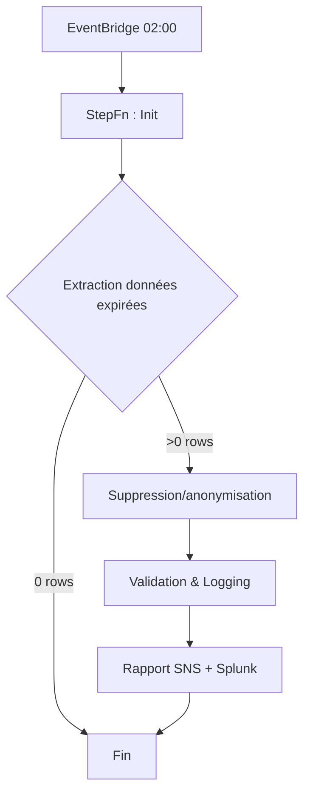

# Procédure Opérationnelle – Purge Automatique RGPD

**Version :** 1.0
**Date d’application :** 1 août 2025
**Propriétaire :** Data Protection Officer (DPO)

---

## 1. Objectif

Mettre en œuvre un mécanisme technique **automatisé, traçable et réversible** de suppression ou d’anonymisation des données à caractère personnel arrivées à échéance de conservation, conformément à la **Politique RGPD** et aux durées définies au §4.1 du document de référence.

---

## 2. Portée

* Bases de données : PostgreSQL Core Banking, MySQL CRM, MongoDB Logs, S3 Data Lake.
* Environnements : Production + pré‑production (dry‑run).
* Catégories de données visées : KYC expiré, logs d’accès > 12 mois, cookies analytiques bruts, tickets support > 5 ans, enregistrements chat > 24 mois, etc.
* Exclusions : données sous **hold légal** (flag `legal_hold = true`).

---

## 3. Architecture & composants

| Élément             | Description                                                                 |
| ------------------- | --------------------------------------------------------------------------- |
| **Scheduler**       | AWS EventBridge règle cron `cron(0 2 * * ? *)` (02 h 00 CET).               |
| **Orchestrateur**   | AWS Step Functions « GDPR‑Purge‑Flow » (5 étapes).                          |
| **Jobs Lambda**     | `gdpr_extract.py`, `gdpr_delete.py`, `gdpr_anonymize.py`, `gdpr_notify.py`. |
| **Secrets Manager** | Stockage des identifiants DB (rotation 90 j).                               |
| **Splunk HEC**      | Réception logs JSON (niveau INFO/ERROR).                                    |
| **SNS Topic**       | Notifications succès/échec ➜ DPO, CISO, DBA.                                |

---

## 4. Flux détaillé

### 4.1 Étape 1 : Initialisation

* Récupération des **dates d’échéance** par requête `SELECT * FROM retention_metadata`.
* Construction du **context** Step Functions (JSON).

### 4.2 Étape 2 : Extraction (`gdpr_extract.py`)

* Pour chaque dataset, exécute la requête paramétrée :`DELETE_PREVIEW` (LIMIT 10 000).
* Stocke le résultat dans S3 bucket `gdpr-purge-staging/YYYY/MM/DD/` pour audit.

### 4.3 Étape 3 : Suppression / anonymisation (`gdpr_delete.py`, `gdpr_anonymize.py`)

* **Suppression physique** : utilisation de `DELETE … RETURNING` pour PostgreSQL ; résultat loggé.
* **Anonymisation** (si exigé) : mise à zeroisation (`UPDATE table SET firstname='∅',lastname='∅',email=SHA256(UUID()) …`).

### 4.4 Étape 4 : Validation

* Vérifie nombre de lignes affectées =`expected_count` depuis fichier staging.
* Si écart > 1 %, déclenche rollback (transaction RDS) + alerte **P1**.

### 4.5 Étape 5 : Notifications

* Envoie un e‑mail /SMS via SNS avec : dataset, rows\_deleted, rows\_anonymized, durée exécution.
* Publie métriques CloudWatch ➜ dashboard **GDPR‑Purge‑KPI**.

---

## 5. Journalisation & audit

| Source                    | Contenu                                                                     | Rétention |
| ------------------------- | --------------------------------------------------------------------------- | --------- |
| Splunk index `gdpr_purge` | Hash dataset, nb enregistrements, UserArn Exec, timestamp, checksum staging | 5 ans     |
| S3 staging                | Échantillon anonymisé (CSV)                                                 | 30 jours  |
| CloudTrail                | Appels Lambda/Delete                                                        | 5 ans     |

---

## 6. Rollback & résilience

* Chaque job `DELETE` est exécuté **dans une transaction** ; en cas d’échec validation, `ROLLBACK`.
* **Snapshots RDS** automatiques quotidiens ➜ conservation 7 jours ; restauration point‑in‑time possible.
* L’exécution StepFn est **idempotente** (UUID runID) : si `Status = FAILED`, un retry manuel via console est autorisé (max 1).

---

## 7. Supervision & alertes

| Alarme CloudWatch       | Seuil                     | Action                         |
| ----------------------- | ------------------------- | ------------------------------ |
| `PurgeFailureCount >=1` | Immédiat                  | Alerte PagerDuty – DBA on‑call |
| `RowsDeletedMismatch`   | >1 % diff                 | Escalade DPO + CISO            |
| `Duration >30 min`      | 2 exécutions consécutives | Créer ticket Jira OPS‑SEC      |

Dashboards Grafana : `gdpr_purge_success_rate`, `rows_deleted_day`, `latency`.

---

## 8. RACI

| Activité                   | DPO | CISO | DevOps | DBA | Application Owner |
| -------------------------- | --- | ---- | ------ | --- | ----------------- |
| Définir règles rétention   | A   | C    | I      | I   | R                 |
| Maintien code Lambda       | I   | C    | R      | I   | I                 |
| Surveillance alertes       | C   | R    | R      | R   | I                 |
| Validation purge mensuelle | A   | C    | I      | R   | I                 |

Légende : **R** = Réalise, **A** = Approuve, **C** = Consulté, **I** = Informé

---

## 9. KPI & reporting

| KPI                          | Cible  | Source                      |
| ---------------------------- | ------ | --------------------------- |
| **Purge Success Rate**       | ≥ 99 % | CloudWatch Metric `Success` |
| **MTTR purge**               | ≤ 4 h  | PagerDuty incidents         |
| **Row mismatch**             | 0 %    | Lambda validation           |
| **Exécutions en échec/mois** | < 1    | StepFn stats                |

Rapport mensuel PDF généré via Lambda ➜ SharePoint *Compliance / GDPR Purge Reports*.

---

## 10. Procédure de changement

* Toute modification de la règle cron, du code Lambda ou des règles de conservation doit suivre le **processus DevSecOps** (pull request GitLab, revue DPO & CISO, pipeline CI/CD).
* Tests : exécution en environnement **pre‑prod** avec flag `dry_run=True`, comparaison row count.

---

## 11. Historique des versions

| Version | Date       | Auteur      | Commentaire        |
| ------- | ---------- | ----------- | ------------------ |
| 1.0     | 01/06/2025 | DevOps Lead | Création initiale. |
