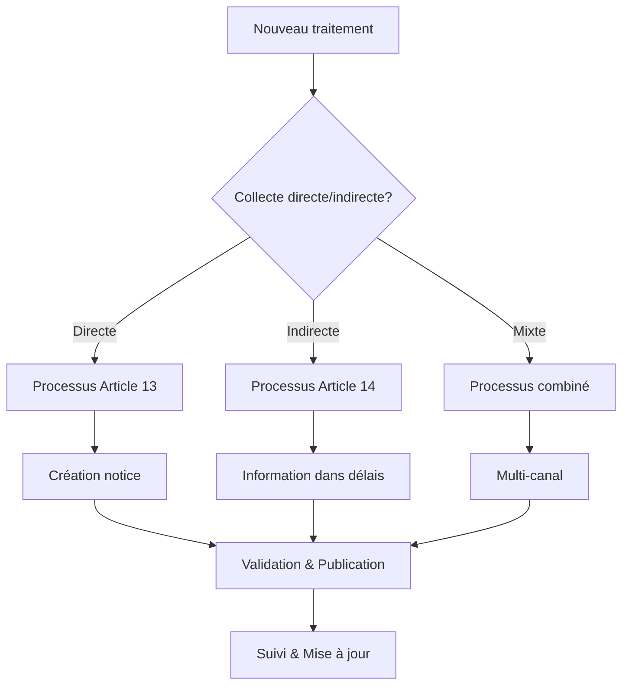
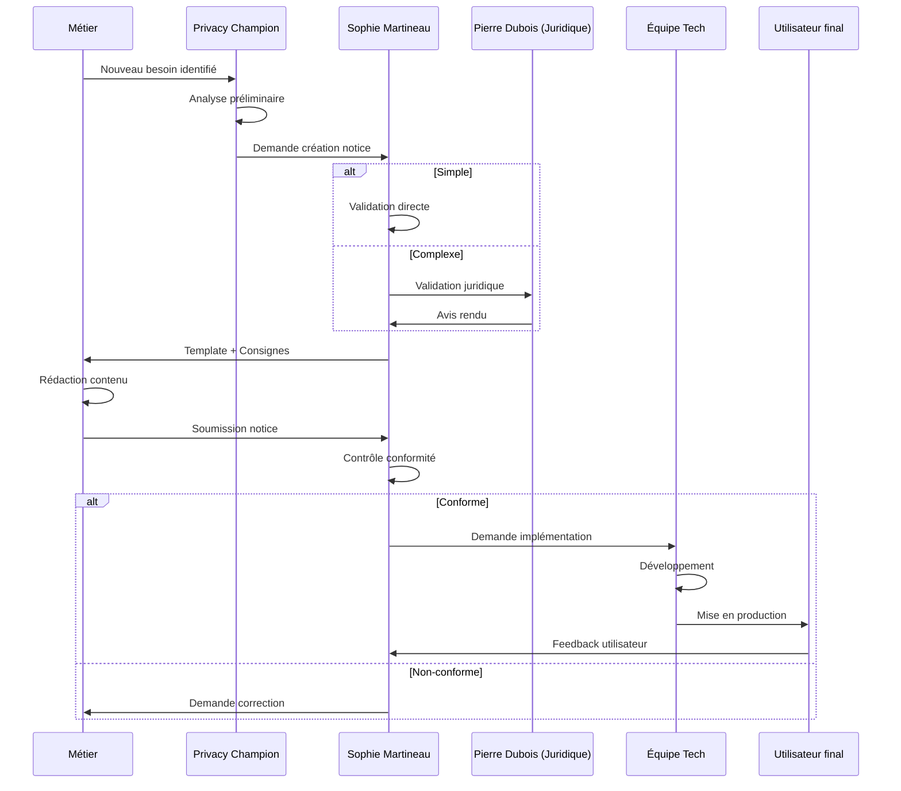
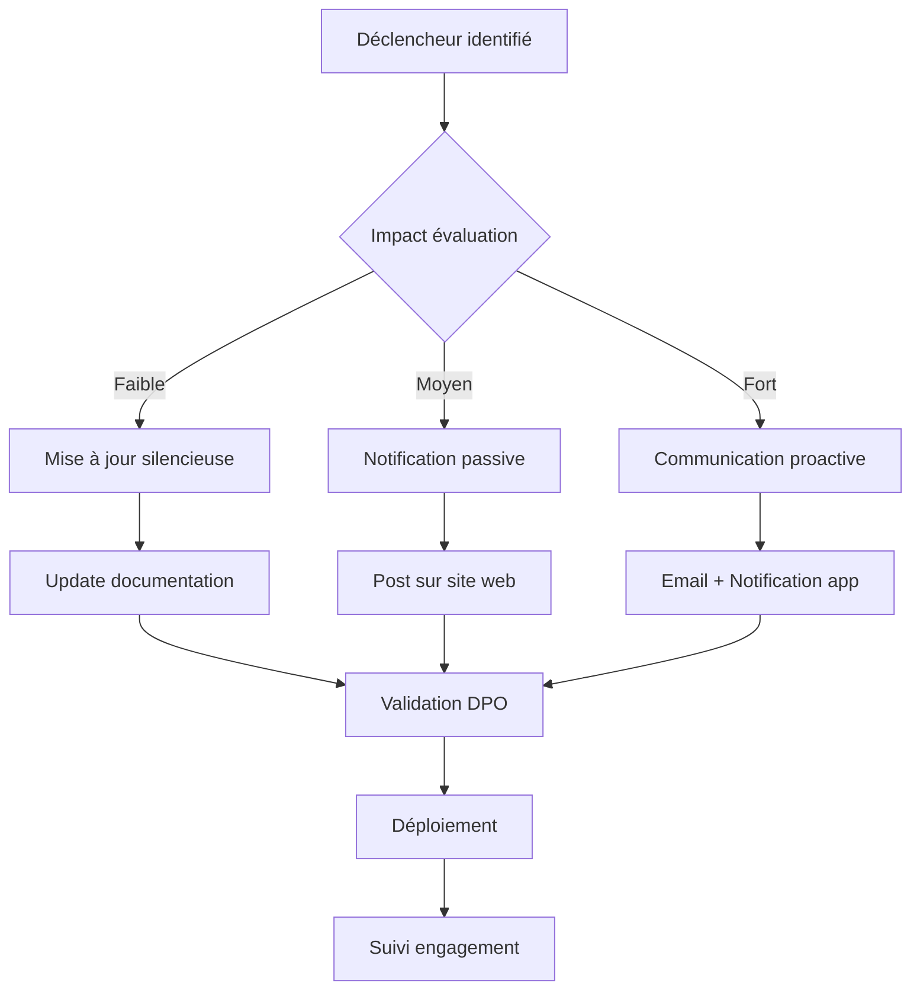
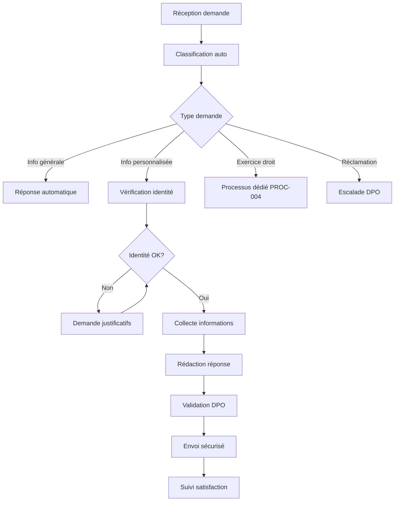
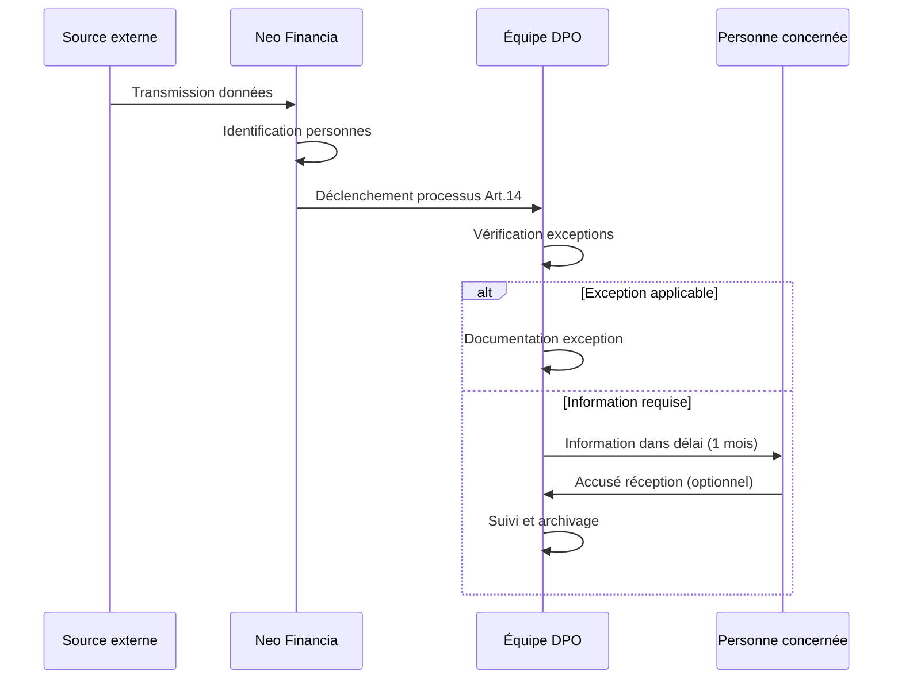

# Processus d'Information et de Transparence RGPD

| Champ | Valeur |
|-------|--------|
| **RÉFÉRENCE** | PROC-PRIVACY-002 |
| **CLASSIFICATION** | INTERNE |
| **VERSION** | 1.0 |
| **DATE D'APPROBATION** | 09 juin 2025 |
| **PROPRIÉTAIRE** | Équipe Protection des Données |
| **PÉRIODICITÉ DE RÉVISION** | Trimestrielle |

## Approbation

| Rôle | Nom | Date |
|------|-----|------|
| DPO | Sophie Martineau | 09/06/2025 |
| RSSI | Marc Lecomte | 09/06/2025 |

---

**Processus d'Information et de Transparence RGPD**  
*Workflows opérationnels et outils*

## 1. Cartographie des processus

### 1.1 Vue d'ensemble



### 1.2 Processus principaux identifiés

| Processus | Code | Responsable | Fréquence |
|-----------|------|-------------|-----------|
| **Création notice d'information** | PROC-001 | Privacy Champion + DPO | À la demande |
| **Mise à jour notices existantes** | PROC-002 | DPO + Métiers | Mensuelle |
| **Traitement demandes information** | PROC-003 | Équipe DPO | Quotidienne |
| **Information collecte indirecte** | PROC-004 | Métiers + DPO | Hebdomadaire |
| **Audit conformité information** | PROC-005 | DPO | Trimestrielle |

## 2. PROC-001 : Création notice d'information

### 2.1 Workflow détaillé



### 2.2 Points de contrôle

| Étape | Contrôle | Responsable | Critère de validation |
|-------|----------|-------------|----------------------|
| **1. Expression besoin** | Justification nécessité | Privacy Champion | Nouveau traitement documenté |
| **2. Analyse impact** | Classification RGPD | DPO | Article 13/14 identifié |
| **3. Rédaction** | Conformité template | Métier | Structure respectée |
| **4. Validation contenu** | Exhaustivité légale | DPO | Checklist 100% |
| **5. Validation juridique** | Risque juridique | Direction Juridique | Avis favorable |
| **6. Implémentation** | Conformité technique | RSSI | Tests fonctionnels OK |
| **7. Mise en production** | Accessibilité | Product Owner | WCAG 2.1 respecté |

### 2.3 Outils et systèmes

**Système de gestion documentaire :**

- **Outil principal** : SharePoint Neo Financia
- **Dossier** : `/Compliance/Privacy/Notices/`
- **Versioning** : Automatique avec horodatage
- **Accès** : Privacy Champions + DPO + Métiers concernés

**Template automatisé :**

```
Notice Generator Neo Financia v2.1

=== INFORMATIONS OBLIGATOIRES ===
1. Responsable traitement : [Auto-rempli : Neo Financia]
2. DPO Contact : [Auto-rempli : dpo@neofinancia.eu]
3. Finalités : [À compléter par métier]
4. Base légale : [Liste déroulante Art.6 RGPD]
5. Destinataires : [Sélection multiple prédéfinie]
6. Conservation : [Grille automatique selon type]
7. Droits : [Auto-générés selon contexte]

=== VALIDATION AUTOMATIQUE ===
☐ Tous champs obligatoires remplis
☐ Score lisibilité > 60
☐ Longueur < 500 mots (notice courte)
☐ Liens fonctionnels vérifiés

=== EXPORT ===
☐ HTML responsive
☐ PDF accessible
☐ JSON (API)
```

### 2.4 Délais et SLA

| Phase | Délai standard | Délai maximum | Responsable |
|-------|----------------|---------------|-------------|
| **Expression besoin → Analyse** | 2 jours | 5 jours | Privacy Champion |
| **Analyse → Rédaction** | 3 jours | 7 jours | Métier |
| **Rédaction → Validation DPO** | 2 jours | 5 jours | DPO |
| **Validation → Implémentation** | 5 jours | 10 jours | IT |
| **Implémentation → Production** | 2 jours | 5 jours | DevOps |
| **TOTAL** | **14 jours** | **32 jours** | - |

## 3. PROC-002 : Mise à jour notices existantes

### 3.1 Déclencheurs automatiques

**Système de surveillance :**

```python
# Pseudo-code du système d'alerte
class PrivacyNoticeMonitor:
    def __init__(self):
        self.triggers = [
            'registry_update',      # Modification registre traitements
            'partner_change',       # Nouveau partenaire/sous-traitant
            'regulation_update',    # Évolution réglementaire
            'data_breach',          # Incident nécessitant mise à jour
            'user_feedback',        # Signalement utilisateur
            'periodic_review'       # Revue trimestrielle
        ]
    
    def check_update_needed(self, treatment_id):
        # Vérification automatique des déclencheurs
        # Alerte envoyée au DPO si action requise
        pass
```

**Dashboard de suivi :**

- **Outil** : Tableau de bord Power BI
- **Métriques** :
  - Notices obsolètes (>6 mois sans révision)
  - Notifications en attente
  - Délais de mise à jour moyens
  - Taux de conformité par métier

### 3.2 Workflow de mise à jour



### 3.3 Communication selon impact

**Impact faible (mise à jour technique) :**
- Modification silencieuse de la documentation
- Mention dans newsletter mensuelle privacy
- Pas de communication individuelle

**Impact moyen (nouveau destinataire) :**
- Notification dans l'espace client
- Bandeau temporaire sur site web
- Mention dans prochaine communication client

**Impact fort (nouvelle finalité) :**
- Email personnalisé à tous les concernés
- Push notification mobile
- Courrier si données sensibles Art.9

### 3.4 Templates de communication

**Email mise à jour majeure :**

```html
<!DOCTYPE html>
<html>
<head>
    <meta charset="UTF-8">
    <title>Mise à jour - Protection de vos données</title>
</head>
<body style="font-family: Arial, sans-serif; max-width: 600px;">
    
    <header style="background: #0066CC; color: white; padding: 20px;">
        <h1>📢 Mise à jour importante</h1>
        <p>Protection de vos données personnelles</p>
    </header>
    
    <main style="padding: 20px;">
        <p>Bonjour {{prenom}},</p>
        
        <p>Nous mettons à jour notre politique de confidentialité 
           pour {{raison_principale}}.</p>
        
        <div style="background: #f5f5f5; padding: 15px; margin: 20px 0;">
            <h3>📋 Principales modifications :</h3>
            <ul>
                {{#modifications}}
                <li>{{description}}</li>
                {{/modifications}}
            </ul>
        </div>
        
        <div style="background: #e8f4fd; padding: 15px; margin: 20px 0;">
            <h3>🔍 Ce qui change pour vous :</h3>
            <p>{{impact_client}}</p>
        </div>
        
        <div style="text-align: center; margin: 30px 0;">
            <a href="{{lien_politique}}" 
               style="background: #0066CC; color: white; padding: 12px 24px; 
                      text-decoration: none; border-radius: 4px;">
                📖 Consulter la politique complète
            </a>
        </div>
        
        <p><strong>Vos droits restent inchangés :</strong><br>
           Accès, rectification, effacement, portabilité, opposition</p>
        
        <p>Questions ? <a href="mailto:dpo@neofinancia.eu">dpo@neofinancia.eu</a></p>
        
        <p><em>Cette mise à jour entre en vigueur le {{date_effet}}.</em></p>
    </main>
    
    <footer style="background: #f0f0f0; padding: 15px; font-size: 12px;">
        <p>Neo Financia - Néobanque européenne</p>
        <p><a href="{{lien_desinscription}}">Se désabonner</a> | 
           <a href="{{lien_preferences}}">Gérer mes préférences</a></p>
    </footer>
    
</body>
</html>
```

## 4. PROC-003 : Traitement demandes d'information

### 4.1 Système de ticketing

**Outil principal :** Freshdesk Privacy

- **File dédiée** : privacy@neofinancia.eu
- **Auto-assignment** : Équipe DPO (3 personnes)
- **SLA configuré** : 48h accusé, 30 jours résolution
- **Escalade** : Auto vers Sophie Martineau si >15 jours

### 4.2 Classification automatique

```python
class RequestClassifier:
    def classify_request(self, email_content):
        categories = {
            'general_info': ['politique', 'confidentialité', 'données'],
            'personal_data': ['mes données', 'quelles informations'],
            'rights_exercise': ['accès', 'rectification', 'suppression'],
            'complaint': ['plainte', 'insatisfait', 'problème']
        }
        
        # Classification par mots-clés + ML
        # Affectation automatique selon catégorie
        return category, priority, estimated_complexity
```

### 4.3 Workflow de traitement



### 4.4 Templates de réponse

**Accusé de réception automatique :**

```
Objet : [TICKET #{{numero}}] Accusé de réception - Demande d'information

Bonjour,

Nous avons bien reçu votre demande d'information concernant 
vos données personnelles.

📋 Votre demande :
- Référence : {{numero_ticket}}
- Date : {{date_reception}}
- Type : {{type_demande}}

⏱️ Délai de traitement :
Nous vous répondrons dans un délai maximum de 30 jours.

🔐 Vérification d'identité :
{{#if verification_requise}}
Pour la sécurité de vos données, nous pourrions vous demander 
de vérifier votre identité avant de vous répondre.
{{/if}}

❓ Questions ?
N'hésitez pas à répondre à cet email.

Cordialement,
L'équipe Protection des Données
Sophie Martineau, DPO
dpo@neofinancia.eu
```

## 5. PROC-004 : Information collecte indirecte

### 5.1 Sources de collecte indirecte chez Neo Financia

| Source | Type données | Fréquence | Processus |
|--------|--------------|-----------|-----------|
| **Mangopay** | Données transactionnelles | Temps réel | API automatisée |
| **Lemonway** | Données KYC complémentaires | Hebdomadaire | Batch processing |
| **Bureaux de crédit** | Scoring, incidents | Mensuelle | Requête manuelle |
| **Registres publics** | SIRENE, RCS | Trimestrielle | Mise à jour auto |
| **Partenaires commerciaux** | Leads qualifiés | Continue | Campagnes marketing |

### 5.2 Workflow d'information Article 14



### 5.3 Base de données de suivi

```sql
CREATE TABLE indirect_collection_log (
    id SERIAL PRIMARY KEY,
    source_name VARCHAR(100) NOT NULL,
    data_categories TEXT[] NOT NULL,
    collection_date DATE NOT NULL,
    persons_count INTEGER,
    notification_sent BOOLEAN DEFAULT FALSE,
    notification_date DATE,
    exception_applied VARCHAR(10), -- 14.5.a, 14.5.b, etc.
    exception_justification TEXT,
    created_by VARCHAR(50),
    created_at TIMESTAMP DEFAULT NOW()
);
```

**Dashboard de suivi :**

- Nombre de personnes à informer par source
- Délais restants avant échéance
- Taux d'information réalisé
- Exceptions appliquées et justifications

### 5.4 Template information Art.14

```
Objet : Information - Traitement de vos données personnelles par Neo Financia

Madame, Monsieur,

Neo Financia a récemment obtenu certaines de vos données personnelles 
dans le cadre de ses activités bancaires.

📊 DONNÉES CONCERNÉES
- Catégories : {{categories_donnees}}
- Source : {{source_identification}}
- Date d'obtention : {{date_collecte}}

🎯 UTILISATION
- Finalité : {{finalite_traitement}}
- Base légale : {{base_legale}}
- Durée de conservation : {{duree_conservation}}

👥 PARTAGE
{{#if destinataires}}
Vos données peuvent être partagées avec : {{destinataires}}
{{/if}}

🌍 TRANSFERTS
{{#if transferts}}
Transferts vers : {{pays_transferts}}
Garanties : {{garanties_transferts}}
{{/if}}

⚖️ VOS DROITS
Vous disposez des droits suivants :
- Accès à vos données
- Rectification des données inexactes
- Effacement sous conditions
- Limitation du traitement
- Portabilité des données
- Opposition au traitement

📧 CONTACT
Questions ? dpo@neofinancia.eu
Exercice de vos droits : neofinancia.eu/mes-droits

📋 PLUS D'INFORMATIONS
Consultez notre politique complète : neofinancia.eu/confidentialite

Cordialement,
L'équipe Neo Financia
```

## 6. PROC-005 : Audit conformité information

### 6.1 Planning d'audit

**Cycle trimestriel :**

- **T1** : Audit conformité Articles 12-14
- **T2** : Audit qualité et lisibilité
- **T3** : Audit technique et accessibilité
- **T4** : Audit satisfaction utilisateur

### 6.2 Méthodes d'audit

**Audit automatisé :**

```python
class PrivacyComplianceAuditor:
    def audit_notice_completeness(self, notice_id):
        required_elements = {
            'art13': [
                'controller_identity', 'dpo_contact', 'purposes', 
                'legal_basis', 'recipients', 'retention', 'rights'
            ],
            'art14': [
                'data_categories', 'data_source', 'notification_timing'
            ]
        }
        
        # Vérification présence de chaque élément
        # Score de conformité calculé
        return compliance_score, missing_elements
    
    def audit_accessibility(self, url):
        # Tests automatisés WCAG 2.1
        # Contraste, navigation clavier, alt text
        return accessibility_score, issues_found
```

**Audit manuel - Échantillonnage :**

- 20 notices créées/modifiées dans le trimestre
- 5 demandes d'information traitées par type
- 10 cas de collecte indirecte
- Tests utilisateur sur 3 parcours types

### 6.3 Tableau de bord de conformité

**KPIs surveillés :**

| Indicateur | Calcul | Cible | Alerte si |
|------------|--------|-------|----------|
| **Complétude notices** | Éléments présents / Requis | 100% | <95% |
| **Délai information Art.14** | Moyenne jours notification | <30 jours | >45 jours |
| **Satisfaction demandes info** | Note moyenne sur 10 | >8.0 | <7.0 |
| **Accessibilité WCAG** | % pages conformes | 100% | <95% |
| **Lisibilité Flesch** | Score moyen | >60 | <50 |

**Reporting mensuel :**

```
RAPPORT CONFORMITÉ INFORMATION - {{mois}} {{annee}}

=== RÉSUMÉ EXÉCUTIF ===
✅ Conformité globale : {{score_global}}/100
🔄 Notices créées : {{nb_notices_nouvelles}}
📧 Demandes traitées : {{nb_demandes}}
⚠️ Alertes en cours : {{nb_alertes}}

=== DÉTAIL PAR INDICATEUR ===
[Tableaux et graphiques détaillés]

=== ACTIONS CORRECTIVES ===
[Liste des actions en cours et planifiées]

=== RECOMMANDATIONS ===
[Axes d'amélioration identifiés]

Rapport établi par : {{auditeur}}
Date : {{date_rapport}}
```

## 7. Outils et technologies

### 7.1 Stack technologique

**Frontend (Notices utilisateur) :**
- **Framework** : React.js + TypeScript
- **Accessibilité** : React-aria, axe-core
- **Analytics** : Matomo (privacy-friendly)
- **A/B Testing** : Optimizely (pour tests notices)

**Backend (API Information) :**
- **API REST** : Node.js + Express
- **Base de données** : PostgreSQL
- **Cache** : Redis pour réponses fréquentes
- **Files d'attente** : RabbitMQ pour traitements async

**Outils de gestion :**
- **CMS** : Strapi pour gestion notices
- **Ticketing** : Freshdesk pour demandes
- **Analytics** : Power BI pour dashboards
- **Documentation** : Confluence pour procédures

### 7.2 APIs développées

**API Notice Generation :**

```javascript
// Endpoint de génération automatique
POST /api/privacy/notices/generate
{
  "treatment_id": "TRT-001-2025",
  "collection_type": "direct|indirect",
  "data_categories": ["identity", "contact", "financial"],
  "purposes": ["contract", "legal_obligation"],
  "legal_basis": ["6.1.b", "6.1.c"],
  "audience": "customer|employee|partner"
}

Response: {
  "notice_id": "NOT-001-2025",
  "html_content": "<div class='privacy-notice'>...</div>",
  "compliance_score": 98,
  "missing_elements": [],
  "review_required": false
}
```

**API Information Requests :**

```javascript
// Endpoint traitement demandes
POST /api/privacy/information-requests
{
  "requester_email": "client@example.com",
  "request_type": "personal_data|general_info|clarification",
  "authentication_level": "basic|standard|enhanced",
  "message": "Je souhaite connaître quelles données..."
}

Response: {
  "ticket_id": "PRIV-2025-001234",
  "estimated_response_time": "15 days",
  "verification_required": true,
  "status": "pending_verification"
}
```

### 7.3 Monitoring et alertes

**Système d'alertes temps réel :**

```yaml
alerts:
  - name: "notice_compliance_drop"
    condition: "compliance_score < 95"
    severity: "warning"
    notification: ["dpo@neofinancia.eu"]
    
  - name: "response_time_exceeded"
    condition: "avg_response_time > 20_days"
    severity: "critical"
    notification: ["dpo@neofinancia.eu", "compliance@neofinancia.eu"]
    
  - name: "accessibility_issue"
    condition: "wcag_score < 95"
    severity: "high"
    notification: ["dpo@neofinancia.eu", "tech-lead@neofinancia.eu"]
```

## 8. Métriques et amélioration continue

### 8.1 Tableaux de bord opérationnels

**Dashboard Temps Réel (pour équipe DPO) :**
- File d'attente demandes information
- Délais moyens par type de demande
- Taux de satisfaction temps réel
- Alertes compliance en cours

**Dashboard Directorial (mensuel) :**
- Évolution compliance globale
- Volume de demandes par mois
- Incidents et actions correctives
- Benchmarks sectoriels

### 8.2 Programme d'amélioration

**Roadmap 2025-2026 :**

| Trimestre | Objectif | Actions |
|-----------|----------|---------|
| **Q3 2025** | Automatisation poussée | IA générative pour rédaction notices |
| **Q4 2025** | Multilingue | Support 5 langues européennes |
| **Q1 2026** | Self-service avancé | Portail complet gestion données |
| **Q2 2026** | Prédictif | ML pour anticipation besoins info |

**Tests d'innovation :**
- Chatbot DPO pour questions simples
- Voice UI pour personnes malvoyantes
- Blockchain pour preuves d'information
- AR/VR pour formation immersive équipes

---

**Document validé par :**

- Sophie Martineau, DPO - 09/06/2025
- Marc Lecomte, RSSI - 09/06/2025
- Amélie Bernard, Product Owner Privacy - 09/06/2025

**Prochaine révision :** 09 septembre 2025  
**Classification :** Interne - Diffusion équipes Privacy, Métiers, IT
